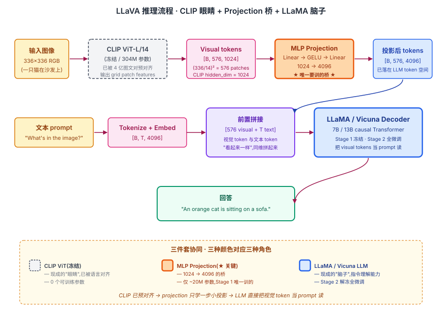
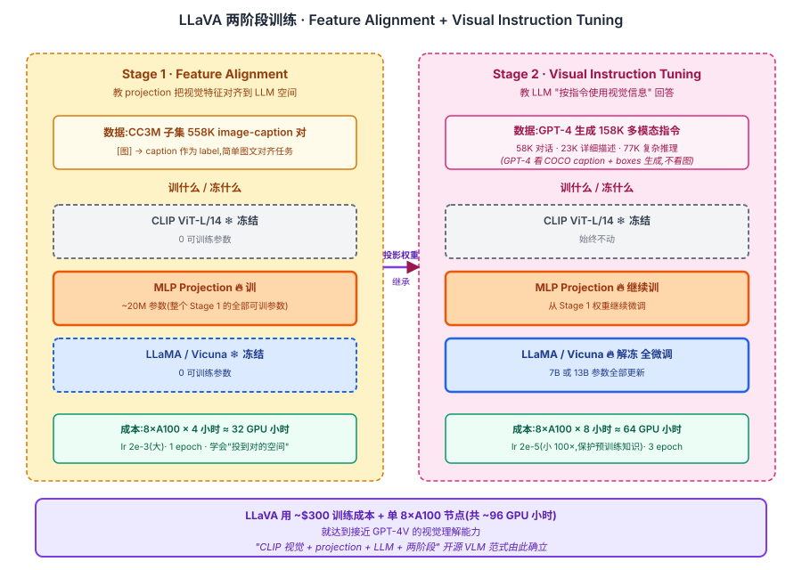

## 前作进展

到 2023 年初,VLM 领域出现一个明显矛盾:

**闭源前沿** —— OpenAI 在 2023 年 3 月发布 GPT-4 时附带演示了 GPT-4V(视觉版),展示惊人的多模态能力(读图答题、看图编程、分析图表、视觉推理)。但 **GPT-4V 闭源,且要到 2023 年 9 月才开放 API**

**开源现状** —— 已有开源 VLM(BLIP-2, MiniGPT-4)主要做 captioning 和简单 VQA,**不能做对话、指令跟随、复杂推理**。没有任何开源模型能接近 GPT-4V 的能力

社区急需 GPT-4V 风格的"视觉助手"——能对图像进行自然对话、回答开放问题、按指令做视觉任务。但训这种模型有两个核心问题:

**1. 缺少视觉指令数据** —— [InstructGPT](../12-rlhf-alignment/02-instructgpt.md) 用大量人工写的 instruction-following 数据训出 ChatGPT。**视觉版数据集**几乎不存在——之前的 VLM 数据都是 caption 或简单 QA,不是"按指令完成任务"形式

**2. 训练计算预算受限** —— BLIP-2 / Flamingo 等都还是 200M+ 参数训练,小实验室也不容易承担

威斯康星麦迪逊 + 微软研究院的 Liu 等人 2023 年 4 月发表 *Visual Instruction Tuning*(LLaVA)给出两件事的解法:

**1. 用 GPT-4 生成视觉指令数据** —— 既然没人写过视觉指令数据,**让 GPT-4 看图片的 caption + bounding box,自动生成 (指令, 回答) 对**。生成的 158K 条数据覆盖对话、复杂推理、详细描述三类

**2. 极简架构** —— 用预训练 CLIP ViT 做视觉编码器,**用单层 linear projection** 把视觉特征接到 LLaMA。没有 Q-Former、没有 Perceiver Resampler、没有 cross-attention 注入——就是把视觉 tokens 作为前置 prompt 喂给 LLM

LLaVA 用这两件事训出第一个开源的 GPT-4V 风格视觉助手。LLaVA-7B 在 90 GPU 小时(8 A100 × 12 小时)就能训完,**对比 BLIP-2 的 16 A100 × 9 天降 10×**。质量上 LLaVA 在科学问答(ScienceQA)上 92.5%,接近 GPT-4 的 84.9%(GPT-4 没看图,LLaVA 看了图)。

LLaVA 的发布(开源代码 + 数据 + 模型权重)在 2023 年 4 月引爆了开源 VLM 浪潮——MiniGPT-4、Otter、mPLUG-Owl、Qwen-VL、InternLM-XComposer、Yi-VL 等几十个开源 VLM 都基于 LLaVA 思路,把"视觉 + 对话"的能力带到所有人。今天的开源 VLM 标配架构,几乎都是 LLaVA 的"CLIP visual + projection + LLM"模式。

## 核心思想

### 直觉:用现成 CLIP + LLM 拼起来,projection 是唯一要学的"桥"

理解 LLaVA 真正需要先抓一件事:**[Flamingo](03-flamingo.md) / GPT-4V 那种深度多模态融合需要从零联合预训练,数据 / 算力门槛极高(几百到几千 A100 天)**,开源社区根本玩不起。LLaVA 反问:**能不能用 CLIP 的 ViT 当眼睛、LLaMA 当脑子,只训一个 MLP 把 vision feature 投到 LLM 的 token embedding 空间,就让 LLM "看到"图像?**

这件事在 2023 年才被做出来,需要三件事同时成立:

- **CLIP 已经把图像和语言在向量空间对齐过** —— vision feature 投到 LLM token embedding 空间不需要从零学,只需要一个轻量 projection 桥
- **GPT-4 能批量生成视觉指令数据** —— InstructGPT 需要海量人工标注,LLaVA 用 GPT-4 看 COCO 的 caption + bbox 生成 158K 多模态指令,合成数据完全替代人工
- **LLM 输入端可以"插入"非文本 token** —— LLaMA decoder 接受任意 embedding 序列,把 visual token 当成 "特殊文本 token" 前置拼接即可,LLM 架构一行不改

三件事合起来才让 LLaVA-7B 在 **8 A100 × 12 小时(~$200 训练成本)** 达到接近 GPT-4V 的视觉理解,而 BLIP-2 / Flamingo 要 10-1000× 更多算力。这是开源 VLM 范式的起点 —— 2023 下半年涌现的 MiniGPT-4 / Qwen-VL / InternVL / Yi-VL 几十个开源 VLM 几乎全部沿用 LLaVA 模板。

### 机制一:Frozen CLIP Vision Encoder — 复用已有视觉表示

LLaVA 用 **CLIP ViT-L/14**(SD / 几乎所有 VLM 共用的 vision encoder)把图像编码成 256 个 patch token,整个 vision encoder **完全冻结**。这是 LLaVA 极简哲学的核心 —— CLIP 已经把图像和语言对齐过,vision feature 投到 LLM 空间会容易得多,完全不需要重新训 vision encoder。

具体:输入 224×224 图像 → CLIP ViT 切 14×14 patch → 输出 [B, 257, 768] 特征(256 patch + 1 CLS)。LLaVA 用 patch tokens(去掉 CLS),256 个 token × 768 维 visual feature 喂给下一步。

冻结 CLIP 有几个好处:省 90% 训练算力 / 保留 CLIP 已学到的"语义概念"先验 / 与所有 CLIP-based 应用(SD / search / classification)共享同一套视觉表示。

### 机制二:Linear / MLP Projection — 把 vision feature 投到 LLM token embedding 空间

CLIP feature 是 768 维,LLaMA-7B 的 token embedding 是 4096 维,两者不在同一空间。LLaVA 加一个**单层 linear projection**(LLaVA-1.5 升级到 2 层 MLP)把 CLIP 的 768 → LLaMA 的 4096:

```python
visual_tokens = projection(clip_features)  # [B, 256, 4096]
# 直接和文本 token embedding 拼接
inputs = concat([visual_tokens, text_token_embeddings], dim=1)
```

投影后 visual token 就和文本 token "看起来一样" —— 都是 4096 维向量,直接拼到 LLM input 序列里。LLM 一行架构改动都不需要,只是它的输入多了 256 个"特殊的 embedding"。

参数账:projection 只有 768×4096 ≈ 3M(Linear)或 ~30M(2 层 MLP),相比 LLaMA-7B 的 7B 几乎可忽略。**这是 LLaVA 唯一一个从零开始训的组件**。

比起 BLIP-2 的 Q-Former(108M 参数,需要复杂训练)或 Flamingo 的 Perceiver Resampler(数百 M),LLaVA 的极简 projection 是质的简化 —— "简洁有效胜过复杂精巧"在 VLM 领域被反复验证。


*图 1:**输入** 图像 + 文本 "What's in the image?" → **CLIP ViT(冻结,浅灰)** 把图编成 256 个 visual token → **MLP projection(橙色,唯一要训的)** 投到 LLM 空间 → **LLaMA decoder(蓝色)** 视觉 token 前置拼接到文本 token,生成回答。三个组件颜色突出可训练性差异。*

### 机制三:两阶段 instruction tuning — feature alignment + visual instruction

LLaVA 的训练分两阶段,这是它能用 90 GPU 小时达到 SOTA 的关键:

**Stage 1: Pretraining for Feature Alignment** —— 只训 projection,冻结 CLIP + LLM。数据是 CC3M 595K 图文对,目标让模型学会把 visual token 投到"LLM 能理解"的空间。用极小数据(几小时)就能让投影学会基本对齐。

**Stage 2: Visual Instruction Tuning** —— 训 projection + LLM(LLM 全微调或 LoRA),数据是 GPT-4 生成的 158K 多模态指令(对话 58K + 详细描述 23K + 复杂推理 77K)。让 LLaMA 学会"按视觉指令完成任务"而不只是描述图像。

GPT-4 数据生成的关键 insight:**GPT-4 不需要看图**。看 COCO 的 5 个 caption + bbox 类别和位置,GPT-4 就有足够信息生成"如果它看了图会怎么回答用户"的对话。这把人工标注成本降到接近 0,合成数据可无限扩展。


*图 2:**左 Stage 1 Feature Alignment** — 558K image-caption 对,只训 projection(蓝色高亮),冻结 CLIP + LLM,8 A100 × 4 小时。**右 Stage 2 Visual Instruction Tuning** — 158K GPT-4 生成的多模态指令(描述 / 推理 / 对话),训 projection + LLM 全微调,8 A100 × 8 小时。底部 callout:LLaVA 用 ~$200 训练成本达到接近 GPT-4V 的视觉理解,开源 VLM 范式由此确立。*

### 三件套协同:CLIP 眼睛 + projection 桥 + instruction tuning 缺一不可

LLaVA 在 2023 年能成立并定义开源 VLM 范式,**不是单一改进**,而是三件套同时调到协同点 —— 任何一个抽掉 LLaVA 都不成立,这一点和 [ResNet](../01-cnn/05-resnet.md) 的 `shortcut + BN + He 初始化` 协同关系一致:

- **只有 projection + LLM,没有 CLIP 预对齐** —— 从零训 vision encoder 算力爆炸,且学不到"vision feature 该往 LLM 空间投到哪个位置";这是 LLaVA 跑得起的根因
- **只有 CLIP + LLM,没有 projection 桥** —— vision feature 是 CLIP 空间的 768 维,LLM 是 LLaMA 空间的 4096 维,两者不在同一坐标系,LLM 直接看到的是噪声
- **只有 CLIP + projection,没有 instruction tuning** —— Stage 1 只学会"对齐",但 LLM 不会"按指令使用视觉信息"输出;它会描述图像但不会回答 "what's the person doing?",更不会做视觉推理

三件套合起来才让 LLaVA-7B 用 $200 训练成本达到接近 GPT-4V 的视觉助手能力,直接催生整个开源 VLM 生态。也正是因为门槛被砸到这么低,2023 下半年开源 VLM 才能爆发到几十个。

## 性能数据

LLaVA 在两类评估上的成绩:

**LLaVA-Bench**(论文自己提出的开放评估,90 张图 + 多种问题,GPT-4 作 judge):

| 模型 | Conversation | Detail | Reasoning | Overall |
|------|------|------|------|------|
| BLIP-2 | 54.6 | 29.1 | 32.9 | 38.1 |
| MiniGPT-4 | 65.0 | 67.3 | 76.6 | 69.7 |
| **LLaVA** | **83.1** | **75.3** | **96.5** | **85.1** |
| **GPT-4(text-only)** | **88.5** | **89.4** | **98.6** | **92.1** |

LLaVA 显著超过同期开源 VLM,且在 reasoning 任务上接近 GPT-4(85.1 vs 92.1)。

**ScienceQA**(科学问答,带图):

| 模型 | Accuracy |
|------|------|
| GPT-3.5 + CoT | 75.2 |
| GPT-4 + CoT | 84.9 |
| LLaMA-Adapter | 78.3 |
| **LLaVA + GPT-4 judge** | **92.5** |

ScienceQA 上 LLaVA 比 GPT-4 高 7.6 分——因为 LLaVA 真看了图,GPT-4 只看文字描述。

## LLaVA-1.5 的改进

LLaVA-1.5(2023 年 10 月)做了几个关键改进,质量进一步大幅提升:

1. **Projection 从单 linear 换成 2 层 MLP** —— 表达力更强,+1.4 分
2. **加入 academic VQA 数据** —— VQAv2 / GQA / OKVQA / OCR-VQA,共 665K 总数据
3. **更高分辨率** —— 从 224 升到 336,细粒度任务受益
4. **更好 prompt 格式** —— 标准化 ChatGPT-style system prompt

LLaVA-1.5 在 11 个 benchmark 上全面 SOTA,超过 IDEFICS / Otter / Qwen-VL 等同期开源 VLM。

## 训练细节

| 维度 | LLaVA-1.0(13B) |
|------|------|
| Vision encoder | CLIP ViT-L/14, **冻结** |
| Projection | nn.Linear(768, 5120), ~4M 参数, 可训练 |
| LLM | Vicuna-13B, Stage 1 冻结, Stage 2 全微调 |
| Stage 1 数据 | CC3M 595K(filter 后) |
| Stage 1 训练 | 1 epoch, lr 2e-3, 8 A100 × 4 小时 |
| Stage 2 数据 | 158K 视觉指令(GPT-4 生成) |
| Stage 2 训练 | 3 epoch, lr 2e-5, 8 A100 × 8 小时 |
| 总训练时间 | 8 A100 × 12 小时 ≈ 90 GPU 小时 |
| 总训练成本 | 约 $200 |

注意 **lr 在两阶段差 100×** —— Stage 1 只训新加的 projection 层,lr 大;Stage 2 训整个 LLM,lr 必须小避免破坏预训练知识。

## 关键代码

LLaVA 的核心实现极其简洁:

```python
import torch
import torch.nn as nn
from transformers import CLIPVisionModel, LlamaForCausalLM

class LLaVA(nn.Module):
    def __init__(self, vision_model_name="openai/clip-vit-large-patch14",
                 llm_name="lmsys/vicuna-13b-v1.5"):
        super().__init__()
        # CLIP 视觉编码器(冻结)
        self.vision_tower = CLIPVisionModel.from_pretrained(vision_model_name)
        for p in self.vision_tower.parameters():
            p.requires_grad = False
        # Projection: 768 → LLM 维度(4096 for 7B / 5120 for 13B)
        self.projection = nn.Linear(768, 5120)
        # LLaMA / Vicuna LLM
        self.llm = LlamaForCausalLM.from_pretrained(llm_name)

    def encode_images(self, images):
        """提取 CLIP 视觉特征,投到 LLM 词表空间"""
        with torch.no_grad():
            # CLIP 输出 [B, 257, 768] (256 patches + 1 [CLS])
            vision_features = self.vision_tower(images).last_hidden_state
            # LLaVA 用 256 patches(去掉 [CLS])
            vision_features = vision_features[:, 1:, :]
        return self.projection(vision_features)  # [B, 256, 5120]

    def forward(self, images, input_ids, attention_mask, labels=None):
        """前向 — 把 visual tokens 前置拼到 text tokens"""
        visual_tokens = self.encode_images(images)             # [B, 256, llm_dim]
        # 把文本 token id 转 embedding
        text_embeds = self.llm.get_input_embeddings()(input_ids)  # [B, T, llm_dim]
        # 拼接 visual + text
        inputs_embeds = torch.cat([visual_tokens, text_embeds], dim=1)
        # Padding mask 也要前置(visual tokens 全是有效的,mask=1)
        visual_mask = torch.ones(visual_tokens.shape[:2], device=images.device)
        attention_mask = torch.cat([visual_mask, attention_mask], dim=1)
        # Labels 前置 -100(忽略 visual token 位置的 loss)
        if labels is not None:
            visual_labels = torch.full(visual_tokens.shape[:2], -100, device=images.device)
            labels = torch.cat([visual_labels, labels], dim=1)
        return self.llm(
            inputs_embeds=inputs_embeds,
            attention_mask=attention_mask,
            labels=labels,
        )
```

工程要点:

- **`vision_features[:, 1:, :]`** —— LLaVA 用 patch tokens(256 个)不用 [CLS] token,与 CLIP 原本分类用 [CLS] 不同
- **`get_input_embeddings()` 拿到 LLM 的 embedding 层** —— 用它把 text token id 转成 embedding,然后和视觉 embedding 拼接
- **`visual_labels = -100`** —— 让 cross-entropy 忽略 visual token 位置(模型只学预测文本 token,不学预测 visual token 自身)
- **两阶段训练** —— Stage 1 设置 `for p in self.llm.parameters(): p.requires_grad = False`;Stage 2 解冻

## 影响 / 后续

LLaVA 在 VLM 历史的位置:**把"开源视觉助手"从空白变成现实,定义了开源 VLM 的标准范式**。具体影响:

**1. 开源 VLM 浪潮的核心模板** —— 2023 年下半年涌现的 MiniGPT-4 / mPLUG-Owl / Qwen-VL / InternVL / Yi-VL / Ovis / DeepSeek-VL 等几乎所有开源 VLM 都基于 LLaVA 架构(CLIP/SigLIP visual + projection + LLM + 两阶段训练)

**2. 视觉指令数据成为新资产** —— LLaVA-158K 数据集被广泛使用,后续 ShareGPT4V、LVIS-Instruct4V、SVIT 等更大的视觉指令数据集相继发布,质量持续提升

**3. "GPT-4 生成训练数据"成为通用方法** —— LLaVA 之后,各种领域(代码、数学、医学、法律)都用 GPT-4 生成 instruction tuning 数据训特定领域助手。Alpaca / Vicuna 等也是这条思路

**4. 极简架构胜过复杂设计** —— LLaVA 用单 linear projection 击败 BLIP-2 的 Q-Former、Flamingo 的 Perceiver Resampler;后续 LLaVA-1.5 才升级到 2 层 MLP。**简洁有效胜过复杂精巧** 在 VLM 领域被反复验证

**5. 推动 VLM 评估标准** —— LLaVA-Bench / MME / MMBench / MMMU 等 VLM 评估 benchmark 在 LLaVA 之后涌现,形成完整 VLM 评估生态

**6. 商业 VLM 也受影响** —— Anthropic Claude 3 / OpenAI GPT-4o / Google Gemini 等闭源 VLM 据推测都用类似"visual encoder + projection + LLM"架构,只是规模更大、训练数据更多

至此 09-multimodal-clip 家族 4 节点完整:**[CLIP](01-clip.md)(对齐基座)→ [BLIP / BLIP-2](02-blip.md)(加入生成)→ [Flamingo](03-flamingo.md)(冻结 LLM 少样本)→ LLaVA(开源 VLM 标准)**,覆盖 2021-2023 跨模态对齐的完整演化主线。

→ [03-flamingo.md](03-flamingo.md) · 平行路线,Flamingo 重 in-context, LLaVA 重 instruction
→ [02-blip.md](02-blip.md) · BLIP-2 的 Q-Former 被 LLaVA 简化成 linear
→ [01-clip.md](01-clip.md) · 视觉编码器,LLaVA 用 CLIP ViT-L/14
→ [../07-gpt-scaling/05-gpt4-llama.md](../07-gpt-scaling/05-gpt4-llama.md) · LLaMA 是 LLaVA 的 LLM backbone
→ [../12-rlhf-alignment/02-instructgpt.md](../12-rlhf-alignment/02-instructgpt.md) · LLaVA 把 instruction tuning 思路从 NLP 扩展到视觉
→ [../14-rag-agent/](../14-rag-agent/) · 视觉 agent 建立在 VLM 之上
