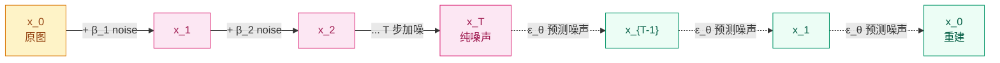

## 前作进展

到 2020 年中,视觉生成的几条路线各有硬伤:

**GAN 系**(2014 Goodfellow 起家)—— 主流但训练极不稳:**模式崩溃**(生成器只输出几张图)、**判别器突然赢**(loss 飞)、**超参敏感**(lr 换一下就崩)。StyleGAN(2018-2020)质量惊人但只在 face / landscape 这种"分布相对集中"的数据上 work,通用文本到图像难以做

**VAE 系**(2013 Kingma) —— 训练稳定但**生成模糊**(因为最大化 ELBO 时 L2 重构损失天然偏好平均值)。VQ-VAE / VQ-VAE-2 用离散 latent 缓解了模糊问题,但需要两阶段训练 + autoregressive prior,流程复杂

**Autoregressive 系**(PixelRNN / PixelCNN / ImageGPT)—— 一个像素一个像素地预测,**慢**(生成一张 256² 图像要 65K 次 forward),且高分辨率下质量一般

2015 年 Sohl-Dickstein 等人发表了 *Deep Unsupervised Learning using Nonequilibrium Thermodynamics*,提出"diffusion probabilistic models":借鉴物理里的扩散过程,把生成问题反转为"从噪声逐步去噪"。这是 diffusion 的概念起源,但当时的实现 FID 远不如 GAN,论文没引起注意。

2019 年 Song & Ermon 发表 *Generative Modeling by Estimating Gradients of the Data Distribution* —— score-based generative model(NCSN),从 diffusion 的另一面给出了相同数学。但仍是学术研究,工程化离工业差很远。

Ho、Jain、Abbeel 在 2020 年 6 月发表 *Denoising Diffusion Probabilistic Models*(DDPM),做了三件工程关键的事:

1. **把 Sohl-Dickstein 的复杂变分目标简化成 MSE 噪声回归**
2. **用 U-Net 作为去噪网络**(借鉴 score matching)
3. **用 linear / cosine noise schedule** 控制扩散强度

结果:在 CIFAR-10 / LSUN / CelebA-HQ 上**质量超过当时所有 GAN baseline**(FID 3.17 vs StyleGAN 8.2 on CIFAR-10),且**训练完全稳定**——没有判别器/生成器博弈,就是标准监督学习。

这一结果在 2020 年中并没引起大规模注意——直到 2021 年的 DDIM(快速采样)、ADM(超大模型)、Improved DDPM(更好 schedule)持续证明 diffusion 的优势,最终 2022 年的 LDM / Stable Diffusion / Imagen / DALL-E 2 把 diffusion 推到所有人的工作流。今天回头看,**DDPM 是 GAN 时代终结、diffusion 时代开启的标志论文**。

## 核心思想:正向加噪 + 反向去噪

DDPM 的核心是两个**马尔科夫链过程**——一个是固定的"加噪",一个是要学的"去噪"。



*图 1:扩散的两个方向 — 正向(实线)是固定加噪过程,把 x_0 变成纯噪声 x_T;反向(虚线)是学到的去噪过程,从 x_T 逐步恢复 x_0。*

**正向过程**——单步加噪的高斯分布:

$$
q(x_t | x_{t-1}) = \mathcal{N}(x_t; \sqrt{1 - \beta_t} \cdot x_{t-1}, \, \beta_t I)
$$

`β_t ∈ (0, 1)` 是预设的"加噪强度",DDPM 默认是从 `β_1 = 1e-4` 线性增到 `β_T = 0.02`,T=1000。

关键 trick:**正向过程可以一步直接采样到任意 t,不需要逐步迭代**。定义 `α_t = 1 - β_t`,`\bar{α}_t = \prod_{s=1}^t α_s`,可以推出:

$$
q(x_t | x_0) = \mathcal{N}(x_t; \sqrt{\bar{α}_t} \cdot x_0, \, (1 - \bar{α}_t) I)
$$

即:

$$
x_t = \sqrt{\bar{α}_t} \cdot x_0 + \sqrt{1 - \bar{α}_t} \cdot \epsilon, \quad \epsilon \sim \mathcal{N}(0, I)
$$

这一闭式 trick 让训练时不需要 T 次 forward,只需要采一个随机 t 然后一步算出 `x_t`。

**反向过程**——学一个网络预测每一步要去掉的噪声:

$$
p_\theta(x_{t-1} | x_t) = \mathcal{N}(x_{t-1}; \mu_\theta(x_t, t), \Sigma_\theta(x_t, t))
$$

Ho 等人推出 `μ_\theta` 可以参数化为 `ε_\theta(x_t, t)`(预测噪声),最终目标极简:

$$
\boxed{\mathcal{L}_\text{simple} = \mathbb{E}_{t, x_0, \epsilon}\Big[\| \epsilon - \epsilon_\theta(\sqrt{\bar{α}_t} \cdot x_0 + \sqrt{1 - \bar{α}_t} \cdot \epsilon, \, t) \|^2 \Big]}
$$

**就是一个 MSE**——给定 noisy 图和 timestep,预测加进去的噪声。整个目标里没有判别器、没有 KL 散度、没有变分下界——**完全是监督学习**。

## 训练循环

DDPM 训练代码极其简短:

```python
for x_0 in dataloader:
    # 1. 随机采 timestep
    t = torch.randint(0, T, (x_0.size(0),))
    # 2. 采噪声
    epsilon = torch.randn_like(x_0)
    # 3. 一步到位算 x_t(用 reparam trick)
    alpha_bar = self.alpha_bar[t].view(-1, 1, 1, 1)
    x_t = torch.sqrt(alpha_bar) * x_0 + torch.sqrt(1 - alpha_bar) * epsilon
    # 4. 让模型预测噪声
    epsilon_pred = self.model(x_t, t)
    # 5. MSE loss
    loss = F.mse_loss(epsilon_pred, epsilon)
    loss.backward()
    optimizer.step()
```

整个训练循环 5 行——和 GAN 的"生成器 / 判别器交替训练 + 各自的 loss + 各种正则化"对比,DDPM 的训练简洁性是革命性的。

## 采样:1000 步去噪

训练完成后,从纯噪声 `x_T ~ N(0, I)` 出发,逐步去噪:

```python
def sample(model, shape, T=1000):
    x = torch.randn(shape)
    for t in reversed(range(T)):
        # 预测当前步的噪声
        epsilon_pred = model(x, torch.full((shape[0],), t))
        # 反向一步:x_{t-1} = ... (推导见论文)
        alpha = self.alpha[t]
        alpha_bar = self.alpha_bar[t]
        mean = (1 / torch.sqrt(alpha)) * (x - (1 - alpha) / torch.sqrt(1 - alpha_bar) * epsilon_pred)
        # 加一点随机噪声(除了最后一步)
        if t > 0:
            x = mean + torch.sqrt(self.beta[t]) * torch.randn_like(x)
        else:
            x = mean
    return x  # 这就是生成的图
```

**采样需要 1000 次 forward**——这是 DDPM 的最大工程瓶颈。生成 16 张 256×256 图像在 V100 上要几分钟,GAN 一次 forward 几毫秒就够。这一速度差距在 2020 年看是 diffusion 的硬伤。

后续工作快速解决:

- **DDIM**(2020 Song)—— 用确定性采样把 1000 步压到 50 步,质量不掉
- **ADM**(2021 Dhariwal)—— learned variance + classifier guidance,更快更好
- **DPM-Solver**(2022 Lu)—— 用 ODE solver 把采样压到 10-20 步
- **Consistency Model**(2023 Song)—— 一步生成,质量接近 50 步采样
- **LCM**(Latent Consistency, 2023)—— SD 模型上 1-4 步生成,推理实时化

到 2024 年,1 步生成的 diffusion 模型在质量上已经接近 1000 步 DDPM,推理速度和 GAN 持平。

## U-Net Backbone

DDPM 用 **U-Net** 作为 `ε_θ` 网络。U-Net(Ronneberger 2015)原本为医学影像分割设计:

- **Encoder**:卷积 + 下采样,把 `H × W` 图像压到 `H/16 × W/16` 特征
- **Decoder**:转置卷积 + 上采样,从 `H/16 × W/16` 还原到 `H × W`
- **Skip connection**:把 encoder 每个尺度的特征直接拼到 decoder 对应尺度

为什么 U-Net 适合 diffusion?

- **输入输出同形**:噪声预测需要和输入图同尺寸,U-Net 的对称结构天然匹配
- **多尺度特征**:diffusion 不同 timestep 关注不同尺度的信号(早期 t 看大结构,晚期 t 看细节),U-Net 的多尺度 skip 让模型可以同时看
- **timestep embedding 注入方便**:U-Net 每个 block 加一个 `+timestep_embed` 就行

DDPM 在 U-Net 里加了 **timestep embedding + sinusoidal**(类似 Transformer 的位置编码),把 `t` 映射成一个向量注入每个 block。后来 [DiT](../08-vit/04-dit.md) 把 U-Net 完全换成 Transformer + AdaLN,但在 2020-2022 的 diffusion 工作里 U-Net 是绝对主流。

## 性能对比

DDPM 在 2020 年的 benchmark 成绩(论文 Table 1, 2):

**CIFAR-10**(unconditional generation):

| 模型 | FID(越低越好) | IS(越高越好) |
|------|------|------|
| StyleGAN | 8.2 | 9.18 |
| BigGAN-deep | 14.7 | 9.22 |
| NCSN(score matching) | 25.3 | 8.87 |
| **DDPM** | **3.17** | **9.46** |

**LSUN Bedroom / Cat / Church**(256×256):

| 模型 | FID |
|------|------|
| StyleGAN(Bedroom) | 2.65 |
| **DDPM(Bedroom)** | **6.36** |

CIFAR-10 上 DDPM 大幅领先 GAN(3.17 vs 8.2);LSUN 上略输 StyleGAN 但已接近。**质量首次和 GAN 对等**——加上训练稳定性,DDPM 一篇论文宣告了 GAN 时代的开始终结。

## 训练细节

| 维度 | DDPM(CIFAR-10) |
|------|------|
| 架构 | U-Net,~35M 参数(CIFAR);LSUN 用更大 U-Net |
| Timestep T | 1000 |
| Noise schedule | linear,β_1=1e-4 → β_T=0.02 |
| 优化器 | Adam,lr=2e-4 |
| Batch | 128 |
| 训练 epoch | 800K steps(CIFAR-10)≈ 几天 8 V100 |
| EMA | decay 0.9999 |
| 数据增强 | 水平翻转 |
| 训练硬件 | 8 × TPU v3 |

注意 **800K steps 是相当长的训练**——加上 1000 步采样,DDPM 整体算力 demands 比 GAN 高几倍。但因为训练稳定不需要 babysit,实际工程效率反而不差。

## 影响 / 后续

DDPM 在生成模型历史的位置:**让 diffusion 从冷门学术想法变成生成主流的开端**。具体影响:

**1. GAN 退出主流地位**——2021 之后视觉生成的主要研究全部转向 diffusion。StyleGAN3(2021)是 GAN 路线最后的重要工作,之后 GAN 主要在超分 / 风格迁移等专门任务上有用

**2. 训练稳定性的范式革命**——"用 MSE 学预测噪声"这一简单目标终结了"训练 GAN 需要博士级 debug"的时代。任何能训 ResNet 的人都能训 DDPM

**3. 视觉生成的 scaling 化**——diffusion 的目标可微、稳定、可预测,允许 [scaling law](../07-gpt-scaling/04-scaling-laws.md) 在视觉生成上 work。后续 LDM / Imagen / SD 系列都是 scaling 的产物

**4. U-Net + timestep 的标配设计**——2020-2022 的 diffusion 工作几乎全用 U-Net,直到 [DiT](../08-vit/04-dit.md) 把它换成 Transformer

**5. 跨模态生成的基础**——diffusion 的"条件控制天然适配"(把文本 embedding 加到 U-Net 中间层)让 text-to-image 变得自然。DALL-E 2 / Imagen / Stable Diffusion 都是这条路

**6. 应用扩展**——音频(WaveGrad, DiffWave)、视频(VideoLDM, Sora)、3D(DreamFusion, Magic3D)、蛋白质(RFdiffusion)等领域全部移植 diffusion

DDPM 留下的几个明确局限,推动了后续节点:

- **像素级 diffusion 算力爆炸**——256² 已经吃 V100 显存,512² 不可行 → [LDM / Stable Diffusion](02-ldm.md) 在 latent space 做
- **采样 1000 步太慢** → DDIM / DPM-Solver / Consistency Model
- **无文本条件**——DDPM 是无条件 / 类条件,需要文本驱动 → [Imagen](03-imagen.md) + CFG
- **训练目标可以简化**——ε-prediction 不是唯一选择 → [Flow Matching](04-flow-matching.md)

→ [02-ldm.md](02-ldm.md) · 在 latent space 做 diffusion,把推理成本降 64×
→ [03-imagen.md](03-imagen.md) · 大文本编码器 + classifier-free guidance,推 text-to-image SOTA
→ [04-flow-matching.md](04-flow-matching.md) · 训练目标的现代化,SD3 / Flux 用
→ [../08-vit/04-dit.md](../08-vit/04-dit.md) · 把 U-Net 替换成 Transformer 的 backbone 变革
→ [../09-multimodal-clip/](../09-multimodal-clip/) · 文本-图像对齐基础,SD 用 CLIP 作 text encoder
→ [../04-gan/](../04-gan/) · 之前的视觉生成主流,被 DDPM 后续工作取代
