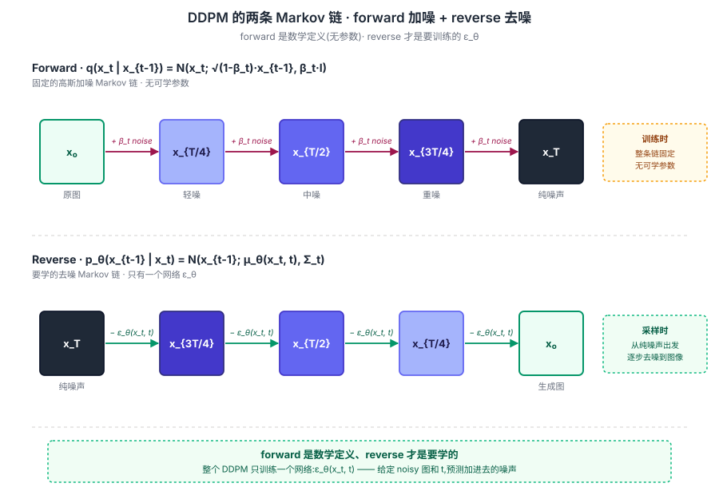
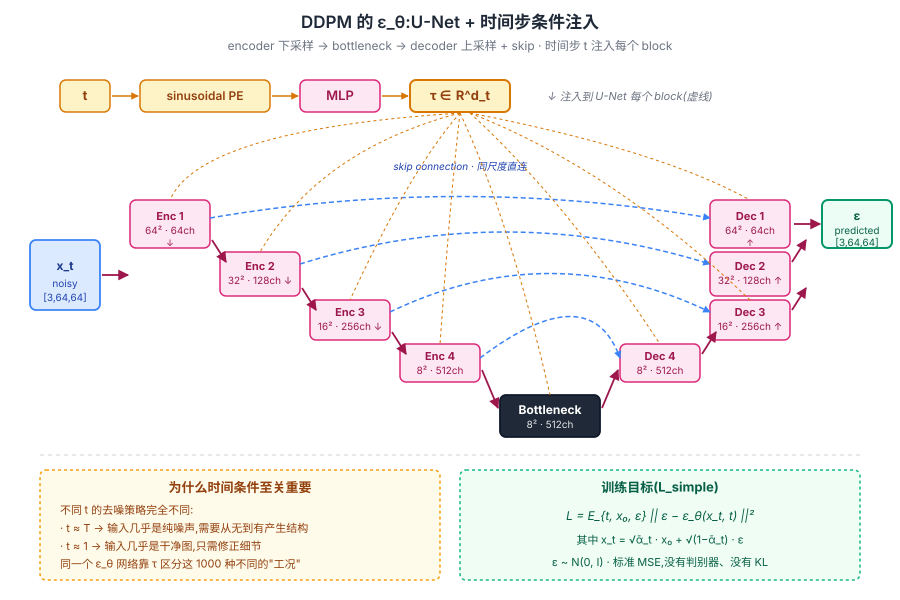

## 前作进展

到 2020 年中,视觉生成的几条路线各有硬伤:

**GAN 系**(2014 Goodfellow 起家)—— 主流但训练极不稳:**模式崩溃**(生成器只输出几张图)、**判别器突然赢**(loss 飞)、**超参敏感**(lr 换一下就崩)。StyleGAN(2018-2020)质量惊人但只在 face / landscape 这种"分布相对集中"的数据上 work,通用文本到图像难以做

**VAE 系**(2013 Kingma) —— 训练稳定但**生成模糊**(因为最大化 ELBO 时 L2 重构损失天然偏好平均值)。VQ-VAE / VQ-VAE-2 用离散 latent 缓解了模糊问题,但需要两阶段训练 + autoregressive prior,流程复杂

**Autoregressive 系**(PixelRNN / PixelCNN / ImageGPT)—— 一个像素一个像素地预测,**慢**(生成一张 256² 图像要 65K 次 forward),且高分辨率下质量一般

2015 年 Sohl-Dickstein 等人发表了 *Deep Unsupervised Learning using Nonequilibrium Thermodynamics*,提出"diffusion probabilistic models":借鉴物理里的扩散过程,把生成问题反转为"从噪声逐步去噪"。这是 diffusion 的概念起源,但当时的实现 FID 远不如 GAN,论文没引起注意。

2019 年 Song & Ermon 发表 *Generative Modeling by Estimating Gradients of the Data Distribution* —— score-based generative model(NCSN),从 diffusion 的另一面给出了相同数学。但仍是学术研究,工程化离工业差很远。

Ho、Jain、Abbeel 在 2020 年 6 月发表 *Denoising Diffusion Probabilistic Models*(DDPM),做了三件工程关键的事:

1. **把 Sohl-Dickstein 的复杂变分目标简化成 MSE 噪声回归**
2. **用 U-Net 作为去噪网络**(借鉴 score matching)
3. **用 linear / cosine noise schedule** 控制扩散强度

结果:在 CIFAR-10 / LSUN / CelebA-HQ 上**质量超过当时所有 GAN baseline**(FID 3.17 vs StyleGAN 8.2 on CIFAR-10),且**训练完全稳定**——没有判别器/生成器博弈,就是标准监督学习。

这一结果在 2020 年中并没引起大规模注意——直到 2021 年的 DDIM(快速采样)、ADM(超大模型)、Improved DDPM(更好 schedule)持续证明 diffusion 的优势,最终 2022 年的 LDM / Stable Diffusion / Imagen / DALL-E 2 把 diffusion 推到所有人的工作流。今天回头看,**DDPM 是 GAN 时代终结、diffusion 时代开启的标志论文**。

## 核心思想

### 直觉:从"逐步加噪 → 学反向"的对偶视角

理解 DDPM 真正需要先抓一件事:**GAN 把生成看成"一次性从噪声直接产出图像"、VAE 把生成看成"一次性从 latent 解码出图像",而 DDPM 把生成拆成 1000 个小步骤,每步只问一个简单问题——"这张稍微脏一点的图,该减掉多少噪声"**。

为什么这个心智模型在数学上更优雅?三件事同时被它解决:

- **训练目标可微 + 稳定**——GAN 的 minimax 博弈需要 G 和 D 互相平衡,稍有不慎就模式崩溃或判别器赢。VAE 的 ELBO 是变分下界,与真目标存在 gap。DDPM 的 `L_simple` **就是 MSE**——一个明确、凸、有界的回归目标,梯度永远干净
- **任务难度被均摊**——"从纯噪声直接重建图像"是一个极难的任务(GAN 让 G 一次性完成,所以训练困难)。DDPM 把它拆成 T = 1000 个**几乎一样难度的子任务**:每一步都只是"去一点点噪声",任何一个 t 的网络容量都够用
- **同一个网络复用 T 次**——`ε_θ(x_t, t)` 不是 1000 个网络,而是**一个网络看 1000 种工况**(由时间步 embedding 区分)。所有 t 共享参数,数据效率极高

把这三件事合在一起:DDPM 用"逐步加噪—学反向"的对偶,把"一个不可能的生成任务"换成"一千个简单的去噪任务"——这是它在数学上比 GAN/VAE 更优雅、训练上比两者都稳定的根因。


*图 1:DDPM 的两个方向。**上排 forward**——固定的高斯加噪链 `q(x_t | x_{t-1})`,从 x₀ 渐变为纯噪声 x_T,**无可学参数**。**下排 reverse**——要学的去噪链 `p_θ(x_{t-1} | x_t)`,由唯一的网络 ε_θ 驱动,从纯噪声逐步恢复图像。整个 DDPM 只训练一个东西:ε_θ。*

### 机制一:Forward Process — 固定的高斯加噪 Markov 链

正向过程是一个**预先定义死、没有任何可学参数**的 Markov 链:

$$
q(x_t \mid x_{t-1}) = \mathcal{N}\!\left(x_t;\ \sqrt{1 - \beta_t}\cdot x_{t-1},\ \beta_t I\right)
$$

`β_t ∈ (0, 1)` 是预设的"加噪强度",DDPM 默认是从 `β_1 = 1e-4` 线性增到 `β_T = 0.02`,T = 1000。每一步都对上一步的 x 做一个轻微的"按比例缩小 + 加高斯噪声",1000 步累积下来,x_T 就接近一个标准高斯。

关键 trick:**正向过程可以一步直接采样到任意 t,不需要逐步迭代**。定义 `α_t = 1 - β_t`,`ᾱ_t = ∏_{s=1}^t α_s`,可以推出:

$$
q(x_t \mid x_0) = \mathcal{N}\!\left(x_t;\ \sqrt{\bar{\alpha}_t}\cdot x_0,\ (1 - \bar{\alpha}_t)\,I\right)
$$

即:

$$
x_t = \sqrt{\bar{\alpha}_t}\cdot x_0 + \sqrt{1 - \bar{\alpha}_t}\cdot \epsilon, \quad \epsilon \sim \mathcal{N}(0, I)
$$

这一闭式 trick 让训练时**不需要 T 次 forward**,只需要采一个随机 t 然后一步算出 `x_t`——这是 DDPM 训练能 scale 起来的关键工程细节。

### 机制二:Reverse Process — 学一个 ε_θ 去预测每步噪声

反向过程是要学的。它也是一个 Markov 链,但每一步的转移分布由神经网络参数化:

$$
p_\theta(x_{t-1} \mid x_t) = \mathcal{N}\!\left(x_{t-1};\ \mu_\theta(x_t, t),\ \Sigma_\theta(x_t, t)\right)
$$

Ho 等人的核心推导:与其让网络直接预测均值 `μ_θ`,不如让它**预测每一步要去掉的噪声 `ε_θ(x_t, t)`**——这是一个等价但远更易学的参数化。`μ_θ` 可以从 `ε_θ` 推出来:

$$
\mu_\theta(x_t, t) = \frac{1}{\sqrt{\alpha_t}}\left(x_t - \frac{1 - \alpha_t}{\sqrt{1 - \bar{\alpha}_t}}\,\epsilon_\theta(x_t, t)\right)
$$

为什么参数化 `ε` 而不是 `μ` 或 `x_0`?三个数值上的好处:

- **目标分布稳定**——无论 t 是多少,要预测的 `ε` 都是 N(0, I) 分布;而 `μ` 或 `x_0` 在不同 t 下尺度差异很大
- **回归目标对网络友好**——预测"加了什么噪声"等价于"图里哪些像素位置是 anomaly",这是 CNN 天生擅长的局部 pattern matching
- **训练 / 采样的对称性**——训练时知道真 ε(自己采的),采样时用预测的 ε 反推 x_{t-1},两端 API 完全对称

整个 DDPM 的训练只学这一个 `ε_θ` 网络——具体到结构,Ho 等人选择了 **U-Net**(下文 H3 详述)。

### 机制三:Simplified Objective — 把变分下界简化成 L2 噪声预测

Sohl-Dickstein 2015 的原始目标是变分下界 `L_VLB`,包含 T 个 KL 散度项,推导复杂、实现繁琐。Ho 等人的**第二个核心贡献**就是证明:在 `ε`-参数化下,把 KL 项里的常数因子全部丢掉,得到一个极简的训练目标:

$$
\boxed{\mathcal{L}_\text{simple} = \mathbb{E}_{t,\ x_0,\ \epsilon}\!\left[\big\| \epsilon - \epsilon_\theta\!\left(\sqrt{\bar{\alpha}_t}\,x_0 + \sqrt{1 - \bar{\alpha}_t}\,\epsilon,\ t\right) \big\|^2 \right]}
$$

**就是一个 MSE**——给定 noisy 图 x_t 和 timestep t,预测加进去的噪声 ε。这个目标里:

- **没有判别器** —— 不需要 GAN 那套对抗博弈
- **没有 KL 散度** —— 虽然来源于 VLB,但实际计算只是 L2
- **没有 reparam 技巧** —— x_t 直接闭式采样,梯度自然贯通
- **完全是监督学习** —— 任何能训 ResNet 的人都能训 DDPM

Ho 等人在实验上还证明:**L_simple 比理论上更"正确"的 L_VLB 训练出来的模型 FID 更好**——丢掉那些"理论项"反而帮助优化。这是 DDPM 论文最深的实证 insight 之一:工程上的简化目标 > 理论上的完整目标。


*图 2:ε_θ 的具体结构——U-Net encoder 下采样(64→32→16→8)→ bottleneck → decoder 上采样,同尺度间有 skip connection(蓝色虚线)。时间步 t 经 sinusoidal PE + MLP 得到向量 τ(顶部橙色路径),**注入到 U-Net 每一个 block**(8 条橙色虚线)。底部左侧 callout 强调"不同 t 对应完全不同的去噪策略",右侧 callout 给出最终训练目标 L_simple。*

### 三件套协同:variance schedule + 时间条件 + L_simple 缺一不可

DDPM 在 2020 年能 work,**不是单一改进**,而是三件套同时调到协同点——任何一个单拿出来都不够,这一点和 [ResNet](../01-cnn/05-resnet.md) 的 `shortcut + BN + He 初始化` 的关系几乎一模一样:

- **只有 variance schedule,没有时间条件 ε_θ(x_t, t)** —— 网络不知道当前在哪一步,无法区分 t=999(纯噪声)和 t=1(几乎清晰)的不同工况,效果严重退化(后来 Improved DDPM 又把这条进一步打磨成 cosine schedule)
- **只有时间条件,没有合理的 schedule** —— `β_t` 增长太快 → x_T 信息丢失太早、训练信号集中在 t 后段;增长太慢 → x_T 还不是高斯、采样起点不对。linear schedule 是 2020 年的经验最优解
- **只有 schedule + 时间条件,没有 L_simple 简化** —— 用原始 L_VLB 训练 FID 反而更差(Ho 2020 Table 2 实证),而且 KL 项的数值实现敏感、容易爆梯度

三件套合起来才让"逐步加噪 + 学反向"这一 2015 年就提出的想法,在 2020 年第一次跑到 FID 3.17 的水平。这也是为什么 2015–2019 年之间多个团队摸到 diffusion / score matching 的边但没做大——他们各自只调好了三件套里的一两件。

### 采样过程:从纯噪声逐步去噪

训练完成后,生成图像就是反向运行这条链 1000 步:

```
x_T ~ N(0, I)
for t in [T, T-1, ..., 1]:
    ε_pred = ε_θ(x_t, t)
    μ      = (1/√α_t) · (x_t − (1−α_t)/√(1−ᾱ_t) · ε_pred)
    x_{t-1} = μ + σ_t · z,   z ~ N(0, I)   (最后一步不加 z)
return x_0
```

**采样需要 1000 次 forward**——这是 DDPM 的最大工程瓶颈。生成 16 张 256×256 图像在 V100 上要几分钟,GAN 一次 forward 几毫秒就够。这一速度差距在 2020 年看是 diffusion 的硬伤。

后续工作快速解决:

- **DDIM**(2020 Song)—— 用确定性采样把 1000 步压到 50 步,质量不掉
- **ADM**(2021 Dhariwal)—— learned variance + classifier guidance,更快更好
- **DPM-Solver**(2022 Lu)—— 用 ODE solver 把采样压到 10-20 步
- **Consistency Model**(2023 Song)—— 一步生成,质量接近 50 步采样
- **LCM**(Latent Consistency, 2023)—— SD 模型上 1-4 步生成,推理实时化

到 2024 年,1 步生成的 diffusion 模型在质量上已经接近 1000 步 DDPM,推理速度和 GAN 持平。

### U-Net Backbone 的选择

DDPM 用 **U-Net**(Ronneberger 2015,原本为医学影像分割设计)作为 `ε_θ`,而不是 ResNet 或纯 CNN。原因:

- **输入输出同形**——噪声预测需要和输入图同尺寸,U-Net 的对称 encoder-decoder 结构天然匹配
- **多尺度特征**——diffusion 不同 timestep 关注不同尺度的信号(早期 t 看大结构,晚期 t 看细节),U-Net 的多尺度 skip 让模型可以同时看
- **timestep embedding 注入方便**——U-Net 每个 block 加一个 `+ MLP(τ)` 就行,不需要改变拓扑结构

DDPM 在 U-Net 里加了 **sinusoidal timestep embedding**(类似 Transformer 的位置编码),把 `t ∈ {0, ..., T}` 映射成一个向量,过一个小 MLP 后注入到每个 residual block 的特征图上(具体做法是把 τ 投影后加到 GroupNorm 之后)。后来 [DiT](../08-vit/04-dit.md) 把 U-Net 完全换成 Transformer + AdaLN,但在 2020-2022 的 diffusion 工作里 U-Net 是绝对主流。

## 训练细节

| 维度 | DDPM(CIFAR-10) |
|------|------|
| 架构 | U-Net,~35M 参数(CIFAR);LSUN 用更大 U-Net |
| Timestep T | 1000 |
| Noise schedule | linear,β_1=1e-4 → β_T=0.02 |
| 优化器 | Adam,lr=2e-4 |
| Batch | 128 |
| 训练 epoch | 800K steps(CIFAR-10)≈ 几天 8 V100 |
| EMA | decay 0.9999 |
| 数据增强 | 水平翻转 |
| 训练硬件 | 8 × TPU v3 |

注意 **800K steps 是相当长的训练**——加上 1000 步采样,DDPM 整体算力 demands 比 GAN 高几倍。但因为训练稳定不需要 babysit,实际工程效率反而不差。

**EMA 权重**是 DDPM 实现里另一个不能省的细节——训练时维护一份指数滑动平均的参数副本(decay 0.9999),采样时用 EMA 权重而非当前权重。没有 EMA 时,FID 会显著变差(论文 Appendix B 实测)。这一做法后来被所有主流 diffusion 实现(Improved DDPM / ADM / LDM)沿用。

### 性能对比

DDPM 在 2020 年的 benchmark 成绩(论文 Table 1, 2):

**CIFAR-10**(unconditional generation):

| 模型 | FID(越低越好) | IS(越高越好) |
|------|------|------|
| StyleGAN | 8.2 | 9.18 |
| BigGAN-deep | 14.7 | 9.22 |
| NCSN(score matching) | 25.3 | 8.87 |
| **DDPM** | **3.17** | **9.46** |

**LSUN Bedroom / Cat / Church**(256×256):

| 模型 | FID |
|------|------|
| StyleGAN(Bedroom) | 2.65 |
| **DDPM(Bedroom)** | **6.36** |

CIFAR-10 上 DDPM 大幅领先 GAN(3.17 vs 8.2);LSUN 上略输 StyleGAN 但已接近。**质量首次和 GAN 对等**——加上训练稳定性,DDPM 一篇论文宣告了 GAN 时代的开始终结。

## 关键代码

DDPM 的**训练循环**极其简短——这正是它工程吸引力的来源:

```python
for x_0 in dataloader:
    # 1. 随机采 timestep
    t = torch.randint(0, T, (x_0.size(0),))
    # 2. 采噪声
    epsilon = torch.randn_like(x_0)
    # 3. 一步到位算 x_t(用 reparam trick)
    alpha_bar = self.alpha_bar[t].view(-1, 1, 1, 1)
    x_t = torch.sqrt(alpha_bar) * x_0 + torch.sqrt(1 - alpha_bar) * epsilon
    # 4. 让模型预测噪声
    epsilon_pred = self.model(x_t, t)
    # 5. MSE loss —— 这就是 L_simple
    loss = F.mse_loss(epsilon_pred, epsilon)
    loss.backward()
    optimizer.step()
```

整个训练循环 5 行——和 GAN 的"生成器 / 判别器交替训练 + 各自的 loss + 各种正则化"对比,DDPM 的训练简洁性是革命性的。任何能训 ResNet 的人,看一眼这段代码就能跑通 DDPM。

**采样循环**(反向链):

```python
@torch.no_grad()
def sample(model, shape, T=1000):
    x = torch.randn(shape)  # x_T ~ N(0, I)
    for t in reversed(range(T)):
        t_batch = torch.full((shape[0],), t, dtype=torch.long)
        epsilon_pred = model(x, t_batch)

        alpha     = self.alpha[t]
        alpha_bar = self.alpha_bar[t]
        beta      = self.beta[t]

        # 反向一步的均值
        mean = (1 / torch.sqrt(alpha)) * (
            x - (1 - alpha) / torch.sqrt(1 - alpha_bar) * epsilon_pred
        )
        # 除最后一步外加一点 stochasticity
        if t > 0:
            x = mean + torch.sqrt(beta) * torch.randn_like(x)
        else:
            x = mean
    return x  # x_0,生成图
```

整个推理过程**就是同一个 `model(x, t)` 调 1000 次** —— DDPM 的训练 / 采样代码加起来不到 30 行。

## 影响 / 后续

DDPM 在生成模型历史的位置:**让 diffusion 从冷门学术想法变成生成主流的开端**。具体影响:

**1. GAN 退出主流地位**——2021 之后视觉生成的主要研究全部转向 diffusion。StyleGAN3(2021)是 GAN 路线最后的重要工作,之后 GAN 主要在超分 / 风格迁移等专门任务上有用

**2. 训练稳定性的范式革命**——"用 MSE 学预测噪声"这一简单目标终结了"训练 GAN 需要博士级 debug"的时代。任何能训 ResNet 的人都能训 DDPM

**3. 视觉生成的 scaling 化**——diffusion 的目标可微、稳定、可预测,允许 [scaling law](../07-gpt-scaling/04-scaling-laws.md) 在视觉生成上 work。后续 LDM / Imagen / SD 系列都是 scaling 的产物

**4. U-Net + timestep 的标配设计**——2020-2022 的 diffusion 工作几乎全用 U-Net,直到 [DiT](../08-vit/04-dit.md) 把它换成 Transformer

**5. 跨模态生成的基础**——diffusion 的"条件控制天然适配"(把文本 embedding 加到 U-Net 中间层)让 text-to-image 变得自然。DALL-E 2 / Imagen / Stable Diffusion 都是这条路

**6. 应用扩展**——音频(WaveGrad, DiffWave)、视频(VideoLDM, Sora)、3D(DreamFusion, Magic3D)、蛋白质(RFdiffusion)等领域全部移植 diffusion

DDPM 留下的几个明确局限,推动了后续节点:

- **像素级 diffusion 算力爆炸**——256² 已经吃 V100 显存,512² 不可行 → [LDM / Stable Diffusion](02-ldm.md) 在 latent space 做
- **采样 1000 步太慢** → DDIM / DPM-Solver / Consistency Model
- **无文本条件**——DDPM 是无条件 / 类条件,需要文本驱动 → [Imagen](03-imagen.md) + CFG
- **训练目标可以简化**——ε-prediction 不是唯一选择 → [Flow Matching](04-flow-matching.md)

→ [02-ldm.md](02-ldm.md) · 在 latent space 做 diffusion,把推理成本降 64×
→ [03-imagen.md](03-imagen.md) · 大文本编码器 + classifier-free guidance,推 text-to-image SOTA
→ [04-flow-matching.md](04-flow-matching.md) · 训练目标的现代化,SD3 / Flux 用
→ [../08-vit/04-dit.md](../08-vit/04-dit.md) · 把 U-Net 替换成 Transformer 的 backbone 变革
→ [../09-multimodal-clip/](../09-multimodal-clip/) · 文本-图像对齐基础,SD 用 CLIP 作 text encoder
→ [../04-gan/](../04-gan/) · 之前的视觉生成主流,被 DDPM 后续工作取代
→ [../01-cnn/05-resnet.md](../01-cnn/05-resnet.md) · "三件套协同"的金标本参照
