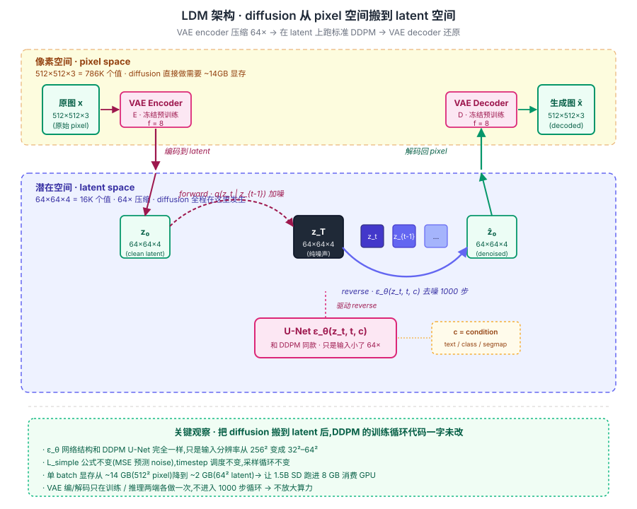
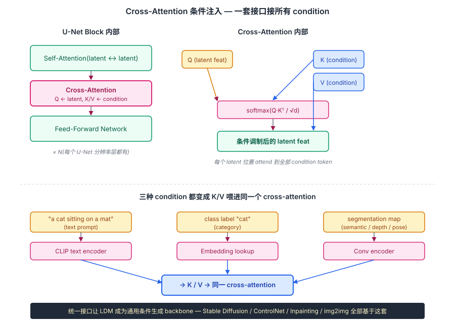

## 前作进展

[DDPM](01-ddpm.md) 2020 年证明了 diffusion 在 32-128 像素上击败 GAN,但 2021 年的几次扩展(ADM, GLIDE)暴露了一个根本问题:**diffusion 在高分辨率上算力代价不可承受**。

具体数字:在 512×512 RGB 图像上做 diffusion,U-Net 每一步要处理 `512 × 512 × 3 = 786K` 个值,1000 步采样总计 `786M` 次值的卷积——一张图生成在 V100 上要几十秒,且训练显存爆炸。OpenAI 的 GLIDE(2022 3 月)和 Google 的 Imagen(2022 5 月)都是几百 M 到几个 G 参数的模型,**只有大公司能训能跑**。

社区急需把 diffusion 推到"个人 GPU 能跑"的形态。CompVis 团队(Heidelberg + Runway)的 Rombach 等人 2022 年 4 月发表 *High-Resolution Image Synthesis with Latent Diffusion Models*(LDM)给出了关键洞察:**diffusion 没必要在 pixel 上做,可以在更紧凑的 latent space 上做**。

具体:先用一个 VAE 把图像编码到 `H/8 × W/8 × 4` 的 latent(对 512×512 输入是 `64 × 64 × 4`),在这个 64× 更小的空间做 diffusion,生成 latent 后再用 VAE 解码回 pixel。算力降 64×,且**几乎不损质量**——因为 VAE latent 是图像的"语义压缩",不会丢失感知重要的信息。

2022 年 8 月,Stability AI + CompVis + Runway + LAION 联合释出 **Stable Diffusion**——基于 LDM 在 LAION-5B 数据集上训练的开源文生图模型。这是 LDM 工程化最重要的产物:

- 模型权重 4 GB,可以在 8 GB 显存的消费 GPU 上跑
- 完全开源(权重 + 训练代码 + 数据集描述)
- 推理一张 512×512 图像在 RTX 3090 上 5 秒、A100 上 1 秒

**Stable Diffusion 是 LLM 时代之前 AI 进入消费市场的标志事件**——比 ChatGPT 早 3 个月,引爆了 AI 绘画文化、Midjourney 等商业产品、ControlNet / LoRA 等微调技术,直接催生了今天的 AI 视觉生成生态。

## 核心思想

### 直觉:diffusion 不必在像素上做,搬到 latent 上能省 64×

理解 LDM 真正需要先抓一件事:**[DDPM](01-ddpm.md) 在像素空间做 diffusion 已经吃满 V100 显存,512² 不可行**。U-Net 在 512×512×3 上做 1000 步 noise prediction 是 786K 个值 × 1000 次卷积,**算力瓶颈不在模型容量,而在"在哪个空间算"**。Rombach 等人 2022 的洞察:先用 VAE 把图像压到 `64×64×4` 的 latent,在这个 64× 更小的空间做 diffusion,再 decode 回像素。

为什么 64× 压缩几乎不损质量?因为图像的"perceptual content"主要在低频结构 + 中频纹理,高频像素噪声本来就不重要。VAE 用 perceptual loss + adversarial loss 训出来后,latent 是图像的**语义压缩**,decoder 能从 latent 重建出感知上等价的像素。Diffusion 在 latent 上做,等于"在语义层面去噪",反而比像素层面更稳定 —— 这是 LDM 真正的反直觉点。

三件事必须同时成立才让 LDM 在 2022 年成立:

- **存在感知质量好的 autoencoder** —— 普通 L2 VAE 压完模糊不可用,必须 perceptual + adversarial 训
- **diffusion 训练对 latent 分布鲁棒** —— DDPM 本来设计在 pixel(类 Gaussian 分布)上,VAE latent 分布形态不同但 ε-prediction + scale 调整后仍然能 work
- **通用 condition 接口让单 backbone 支持多任务** —— 不然每个任务(text2img / inpainting / upscale)都要重训,生态做不起来

三件事合起来才让 Stable Diffusion 在 2022 年 8 月以 4GB 模型 + 8GB 显存可跑的形态开源出来,直接引爆 AI 绘画文化。

### 机制一:Perceptual Compression — 用 VAE 把 512² 像素压到 64² latent

LDM 的 Stage 1 是独立训练一个 **感知压缩 autoencoder**,把 $H \times W \times 3$ 图像压到 $H/f \times W/f \times c$ 的 latent。Stable Diffusion 用 `f=8, c=4`,即 512×512×3 → 64×64×4,**16K vs 786K 值,49× 压缩**(参数 8× × 高 8× × 宽 8× / 通道 4)。

关键设计:

- **不是标准 VAE 的 ELBO 训练**,而是 L1 + LPIPS perceptual loss + PatchGAN-style adversarial loss。这让 decoder 重建出"看起来真实"而非"L2 平均后模糊"的图像
- **KL 正则但 weight 很小** —— 不严格强制 latent 服从 $\mathcal{N}(0, I)$,只保证 latent 不退化,给后续 diffusion 足够自由度
- **压缩比 f 的甜蜜点是 8** —— f=4 不够省,f=16 丢细节,经验最优
- **VAE 独立训完后冻结** —— Stage 2 完全不动 VAE,只训 diffusion U-Net

### 机制二:Latent Diffusion — 在 latent 上跑标准 DDPM

Stage 2 在 VAE latent 上跑和 DDPM **完全一样**的 noise prediction U-Net:

$$
\mathcal{L}_\text{LDM} = \mathbb{E}_{z_0, t, \epsilon}\big[\| \epsilon - \epsilon_\theta(z_t, t, c) \|^2\big]
$$

其中 $z_0 = \text{VAE.encode}(x_0) \cdot 0.18215$(SD 用的 latent 标准化常数,把 latent 尺度对齐到 noise schedule 假设)。所有 DDPM 的训练 / 采样代码不变,只是 U-Net 输入从 $3 \times 512 \times 512$ 变成 $4 \times 64 \times 64$,**单 batch 显存从 ~14G 降到 ~2G**。

这一改造的妙处在于"复用 DDPM 的全部数学和工程经验" —— ε-prediction 参数化、linear / cosine schedule、DDIM 快速采样、CFG guidance 全都直接迁移。LDM 没发明任何新的 diffusion 理论,它发明的是"在哪个空间做 diffusion"这个**搬动**。


*图 1:**顶部** 256×256×3 像素图像 → **左下** VAE Encoder E 压成 64×64×4 latent(64× 压缩)→ **中央** latent 空间内跑 forward + reverse diffusion(几个 z_0 / z_t / z_T 方块,风格对仗 [DDPM SVG](01-ddpm.md))→ **右下** Decoder D 还原回像素。整条 diffusion 全程在虚线圈出的 latent 空间,VAE encoder/decoder 是 Stage 1 冻结。底部 callout:DDPM 训练循环不变,但单 batch 显存从 14G 降到 2G。*

### 机制三:Cross-Attention Conditioning — 一套接口接所有 condition

LDM 的第三个关键贡献是**用 cross-attention 统一各种条件输入**。原版 DDPM 只支持无条件 / 类条件(timestep embedding + class embedding 相加);LDM 想支持文本 / 图像 / 语义图 / 深度图等复杂条件,设计了通用 cross-attention 接口:

```
U-Net 每个 block 内部:
  Self-Attention    (latent token ↔ latent token)
  Cross-Attention   (Q ← latent, K/V ← condition)
  FFN
```

文本条件的具体做法:CLIP text encoder(SD v1 用 ViT-L/14)把 prompt 编码成 `[77, 768]` token 序列 → U-Net 每个 cross-attention 层让每个 latent patch attend 到这 77 个文本 token。Classifier-Free Guidance(详见 [Imagen](03-imagen.md))在采样时增强文本控制力。

这一通用接口让 LDM 不只是"文生图"—— 它同时支持 inpainting(condition = 遮罩 + 半图)、super-resolution(condition = 低分辨率图)、layout-to-image(condition = 语义图)、img2img(condition = 输入图 + 部分加噪)。**一个 SD checkpoint 可以做多种任务**,这是后续 ControlNet / LoRA / IP-Adapter 等生态能围绕 SD 爆发的架构基础。


*图 2:**左** U-Net block 内部 self-attn → cross-attn → FFN 三件;**中** cross-attention 细节:Q 来自 latent feature,K/V 来自 condition,attention 让 latent 被 condition "调制"。**下** 三种 condition(文本 / 类别 / 语义图)各走自己的 encoder(CLIP / embedding lookup / conv),输出都变成 K/V 喂进同一个 cross-attention。底部 callout:统一接口让 LDM 成为通用条件生成 backbone,SD / ControlNet / Inpainting / img2img 都基于这套。*

### 三件套协同:perceptual 压缩 + 标准 diffusion + cross-attention 缺一不可

LDM 在 2022 年能成立并引爆 SD 生态,**不是单一改进**,而是三件套同时成熟 —— 任何一个抽掉 LDM 都不会出现,这一点和 [ResNet](../01-cnn/05-resnet.md) 的 `shortcut + BN + He 初始化` 协同关系一致:

- **只有压缩,没有 perceptual loss / adversarial loss** —— 普通 L2 VAE 压完模糊,decoder 还原出来的图细节糊掉,在它上面 diffusion 训出来质量直接劣于 DDPM,没有任何意义
- **只有压缩 + perceptual VAE,没有 cross-attention 统一接口** —— 只能做无条件 / 类条件生成,Stable Diffusion 不会出现,文生图也接不上 CLIP / T5 之类的语义编码器
- **只有标准 diffusion + cross-attention,没有压缩到 latent** —— 算力像 DDPM 一样爆炸,4GB 模型 / 8GB 显存的"消费级文生图"无法实现,只能停留在 OpenAI / Google 内部 demo

三件套合起来才让"diffusion + 文本 + 消费级显卡"在 2022 年 8 月以 Stable Diffusion 形态出现,直接引爆全球 AI 绘画文化和 Midjourney / ControlNet / LoRA 整个生态。

## Stable Diffusion 的具体配置

Stable Diffusion v1.5(2022 10 月,最广为流传的版本):

| 维度 | 值 |
|------|------|
| VAE | 4 通道 latent, f=8 压缩, ~84M 参数 |
| 文本编码器 | CLIP ViT-L/14(冻结), 输出 [77, 768] |
| U-Net | 860M 参数,4 个分辨率层(64→32→16→8 latent),每层有 cross-attention |
| 总参数 | ~1.0B(VAE + U-Net + CLIP) |
| 训练数据 | LAION-5B 子集(LAION-Aesthetics),~2B 文本-图像对 |
| 训练硬件 | 256 × A100,4 周 |
| 训练成本 | ~$600K(2022 年) |
| 推理(A100, 50 DDIM steps, 512×512) | ~3 秒/图 |
| 模型文件大小 | 4.2 GB(fp16) |

**这是第一个能在消费 GPU(RTX 3090 / 4070)上跑的高质量文生图模型**。这一可达性把 AI 绘画从"OpenAI / Google 内部演示"变成了"全球开发者周末项目"。Stable Diffusion v1.5 发布后 6 个月内涌现了几千个 fine-tuned 变体(Anime / Realistic Vision / Deliberate 等),社区生态空前繁荣。

后续版本演化:

- **SD v2.0**(2022 11 月)—— 换 OpenCLIP text encoder,768² 分辨率
- **SDXL**(2023 7 月)—— 2.6B U-Net + dual text encoder,1024² 分辨率
- **SD 3**(2024 2 月)—— [MM-DiT](../08-vit/04-dit.md) 替代 U-Net + [Flow Matching](04-flow-matching.md) 训练目标 + T5-XXL 文本编码器
- **SD 3.5 / Flux**(2024 8-11 月)—— 进一步迭代,12B 参数级别

## 训练细节

| 维度 | LDM / Stable Diffusion v1.5 |
|------|------|
| VAE 训练 | 单独阶段,LAION-2B 上几周 |
| VAE 损失 | L1 + LPIPS + adversarial(PatchGAN-style 判别器) |
| Diffusion 训练数据 | LAION-Aesthetics 5B 子集(~600M 对) |
| 文本编码器 | CLIP ViT-L/14,**完全冻结** |
| U-Net | 860M 参数 |
| Timestep | 1000(训练)/ 50(推理 DDIM) |
| Noise schedule | linear(SD v1)/ scaled linear(SD v2) |
| 优化器 | AdamW,lr=1e-4 |
| Batch | 2048 |
| 训练 steps | ~600K(SD v1.4 → v1.5 微调几十万步) |
| EMA | decay 0.9999 |
| 训练硬件 | 256 × A100,~4 周 |

注意一个工程要点:**Stable Diffusion 的真实训练涉及多个阶段**(LAION-2B 上 pretrain → 高质量子集 fine-tune → 美学质量微调),不是一步到位。这种"分阶段精修"思想后来被 SDXL / SD3 沿用。

## 关键代码

LDM 的核心是把 DDPM 训练循环改造成 latent 上的:

```python
import torch
import torch.nn as nn
import torch.nn.functional as F

class LDM(nn.Module):
    def __init__(self, vae, text_encoder, unet, noise_scheduler):
        super().__init__()
        self.vae = vae.eval()              # 冻结,只 forward
        self.text_encoder = text_encoder.eval()  # 冻结
        self.unet = unet                   # 唯一要训练的
        self.scheduler = noise_scheduler

    def encode_image(self, x):
        with torch.no_grad():
            return self.vae.encode(x).latent_dist.sample() * 0.18215  # SD 用的缩放

    def encode_text(self, prompts):
        with torch.no_grad():
            return self.text_encoder(prompts).last_hidden_state  # [B, 77, 768]

    def training_step(self, image, prompt):
        # 1. 编码到 latent
        z_0 = self.encode_image(image)
        # 2. 编码 prompt
        text_emb = self.encode_text(prompt)
        # 3. 随机采 timestep + 噪声
        t = torch.randint(0, 1000, (z_0.size(0),))
        epsilon = torch.randn_like(z_0)
        z_t = self.scheduler.add_noise(z_0, epsilon, t)  # 一步加噪
        # 4. U-Net 预测噪声(用 cross-attention 看 text_emb)
        epsilon_pred = self.unet(z_t, t, encoder_hidden_states=text_emb)
        # 5. MSE loss
        loss = F.mse_loss(epsilon_pred, epsilon)
        return loss

    @torch.no_grad()
    def sample(self, prompt, num_steps=50, guidance_scale=7.5, height=512, width=512):
        text_emb = self.encode_text(prompt)
        uncond_emb = self.encode_text([""] * len(prompt))  # 无条件 baseline
        # 从纯噪声开始 latent shape
        z = torch.randn(len(prompt), 4, height // 8, width // 8)
        self.scheduler.set_timesteps(num_steps)
        for t in self.scheduler.timesteps:
            # Classifier-free guidance:同时算条件和无条件预测
            z_cat = torch.cat([z, z])
            t_cat = torch.cat([t.unsqueeze(0)] * 2)
            text_cat = torch.cat([uncond_emb, text_emb])
            epsilon_uncond, epsilon_cond = self.unet(z_cat, t_cat, encoder_hidden_states=text_cat).chunk(2)
            # CFG 公式
            epsilon_pred = epsilon_uncond + guidance_scale * (epsilon_cond - epsilon_uncond)
            z = self.scheduler.step(epsilon_pred, t, z).prev_sample
        # 解码
        image = self.vae.decode(z / 0.18215).sample
        return image
```

工程要点:

- **`* 0.18215`** —— SD VAE 的 latent 标准化常数,让 latent 分布大致单位方差。这是个 magic number,只是把训练时 latent 的尺度对齐到 noise schedule 假设
- **`guidance_scale=7.5`** —— Classifier-Free Guidance 的默认强度,详见 [Imagen 节点](03-imagen.md)
- **`self.scheduler.add_noise`** —— 包装了 DDPM 的一步加噪公式
- **`unet(..., encoder_hidden_states=text_emb)`** —— diffusers 库的标准接口,U-Net 内部 cross-attention 用 text_emb 作 K/V

## 影响 / 后续

LDM / Stable Diffusion 在 AI 历史的位置:**让 diffusion 进入消费市场,引爆 AI 绘画文化**。具体影响:

**1. AI 绘画爆发**——Stable Diffusion 开源后 6 个月,Midjourney、NovelAI、Civitai 等商业平台和社区涌现;DreamStudio / Automatic1111 等本地工具让每个人都能在家训 LoRA。AI 绘画从"科研演示"变成"全民创作工具"

**2. ControlNet / LoRA 等微调技术**——基于 SD 的可控生成(2023 ControlNet 让构图 / 姿势 / 深度可控)和参数高效微调([LoRA](../11-peft-lora/))在 SD 生态首先成熟,后被 LLM 借鉴

**3. 商业模式建立**——Stability AI、Midjourney、Adobe Firefly、Ideogram、Recraft 等公司全部围绕 LDM-style 架构。AI 绘画在 2023 年成为 LLM 之外另一个百亿美元市场

**4. 法律和伦理讨论的引爆点**——LAION 数据集包含未授权图像、AI 风格模仿艺术家、版权归属等问题在 SD 之后成为社会议题。这一影响延续到 2024 年的多起诉讼

**5. 模型架构的延续**——SDXL / SD3 / Flux / Hunyuan-DiT 等所有"现代文生图"模型本质都是 LDM 架构 + 各种改进(更大 text encoder / DiT backbone / Flow Matching 训练 / MM 多模态融合)

LDM 留下的几个明确方向:

- **质量上限**——SD v1.5 在文本理解 / 复杂构图 / 文字渲染上仍弱 → [Imagen](03-imagen.md) 的 T5-XXL + CFG 路线
- **U-Net 的 scaling 瓶颈** → [DiT](../08-vit/04-dit.md) 替代 U-Net,SD3 用
- **训练目标的简化** → [Flow Matching](04-flow-matching.md) 替代 ε-prediction
- **视频生成** → AnimateDiff / VideoLDM / Sora,把 LDM 思想扩展到时空

→ [03-imagen.md](03-imagen.md) · 大文本编码器 + CFG,质量推到 SOTA
→ [04-flow-matching.md](04-flow-matching.md) · 训练目标现代化,SD3 / Flux 用
→ [01-ddpm.md](01-ddpm.md) · 父方法,LDM 把 DDPM 从 pixel 推到 latent
→ [../08-vit/04-dit.md](../08-vit/04-dit.md) · backbone 从 U-Net 换成 Transformer,SD3 用
→ [../09-multimodal-clip/](../09-multimodal-clip/) · SD 用 CLIP text encoder
→ [../11-peft-lora/](../11-peft-lora/) · LoRA 在 SD 上首先大规模流行
