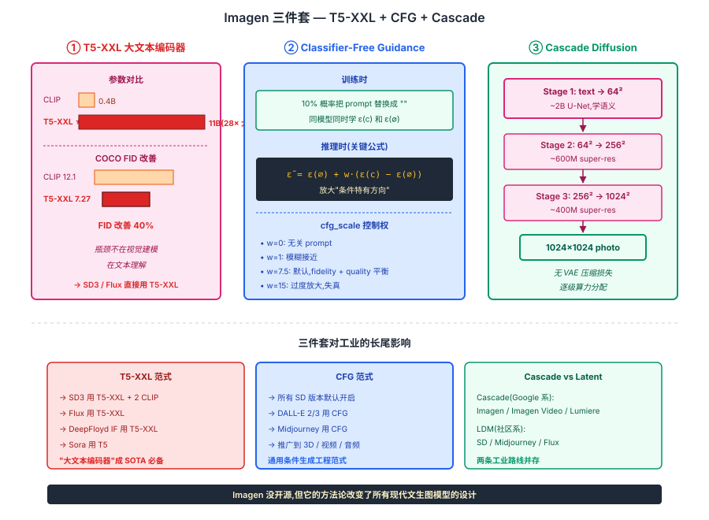
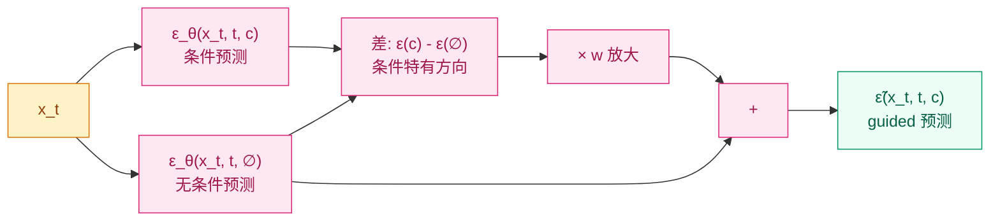
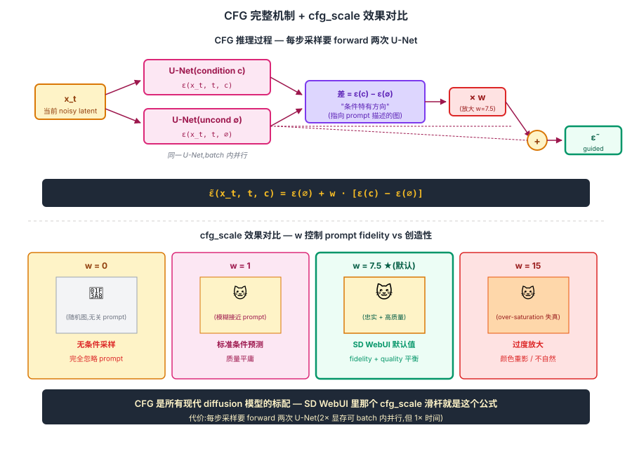

## 前作进展

到 2022 年初,文生图 diffusion 模型有两个明显短板:

**1. 文本理解弱** —— 当时主流文生图模型(DALL-E, GLIDE)用 CLIP text encoder 或类似的"对比学习训出的小文本编码器"。这类编码器擅长"配对相似度"(图文是否匹配),但**对长 prompt 的细节理解差**——"一只戴着圆形礼帽的橙色猫站在蓝色椅子上"这种描述,模型常常忽略颜色 / 数量 / 空间关系等细节

**2. 控制力不够** —— Diffusion 是概率模型,采样有随机性。给定同一 prompt,模型可能生成"忠实但平庸"的图,也可能生成"创造性但跑题"的图。早期 diffusion 没有显式控制这个 trade-off 的机制

Google Brain 团队 2022 年 5 月发表 *Photorealistic Text-to-Image Diffusion Models with Deep Language Understanding*(Imagen)同时解决这两件事:

**1. 用 T5-XXL(11B 文本编码器)替代 CLIP**——T5 是预训练在大量文本上的纯语言模型,文本理解远超 CLIP(后者是对比学习产物,文本能力受限)。Imagen 论文里有一个关键 finding:**让文本编码器变大比让 diffusion 模型变大对最终质量影响更大**

**2. 系统化 Classifier-Free Guidance(CFG)**——CFG 不是 Imagen 发明的(Ho & Salimans 2022 *Classifier-Free Diffusion Guidance*),但 Imagen 把它推到极端的 guidance scale(7-10)证明这是文生图质量的关键 trick

Imagen 在 COCO FID(zero-shot)上拿 7.27,击败 DALL-E 2 的 10.39 + 当时所有公开模型。更重要的是 CFG 这一技术被所有后续工作沿用——**今天每个文生图模型都依赖 CFG**,SD / SDXL / SD3 / Flux / Midjourney / DALL-E 3 全部默认开启 CFG。

Imagen 本身没开源(Google 内部),但它的方法论(大文本编码器 + 高 guidance scale)直接影响了 SDXL / SD3 / Flux 的设计。

## 核心思想

### 直觉:文生图瓶颈不在视觉建模,在文本理解 + 可控性

理解 Imagen 真正需要先抓一件事:**2022 年初文生图 diffusion(DALL-E 2 / GLIDE / SD v1)都用 CLIP text encoder(0.4B)** — 但 CLIP 是对比学习产物,擅长"图文匹配相似度",**对长 prompt 的细节理解差**(否定 / 数量 / 空间关系经常忽略)。同时 diffusion 采样有随机性,**生成"忠实 prompt"还是"创造性偏离" trade-off 无法显式控制**。Google Brain 2022 同时解决这两件事 — 而且发现一个反直觉结论:**让文本编码器变大比让 diffusion U-Net 变大对图像质量影响更大**。

三件事必须同时成立才让 Imagen 在 2022 年成立:

- **T5-XXL(11B)替代 CLIP text encoder** — T5 是纯语言模型在 C4 上训练,语言能力远超对比学习产物;**文本端从 0.4B → 11B(28×),COCO FID 从 12.1 → 7.27 改善 40%**
- **Classifier-Free Guidance(CFG)** — 训练时 10% 概率丢条件,采样时 `ε̃ = ε(uncond) + w·(ε(cond) - ε(uncond))` 放大条件信号;**给用户一个 cfg_scale 滑杆控制 prompt fidelity vs 创造性**
- **三级 cascade diffusion** — 64×64 → 256×256 → 1024×1024 三个独立模型,第一阶段用大模型学语义,后续阶段小模型学高频细节

三件事合起来:**Imagen 在 COCO zero-shot FID 7.27**(vs DALL-E 2 10.39 / GLIDE 12.24 / SD v1 12.6),**39% 时间被人工偏好胜过真实照片**(50% 是不可区分)。文生图第一次在 photorealism 上接近人类创作水平。**核心方法论贡献**:CFG 成为所有现代 diffusion 模型的标配(SD / SDXL / SD3 / Flux / DALL-E 2/3 / Midjourney 全部默认开启)+ "大文本编码器"成为 SOTA 文生图必备(SD3 / Flux 直接用 T5-XXL)。


*图 1:Imagen 三件套总览。**左** T5-XXL(11B 冻结)替代 CLIP(0.4B),文本理解 + COCO FID 改善 40%。**中** Classifier-Free Guidance — 训练时 10% 丢条件,采样时 ε̃ = ε(∅) + w·(ε(c) - ε(∅));用户调 cfg_scale 控 prompt fidelity vs 创造性。**右** 三级 cascade — 64² → 256² → 1024²,逐级 super-resolution。底部 callout:这三件套在 2022 年同时改变文生图行业 — CFG 成所有 diffusion 标配,T5-XXL 成 SOTA 文生图必备。*

## 机制一:Classifier-Free Guidance — 用减法 + 放大控制条件强度

CFG 的想法极其简洁但效果巨大。先看它要解决的问题:

**Diffusion 的条件采样**默认是 `ε_θ(x_t, t, c)`——给定条件 `c`(文本 embedding)预测噪声。但模型实际给出的 `ε_θ(x_t, t, c)` 是**在条件分布上的"平均预测"**——会同时考虑"严格按 prompt 的图"和"模糊接近 prompt 的图",最终采样是两者的混合。

CFG 的解法:**训练时让模型有 10-20% 概率丢掉条件(用空 prompt `""` 替代),让同一个模型同时学到条件预测 `ε_θ(x_t, t, c)` 和无条件预测 `ε_θ(x_t, t, ∅)`**。采样时用以下公式得到"放大条件信号"的预测:

$$
\boxed{\tilde{\epsilon}(x_t, t, c) = \epsilon_\theta(x_t, t, \emptyset) + w \cdot \big[\epsilon_\theta(x_t, t, c) - \epsilon_\theta(x_t, t, \emptyset)\big]}
$$

直觉:`[ε(条件) - ε(无条件)]` 是"条件特有的方向"——指向 prompt 描述的图。把这个方向放大 `w` 倍(典型 `w = 7-10`),就让生成的图更"严格符合 prompt"。



*图 1:CFG 推理过程 — 每一步采样要算两次 U-Net forward(条件 + 无条件),然后把"条件特有方向"放大 w 倍,生成更忠实于 prompt 的图。*

**CFG 的 trade-off**:

- **`w = 0`** —— 完全用无条件,生成的图和 prompt 无关
- **`w = 1`** —— 用条件预测,但没放大,生成模糊接近 prompt
- **`w = 7-10`**(典型默认)—— 中等放大,prompt fidelity 高且图质量好
- **`w > 15`** —— 过度放大,图开始失真(over-saturation, 重影)

这就是 SD WebUI 里的 "CFG Scale" 滑杆——所有用户都在调它,但很少有人知道它的数学是这个简单的减法 + 放大。

**代价是采样速度变 2 倍**——每一步要 forward 两次 U-Net(一次条件一次无条件)。但因为质量提升巨大,所有工业 diffusion 都接受这个代价。

## 机制二:三级 Cascade Diffusion — 分辨率逐级提升

Imagen 的另一关键设计是**三级 cascade diffusion**——三个独立的 diffusion 模型分别做不同分辨率:

```
T5-XXL(11B,冻结)→ text embedding
                         ↓
[Diffusion 1: text → 64×64]      (~2B 参数)
                         ↓
[Diffusion 2: 64×64 → 256×256]   (super-resolution, ~600M)
                         ↓
[Diffusion 3: 256×256 → 1024×1024] (super-resolution, ~400M)
```

每个 diffusion 单独训练,前一个的输出作为下一个的条件。这种 cascade 设计的好处:

- **第一阶段(text → 64×64)**用所有算力学"文本到图像的语义映射",分辨率低算力承受得起大模型
- **后续两阶段**只学"高频细节填充",不需要重新学文本理解,模型可以小

对比 [LDM](02-ldm.md) 的"VAE compress + latent diffusion + VAE decompress",两条路是不同思路:

- **LDM**:用 VAE 压到 64×64×4 latent,**一次性 diffusion 生成,VAE decode**
- **Imagen**:在 pixel 上做 3 次 diffusion,**逐级 super-resolution**

Cascade 思路质量上可能略好(没有 VAE 信息损失),但工程复杂(3 个模型 + 3 套训练 + 3 次采样),且总算力比 LDM 大。Imagen 选 cascade 是因为 Google 不缺算力;社区(Stable Diffusion)选 LDM 是因为要塞进消费 GPU。**两条路并存** —— Imagen 系工业用,LDM 系开源主流。

## 机制三:大文本编码器(T5-XXL)— 文本理解比视觉建模更重要

Imagen 论文最重要的实证发现(论文 Figure 4)是:**让 text encoder 变大,比让 diffusion U-Net 变大对最终图像质量影响更大**。

实验设计:固定 diffusion U-Net 大小,变化 text encoder:

| 文本编码器 | 参数 | COCO FID-30K ↓ |
|------|------|------|
| CLIP ViT-L/14 | 0.4B | 12.1 |
| T5-Small | 0.06B | 13.5 |
| T5-Base | 0.22B | 11.4 |
| T5-Large | 0.74B | 10.2 |
| T5-XL | 3B | 8.6 |
| **T5-XXL** | **11B** | **7.27** |

T5-XXL 比 CLIP 大 28×,FID 改善 40%。这一发现颠覆了之前的常识——**文生图的瓶颈不在视觉建模,而在文本理解**。

为什么?因为:

- 当时 CLIP text encoder 训练目标是"和图像匹配",这让它学到"图像里有什么"但没学到"语言的细微语义"(否定 / 比较 / 数量 / 空间关系)
- T5 是纯语言模型,在 C4 数据集上训过大量自然语言,真正理解 prompt 的细节
- 大 T5(11B 参数)比小 CLIP(0.4B)的语言能力强 10 倍以上

这一观察直接影响了后续:

- **SDXL**(2023)用双文本编码器(OpenCLIP + CLIP-G)
- **SD3 / Flux**(2024)用 **T5-XXL + CLIP**——sd3 论文几乎照搬 Imagen 的文本编码器选择
- **DeepFloyd IF**(2023)是 Imagen 的开源复现,也用 T5-XXL

到 2024 年,几乎所有 SOTA 文生图模型都用 T5-XXL 或同级别的大文本编码器。

## 三件套协同:CFG + Cascade + T5-XXL 缺一不可

Imagen 在 2022 年能让文生图第一次接近 photorealism,**不是单一改进**,而是三件套同时调到协同点 —— 任何一个抽掉 Imagen 都不成立,这一点和 [ResNet](../01-cnn/05-resnet.md) 的 `shortcut + BN + He 初始化` 协同关系一致:

- **只有 CFG + Cascade,没有 T5-XXL(还用 CLIP)** — 文本理解瓶颈无解,prompt 细节(数量 / 颜色 / 空间关系)生成不准;COCO FID 卡在 ~10,无法到 7.27
- **只有 T5-XXL + Cascade,没有 CFG** — 给同一 prompt 模型可能生成"忠实"或"创造性偏离"的图,**用户无法显式控制 prompt fidelity**;高质量样本随机产生,无法稳定生产
- **只有 T5-XXL + CFG,没有 Cascade(用 LDM 风格)** — 也可以 work(实际上 SD3 / Flux 就是这条路),但 Imagen 选 cascade 是为了**无 VAE 压缩损失** + **逐级算力分配**,在 1024² 高分辨率上质量略胜一筹

三件套合起来才让 Imagen 在 COCO FID 7.27 + 39% photorealism 偏好上 SOTA。**核心方法论贡献**:
1. **CFG 范式** — 用 conditioning dropout + 推理时 ε(c) - ε(∅) 放大,**已扩散到文本生成 / 3D / 视频 / 音频** 等所有条件生成模型,成通用工程范式
2. **大文本编码器认知** — "文生图瓶颈在文本理解" 改变了行业的算力分配策略,SD3 / Flux 把 T5-XXL 当默认配置
3. **Cascade vs Latent 两条工业路线** — Google 系(Imagen / Imagen Video / Lumiere)用 cascade,社区(SD / Midjourney / Flux)用 LDM,**两条路并存至今**


*图 2:**上半** CFG 推理过程详解 — x_t 同时算 ε(条件)和 ε(无条件),取差 ε(c) - ε(∅) 作"条件特有方向",放大 w 倍加回 ε(∅) 得到 ε̃;每步采样要 forward 两次 U-Net(2× 显存可 batch 内并行,但 1× 时间)。**下半** cfg_scale 效果对比 — w=0(无关 prompt 的图)/ w=1(模糊接近)/ w=7.5(默认,fidelity + quality 平衡)/ w=15(过度放大,over-saturation 失真)。底部 callout:CFG 是所有现代 diffusion 模型的标配,SD WebUI 里那个 cfg_scale 滑杆就是这个数学公式。*

## 性能对比

Imagen 在 2022 年 COCO zero-shot FID-30K(越低越好):

| 模型 | COCO FID-30K | 人工偏好(vs human ground truth) |
|------|------|------|
| DALL-E 2(OpenAI) | 10.39 | — |
| GLIDE(OpenAI) | 12.24 | — |
| Make-A-Scene(Meta) | 11.84 | — |
| **Imagen(Google)** | **7.27** | **39.2%** |
| Stable Diffusion(LAION/Stability) | 12.6 | — |

Imagen 大幅领先所有竞品,**人工评测中 39% 时间被偏好胜过真实照片**(50% 是不可区分)——这是文生图模型第一次在 photorealism 上接近人类创作水平。

但 Imagen 没开源,Google 一直只内部使用。社区的 DeepFloyd IF(StabilityAI 2023 重新实现)和后来的 SD3 把 Imagen 思想带到了开源生态。

## 训练细节

| 维度 | Imagen 完整 cascade |
|------|------|
| Text encoder | T5-XXL,**完全冻结** |
| Stage 1 diffusion | 2B U-Net,text → 64×64 |
| Stage 2 super-res | 600M U-Net,64 → 256 |
| Stage 3 super-res | 400M U-Net,256 → 1024 |
| 总参数 | T5(11B,冻结)+ ~3B(三个 diffusion) |
| 训练数据 | 460M 内部图文对 + LAION 部分 |
| CFG 默认 weight | w=7-10(论文 Figure 5 显示这区间最优) |
| Conditioning dropout(训练时)| 10% 丢掉文本(用空 prompt) |
| 训练硬件 | TPU v4 集群 |
| 训练时间 | 论文未明说,估计数月 |

注意 **conditioning dropout = 10%** —— 这是 CFG 训练的标准做法,让同一模型既学条件预测又学无条件预测。Ho & Salimans 原 CFG 论文用过 10% / 20% 等比例,效果差异不大。

## 关键代码

CFG 实现的核心是采样时的两次 forward + 放大公式:

```python
import torch

class DiffusionWithCFG:
    def __init__(self, unet, scheduler, text_encoder, vae=None):
        self.unet = unet
        self.scheduler = scheduler
        self.text_encoder = text_encoder
        self.vae = vae  # 如果是 LDM 则有

    @torch.no_grad()
    def training_step(self, image, prompts, conditioning_dropout=0.1):
        """CFG 训练:10% 概率把 prompt 替换成空字符串"""
        x_0 = self.vae.encode(image) if self.vae else image
        # 关键:随机丢掉条件
        drop_mask = (torch.rand(len(prompts)) < conditioning_dropout)
        prompts_dropped = [p if not drop else "" for p, drop in zip(prompts, drop_mask)]
        text_emb = self.text_encoder(prompts_dropped)  # 同时含 cond 和 uncond 样本
        # 标准 DDPM 训练
        t = torch.randint(0, 1000, (x_0.size(0),))
        epsilon = torch.randn_like(x_0)
        x_t = self.scheduler.add_noise(x_0, epsilon, t)
        epsilon_pred = self.unet(x_t, t, encoder_hidden_states=text_emb)
        return F.mse_loss(epsilon_pred, epsilon)

    @torch.no_grad()
    def sample(self, prompts, num_steps=50, cfg_scale=7.5):
        """CFG 采样:每步两次 forward"""
        # 同时算条件和无条件 embedding
        cond_emb = self.text_encoder(prompts)
        uncond_emb = self.text_encoder([""] * len(prompts))

        x = torch.randn(...)  # 噪声初始化
        self.scheduler.set_timesteps(num_steps)
        for t in self.scheduler.timesteps:
            # 把 batch 翻倍:[uncond_batch; cond_batch]
            x_in = torch.cat([x, x])
            text_in = torch.cat([uncond_emb, cond_emb])
            t_in = torch.cat([t.unsqueeze(0)] * 2)
            # 一次 forward 算两个
            noise_pred = self.unet(x_in, t_in, encoder_hidden_states=text_in)
            noise_uncond, noise_cond = noise_pred.chunk(2)
            # CFG 放大公式
            noise_pred = noise_uncond + cfg_scale * (noise_cond - noise_uncond)
            # DDPM 反向一步
            x = self.scheduler.step(noise_pred, t, x).prev_sample
        return x
```

工程要点:

- **`torch.cat([x, x])` 翻倍 batch**——把无条件和条件同时算可以利用 batch parallelism,只要 2× 显存,不是 2× 时间
- **`cfg_scale=7.5`**——SD 的默认值;不同模型最优值不同(SDXL 推荐 5-7,SD3 推荐 4-5)
- **`conditioning_dropout=0.1`**——训练时关键参数,小于 5% 会让 CFG 效果差(无条件分支学得不够)

## 影响 / 后续

Imagen 在 diffusion 历史的位置:**定义了"文生图"的工业标准**。具体影响:

**1. CFG 成为所有现代 diffusion 模型的标配**——SD / SDXL / SD3 / Flux / DALL-E 2/3 / Midjourney / Ideogram / Recraft / Hunyuan-DiT 全部用 CFG。没有 CFG 的 diffusion 模型已经不存在

**2. 大文本编码器成为新标准**——CLIP-only 时代过去,T5-XXL 或同级编码器是 SOTA 文生图必备。这一影响也外溢到视频生成(Sora 用 T5)、3D 生成、shape 生成

**3. Cascade vs Latent 两条工业路线并存**——Google 系(Imagen, Imagen Video, Lumiere)用 cascade;社区系(SD, Midjourney, Flux)用 LDM。两条路线在质量和效率间各有取舍

**4. CFG 在其他领域的应用**——CFG 思想被推广到:文本生成(reduce hallucination)、3D 生成、视频生成、音频生成等。"用 conditioning dropout 训出 unconditional baseline,然后在推理时放大条件差异"成为一种通用工程范式

**5. 文本理解的瓶颈认知**——Imagen 把"模型容量应该分配到 text encoder 还是 diffusion backbone"这一架构决策摆到台面上。后续工作(Pixart-α, SD3)继续探索这一 trade-off

Imagen 留下的开放方向:

- **复杂构图仍弱**——多物体 / 空间关系 / 文字渲染上 Imagen 也不完美 → SD3 / Flux 加入 MM-DiT 多模态融合
- **CFG 的副作用**——高 cfg_scale 时图像 over-saturated → CFG Rescale(2023)等改进
- **训练成本** → [Flow Matching](04-flow-matching.md) 简化训练目标,降低算力代价

→ [04-flow-matching.md](04-flow-matching.md) · 训练目标的现代化,SD3 / Flux 用
→ [02-ldm.md](02-ldm.md) · 平行路线,LDM 选 latent compression,Imagen 选 cascade
→ [01-ddpm.md](01-ddpm.md) · 父方法,CFG 是 DDPM 条件采样的关键增强
→ [../09-multimodal-clip/](../09-multimodal-clip/) · CLIP text encoder 是 SD v1.x 用的,Imagen 论证它比 T5 弱
→ [../05-transformer/01-transformer.md](../05-transformer/01-transformer.md) · T5 是 Transformer 的 encoder-decoder 版
