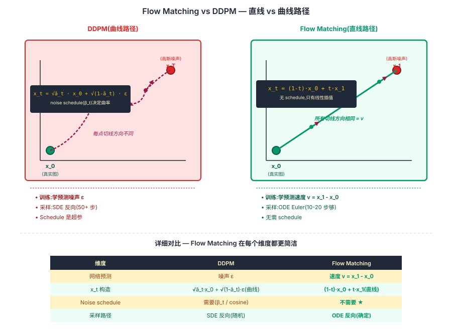
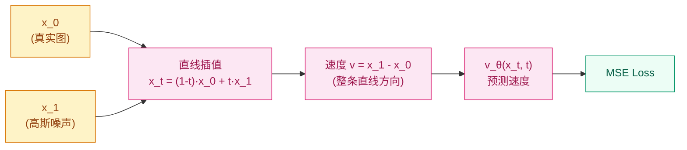
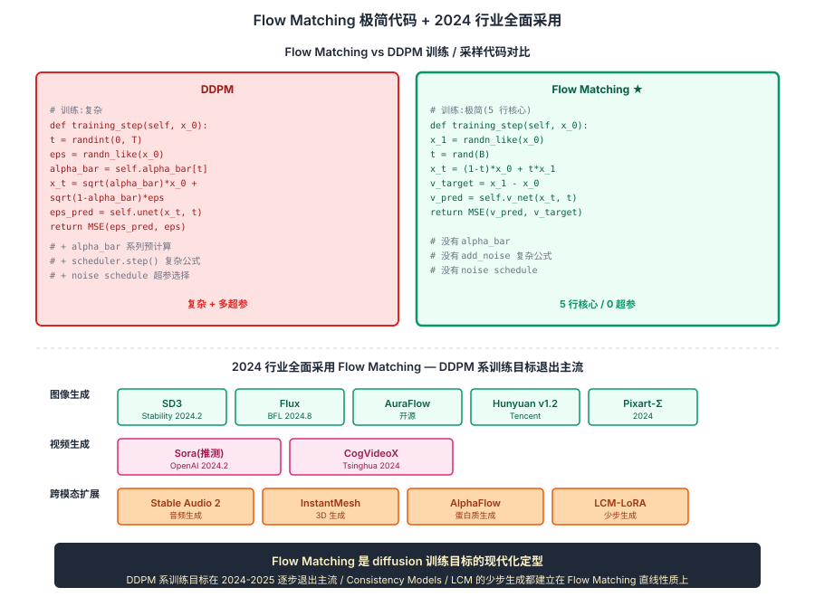

## 前作进展

到 2022 年底,[DDPM](01-ddpm.md) 系 diffusion 模型已经主导视觉生成,但数学上仍有几个让人不满的细节:

**1. 训练目标和采样过程脱节** —— DDPM 训练目标是"预测噪声 ε",采样是按随机微分方程(SDE)反向积分。两者数学连接复杂,需要从变分下界(VLB)绕半天才能推到 ε-prediction loss

**2. 采样路径弯曲** —— SDE 反向过程的路径在 noise → data 之间不是直线,需要多步(50-100)才能采样高质量结果。Consistency Model(2023)和 Progressive Distillation 都试图缩短,但都是"事后修补"

**3. Noise schedule 是超参** —— β_t 的选择(linear / cosine / sigmoid)很影响最终质量,但没有原则性的选择标准,需要经验调

社区 2022-2023 年开始追问:**有没有更干净的数学框架,让训练和采样自然统一,且不依赖具体的 noise schedule?**

两条独立但本质相通的工作给出了答案:

**Flow Matching**(Lipman et al., Meta AI, 2023 年 2 月)—— 从 continuous normalizing flow(CNF)出发,提出"直接学速度场 `v(x, t)`",训练目标是 `v_pred ≈ (x_1 - x_0)`(在 noise 和 data 之间的直线方向)。完全跳过 noise schedule,数学最干净

**Rectified Flow**(Liu et al., UT Austin, 2022 年 9 月发表)—— 几乎同时提出"用直线连接 noise 和 data,学预测速度场"。和 Flow Matching 数学上是同一回事,但术语和推导路径不同

两条工作合并后被统称为 **Flow Matching**,在 2024 年成为主流文生图模型的训练目标:

- **Stable Diffusion 3**(2024 2 月)—— Flow Matching + MM-DiT
- **Flux**(Black Forest Labs, 2024 8 月)—— Rectified Flow + MM-DiT
- **AuraFlow**(2024)—— 开源 Flow Matching 实现

这一节聚焦 Flow Matching 的核心数学思想 + 工程意义,因为它代表了 diffusion 的下一代训练目标——更简洁、更稳定、未来主流。

## 核心思想

### 直觉:把"沿曲线积分预测噪声"换成"沿直线学速度场"

理解 Flow Matching 真正需要先抓一件事:**[DDPM](01-ddpm.md) 数学上有三个不优雅** — ① 训练目标(ε-prediction)和采样过程(SDE 反向积分)需要从变分下界绕半天才推得出;② noise schedule(β_t 用 linear/cosine?)是经验调的超参,没有原则;③ 采样路径在 noise → data 之间不是直线,需要 50-100 步才能拿到高质量结果。Lipman / Liu 等人 2022-2023 反问:**能不能直接在 noise 和 data 之间用直线路径,学预测直线方向上的"速度",一切都是确定 ODE,不需要任何 noise schedule?**

三件事必须同时成立才让 Flow Matching 在 2023 年成立:

- **直线路径替代弯曲 schedule** — `x_t = (1-t)·x_0 + t·x_1`,t ∈ [0, 1] 均匀采,**不需要任何 noise schedule**(β_t / cosine 等全都不要)
- **速度场学习替代噪声预测** — `v_target = x_1 - x_0`(整条直线方向恒定),网络只学这个常数方向,**任务比 DDPM 学"曲线上瞬时切线"简单得多**
- **ODE Euler 反向采样替代 SDE** — 确定 ODE,无随机性,**少步(10-20 步)采样质量已接近 DDPM 50 步**

三件事合起来:**Flow Matching 数学简洁(loss 就是 MSE) + 训练稳定(无 schedule 超参) + 采样高效(直线允许大步)**。2024 年 SD3 / Flux / AuraFlow / Pixart-Σ 几乎所有新文生图模型全部转向 Flow Matching,**DDPM 系训练目标在 2024-2025 逐步退出主流**。这是 diffusion 训练目标的现代化定型,也是 Consistency Models / LCM 等"少步生成"方法的理论基础。


*图 1:**左 DDPM** — `x_t = √ā_t · x_0 + √(1-ā_t) · ε`,noise → data 路径是 schedule 决定的曲线,网络学预测 ε,采样需 SDE 反向 50+ 步。**右 Flow Matching** — `x_t = (1-t)·x_0 + t·x_1`,noise → data 是直线,网络学预测速度 v = x_1 - x_0(常数方向),采样 ODE Euler 10-20 步即可。底部对比 callout:训练目标 ε-prediction vs velocity prediction、schedule 需要 vs 不需要、采样 SDE vs ODE、典型步数 50 vs 10-20。*

## 机制一:直线路径插值 — 替代 noise schedule

Flow Matching 的核心想法:**给定数据点 `x_0`(真实图像)和噪声 `x_1`(纯高斯)之间的一条路径,学一个网络预测路径上每一点的速度方向**。

具体:定义 `x_t = (1 - t) · x_0 + t · x_1`,`t ∈ [0, 1]`——这是从 `x_0` 到 `x_1` 的**直线插值**。在这条直线上,任意点的**速度**(对 t 求导)就是:

$$
v(x_t, t) = \frac{dx_t}{dt} = x_1 - x_0
$$

Flow Matching 训练目标:

$$
\boxed{\mathcal{L}_\text{FM} = \mathbb{E}_{t \sim U[0,1], x_0, x_1}\big[\| v_\theta(x_t, t) - (x_1 - x_0) \|^2\big]}
$$

也就是说,**给定一个插值点 `x_t` 和时间 `t`,让网络预测"从 `x_0` 到 `x_1` 的方向"**。

对比 [DDPM](01-ddpm.md):

| | DDPM | Flow Matching |
|------|------|------|
| 网络预测 | 噪声 `ε` | 速度 `v = x_1 - x_0` |
| 训练目标 | `‖ε - ε_θ(x_t, t)‖²` | `‖v - v_θ(x_t, t)‖²` |
| `x_t` 构造 | `√ā_t · x_0 + √(1-ā_t) · ε`(曲线) | `(1-t) · x_0 + t · x_1`(直线) |
| Noise schedule | 需要(β_t / cosine 等) | **不需要**(t 均匀采) |
| 采样路径 | SDE 反向(随机) | ODE 反向(确定) |



*图 1:Flow Matching 训练 — 在 noise x_1 和 data x_0 之间直线插值,任意点 x_t 的真实速度是 (x_1 - x_0),让网络学预测它。*

## 机制二:速度场学习 — `v_target = x_1 - x_0` 是常数方向

## 机制三:ODE 反向采样 — 确定路径 + 少步可行

采样阶段更优雅——把"预测速度"翻成"沿速度方向走"。从 `t=1`(纯噪声 `x_1`)出发,反向积分 ODE:

$$
\frac{dx}{dt} = v_\theta(x, t), \quad x(1) = x_1
$$

具体步数 N(典型 50,但 Flow Matching 在 10-20 步效果就很好):

```python
def sample(v_net, shape, N=50):
    x = torch.randn(shape)  # x at t=1
    dt = 1.0 / N
    for i in range(N):
        t = 1.0 - i * dt
        v_pred = v_net(x, t)
        x = x - dt * v_pred  # ODE Euler step: x_{t-dt} = x_t - dt · v
    return x  # 这就是生成的 x_0
```

**没有随机性**——SDE 反向有 noise injection,ODE 反向是确定的。这让 Flow Matching 采样比 DDPM 更可重复,也让"少步采样"质量更稳定。

## 三件套协同:直线路径 + 速度学习 + ODE 采样 缺一不可

Flow Matching 在 2023-2024 能成为 diffusion 训练目标的现代化定型,**不是单一改进**,而是三件套同时调到协同点 —— 任何一个抽掉 Flow Matching 都不成立,这一点和 [ResNet](../01-cnn/05-resnet.md) 的 `shortcut + BN + He 初始化` 协同关系一致:

- **只有直线路径,没有速度场学习(还学 ε)** — 直线上的 ε 实际上就是 `x_1` 本身(固定噪声),学到 trivial 解;**必须学速度 v 而非 ε,才让"在直线上预测方向"有意义**
- **只有速度学习,没有直线路径(还用 schedule 曲线)** — 速度场在曲线上是变化的瞬时切线方向,**任务复杂度回到 DDPM 水平**,少步采样优势消失,SD3 / Flux 的训练效率提升也消失
- **只有直线 + 速度,没有 ODE 反向采样(还用 SDE)** — 随机性引入让"直线路径"的优势打折,大步 SDE 仍然质量崩;**确定 ODE 才能在 10-20 步上保持质量**,Consistency Models / LCM 的"1 步生成"也建立在 ODE 可逆性上

三件套合起来才让 Flow Matching 在 2024 年同时拿到:**数学简洁(loss 就是 MSE,无 VLB 推导)+ 训练稳定(无 schedule 超参)+ 采样高效(直线 + ODE 让 10-20 步够)**。这是 diffusion 范式自 DDPM 2020 以来最大的数学简化,也催生了:

- **Consistency Models / LCM** — 用 Flow Matching 的直线性质做"一步生成",LCM-LoRA(2023)让 SD 模型 1-4 步生成,推理实时化
- **跨模态统一框架** — Sora(视频)/ Stable Audio 2.0(音频)/ AlphaFlow(蛋白质)等都用 Flow Matching 变体,**因为它和具体数据模态无关,只需要"在 noise 和 data 之间定义路径"**
- **入门门槛降低** — 训练 Flow Matching 模型比 DDPM 容易得多,无 schedule 调参,Tensor 数学几页纸能讲清


*图 2:**上半** Flow Matching 极简训练 + 采样代码 — 训练 5 行(`x_t = (1-t)x_0 + t·x_1`、`v_target = x_1 - x_0`、`MSE(v_pred, v_target)`),采样 10 行(`x = x - dt·v_pred` ODE Euler 循环)。**对比 DDPM** 训练要 `alpha_bar` 系列预计算 + `add_noise` 复杂公式 + scheduler step。**下半** 2024 行业采用 — SD3 / Flux / AuraFlow / HunyuanDiT v1.2 / Pixart-Σ 几乎所有新文生图模型;视频(Sora 推测)/ 音频(Stable Audio 2)/ 3D(InstantMesh)/ 蛋白质(AlphaFlow)等跨模态扩展。底部 callout:Flow Matching 是 diffusion 训练目标的现代化定型,DDPM 系训练目标在 2024-2025 逐步退出主流。*

## 为什么"直线"比"曲线"好

Flow Matching 在 noise 和 data 之间用**直线插值**,而 DDPM 的 noise schedule 决定 `x_t` 的路径是**曲线**(`x_t` 的方向不是直接指向 `x_0`,而是随 schedule 变化)。

**直线的工程好处**:

**1. 速度场恒定方向** —— 整条直线上速度都是 `x_1 - x_0`,网络只要学"这条直线的方向"——任务比"在曲线上每点的瞬时切线方向"简单得多

**2. 少步采样质量更好** —— 直线允许大步长 ODE 积分,Flow Matching 在 10-20 步采样质量已经接近 50 步;DDPM 在 10 步质量明显下降

**3. 多步可以 "rectify"** —— Rectified Flow 的核心 trick:用训好的 Flow 模型生成 (x_0, x_1) 对,然后再训一次,路径会更"直"——多次 rectify 可以推到 1 步生成

**4. 数学更简洁** —— 没有 β_t 调参,没有 VLB 推导,损失就是简单 MSE。整个理论可以在几页纸内说清楚,比 DDPM 的论文短

直观对比(在 2D toy 数据上):

```
DDPM noise schedule(曲线路径):
    x_T  →  弯弯曲曲  →  x_0
    (路径长且 wiggly,需要小步走)

Flow Matching(直线路径):
    x_1  →  直线  →  x_0
    (大步走就够)
```

## Stable Diffusion 3 的采用

SD3(2024 年 2 月)是 Flow Matching 在工业上首个 SOTA 应用。SD3 的几个关键设计:

**1. Rectified Flow 训练** —— 完全替代 DDPM 的 ε-prediction

**2. MM-DiT(Multi-Modal DiT)backbone** —— 把 [DiT](../08-vit/04-dit.md) 扩展到多模态:图像 patch 和文本 token 共享同一序列做 self-attention,而不是 cross-attention。Text 和 image 在同一 attention 内完全融合,文本理解和图像生成耦合更紧

**3. T5-XXL + CLIP 双文本编码器** —— 沿用 [Imagen](03-imagen.md) 的发现,大文本编码器是关键

**4. Logit-normal noise schedule** —— 不是均匀采 `t ∈ [0, 1]`,而是用 logit-normal 分布偏好中间 t(更难的时间点采样更多次,弥补它们的难度)

SD3 用 Flow Matching 在 800M-8B 参数规模下都展现出**比 DDPM 训练更稳、收敛更快、采样步数更少**的实证。这一结果让 2024 年的几乎所有新文生图模型(Flux, AuraFlow, HunyuanDiT v1.2, Pixart-Σ)都跟进 Flow Matching。

## 训练细节

| 维度 | Stable Diffusion 3 Medium(参考实现) |
|------|------|
| Backbone | MM-DiT, 2B 参数 |
| 文本编码器 | T5-XXL + CLIP-L + CLIP-G(三个并用) |
| 训练目标 | Rectified Flow(等价 Flow Matching) |
| Noise schedule | Logit-normal(t 偏好中间值) |
| 采样器 | Euler ODE(50 steps default,20 steps 也 work)|
| CFG | 用,scale 4-5(比 SD 1.5 的 7-10 低) |
| 训练数据 | LAION-5B + 内部高质量子集 |
| 训练硬件 | H100 集群 |
| 训练时间 | 数月 |

注意 **CFG scale 比 SD 1.5 低**——Flow Matching 训练的模型对条件控制更敏感,不需要高 cfg_scale 也能生成忠实于 prompt 的图。这是 Flow Matching 的实用优势之一。

## 关键代码

Flow Matching 的训练循环极其简短:

```python
import torch
import torch.nn.functional as F

class FlowMatching:
    def __init__(self, velocity_net):
        self.v_net = velocity_net  # 同 DDPM 的 U-Net 或 DiT,只是输出语义不同

    def training_step(self, x_0, condition=None):
        """Flow Matching 训练"""
        # 1. 采高斯噪声(对应 t=1 的点)
        x_1 = torch.randn_like(x_0)
        # 2. 均匀采 t(可以替换成 logit-normal 分布)
        t = torch.rand(x_0.size(0), device=x_0.device)
        # 3. 直线插值得到 x_t
        t_expand = t.view(-1, 1, 1, 1)
        x_t = (1 - t_expand) * x_0 + t_expand * x_1
        # 4. 真实速度就是 x_1 - x_0
        v_target = x_1 - x_0
        # 5. 网络预测速度,MSE loss
        v_pred = self.v_net(x_t, t, condition=condition)
        return F.mse_loss(v_pred, v_target)

    @torch.no_grad()
    def sample(self, shape, num_steps=50, condition=None, cfg_scale=4.0):
        """ODE Euler 反向采样"""
        x = torch.randn(shape)  # x at t=1
        dt = 1.0 / num_steps
        for i in range(num_steps):
            t = 1.0 - i * dt
            t_tensor = torch.full((shape[0],), t, device=x.device)
            # CFG: 同时算 cond 和 uncond 速度
            v_cond = self.v_net(x, t_tensor, condition=condition)
            v_uncond = self.v_net(x, t_tensor, condition=None)
            v_pred = v_uncond + cfg_scale * (v_cond - v_uncond)
            # ODE Euler step
            x = x - dt * v_pred
        return x  # x at t=0,生成的图
```

对比 [DDPM](01-ddpm.md) 的训练循环,Flow Matching 少了:

- ❌ `alpha_bar` 系列预计算
- ❌ `add_noise` 的复杂公式(`√ā_t · x_0 + √(1-ā_t) · ε`)
- ❌ DDPM scheduler 的 step 函数

整个训练 10 行,采样 15 行——是历代最简洁的 diffusion 训练框架。

## 影响 / 后续

Flow Matching 在 diffusion 历史的位置:**diffusion 训练目标的现代化定型**。具体影响:

**1. SD3 / Flux / AuraFlow 全部采用** —— 2024 年开源 SOTA 文生图全转向 Flow Matching。DDPM 系训练目标在 2024-2025 逐步退出主流

**2. Consistency / few-step 模型的理论基础** —— Flow Matching 的"直线路径"思想直接催生了 Consistency Models / Consistency Distillation / Phased Consistency 等"少步采样"方法。LCM-LoRA(2023)让 SD 模型 1-4 步生成,核心是 Flow Matching 思想

**3. 跨模态生成的统一框架** —— Flow Matching 不只限于 2D 图像,扩展到了:
- **视频生成**(Sora 2024,推测用 Flow Matching 变体)
- **音频生成**(Stable Audio 2.0)
- **3D 生成**(InstantMesh)
- **蛋白质生成**(AlphaFlow / FoldFlow)

**4. 训练稳定性的进一步提升** —— Flow Matching 的简单 MSE 目标 + 无 noise schedule 让 hyperparameter 选择简化。社区报告训练 Flow Matching 模型比 DDPM 容易得多,新人入门门槛降低

**5. 数学社区的回应** —— Flow Matching 的简洁数学让 generative modeling 重新成为应用数学的研究热点。Optimal Transport / Schrödinger Bridge / Stochastic Interpolant 等数学工具开始被引入 diffusion 研究

**至此 10-diffusion 家族 4 节点完整**:[DDPM](01-ddpm.md)(概念证明)→ [LDM](02-ldm.md)(工程化)→ [Imagen + CFG](03-imagen.md)(文本控制)→ [Flow Matching](04-flow-matching.md)(训练目标现代化),覆盖 2020-2024 视觉生成完整演化主线。

→ [03-imagen.md](03-imagen.md) · 父方法,CFG 仍在 Flow Matching 里沿用
→ [02-ldm.md](02-ldm.md) · Flow Matching + latent space = SD3 / Flux
→ [01-ddpm.md](01-ddpm.md) · diffusion 范式起源,Flow Matching 是它的数学简化
→ [../08-vit/04-dit.md](../08-vit/04-dit.md) · SD3 用 MM-DiT + Flow Matching,两者合体定型现代文生图
→ [../09-multimodal-clip/](../09-multimodal-clip/) · SD3 的 CLIP-L/G 编码器贡献
