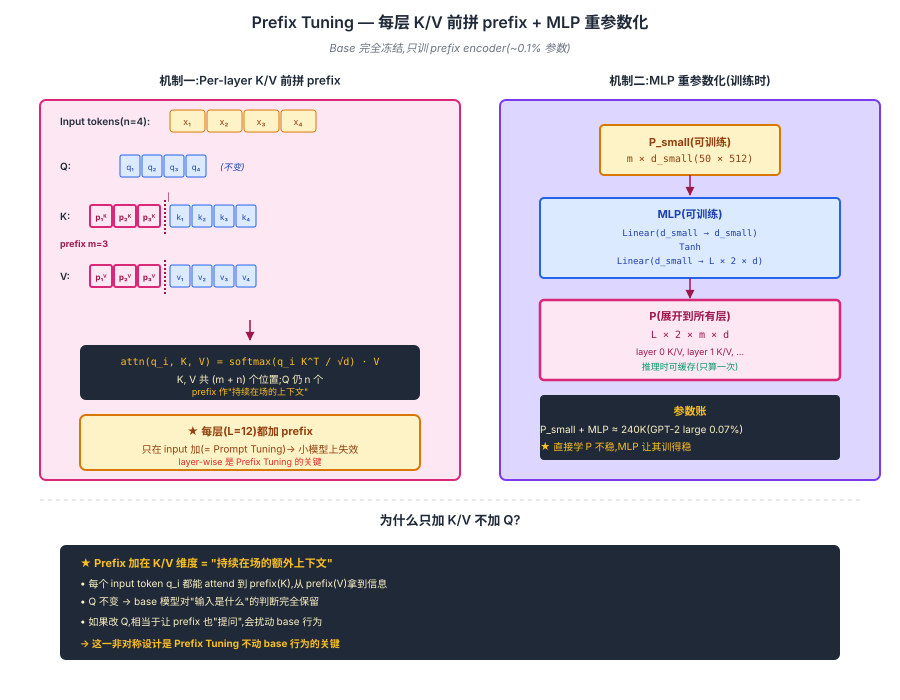
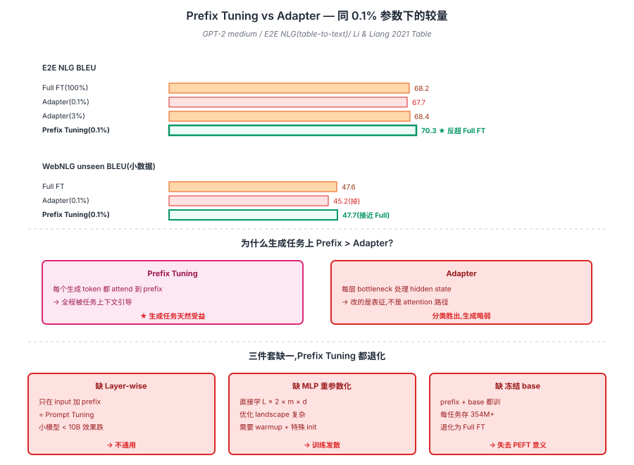

## 前作进展

2020-2021 年 GPT-3 时代,"prompt"成为新关键词。GPT-3 论文展示了 in-context learning(ICL)——给模型几个例子,不微调就能做新任务。这启发了一个问题:**能不能学一个"最优 prompt",而不是手写**?

两条平行尝试:

**1. Discrete Prompt 搜索** —— 用强化学习 / 梯度近似搜索"最好的自然语言 prompt"。代表 AutoPrompt(Shin 2020)。但搜索空间巨大,效果不稳

**2. Continuous Prompt(后来叫 soft prompt)** —— 直接在 embedding 空间优化 prompt token,不要求是"自然语言"。这就是 prefix / prompt tuning 路线

[Adapter Tuning](01-adapter.md)(2019)走的是另一条路:加小模块,改架构。Prefix Tuning 的洞察是:**根本不用改架构,只在 input 前加可训练的 token embedding 就够**。这一思路与 GPT-3 的"prompt 引导能力"哲学一致——LLM 的能力都在,只需要"调对方向"。

Li & Liang(Stanford,2021 年 1 月)的论文展示:

- **只训 0.1% 参数(每层一个 ~50-token 的 prefix)** —— 比 adapter 还少 10×
- **GPT-2 上 table-to-text 生成达到全参微调 95% 性能**
- **小数据任务上有时超过全参**(因为参数限制 = 正则化)

同期 Lester 等人的 **Prompt Tuning**(2021.4)更激进——只在 input embedding 加 prefix(而不是每层),参数更少。但 Prompt Tuning 只对很大模型(GPT-3 175B)效果好,小模型(< 10B)性能跌很多。

Prefix Tuning + Prompt Tuning 这一谱系的核心创新:**让 PEFT 进入"input 维度",不动模型结构**。后来 P-Tuning v2、IA³ 都是这一思路的延伸。

## 核心思想:Layer-wise Soft Prefix

### 直觉

GPT-3 的 in-context learning(ICL)启发了一个反常识的想法:**LLM 的能力都在,只需要"调对方向"**。手写 prompt 难,搜索 discrete prompt 不稳——那就直接在 embedding 空间优化,学一段"虚拟 token"持续在上下文里影响每一步生成。

[Adapter](01-adapter.md) 走的是"加小模块 + 改架构"路线,Prefix Tuning 反过来——**根本不动架构,在每层 attention 的 K/V 前面拼一段可学习的 prefix embedding 就够**。这比 adapter 更接近"prompt 引导"哲学,参数也少 10×(0.1% vs 1%)。

但 soft prefix 要 work,**三个机制必须同时到位**:

1. **Layer-wise prefix on K/V** —— prefix 加在**每层**的 attention K/V 前(只加 input 层效果太弱),而且**只加 K/V 不加 Q**(避免改 query 影响 base 行为)
2. **MLP 重参数化** —— 直接学全部 prefix 不稳定;学一个 small `P_small` + MLP 扩展到所有层 K/V,训练稳定
3. **冻结 base** —— Transformer 原参数完全冻结,梯度只流过 prefix encoder

→ 三机制串起来,GPT-2 medium 上 0.1% 参数(~240K)在 E2E NLG 上反超全参微调,见图 1 Prefix 在 attention 里的注入方式。



## 机制一:Layer-wise Prefix on K/V

Prefix Tuning 在 **每层 Transformer 的 attention 输入** 前加一段可学习的 prefix。

### 结构

```
Standard Transformer attention:
  K = [k_1, k_2, ..., k_n]  (n 个 input token 的 key)
  V = [v_1, v_2, ..., v_n]  (n 个 input token 的 value)
  Q · K^T → softmax → · V

Prefix Tuning attention:
  K = [P_K, k_1, k_2, ..., k_n]   ← 前面拼 m 个 prefix key
  V = [P_V, v_1, v_2, ..., v_n]   ← 前面拼 m 个 prefix value
  Q · K^T → softmax → · V
  (Q 不变)
```

**关键**:Prefix 直接在 K/V 维度上加,不在 Q 上加(否则相当于改 query,会影响后续 token 也产生 prefix)。这一设计让 prefix 作用类似"持续在场的额外上下文"。

## 机制二:MLP 重参数化

### 参数化:不直接学 prefix,学一个 MLP

直接学 prefix embedding 在大模型上不稳定。Prefix Tuning 用一个 MLP 重参数化:

$$
P = \text{MLP}(P_{\text{small}}), \quad P_{\text{small}} \in \mathbb{R}^{m \times d_{\text{small}}}
$$

- $P_{\text{small}}$ 是少量参数(比如 m=50, d_small=512)
- MLP 把它扩展到所有层、所有 attention head 的 K/V

训练时优化 $P_{\text{small}}$ 和 MLP;推理时可以提前算出 $P$ 缓存。

### 参数账

- m = prefix 长度,通常 10-200
- L = layer 数(GPT-2 12 / GPT-2 large 36 / LLaMA-7B 32)
- d = hidden size(768 / 4096)

总 prefix 参数 ~ m × L × d × 2(K + V)。对 GPT-2 large(354M):m=10 → 240K 参数,**0.07%**。

## 机制三:冻结 base + 与 Full FT 对比

| | Full FT | Prefix Tuning |
|------|------|------|
| 更新参数 | 全部 | 仅 prefix(0.1%) |
| 推理开销 | 0 | seq 长度 +m,attention O((n+m)²) |
| 训练显存 | 优化器全状态 | 只优化 prefix |
| 多任务部署 | 每任务一份 model | 一份 base + N 个 prefix |
| 灾难性遗忘 | 有 | 无(base 冻结) |

## 三件套协同 — 0.1% 参数反超全参

> **Layer-wise K/V 注入让每层都受 prefix 引导 + MLP 重参数化让小规模 prefix 训得稳 + 冻结 base 保留通用能力** —— 三者缺一,Prefix Tuning 都达不到"0.1% 反超 Full FT"。

- 只有 **Layer-wise**:直接学全部层的 prefix 矩阵,优化 landscape 复杂 → 训练发散或收敛慢
- 只有 **MLP 重参数化**:只在 input 加 prefix(= Prompt Tuning),小模型(< 10B)效果跌很多
- 只有 **冻结 base**:没有 prefix 也没有 adapter → 没引入任何任务相关参数,无法 fine-tune

三件套协同 → E2E NLG BLEU 70.3 vs Full FT 68.2,小数据 WebNLG 接近全参 — 见图 2 与 Adapter 的对比。



## 关键代码

简化版 Prefix Tuning 实现:

```python
import torch
import torch.nn as nn

class PrefixEncoder(nn.Module):
    """学一个 prefix,通过 MLP 扩展到所有层 K/V."""
    def __init__(self, prefix_len=10, hidden_size=768, num_layers=12, num_heads=12):
        super().__init__()
        self.prefix_len = prefix_len
        self.num_layers = num_layers
        self.num_heads = num_heads
        # 小 prefix embedding
        d_small = 512
        self.prefix_emb = nn.Embedding(prefix_len, d_small)
        # MLP 重参数化
        self.mlp = nn.Sequential(
            nn.Linear(d_small, d_small),
            nn.Tanh(),
            nn.Linear(d_small, num_layers * 2 * hidden_size),  # 2 = K + V
        )

    def forward(self, batch_size):
        # 输出 (num_layers, 2, batch_size, num_heads, prefix_len, head_dim)
        prefix_tokens = torch.arange(self.prefix_len).unsqueeze(0).expand(batch_size, -1)
        emb = self.prefix_emb(prefix_tokens)  # (B, m, d_small)
        kv = self.mlp(emb)  # (B, m, L * 2 * H)
        kv = kv.view(batch_size, self.prefix_len, self.num_layers, 2, self.num_heads, -1)
        return kv.permute(2, 3, 0, 4, 1, 5)  # (L, 2, B, num_heads, m, head_dim)


# 在 attention 里把 prefix 拼到 K/V 前
class PrefixAttention(nn.Module):
    def __init__(self, base_attention):
        super().__init__()
        self.base = base_attention

    def forward(self, hidden_states, prefix_k=None, prefix_v=None, **kwargs):
        # 原本计算 Q K V
        q = self.base.q_proj(hidden_states)
        k = self.base.k_proj(hidden_states)
        v = self.base.v_proj(hidden_states)
        # 拼接 prefix
        if prefix_k is not None:
            k = torch.cat([prefix_k, k], dim=-2)
            v = torch.cat([prefix_v, v], dim=-2)
        # 标准 attention
        return self.base.attention_compute(q, k, v)


# 训练循环:只更新 prefix encoder,base 全冻结
prefix_encoder = PrefixEncoder(prefix_len=20, hidden_size=768, num_layers=12, num_heads=12)
base_model = GPT2Model.from_pretrained("gpt2")
for p in base_model.parameters():
    p.requires_grad = False  # 全冻结

optimizer = torch.optim.AdamW(prefix_encoder.parameters(), lr=1e-3)
# ... train loop
```

在 HuggingFace `peft` 库里:

```python
from peft import PrefixTuningConfig, get_peft_model
from transformers import AutoModelForCausalLM

base = AutoModelForCausalLM.from_pretrained("gpt2-large")
config = PrefixTuningConfig(
    task_type="CAUSAL_LM",
    num_virtual_tokens=20,
    prefix_projection=True,  # 用 MLP 重参数化
)
model = get_peft_model(base, config)
model.print_trainable_parameters()
# → trainable params: 184,320 || all params: 774,030,080 || trainable%: 0.024%
```

## 性能数据

Li & Liang 2021 在 **E2E NLG**(table-to-text)和 **WebNLG**(triple-to-text)生成任务上对比:

| Method | 训练参数 % | E2E BLEU | E2E ROUGE-L | WebNLG BLEU(unseen) |
|------|------|------|------|------|
| GPT-2 medium Full FT | 100 | **68.2** | **70.6** | **47.6** |
| Adapter(0.1%) | 0.1 | 67.7 | 69.5 | 45.2 |
| Adapter(3%) | 3.0 | 68.4 | 70.7 | 48.0 |
| **Prefix Tuning**(0.1%) | **0.1** | **70.3** | **72.1** | **47.7** |

关键观察:

- **同 0.1% 参数下 Prefix > Adapter** —— Prefix Tuning 在 E2E NLG 上更高
- **小数据(WebNLG unseen)上 Prefix 接近 Full FT** —— 参数限制 = 正则化优势
- **生成任务比分类任务更适合 prefix** —— 因为生成时 prefix 一直影响后续 token,而分类只看 [CLS]

GPT-2 medium → large → XL 的 scaling:

| Model | Prefix Tuning | Full FT | Gap |
|------|------|------|------|
| GPT-2 medium(354M) | 70.3 | 68.2 | +2.1 |
| GPT-2 large(774M) | 70.4 | 68.5 | +1.9 |
| GPT-2 XL(1.5B) | **70.6** | 68.6 | **+2.0** |

更大模型上 Prefix Tuning 优势保持。这与 Prompt Tuning(Lester)发现"大模型才能用 prompt tuning"的趋势一致——base 越强,soft prompt 引导能力越强。

## 影响 / 后续

Prefix Tuning 在 LLM 历史的位置:**Soft Prompt 路线的代表,定义了 PEFT 的"input 维度"分支**。

**1. Prompt Tuning(Lester 2021.4)的直接前作** —— Lester 简化 Prefix Tuning,只在 input embedding 加 prefix(而非每层),参数更少。但只在 ≥10B 模型上 work,小模型性能跌。两者经常被合称"prompt-based PEFT"

**2. P-Tuning(Liu 2021)和 P-Tuning v2(Liu 2022)** —— 清华团队对 prefix tuning 的工程改进。P-Tuning v2 把 prefix 扩展到每层,并 reparametrize,在 BERT/GPT/T5 等多种架构上都 work,是 Prefix Tuning 的现代版本

**3. 多任务 / 多语言适配的轻量方案** —— 一个 base + 1000 个 prefix = 1000 个任务专家,每 prefix 仅几百 KB。在 multi-tenant serving 场景下被广泛使用

**4. IA³(2022)** —— Liu 等人提出更极致的 PEFT,通过学习每层的"attention scaling vector"(每个 K/V 一个标量)实现。可看作 prefix tuning 的极简版,只 ~10K 参数

**5. 启发后续 prompt-related 研究** —— Chain-of-Thought prompt、In-Context Learning 都受 soft prompt 思想影响。"prompt 是一种 task-specific bias"的视角源自这条路线

**6. 与 LoRA 的相对地位** —— 在 LLM 时代(7B+),Prefix Tuning 逐渐被 [LoRA](03-lora.md) 取代为工业标配。原因:
   - LoRA 推理零延迟,Prefix Tuning 会增加 seq 长度
   - LoRA 在中小模型(7B-13B)效果稳定,Prefix Tuning 需要大模型才稳
   - LoRA 实现简单,Prefix Tuning 的 MLP 重参数化较复杂

Prefix Tuning 留下的开放问题:

- **推理时多了 m 个 token** —— attention 复杂度 O((n+m)²),长序列时不可忽略
- **难训练** —— soft prompt 优化 landscape 复杂,需要 warmup / 特殊初始化
- **大模型才稳** —— 小模型(< 1B)上 prefix tuning 效果有时不如 adapter
- **可解释性差** —— prefix embedding 不对应任何"自然语言",debug 困难

→ [03-lora.md](03-lora.md) · 工业标准 PEFT,推理零延迟
→ [01-adapter.md](01-adapter.md) · 父思想,Prefix Tuning 是"不改架构"版本
→ [04-qlora.md](04-qlora.md) · LoRA + 量化,极致显存效率
→ [../07-gpt-scaling/03-gpt3.md](../07-gpt-scaling/03-gpt3.md) · Prompt Tuning 受 GPT-3 in-context learning 启发
→ [../15-reasoning-o1-r1/01-cot.md](../15-reasoning-o1-r1/01-cot.md) · CoT 是 discrete prompt 的发现,与 soft prompt 思想互补
