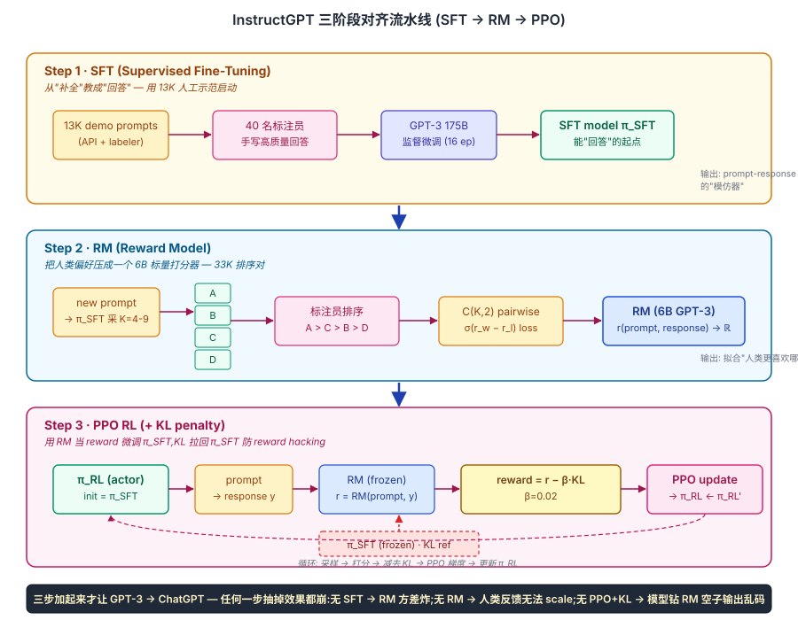
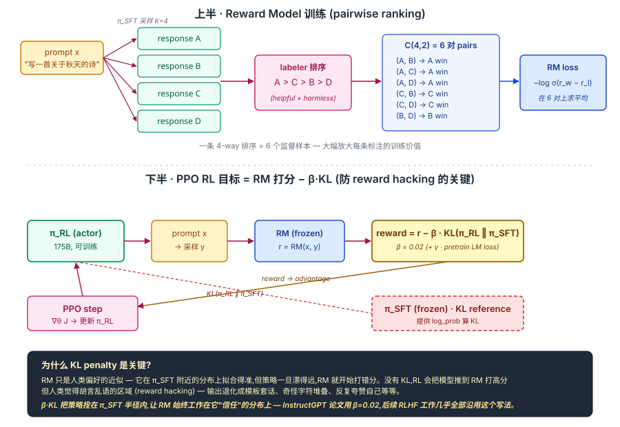

## 前作进展

[2020 Learning to Summarize](01-learning-to-summarize.md) 证明了 RLHF 在单一文本生成任务上可行,但留下两个明确问题:

**1. RLHF 能不能通用化?**——摘要任务的"好坏"相对清晰(覆盖关键信息、流畅、忠实),但通用任务(写代码、回答问题、做推理)的"好坏"是模糊的多维概念。能不能用同一套 RLHF 流程对齐到所有任务?

**2. GPT-3 的行为问题需要工程解**——GPT-3 上线 API 一年后,OpenAI 收集了大量真实用户使用数据,暴露 GPT-3 严重的行为问题:不跟随指令(用户说"翻译这段",GPT-3 可能续写而不是翻译)、说谎(自信编造事实)、不安全(响应恶意请求)、不擅长简单任务(算术、列表整理)。这些问题不是"模型能力不足",而是"模型不知道用户想要什么"——典型的对齐问题

OpenAI 团队 2022 年 1 月发表 *Training Language Models to Follow Instructions with Human Feedback*(InstructGPT)给出的答案是:**用 RLHF 把 GPT-3 对齐到指令跟随任务**。这一工作的核心数据:

- 雇佣 **40 名全职标注员**(主要在肯尼亚和菲律宾)
- 收集 **13K 条 SFT demonstrations**(标注员自己写"好的回答")
- 收集 **33K 对偏好比较**(同一 prompt 多个模型输出,标注哪个更好)
- 用这些数据对 GPT-3 做 SFT → RM → PPO 三阶段对齐
- 产出 InstructGPT 模型(1.3B / 6B / 175B 三个版本)

**结果震撼**:**1.3B InstructGPT 在大多数任务上的人工偏好评分超过 175B 原版 GPT-3**——对齐胜过 100× 规模。这一发现直接定义了 LLM 部署的新范式:**不要部署基础模型,部署对齐模型**。10 个月后(2022 年 11 月)发布的 ChatGPT 就是 InstructGPT 三阶段流程在 GPT-3.5 上的部署版,引爆 LLM 进入消费市场。

## 核心思想

### 直觉:GPT-3 不是"不会",而是"不知道你要什么"

GPT-3 175B 在 2020 年已经强到让人吃惊,但一年的 API 使用数据暴露了一个尴尬现实:它默认输出的不是"对用户有帮助的回答",而是"语料里下一个最可能的 token"。用户输入 "翻译这段法语",GPT-3 经常会顺着续写一段更像法语教材的下文,而不是翻译;用户问一个事实性问题,它可能给出一个看似自信、实则编造的答案;用户希望它拒绝有害请求,它却尽职地把请求执行下去。

这些**不是模型能力不足**——能力测试里它知识量惊人、能写代码、能做小学应用题。问题在于"模型的训练目标"和"用户的真实意图"之间存在系统性错位。预训练只教会它一件事:**给定上文,预测下一个 token 的分布**。而"做用户希望它做的事"从来不在 loss 函数里。

InstructGPT 的核心洞察就一句话:**用人类偏好把 language model 对齐成 assistant**。让模型学的不再是"语料里接下来出现什么",而是"人类更喜欢看到什么样的回答"。这一目标无法用预训练 loss 表达,也很难写出明确的规则——只能让人来打分,再让模型学这个打分。

这个目标拆解下来变成三件事,对应论文的三阶段。


*图 1:InstructGPT 三阶段对齐流水线。Step 1 用人工示范 SFT 把 GPT-3 从"补全"教成"回答";Step 2 用排序数据训一个 6B reward model 把人类偏好压成标量;Step 3 用 PPO 以 RM 打分为 reward 更新 SFT 模型,KL penalty 把策略拴在 SFT 附近。三步缺一不可。*

### 机制一:SFT — 用人类示范的 prompt-response 对热启动

**问题**:RL 在一个完全没经过对齐的基础模型上直接跑会非常痛苦——基础模型采出的回答 95% 都是"续写"而不是"作答",RM 在这种分布上拿不到足够有意义的对比信号,梯度信噪比极低。

**做法**:雇 40 名全职标注员手写 ~13K 条高质量的 prompt-response 对(2–10 分钟一条),在 GPT-3 175B 上做 16 epoch 的标准监督微调。Prompt 来自两个来源:一部分是 API 上脱敏后的真实用户查询,另一部分由标注员合成补全任务类型分布。

**效果**:SFT 之后的模型已经能"回答问题"而不是"续写问题"。它还不擅长精细判断"什么是更好的回答",但作为后两阶段的起点,它把整个动作空间从"所有可能的 token 序列"压缩到了"看起来像在作答的 token 序列",让 RM 和 PPO 不再在汪洋大海里寻找信号。

InstructGPT 论文里有一个常被忽略的数据:**只做 Stage 1 SFT 的模型已经能跑赢 175B GPT-3 + few-shot**——SFT 本身就是巨大的提升,RM+PPO 是在这个起点上的精修。

### 机制二:Reward Model — 用人类偏好排序学一个标量打分器

**问题**:人类知道"哪个回答更好",但说不清"为什么"。直接用规则写 reward 写不出来,直接让人对每个 RL rollout 打 0–10 分又不一致(同一个标注员两天的标准都会漂)。

**做法**:相对判断比绝对打分稳得多。具体流程是——

1. 拿 SFT 模型对每个 prompt 采 K=4–9 个不同回答
2. 标注员把这 K 个回答从好到坏**完整排序**(不是只挑最好的一个)
3. 把一个 K-way 排序拆成 $\binom{K}{2}$ 个 pairwise 比较,训一个 6B 的 RM 拟合:

$$
\mathcal{L}_{RM} = -\mathbb{E}_{(x, y_w, y_l)}\left[\log \sigma\big(r_\theta(x, y_w) - r_\theta(x, y_l)\big)\right]
$$

其中 $y_w$ 是排序中胜出的回答、$y_l$ 是落败的。这是经典的 Bradley-Terry 偏好模型:$P(y_w \succ y_l) = \sigma(r_w - r_l)$。

**两个工程选择值得拎出来**:
- **RM 用 6B 而不是 175B**——RM 不需要生成,只要打分,6B 已能学好"哪个更好"且显存便宜。后续所有 RLHF 工作都遵循"RM 远小于 actor"的惯例(典型 1/10 到 1/30)。
- **排序而不是评分**——一条 4-way 排序拆出 6 个监督样本,大幅放大每条标注的价值;同时排序对标注员心理上更自然、跨人一致性更高。

最终:33K 排序对 → ~200K pairwise 训练样本 → 一个能给任意 (prompt, response) 输出标量分数 $r \in \mathbb{R}$ 的 RM,$r$ 越大代表"人类越喜欢"。

### 机制三:PPO RL — 用 RM 打分 fine-tune SFT 模型 + KL penalty 防漂移

**问题**:有了 RM 之后,最自然的想法是"让 SFT 模型生成回答,RM 打分,用 RL 把高分回答的概率推高"。但只要直接这么做,模型几步之内就会**钻 RM 的空子**——RM 终究是人类偏好的近似,在 SFT 附近的分布上拟合得准,但策略一旦漂得远(比如开始输出奇怪的字符堆叠、模板套话、自吹自擂),RM 就开始打错分,而 RL 会乐此不疲地把模型推向这些 RM 高分但人类觉得是垃圾的区域。这个现象叫 **reward hacking**。

**做法**:在 reward 里加一个 KL penalty,把策略 $\pi_{RL}$ 拴在 $\pi_{SFT}$ 附近——

$$
\text{reward}(x, y) = r_\theta(x, y) - \beta \cdot \text{KL}\big(\pi_{RL}(\cdot|x)\ \|\ \pi_{SFT}(\cdot|x)\big)
$$

然后把这个 reward 喂给 PPO(clipped surrogate objective)做策略梯度更新。论文里 $\beta = 0.02$。

**为什么这条 penalty 是 RLHF 能 work 的关键**:它本质上是在告诉 RL ——你只能在 RM "信得过" 的分布范围内优化。一旦 $\pi_{RL}$ 想偏离 $\pi_{SFT}$ 太远,KL 项就会反向拉回。这把 RM 的"近似偏好函数"局限在它被训练时所见的分布上,避免 RL 把模型推到 RM 没见过的极端区域。

OpenAI 还加了第三项 trick 缓解 alignment tax(详见后文):在 RLHF 目标里混入预训练 LM loss,$\gamma = 27.8$,防止模型在追求 reward 的过程中忘掉基础语言能力。


*图 2:上半 — RM 训练把一条 K=4 的人工排序拆成 6 对 pairwise,用 σ(r_w − r_l) 当损失;下半 — PPO 用 reward = r − β·KL(π_RL ‖ π_SFT) 更新 actor,KL 把策略拴在 SFT 附近防 reward hacking。*

### 三件套协同:SFT + RM + PPO 缺一不可

回到 ResNet 三件套的类比——shortcut + BN + He 初始化任何一件抽掉 152 层都训不起来。InstructGPT 的 SFT + RM + PPO+KL 同样如此:

- **抽掉 SFT**:RM 在基础 GPT-3 的"续写式"采样分布上几乎拿不到有意义的对比信号,RM 训不好;就算硬训,PPO 起点离任何有用的策略都太远,梯度方差爆炸。
- **抽掉 RM**:人类无法实时给 RL 每一步 rollout 打分(成本和速度都不允许)。33K 偏好数据如果不蒸馏成一个可微的 RM,就没法 scale 到 RL 训练所需的 256K 个 episode。
- **抽掉 PPO+KL**:只做 SFT 模型停留在"模仿标注员"的水平——标注员写得不好的样本会被原样模仿,标注员没覆盖的 prompt 上表现差。RM 提供了"超越任何单个标注员"的偏好聚合信号,PPO 把这个信号用梯度上升的方式榨干。但**没有 KL,PPO 会立刻 reward-hack**——论文里删掉 KL penalty 的消融实验中,模型几百步内就开始输出退化文本。

InstructGPT 数据上印证了这个协同:175B + SFT only 就已经显著强于 175B GPT-3 + few-shot,加上 RM+PPO 后再涨一大截,**最终 1.3B InstructGPT 击败 175B GPT-3**——三件套的乘法效应远大于任何单件的加法。

### Prompt 多样性才是把方法从"摘要任务"推到"通用助手"的关键

方法论上 InstructGPT 几乎完全照搬 [Learning to Summarize](01-learning-to-summarize.md) 的三阶段。但效果的天壤之别,来自一件事:**prompt 分布从单一摘要扩展到了真实 API 的全任务**——

| 任务类别 | 占比 | 示例 |
|------|------|------|
| 生成 | 45% | "写一个关于 X 的短故事" |
| 开放 QA | 13% | "为什么天空是蓝色的?" |
| 头脑风暴 | 11% | "5 个适合周末做的活动" |
| 聊天 | 8% | "Hi, how are you?" |
| 改写 | 7% | "把这段话改得更正式" |
| 摘要 | 4% | (Learning to Summarize 那种) |
| 分类 | 3% | "这条评论是正面还是负面?" |
| 其他 | 9% | 代码、提取、推理等 |

这些 prompt 一部分来自 OpenAI API 用户的真实查询(脱敏后),一部分由标注员合成。**用真实分布的 prompt 训练**是 InstructGPT 比之前所有 RLHF 工作都关键的一步——它让模型学到的对齐能力直接覆盖部署场景,而不是只在某一个 benchmark 上漂亮。

## "对齐胜过规模"的实证

InstructGPT 论文最重要的图是 Figure 1——**人工评分胜率**:

| 模型 | API prompt 上的人工胜率(vs 175B GPT-3) |
|------|------|
| 175B GPT-3(基础) | 50% (基准) |
| 175B GPT-3 + few-shot prompting | 56% |
| **1.3B InstructGPT** | **71%** |
| 6B InstructGPT | 84% |
| 175B InstructGPT | 88% |

**1.3B InstructGPT 击败 175B GPT-3,差距 21 个百分点**——这是 LLM 历史最反直觉的结果之一。具体打破的几个常识:

- "更大模型更好":False —— 对齐后小 100× 的模型显著更好
- "RLHF 是小修改":False —— 是行为质变,不是分数微调
- "需要 175B 才能做对齐":False —— 1.3B + RLHF 足够支撑通用助手

各维度细分(Truthful QA、TriviaQA、毒性测试等):

| 维度 | 175B GPT-3 | 175B InstructGPT |
|------|------|------|
| 跟随指令(API) | 50% 胜 | **88% 胜** |
| Truthful QA(诚实度) | 28% | **40%** |
| Toxicity(更低更好) | 0.094 | **0.071** |
| 闭卷 QA(TriviaQA) | 54% | 53%(基本持平) |
| Common-sense reasoning | 持平 | 持平 |

观察:**InstructGPT 在"指令跟随、诚实、安全"上提升巨大,在"知识量、推理"上持平**——这印证了对齐改变的是行为而不是能力。GPT-3 的知识量没变,只是学会了用更恰当的方式使用知识。

## Alignment Tax

InstructGPT 论文里坦诚指出一个反直觉现象:**对齐后的模型在某些标准 NLP benchmark 上反而比基础模型差**。这被称为 **alignment tax**:

| Benchmark | GPT-3 | InstructGPT | 变化 |
|------|------|------|------|
| LAMBADA | 76.2 | 73.1 | -3.1 |
| HellaSwag | 78.9 | 78.3 | -0.6 |
| SQuAD v2 | 84.5 | 82.9 | -1.6 |
| WSC(Winograd Schema) | 87.5 | 81.2 | -6.3 |

为什么?**RLHF 把模型推向了"用户偏好的输出风格",这一风格可能不是 benchmark 评测的最优策略**。比如 InstructGPT 倾向于给出详细解释而非直接答案,SQuAD 评测期望短答案,这一不匹配导致 EM 分数下降。

OpenAI 用一个 trick 缓解 alignment tax——**在 PPO 训练中混入预训练 LM loss**:

$$
\mathcal{L} = \mathbb{E}[r(x, y)] - \beta \cdot \text{KL} + \gamma \cdot \mathbb{E}_{x \sim D_{\text{pretrain}}}[\log p(x)]
$$

第三项让模型同时优化 RLHF 目标和预训练目标,防止过度漂移。`γ = 27.8` 在论文里用,效果是把 alignment tax 减到几乎为 0,同时保持指令跟随能力。这一技巧被后续所有 RLHF 工作沿用(包括 Anthropic、Google、Meta 的对齐方案)。

## ChatGPT 是 InstructGPT 的部署版

ChatGPT(2022 年 11 月 30 日发布)的技术架构核心就是 InstructGPT 三阶段流程,差异主要在:

**1. backbone 升级到 GPT-3.5**——OpenAI 没公开 GPT-3.5 细节,但应该是 GPT-3 175B 加更多数据、更长训练、可能加部分 code

**2. 对话格式特化**——InstructGPT 用单轮 prompt,ChatGPT 用多轮对话(system + user + assistant 三角色)。SFT 数据格式相应改造

**3. 安全对齐加强**——ChatGPT 在拒绝有害请求方面比 InstructGPT 更严格,论文没明说但用户体验明显

**4. 工程化部署**——streaming 输出、缓存优化、多用户负载,这些是 ChatGPT 上线后才完善的工程

但 ChatGPT 没单独发表 paper——OpenAI 的官方位置是"ChatGPT 是 InstructGPT 在对话设置下的版本"。从对齐方法论看,ChatGPT 没引入新东西,只是把 InstructGPT 流程做出了消费产品。

## 数据规模(标注员的工作)

InstructGPT 的标注数据是这家族最重要的工程资产之一:

| 数据类型 | 数量 | 用途 |
|------|------|------|
| SFT demonstrations | ~13K | Stage 1 SFT |
| RM 偏好比较 | ~33K | Stage 2 RM |
| PPO prompts(无 label) | ~31K | Stage 3 generation prompts |

40 名标注员的工作流:

- **demonstration writing**:给定一个 prompt,自己写一个高质量回答(2–10 分钟/条)
- **ranking**:给同一 prompt 的 4–9 个模型输出按好坏排序(3–8 分钟/任务)
- **red-teaming**:主动尝试让模型给出有害输出,标记失败案例(用于改进 safety RM)

OpenAI 的标注指南有 35 页,详细定义"helpful, truthful, harmless"三个原则的可操作判断标准。这一标注体系本身是工程精品,后来 Anthropic、DeepMind 的对齐工作都参考它,Constitutional AI 进一步把这套人工指南转化成"AI 自评的 constitution"。

标注成本估算:**40 标注员 × 6 个月 × $50K/年 ≈ $1M 人力 + 工具开发 + 管理成本**,实际总投入应该在 $2-5M 之间。这是 ChatGPT 之前 RLHF 没普及的核心障碍——只有顶级公司能负担。

## 训练细节

| 维度 | InstructGPT 175B |
|------|------|
| Backbone | GPT-3 175B |
| Stage 1 SFT | 13K demonstrations,16 epoch,cosine lr schedule |
| Stage 2 RM | RM 用 6B GPT-3(不是 175B,因为 RM 显存占用大且 6B 已足够),33K pairs,1 epoch |
| Stage 3 PPO | 256K episodes,KL 系数 β=0.02,pretrain loss 系数 γ=27.8 |
| RLHF 总训练时间 | 数周(混合 V100 + A100) |
| 标注成本 | ~$2-5M |
| 计算成本 | ~$200-500K(预估) |

注意 **RM 比 actor 小**(6B vs 175B)。这是工程常识:RM 只需要给 reward,不需要完整生成能力;6B 已能学好"哪个回答更好"。后续所有 RLHF 工作都用比 actor 小的 RM(典型 RM 是 actor 的 1/10 到 1/30)。

## 关键代码

InstructGPT 的代码结构和 [Learning to Summarize](01-learning-to-summarize.md) 一样,差异主要在数据处理和 prompt 混合。这里展示混合 pretrain loss 的关键 trick:

```python
def ppo_loss_with_pretrain(actor, ref_model, reward_model,
                           prompts, pretrain_batch):
    """带 pretrain loss 的 PPO step,缓解 alignment tax"""
    # 1. 标准 PPO loss(RLHF prompts 上)
    responses = actor.generate(prompts)
    rewards = reward_model(prompts, responses)
    log_probs_actor = actor.log_probs(prompts, responses)
    log_probs_ref = ref_model.log_probs(prompts, responses)
    kl = log_probs_actor - log_probs_ref
    advantages = compute_advantages(rewards - beta * kl)
    loss_rlhf = -(log_probs_actor * advantages).mean()

    # 2. pretrain LM loss(预训练数据上)— 防止模型忘记基础能力
    logits = actor(pretrain_batch.input_ids).logits
    loss_pretrain = F.cross_entropy(
        logits[:, :-1].flatten(0, 1),
        pretrain_batch.input_ids[:, 1:].flatten(),
    )

    # 3. 加权混合
    total_loss = loss_rlhf + gamma * loss_pretrain
    return total_loss
```

`gamma = 27.8` 是 OpenAI 在 175B 上调出来的,小模型上要重新调。直觉上 gamma 越大,模型越保留预训练能力但 RLHF 效果越弱;反之则更激进对齐但 benchmark 退化。

## 影响 / 后续

InstructGPT 是 LLM 历史的另一个分水岭——**它定义了商业 LLM 的部署形态**。具体影响:

**1. ChatGPT 直接来自 InstructGPT 三阶段流程**——2022 年 11 月 30 日 ChatGPT 上线,5 天用户突破 100 万,2 个月突破 1 亿,引爆 LLM 进入消费市场。所有这些都建立在 InstructGPT 对齐方法论之上

**2. "对齐胜过规模"成为新共识**——LLaMA-2-7B-Chat、Mistral-7B-Instruct、Qwen-7B-Chat 等开源对齐版本能在消费硬件上跑且效果接近大模型,直接受 InstructGPT "1.3B 击败 175B" 实验启发

**3. SFT 数据集成为新资产**——Alpaca、Vicuna、UltraChat 等开源 SFT 数据集都仿照 InstructGPT 数据格式构造,InstructGPT 论文 Table 14 的"任务类型分布"几乎成了 SFT 数据建设的标准模板

**4. 标注员工作流标准化**——OpenAI 的 35 页标注指南成为对齐工作的参考模板,Anthropic、Scale AI、Surge AI 等公司围绕"高质量标注 + 红队"建立了完整商业模式

**5. Alignment tax 概念引入对齐讨论**——InstructGPT 论文第一次系统地讨论了"对齐可能损害某些能力",这一观察推动了后续对齐研究关注"如何对齐而不降低能力"的方向

**6. 暴露了 RLHF 的可扩展性问题**——InstructGPT 流程依赖大量人工标注 + 复杂 PPO 工程,只有顶级公司能跑。这一痛点推动了:

- [Constitutional AI](03-constitutional-ai.md) 用 AI 替代人工标注,把对齐成本压到 0
- [DPO](04-dpo.md) 去掉 RL 和 RM,工程上和 SFT 一样简单

→ [03-constitutional-ai.md](03-constitutional-ai.md) · 用 AI feedback 替代 InstructGPT 的 33K 人工偏好对
→ [04-dpo.md](04-dpo.md) · 跳过 RM 和 PPO,把 RLHF 推导成监督学习等价形式
→ [01-learning-to-summarize.md](01-learning-to-summarize.md) · 父方法,三阶段流程的奠基
→ [../07-gpt-scaling/03-gpt3.md](../07-gpt-scaling/03-gpt3.md) · 父结构,InstructGPT 是 GPT-3 的对齐版
→ [../07-gpt-scaling/05-gpt4-llama.md](../07-gpt-scaling/05-gpt4-llama.md) · LLaMA-2-Chat 等开源对齐模型采用 InstructGPT 流程
