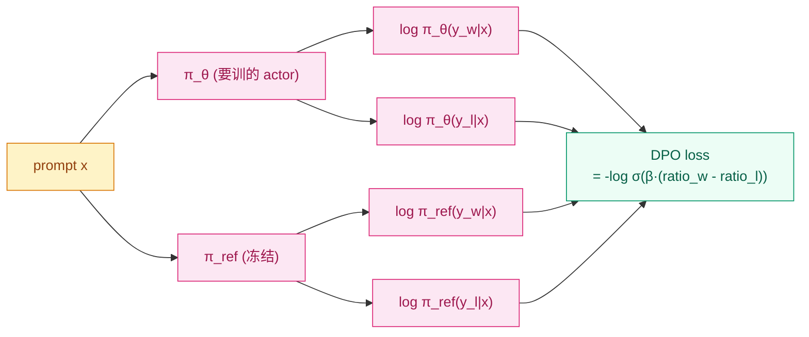

## 前作进展

[InstructGPT](02-instructgpt.md) 和 [Constitutional AI](03-constitutional-ai.md) 各自从"任务通用化"和"AI 替代人工"维度推进了 RLHF,但都保留了**完整的三阶段流程:SFT → RM → PPO**。这个流程在工程上是巨大的负担:

**1. 4 个模型同时常驻显存**——actor(被优化)、critic(算 value)、reward model、reference SFT model。对一个 7B LLM 做 RLHF,显存占用是 SFT 的 ~4 倍

**2. PPO 训练不稳**——KL 系数、reward scaling、advantage normalization、clip ratio 等十几个 hyperparameter 都需要精细调,任何一个错都可能让训练崩或 reward hacking

**3. 推理生成是瓶颈**——PPO 每 step 都要 actor 生成回答,LLM 生成本身就慢;一次 RLHF 训练几天到几周

**4. 分布式协调复杂**——4 个模型需要分布在不同 GPU 上,数据要在它们之间流转,工程实现至少几千行代码;调试也极其困难

这些痛点让 RLHF 在 2022–2023 期间只有顶级公司能跑(OpenAI、Anthropic、Google、Meta)。开源社区想做对齐,要么用简化的 SFT 数据(Vicuna、Alpaca,质量明显差),要么直接用商业 API 做对齐评估,**真正的开源 RLHF 一直没普及**。

斯坦福的 Rafailov 等人 2023 年 5 月发表 *Direct Preference Optimization: Your Language Model is Secretly a Reward Model*(DPO),做了一件看似不可能的事:**通过数学推导,把整个 RLHF 三阶段流程简化成一个监督学习损失**。

DPO 的核心论点:**LLM 本身已经隐式定义了一个 reward model**——LM 给一段回答的概率 `\log p(y|x)` 经过合适变换就是 reward。所以不需要单独训 RM,也不需要 PPO,直接用 (preferred, rejected) 偏好对**端到端训练 LLM** 就行,而且数学上和 RLHF 等价。

这一发现在 2023 年下半年迅速被开源社区采用,Hugging Face TRL、Axolotl 等工具默认支持 DPO,LLaMA-2 衍生模型(Zephyr、Tulu、Nous Hermes)几乎全部用 DPO 而不是 PPO。**DPO 让 RLHF 从"几个公司的专利"变成了"任何人都能跑"**。

## 核心思想:把 RL 推导成监督学习

RLHF 的标准目标是最大化期望 reward,同时受 KL 约束:

$$
\max_{\pi_\theta} \, \mathbb{E}_{x \sim D, y \sim \pi_\theta(\cdot|x)} \left[ r(x, y) \right] - \beta \cdot \text{KL}(\pi_\theta(\cdot|x) \,\|\, \pi_{\text{ref}}(\cdot|x))
$$

DPO 论文的关键观察:**这个目标有闭式解**(closed-form optimal policy)。固定 reward `r(x, y)` 和参考模型 `\pi_{\text{ref}}`,最优策略 `\pi^*` 是:

$$
\pi^*(y|x) = \frac{1}{Z(x)} \pi_{\text{ref}}(y|x) \exp\!\left(\frac{1}{\beta} r(x, y)\right)
$$

`Z(x)` 是归一化因子。这个式子等价于把 reward 函数解出来:

$$
r(x, y) = \beta \log \frac{\pi^*(y|x)}{\pi_{\text{ref}}(y|x)} + \beta \log Z(x)
$$

**关键洞察 1**:**reward 函数可以用 policy 表达**。任何 reward model 都对应一个最优 policy,反过来任何 policy 也对应一个 reward——它们是一一对应的。

**关键洞察 2**:**Bradley-Terry 偏好模型只依赖 reward 差值**:

$$
p(y_w \succ y_l | x) = \sigma\!\left(r(x, y_w) - r(x, y_l)\right)
$$

代入上面 reward 的表达式,**`Z(x)` 这一项消掉了**(因为是相减):

$$
p(y_w \succ y_l | x) = \sigma\!\left(\beta \log \frac{\pi^*(y_w|x)}{\pi_{\text{ref}}(y_w|x)} - \beta \log \frac{\pi^*(y_l|x)}{\pi_{\text{ref}}(y_l|x)}\right)
$$

**关键洞察 3**:这就是一个**直接用 policy 表达的偏好概率**。不需要 reward model,可以直接最大化偏好对的 log-likelihood:

$$
\boxed{\mathcal{L}_{\text{DPO}} = -\mathbb{E}_{(x, y_w, y_l)} \left[ \log \sigma \!\left( \beta \log \frac{\pi_\theta(y_w|x)}{\pi_{\text{ref}}(y_w|x)} - \beta \log \frac{\pi_\theta(y_l|x)}{\pi_{\text{ref}}(y_l|x)} \right) \right]}
$$

这就是 **DPO loss**。它的结构和 cross-entropy 完全一样,可以用标准 SFT 框架训练。**没有 reward model、没有 PPO、没有 critic、没有 advantage estimation**,只需要 actor(`\pi_\theta`)和 reference(`\pi_{\text{ref}}`)两个模型。

## DPO loss 的直觉

把 DPO loss 展开看看模型在做什么:

$$
\log \frac{\pi_\theta(y_w|x)}{\pi_{\text{ref}}(y_w|x)} - \log \frac{\pi_\theta(y_l|x)}{\pi_{\text{ref}}(y_l|x)} = \text{(模型对 winner 的偏置)} - \text{(模型对 loser 的偏置)}
$$

模型在每一对 (winner, loser) 上的目标是:

- **提高 winner 的概率**(相对 reference 而言)
- **降低 loser 的概率**(相对 reference 而言)
- **`\beta` 控制偏离 reference 的程度**——大 `\beta` = 保守(像 RLHF 的强 KL 惩罚),小 `\beta` = 激进

这就是 SFT 的自然推广——SFT 只有正样本(高质量回答),让 model 学习模仿;DPO 有正样本 + 负样本,让 model 学习区分。从这个角度看,**DPO 是"带负样本的 SFT"**。



*图 1:DPO 数据流——只需要 actor 和冻结的 reference 两个模型,计算两对 log-prob 然后算 sigmoid loss。整个流程没有 reward model、没有 sampling、没有 critic。*

## DPO vs PPO 性能对比

DPO 论文核心比较(Anthropic HH-RLHF + IMDb sentiment 两个数据集):

| 方法 | IMDb sentiment(reward) | HH-RLHF 胜率 |
|------|------|------|
| PPO(标准 RLHF) | 0.71 | 56% |
| **DPO** | **0.72** | **64%** |
| Best-of-N(N=128) | 0.70 | 53% |

观察:**DPO 在两个 benchmark 上都比 PPO 略好**。这一结果在后续 Zephyr、Tulu 2、HuggingFaceH4 等开源工作中反复被验证——DPO 不只是工程简化,**性能上和 PPO 持平甚至略好**。

为什么 DPO 能比 PPO 好?几个推测:

**1. 没有 reward hacking**——PPO 在 RM 上优化时,policy 可能找到 RM 评分高但实际有害的输出(reward hacking)。DPO 直接对偏好优化,跳过 RM 这个中介,不会有 hacking
**2. 训练稳定性**——PPO 的多重 hyperparameter(KL 系数、clip、value coef)互相影响,容易陷入局部解;DPO 只有一个 `\beta`,优化曲面更友好
**3. 数据效率**——PPO 需要 actor 生成新数据来训(on-policy);DPO 直接用现有偏好对(off-policy),数据利用率更高

但 DPO 也有几个明确局限:

- **依赖现成偏好数据**——DPO 不能像 PPO 那样在线生成新数据,只能用预先收集的 (winner, loser) 对。对前沿模型这是限制
- **不支持密集 reward**——PPO 可以处理 token-level reward(reward 在生成过程中给),DPO 只能处理 trajectory-level(整个回答一个偏好)。多步推理任务里 PPO 仍有优势
- **没有 exploration**——PPO 在生成过程中可以探索新模式,DPO 完全 supervised,只能学训练数据里看到的对比

## DPO 的衍生

DPO 在 2023–2024 年衍生出一系列改进方法,统称 **DPO family**:

**IPO**(Identity Preference Optimization, Azar 2023)——把 DPO 里的 sigmoid log-likelihood 换成简单 MSE,缓解 DPO 对偏好对噪声的敏感性

**KTO**(Kahneman-Tversky Optimization, Ethayarajh 2024)——基于行为经济学的损失函数,不需要成对比较,可以用单个 (prompt, response, like/dislike) 二元反馈训练。对部署场景的"用户点赞/点踩"数据更友好

**ORPO**(Odds Ratio Preference Optimization, Hong 2024)——把 SFT 和 DPO 合并成单一损失,一次训练完成,不需要先 SFT 再 DPO 的两阶段

**SimPO**(Simple Preference Optimization, Meng 2024)——去掉 reference model,DPO loss 用 length-normalized log-prob 直接算,工程更简单且效果接近

这些变种各有 niche,但 vanilla DPO 仍是开源对齐的默认选择,因为简单 + 稳定 + 工具链成熟。

## 训练细节

| 维度 | 典型 DPO 配置(LLaMA-2-7B 量级) |
|------|------|
| Backbone | LLaMA-2-7B SFT 后版本 |
| 偏好数据 | Anthropic HH-RLHF(~160K 对) / UltraFeedback(~64K 对) |
| Reference model | SFT 后的 model(冻结) |
| Batch size | 64 序列 |
| Learning rate | 5e-7(比 SFT 的 2e-5 小 40 倍 — 防止偏离 SFT 太远) |
| `\beta` | 0.1(典型,有些任务用 0.01-0.5) |
| Epoch | 1-3 |
| 训练硬件 | 单 8 × A100 节点(对比 PPO 需要多节点) |
| 训练时间 | 几小时(对比 PPO 几天) |
| 总成本 | 约 PPO 的 1/20 |

注意 **learning rate 极小**(5e-7)——这是 DPO 的关键经验。lr 太大会让模型偏离 reference 过快,catastrophic forgetting。后续工作发现 lr 是 DPO 最敏感的 hyperparameter。

## 关键代码

DPO 实现极其简单:

```python
import torch
import torch.nn.functional as F

def dpo_loss(actor, ref_model, prompts, chosen, rejected, beta=0.1):
    """
    actor: 要训练的模型 (π_θ)
    ref_model: 冻结的参考模型 (π_ref)
    prompts: [B, T_p]
    chosen, rejected: [B, T_y] — 同 prompt 的偏好回答 vs 拒绝回答
    """
    # 算 actor 和 ref 对 chosen / rejected 的 log-prob(token 求和)
    actor_chosen_logp = log_prob(actor, prompts, chosen)         # [B]
    actor_rejected_logp = log_prob(actor, prompts, rejected)
    with torch.no_grad():
        ref_chosen_logp = log_prob(ref_model, prompts, chosen)
        ref_rejected_logp = log_prob(ref_model, prompts, rejected)

    # log ratio
    chosen_logratio = actor_chosen_logp - ref_chosen_logp
    rejected_logratio = actor_rejected_logp - ref_rejected_logp

    # DPO loss
    logits = beta * (chosen_logratio - rejected_logratio)
    loss = -F.logsigmoid(logits).mean()

    # 监控指标
    chosen_reward = beta * chosen_logratio.detach()
    rejected_reward = beta * rejected_logratio.detach()
    margin = (chosen_reward - rejected_reward).mean()
    return loss, {"chosen_reward": chosen_reward.mean(),
                  "rejected_reward": rejected_reward.mean(),
                  "margin": margin}

def log_prob(model, prompts, responses):
    """计算 log p(response | prompt),对 response token 求和"""
    input_ids = torch.cat([prompts, responses], dim=-1)
    logits = model(input_ids).logits[:, :-1]
    labels = input_ids[:, 1:]
    log_probs = F.log_softmax(logits, dim=-1)
    # 只对 response 部分求 log-prob 之和
    selected = torch.gather(log_probs, 2, labels.unsqueeze(-1)).squeeze(-1)
    response_mask = ...  # mark response tokens
    return (selected * response_mask).sum(-1)
```

对比 [Learning to Summarize](01-learning-to-summarize.md) 节点里的 ppo_step 几百行代码——DPO 完整训练循环大概就这么多。Hugging Face TRL 库里 `DPOTrainer` 总共也就几百行,而 `PPOTrainer` 是几千行。**工程复杂度差一个数量级**。

## 影响 / 后续

DPO 在对齐历史上的位置:**让 RLHF 民主化**。具体影响:

**1. 开源 LLM 全面转向 DPO**——2023 年下半年到 2024 年,几乎所有新发布的开源对齐模型都用 DPO 或其变种:
- **Zephyr-7B**(HuggingFaceH4, 2023 11)——SFT + DPO,7B 击败 70B Chat 模型
- **Tulu 2 / Tulu 3**(AllenAI)——大规模 DPO 训练的开源 LLM 系列
- **Mixtral-8x7B-Instruct**(Mistral, 2023 12)——MoE + DPO
- **LLaMA-3-Instruct**(Meta, 2024)——SFT + DPO(也用了 PPO 元素的混合方案)

**2. RLHF 工程工具链成熟**——Hugging Face TRL、Axolotl、Open-Instruct 等工具默认支持 DPO,文档和教程极其完善。今天一个个人开发者用 1 张 A100 几小时就能跑 7B DPO

**3. RLHF 进入"算法层面"研究**——DPO 之前,RLHF 主要是工程优化(怎么把 PPO 稳定地跑起来);DPO 之后,大量研究在"还能怎么把偏好优化推导成更简单的损失",催生 IPO/KTO/ORPO/SimPO 等一系列

**4. 推动对偏好数据的关注**——DPO 让模型对偏好数据**质量极其敏感**(没有 RM 这一层缓冲),低质量偏好数据会直接污染模型。这一观察催生了对偏好数据 curation 的研究热潮(UltraFeedback、Argilla 等数据集)

**5. 商业 LLM 仍然部分用 PPO**——前沿模型(GPT-4、Claude 3、Gemini)的对齐方法没有完全公开,但社区推测仍混用 PPO 和 DPO。PPO 在 on-policy 学习(模型生成的新数据)上仍有优势,DPO 在 off-policy(已有偏好数据)上效率更高

DPO 留下的开放问题:

- **DPO + 在线偏好**——能否在 DPO 框架里支持在线 actor 生成 + 在线偏好评估?**Online DPO**、**RSO**(Rejection Sampling Optimization)等是这方向的尝试
- **长上下文 DPO**——超长序列的偏好对怎么收集和优化?
- **多目标对齐**——多个不一致原则(helpful vs harmless 有时矛盾)在 DPO 框架下怎么平衡?
- **过程奖励 DPO**——能否把推理过程的细粒度反馈整合进 DPO?([15-reasoning](../15-reasoning-o1-r1/) 的活跃方向)

至此 12-rlhf-alignment 家族完整覆盖:**奠基(Learning to Summarize)→ 通用化(InstructGPT)→ AI 反馈(Constitutional AI)→ 去 RL 化(DPO)**——把 LLM 对齐从"实验室技术"演化到"开源默认选项"的完整路径。

→ [03-constitutional-ai.md](03-constitutional-ai.md) · RLAIF + DPO 是 2024 主流组合
→ [02-instructgpt.md](02-instructgpt.md) · 父方法,DPO 跳过其中的 RM 和 PPO 环节
→ [01-learning-to-summarize.md](01-learning-to-summarize.md) · RLHF 奠基,DPO 在数学上是其等价简化
→ [../07-gpt-scaling/05-gpt4-llama.md](../07-gpt-scaling/05-gpt4-llama.md) · LLaMA-3 等用 DPO + PPO 混合方案
→ [../15-reasoning-o1-r1/](../15-reasoning-o1-r1/) · process reward / DPO 在推理任务上的扩展
→ [../11-peft-lora/](../11-peft-lora/) · LoRA + DPO 是开源对齐的"穷人套餐"——单卡跑 7B 对齐
