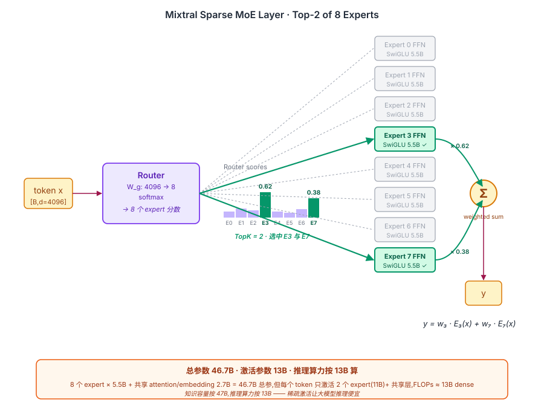
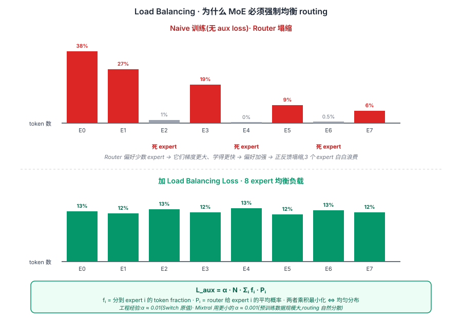

## 前作进展

2023 年底开源 LLM 生态状况:

- **LLaMA-2**(Meta,2023.7)开源 7B / 13B / 70B dense 模型,质量与 GPT-3.5 接近
- **Mistral-7B**(Mistral AI,2023.9)7B dense 但优化训练数据,质量超 LLaMA-2-13B
- **闭源 MoE 已存在但不可用** —— GPT-4 据传是 8×220B MoE,Google Gemini-1.5、Anthropic Claude 据传也是 MoE。但都不开源

开源社区一直拿不到生产级 MoE。[Switch Transformer](02-switch-transformer.md) 论文虽然 2021 年公开,但 Google 没开源权重;HuggingFace 上的 Switch 复现质量与闭源差距大。

社区面临的具体问题:

**1. 没有"好的" MoE 模型可用** —— DeepSpeed-MoE / FairScale 等系统库有但没顶级预训练模型
**2. MoE 工程复杂** —— 训练 MoE 需要 expert parallelism + load balancing 等系统工程,小团队搞不定
**3. 推理框架不支持 MoE** —— vLLM / llama.cpp 等推理引擎当时只支持 dense

Mistral AI(法国创业公司,前 Meta / Google DeepMind 工程师创办)在 2023 年 12 月 8 日**通过磁力链接低调发布 Mixtral 8×7B 权重**(磁力链接形式发布权重至今是 LLM 圈传说),完整开源 + 论文。一夜之间整个开源 MoE 生态被点燃:

- 24 小时内 HuggingFace 下载量爆表
- vLLM / llama.cpp 紧急添加 MoE 支持
- 各种 fine-tune 版本(Dolphin-Mixtral, Nous-Hermes-Mixtral)涌现

Mixtral 不是工程创新最多的 MoE,但它是**第一个能让开源社区真正用上 MoE 的工作**——权重、论文、推理代码全开放。这是开源 MoE 时代的起点。

## 核心思想

### 直觉:总参数大 ≠ 激活参数大,稀疏激活让大模型推理变便宜

理解 Mixtral 真正需要先抓一件事:**dense LLM 的训练成本 ≈ 推理成本 ≈ 参数量**。LLaMA-2-70B 训练完后推理也要按 70B 算力算,每个 token 都要走完所有 700 亿参数。Mixtral 反问:**能不能造一个总参数 47B 但每个 token 只激活 13B 的模型?推理算力按 13B 算,知识容量按 47B 算**。

为什么这件事在 2024 年初才出现于开源生态?三件事必须同时成立:

- **稀疏激活在质量上能 work** —— 早期 MoE(2017 [Sparsely-Gated MoE](01-sparsely-gated-moe.md))质量比同算力 dense 差,直到 Switch + Mixtral 把工程调到 dense 持平甚至更好
- **load balancing 算法成熟** —— naive routing 会塌缩到只用 1-2 个 expert,其余成"死 expert",参数白浪费
- **推理引擎支持稀疏激活** —— vLLM / TRT-LLM / llama.cpp 早期只支持 dense,Mixtral 发布逼着所有引擎在 1-2 个月内补齐 MoE 支持

把这三件事合起来:Mixtral 用 13B 激活算力达到 LLaMA-2-70B 的质量,**性价比直接提升 4-5×**。这也是开源社区第一次拿到生产级 MoE,GPT-4 那种闭源 MoE 的"魔法"第一次有了开源对标。


*图 1:一个 token x 经 router(softmax 输出 8 个 expert 分数) → 选 top-2(高亮 expert 3 和 7,其余 6 个灰掉) → 两个 expert 各自 SwiGLU FFN → 按 router 权重加权和 → 输出。底部 callout:47B 总参数 / 13B 激活,推理算力按 13B 算 / 知识容量按 47B 算。*

### 机制一:Sparse MoE Layer — 用 router 把 token 路由到 top-k expert

Mixtral 基于 Mistral-7B 的 dense backbone,把每层 FFN 替换为 MoE:

```
Mistral-7B FFN:
  x → SwiGLU(W_gate, W_up, W_down)  (~50M 参数)

Mixtral 8×7B MoE Layer:
  x → router(d=4096 → 8) → softmax → top-2
                                     ↓
  对每个 token,选 2 个 expert(每个是 Mistral 风格 SwiGLU FFN,~5.5B 参数)
  output = w₁ · E_{i₁}(x) + w₂ · E_{i₂}(x)
```

参数账:
- N = 8 个 expert,每个 ~5.5B SwiGLU FFN → MoE 参数 ~44B
- attention / embedding 等共享 ~2.7B
- **总参数 46.7B / 激活参数 ~13B**(2 个 expert + 共享 attention)

**关键反直觉点**:router 本身极小(只是一个 `4096 → 8` 的 linear),所有"智能"在 8 个 expert 里。这个轻量 router 决定每个 token 走哪 2 个 expert,等于给 dense 模型加了一层"动态参数调度"。

### 机制二:Load Balancing — 防止某些 expert 永远闲置

Naive 训练 router 会塌缩 —— 训练早期某个 expert 偶然表现好,router 偏向它,它得到更多训练 → 表现更好 → 更被偏向。几轮后只用 1-2 个 expert,其余 6 个成"死 expert",47B 参数大部分白浪费。

Mixtral 用 Switch Transformer 风格的 load balancing aux loss:

$$
L_{\text{aux}} = \alpha \cdot N \cdot \sum_i f_i \cdot P_i
$$

其中 $f_i$ 是 batch 内第 i 个 expert 实际被选中的比例,$P_i$ 是 router 给它的平均概率。这个 loss 鼓励 router 在 batch 内**均匀分配 token 到所有 expert**。$\alpha$ 取 0.001 量级 —— 太大会拖累主任务,太小不起作用。


*图 2:**上半** naive 训练(无 aux loss)—— 8 个 expert 的 token 数柱状图极不均匀,3 个高 5 个矮甚至 0,红字"死 expert"。**下半** 加 load balance loss 后 —— 8 个柱基本等高。底部 callout 给出 aux loss 公式 + α=0.001 经验值。*

### 机制三:Top-2 Routing + Expert Parallelism — 推理与训练的工程基础

为什么 top-2 而不是 top-1?Mistral 团队的经验:

| Top-K | 激活 expert 数 | 质量 | 算力 |
|------|------|------|------|
| 1 | 1 | 较弱 | 1× |
| **2** | **2** | **优** | **2×** |
| 4 | 4 | 极弱提升 | 4× |

Top-2 比 top-1 质量显著高(组合多样性:8 个 expert 选 2 个有 28 种组合),且能 fit GPU expert parallel —— 每个 expert 分到一组 GPU,token 按 router 决定 routing,跨 GPU all-to-all 通信。Top-K=4 几乎没收益但算力翻倍,top-2 是 sweet spot。

**Expert specialization 的反直觉发现**:Mixtral 论文做了个有意思的实验 —— 看不同领域 token 走的 expert 分布。结果**几乎没看到明显的领域特化**,所有 expert 在 Python / English / Math 等各领域 token 上激活率都很均衡。这修正了"expert = 不同专业领域"的早期直觉 —— **Top-K MoE 的 routing 主要按 token 级语法特征分,MoE 的能力增益更像"参数池放大",而非"显式分工"**。

### 三件套协同:稀疏 expert + load balance + top-k routing 缺一不可

Mixtral 在 2024 年能成立并引爆开源 MoE 生态,**不是单一改进**,而是三件套同时调到协同点 —— 任何一个抽掉 Mixtral 都不成立,这一点和 [ResNet](../01-cnn/05-resnet.md) 的 `shortcut + BN + He 初始化` 协同关系一致:

- **只有稀疏 expert,没有 load balance** —— 死 expert 让 47B 参数实际只用到 13B 水平,稀疏化白做
- **只有 load balance,没有 top-k routing** —— top-1 准确率显著低于 top-2,top-many 又退化成 dense,失去稀疏激活的算力优势
- **只有 top-k + load balance,没有真正的稀疏 expert(退化成 dense FFN)** —— 推理算力按 47B 算,失去"激活 13B"的核心卖点

三件套合起来才让 Mixtral 在 13B 激活算力下达到 LLaMA-2-70B 的质量,推理速度 ~50 tokens/s(70B 是 ~12)。这是开源社区第一次拿到"性价比超闭源旗舰"的 LLM,直接催生 DBRX / Qwen-MoE / DeepSeek-V3 等一整代开源 MoE。

## 关键代码

Mixtral MoE Layer 简化版(基于 transformers 库代码):

```python
import torch
import torch.nn as nn
import torch.nn.functional as F

class MixtralSparseMoEBlock(nn.Module):
    def __init__(self, hidden_size=4096, intermediate_size=14336, num_experts=8, top_k=2):
        super().__init__()
        self.hidden_size = hidden_size
        self.num_experts = num_experts
        self.top_k = top_k
        # Router(linear, no bias)
        self.gate = nn.Linear(hidden_size, num_experts, bias=False)
        # 8 experts,每个是 SwiGLU FFN
        self.experts = nn.ModuleList([
            MixtralBlockSparseTop2MLP(hidden_size, intermediate_size)
            for _ in range(num_experts)
        ])

    def forward(self, x):
        # x: (batch, seq, hidden_size)
        b, s, h = x.shape
        x_flat = x.view(-1, h)  # (b*s, h)

        # 1. Router logits
        router_logits = self.gate(x_flat)  # (b*s, num_experts)
        routing_weights = F.softmax(router_logits, dim=-1, dtype=torch.float)
        # Top-2
        routing_weights, selected_experts = torch.topk(routing_weights, self.top_k, dim=-1)
        # 重新归一化(只在 top-2 上)
        routing_weights = routing_weights / routing_weights.sum(dim=-1, keepdim=True)
        routing_weights = routing_weights.to(x.dtype)

        # 2. 逐 expert 计算
        output = torch.zeros_like(x_flat)
        # expert_mask: (num_experts, top_k, b*s)
        expert_mask = F.one_hot(selected_experts, self.num_experts).permute(2, 1, 0)

        for expert_idx in range(self.num_experts):
            # 找到所有选中此 expert 的 (token, top-k-slot) 对
            idx, top_x = torch.where(expert_mask[expert_idx])
            if top_x.numel() == 0:
                continue
            # top_x 是 token index,idx 是 top-k slot index
            current_state = x_flat[top_x]
            current_output = self.experts[expert_idx](current_state)
            # 乘上 routing weight
            current_output = current_output * routing_weights[top_x, idx, None]
            output.index_add_(0, top_x, current_output.to(x.dtype))

        return output.view(b, s, h)

class MixtralBlockSparseTop2MLP(nn.Module):
    """单个 expert,SwiGLU FFN."""
    def __init__(self, hidden_size, intermediate_size):
        super().__init__()
        self.w1 = nn.Linear(hidden_size, intermediate_size, bias=False)
        self.w2 = nn.Linear(intermediate_size, hidden_size, bias=False)
        self.w3 = nn.Linear(hidden_size, intermediate_size, bias=False)

    def forward(self, x):
        return self.w2(F.silu(self.w1(x)) * self.w3(x))
```

完整 Mixtral 推理(用 transformers):

```python
from transformers import AutoModelForCausalLM, AutoTokenizer
tok = AutoTokenizer.from_pretrained("mistralai/Mixtral-8x7B-Instruct-v0.1")
model = AutoModelForCausalLM.from_pretrained(
    "mistralai/Mixtral-8x7B-Instruct-v0.1",
    torch_dtype=torch.bfloat16,
    device_map="auto",  # 自动分片到多 GPU
)
inputs = tok("解释 mixture of experts 的核心思想", return_tensors="pt").to("cuda")
out = model.generate(**inputs, max_new_tokens=200)
print(tok.decode(out[0]))
```

## 性能数据

Mixtral 8×7B 在主流 LLM benchmark 上的成绩:

| Model | 总参 | 激活参 | MMLU | HellaSwag | GSM8K | HumanEval |
|------|------|------|------|------|------|------|
| LLaMA-2-7B | 7B | 7B | 44.4 | 77.1 | 16.0 | 12.8 |
| Mistral-7B | 7B | 7B | 62.5 | 81.0 | 52.1 | 26.2 |
| LLaMA-2-13B | 13B | 13B | 55.6 | 80.7 | 28.7 | 18.3 |
| LLaMA-2-70B | 70B | 70B | 69.9 | 87.1 | 63.4 | 30.5 |
| GPT-3.5 | ~175B? | - | 70.0 | 85.5 | 57.1 | 48.1 |
| **Mixtral 8×7B** | **46.7B** | **13B** | **70.6** | **84.4** | **74.4** | **40.2** |

关键观察:

- **Mixtral 13B 激活击败 LLaMA-2-70B** —— 推理速度比 70B 快 5×(13B vs 70B 激活算力),但 MMLU / GSM8K / HumanEval 全面胜出
- **GSM8K 提升尤其显著** —— 74.4(Mixtral)vs 63.4(LLaMA-2-70B)。MoE 在推理任务上有优势,可能与 expert 多样性相关
- **与 GPT-3.5 持平** —— 开源 MoE 第一次摸到 GPT-3.5 级别质量,代价仅 13B 激活算力

推理速度对比(单 A100,batch=1):

| Model | 激活参数 | tokens/s |
|------|------|------|
| LLaMA-2-70B | 70B | ~12 |
| **Mixtral 8×7B** | **13B** | **~50** |
| Mistral-7B(dense) | 7B | ~80 |

Mixtral 推理速度接近 13B dense,质量超 70B,**性价比 4-5× 提升**。

## 影响 / 后续

Mixtral 在 LLM 历史的位置:**开源 MoE 时代起点,直接催生 DeepSeek-V3 / Qwen-MoE / DBRX 等后续工作**。

**1. 开源 MoE 生态形成** —— Mixtral 发布后 6 个月内,DBRX(132B / 36B 激活,Databricks)、Arctic(480B / 17B 激活,Snowflake)、Qwen1.5-MoE(14.3B / 2.7B 激活,Alibaba)、Grok-1(314B / 86B 激活,xAI)等开源 MoE 涌现

**2. 推理引擎全面 MoE 化** —— vLLM、TensorRT-LLM、llama.cpp、SGLang 等推理引擎在 Mixtral 发布后 1-2 个月内全部加入原生 MoE 支持。MoE 推理优化(expert-level KV cache、动态 batching)成研究热点

**3. MoE 微调实操普及** —— LoRA / QLoRA 对 MoE 模型微调成为可能,催生 Dolphin-Mixtral、Nous-Hermes-Mixtral 等数百个微调版本

**4. Top-K = 2 成开源 MoE 标配** —— 后续 DBRX(top-4)、Qwen1.5-MoE(top-4)有变化,但 top-2 仍是默认起点。Switch 风格 top-1 在开源里几乎绝迹

**5. Expert specialization 研究** —— Mixtral 论文里"expert 不分领域"的发现引发后续研究。MoE-Mamba、Mixture-of-Depths 等工作探索其他粒度的稀疏化

**6. 揭开 GPT-4 架构猜测** —— Mixtral 发布前社区只能猜 GPT-4 架构。Mixtral 出来后,业内"GPT-4 是 8×220B MoE"的传言更可信(因为 Mistral 团队多人来自 OpenAI / Meta,可能借鉴了类似设计)

Mixtral 留下的开放问题:

- **Expert 数 vs 粒度** —— 8 个大 expert 是否最优?[DeepSeek-V3](04-deepseek-v3.md) 用 256 个细 expert,验证细粒度更好
- **共享 expert** —— Mixtral 没有"shared expert"(所有 token 都走的通用 expert)→ V3 引入
- **Load balancing 稳定性** —— Mixtral 训练时仍偶发 expert 失衡 → V3 的 aux-free 方案
- **推理显存** —— 8 expert 全部常驻显存,46.7B 参数需要 90+ GB → expert offload / quantization 工作

→ [04-deepseek-v3.md](04-deepseek-v3.md) · Mixtral 之后开源 MoE 的下一代旗舰
→ [02-switch-transformer.md](02-switch-transformer.md) · Mixtral 的工程基础,Switch 的开源化变体
→ [01-sparsely-gated-moe.md](01-sparsely-gated-moe.md) · 祖师爷
→ [../07-gpt-scaling/05-gpt4-llama.md](../07-gpt-scaling/05-gpt4-llama.md) · Mistral-7B(Mixtral base)的 dense 版本
→ [../15-reasoning-o1-r1/04-deepseek-r1.md](../15-reasoning-o1-r1/04-deepseek-r1.md) · 后续 MoE 模型(V3)成为 R1 的 base
