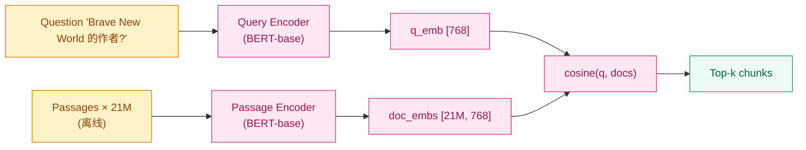
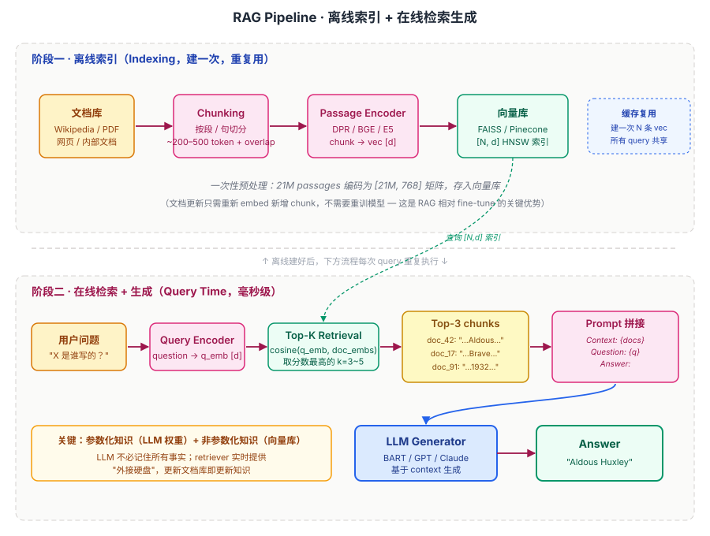
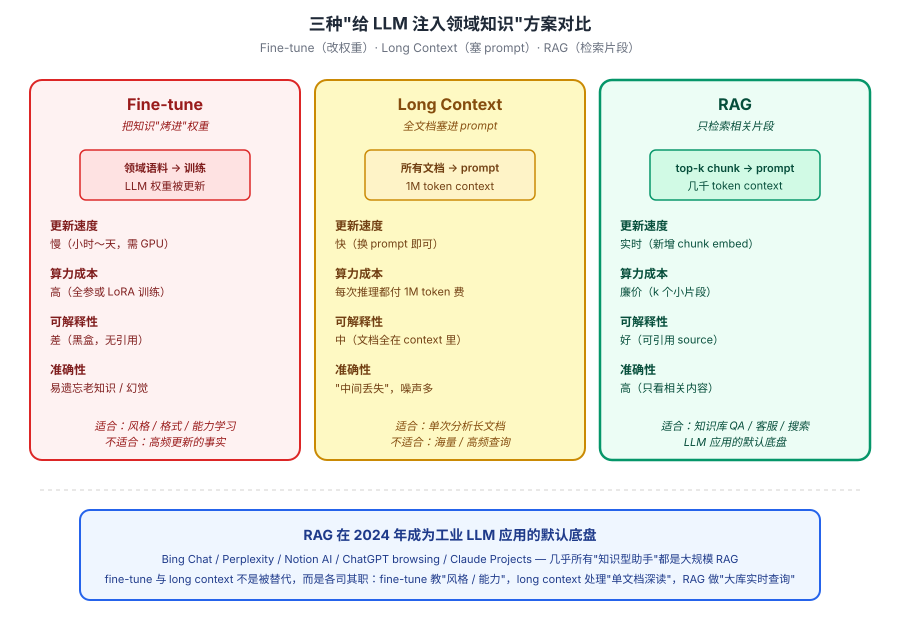

## 前作进展

2018-2020 年大模型路线刚起步,主流知识 QA 任务有两条互相平行的路:

**1. 闭书路线(Closed-book QA)** —— 直接把 GPT / T5 等 LM 在 QA 数据上微调,让模型从参数里"回忆"答案。代表工作:Roberts 2020 "How much knowledge can you pack into the parameters of a language model"。在 Natural Questions 上 T5-11B 达到 35% 准确率。问题:**参数容量有限,长尾事实记不住;知识更新要重训;无法引用来源**

**2. 开书路线(Open-book QA / Reading Comprehension)** —— 给定一段文档让模型读后答题。代表工作:BERT-base SQuAD。但要求人工提供"相关文档",真实开放域 QA 没法用

更接近 RAG 的两个前作:

- **DrQA(Chen 2017)** —— 第一个端到端开放域 QA:先用 TF-IDF 检索 Wikipedia,再用 reader 模型抽答案。但 retriever 和 reader 分离训练,误差累积
- **DPR(Karpukhin 2020,同组)** —— Dense Passage Retrieval,用双塔 BERT 把 query 和 passage 编码到稠密向量空间,内积相似度检索。比 TF-IDF / BM25 在准确率上大幅领先

RAG 论文(2020 年 5 月,NeurIPS 2020)把 DPR + 生成式 LM 端到端联合训练,**第一个让"检索 + 生成"成为统一可微框架**——retriever 和 generator 一起训练,retriever 学到"哪些文档对生成有用"。这是后来所有 RAG 系统的鼻祖。

## 核心思想

### 直觉:LLM 的"参数化知识"加一个"非参数化检索"扩展

理解 RAG 真正要抓的不是公式，而是一件事:**LLM 的权重本质上是一种"压缩的知识存储"**——训练时见过的 wikipedia / 书 / 代码全部被有损压缩成几百亿个浮点数，推理时通过 attention 在权重里"召回"相关片段。这套方案在 GPT-3 / T5 上证明能 work，但有三个不可绕过的根本性局限:

1. **知识有 cutoff** —— 模型只知道训练截止日期之前的事。2024 年的新闻、刚发的论文、上周的产品更新，权重里完全没有
2. **私有 / 长尾知识塞不进权重** —— 公司内部文档、个人笔记、罕见领域的专业资料从未进入训练语料，模型完全不认识
3. **更新知识要重训** —— 想让模型知道一个新事实，最低成本也是 LoRA 微调；想撤回一个错误事实，几乎做不到

RAG 反过来问:**既然知识压缩进权重这么贵又这么僵硬，为什么不让模型推理时实时去外部知识库查?** 把外部文档库做成一个可检索的索引，每次回答问题前先按相关性取出 top-k 文档拼到 prompt 里，再让 LLM 基于这些"现取的资料"生成答案。等于给原本只有"内置硬盘"(权重)的模型外接了一块"可热插拔的硬盘"(向量库)——内置硬盘存通用语言能力 + 常识，外接硬盘存事实 / 长尾 / 私有 / 实时知识。

这个心智模型一换，后面所有 RAG 的工程细节都顺理成章——dense retriever 是把"在大库里找相关文档"做到毫秒级的最简实现、context 拼接是把"检索结果传给 LLM"的最自然接口、Lewis 原论文的端到端训练 vs 现代工业 pipeline 的分歧也是从"retriever 和 generator 该不该一起训"这一点上分出来的。三件事都是从这个直觉演绎出来的。

### 机制一:Dense Retrieval — 用 embedding 做语义检索

要从 21M Wikipedia passage 里挑出与 query 相关的几条，最朴素的方案是 **BM25** 这类基于关键词的稀疏检索:统计 query 词在 doc 里的 tf-idf 分数。这一路线在 2017 年之前是开放域 QA 的默认 retriever (DrQA 就用 TF-IDF + Wikipedia)，但有个根本缺陷——**只匹配字面，不理解语义**。query 写"Brave New World 的作者"，doc 里写"Aldous Huxley penned the dystopian novel"，BM25 直接 miss——两边没有共享词汇。

DPR (Karpukhin 2020) 给出了 dense retrieval 方案:**用双塔 BERT 把 query 和 passage 各自编码成 768 维向量，在同一向量空间用 cosine 相似度检索**。这一对齐思想在结构上和 [CLIP](../09-multimodal-clip/01-clip.md) 的 dual encoder 几乎一样——CLIP 让图像和文本对齐到同一空间，DPR 让 query 和 passage 对齐到同一空间，区别只在两端的模态是同语种文本还是跨模态。



*图 1:DPR 双塔检索——query 和 passage 各走一个 BERT encoder，落到同一 768 维空间，cosine 相似度选 top-k。Passage embedding 离线算一次存进 FAISS 索引，查询时只需对 query 现编码，21M 文档检索压到毫秒级。*

Dense retrieval 的两个工程要点决定了 RAG 能否 work:

- **离线 + 在线分离** —— passage encoder 一次性把 21M chunk 全部编码成 [21M, 768] 矩阵存进 FAISS / HNSW 索引；query 来了只对 query 做一次 encoder 前向，O(log N) 在索引里找 top-k。如果每个 query 都重新编码所有 passage，单次查询要跑 21M 次 BERT，根本不可行
- **语义匹配 vs 词面匹配** —— query "谁发明了 Transformer" 和 doc "Vaswani et al. 2017 Attention Is All You Need" 在词面零重合，但 dense embedding 后 cosine 相似度很高。这是 BM25 完全做不到的。代价是 dense retrieval 在"罕见专有名词" (人名、产品代号) 上偶尔不如 BM25，所以工业系统通常做 **hybrid search**——dense + sparse 分数加权

### 机制二:Context Augmentation — 把检索结果拼进 prompt

有了 top-k 文档之后，怎么让 LLM "用" 这些文档?最朴素也最有效的方案就是**把文档直接拼到 prompt 里**:

```
Context:
[doc_42] Aldous Huxley was an English writer...
[doc_17] Brave New World is a dystopian novel published in 1932...
[doc_91] ...Huxley's masterpiece explores...

Question: Who wrote the novel 'Brave New World'?
Answer:
```

这个接口看似简单，但它的革命性在于:**把"知识"从权重里搬到了上下文里**。LLM 不需要在权重中存储"Brave New World 是 Aldous Huxley 写的"这个事实，只要权重学到"看到 context 中提到 X 写了 Y，回答问题时引用即可"这种通用能力。这是为什么 400M 的 BART + RAG 能在 Natural Questions 上击败 11B 的 T5 闭书——参数少 27×，因为知识不再需要塞进权重。

这一拼接接口还带来三个"白送的"好处:

- **知识可更新** —— 想加新事实，往向量库塞一条 chunk 即可，不动模型权重。想撤回错误事实，删掉对应 chunk
- **答案可引用** —— 拼进 prompt 的每个 chunk 都有来源 ID，LLM 答完可以标 `[doc_42]` 给出引用 (Perplexity / Bing Chat 的 citation 就是这么实现的)
- **领域适配零训练** —— 把通用 LLM 接到法律 / 医疗 / 内部文档库上，只需替换 retriever 的索引，不需要 fine-tune


*图 2:RAG 完整 pipeline 分两阶段。**离线索引**(上)——文档库切 chunk → passage encoder 编码 → 存入 FAISS / Pinecone 向量库，建一次重复用。**在线 query**(下)——用户问题 → query encoder → 在 [N, d] 索引上做 top-k cosine 检索 → 取出 top-3 chunk → 拼成 "Context: {docs}\n\nQuestion: {q}\n\nAnswer:" 模板 → LLM 生成答案。关键:参数化知识 (LLM 权重) + 非参数化知识 (向量库) 协同。*

### 机制三:End-to-End vs Pipeline — Lewis 2020 原版 vs 现代工业 RAG

Lewis 2020 原论文的 RAG 是个**端到端可微系统**——retriever 和 generator 联合训练，retriever 学到"哪些文档对 generator 答对最有帮助"。形式上是把检索文档 $z$ 当 latent variable 边缘化掉:

$$
p(y \mid x) = \sum_{z \in \text{top-k}(p(\cdot | x))} p_{\eta}(z \mid x) \cdot p_{\theta}(y \mid x, z)
$$

- $x$ —— 输入 query，$z$ —— 检索出的文档 (latent)，$y$ —— 生成的答案
- $p_{\eta}(z|x)$ —— retriever (DPR，参数 $\eta$)，$p_{\theta}(y|x, z)$ —— generator (BART，参数 $\theta$)

论文还提了两个变体——**RAG-Sequence** 整个答案共用同一个检索文档 $z$，**RAG-Token** 每个 token 可以"看"不同文档。RAG-Sequence 是大多数任务的默认。

但这套联合训练在工业上几乎没人用。**现代 RAG 几乎 100% 采用 pipeline 模式**——retriever 和 generator 是两个独立组件，各自迭代、可任意替换:

| 维度 | Lewis 2020 端到端 RAG | 现代工业 Pipeline RAG |
|---|---|---|
| Retriever / Generator 关系 | 联合训练，梯度互通 | 独立组件，各自迭代 |
| Retriever 升级 | 要重训整套 | 换 embedding 模型即可 (BGE → E5 → text-embedding-3) |
| Generator 升级 | 要重训整套 | 换 LLM 即可 (GPT-3.5 → GPT-4 → Claude) |
| 知识更新 | 重训 + 重建索引 | 只更新向量库 |
| 工程灵活度 | 低 | 高 |
| 代表系统 | 论文原版 | LangChain / LlamaIndex / Bing Chat |

Pipeline 模式胜出的本质原因:**LLM 能力涨太快**。如果 retriever 和 generator 焊死，每次想升级 generator (比如从 BART 换到 Claude 3) 都要重训整套；pipeline 模式下，retriever 是 embedding 模型 + 向量库的组合、generator 是任意 LLM，两边可以独立按月迭代。代价是失去"retriever 知道 generator 想要什么"的协同优化，但工业上换更强的 embedding 模型 + 更强的 LLM 收益远大于这一点。

### 三件套协同:dense retriever + context 拼接 + LLM 生成 缺一不可

RAG 在 2020 年能 work、在 2023 年成为工业默认底盘，不是单一改进，而是**三件套同时调到协同点**——这一点和 [ResNet](../01-cnn/05-resnet.md) 里 `shortcut + BN + He 初始化` 的关系几乎一模一样，任何一件单拿出来都不够:

- **没有 dense retriever** —— 全靠权重内的参数化知识，cutoff 之后的事 / 私有文档 / 长尾事实全部无解。fine-tune 注入又慢又贵又会遗忘老知识 (见下图对比)。dense retrieval 把"实时查百万级文档"做到毫秒级，是 RAG 整个范式的入口
- **没有 context 拼接接口** —— 即使 retriever 找到了完美文档，LLM 也看不到。早期 closed-book QA 模型 (T5-11B 闭书) 就是这个状态——内部隐式"想象"答案，无法利用外部资料。`Context: {docs}\n\nQuestion: {q}` 这一拼接接口看似平凡，却是把检索结果送进 LLM 推理回路的唯一方式
- **没有足够强的 LLM** —— 即使 context 给了 5 个相关 chunk，弱模型也无法从中提取 + 综合 + 组织出答案。2018 年的 BERT-base 即使给了完美 context 也只能做 extractive QA (从原文抽连续 span)；生成式 RAG 要 work 必须有 BART / GPT 级别的 seq2seq 能力，能基于多个文档生成自然语言答案


*图 3:三种"给 LLM 注入领域知识"方案在 4 个维度的对比。**Fine-tune** 把知识烤进权重——更新慢 / 算力高 / 黑盒 / 易遗忘。**Long Context** 全文档塞进 prompt——更新快但每次推理都付 1M token 费 / 中间丢失。**RAG** 只检索相关片段——更新实时 / 廉价 / 可引用 / 准确性高。底部 callout:RAG 在 2024 年成为工业 LLM 应用的默认底盘 (Bing Chat / Perplexity / Notion AI / ChatGPT browsing / Claude Projects)。三者不是替代关系而是各司其职——fine-tune 教"风格 / 能力"，long context 处理"单文档深读"，RAG 做"大库实时查询"。*

三者合起来才让"参数化 + 非参数化混合"这一 2017 年 DrQA 就提过的想法，在 2020 年第一次跑到"端到端可微 + 击败 11B 闭书模型"的水平。这也是为什么 2017-2019 年之间多次有人摸到边但没做大——他们各自只调好了三件套里的一两件 (DrQA 有 retriever 没 LLM、closed-book QA 有 LLM 没 retriever、reading comprehension 有拼接没 retrieval)。

### 实现细节

- **Retriever**:DPR(双 BERT-base,query encoder + passage encoder),Wikipedia 21M passage,top-K=5
- **Generator**:BART-large(400M),把 query + 检索文档拼接后做 seq2seq
- **Index**:FAISS HNSW,passage embedding 离线建索引
- **训练**:end-to-end 微调 generator(retriever 的 passage encoder 冻结,只训 query encoder)

为什么 passage encoder 冻结?因为重训需要重新对全 Wikipedia 编码,代价巨大。这一工程妥协影响了后来所有 RAG 系统的设计。

## 关键代码

RAG 的极简实现(用 Hugging Face transformers + sentence-transformers):

```python
from sentence_transformers import SentenceTransformer
from transformers import BartForConditionalGeneration, BartTokenizer
import faiss
import numpy as np

# 1. 离线建索引
embedder = SentenceTransformer("facebook/dpr-question_encoder-single-nq-base")
passage_embedder = SentenceTransformer("facebook/dpr-ctx_encoder-single-nq-base")

corpus = load_wikipedia_passages()  # 21M passages
passage_emb = passage_embedder.encode(corpus)  # 离线计算
index = faiss.IndexFlatIP(768)
index.add(passage_emb.astype("float32"))

# 2. 查询时检索 + 生成
def rag_answer(question, k=5):
    q_emb = embedder.encode([question]).astype("float32")
    scores, ids = index.search(q_emb, k)
    top_passages = [corpus[i] for i in ids[0]]

    # 拼接 query + 文档
    context = " ".join(top_passages)
    input_text = f"question: {question} context: {context}"

    tokenizer = BartTokenizer.from_pretrained("facebook/rag-sequence-nq")
    model = BartForConditionalGeneration.from_pretrained("facebook/rag-sequence-nq")
    inputs = tokenizer(input_text, return_tensors="pt", truncation=True, max_length=1024)
    output_ids = model.generate(**inputs, num_beams=4, max_length=64)
    return tokenizer.decode(output_ids[0], skip_special_tokens=True)

print(rag_answer("Who wrote the novel 'Brave New World'?"))
# → Aldous Huxley
```

工业级 RAG 系统还要加几个组件:

- **Re-rank**:top-K 检索后用 cross-encoder 重排
- **Chunk strategy**:长文档按段落 / 句子切分,保留 overlap
- **Hybrid search**:dense + sparse(BM25)混合,长尾词覆盖更好
- **Query rewrite**:把口语化 query 改成检索友好的形式

## 性能数据

RAG 在主流知识 QA benchmark 上的成绩(EM = Exact Match):

| 模型 | Natural Questions | TriviaQA | WebQuestions |
|------|------|------|------|
| BART(闭书) | 26.5 | 26.7 | 27.6 |
| T5-11B(闭书) | 34.5 | 50.1 | 37.4 |
| DPR + extractive | 41.5 | 56.8 | 41.1 |
| **RAG-Sequence** | **44.5** | **56.8** | **45.2** |
| **RAG-Token** | 44.1 | 55.2 | **45.5** |

关键观察:

- **RAG 用 400M BART 击败 11B T5(闭书)**——参数少 27×,准确率反超 10 个点。验证"查比记好"
- **比 DPR + extractive(抽取式)略好**——生成式可以综合多个文档,extractive 只能选一段
- **WebQuestions 上提升最大**——这数据集事实多,闭书参数化知识容易过时

RAG 的另一关键优势:**knowledge update 不用重训**——更新 Wikipedia index 即可,模型参数不变。

## 影响 / 后续

RAG 在 LLM 历史的位置:**奠定了"参数 + 检索"的混合知识范式,所有现代 LLM 应用的基础**。具体影响:

**1. 工业 LLM 应用标配** —— ChatGPT / Claude / Gemini 等聊天助手都加了 RAG 模块。Microsoft Bing Chat、Perplexity、Google AI Overview 本质都是大规模 RAG 系统

**2. Vector DB 行业崛起** —— RAG 需要高效向量检索,催生 Pinecone / Weaviate / Chroma / Milvus 等 vector database 创业公司。FAISS / ScaNN 等开源库也成主流

**3. LangChain / LlamaIndex 生态** —— 围绕 RAG 的工具链爆发。LangChain 提供 RAG pipeline 编排,LlamaIndex 专注于"用 LLM 索引文档"的高级 RAG

**4. 长上下文 vs RAG 之争** —— 2024 年 Claude 3 / Gemini 1.5 把上下文扩到 1-10M token,引发"既然能塞全文档进 prompt,还要 RAG 吗"的讨论。结论是:**RAG 仍然便宜 / 可控 / 可引用,长上下文是补充而非替代**

**5. Self-RAG / GraphRAG 等高级变体** —— Self-RAG(2023)让 LLM 自己决定"何时检索";GraphRAG(2024,Microsoft)用知识图谱组织文档,multi-hop 检索更强。RAG 演化没停

**6. RAG 评估方法** —— RAGAS / TruLens 等专门评估 RAG 系统的 framework 出现。指标包括 retrieval recall、answer faithfulness、context relevance 等

RAG 留下的开放问题:

- **检索召回上限** —— 当 query 和 doc 不共享词汇时,dense retrieval 仍有 miss(需要 hybrid search)
- **多跳推理** —— "X 的妻子的母校在哪"这种需要两步检索的问题,单次 retrieval 答不出 → multi-hop RAG / GraphRAG
- **检索-生成不一致** —— LLM 有时忽略检索到的文档,凭参数化知识乱答(hallucination on RAG)→ Self-RAG / RAG with citations

→ [02-react.md](02-react.md) · Agent 范式,RAG 经常作为 Agent 的一个 tool
→ [03-toolformer.md](03-toolformer.md) · 把 retrieve 当 tool 内化为 LLM 能力
→ [../15-reasoning-o1-r1/01-cot.md](../15-reasoning-o1-r1/01-cot.md) · CoT 是参数化推理,RAG 是参数外知识,可以组合
→ [../05-transformer/01-transformer.md](../05-transformer/01-transformer.md) · DPR 和 BART 都基于 Transformer
