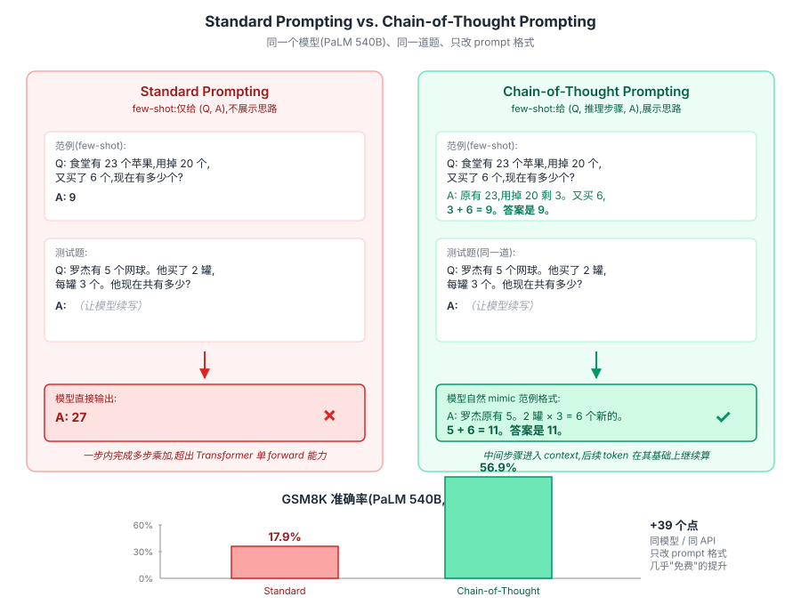
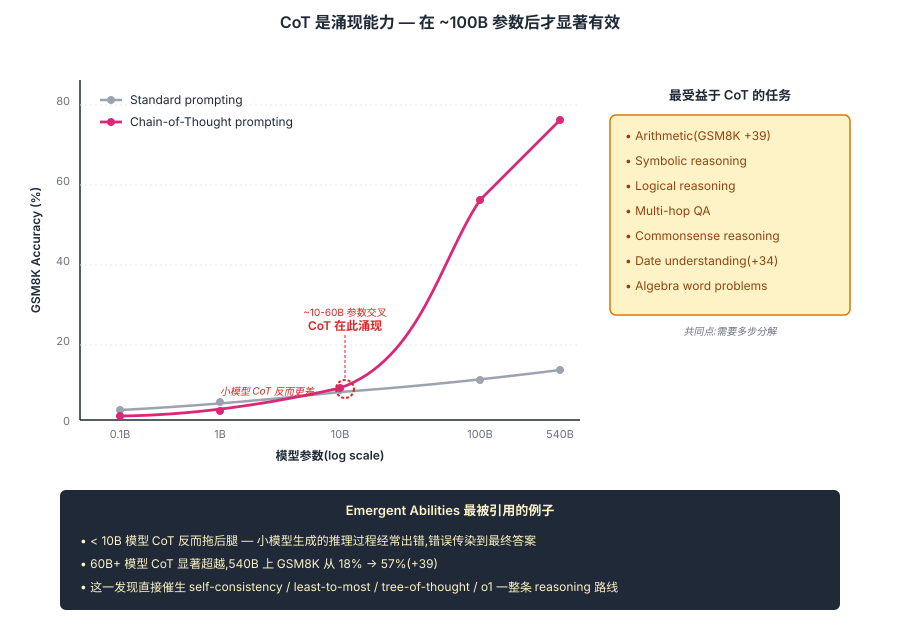

## 前作进展

到 2022 年初,LLM 时代已经被 [GPT-3](../07-gpt-scaling/03-gpt3.md) 的 in-context learning 推到一个新阶段——175B 参数 + few-shot prompt 能做几乎任何 NLP 任务。但**推理类任务**(数学题、逻辑推理、常识链)上 GPT-3 表现意外地差:

| 任务 | GPT-3 175B(标准 few-shot)| 微调 SOTA(2022)|
|------|------|------|
| GSM8K(小学数学) | **17.7%** | 55% |
| MultiArith(算术) | 51% | 99% |
| AQuA(代数应用题) | 24% | 37% |

GSM8K 是 OpenAI 自己出的小学数学数据集,人类基本满分。GPT-3 175B 一个能写代码、能写诗的"万能模型"只能做对 17.7%——**这一现象在 2022 年初被认为是 LLM 的硬性局限**。社区普遍解释是:"LLM 学到的是模式匹配,不是真正的多步推理。"

Google 研究院的 Jason Wei 等人在 2022 年 1 月一次普通实验中发现:**改变 prompt 的格式可以大幅改善这一问题**。具体做法:把传统 few-shot 例子从 `(question, answer)` 改成 `(question, reasoning steps, answer)`,让模型先生成推理过程再给答案。

```
传统 few-shot:
Q: Roger 有 5 个网球。他买了 2 罐,每罐 3 个。他总共有几个?
A: 11

CoT few-shot:
Q: Roger 有 5 个网球。他买了 2 罐,每罐 3 个。他总共有几个?
A: Roger 开始有 5 个。2 罐 × 3 个/罐 = 6 个新的。
   总共 5 + 6 = 11 个。 So the answer is 11.
```

结果令人震惊——**GPT-3 175B 在 GSM8K 上准确率从 17.7% 直接涨到 56.9%**(8-shot CoT)。比这一数字更重要的是:**这一改善是免费的**——同一个模型、同一个 inference API,只改 prompt 格式。

2022 年 1 月发表的 *Chain-of-Thought Prompting Elicits Reasoning in Large Language Models*(CoT)成为 LLM 推理研究的开端。它不只是一个 prompt 技巧——它揭示了 LLM 内部有一种**"未被开发的推理能力"**,只在适当 prompt 下才能展现。这一发现直接催生了后续两年的整个 reasoning 研究方向,最终在 2024 年 [OpenAI o1](03-o1.md) 把推理从 prompt 技巧推到训练目标。

## 核心思想

### 直觉:让模型把"想"显式写下来,推理质量飞跃

理解 CoT 真正需要先抓一件事:**LLM 本来就具备推理能力,只是默认不"想出来"**。GPT-3 175B 在 GSM8K 上准确率只有 17.7% —— 但这不是"模型不会算数学",而是"模型被 prompt 要求一次性吐出答案,在一次 forward 里完成所有计算,超出了 Transformer 的并行算力上限"。Wei 等人 2022 的洞察:**给 few-shot 示例展示"先写推理过程,再写答案"的格式,模型就 mimic 这个格式,把内部推理 unlock 到 token 流里**。同一个模型、同一个 inference API,改 prompt 格式让 GSM8K 从 17.7% 飙到 56.9%。

为什么显式写出来会涨这么多?三个 mechanism 同时起作用:

- **显式推理空间** —— 中间步骤本身成为 context,后续 token 可以 attend 到它,把一次性大计算拆成多次小计算
- **任务难度被均摊** —— 一个 N 步推理题被分解成 N 个单步子任务,每步模型都能高准确率答对,链式准确率 ≈ 每步 accuracy 的乘积,但每步够准就远胜直接一次回答
- **模型规模的涌现门槛** —— 这件事只在 ~60B+ 大模型上 work,小模型生成的推理过程本身就经常错,错误传染到答案后反而比直接回答更差

把这三件事合起来:CoT 不是"教模型新能力",是"让模型把已有能力外显出来"。这一发现在 2022 年初被认为是 LLM 时代最重要的 prompt 突破,直接催生了后续两年的整个 reasoning 路线,最终在 2024 年 [o1](03-o1.md) / 2025 年 [R1](04-deepseek-r1.md) 把"先思考再回答"从 prompt 技巧推到训练目标。

### 机制一:Few-shot CoT — 示例驱动的思维链

最初版 CoT 的方法极其简单 —— **在 few-shot prompt 里展示带推理步骤的例子**:

```
Q: 一个面包店上午做了 28 个面包,下午又做了 36 个。如果他们卖掉了 47 个,还剩多少?
A: 上午做了 28 个,下午做了 36 个,总共 28 + 36 = 64 个。卖掉 47 个后,
   还剩 64 - 47 = 17 个。答案是 17。

Q: 一辆车从 9 点开到 11:30,平均速度 60 公里/小时。开了多远?
A: 从 9 点到 11:30 是 2.5 小时。距离 = 速度 × 时间 = 60 × 2.5 = 150 公里。
   答案是 150。

Q: 商店买入 12 箱苹果,每箱 24 个。1/3 苹果坏了,能卖多少?
A: ?
```

模型看到前两个例子的 "step-by-step then answer" 模式,自然在第三个问题上也输出推理过程:

```
A: 总共 12 × 24 = 288 个苹果。1/3 坏了就是 288 / 3 = 96 个坏的。
   能卖的是 288 - 96 = 192 个。答案是 192。
```

关键工程细节:**示例的推理过程必须用自然语言写出来,不能只写公式**。模型 mimic 的是格式 + 节奏,公式型例子触发不出多步推理。论文用 8 个示例,少于 4 个效果明显下降。


*图 1:同一道 GSM8K 题(网球数量问题),**左侧 standard prompting** 直接出答案,模型经常错;**右侧 CoT prompting** 在 A 后留出推理空间,模型自然输出 "5 + 6 = 11" 这种分步计算然后给答案。底部小柱状图:PaLM 540B 在 GSM8K 上 standard 17.9% → CoT 56.9%,差距 39 个点。同样模型同样推理 API,只改 prompt 格式。*

### 机制二:Zero-shot CoT — 一句魔法咒语 "Let's think step by step"

few-shot CoT 需要人工设计示例,有一定 prompt engineering 成本。Kojima 等人 2022 年 5 月发表 *Large Language Models are Zero-Shot Reasoners* 给出了更简的版本 —— **仅加一句 "Let's think step by step." 就能触发 CoT**:

```
Q: 23 × 47 = ?
A: Let's think step by step.

LLM 自然输出:
A: Let's think step by step.
   23 × 47 = 23 × (50 - 3) = 23 × 50 - 23 × 3 = 1150 - 69 = 1081.
   So the answer is 1081.
```

Zero-shot CoT 在 GSM8K 上让准确率从 17.7% 飙到 78.7%,**几乎追平 few-shot CoT**。这一发现比 few-shot CoT 更深刻 —— 它证明了 **CoT 能力是预训练阶段就内化的**,不是 few-shot 示例"教会"的。模型在 web 数据里见过太多次 "Let's think step by step" 后面跟着分步推理,这一短语成为了"切换到推理模式"的隐式 trigger。

后续被推广到多种触发短语:

- **"Let's break this down."**
- **"Step 1:"** (直接给开头让模型续)
- **"Take a deep breath and work on this problem step by step."** —— Google 2023 发现比"think step by step"还好

这些短语都没有训练时的明确"label",但 LLM 学到了它们的语义关联。

### 机制三:Scale 涌现 — CoT 在 ~100B 参数后才显著有效

CoT 论文最重要的发现是 **CoT 是涌现现象**,只在模型规模超过某个阈值后才有正收益。论文 Figure 4 的关键数据:

| 模型规模 | 标准 prompt | CoT prompt | 提升 |
|------|------|------|------|
| LaMDA 8B | 5% | 4% | **−1%**(更差) |
| LaMDA 62B | 9% | 18% | +9% |
| LaMDA 137B | 17% | 57% | **+40%** |
| GPT-3 6.7B | 6% | 5% | −1% |
| GPT-3 175B | 17% | 47% | **+30%** |
| PaLM 540B | 18% | 57% | **+39%** |

**< 10B 参数的模型 CoT 反而损害准确率** —— 小模型生成的推理过程经常出错,错误传染到最终答案;只有 > 60B 才显著 work,> 100B 时效果爆炸。

这是"涌现能力"(emergent abilities)最具体的例子,也是 GPT-3 175B 才"适合 CoT"的根因。后来 Wei 2022 *Emergent Abilities of Large Language Models* 把这一现象系统化为 LLM 时代的核心研究主题 —— **模型大小是质变,不只是量变**。


*图 2:GSM8K 准确率 vs 模型参数的 log-log 曲线。**灰线 Standard prompting**——准确率随模型增大缓慢线性上升;**粉线 Chain-of-Thought**——在 ~10B 之前甚至比 standard 还差(小模型推理错传染答案),~60B 后陡升,540B 反超 standard 39 个点。交叉点圈出 "CoT 在此涌现"。右侧 panel 列出最受益于 CoT 的任务类型(arithmetic / symbolic / logical / multi-hop QA / commonsense),共同点是都需要多步分解。*

### 三件套协同:能推理的大模型 + 显式思维链格式 + 充分采样 缺一不可

CoT 能在 2022 年成立并改变整个 LLM 应用范式,**不是单一改进**,而是三件套同时调到协同点 —— 任何一个抽掉 CoT 都不成立,这一点和 [ResNet](../01-cnn/05-resnet.md) 的 `shortcut + BN + He 初始化` 协同关系一致:

- **只有显式思维链格式,没有能推理的大模型** —— < 10B 模型 CoT 反而拖后腿(机制三),错误的推理过程把准确率往下拉,小模型上是 anti-pattern
- **只有大模型,没有显式格式** —— 推理被压缩在"沉默隐藏层"里,Transformer 单次 forward 算力上限直接卡住多步任务,GSM8K 永远停在 17.7%
- **只有大模型 + 显式格式,没有充分采样** —— 单条 chain 只要某一步出错全错,greedy decoding 上限有限。[Self-Consistency](02-self-consistency.md) 用多次采样 + 投票把 CoT 准确率再涨 10-20 个点,后来的 Tree-of-Thought / o1 全部建立在"多次采样 / 搜索"基础上

三件套合起来才让"先思考再回答"从一个 prompt 技巧变成 LLM 时代的标准能力。这也是为什么 GPT-3 之前同样的 prompt 在 1.5B GPT-2 上完全无效 —— 大模型 + 显式格式两件必须同时具备,缺一不可。

## 性能数据

CoT 在 8 个数学 / 常识推理 benchmark 上的成绩(论文 Table 1, PaLM 540B):

| 任务 | Standard | CoT | 提升 |
|------|------|------|------|
| GSM8K(小学数学) | 18 | **57** | +39 |
| SVAMP(应用题) | 70 | **79** | +9 |
| ASDiv(算术) | 73 | **74** | +1 |
| AQuA(代数应用题) | 22 | **35** | +13 |
| MAWPS(数学题集) | 84 | **86** | +2 |
| StrategyQA(常识推理) | 67 | **77** | +10 |
| Date Understanding(日期推理) | 31 | **65** | +34 |
| Sports Understanding(体育常识) | 87 | **95** | +8 |

观察:**需要多步推理的任务提升最大**(GSM8K +39, Date +34, AQuA +13),**简单算术 / 单步任务提升小**(SVAMP, MAWPS)。这印证 CoT 的核心机制——**为复杂多步任务提供推理空间**。

GSM8K 上 PaLM 540B CoT 拿到 56.9%,首次接近"会做小学数学"的水平。两年后 GPT-4 + CoT 推到 92%+,基本饱和。

## CoT 的扩展

CoT 论文之后,reasoning prompt 技术爆发,涌现多个扩展:

**1. Self-Consistency(Wang 2022)** —— 见 [02-self-consistency.md](02-self-consistency.md)

**2. Tree of Thoughts(Yao 2023)** —— 不是单链推理,而是探索多条推理分支后回溯选最佳。需要 LLM 评估中间步骤可行性,适合搜索 / 规划任务

**3. Least-to-Most Prompting(Zhou 2022)** —— 把复杂问题先分解成多个子问题,再逐个解决。比 CoT 更结构化

**4. Auto-CoT(Zhang 2022)** —— 自动从无标注数据里构造 CoT few-shot 例子,免去人工写

**5. Reasoning over LLM agents** —— ReAct(Yao 2022)把推理和工具调用结合,推理 + 行动 + 观察循环

这些扩展都是 prompt-level 的。真正把推理"内化"到 LLM 行为里要等到 [o1](03-o1.md) 时代。

## 训练细节

CoT 本身不涉及训练——它是 inference-time prompt 技巧。所以这里没有"训练细节"。**关键参数是 prompt 设计**:

| 维度 | 建议 |
|------|------|
| Few-shot 例子数 | 4-8 个(论文用 8;少于 4 效果下降明显) |
| 例子选择 | 多样化,覆盖任务的不同 sub-pattern |
| 推理链长度 | 自然,通常 2-5 步;过长 LLM 会生成无关内容 |
| Answer 提取 | 用正则匹配 "the answer is X" 等模式 |
| Sampling | greedy(确定性)或 temperature=0.7 配 Self-Consistency |
| Max tokens | 推理过程长,通常 256-512 tokens |

## 关键代码

CoT 的实现就是 prompt 工程:

```python
from openai import OpenAI
client = OpenAI()

# CoT few-shot prompt
COT_PROMPT = """Q: Roger 有 5 个网球。他买了 2 罐,每罐 3 个。他总共有几个?
A: Roger 开始有 5 个。2 罐 × 3 个/罐 = 6 个新的。总共 5 + 6 = 11 个。
   答案是 11。

Q: 一辆车从 9 点开到 11:30,平均速度 60 公里/小时。开了多远?
A: 从 9 点到 11:30 是 2.5 小时。距离 = 速度 × 时间 = 60 × 2.5 = 150 公里。
   答案是 150。

Q: {question}
A:"""

def cot_answer(question: str, model: str = "gpt-4"):
    """Few-shot CoT"""
    response = client.chat.completions.create(
        model=model,
        messages=[{"role": "user", "content": COT_PROMPT.format(question=question)}],
        max_tokens=256,
        temperature=0,
    )
    return response.choices[0].message.content

def zero_shot_cot(question: str, model: str = "gpt-4"):
    """Zero-shot CoT — 仅靠 'Let's think step by step.' 触发"""
    response = client.chat.completions.create(
        model=model,
        messages=[
            {"role": "user", "content": f"Q: {question}\n\nA: Let's think step by step."},
        ],
        max_tokens=256,
        temperature=0,
    )
    return response.choices[0].message.content

import re
def extract_answer(text: str):
    """从 CoT 输出里提取最终答案"""
    # 匹配"答案是 X"或"the answer is X"
    m = re.search(r"答案是\s*(-?\d+(?:\.\d+)?)|the answer is\s*(-?\d+(?:\.\d+)?)", text, re.I)
    if m: return m.group(1) or m.group(2)
    # 兜底:取最后一个数字
    nums = re.findall(r"-?\d+(?:\.\d+)?", text)
    return nums[-1] if nums else None
```

工程要点:

- **`temperature=0`** —— CoT 默认 greedy 解码,确定性输出;配 Self-Consistency 时改 0.7
- **`max_tokens=256`** —— 推理过程比直接回答长得多,要给足空间
- **`extract_answer` 解析输出** —— LLM 不保证完美输出 "答案是 X" 格式,需要兜底规则

## 影响 / 后续

CoT 在 LLM 历史的位置:**开启 LLM 推理研究方向,直接催生 o1/R1 时代**。具体影响:

**1. Prompt engineering 学科形成** —— CoT 是 prompt engineering 最经典的案例,它证明了 "改 prompt 比改模型更划算"。围绕 CoT 形成了完整的研究子方向:Self-Consistency / ToT / ReAct / Auto-CoT 等数十种 prompt 技术

**2. Reasoning benchmark 体系建立** —— GSM8K / MATH / AQuA / StrategyQA 等推理 benchmark 在 CoT 之后成为评估 LLM 的标准。LLM 论文的"reasoning 能力"评估几乎都包含这些 benchmark

**3. 涌现现象成为研究主题** —— CoT 是"大模型质变"的标志性例子,推动了 Wei 2022 的 Emergent Abilities 论文,以及后续 BIG-Bench 等系统评估涌现的工作

**4. 推理能力的 LLM 评估维度** —— CoT 之前 LLM 评估主要看"知识量 + 流畅度",CoT 之后"推理能力"成为独立评估维度,后被推到 GPQA / AIME / Math500 / Codeforces 等更难的 benchmark

**5. 直接催生 [o1](03-o1.md)** —— "让模型先思考再回答"这一思想在 2024 年被 OpenAI 推到极致——不再是 prompt 触发,而是 RL 训出模型自然输出长链推理。o1 / R1 系列是 CoT 思想的训练化版本

**6. CoT 成为 LLM 部署默认** —— 2023 年之后大多数 LLM API 调用都隐式或显式使用 CoT 风格 prompt;ChatGPT 等聊天产品在数学 / 推理任务上自动开启 step-by-step 输出

CoT 留下的几个明确局限,推动了后续节点:

- **单链可能错** —— 一次 CoT 采样,某步推理错就全错 → [Self-Consistency](02-self-consistency.md) 用多次采样投票
- **依赖人工 prompt** —— 复杂任务需要精心设计 few-shot 例子 → Auto-CoT / 后训练让模型自然 CoT
- **prompt 触发只是表象** —— 模型本身没"学会"长时思考,只是模仿 → [o1](03-o1.md) 用 RL 训练真正的推理能力
- **算力代价** —— CoT 增加输出 token 数,推理成本变高 → 推理时算力分配成为新研究方向

→ [02-self-consistency.md](02-self-consistency.md) · 采样多条推理路径投票
→ [03-o1.md](03-o1.md) · 把推理从 prompt 推到训练目标
→ [04-deepseek-r1.md](04-deepseek-r1.md) · 开源 o1 风格,纯 RL 训练
→ [../07-gpt-scaling/03-gpt3.md](../07-gpt-scaling/03-gpt3.md) · CoT 是 in-context learning 的扩展
→ [../07-gpt-scaling/04-scaling-laws.md](../07-gpt-scaling/04-scaling-laws.md) · test-time compute 是新 scaling 轴
→ [../12-rlhf-alignment/02-instructgpt.md](../12-rlhf-alignment/02-instructgpt.md) · InstructGPT 让模型更愿意 CoT
