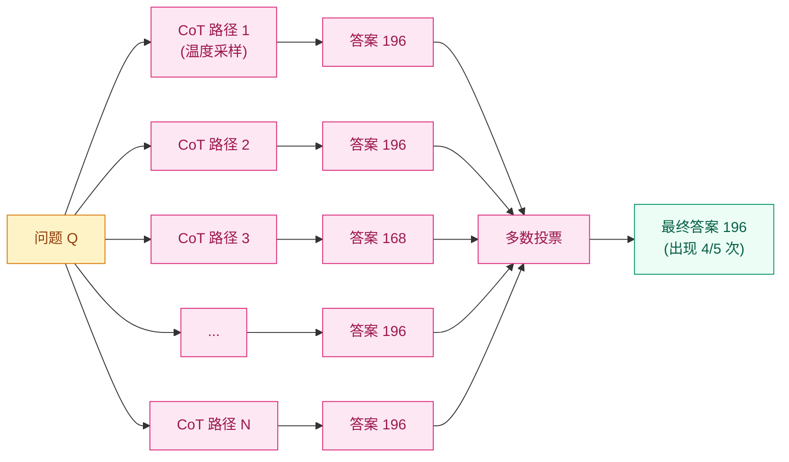

## 前作进展

[CoT](01-cot.md) 在 2022 年初证明了"让 LLM 输出推理过程能大幅提升数学/逻辑题准确率",但它有一个明显局限:**单次采样有噪**。

CoT 让模型输出几步推理,任何一步错就全错。举例 PaLM 540B + CoT 在 GSM8K 上:

- **单次贪婪解码**:56.5%
- **温度采样一次**:55.4%(略低,因为引入随机性)

为什么不直接全用贪婪解码?因为有些问题贪婪解码会卡死在错误路径——CoT 的"链式分解"特性意味着**正确路径不唯一**,某些问题贪婪选了局部最优但最终错。

Wang 等人(同一作者团队继 CoT)2022 年 3 月发表 *Self-Consistency Improves Chain of Thought Reasoning in Language Models* 给出了简单而强大的解法:**采样 N 条不同的推理路径,投票选最一致的答案**。

```
Q: 一个农场有 7 只羊。每只羊每天产 4 升奶。一周产多少升奶?

CoT 单次采样:
"7 × 4 = 28 升/天。一周 7 天,28 × 7 = 196 升。答案是 196。" ✓

Self-Consistency 采样 5 次:
1. "每只羊每天 4 升,7 只共 28 升/天 × 7 天 = 196 升。" → 196 ✓
2. "7 只羊 × 4 升 = 28 升每天,一周 7 × 28 = 196 升。" → 196 ✓
3. "一只羊一周 4 × 7 = 28 升,7 只共 28 × 7 = 196 升。" → 196 ✓
4. "总共 7 × 4 × 7 = 196 升。" → 196 ✓
5. "每只羊每天 4 升,一周 28 升,7 只共 7 × 28 = 168 升。" → 168 ✗

投票:196 出现 4 次,168 出现 1 次 → 选 196 ✓
```

5 次里有 1 次算错(4 × 7 ≠ 28 算成了 28 - 4 = 24),但多数路径正确,投票把错误剔除。

Self-Consistency 在多个推理 benchmark 上把 CoT 推到新高度:

| Benchmark | CoT(单次) | Self-Consistency(40 次采样) |
|------|------|------|
| GSM8K(PaLM 540B) | 56.5 | **74.4**(+17.9) |
| AQuA-RAT(PaLM) | 35.8 | **48.3**(+12.5) |
| MultiArith(PaLM) | 92.4 | **99.3**(+6.9) |
| StrategyQA(PaLM) | 75.3 | **81.6**(+6.3) |

GSM8K +17.9 分是 CoT 之后两年里最大的单点提升之一,且**完全免费**——不需要重训模型,只需要在推理时多采样几次。

Self-Consistency 的论文意义不只在数字提升——它**第一次系统化展示了 test-time compute 是一条新 scaling 轴**。论文 Figure 1 显示准确率随采样次数对数线性增长(40 次后开始收益递减)。这一观察后来直接影响了 OpenAI [o1](03-o1.md) 的设计思路——把"采样多次"从外部 trick 变成模型内部行为。

## 核心思想:Marginalize over Reasoning Paths

Self-Consistency 的数学解释非常优雅。CoT 单次采样实质是:

$$
\hat{y} = \arg\max_y P(y, r \mid x)
$$

其中 `y` 是答案,`r` 是推理过程,`x` 是问题。贪婪 / 温度采样选了一个特定的 `r`,但 `r` 是中间变量,**我们真正关心的是 `y`**。

Self-Consistency 改成:

$$
\hat{y} = \arg\max_y \sum_r P(y, r \mid x)
$$

也就是 **marginalize 掉 `r`,选总概率最大的 `y`**。实现上用采样近似:

```
对 N 条采样路径 (r_1, y_1), (r_2, y_2), ..., (r_N, y_N):
  统计每个唯一答案 y 出现的次数
  选出现次数最多的答案
```



*图 1:Self-Consistency 流程 — 对同一问题用温度采样跑 N 次 CoT,提取每次最终答案,投票选最多出现的。错误路径(168)被多数路径(196)淹没。*

**关键 insight**:**正确答案有"多条路径"通向它,错误答案通常是"一次性错误"**。如果一个答案在多条独立推理路径下都被得到,它正确的可能性更高。这一直觉在数学 / 逻辑题上特别有效——正确解通常有几种等价表达方式。

## 采样配置

Self-Consistency 的关键超参:

**Temperature** —— 采样多样性的核心。论文用 `T = 0.7`(对比 CoT 默认 greedy 即 `T = 0`)。**温度太低 → 路径过于相似,投票无意义**;太高 → 路径质量下降,正确路径不够多

**Sample count N** —— 论文测试 1 到 40。提升按对数线性:

| N | GSM8K | 算力开销 |
|------|------|------|
| 1 | 56.5 | 1× |
| 5 | 65.4 | 5× |
| 10 | 70.0 | 10× |
| 20 | 72.5 | 20× |
| **40** | **74.4** | **40×** |

40 次采样比 1 次贵 40×,但准确率提升 17.9 分,**精度 / 算力 trade-off 大多数应用接受**。生产部署里典型 N=5 或 10(算力可承受 + 提升明显)。

**Top-k / Top-p** —— 采样时通常同时启用 `top_p=0.95` 防止极端 token,保证路径合理。

## 几个工程细节

**1. 答案提取要鲁棒** —— 不同推理路径可能用不同表达方式给出同一答案(`196`, `196 升`, `the answer is 196`, `196 liters`),需要正则化:

```python
def normalize(answer):
    # 去掉单位和空格,只留数字
    nums = re.findall(r"-?\d+(?:\.\d+)?", answer)
    return nums[-1] if nums else None  # 最后一个数字通常是答案
```

**2. 投票方式** —— 论文用简单多数投票,但有几个变体:

- **Weighted majority** —— 用模型对推理路径的 confidence 加权(log prob)
- **Universal Self-Consistency** —— 让另一个 LLM 评估哪个路径最合理(2023 扩展)

**3. 异常处理** —— 有些采样路径完全失败(无法提取答案),要从投票里过滤掉

**4. 早停** —— 实际生产可以"流式采样",前几次答案如果高度一致(比如 4/5 都一样)可以提前停,不必跑满 N 次

## 与其他 reasoning prompt 技术的关系

Self-Consistency 是和 CoT 互补的——CoT 决定单次推理的质量,Self-Consistency 决定如何聚合多次推理。可以叠加用:

| 技术 | 干预阶段 | 改进维度 |
|------|------|------|
| Standard | inference | baseline |
| **CoT** | inference | 单次推理质量 |
| **Self-Consistency** | inference | 多次推理聚合 |
| **Tree of Thoughts** | inference | 中间步骤搜索 + 回溯 |
| **Least-to-Most** | inference | 问题分解结构 |
| RLHF | training | 整体输出质量 |
| **o1 RL** | training | 推理本身的能力 |

CoT + Self-Consistency 是 inference-only 组合的典型,无需训练就能用。**这也是 [o1](03-o1.md) 出现前 reasoning 能力的天花板** —— GPT-4 + CoT + Self-Consistency 在 GSM8K 上能到 92%+,但 IMO / Codeforces 等更难任务仍远未饱和。o1 通过把"采样多条推理路径"内化到模型行为里,把 reasoning 推到新水平。

## 关键代码

Self-Consistency 实现:

```python
from openai import OpenAI
from collections import Counter
import re

client = OpenAI()

CoT_PROMPT = """Q: 一个农场有 7 只羊。每只羊每天产 4 升奶。一周产多少升奶?
A: 每只羊一周产 4 × 7 = 28 升。7 只羊共 7 × 28 = 196 升。答案是 196。

Q: {question}
A:"""

def cot_sample(question: str, temperature: float = 0.7):
    """采样一条 CoT 推理路径"""
    response = client.chat.completions.create(
        model="gpt-4",
        messages=[{"role": "user", "content": CoT_PROMPT.format(question=question)}],
        max_tokens=256,
        temperature=temperature,
    )
    return response.choices[0].message.content

def extract_answer(text: str):
    """从推理输出里提取最终数字答案"""
    # 优先匹配"答案是 X"或"the answer is X"
    m = re.search(r"答案是\s*(-?\d+(?:\.\d+)?)|the answer is\s*(-?\d+(?:\.\d+)?)",
                  text, re.I)
    if m:
        return float(m.group(1) or m.group(2))
    # 兜底:最后一个数字
    nums = re.findall(r"-?\d+(?:\.\d+)?", text)
    return float(nums[-1]) if nums else None

def self_consistency(question: str, n_samples: int = 10, temperature: float = 0.7):
    """采样 N 次 CoT,投票选最多答案"""
    answers = []
    paths = []
    for _ in range(n_samples):
        path = cot_sample(question, temperature)
        ans = extract_answer(path)
        if ans is not None:
            answers.append(ans)
            paths.append(path)

    if not answers:
        return None, []

    # 多数投票
    vote = Counter(answers)
    final_answer, count = vote.most_common(1)[0]

    # 返回最终答案 + 支持该答案的所有推理路径
    supporting_paths = [p for p, a in zip(paths, answers) if a == final_answer]
    return final_answer, supporting_paths

# 用法
ans, paths = self_consistency(
    "一辆火车从北京到上海 1300 公里,平均速度 250 km/h。它需要多久?",
    n_samples=10,
)
print(f"最终答案: {ans}")
print(f"被 {len(paths)}/{10} 条路径支持")
```

工程要点:

- **`temperature=0.7`** —— 提供采样多样性,但不至于乱;0.5-0.9 都合理
- **`Counter.most_common`** —— 标准多数投票;可以扩展成加权投票
- **`supporting_paths`** —— 返回支持最终答案的路径数 / 比例,这是 "confidence" 指标,可以用来做 abstain(如果支持率 < 50% 拒绝回答)

## 影响 / 后续

Self-Consistency 在 reasoning 历史的位置:**第一次系统化 test-time compute scaling**。具体影响:

**1. Test-time compute 概念形成** —— Self-Consistency 论文 Figure 1 的"准确率 vs 采样数"曲线是 test-time scaling 的第一份定量证据。这一概念后来被 OpenAI [o1](03-o1.md) / DeepMind 等推到训练目标层面

**2. 推理 benchmark 评估标准变化** —— 2022-2023 reasoning benchmark 的报告开始包含 "single sample" 和 "self-consistency (N=40)" 两个数字,后者反映模型潜力上限

**3. Prompt-only reasoning 的天花板** —— Self-Consistency 在 GSM8K 上推到 92%(GPT-4),但 MATH(中学到奥赛级)上 60%、IMO 上 ~10%。这一天花板暗示需要训练时介入,催生了 o1

**4. 推理路径多样性研究** —— Self-Consistency 假设"多条独立路径"提升准确率,后续工作研究"如何让路径更独立"(Diverse Beam Search / Stochastic Beam Search 等)

**5. 推理 confidence 量化** —— "支持答案的路径比例"成为 LLM 输出 confidence 的早期度量,影响了 calibration、abstain、active learning 等下游研究

Self-Consistency 留下的几个明确局限,推动 [o1](03-o1.md):

- **算力代价线性增长** —— 准确率提升对数,算力开销线性,不可持续 scale
- **多数投票不能纠正系统性错误** —— 如果模型对某类问题的 prior 是错的,所有路径都会错,投票无效
- **prompt-level 干预天花板** —— 真正的推理能力需要模型本身学到,而不是采样技巧

→ [03-o1.md](03-o1.md) · 把"采样多条路径"内化到模型行为里,test-time compute 训练化
→ [04-deepseek-r1.md](04-deepseek-r1.md) · 开源 o1 复现,把训练算法公开
→ [01-cot.md](01-cot.md) · 父方法,Self-Consistency 在 CoT 之上做投票
→ [../07-gpt-scaling/04-scaling-laws.md](../07-gpt-scaling/04-scaling-laws.md) · test-time compute 是 scaling law 的新轴
