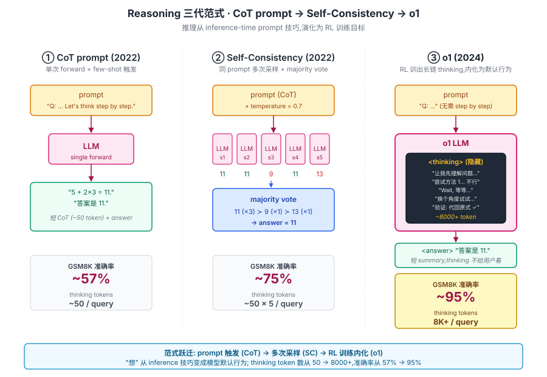
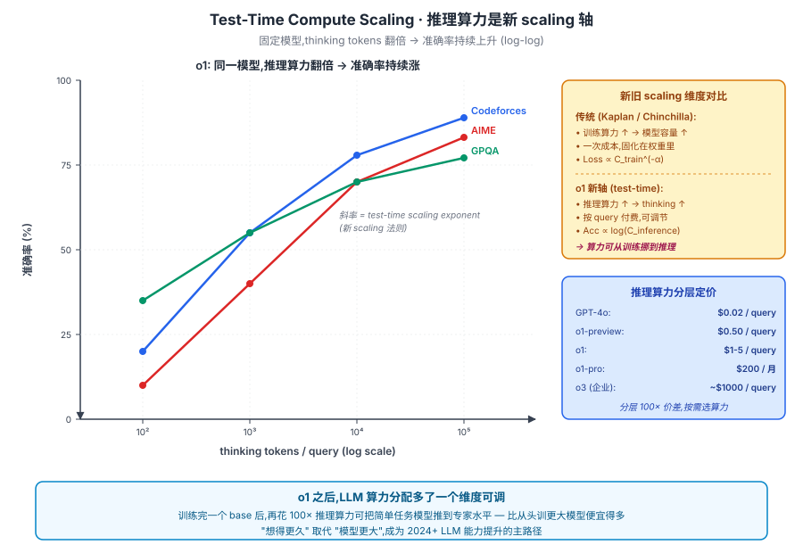

## 前作进展

到 2024 年中,LLM 时代的几个关键 reasoning benchmark 都遇到了瓶颈:

- **GSM8K**(小学数学)—— GPT-4 + CoT 已 95%+,基本饱和
- **MATH**(中学到奥赛级)—— GPT-4 ~50%,提升缓慢
- **GPQA**(PhD 级科学问答)—— GPT-4 ~35%,接近人类专家的 65% 还很远
- **AIME**(美国数学奥林匹克)—— GPT-4 ~10%,几乎做不出来
- **Codeforces**(竞赛编程)—— GPT-4 ELO 千分位,被业余选手碾压

所有 prompt-level reasoning 技术([CoT](01-cot.md) / [Self-Consistency](02-self-consistency.md) / ToT)都遇到天花板。社区认知是:**真正的推理能力需要训练时介入,不能只靠 prompt**。

但"训推理能力"面临三个工程挑战:

**1. 数据从哪来?** SFT 需要 (问题, 推理过程, 答案) 数据,数学/科学领域的高质量推理 trace 极其稀缺,人工标注代价巨大

**2. Reward 怎么设计?** 推理过程是中间产物,只能从最终答案对错(outcome reward)知道好坏。但"答案对但过程乱"和"答案对且过程清晰"应该不同对待,这需要 process reward 但又难以定义

**3. RL 训练能不能 work?** 把 LLM 当 RL agent 训练,需要在巨大动作空间(整个词表)上搜索,且 reward 稀疏(只有最终答案对错)。传统 PPO 难以收敛

OpenAI 内部从 2022 年开始的 "Q* / Strawberry / o1" 项目花了 2 年时间解决这些问题。2024 年 9 月发布 **o1-preview**,9 月底发布 **o1-mini**,12 月发布 **o1**(完整版),2025 年 1 月发布 **o3**(完整版)。这一系列模型展示了 reasoning 能力的质变:

| Benchmark | GPT-4o | o1-preview | o1 |
|------|------|------|------|
| AIME 2024 数学 | 13% | 56% | **83%** |
| Codeforces ELO | 808 | 1258 | **1891**(高级选手) |
| GPQA Diamond(博士级科学) | 50% | 73% | **78%**(超过人类专家 70%) |
| MATH-500 | 60% | 85% | **94%** |
| IMO 数学 | 失败 | 中等 | **接近金牌** |

这是 LLM 能力**第一次质变**——以前更大模型只是"更熟练",o1 是"更聪明"。它能解人类专家级数学题、调试复杂代码、做多步科学推理,这是 GPT-4 即使加 CoT + Self-Consistency 也做不到的。

**OpenAI 没公开 o1 训练细节**——只发了简短技术博客和系统卡。后续 DeepSeek-R1(2025 1 月)通过开源复现部分回答了"怎么训出 o1 这种能力"的问题。

## 核心思想

### 直觉:把 CoT 从"prompt 触发"内化成"训练目标"

理解 o1 真正需要先抓一件事:**CoT 时代 reasoning 是 inference-time 技巧,模型本身并不会主动"思考"**。GPT-4 默认输出短答案,只有加上 "think step by step" 才肯写推理过程;同样模型给不给这句魔法咒语差几十个点(GSM8K 上从 ~18% 到 ~57%)。这一现象的另一面是:推理质量上限被 prompt 工程死死卡住,[Self-Consistency](02-self-consistency.md) / Tree-of-Thought 都只是在同一个"不主动思考"的模型上叠多次采样。

o1 的反问极简但极激进:**能不能用 RL 训练让模型自然产生长链推理,把"想"变成默认行为?**——不再依赖用户写好的 prompt,模型自己在每个问题上花几千到几万 token 反思 / 回溯 / 自验证。这是 reasoning 从 prompt 范式跃迁到训练范式:CoT 是"教模型怎么 mimic 推理格式",o1 是"训模型学会推理本身"。

为什么这件事在 2024 年才被验证?三件事必须同时成立:

- **Base 模型必须够强** —— 一个本身就具备基础数学 / 代码 / 逻辑能力的 base(GPT-4 级别),RL 只是把已有能力"放大"成长链思考;在 7B 弱 base 上跑同样的 RL 大概率只能学到"假装思考的废话"
- **Reward 设计必须能支撑稀疏 / 长 trajectory** —— 一道数学题模型要写 8000 token 才出答案,只在末尾给 outcome reward,需要 PRM(process reward model)或群体 baseline 才能稳定训
- **产品端要能接受"等几十秒"** —— GPT-4 时代用户已经习惯了"秒回";o1 单 query 要思考几十秒到几分钟,这是一种新的人机交互节奏,需要 ChatGPT 这类产品已经把"等模型"教会用户

把这三件事合起来:o1 用"强 base + RL 训长 trajectory + 长 thinking 产品化"的组合,把 reasoning 从 prompt 技巧推到模型默认行为,2024 年 9 月发布时在 AIME / Codeforces / GPQA 上拉开 GPT-4 几倍差距,开启 LLM 第二条 scaling 轴。


*图 1:从 [CoT prompt](01-cot.md) 到 [Self-Consistency](02-self-consistency.md) 再到 o1 的三代范式跃迁。**左:CoT** 单次 forward + 短 thinking (~50 token) + 答案,GSM8K ~57%;**中:Self-Consistency** 同 prompt 采 5 次 + majority vote,GSM8K ~75%,thinking 量 ~50×5;**右:o1** 模型内部一个巨大的 thinking 黑盒(8K+ token,包含反思 / 回溯 / 自验证),最终只输出短 summary 给用户,GSM8K ~95%。前两代"想"是 prompt 技巧,o1 把"想"训进模型权重里。*

### 机制一:RL 训练让模型自然输出长 thinking 过程

o1 的核心训练动作:**在数学 / 代码 / 逻辑任务上做大规模 RL,reward 是答案对错(outcome reward)**。Base 模型一开始也是输出短答案,但 RL 优化"答对率"的过程中模型自己发现:**先写长 thinking 再给答案的 trajectory 比直接给答案的 trajectory reward 高得多**——因为长 thinking 给后续 token 提供了 scratch pad,把一道难题拆成多步小计算,每步都 attend 到前面的中间结论。

```
[base model 初始]
Q: AIME 题
A: 答案是 42。     (随便猜,大概率错,reward = 0)

[RL 训了几百步]
Q: AIME 题
A: 让我先理解... 设 x = ... 计算 ... 答案是 17。   (短 CoT,reward ≈ 0.3)

[RL 训了几千步]
Q: AIME 题
A: <thinking>
   让我先理解题目。
   尝试方法 1: 坐标几何 ... 算到一半发现太复杂。
   Wait,换个角度,用对称性 ...
   等等,我刚才那步公式用错了,重新算 ...
   验证: 把答案代回 ... 对的。
   </thinking>
   答案是 23。     (长 thinking,reward ≈ 0.9)
```

关键的几个 emergent 行为:

- **反思** —— "Wait, 这个方法太复杂了"、"我之前那一步错了"
- **回溯** —— 尝试方法 1 失败后主动换方法 2
- **自验证** —— "把答案代回原方程检查"
- **路径搜索** —— 同一道题探索多种解法再挑

这些行为**不是人工设计的**——OpenAI 反复强调是 RL 训出来的副产物。DeepSeek-R1 论文后来用开源实验确认了同一现象:把 reward 设成纯 outcome,模型自己会涨 thinking 长度并自发输出 "Wait, let me reconsider..." 这种反思语言(R1 论文称之为 "Aha moment")。详见 [04-deepseek-r1.md](04-deepseek-r1.md)。

OpenAI 没公开具体训练方法,推测包含:**SFT 学初始 thinking 格式 → 大规模 RL with PRM(process reward,给中间步骤打分)→ self-play 生成多 trajectory 选最优**。算力推测和 GPT-4 预训练同量级。

### 机制二:Test-Time Compute Scaling — 推理时算力也是新 scaling 轴

o1 论文(博客)最重要的图展示了一个全新现象:**在固定模型上,thinking token 数翻倍,准确率持续上升**。AIME 上从 8K → 64K thinking 涨 10+ 个点;Codeforces / GPQA 上同样规律。这条 log-log 曲线斜率本身就是一条"test-time scaling 指数"——把 [Kaplan / Chinchilla scaling laws](../07-gpt-scaling/04-scaling-laws.md) 从训练阶段扩展到了推理阶段。


*图 2:o1 在 AIME / Codeforces / GPQA 三个任务上 thinking tokens vs 准确率的 log-log 曲线,**直线斜率即新的 test-time scaling exponent**。横轴推理算力每翻 10×,准确率涨 ~20 个点。右侧 callout 对比:传统 [Kaplan / Chinchilla scaling](../07-gpt-scaling/04-scaling-laws.md) 是训练算力一次成本固化在权重,o1 新轴是推理算力按 query 付费可调;底部商业含义:o1 之后 LLM 算力分配多了一个维度可调,从 GPT-4o 的 $0.02/query 到 o3 的 ~$1000/query 拉出 100× 价差。*

更深的对比是**训练算力 vs 推理算力**:

```
传统 scaling:训练算力 ×10  → 模型容量 ×3 → 准确率 +10%
o1 scaling:  训练算力 ×1  + 推理算力 ×100 → 准确率 +70%
```

推理算力的"边际性价比"在 reasoning 任务上远高于训练算力。这一观察直接改变了 LLM 商业模型——OpenAI 把这条轴推到极致:o1-mini → o1 → o1-pro($200/月) → o3(企业级 $1000/query),分层 100× 价差。开发者第一次能"按问题难度选算力":简单对话用 GPT-4o,数学题用 o1,前沿研究用 o3。

### 机制三:推理 trace 隐藏 + 长 thinking 接受度

o1 还有一个看似产品决策、实则深刻的设计:**thinking 过程对用户隐藏,只给 summary + answer**。API 里 reasoning_tokens 单独计费但内容不返回;ChatGPT 里只显示一个"Thought for 32 seconds"的折叠条。

这一决策有两个动机叠加:

- **安全 + 商业** —— 推理 trace 是 o1 真正的"秘方",公开就会被开源团队蒸馏(后来 R1-Distill 系列证明这种担心是对的)。同时 OpenAI 也担心推理过程里出现"未对齐的内部独白"(系统卡里明确提到 deceptive alignment 风险)
- **接受"模型可以慢"这一新使用习惯** —— GPT-4 时代用户预期秒回,o1 一次 query 要思考几十秒到几分钟。隐藏 trace 让等待感更可接受(看见一行 thinking 滚 30 秒会比看见"Thought for 30s"更焦虑)。配合 ChatGPT UI 的"思考中"动画,o1 把"用户能容忍模型思考"做成了新的产品惯例

这个产品惯例本身也是 o1 能商业化的关键——没它,即使模型训出来,用户也会因为"为什么这么慢"而流失。后续 Claude 3.7 Sonnet / DeepSeek-R1 / Qwen-QwQ 几乎都跟进了"显示 thinking 状态 + 折叠详细 trace"的 UI 模式(R1 选择公开 trace,但 UI 默认折叠)。

### 三件套协同:RL 内化推理 + test-time scaling + 长 thinking 产品化 缺一不可

o1 能在 2024 年开启 reasoning 时代,**不是单一突破**,而是三件套同时调到协同点——任何一个抽掉 o1 都不成立,这一点和 [ResNet](../01-cnn/05-resnet.md) 的 `shortcut + BN + He 初始化` 协同关系完全一致:

- **只有 test-time scaling 发现 + 长 thinking 产品化,没有 RL 内化推理** —— 仍是 CoT 时代,推理质量依赖 prompt 工程,Self-Consistency 已经把 GPT-4 + CoT 的上限榨干,benchmark 卡在 AIME ~13% / GPQA ~50%,出不来质变
- **只有 RL 内化 + 产品化,没有 test-time scaling 这一观察** —— OpenAI 训出长 thinking 但不知道"推理算力翻倍准确率线性涨"这条规律,就不会构建 o1-mini / o1 / o1-pro / o3 这一层级化产品矩阵,推理算力不会成为可定价的产品维度
- **只有 RL 内化 + test-time scaling,没有产品化长 thinking** —— 模型训出来用户体验崩溃(为什么 ChatGPT 突然要等 30 秒?),无法商业化,reasoning 模型停留在论文里,o1 不会引爆整个 reasoning 路线

三件套合起来才让"先想几千 token 再回答"从一个研究 demo 变成一类可销售的产品,把整个行业的注意力从"训更大模型"挪到"训会想的模型"。2024 年下半年所有"复现 o1"项目都只摸到其中一两件——Kimi-K1.5 训出能力但产品端没节奏、Qwen-QwQ 公开 trace 但训练方法没公开、各种 PRM 论文只做了机制二的局部研究——直到 [DeepSeek-R1](04-deepseek-r1.md) 2025 年 1 月把三件套同时跑通才在开源世界复现 o1。

## 性能数据

o1 在 reasoning benchmark 上的成绩(2024 年 9 月发布数据):

| Benchmark | GPT-4o | o1-preview | o1 | 人类专家 |
|------|------|------|------|------|
| AIME 2024 | 13.4% | 56.7% | **83.3%** | 95%+ |
| MATH-500 | 60.3% | 85.5% | **94.8%** | ~95% |
| Codeforces percentile | 11% | 62% | **89%** | 50%(中位) |
| GPQA Diamond | 50.6% | 73.3% | **77.3%** | 69.7% |
| Codeforces ELO | 808 | 1258 | **1891** | 1500(IM 级)|
| MMLU | 88.7% | 90.8% | **92.3%** | 89.8% |

关键观察:

- **GPQA Diamond 上 o1 超过人类专家**(77.3% vs 69.7%)——LLM 第一次在 PhD 级科学问答上超越人类
- **AIME 83.3%** —— 中等水平 IMO 选手成绩。意味着 o1 数学推理能解决普通大学生数学竞赛题
- **Codeforces 1891 ELO** —— 高级算法竞赛选手水平,接近 GM(Grandmaster)
- **MMLU 提升小**(88.7 → 92.3)—— 常识 / 知识类任务不需要长链推理,提升有限

但 o1 也有明显局限:

- **token 成本高** —— 每个 query 平均 10K thinking tokens,API 价格是 GPT-4 的 5-10×
- **响应慢** —— 几十秒到几分钟,不适合实时对话
- **不擅长创意 / 开放任务** —— 推理优化牺牲了创造性,o1 写诗 / 故事不如 GPT-4

## 关键代码

o1 是闭源模型,只能用 OpenAI API:

```python
from openai import OpenAI
client = OpenAI()

response = client.chat.completions.create(
    model="o1",  # 或 "o1-preview", "o1-mini"
    messages=[{
        "role": "user",
        "content": "证明:任意奇完全数(odd perfect number)必有至少 9 个不同素因子。"
    }],
    # 注意:o1 不支持 system message / temperature / streaming
)
print(response.choices[0].message.content)
# o1 会"思考"几十秒,然后输出最终答案
# response.usage.completion_tokens_details 会显示 reasoning_tokens 数量
print(f"Reasoning tokens: {response.usage.completion_tokens_details.reasoning_tokens}")
```

API 几个特殊之处:

- **不支持 `temperature`** —— o1 内部用确定性 reasoning,温度无意义
- **不支持 system message** —— 推理模型不需要 persona
- **不支持 streaming** —— 推理过程不公开,只能等最终答案
- **`reasoning_tokens` 单独计费** —— OpenAI 按 reasoning + output 总 token 计费,reasoning 部分隐藏但计费

对比 GPT-4o:

| | GPT-4o | o1 |
|------|------|------|
| 单 query 响应时间 | < 5 秒 | 30 秒 - 5 分钟 |
| 单 query 平均成本 | $0.02-0.10 | $0.50-5(高 reasoning) |
| 适用任务 | 对话、创意、简单任务 | 数学、科学、复杂代码、推理 |

## 影响 / 后续

o1 在 LLM 历史的位置:**LLM 进入"推理时代",test-time compute 成第二条 scaling 轴**。具体影响:

**1. 推理 benchmark 全面饱和** —— o1 / o3 在 AIME, MATH, GPQA, Codeforces 等之前认为"难"的 benchmark 上达到人类专家级。社区开始构建新 benchmark(Humanity's Last Exam, FrontierMath)挑战新一代模型

**2. 商业 LLM 定价分层** —— 2024-2025 LLM API 分两类:**快速对话**(GPT-4o, Claude 3.5)和**深度推理**(o1, o3, Claude 3.7 Sonnet)。后者贵 10-100×,只用于复杂任务

**3. RL 训练成为 LLM 后训练的核心** —— 之前后训练主要是 SFT + RLHF,o1 之后 RL with PRM 成新方向。后续 DeepSeek-R1 / Qwen-QwQ / Kimi-K1 等都基于类似思路

**4. Process Reward Model(PRM)研究爆发** —— 怎么给中间推理步骤打分成新研究方向。Lightman 2023 (Let's Verify Step by Step) 是 PRM 早期工作,o1 之后涌现大量 PRM 数据集和训练方法

**5. AI 安全的新维度** —— o1 系统卡里 OpenAI 承认推理能力提升带来新风险:模型可能"假装对齐"(deceptive alignment)、复杂多步策略性行为、自我改进潜力。这一讨论延续到 o3 / Claude 3.7 时代

**6. 人才争夺战** —— o1 团队成员(Ilya Sutskever, Jakub Pachocki, Lukasz Kaiser 等)成为 AI 行业最抢手的人。Anthropic / DeepMind / xAI / Mistral 都在追 o1 路线

o1 留下的开放问题:

- **闭源 + 训练细节不公开** —— 学界无法复现 → [DeepSeek-R1](04-deepseek-r1.md) 部分回答
- **PRM 怎么 scale** —— 标注 PRM 数据成本高,需要更自动化的方法
- **推理 vs 创意的 trade-off** —— o1 强 reasoning 但弱创意,未来 LLM 怎么兼顾

→ [04-deepseek-r1.md](04-deepseek-r1.md) · 开源 o1 风格复现,GRPO 纯 RL 训练
→ [02-self-consistency.md](02-self-consistency.md) · 父思想,o1 是它的训练化版本
→ [01-cot.md](01-cot.md) · 推理思想的起源,o1 把它推到训练目标
→ [../12-rlhf-alignment/02-instructgpt.md](../12-rlhf-alignment/02-instructgpt.md) · RL 训练的基础,o1 在 RLHF 之上加 process reward
→ [../07-gpt-scaling/04-scaling-laws.md](../07-gpt-scaling/04-scaling-laws.md) · test-time scaling 是新 scaling 轴
