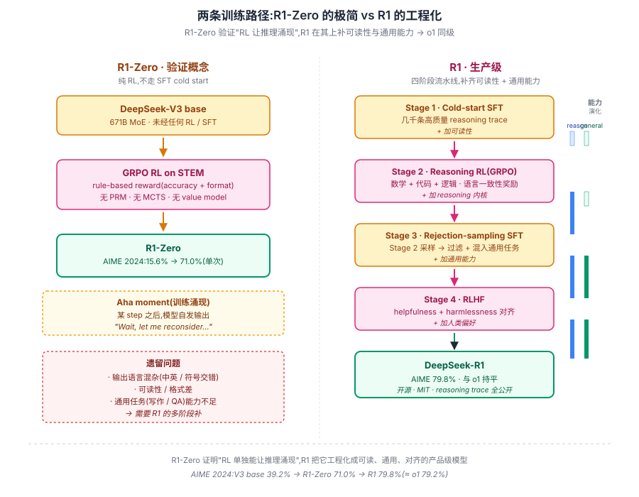
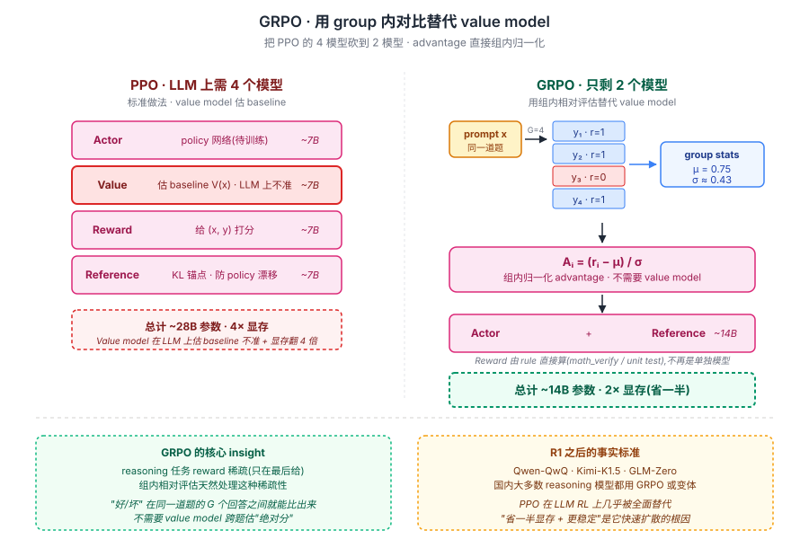

## 前作进展

2024 年 9 月 OpenAI 发布 [o1](03-o1.md),展示了 RL 训练让 LLM 自己学会"反思 / 回溯 / 自验证"的质变能力。但 o1 留下两个未解谜题:

**1. 训练方法不公开** —— OpenAI 只发了一篇博客和系统卡,没论文。社区猜测涉及 PRM(process reward model)+ MCTS-like search,但具体怎么训没人知道

**2. 模型闭源** —— 学界 / 开源社区无法在 o1 之上做研究。整个 reasoning 方向卡在"知道能做到但不知道怎么做到"的尴尬位置

2024 年底涌现一批"复现 o1"的尝试:**Qwen-QwQ**(阿里,32B,公开 reasoning trace 但没公开训练方法)、**Kimi-K1.5**(月之暗面)、**OpenAI o3**(更强但仍闭源)。但都不是真正的开源 / 论文复现。

2025 年 1 月 20 日,DeepSeek 发布 **DeepSeek-R1**,一次性给出三个突破:

- **DeepSeek-R1-Zero** —— 完全跳过 SFT cold start,**直接在 DeepSeek-V3 base 上做 RL**,验证推理行为可以从 RL 中"涌现",AIME 从 15.6% 涨到 71.0%
- **DeepSeek-R1** —— 在 R1-Zero 基础上加少量 cold-start SFT + 多阶段 RL,AIME 79.8%,**与 o1 持平**
- **完整开源** —— 模型权重(MIT 协议)、推理 trace 全公开、详细论文、训练算法 GRPO

R1 发布后 24 小时内引爆 AI 圈:Hugging Face 下载量爆表、英伟达股价单日跌 17%(市场担心推理算力需求被高效模型替代)、整个开源社区开始基于 R1 做后续工作。

## 核心思想

### 直觉:推理能力可以"无中生有"地从 RL 中涌现

理解 R1 真正需要先抓一件事:**reasoning 不是教出来的,是逼出来的**。o1 之前业界对"让模型学推理"的默认假设是——需要海量长链 CoT 标注数据做 SFT,或者需要 PRM(process reward model)对每一步打分。R1 直接证明这两件事**都不需要**:只要 base model 本身够强、reward 足够干净(只给"对错"),纯 RL 训出来的模型自己会学会反思 / 回溯 / 自验证。

为什么这件事在 2025 年才被验证?三件事必须同时成立:

- **Base model 必须够强** —— DeepSeek-V3 base 已经具备基础数学 / 代码能力,RL 只需放大已有能力,不需要从零教。换 LLaMA-1 7B 做同样实验大概率失败
- **Reward 必须干净** —— rule-based outcome reward(数学题用 verifier、代码题跑 unit test)避免了 PRM 的 reward hacking。PRM 自身是个学出来的模型,会被 policy 钻空子
- **RL 算法必须省内存** —— PPO 需要 value model,7B+ 模型上 value model 自身就吃几十 G 显存,大规模 reasoning RL 跑不起。GRPO 把 value model 干掉

把这三件事合在一起:R1 用"够强 base + 干净 reward + 轻量 RL"的组合,把"reasoning 能否从 RL 涌现"这个 2024 年的开放问题第一次给出明确肯定回答,而且**完全开源**。


*图 1:两个模型、两条路径。**上排 R1-Zero**——DeepSeek-V3 base 直接进 GRPO,reward 只看答案对错 + 格式,产物已经在 AIME 上从 15.6% → 71.0%,完全跳过 SFT。**下排 R1**——在 R1-Zero 经验上加 4 个阶段(cold-start SFT → reasoning RL → rejection sampling SFT → RLHF),把推理能力 + 通用能力 + 对齐都装进同一个模型。两条路径共享同一个 RL 内核(GRPO)。*

### 机制一:R1-Zero — 纯 RL 让推理涌现

R1-Zero 的训练 pipeline 极简到几乎反直觉——**没有 SFT cold start、没有 PRM、没有 MCTS、没有 search**:

```
DeepSeek-V3 base model  →  GRPO(rule-based reward) →  R1-Zero
```

reward 设计也极简:

```python
def reward(question, response):
    # 1. Accuracy:数学用 math_verify,代码跑 unit test
    answer = extract_answer(response)
    acc = 1.0 if check_correct(question, answer) else 0.0
    # 2. Format:推理是否包了 <think>...</think>
    fmt = 1.0 if has_think_tags(response) else 0.0
    return acc + 0.5 * fmt
```

**没有"步骤 3 算错了 reward -0.1"这种 PRM**。论文里 DeepSeek 团队明确说尝试过 PRM 但发现易被 reward hacking、数据难标注,而 rule-based outcome reward 已足够。

训练过程中,模型自己学到了三件事——这是 R1 论文最震撼的发现:

- **思考长度自然增长** —— 训练 step 0 时模型输出 ~100 token,到 step 8000 时增长到 ~10000 token,**没有人为加 length reward**
- **"Aha moment" 涌现** —— 训练到某一步,模型开始自发输出 "Wait, let me reconsider..." 这种反思 / 回溯语言
- **AIME 准确率** —— 从 15.6% 涨到 71.0%(单次)/ 86.7%(majority vote),超过 o1-mini

R1-Zero 的缺陷:输出可读性差(混杂多种语言、格式混乱)、不擅长非 STEM 任务。这两个缺陷正是 R1 多阶段训练要解决的。

### 机制二:GRPO — 把 value model 干掉

R1 用的 RL 算法叫 **GRPO(Group Relative Policy Optimization)**,是 DeepSeek-Math 2024 论文提出的 PPO 变体。核心简化:**去掉 value model,用 group baseline 代替**。

PPO 标准做法:

```
对每个 prompt x:
  采样一个 response y
  用 value model V(x) 估计 baseline
  Advantage A = R(x, y) - V(x)
  用 A 更新 policy
```

PPO 在 LLM 上的问题:value model 自身要训,且对 LLM 来说估计 baseline 不准。**GRPO 直接采样一组 response,用组内均值作为 baseline**:

```python
def grpo_step(prompt, policy, ref_policy):
    # 1. 对同一 prompt 采样 G 个 response
    responses = [policy.sample(prompt) for _ in range(G)]
    rewards = [reward_fn(prompt, r) for r in responses]

    # 2. 用组内归一化作为 advantage
    mean_r = mean(rewards)
    std_r = std(rewards)
    advantages = [(r - mean_r) / std_r for r in rewards]

    # 3. PPO-style policy update + KL penalty to ref_policy
    loss = 0
    for resp, adv in zip(responses, advantages):
        ratio = policy.prob(resp | prompt) / old_policy.prob(resp | prompt)
        loss += -min(ratio * adv, clip(ratio, 1-eps, 1+eps) * adv)
        loss += beta * kl_divergence(policy, ref_policy)
    return loss
```

GRPO 的优势:

- **省内存** —— 不用维护 value model(LLM 时代 value model 自身就是 7B+ 模型,显存开销巨大)
- **更稳定** —— group baseline 用相对评估,对绝对 reward 噪声鲁棒
- **更适合稀疏 reward** —— reasoning 任务 reward 只在最后给(答对 = 1 / 答错 = 0),group 内对比天然处理这种稀疏性

GRPO 在 R1 之后被广泛采用,成为 reasoning 模型训练的事实标准。


*图 2:GRPO 单步训练。同一个 prompt 采 G 个 response → 各自打 reward(rule-based,稀疏) → **用组内均值 / 方差归一化得到 advantage**(无需 value model) → PPO-style clipped policy update + KL penalty to ref policy。右侧 callout 对比:PPO 需要一个和 policy 同大小的 value model(7B 模型多吃 14G+ 显存),GRPO 完全省掉。*

### 机制三:R1 多阶段训练 — 把 reasoning 内核裹进通用模型

R1-Zero 证明了 reasoning 能从 RL 涌现,但有可读性差 / 通用任务弱两个缺陷。R1 用 4 阶段训练补齐:

```
Stage 1: Cold-start SFT
  - 收集几千条高质量长链推理数据(部分来自 R1-Zero 输出 + 人工清洗)
  - 让模型先学会"可读的推理格式",解决 R1-Zero 的可读性问题

Stage 2: Reasoning-oriented RL
  - 大规模 GRPO on 数学 / 代码 / 逻辑题
  - Reward = 答案正确性 + 语言一致性(避免混杂语言)
  - 这一步是 reasoning 内核的真正来源

Stage 3: SFT with rejection sampling
  - 从 Stage 2 模型采样大量回答,过滤出高质量样本
  - 加入通用任务数据(写作、QA、role-play)
  - SFT 整合 reasoning + general capability

Stage 4: RLHF for helpfulness/harmlessness
  - 类似 InstructGPT 的 RLHF
  - 让模型既能推理也能对齐人类偏好

→ DeepSeek-R1
```

四阶段的关键设计:**Stage 2 训出 reasoning 内核,Stage 3/4 在保留 reasoning 的同时把通用能力 / 对齐叠加上去**。换句话说,R1-Zero 是"纯推理选手",R1 是"推理 + 通用 + 对齐三合一"。

### 三件套协同:强 base + 干净 reward + 轻量 RL 缺一不可

R1 能在 2025 年成立,**不是单一突破**,而是三件套同时调到协同点——任何一个单拿出来都不够,这一点和 [ResNet](../01-cnn/05-resnet.md) 的 `shortcut + BN + He 初始化` 协同关系完全一致:

- **只有 GRPO 算法,没有 DeepSeek-V3 这样的强 base** —— RL 无中生有不出来,policy 在 reasoning 空间里几乎全是无效探索。同样的算法套在弱 base 上结果会差几十个点
- **只有强 base + GRPO,没有 rule-based 干净 reward** —— PRM 会被 reward hacking,policy 学会输出"看起来对的废话"骗分。R1 论文里明确记录了这次失败尝试
- **只有强 base + 干净 reward,没有省内存的 GRPO** —— 用 PPO + value model,reasoning RL 在 7B+ 模型上跑不起来(显存爆掉),整套实验不可行

三件套合起来才让"reasoning 从 RL 中涌现"这件本来只是 o1 内部黑盒里的现象,第一次在开源世界被复现 + 验证 + 公开。这也是为什么 2024 年下半年多个团队都摸到一两件的边但没成——Qwen-QwQ 有 base 没公开训练方法、各种"o1 复现"项目要么 reward 不干净要么算法吃不消。

## 性能数据

R1 在主流 reasoning benchmark 上的表现(对比 o1 / o1-mini / DeepSeek-V3):

| Benchmark | DeepSeek-V3 | R1-Zero | R1 | o1-mini | o1 |
|------|------|------|------|------|------|
| AIME 2024(单次) | 39.2% | 71.0% | **79.8%** | 63.6% | 79.2% |
| AIME 2024(cons@64) | - | 86.7% | - | - | - |
| MATH-500 | 90.2% | - | **97.3%** | 90.0% | 96.4% |
| Codeforces percentile | 58.7% | - | **96.3%** | 93.4% | 96.6% |
| GPQA Diamond | 59.1% | - | **71.5%** | 60.0% | 75.7% |
| LiveCodeBench | 36.2% | - | **65.9%** | 53.8% | 63.4% |
| MMLU | 88.5% | - | 90.8% | 85.2% | 91.8% |

关键观察:

- **R1 与 o1 全面持平** —— AIME / MATH / Codeforces 上 R1 略胜或持平,GPQA / MMLU 略输。这是开源第一次追上闭源 reasoning 旗舰
- **R1-Zero 已经很强** —— 没 SFT cold start 也达到 71% AIME,超过 o1-mini。证明 RL 是推理涌现的关键
- **DeepSeek-V3 → R1 提升巨大** —— AIME 39 → 80,这 41 个点都来自 RL 训练

**Distillation 版本** —— R1 论文还展示了用 R1 蒸馏到小模型的效果:

| 蒸馏模型 | AIME | MATH-500 |
|------|------|------|
| R1-Distill-Qwen-1.5B | 28.9% | 83.9% |
| R1-Distill-Qwen-7B | 55.5% | 92.8% |
| R1-Distill-Llama-8B | 50.4% | 89.1% |
| R1-Distill-Qwen-32B | 72.6% | 94.3% |
| R1-Distill-Llama-70B | 70.0% | 94.5% |

**32B 蒸馏模型在 AIME 上达到 72.6%,接近 o1**——这是开源社区第一次有人能在消费级硬件(单卡 A100)上跑接近 o1 的推理能力。

## 关键代码

R1 完全开源,可以本地部署或调 API:

```python
# Option 1: 本地 vLLM 部署 R1-Distill-Qwen-32B
from vllm import LLM, SamplingParams

llm = LLM(
    model="deepseek-ai/DeepSeek-R1-Distill-Qwen-32B",
    tensor_parallel_size=2,
)
params = SamplingParams(
    temperature=0.6,  # R1 推荐 0.5-0.7
    max_tokens=32768,  # 推理可能很长
)
prompt = "证明:对任意正整数 n,n^5 - n 能被 30 整除。"
output = llm.generate([prompt], params)[0].outputs[0].text
# 输出会包含 <think>...</think> 推理过程 + 最终答案
```

```python
# Option 2: DeepSeek API(reasoning trace 公开)
from openai import OpenAI
client = OpenAI(
    base_url="https://api.deepseek.com",
    api_key="sk-..."
)
resp = client.chat.completions.create(
    model="deepseek-reasoner",  # R1 在 API 里叫这个名字
    messages=[{"role": "user", "content": "解方程 x^3 - 3x + 1 = 0"}],
)
# 与 o1 不同,R1 公开 reasoning_content
print("推理过程:", resp.choices[0].message.reasoning_content)
print("最终答案:", resp.choices[0].message.content)
```

与 o1 API 的关键差异:

| | o1 | R1 |
|------|------|------|
| 推理过程是否公开 | 否(隐藏) | **是**(`reasoning_content` 字段) |
| 是否开源权重 | 否 | **是**(MIT) |
| 单 token 价格 | $15-60/M | **$0.55-2.19/M**(便宜 ~30×) |
| 支持本地部署 | 否 | 是 |
| 训练论文 | 无 | **有**(详细) |

价格便宜 30× 是 R1 引爆市场的关键——之前用 o1 一次 query 几美元,现在 R1 几美分,开发者可以放心把推理模型嵌进生产环境。

## 影响 / 后续

R1 在 LLM 历史的位置:**开源第一次追上闭源 reasoning,GRPO 成为 reasoning 训练事实标准**。

**1. 开源 vs 闭源差距缩小** —— 之前 GPT-4 出来后开源用了 1 年才追上(LLaMA-2 → LLaMA-3)。o1 出来后开源只用 4 个月就追上(R1)。这是开源生态的转折点

**2. 蒸馏路线被验证** —— R1-Distill 系列证明"用大 reasoning 模型蒸馏小模型"可以保留大部分推理能力。后续 Qwen-2.5 / LLaMA-3.3 / Phi-4 等都跟进类似蒸馏

**3. GRPO 成标配** —— 2025 年新发布的 reasoning 模型(Qwen-QwQ-32B-Preview, Kimi-K1.5, GLM-Zero)几乎都用 GRPO 或其变体。PPO 在 LLM RL 上几乎被替代

**4. Reward hacking 警觉** —— R1 论文记录的一个发现:训练后期模型会输出"看起来对的废话"骗 reward。这一现象引发对 reasoning RL 安全性的研究热潮

**5. 中国 LLM 实力被重新评估** —— R1 之前西方普遍认为中国 LLM 落后 1-2 年。R1 之后这一判断被推翻,DeepSeek 成为与 OpenAI / Anthropic / Google 并列的"前沿四家"之一

**6. 算力市场冲击** —— R1 训练只用 ~2000 张 H800(美国对华出口的降级版 H100),成本不到 GPT-4 的 1/10。引发市场对"超大规模训练是否必要"的重新评估,英伟达股价单日跌 17%

R1 留下的开放问题:

- **R1-Zero 的"涌现机制"** —— 为什么 RL 训练让模型自然学会反思?这是 emergent capability 的新例子,理论上仍未解释清楚
- **如何 scale 到 IMO 金牌 / Fields 级别** —— R1 在普通竞赛题上接近 o1,但 IMO 金牌、Putnam、研究级数学仍是巨大挑战
- **Reasoning + Agent 怎么结合** —— R1 强推理但弱工具使用,与 [Agent 路线](../14-rag-agent/) 怎么融合是后续方向

→ [03-o1.md](03-o1.md) · 父思想,R1 是它的开源复现
→ [02-self-consistency.md](02-self-consistency.md) · R1 的 cons@64 评估直接用 self-consistency 思想
→ [../12-rlhf-alignment/](../12-rlhf-alignment/) · GRPO 是 RLHF 的 reasoning 化扩展
→ [../07-gpt-scaling/05-gpt4-llama.md](../07-gpt-scaling/05-gpt4-llama.md) · R1 base 模型 DeepSeek-V3 的同代竞品
→ [../14-rag-agent/](../14-rag-agent/) · 后续方向,reasoning + tool use 的融合
