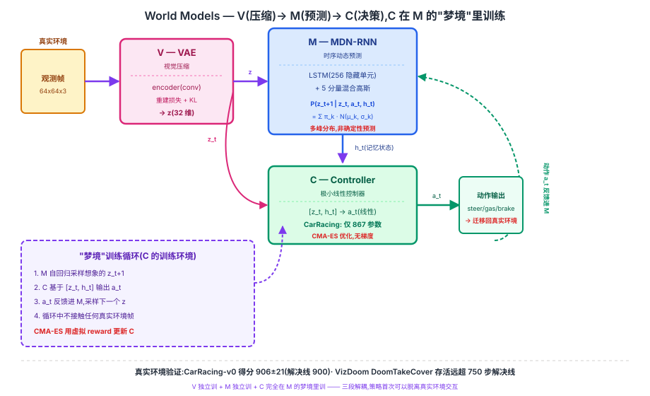

## 前作进展

2018 年之前,强化学习智能体在处理高维像素观测时基本走两条路,两条都不理想:

- **直接在原始像素上做 model-free RL**——DQN(2015)、A3C(2016)这类方法把观测帧直接喂给策略/价值网络,靠海量环境交互试错学习。样本效率低,训练一个 Atari 智能体动辄需要数千万到上亿帧交互,换到真实机器人或复杂 3D 环境(VizDoom)成本更高。
- **model-based RL,但世界模型和策略耦合训练**——即便引入了"预测环境动态"的模块,它通常和策略网络绑在一起联合优化,很难单独评估这个世界模型学得好不好,也难以复用。

Ha 与 Schmidhuber 的洞察是把这两件事**彻底解耦成两个独立训练阶段**:先无监督地学一个关于环境如何运作的生成式世界模型(不需要任何奖励信号),再把这个学好的世界模型当成一个可以随意采样的"模拟器",在里面训练一个极小的策略。这个思路直接继承自 Schmidhuber 自己 1990 年代提出的"用循环网络学习环境模型、在模型内部做规划"的早期设想,但 2018 年第一次用现代深度学习组件(VAE + LSTM-based MDN-RNN + CMA-ES)把它做成一个端到端可运行、在标准 benchmark 上验证过的系统。

## 核心思想:V + M + C 三段解耦,策略完全在"梦境"里训练

### 直觉

把这套系统类比成人类玩游戏的方式会更直观:人不会记住每一帧的原始像素,而是在脑子里维护一个压缩过的、抽象的场景表征(V),并且能够在脑子里"预演"接下来大概会发生什么(M),再基于这个预演快速做出反应(C)。Ha & Schmidhuber 把这三个角色拆成三个独立的、大小差异悬殊的模块:

- **V(Vision,VAE)**:把每一帧高维像素观测压缩成一个低维隐向量 z(论文取 32 维)。V 只负责"看懂当下",不管时间、不管动作。
- **M(Memory,MDN-RNN)**:一个输出**混合高斯分布**的 RNN(256 个隐藏单元的 LSTM + 5 分量的 mixture density network),建模 P(z_{t+1} | z_t, a_t, h_t)——给定当前压缩表征、动作和 RNN 隐状态,预测下一时刻压缩表征的**分布**而不是一个确定值。
- **C(Controller)**:一个极小的**线性**模型,输入是 [z_t, h_t](把 V 的压缩视觉表征和 M 的记忆状态拼在一起,CarRacing 任务里是 32+256=288 维),直接线性映射到动作输出。C 在 CarRacing-v0 上只有 867 个参数。

因为 C 小到只有几百个参数,论文完全放弃了梯度下降,改用 **CMA-ES**(Covariance Matrix Adaptation Evolution Strategy,一种基于种群采样、不需要反向传播的进化策略)直接优化这几百个数字。而 C 训练时用的"环境反馈",完全来自 M 自己采样生成的想象轨迹——不接触任何一帧真实环境画面。

### 三个必须同时跨过的坎

1. **V 能不能把像素压缩到足够小、又保留足够信息?**——32 维远小于原始像素维度,但要让后续的 M/C 可用,必须保留场景中影响决策的关键视觉信息。
2. **M 能不能建模环境的不确定性,而不是学成一个"平均化"的确定性预测器?**——环境的未来往往不是唯一的,MDN 的混合高斯输出是这一步的关键设计。
3. **C 能不能做到足够小、足够简单,以至于可以完全在 M 的想象里训练还能迁移回真实环境?**——如果 C 太大或用梯度法直接拟合 M 的想象,很容易过拟合到 M 的预测漏洞。

→ 三个模块各自独立训练、职责严格分离,见图 1 的 V→M→C 全景。



## 机制一:V(Vision)—— VAE 视觉压缩

V 是一个标准的变分自编码器(VAE),把每一帧 64×64×3 的像素观测编码成一个 32 维的隐向量 z。VAE 的重建损失(reconstruction loss + KL 散度)驱动编码器学到的 z 保留视觉上对判断场景状态有用的信息——赛道曲率、车身朝向、障碍物位置等,而不需要任何显式的监督标签。

V 单独训练,和 M、C 完全无关——这正是"解耦"的第一步:视觉压缩的好坏可以独立评估(看重建质量),不需要等到策略训练完才能判断 V 学得对不对。

## 机制二:M(Memory)—— MDN-RNN 时序动态预测

M 是一个 MDN-RNN:一个 256 隐藏单元的 LSTM,外接一个 mixture density network(MDN)输出头,用 5 个高斯分量的混合分布来建模下一时刻压缩表征的条件分布:

```
P(z_{t+1} | z_t, a_t, h_t) = Σ_{k=1}^{5} π_k · N(μ_k, σ_k)
```

关键设计是**输出混合高斯分布而不是单一确定性预测**。环境的未来往往有多种可能性——比如 VizDoom 里的怪物子弹接下来往左还是往右飞,CarRacing 里赛道下一段是左弯还是右弯。如果 M 只输出一个确定性的 z_{t+1}(等价于对多种可能性取平均),训练出来的"想象轨迹"会系统性地偏向一个模糊、不真实的平均态,而不是任何一种真实可能发生的场景。用混合高斯建模多峰不确定性,让 M 采样出的想象轨迹能覆盖环境真实可能出现的多种走向。

M 训练时用的是 V 已经压缩好的 z 序列(配合真实交互中记录的动作 a),同样不需要 C 参与——V 和 M 都可以在拿到一批随机策略(甚至完全随机的动作)收集的 rollout 数据后离线训练完成。

## 机制三:C(Controller)—— 极小线性控制器,完全在梦境里训练

C 是三个模块里参数量最悬殊的一个:一个把 [z_t, h_t] 直接线性映射到动作的单层模型,CarRacing-v0 任务上总共只有 **867 个参数**(288 维输入 × 3 维动作输出 + 3 个 bias)。

正因为 C 足够小,论文彻底放弃梯度下降,改用 **CMA-ES** 这种进化策略:维护一个参数分布,每一代采样一批候选参数向量、评估各自的累计 reward、根据表现更新分布均值和协方差,不需要计算任何梯度。

最关键的一步是训练环境的选择——C 的训练**完全在 M 生成的"梦境"(hallucinated rollout)里进行**:用 M 自回归地采样出想象的 z 序列(而不是真实环境返回的观测),模拟出一整条虚拟轨迹和虚拟 reward 信号,C 在这些虚拟轨迹上被 CMA-ES 优化。整个训练过程中,C 不需要接触任何一帧真实环境画面。训练完成后,再把学到的 C 参数原封不动地搬回真实环境测试,检验策略是否能真正迁移。

论文还发现一个重要的细节:如果直接用 M 的默认温度采样想象轨迹,C 有可能学会"利用" M 预测里的系统性错误(M 有时会把某些危险状态预测得过于乐观)来刷高虚拟 reward,但这种投机策略在真实环境里会失效。解决办法是调高 M 采样时的温度参数 τ,让想象轨迹包含更多不确定性,迫使 C 学到的策略对 M 的预测误差更鲁棒。

## 三件套协同 —— 为什么三者缺一不可

> **V 负责"看懂当下" + M 负责"预演未来"+ C 负责"在预演里学决策"**——三者必须同时到位,任何一个环节垮掉,整条链路都会失效。

- 只有 **V 准**:视觉压缩很好,但如果 M 学不好时序动态,C 在梦境里训出来的策略在真实环境里根本用不上——梦境本身就是错的。
- 只有 **M 准**:世界模型预测很准,但如果它"过于确定"、缺乏不确定性建模(比如去掉混合高斯只用单一高斯甚至确定性输出),C 会学会利用 M 预测里的漏洞刷分,而这些漏洞在真实环境里不存在,迁移直接失败。
- 只有 **C 小**:控制器足够小、用了 CMA-ES,但如果 V 或 M 质量不够,C 训练的"环境"(梦境)本身就不可信,再怎么优化 C 也没用;反过来如果 C 不够小、直接用梯度法在梦境里过拟合,也容易学出只在梦境里有效的投机策略。

三者组合后,首次证明了一个策略可以**完全脱离真实环境交互**、只在自己学到的内部世界模型里完成训练,再迁移回真实环境依然有效——这是这篇论文相对于此前 model-based RL 工作最核心的贡献。

## 关键代码

V/M/C 的核心接口简化示意(基于论文思路,不追求完整可运行):

```python
import torch
import torch.nn as nn
import torch.nn.functional as F

class VAE(nn.Module):
    """V: 把 64x64x3 像素帧压缩成 32 维隐向量 z"""
    def __init__(self, z_dim=32):
        super().__init__()
        self.encoder = ConvEncoder(out_dim=z_dim * 2)  # 输出 mu, logvar
        self.decoder = ConvDecoder(in_dim=z_dim)

    def encode(self, obs):
        mu, logvar = self.encoder(obs).chunk(2, dim=-1)
        std = (0.5 * logvar).exp()
        z = mu + std * torch.randn_like(std)  # 重参数化
        return z, mu, logvar

    def forward(self, obs):
        z, mu, logvar = self.encode(obs)
        recon = self.decoder(z)
        return recon, mu, logvar


class MDNRNN(nn.Module):
    """M: LSTM + 混合高斯输出头,建模 P(z_{t+1} | z_t, a_t, h_t)"""
    def __init__(self, z_dim=32, action_dim=3, hidden_dim=256, n_mixtures=5):
        super().__init__()
        self.lstm = nn.LSTM(z_dim + action_dim, hidden_dim, batch_first=True)
        # 每个混合分量输出: 权重 pi + 均值 mu + 标准差 sigma(每维 z)
        self.mdn_head = nn.Linear(hidden_dim, n_mixtures * (1 + 2 * z_dim))
        self.n_mixtures, self.z_dim = n_mixtures, z_dim

    def forward(self, z_t, a_t, hidden=None):
        x = torch.cat([z_t, a_t], dim=-1)
        h_out, hidden = self.lstm(x, hidden)
        params = self.mdn_head(h_out)
        pi, mu, logsigma = params.split(
            [self.n_mixtures, self.n_mixtures * self.z_dim,
             self.n_mixtures * self.z_dim], dim=-1)
        pi = F.softmax(pi, dim=-1)  # 混合权重
        return pi, mu, logsigma.exp(), hidden

    def sample_next_z(self, z_t, a_t, hidden, temperature=1.0):
        """从预测的混合高斯里采样下一个 z——生成'梦境'的核心一步"""
        pi, mu, sigma, hidden = self.forward(z_t, a_t, hidden)
        k = torch.multinomial(pi, 1)  # 按混合权重选一个分量
        mu_k, sigma_k = mu.gather(-1, k), sigma.gather(-1, k)
        z_next = mu_k + sigma_k * temperature * torch.randn_like(mu_k)
        return z_next, hidden


class LinearController(nn.Module):
    """C: 极小线性策略,[z_t, h_t] 直接映射到动作,CarRacing 上仅 867 个参数"""
    def __init__(self, z_dim=32, hidden_dim=256, action_dim=3):
        super().__init__()
        self.fc = nn.Linear(z_dim + hidden_dim, action_dim)  # 唯一的可训练层

    def forward(self, z_t, h_t):
        return torch.tanh(self.fc(torch.cat([z_t, h_t], dim=-1)))


def train_controller_in_dream(vae, mdnrnn, controller_params, cma_es, n_rollouts=16):
    """C 完全在 M 生成的想象轨迹里训练,不接触任何真实环境帧"""
    for generation in range(N_GENERATIONS):
        candidates = cma_es.ask()  # 采样一批候选 C 参数向量
        fitness = []
        for params in candidates:
            controller = LinearController()
            controller.load_flat_params(params)
            total_reward = 0.0
            z_t, hidden = mdnrnn.initial_state(), None
            for t in range(MAX_DREAM_STEPS):
                h_t = hidden[0].squeeze(0) if hidden else torch.zeros(256)
                a_t = controller(z_t, h_t)
                # 关键:下一帧完全由 M 采样,不是真实环境返回的
                z_t, hidden = mdnrnn.sample_next_z(z_t, a_t, hidden)
                total_reward += reward_from_dream(z_t, a_t)  # 梦境内的虚拟 reward
            fitness.append(total_reward)
        cma_es.tell(candidates, fitness)  # 无梯度更新
    return cma_es.best_params()  # 训练完成后搬回真实环境测试
```

真实实现里 V/M 各自独立预训练(先用随机策略收集 rollout 训 V,再用 V 编码后的 z 序列训 M),C 的 CMA-ES 优化通常并行跑多个 worker 评估候选参数,细节和工程量远超以上简化版本。

## 性能数据

论文在两个标准 RL benchmark 上验证了"完全在梦境里训练策略,再迁移回真实环境"的可行性:

**CarRacing-v0**(连续控制,3 维动作:方向盘、油门、刹车):

- 该任务官方定义的"解决"(solved)标准是 **100 次连续试验平均得分 ≥ 900**
- World Models 智能体(仅 867 个可训练参数的线性控制器)在真实环境里达到平均得分 **906 ± 21**(100 次试验),是当时已知的第一个稳定解决该任务的方法,且不依赖任何关于赛车环境的先验假设

**VizDoom(DoomTakeCover 任务)**(躲避怪物投掷的火球,存活时间即得分):

- 该任务的"解决"标准是平均存活 **750 个时间步**
- 智能体的策略完全在 M 生成的想象环境里训练完成,再迁移到真实 VizDoom 环境测试,平均存活时间显著超过 750 步的解决门槛
- 论文特别指出,如果不对 M 的采样温度做调整,C 会在梦境里学出"钻 M 预测漏洞"的投机策略,导致这类策略在真实环境里的存活时间远低于梦境里的表现——这是三件套协同一节里提到的失效模式在实验上的直接证据

两个任务共同的结论是:一个参数量小到几百个数量级的线性策略,只要配上足够好的 V(视觉压缩)和 M(时序动态预测),就能完全脱离真实环境训练出可迁移的策略。

## 影响 / 后续

World Models 确立了"V/M/C 三段式世界模型"这一 model-based RL 的经典范式:先无监督学一个关于环境如何运作的生成式模型,再在这个模型内部("梦境"或"想象")训练策略,最后迁移回真实环境。这个思路直接启发了后续一系列工作把"在想象里训练策略"这条路线规模化、通用化:

- **PlaNet**(2019)把隐空间规划和 latent dynamics 模型结合,证明了纯粹在隐空间里做 model predictive control 也能在多个连续控制任务上媲美 model-free 方法
- **Dreamer 系列**(Dreamer → DreamerV2 → DreamerV3)延续"latent imagination"思路,把 V/M 换成更强的循环状态空间模型(RSSM),并且用梯度反传(而非进化策略)直接在想象轨迹上训练 actor-critic,大幅提升样本效率和任务规模

→ 03-dreamerv3.md · 世界模型规模化到跨领域,同一套 latent imagination 框架不调参打平 150+ 任务的 model-free SOTA
