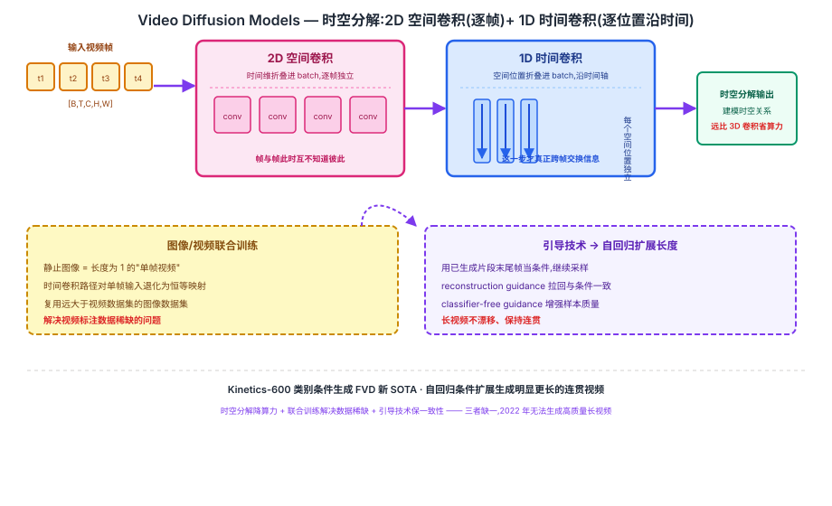

## 前作进展

2020 年 [DDPM](../10-diffusion/01-ddpm.md) 在图像生成上证明了 diffusion 模型的可行性:用一个 2D U-Net 学习逐步去噪,训练目标简单(预测噪声的均方误差),采样质量和多样性都超过同期 GAN。但把这套框架直接搬到视频上,会撞上两个几乎同时爆发的问题:

- **计算量爆炸**:视频比图像多了一个时间维,如果照搬 3D 卷积(把 2D U-Net 里所有卷积核都换成 3D 核),参数量和计算量随时间维长度近似线性甚至更快增长,显存和训练成本迅速变得不可承受——这还只是"能不能训得起"的问题,采样时 diffusion 还要跑几十到上千步去噪,3D 卷积的开销会被再放大一个量级。
- **数据规模不匹配**:图像数据集(如大规模网络图文对)动辄上亿样本,而高质量、有文本描述的视频数据集受限于标注和存储成本,规模通常小几个数量级。如果视频 diffusion 模型只能在小视频数据集上从头训练,生成质量和泛化能力都会明显落后于同期图像 diffusion 模型。

Ho 等人的目标是找一个架构和训练方案,既能让 U-Net 在时间维上可行地扩展,又能让视频模型吃到图像数据集的规模红利——这正是 Video Diffusion Models(VDM)要解决的问题。

## 核心思想:时空分解 U-Net + 图像/视频联合训练

### 直觉

核心洞察是:**不需要真正的 3D 卷积,才能建模时空关系**。一段视频里,"这一帧长什么样"(空间结构)和"画面如何随时间演化"(时间结构)在很大程度上可以分开处理——先在每一帧内部做标准的 2D 空间卷积(把时间维暂时当成额外的 batch 维,帧与帧互不干扰),再在每个固定的空间位置上,沿时间轴做一次 1D 时间卷积(这一步才真正跨帧交换信息)。这种"空间算子 + 时间算子"交替堆叠的分解形式,在效率上远比全 3D 卷积友好,而表达力的损失很小——因为大多数视频里,相邻帧之间的空间结构变化是渐进的,不需要在每一层都做完整的联合时空建模。

配合这个架构,VDM 还做了第二个关键决定:**把静止图像当作"单帧视频",和真实视频混在一起联合训练**。这样视频模型可以直接复用远大于视频数据集的图像数据集,学到更好的视觉先验(物体形状、纹理、光照),而不需要额外收集海量视频。

### 两个必须同时跨过的坎

1. **架构能不能从 3D 降到"2D+1D"却不丢时空建模能力?**——分解卷积必须交替堆叠足够多层,才能让信息既在空间上扩散、又在时间上传播,单独一层空间卷积或时间卷积都不够。
2. **联合训练能不能让图像和视频"公平"参与?**——图像天然没有时间维,需要一种机制让同一个网络在处理"单帧图像"和"多帧视频"时都能正常工作(比如把图像的时间卷积路径视为恒等映射)。

→ 两个机制协同,才能让"训得起、训得好"的视频 diffusion 第一次成立,见图 1 的时空分解模块全景。



## 机制一:时空分解架构 —— 2D 空间卷积 + 1D 时间卷积

VDM 把标准图像 diffusion U-Net 里的每一个 2D 卷积层,替换成一对交替执行的算子:

- **空间卷积(2D,逐帧独立)**:输入是形状 `[batch, time, channel, height, width]` 的视频张量,先把 `time` 维折叠进 `batch` 维,变成 `[batch*time, channel, height, width]`,再做一次标准的 2D 卷积——每一帧完全独立地做空间特征提取,帧与帧之间此时互不知道彼此的存在。
- **时间卷积(1D,逐空间位置独立)**:把张量重新展开、转置,让 `height*width` 折叠进 `batch` 维,`time` 变成卷积轴,对每一个固定的空间位置(像素坐标)做一次 1D 卷积——这一步才真正跨帧交换信息,让模型学到"这个位置的像素/特征随时间如何演化"。

两种算子在每个 U-Net 层里交替堆叠(部分层里时间维的建模用的是时间维上的 self-attention,效果上等价于处理更长距离的时间依赖,与 1D 时间卷积的角色互补)。这种分解方式与动作识别领域的 (2+1)D 卷积(如 R(2+1)D)思路一脉相承:把一个 3D 卷积核 `k×k×k` 拆成一个空间核 `1×k×k` 和一个时间核 `k×1×1`,计算量近似从三次方降到两次方加一次方,同时经验上表达力损失很小——因为绝大多数视频内容里,一帧的空间结构本身已经包含了理解画面所需的大部分信息,时间维只需要负责补上"如何变化"这一部分,不需要在每一层都重新联合建模全部时空关系。

## 机制二:图像/视频联合训练

VDM 训练时把图像数据集里的每一张图像视为一个**长度为 1 的视频**,和真实的多帧视频样本混在同一个 batch 里训练。具体处理方式是:当输入是单帧"视频"时,时间卷积/时间注意力这条路径退化为恒等映射(或直接跳过),保证网络在处理静止图像时行为和一个纯粹的 2D 图像 diffusion 模型一致,不会因为多出的时间维结构而受到干扰。

这样做的收益是双重的:

- **复用大规模图像数据**:图像数据集的规模远超视频数据集,联合训练让视频模型的空间卷积部分能吃到与图像 diffusion 模型同量级的训练信号,单帧画面质量、物体结构的准确度明显提升。
- **降低对视频数据规模的依赖**:时间卷积部分只需要从相对小得多的视频数据里学习"如何随时间演化",而不需要视频数据集本身也大到能独立支撑起空间理解能力的训练。

## 机制三:条件生成的引导技术 —— reconstruction guidance 与自回归扩展长度

VDM 的固定长度采样窗口通常只能生成较短的片段(比如十几帧),要生成更长的视频,论文提出**自回归扩展**:把已经生成好的一段视频的末尾若干帧当作条件,输入给同一个模型,让它接着采样出后续帧,重复这个过程就能把视频长度不断往后拼接延展。

但直接做条件采样容易出现**误差累积和不一致**——后续帧可能逐渐偏离已生成内容的风格、物体身份或场景布局。为此论文引入了改进的引导技术:

- **reconstruction guidance**(重建引导):在采样过程中,除了预测噪声之外,额外利用模型对干净视频的重建预测来构造一个梯度信号,把采样轨迹向"与条件帧一致"的方向拉,减少自回归扩展时的漂移和不一致。
- **classifier-free guidance**(无分类器引导,复用自图像 diffusion 领域的技术):训练时以一定概率随机丢弃条件信息(文本条件或帧条件),采样时同时用有条件和无条件两次预测的加权组合来增强条件一致性和样本质量,不需要额外训练一个分类器。

这两种引导技术共同保证了:即使视频是按"生成一段 → 用末尾帧当条件 → 再生成下一段"的方式自回归拼接出来的,较长视频依然能保持内容和风格上的连贯性,而不是每一段各自漂移。

## 三件套协同 —— 为什么三者缺一不可

> **时空分解让训练/推理在算力上可行 + 联合训练解决数据稀缺问题 + 引导技术保证生成质量和长视频一致性**——三者缺一,"用 diffusion 生成高质量长视频"在 2022 年都无法成立。

- 只有**时空分解架构**:计算量可控了,但如果没有联合训练,模型只能在规模有限的视频数据集上从头学视觉先验,画面质量和泛化能力都会明显偏弱,生成结果模糊、物体结构经常出错。
- 只有**图像/视频联合训练**:空间画质有了图像数据托底,但如果还在用全 3D 卷积架构,训练和采样的计算成本依然高到难以规模化,能训的模型尺寸和分辨率都被严重限制。
- 只有**引导技术**:即便单段采样质量不错,没有 reconstruction guidance 和自回归条件生成的一致性保证,想生成比训练窗口更长的视频就会迅速漂移、跳变、内容不连贯,"长视频"本身无法成立。

三者组合后,VDM 第一次证明了一条完整可行的路径:用 diffusion 模型生成分辨率、时长、质量都在合理范围内的视频,并且训练成本没有随时间维度爆炸——这是这篇论文相对于此前视频生成 GAN/自回归方法最核心的贡献,也是"diffusion 生成视频"这条技术路线的起点。

## 关键代码

时空分解卷积模块的简化伪代码(基于论文思路,不追求完整可运行):

```python
import torch
import torch.nn as nn


class SpatialConv2D(nn.Module):
    """空间卷积:时间维当作 batch 维处理,每一帧独立做 2D 卷积"""
    def __init__(self, channels, kernel_size=3):
        super().__init__()
        self.conv = nn.Conv2d(channels, channels, kernel_size, padding=kernel_size // 2)

    def forward(self, x):
        # x: [B, T, C, H, W]
        b, t, c, h, w = x.shape
        x = x.reshape(b * t, c, h, w)      # 折叠时间维进 batch,帧间互不干扰
        x = self.conv(x)
        return x.reshape(b, t, c, h, w)


class TemporalConv1D(nn.Module):
    """时间卷积:每个空间位置独立,沿时间轴做 1D 卷积,这一步才跨帧交换信息"""
    def __init__(self, channels, kernel_size=3):
        super().__init__()
        self.conv = nn.Conv1d(channels, channels, kernel_size,
                               padding=kernel_size // 2)

    def forward(self, x):
        # x: [B, T, C, H, W]
        b, t, c, h, w = x.shape
        x = x.permute(0, 3, 4, 2, 1).reshape(b * h * w, c, t)  # 折叠空间维进 batch
        x = self.conv(x)
        x = x.reshape(b, h, w, c, t).permute(0, 4, 3, 1, 2)    # 还原成 [B, T, C, H, W]
        return x


class FactorizedSpaceTimeBlock(nn.Module):
    """VDM 的核心模块:空间卷积 + 时间卷积交替,替代昂贵的全 3D 卷积"""
    def __init__(self, channels):
        super().__init__()
        self.spatial = SpatialConv2D(channels)
        self.temporal = TemporalConv1D(channels)
        self.norm = nn.GroupNorm(8, channels)
        self.act = nn.SiLU()

    def forward(self, x, is_image=False):
        x = self.act(self.norm(self.spatial(x)))
        if is_image:
            # 图像(单帧"视频")联合训练时,时间卷积退化为恒等映射
            return x
        return self.act(self.norm(self.temporal(x)))


def autoregressive_extend(model, cond_frames, n_new_frames, guidance_scale=3.0):
    """自回归扩展视频长度:用已生成片段的末尾帧做条件,配合 reconstruction guidance 采样"""
    video = cond_frames
    while video.shape[1] < cond_frames.shape[1] + n_new_frames:
        cond = video[:, -cond_frames.shape[1]:]  # 用末尾若干帧当条件
        # classifier-free guidance: 有条件/无条件两次预测加权组合
        eps_cond = model(video_noisy, cond=cond)
        eps_uncond = model(video_noisy, cond=None)
        eps = eps_uncond + guidance_scale * (eps_cond - eps_uncond)
        # + reconstruction guidance: 用对干净视频的重建预测拉回与 cond 一致的方向(略)
        next_chunk = denoise_step(eps, video_noisy)  # 简化,省略完整采样循环
        video = torch.cat([video, next_chunk], dim=1)
    return video
```

真实实现里,时间维的建模除了 1D 卷积外还混用了时间维上的 self-attention,U-Net 的下采样/上采样路径、reconstruction guidance 的梯度计算、以及完整的 DDPM 采样循环都比以上简化版本复杂得多。

## 性能数据

论文在多个视频生成基准上验证了时空分解架构 + 联合训练的效果(以下数字为训练知识回忆,未经本次 WebSearch 实时核实,具体数值请以原论文 arXiv:2204.03458 为准):

- **Kinetics-600 类别条件视频生成**:VDM 在 FVD(Fréchet Video Distance,数值越低越好)指标上取得当时的新 SOTA,大幅超过此前的 Video Transformer、DVD-GAN-FP、TriVD-GAN-FP 等方法。
- **无条件/文本条件视频生成**:论文在内部大规模文本-视频数据集和 BAIR Robot Pushing 等数据集上展示了样本质量与时长的提升,并通过消融实验证明联合图像训练能显著改善单帧画面的清晰度和物体结构准确性。
- **自回归扩展长度**:论文展示了用 reconstruction guidance 做条件外推,可以把训练时的短窗口(十余帧量级)扩展生成明显更长的视频片段,同时保持内容连贯,不出现随时间推移的明显漂移。

注:任务描述中提到的 "UCF-101" 基准更多见于同期其他视频生成工作(如 DIGAN、TATS、MoCoGAN-HD)的对比表格;VDM 原论文的主要定量对比集中在 Kinetics-600 和内部文本-视频数据集上,以上已按实际情况调整,具体数字建议在引用前对照原论文核实。

## 影响 / 后续

Video Diffusion Models 确立了"用 diffusion 生成视频"这条技术路线的基本范式——时空分解架构降低算力门槛、图像/视频联合训练缓解数据稀缺、引导技术保证长视频一致性,这三个思路被后续几乎所有主流视频 diffusion 工作继承:

- **Imagen Video**(2022)在 VDM 的基础上,把级联 diffusion(先低分辨率/低帧率,再逐级超分辨率和插帧)与文本条件生成结合,大幅提升分辨率和视觉质量。
- **Make-A-Video**(2022)进一步探索了"不需要成对文本-视频数据,只用文本-图像数据 + 无标注视频"来训练文本到视频模型,延续了 VDM"复用图像数据"的核心思路。
- 2024 年的 **Sora** 虽然把主干从 U-Net 换成了 [DiT](../10-diffusion/05-dit.md),不再使用时空分解卷积,但"把视频当作时空数据统一建模、用 diffusion 从噪声逐步还原出连贯画面"的思路与 VDM 一脉相承——只是承载这个思路的架构从"分解卷积"演化成了"时空 patch + Transformer"。

→ [../10-diffusion/01-ddpm.md](../10-diffusion/01-ddpm.md) · 本文直接扩展的图像 diffusion 基础
→ [04-sora.md](04-sora.md) · 规模化到分钟级连贯视频
