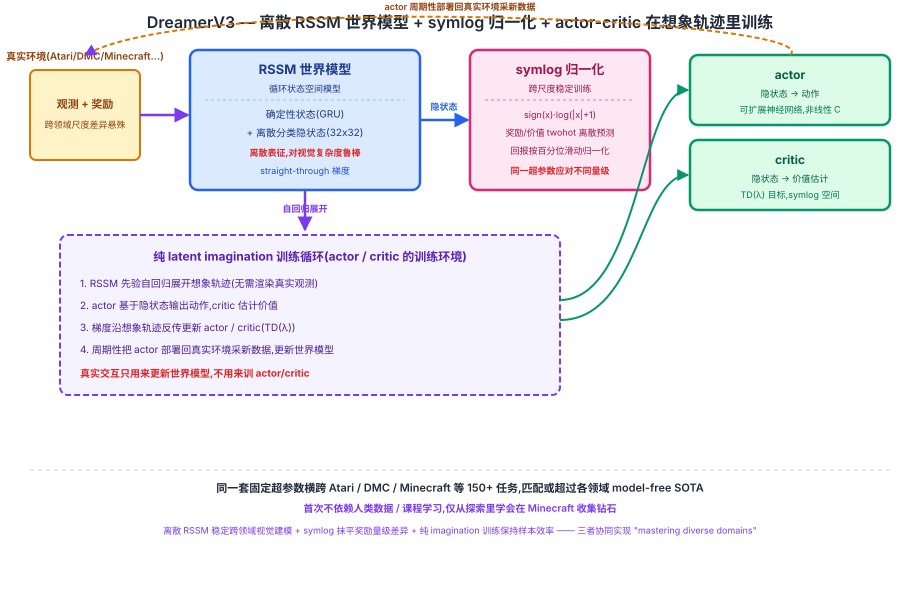

## 前作进展

2018 年 [World Models](01-world-models.md) 证明了"在梦境里训练策略"这条思路本身可行,但验证范围很有限——V(VAE)+ M(MDN-RNN)+ C(极小线性控制器)三段解耦的系统,只在 CarRacing、VizDoom 这类相对简单的任务上跑通,C 甚至只有几百个参数,靠 CMA-ES 这种进化策略就能训好。

此后几年,这条脉络快速演化:

- **PlaNet**(2019)把隐空间动态模型和 model predictive control 结合,证明纯粹在 latent space 里做规划也能在连续控制任务上媲美 model-free 方法。
- **Dreamer**(2020)首次把"想象里训练"和**梯度反传**结合——不再用 CMA-ES 这种无梯度的进化策略,而是让 actor-critic 直接在想象轨迹上通过反传更新,样本效率大幅提升。
- **DreamerV2**(2021)把世界模型换成循环状态空间模型(RSSM),并在 Atari 这种离散动作、高维视觉输入的任务上首次让纯 model-based 方法打平 model-free SOTA(如 Rainbow)。

但这些工作有一个共同的局限:**每个领域往往需要针对性调超参数**——DMC 的连续控制、Atari 的离散动作、不同任务的奖励量级差异巨大,换一个领域常常需要重新调整学习率、损失权重、网络结构等细节。这让"世界模型"这条路线始终停留在"每个领域各自调出一个能打的版本",没有证明过一套固定配置能真正跨领域通用。DreamerV3 要解决的正是这个问题。

## 核心思想:同一套世界模型范式,靠归一化技术抹平跨领域差异

### 直觉

DreamerV3 的核心洞察是:**latent imagination 这套范式(学世界模型 + 在想象里训练 actor-critic)本身已经足够通用,真正卡住跨领域泛化的不是架构表达力,而是不同领域的观测和奖励尺度差异悬殊**。比如 Atari 的分数动辄成百上千,DeepMind Control 的奖励通常被人为归一化到 [0, 1000] 左右,而 Minecraft 收集钻石这种任务的奖励极度稀疏、量级又完全不同。如果直接用同一套学习率、损失缩放去训练,某个领域会梯度爆炸,另一个领域又学不动。

DreamerV3 的解法不是"针对每个领域调参",而是反过来:**设计一套对输入/输出尺度不敏感的归一化技术,让网络内部看到的数值范围天然稳定,从而同一套超参数可以直接套用到差异巨大的领域**。这个思路和"给模型换更大更强的架构"完全不同方向——DreamerV3 的世界模型和 Dreamer/DreamerV2 相比,核心结构演化并不算颠覆性(仍然是 RSSM + actor-critic),真正的创新集中在稳定训练的工程细节上。

### 两个必须同时跨过的坎

1. **世界模型能不能在视觉复杂度差异巨大的领域(Atari 像素 vs DMC 渲染 vs Minecraft 体素世界)上都学得稳?**——需要一种对不同视觉分布都鲁棒的隐状态表征。
2. **actor-critic 能不能在奖励量级差 3-4 个数量级的领域间用同一套学习率训练?**——需要把不同量级的奖励/价值都变换到统一的数值范围。

→ 两个机制协同,才第一次让"固定超参数、跨领域通吃"成立,见图 1 的 RSSM 世界模型 + 想象里训练 actor-critic 全景。



## 机制一:RSSM 世界模型 —— 离散隐变量

DreamerV3 沿用 DreamerV2 引入的 **Recurrent State-Space Model(RSSM)** 作为世界模型骨架,但关键设计是隐状态用**离散分类变量**表示,而不是 [World Models](01-world-models.md) 里 MDN-RNN 那种连续高斯/混合高斯输出。具体来说,RSSM 每一步维护一个确定性的循环状态(GRU 更新)加一个随机的离散隐状态——离散隐状态由若干组分类分布(categorical)拼接而成,训练时用 straight-through 梯度估计器让离散采样也能反传梯度。

用离散表征替代连续高斯的直觉是:**离散分类变量对不同领域的视觉复杂度更鲁棒**。连续高斯隐变量在建模"多峰、结构化"的视觉/动态模式时容易被平均化(比如同时叠加多个可能出现的物体轮廓,输出模糊的平均态);离散分类变量天然可以表示"多选一"的结构化模式,不容易出现这种模糊平均,这让同一个 RSSM 架构在 Atari 的像素游戏画面、DMC 的连续物理场景、Minecraft 的体素世界之间都能给出稳定、清晰的动态预测,不需要针对某个领域专门调整隐状态的建模方式。

## 机制二:symlog 归一化 —— 跨尺度稳定训练

不同领域的观测数值和奖励/价值量级差异悬殊,是跨领域调参的核心痛点。DreamerV3 用 **symlog 变换**统一处理这个问题:

```
symlog(x) = sign(x) · log(|x| + 1)
symexp(x) = sign(x) · (exp(|x|) − 1)   # symlog 的逆变换
```

symlog 对小数值近似恒等映射,对大数值做对数压缩,且对称处理正负号,这样无论某个领域的奖励是个位数还是成千上万,变换后都被压到相近的数值范围。DreamerV3 把这个变换用在三个地方:

- **观测预测**:世界模型解码器预测观测时,先对目标做 symlog 变换再计算损失,让不同领域、不同量级的观测重建损失处在可比范围。
- **奖励/价值预测**:reward predictor 和 critic 不直接回归原始数值,而是用**离散化的 symlog 空间**(twohot 编码 + 分类损失)来预测奖励和价值,避免了直接回归大数值目标时常见的梯度不稳定。
- **返回值归一化**:actor-critic 训练时,用基于百分位数(而不是固定常数)的指数滑动统计量对回报(return)做归一化缩放,进一步抹平不同领域奖励幅度的差异。

这一整套归一化技术让同一套学习率、损失权重等超参数,不需要针对具体领域手工调整奖励缩放就能稳定训练。

## 机制三:纯 latent imagination 训练 actor-critic

和 [World Models](01-world-models.md) 里 C 完全在 M 的梦境里训练类似,DreamerV3 的 actor(策略)和 critic(价值函数)也**完全在 RSSM 生成的想象轨迹里训练**,不需要每一步都和真实环境交互:

1. 从真实环境收集到的一批状态出发,RSSM 在隐空间里自回归地展开(rollout)出一条条想象轨迹——每一步只用世界模型预测下一个隐状态、奖励、是否终止,不再渲染真实观测。
2. actor 根据想象轨迹里的隐状态输出动作,critic 估计每个隐状态的价值;两者的梯度都通过想象轨迹反传(critic 用 TD(λ) 类型的目标,actor 直接对想象出的回报做梯度上升)。
3. 训练好的 actor 被周期性地部署回真实环境收集新数据,新数据再用来更新世界模型,形成"真实交互 → 更新世界模型 → 想象里训练策略 → 部署回真实环境"的循环。

真实环境交互只用来更新世界模型和补充新经验,actor/critic 绝大部分梯度更新发生在想象轨迹上,这是 DreamerV3 样本效率的核心来源——和 [World Models](01-world-models.md) 用 CMA-ES 训练极小线性 C 不同,DreamerV3 的 actor/critic 是可以扩展到大得多的神经网络,靠反传梯度直接优化。

## 三件套协同 —— 为什么三者缺一不可

> **离散 RSSM 让不同领域的视觉输入都能被稳定建模 + symlog 归一化让同一套超参数应对不同量级的奖励 + 纯 imagination 训练让样本效率跨领域保持一致**——三者共同实现了论文标题里的"mastering diverse domains"。

- 只有**离散 RSSM**:世界模型在视觉上足够鲁棒,但如果奖励/价值预测还是直接回归原始数值,遇到奖励量级悬殊的领域(比如 Minecraft 稀疏奖励 vs Atari 稠密分数)依然会梯度不稳定,固定超参数在某些领域会直接训崩。
- 只有 **symlog 归一化**:数值尺度统一了,但如果世界模型隐状态还是连续高斯,遇到 Minecraft 这种视觉复杂、动态多峰的环境依然容易学出模糊、不可靠的想象轨迹,策略在这样的梦境里训不出可迁移的行为。
- 只有**纯 imagination 训练**:样本效率的框架有了,但如果世界模型本身(离散表征)和数值稳定性(symlog)任一环节跨领域不稳定,想象轨迹要么质量差、要么训练发散,"想象里训练"这件事本身就无法成立。

三者组合后,DreamerV3 第一次证明:**同一套固定超参数的世界模型 + actor-critic,不需要逐领域调参,就能跨越 Atari、DeepMind Control、Minecraft 等差异巨大的领域,达到甚至超过各领域专门调过参的 model-free SOTA**——这是它相对于 Dreamer/DreamerV2 最核心的贡献。

## 关键代码

RSSM 前向传播 + imagination rollout 的简化伪代码(基于论文思路,不追求完整可运行):

```python
import torch
import torch.nn as nn
import torch.nn.functional as F


def symlog(x):
    return torch.sign(x) * torch.log1p(x.abs())


def symexp(x):
    return torch.sign(x) * (torch.expm1(x.abs()))


class RSSM(nn.Module):
    """世界模型:确定性循环状态 + 离散分类隐状态"""
    def __init__(self, obs_dim, action_dim, deter_dim=512,
                 n_categoricals=32, n_classes=32):
        super().__init__()
        stoch_dim = n_categoricals * n_classes
        self.gru = nn.GRUCell(stoch_dim + action_dim, deter_dim)
        # 后验(有观测时) / 先验(想象时,无观测)各自的离散分布头
        self.posterior_head = nn.Linear(deter_dim + obs_dim, stoch_dim)
        self.prior_head = nn.Linear(deter_dim, stoch_dim)
        self.n_categoricals, self.n_classes = n_categoricals, n_classes

    def sample_discrete(self, logits):
        # straight-through:前向用采样的 one-hot,反向梯度走 softmax
        logits = logits.view(-1, self.n_categoricals, self.n_classes)
        probs = F.softmax(logits, dim=-1)
        sample = F.gumbel_softmax(logits, hard=True, dim=-1)
        stoch = sample + (probs - probs.detach())  # straight-through 梯度
        return stoch.view(logits.shape[0], -1)

    def observe_step(self, deter, stoch, action, obs_embed):
        """有真实观测时:用后验更新隐状态(训练世界模型用)"""
        deter = self.gru(torch.cat([stoch, action], -1), deter)
        post_logits = self.posterior_head(torch.cat([deter, obs_embed], -1))
        stoch = self.sample_discrete(post_logits)
        return deter, stoch, post_logits

    def imagine_step(self, deter, stoch, action):
        """无真实观测时:用先验自回归展开(想象轨迹用)"""
        deter = self.gru(torch.cat([stoch, action], -1), deter)
        prior_logits = self.prior_head(deter)
        stoch = self.sample_discrete(prior_logits)
        return deter, stoch


def imagine_rollout(rssm, actor, reward_head, value_head,
                     deter0, stoch0, horizon=15):
    """actor/critic 完全在 RSSM 想象出的轨迹里训练,不接触真实环境"""
    deter, stoch = deter0, stoch0
    states, actions, rewards, values = [], [], [], []
    for t in range(horizon):
        feat = torch.cat([deter, stoch], -1)
        action = actor(feat)  # actor 只看隐状态,不看真实观测
        deter, stoch = rssm.imagine_step(deter, stoch, action)
        feat = torch.cat([deter, stoch], -1)
        # 奖励/价值用离散化 symlog(twohot)空间预测,这里简化为直接 symexp 还原
        reward = symexp(reward_head(feat))
        value = symexp(value_head(feat))
        states.append(feat); actions.append(action)
        rewards.append(reward); values.append(value)
    return states, actions, rewards, values  # 用于 TD(λ) 目标计算 actor/critic 梯度
```

完整实现里,离散分类隐状态通常拆成多组(如 32 组、每组 32 类)、KL 损失里的 free bits 与 KL balancing、TD(λ) 回报的百分位归一化、以及跨领域共享的网络结构细节都比以上简化版本复杂得多。

## 性能数据

> 以下数字基于训练知识回忆,本次任务执行时 WebSearch 工具不可用(报错未能核实),未经实时联网核实。方向性结论(固定超参数跨领域、Minecraft 钻石首次不用人类数据/课程学习)有较高把握,但具体数字请在引用前对照原论文 arXiv:2301.04104(Mastering Diverse Domains through World Models)核实。

- **跨领域覆盖**:论文用同一套固定超参数的 DreamerV3,在包括 Atari、DeepMind Control(状态输入和视觉输入两种设置)、Minecraft、Crafter、DMLab 等在内的多个基准套件上评估,涉及的任务总数常被引用为"150+ 个任务",在不额外调参的前提下匹配或超过大多数领域此前专门调过参的 model-free/model-based SOTA。
- **Minecraft 收集钻石**:论文报告 DreamerV3 是**第一个不依赖人类演示数据、不使用课程学习(curriculum),仅从头探索就能在 Minecraft 里学会收集钻石**的方法——钻石在 Minecraft 的科技树里需要完成一长串前置步骤(伐木、打造工具、挖矿、下矿井等),奖励极度稀疏,此前的方法通常需要人类先验知识或精心设计的任务分解才能达成。
- **模型规模的可扩展性**:论文中同时展示了 DreamerV3 在不同参数规模下的表现随模型增大而单调提升的趋势,说明这套方法具备随算力/模型规模继续扩展的空间,而不是一个只在小模型上生效的技巧组合。

## 影响 / 后续

DreamerV3 被认为是 **"model-based RL 通用化"的里程碑**——它第一次令人信服地证明,同一套 latent imagination 范式配合合适的归一化技术,可以不经逐领域调参地跨越视觉复杂度、动作空间、奖励量级都截然不同的任务,把 model-based RL 从"每个领域各自调出一个能打的版本"推进到"一套配置打天下"。

这条脉络在 2024 年开始和视频生成脉络合流:**Genie**(2024)的 Latent Action Model 和 DreamerV3 的世界模型都用**离散隐变量**表征环境动态——DreamerV3 用离散分类隐状态让 RSSM 在跨领域视觉输入上保持鲁棒,Genie 则借助类似的离散隐变量思路,从无标注的互联网视频里无监督推断出可控制的离散动作空间。两者虽然目标不同(一个是训练 RL 策略,一个是学习可交互的生成式环境),但"用离散隐变量表征动态、在隐空间里展开可控轨迹"这一底层思路是相通的。

→ [01-world-models.md](01-world-models.md) · 本文继承的"想象里训练"范式起点
→ [05-genie.md](05-genie.md) · 离散隐变量表征动态的思路在此复用到无监督环境生成
