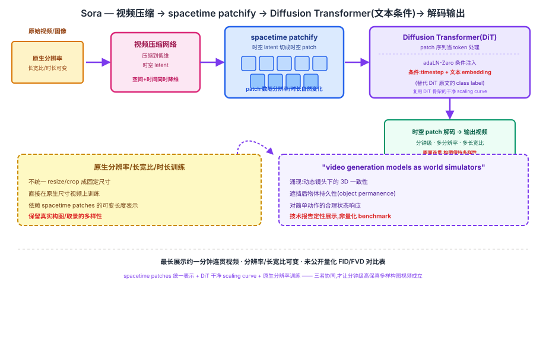

## 前作进展

2022 年 [Video Diffusion Models](02-video-diffusion-models.md) 证明了 diffusion 可以生成视频,但受限于两个没有解决的问题:一是固定长度的采样窗口——VDM 训练/采样时只能生成十几帧量级的短片段,更长的视频要靠自回归扩展外加 reconstruction guidance 拼接,模型本身并不直接支持任意时长的原生生成;此前包括 VDM 在内的多数视频生成工作,数据预处理上也普遍把视频统一裁剪/缩放成固定分辨率和长宽比,模型看不到真实世界视频天然的长宽比和时长分布。二是骨干仍然是 U-Net 及其时空分解卷积变体,而 U-Net 在 diffusion 上的 scaling curve 不如 Transformer 干净可预测(呼应 [DiT](../10-diffusion/05-dit.md) 节点里"U-Net scaling 不如 Transformer 可预测"的论点)。

2022 年底的 [DiT](../10-diffusion/05-dit.md) 已经在图像 diffusion 上验证了:把 U-Net 换成 Transformer + patchify + adaLN-Zero,FLOPs 越大 FID 越低单调成立,拥有干净的 log-log scaling curve。剩下的问题是——**这套骨架能不能规模化到视频,并且直接在原生分辨率/长宽比/时长的数据上训练,而不是强行统一成固定尺寸**?OpenAI 在 2024 年 2 月发布的 Sora 技术报告《Video generation models as world simulators》给出了答案。

## 核心思想:把视频统一表示成 spacetime patches,喂给 DiT

### 直觉

Sora 的核心洞察是:先把视频压缩到低维时空 latent 空间,然后**不再强行 resize/crop 成固定分辨率**,而是把原生分辨率、原生长宽比、原生时长的视频统一表示成"spacetime patches"序列——这一步和 [ViT](../08-vit/01-vit.md)/[DiT](../10-diffusion/05-dit.md) 把图像切成 patch 当 token 的思路一脉相承,只是这里把时空 latent(而不是单帧图像 latent)切成时空 patch 当 token。不同分辨率、不同时长的视频对应不同数量的 patch,但都能统一喂进同一个 Transformer 序列模型,不需要在数据预处理阶段就牺牲原始画面的构图信息。

这个思路把"视频生成"重新表述成一个和语言模型高度类似的问题:LLM 把文本切成 token 序列、用 Transformer 自回归建模;Sora 把视频压缩成时空 patch 序列、用 diffusion Transformer(DiT)去噪建模。两者共享同一套"可变长度 token 序列 + Transformer scaling"的工程范式。

### 两个必须同时跨过的坎

1. **能不能把不同分辨率/长宽比/时长的视频统一表示成同一种序列形式,喂进同一个 Transformer,而不需要为每种尺寸单独设计网络?**——需要一个视频压缩网络 + spacetime patchify 的组合。
2. **DiT 这套在图像上验证过的骨架,能不能直接规模化到视频这种数据量、计算量都高一个量级的任务上,同时保持画质和连贯性?**——需要把 DiT 的 patchify + adaLN-Zero 条件注入范式原样迁移,条件从 class label 换成文本 embedding。

→ 两个机制协同,才第一次让"分钟级、多分辨率、多时长连贯视频"作为一个单一模型的能力成立,见图 1 的视频压缩 → spacetime patchify → DiT 处理全景。



## 机制一:视频压缩网络 + spacetime patches

Sora 首先用一个**视频压缩网络**把原始视频(以及图像,当作单帧视频处理)压缩到一个低维的时空 latent 空间——这一步在角色上类似 [LDM](../10-diffusion/02-ldm.md)/[DiT](../10-diffusion/05-dit.md) 里的 VAE encoder,只是压缩的对象从单张图像变成了整段视频的时空张量,同时在空间和时间两个维度上降维。

压缩到 latent 空间之后,Sora 把这个时空 latent 切分成一系列 **spacetime patches**——每个 patch 覆盖 latent 空间里的一小块时空区域(而不只是单帧内的一小块空间区域)。patch 的数量随输入视频的原生分辨率、长宽比、时长自然变化:分辨率越高、时长越长,patch 序列越长;不需要把所有视频都 resize/crop 成统一尺寸再切 patch。这一步是 Sora 能够"原生支持不同分辨率/长宽比/时长"的直接来源——patch 化本身就是一种可变长度的表示,长度随输入尺寸自然伸缩,和 [DiT](../10-diffusion/05-dit.md) 里 patch 数量 `T = (32/p)²` 随 latent 尺寸变化的逻辑相同,只是这里额外多了一个时间轴。

## 机制二:Diffusion Transformer 主干规模化到视频

拿到 spacetime patch 序列之后,Sora 用一个 **diffusion Transformer**(DiT)处理这些 patch——patch 序列被当作 token 序列送进 Transformer,复用 [DiT](../10-diffusion/05-dit.md) 的 patchify + adaLN-Zero 条件注入范式:每个 Transformer block 里用条件 embedding 调节 LayerNorm 的 scale/shift 和残差路径的 gate,只是条件信号从 DiT 原文的 class label 换成了**文本 embedding**(以及 timestep)——这样模型在去噪每一步时,既知道当前的噪声强度,也知道用户输入的文本描述指向什么样的画面内容。技术报告还提到用类似 DALL·E 3 的**重新配字幕**(recaptioning)技术,给训练视频生成更详细、更贴合画面内容的文本描述,以提升文本条件的可控性。

DiT 骨架的干净 scaling curve 是 Sora 敢于把模型和数据规模都推到远超此前视频 diffusion 工作的关键前提——如果没有 [DiT](../10-diffusion/05-dit.md) 已经验证过的"FLOPs 越大 FID 越低单调成立",OpenAI 很难有把握把训练算力投入到这个量级。

## 机制三:原生分辨率/长宽比/时长训练

Sora 直接在**原生分辨率、原生长宽比、原生时长**的视频上训练,而不是像此前大多数视频生成工作那样,先把所有训练数据统一 resize/crop 成固定尺寸(比如统一裁成正方形)。技术报告展示了对比:在统一裁剪到正方形的数据上训练出的模型,生成画面的取景和构图经常被裁剪逻辑带偏(比如画面主体总是被强行居中);而在原生长宽比数据上训练出的模型,能更好地保持画面构图和取景的多样性,更贴近真实世界视频的分布。

这个设计选择直接依赖机制一——只有 spacetime patches 这种可变长度表示能够自然容纳不同尺寸的输入,原生分辨率训练才有可行的实现路径;如果模型输入必须是固定尺寸的张量,原生分辨率训练根本无从谈起。

## 三件套协同 —— 为什么三者缺一不可

> **spacetime patches 统一表示让任意分辨率/时长的视频都能进 Transformer + DiT 主干提供干净的 scaling curve + 原生分辨率训练保留真实视频分布的多样性**——三者共同让 Sora 能生成分钟级、高保真、多样构图的视频。

- 只有 **spacetime patches**:不同尺寸的视频都能统一表示了,但如果背后的骨干还是 scaling 不干净的 U-Net,模型规模化到分钟级、高分辨率所需的算力投入就缺乏"越大越好"的实证支撑,团队没有信心把训练成本推到这个量级。
- 只有 **DiT 主干**:scaling curve 有保证,但如果输入仍然要求固定分辨率/时长,模型就只能在裁剪、resize 过的数据上训练,画面构图会被裁剪逻辑污染,也无法直接生成任意长宽比/时长的视频。
- 只有**原生分辨率训练**:训练数据分布保留了真实多样性,但如果没有 spacetime patches 这种可变长度表示,原生尺寸的视频根本无法统一送进同一个网络;如果没有 DiT 的 scaling 能力,模型也撑不起原生分辨率训练所需的更大计算量和更长序列。

三者组合后,Sora 第一次证明:**同一个模型可以在保持画质和文本一致性的前提下,生成长达一分钟、分辨率与长宽比可变、内容连贯的视频**——这是它相对于 [Video Diffusion Models](02-video-diffusion-models.md) 最核心的跃迁。

## 关键代码

spacetime patchify 的简化伪代码(参考 [DiT](../10-diffusion/05-dit.md) 节点"关键代码"段的 patchify 实现风格,这里把 2D patchify 扩展到时空维度;基于公开技术报告描述的思路,不追求完整可运行,真实实现细节 OpenAI 未公开):

```python
import torch
import torch.nn as nn


class SpacetimePatchify(nn.Module):
    """把压缩后的时空 latent 切分成 spacetime patch 序列,
    patch 数量随输入的时长/高/宽自然变化,不需要 resize 到固定尺寸"""
    def __init__(self, in_channels, d_model,
                 patch_t=1, patch_h=2, patch_w=2):
        super().__init__()
        # 3D 卷积一步完成"切块 + 投影到 d_model 维",
        # kernel/stride 都等于 patch 尺寸,等价于不重叠地切块再线性投影
        self.proj = nn.Conv3d(
            in_channels, d_model,
            kernel_size=(patch_t, patch_h, patch_w),
            stride=(patch_t, patch_h, patch_w),
        )

    def forward(self, latent):
        # latent: [B, C, T, H, W],T/H/W 随视频原生时长/分辨率变化
        x = self.proj(latent)                    # [B, d_model, T', H', W']
        b, d, t, h, w = x.shape
        x = x.flatten(2).transpose(1, 2)          # [B, T'*H'*W', d_model]
        return x                                   # 变长 spacetime token 序列


class SoraDiT(nn.Module):
    """DiT 主干处理 spacetime patch 序列,条件从 class label 换成文本 embedding"""
    def __init__(self, in_channels, d_model, depth, num_heads):
        super().__init__()
        self.patchify = SpacetimePatchify(in_channels, d_model)
        # 复用 DiT 的 adaLN-Zero conditioned block(见 ../10-diffusion/05-dit.md)
        self.blocks = nn.ModuleList([
            DiTBlock(d_model, num_heads) for _ in range(depth)
        ])
        self.final_norm = nn.LayerNorm(d_model, elementwise_affine=False)
        self.unpatchify_proj = nn.Linear(d_model, in_channels)  # 简化,省略逆卷积细节

    def forward(self, latent, t_embed, text_embed):
        x = self.patchify(latent)                 # 变长 spacetime token 序列
        c = t_embed + text_embed                  # 条件:timestep + 文本(而非 class label)
        for block in self.blocks:
            x = block(x, c)                        # adaLN-Zero 注入条件,同 DiT
        x = self.final_norm(x)
        return self.unpatchify_proj(x)             # 还原回时空 latent 形状(此处简化)
```

真实实现里,视频压缩网络的具体结构(编码/解码、时间维降维比例)、spacetime patch 的具体切分粒度、以及如何把不同时长/分辨率的 patch 序列打包成同一批次训练(bucketing/padding 策略),OpenAI 的技术报告均未公开细节,以上代码仅按报告描述的思路做结构性示意。

## 性能数据

> Sora 是一份技术报告而非同行评审论文,没有公开标准的 FID/FVD 等量化 benchmark 对比表,以下改写为报告展示的定性能力清单。以下内容基于训练知识回忆,本次任务执行时 WebSearch 工具报错不可用,未经实时联网核实,具体表述请在引用前对照原始报告 openai.com/research/video-generation-models-as-world-simulators 核实。

- **生成时长**:技术报告展示的样例视频最长达到**一分钟**量级,且报告强调生成的长视频能保持角色/场景的一致性,不是靠简单拼接短片段实现的。
- **分辨率与长宽比灵活性**:报告展示模型可以直接生成不同分辨率、不同长宽比(宽屏、竖屏、正方形等)的视频,并将这一能力归因于原生分辨率/长宽比训练(而非训练后再做后处理裁剪)。
- **涌现的 3D 一致性**:报告展示了动态镜头运动的样例——当摄像机在场景中平移或旋转时,人物和物体在画面中的相对位置随之保持三维空间上的一致运动,报告将其列为模型未被显式监督、而是从数据规模中"涌现"出的能力。
- **长程连贯性与物体持久性(object permanence)**:报告展示了物体或人物被短暂遮挡后重新出现时依然保持一致外观的样例,以及视频中途状态转变(如时间流逝、材质变化)相对连贯的案例。
- **对世界的简单交互模拟**:报告展示了模型对简单动作会产生合理状态变化的样例(如画笔在画布上留下笔触后笔触持续存在),以及模型在类似 Minecraft 的场景里同时渲染玩家视角和响应基础操作的演示,报告将这类展示作为"video generation models as world simulators"这一命题的定性佐证。
- **已知局限**:报告本身也列出了模型在物理规律建模上的不足(如玻璃破碎等物理交互经常不准确)、可能出现物体凭空出现/消失、长时间/多主体场景中偶尔出现的空间关系混乱等问题——这些是报告主动披露的局限,不是外部评测发现的。

## 影响 / 后续

Sora 的发布直接催生了"video generation as world simulator"这一研究方向的爆发式关注——把视频生成模型不再仅仅当作"内容创作工具",而是当作**隐式学到物理世界规律的模拟器**来看待和评估。这个叙事框架下,后续工作沿着两个方向推进:一是继续把这类模型做得更逼真、更长、更可控;二是让这类模型从"只能生成、不能交互"变成"可以像游戏引擎一样被实时操控"——这正是同年 Genie 和 GameNGen 的出发点。

→ [../10-diffusion/05-dit.md](../10-diffusion/05-dit.md) · Sora 复用的 DiT 主干架构
→ [../07-gpt-scaling/04-scaling-laws.md](../07-gpt-scaling/04-scaling-laws.md) · scaling 叙事在视频生成上的再次印证
→ [05-genie.md](05-genie.md) · 从"生成视频"到"生成可交互环境"
