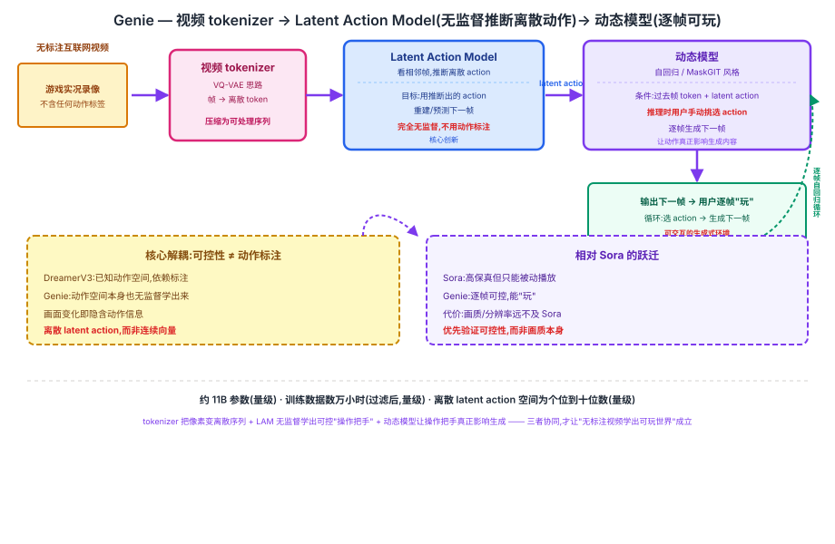

## 前作进展

同样是 2024 年,[Sora](04-sora.md) 用 spacetime patches + DiT 证明了视频生成模型可以生成分钟级、高保真、时空一致的视频,报告甚至提出"video generation models are world simulators"的定位。但 Sora 生成的视频从头到尾是**被动播放**的——用户只能给一段文本提示,看模型把整段视频吐出来,不能在生成过程中随时插入一个"动作"去改变接下来发生什么,更谈不上像玩游戏一样逐帧操控画面走向。

另一边,RL 决策脉络里的 [DreamerV3](03-dreamerv3.md) 已经证明:一个用离散分类隐状态表示环境动态的世界模型(RSSM),配合 actor-critic 在想象轨迹里训练,可以固定同一套超参数打通 Atari、DeepMind Control、Minecraft 等 150+ 个任务。但 DreamerV3 的 RSSM 训练全程依赖真实环境交互返回的**已知动作**——无论是 Atari 的按键、DMC 的连续控制量,还是 Minecraft 的操作指令,训练数据里每一步都明确标注了"智能体执行了哪个动作"。这套框架完全没有回答:如果只有海量无标注的互联网视频、连一个动作标签都没有,还能不能学出一个"可控制"的世界模型?

这正是两条脉络各自卡住的地方——Sora 有生成质量但没有可控性,DreamerV3 有可控性但依赖动作标注——留下一个中间地带没人填上:**能不能从无标注视频里,无监督地学出一个可以被逐帧操控的生成式环境?** DeepMind 2024 年 2 月发布的 Genie(Generative Interactive Environments)给出了答案。

## 核心思想:把"学可控世界模型"和"需要动作标注"解耦

### 直觉

Genie 的核心洞察是:即便一段视频里没有任何显式的动作标注,只要画面里"某个东西的状态在连续帧之间发生了变化",这个变化本身就蕴含着一个隐式的"动作"信息——是什么样的操作,让上一帧变成了下一帧?如果能训练一个模型,专门从相邻两帧的差异里反推出这个隐式操作,并且强迫这个操作空间足够小、足够离散,那么这个模型学到的就不再是"随便编一个能解释画面变化的东西",而更接近于视频背后**真实存在但没被标注出来**的动作结构(比如角色向左走、向右走、跳跃)。

这样一来,"学一个可控制的世界模型"就不再需要依赖人工标注的动作数据集——只要视频里的画面变化足够丰富(比如游戏实况录像里角色不断做出各种操作),模型就能完全自监督地学出一个可以拿来"玩"的离散动作空间,再学一个动态模型把这些动作接入到"预测下一帧"的生成过程里。这和 DreamerV3 依赖已标注动作空间的思路是互补的:DreamerV3 解决的是"已知动作空间下如何高效训练策略",Genie 解决的是"动作空间本身都不知道,能不能先把它学出来"。

### 两个必须同时跨过的坎

1. **能不能把原始视频压缩成一种既保留画面细节、又方便后续建模的序列表示?**——需要一个视频 tokenizer,把连续像素流转成离散/低维 token 序列。
2. **能不能在完全没有动作标注的前提下,从相邻帧的变化里无监督地反推出一个小而离散的"动作"集合,并且这个集合要真正能被后续的动态模型用来控制生成内容?**——需要一个 Latent Action Model(LAM),这是 Genie 的核心创新。

→ 两个机制协同,再加上一个把 latent action 接入生成过程的动态模型,才第一次让"从无标注视频学出可玩的生成式环境"成立,见图 1 的 tokenizer → LAM → 动态模型全景。



## 机制一:视频 tokenizer —— 把原始帧压缩成离散 token 序列

Genie 首先用一个基于 VQ-VAE 思路的视频 tokenizer,把原始视频的每一帧压缩成一组离散视觉 token(把连续像素映射到一个有限大小的离散 codebook 上)。这一步的角色和 [VQ-VAE](../10-diffusion/01-ddpm.md) 系脉络里"把图像压缩成离散 token 再交给自回归模型处理"的思路一致:压缩之后,后续的 LAM 和动态模型都只需要在离散 token 序列上操作,而不用直接处理原始高维像素,这既降低了计算量,也让"自回归预测下一帧"变成一个和语言模型类似的离散序列预测问题。

> 编辑备注:视频 tokenizer 具体采用的是逐帧 VQ-VAE 还是带时间维注意力的时空 tokenizer(论文里称为 ST-transformer 结构),以上表述为方向性描述,具体的编码器结构、codebook 大小等实现细节建议对照原论文 arXiv:2402.15391 核实。

## 机制二:Latent Action Model(LAM)—— 无监督推断离散动作空间

LAM 是 Genie 最核心的创新。它的输入是**相邻两帧**(更准确地说,是过去所有帧加上当前帧到下一帧的整个上下文),输出是一个很小的、**离散**的 latent action——这个动作被限制在一个很小的离散集合里(编辑备注:论文报告的具体动作空间大小建议核实后再引用,方向性数量级是个位数到十位数量级的离散动作,并非成百上千种)。

关键在于训练信号完全**不使用任何人工标注的动作数据**:LAM 的训练目标是自监督的——给定过去帧和 LAM 自己推断出的 latent action,要求能够重建/预测出下一帧的内容。如果 LAM 推断出的这个离散动作确实抓住了"画面接下来会怎么变"的关键信息,那么用它去重建下一帧的效果就会好;反之如果 LAM 学到的动作是无意义的噪声,重建效果就会很差。这个"用推断出的动作重建下一帧"的自监督目标,倒逼 LAM 学出一个真正对画面变化有解释力的离散动作空间——即便训练视频里从来没有人告诉过模型"这一帧到下一帧之间发生了向左移动"。

这一步和 [DreamerV3](03-dreamerv3.md) 的离散 RSSM 隐状态在设计哲学上遥相呼应——两者都选择用**离散分类变量**而不是连续隐变量去表征环境状态/动态,离散表征更适合表示"多选一"的结构化模式(DreamerV3 用离散隐状态让世界模型在跨领域视觉输入上更鲁棒,Genie 用离散 latent action 让"动作"本身可以被枚举、被用户挑选)。但两者的训练信号完全不同:DreamerV3 的离散隐状态是在**有明确动作标注**的 RL 环境交互数据上训练的,Genie 的离散 latent action 则是在**完全没有动作标注**的无标注视频上,靠"预测下一帧"这一个自监督目标反推出来的。

## 机制三:动态模型 —— 给定 latent action 自回归生成下一帧

有了视频 token 序列和 LAM 推断出的离散 latent action 之后,Genie 用一个自回归/MaskGIT 风格的 Transformer 动态模型,把"过去帧的 token + 当前步的 latent action"作为条件,预测下一帧的 token。训练阶段,这个 latent action 来自 LAM 对真实视频的推断;而**推理阶段**,用户可以不再依赖 LAM 从视频里推断动作,而是直接从 LAM 学出的离散动作集合里手动挑选一个动作,喂给动态模型,让动态模型据此生成下一帧——这就是"用户逐帧'玩'生成出来的世界"的实现方式:每一步用户选一个离散动作,动态模型就据此生成对应的下一帧画面,循环往复,构成一个可交互的生成式环境。

## 三件套协同 —— 为什么三者缺一不可

> **视频 tokenizer 把原始像素变成可处理的离散序列 + LAM 无监督学出可控制的"操作把手" + 动态模型让这些操作把手真正能影响生成内容**——三者共同让 Genie 能做到"从无标注视频里学出可玩的游戏"。

- 只有**视频 tokenizer**:视频被压缩成了方便处理的离散序列,但如果没有 LAM,模型至多只能学会"无条件地"预测下一帧长什么样,不存在任何可以被用户操控的接口——生成出来的还是像 Sora 一样被动播放的视频。
- 只有 **LAM**:即便学出了一个自洽的离散 latent action 空间,如果没有一个动态模型把这个动作真正接入到"生成下一帧"的过程里,这个动作空间就只是一个孤立的、无法被用来实际操控画面的表征,不能拿来"玩"。
- 只有**动态模型**:自回归生成下一帧的能力有了,但如果它的条件输入不是 LAM 学出的、真正对画面变化有解释力的 latent action,而是随便某个无意义的向量,那么用户挑选不同的"动作"根本不会让生成结果产生有意义的差异,可控性无从谈起。

三者组合后,Genie 第一次证明:**完全不需要任何人工动作标注,只从海量无标注的互联网视频里,就能学出一个用户可以逐帧操控、生成出连贯画面的"可玩"生成式环境**——这是它相对于 Sora(有生成质量但不可控)和 DreamerV3(可控但依赖已知动作空间)最核心的跃迁。

## 关键代码

LAM 训练目标的简化伪代码(输入相邻帧,推断离散 latent action,用这个 latent action 重建/预测下一帧作为自监督信号;基于论文思路,不追求完整可运行,真实实现的具体网络结构未在此还原):

```python
import torch
import torch.nn as nn
import torch.nn.functional as F


class LatentActionModel(nn.Module):
    """LAM: 完全无监督地从相邻帧推断离散 latent action,
    训练信号只有"能不能用这个 action 重建下一帧",不使用任何人工动作标注"""
    def __init__(self, token_dim, d_model, n_actions=8):
        super().__init__()
        # 编码器:看过去帧 + 下一帧,推断出一个离散 action(训练时才看得到下一帧)
        self.action_encoder = nn.Sequential(
            nn.Linear(token_dim * 2, d_model),
            nn.ReLU(),
            nn.Linear(d_model, n_actions),
        )
        # 解码器:只看过去帧 + 推断出的离散 action,重建下一帧 token
        self.frame_decoder = nn.Sequential(
            nn.Linear(token_dim + n_actions, d_model),
            nn.ReLU(),
            nn.Linear(d_model, token_dim),
        )
        self.n_actions = n_actions

    def infer_action(self, past_tokens, next_tokens):
        # 只在训练时用得到 next_tokens 来推断 action(自监督标签来自视频本身)
        logits = self.action_encoder(torch.cat([past_tokens, next_tokens], dim=-1))
        # straight-through:前向离散 one-hot,反向梯度走 softmax,保证离散动作可学
        action = F.gumbel_softmax(logits, hard=True, dim=-1)
        return action, logits

    def forward(self, past_tokens, next_tokens):
        action, logits = self.infer_action(past_tokens, next_tokens)
        recon = self.frame_decoder(torch.cat([past_tokens, action], dim=-1))
        # 自监督目标:用推断出的 latent action 重建下一帧 token,不需要任何动作标签
        recon_loss = F.mse_loss(recon, next_tokens)
        return recon_loss, action


def dynamics_step(dynamics_model, past_tokens, latent_action):
    """推理阶段:LAM 不再需要"看到"下一帧——
    latent_action 由用户从 LAM 学出的离散集合里手动挑选,动态模型据此生成下一帧"""
    return dynamics_model(past_tokens, latent_action)  # 自回归/MaskGIT 预测下一帧 token
```

真实实现里,视频 tokenizer、LAM 的编解码器、动态模型均为规模远大得多的 Transformer(论文用了 ST-transformer 结构混合空间与时间维的注意力),codebook 大小、latent action 空间的具体大小、以及三者的联合/分阶段训练细节,以上代码均未还原,仅按论文描述的自监督思路做结构性示意。

## 性能数据

> 以下数字基于训练知识回忆,本次任务执行时 WebSearch 工具报错不可用,未经实时联网核实,具体表述请在引用前对照原论文 arXiv:2402.15391(Genie: Generative Interactive Environments)核实。

- **训练数据规模**:论文报告从公开互联网 2D 平台游戏(platformer)实况视频中筛选训练数据,原始视频量级在**数十万小时**,经过质量过滤后用于训练的规模缩减到**数万小时**量级——具体的过滤前/过滤后小时数建议核实后引用。
- **模型参数量**:论文报告的最大模型参数量在**百亿(约 11B)**量级,由视频 tokenizer、LAM、动态模型三部分共同构成——具体拆分到三个子模块各自的参数量建议核实后引用。
- **latent action 空间大小**:论文报告学出的离散 latent action 数量是一个很小的个位数到十位数量级(不是成百上千种),用户在这个小集合里手动挑选动作来操控生成——具体数值建议核实后引用。
- **生成分辨率**:论文展示的生成画面分辨率量级为**几百乘几百像素**这一量级(不是高清),优先验证"可控性"这一能力而非画质本身——具体像素数建议核实后引用。
- **泛化性展示**:论文除了平台游戏视频外,也展示了在其他类型的视频数据(如机器人操作视频)上训练出类似效果的实验,用来说明这套无监督学可控性的框架不局限于游戏这一种数据来源——具体数据集名称建议核实后引用。

## 影响 / 后续

Genie 证明了"从无标注视频里无监督学可控性"这条路径切实可行,把"生成式环境"的训练数据来源从"需要精心设计的、带明确动作标注的 RL 仿真环境"扩展到了"海量、廉价、无标注的互联网视频"——这为后续通用世界模型、具身智能训练数据的自动化生成提供了新思路:如果连动作标注都可以从视频里无监督学出来,那么用视频这种最容易大规模获取的数据来源训练可交互的世界模型,就不再需要昂贵的人工标注或者受限于已有仿真器的动作空间。

→ [03-dreamerv3.md](03-dreamerv3.md) · 离散隐变量表征思路的呼应
→ [06-gamengen.md](06-gamengen.md) · 同样是"生成可交互环境",GameNGen 走的是有监督/RL 数据路线而非无监督
