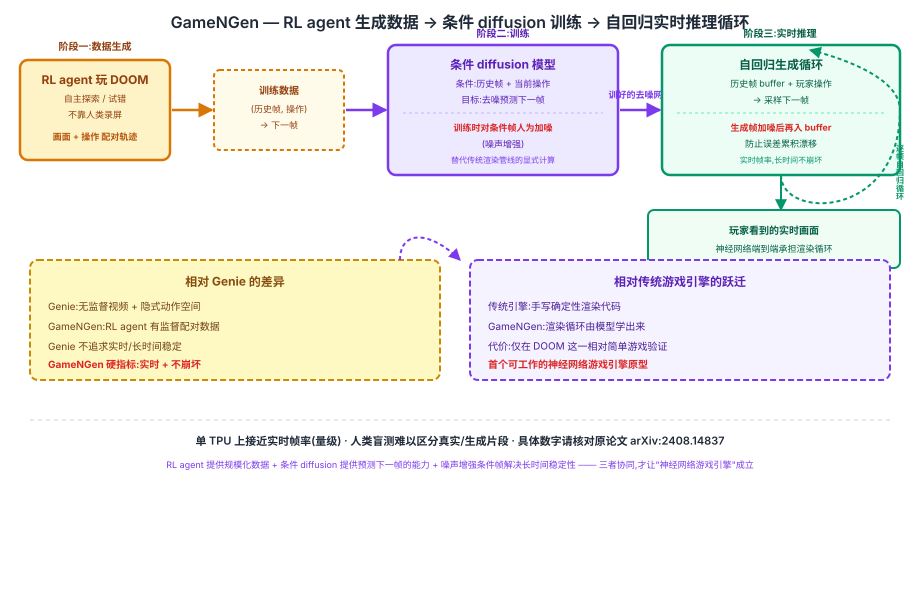

## 前作进展

同样是 2024 年,[Genie](05-genie.md) 证明了一件很反直觉的事:从海量无标注互联网视频里,无监督地也能学出一个逐帧可控制的生成式环境——不需要任何人工动作标注,靠 Latent Action Model 自监督地反推出隐式动作空间。但 Genie 论文的重点始终是"可控性"这一个能力本身能不能学出来:生成画面的分辨率停留在几百乘几百像素这一量级,论文也没有把"实时帧率下的流畅交互体验"作为核心指标去优化和报告。

另一边,像 DOOM 这样的传统游戏引擎,渲染循环是完全由工程师手工编写的确定性程序——给定游戏状态和玩家输入,用显式的规则(碰撞检测、光栅化、粒子系统等)算出下一帧画面,每一行逻辑都是人写的,不存在任何"学习"的成分。

这就留下一个 Genie 没有正面回答、传统游戏引擎也从未尝试过的问题:**如果不追求"从无标注视频里无监督学",而是换成有监督地收集"游戏画面 + 对应操作"的配对数据,一个神经网络能不能学到"实时、长时间稳定"地渲染出可玩画面,直接顶替掉手写的游戏引擎渲染循环?** Google Research 2024 年 8 月发布的 GameNGen(Diffusion Models Are Real-Time Game Engines)给出了肯定的答案,并且选了一个足够复杂、足够经典的测试床——DOOM。

## 核心思想:游戏引擎的渲染循环,本质上是一个"预测下一帧"的函数

### 直觉

GameNGen 的核心洞察是:传统游戏引擎的渲染循环在做的事情,拆开来看其实就是一个函数——输入是"当前及历史的游戏画面状态 + 玩家刚刚执行的操作",输出是"下一帧应该长什么样"。这个函数传统上由引擎代码显式计算,但它本质上是一个确定性(或近似确定性)的映射关系。如果能收集到足够多、足够多样的"历史帧 + 操作 → 下一帧"配对数据,一个 diffusion 模型完全可以把这个映射关系学出来,用"条件生成"代替"显式计算"。

进一步的关键判断是:如果这个学出来的预测模型足够快(能做到实时帧率)、足够准(长时间连续预测下去画面不会崩坏、不会漂移成噪声),那么它本身就可以在交互循环里原地替换掉传统游戏引擎的渲染步骤——玩家感知不到背后是显式代码还是神经网络在算下一帧。这比 Genie 的设定更进一步:不满足于"能不能学出可控性",而是直接对标传统游戏引擎的实际使用体验,把"实时"和"长时间不崩坏"当作必须跨过的硬指标。

### 两个必须同时跨过的坎

1. **训练数据从哪来?**——不像 Genie 可以用互联网上现成的无标注视频,GameNGen 需要的是"游戏画面 + 精确对应的操作"这种强配对数据,而且要覆盖足够多样的游戏状态,人类录制成本高、覆盖面也有限。
2. **模型自己生成的画面能不能长时间稳定运行,而不是越玩越花?**——diffusion 模型在推理时是自回归地把自己刚生成的帧当作下一步预测的条件输入,如果生成误差随着帧数累积放大,画面会在几十帧、几百帧之后就明显崩坏,这样即便单帧质量再高也无法支撑"可玩"这个目标。

→ 两个机制协同,再加上一个针对第二个坎专门设计的训练技巧,才第一次让"diffusion 模型实时渲染出可玩游戏"这件事成立,见图 1 的 RL agent 生成数据 → 条件 diffusion 训练 → 自回归推理循环全景。



## 机制一:RL agent 自动生成训练数据 —— 不靠人类录屏

GameNGen 没有找人类玩家去录制"画面 + 操作"数据,而是先训练一个强化学习智能体去玩 DOOM,让它在游戏里自主探索、反复试错,自动积累大量"当前画面 + 执行的操作 + 下一帧画面"的轨迹数据。这个 RL agent 本身玩得好不好、通不通关不是重点,重点是它能够以极低成本、大规模地覆盖游戏里各种各样的场景状态(不同房间、不同战斗情况、不同操作组合),这比依赖人类录屏更容易规模化,也更容易保证数据的多样性覆盖。

## 机制二:条件 diffusion 模型预测下一帧 —— 替代渲染步骤本身

有了"历史帧 + 操作 → 下一帧"的配对数据后,GameNGen 训练一个条件 diffusion 模型:以过去若干帧游戏画面加上玩家当前执行的操作作为条件,去噪生成下一帧画面。推理时,这个"给定条件生成下一帧"的过程直接替代了传统游戏引擎里"读取游戏状态、执行渲染管线、输出一帧画面"这一整套显式计算步骤——从玩家的视角看,按下某个按键之后画面照样实时更新,只是背后算这一帧的不再是手写的渲染代码,而是一次 diffusion 去噪过程。

## 机制三:噪声增强条件帧 —— 对抗自回归漂移的核心工程细节

这是 GameNGen 论文里最关键的工程细节。推理阶段,diffusion 模型是自回归运行的:每一步生成出的下一帧,会被当作条件的一部分,喂给模型去预测再下一帧,如此循环往复。如果直接把模型自己生成的历史帧原样作为条件输入,模型生成时产生的微小误差会在这个自回归循环里逐帧累积、被不断放大——玩得越久,画面偏离真实分布越远,最终表现为画面质量断崖式下跌(自回归漂移,这也是自回归视频/序列生成模型的通病)。

GameNGen 的解法是在训练阶段就对作为条件输入的历史帧人为加入噪声增强:让模型在训练时就见过"条件帧本身带有噪声、不完美"的情况,并学会在这种不完美条件下依然生成合理的下一帧。这相当于训练时主动模拟了推理阶段会出现的误差累积效应,倒逼模型对这种噪声更鲁棒。正是这个技巧,支撑起了模型能够长时间连续生成而不崩坏的能力。

> 编辑备注:论文里对噪声增强条件帧的具体实现方式(如噪声调度、加噪强度如何随训练迭代调整)有更详细的消融实验和设计取舍,以上表述为方向性描述,具体细节建议对照原论文 arXiv:2408.14837(Diffusion Models Are Real-Time Game Engines)核实。

## 三件套协同 —— 为什么三者缺一不可

> **RL agent 提供规模化的训练数据 + 条件 diffusion 提供"预测下一帧"的生成能力 + 噪声增强条件帧解决长时间运行的稳定性**——三者共同实现了"实时可玩、长时间不崩坏"的神经网络游戏引擎。

- 只有 **RL agent 生成数据**:能拿到大量"画面+操作"配对数据,但如果没有一个能从这些数据里学出"预测下一帧"能力的生成模型,数据本身只是一堆静态的轨迹记录,不能变成可以实时响应玩家操作的引擎。
- 只有**条件 diffusion 模型**:有了从条件生成下一帧的能力,但如果没有 RL agent 提供的大规模、覆盖面广的训练数据,模型见过的游戏状态太有限,训出来的模型只能在训练数据分布内的场景表现尚可,稍微偏离就容易失真。
- 只有**噪声增强条件帧**这一个技巧,而没有前两者:这个技巧本身只是一个训练时的正则化手段,如果底层没有条件 diffusion 这个生成框架、没有 RL agent 提供的数据规模,这个技巧无所依附,单独存在没有意义。

三者组合后,GameNGen 第一次证明:**一个完全由神经网络构成的系统,可以在实时帧率下、长时间连续运行不崩坏的前提下,让玩家像玩真实游戏一样操控生成出来的画面**——这是它相对于 Genie(证明了可控性,但不追求实时/长时间稳定)和传统游戏引擎(实时稳定,但完全手写、不是学出来的)最核心的跃迁。

## 关键代码

推理阶段条件 diffusion 自回归采样循环的简化伪代码(输入历史帧 buffer + 当前动作,输出下一帧,更新 buffer;基于论文思路,不追求完整可运行,真实的去噪网络结构、条件注入方式未在此还原,参照 [DDPM](../10-diffusion/01-ddpm.md) 的去噪采样过程):

```python
import torch


class GameNGenDynamics:
    """条件 diffusion 模型:给定历史帧 buffer + 当前动作,去噪采样出下一帧,
    替代传统游戏引擎里"读取状态 → 执行渲染管线 → 输出一帧"的显式计算步骤"""

    def __init__(self, denoiser, context_frames=4, noise_augment_std=0.1):
        self.denoiser = denoiser  # 条件 diffusion 去噪网络
        self.context_frames = context_frames
        # 训练时对历史条件帧加的噪声强度,推理时同样施加以匹配训练分布
        self.noise_augment_std = noise_augment_std

    def augment_condition_frames(self, frame_buffer):
        """核心工程细节:对作为条件的历史帧人为加噪,
        防止自回归推理时误差被逐帧累积放大(自回归漂移)"""
        noise = torch.randn_like(frame_buffer) * self.noise_augment_std
        return frame_buffer + noise

    @torch.no_grad()
    def predict_next_frame(self, frame_buffer, action):
        """给定历史帧 buffer(最近 context_frames 帧)+ 当前动作,
        去噪采样出下一帧——这一步就是"渲染循环"本身"""
        condition = self.augment_condition_frames(frame_buffer)
        x_t = torch.randn_like(frame_buffer[-1])  # 从纯噪声开始
        for t in reversed(range(self.denoiser.num_steps)):
            x_t = self.denoiser.denoise_step(x_t, condition, action, t)
        return x_t  # 生成的下一帧

    def play_loop(self, initial_frames, action_stream):
        """交互主循环:玩家每给一个操作,生成一帧,更新 buffer,循环往复"""
        frame_buffer = initial_frames[-self.context_frames:]
        for action in action_stream:
            next_frame = self.predict_next_frame(frame_buffer, action)
            frame_buffer = frame_buffer[1:] + [next_frame]  # 滑动窗口更新
            yield next_frame  # 实时输出给玩家看到的画面
```

真实实现里,RL agent 收集数据的规模、条件 diffusion 模型的具体网络结构(论文基于 Stable Diffusion 类架构做条件化改造)、去噪步数与实时性之间的具体权衡,以上代码均未还原,仅按论文描述的自回归条件生成思路做结构性示意。

## 性能数据

> 以下数字基于训练知识回忆,本次任务执行时 WebSearch 工具报错不可用,未经实时联网核实,具体表述请在引用前对照原论文 arXiv:2408.14837(Diffusion Models Are Real-Time Game Engines)核实。

- **帧率**:论文报告在单块 TPU 上能达到**实时或接近实时的帧率**(方向性描述为个位数十量级的 FPS,是否稳定达到传统游戏常见的 30/60 FPS 水准建议核实后再引用)。
- **硬件**:论文报告的推理硬件为 **TPU**(具体型号建议核实后再引用,不确定是否为某一代 TPU v5 系列)。
- **连续运行/可玩时长**:论文报告模型能在**较长的连续交互时长**内维持画面质量不明显崩坏、"看起来可玩"(具体报告的分钟数或步数建议核实后再引用)。
- **人类评估**:论文用了短片段的人类盲测,报告参与者在区分"真实 DOOM 录像片段"和"模型生成片段"时接近随机猜测的准确率,以此说明生成画面的以假乱真程度(具体的准确率数字建议核实后再引用)。
- **训练数据规模**:RL agent 自动生成的训练轨迹规模量级为大规模自动化收集(具体小时数/帧数建议核实后再引用)。

## 影响 / 后续

GameNGen 是"diffusion 模型完全替代游戏引擎"这一设想的第一个可工作原型——它没有止步于"证明生成模型能模仿游戏画面",而是把"实时"和"长时间不崩坏"这两个游戏引擎的硬指标真正跑通了一遍,即便测试床(DOOM)在今天的游戏工业标准里已经是一个相对简单、玩法机制固定的老游戏。这篇论文留下的开放问题是:这套思路能不能规模化到更复杂的现代 3A 游戏(更高分辨率、更复杂的物理与光照、更庞大的状态空间)?"神经网络渲染"会不会像"神经网络生成图像/视频"一样,逐渐从一个实验室原型演变成一个独立的技术方向,反过来影响游戏引擎工业本身的设计?

→ [05-genie.md](05-genie.md) · 都是"生成可交互环境",本文换成了有监督 RL 轨迹数据而非无监督视频学习
→ [01-world-models.md](01-world-models.md) · 呼应本家族开篇"在学到的世界模型里训练/运行"这一命题的最新形态
