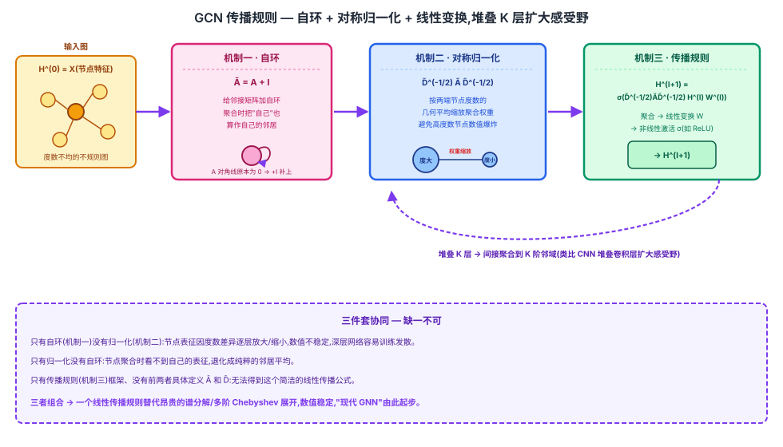

## 前作进展

2016 年之前,图上的深度学习主要有两条路,但都没能真正跑起来:

- **谱方法(spectral methods)**:把图信号变换到图拉普拉斯矩阵的特征空间做"卷积"。最直接的做法需要显式对图拉普拉斯做特征分解,计算量随节点数 $N$ 三次方增长($O(N^3)$),完全无法扩展到几千、几万节点的图。Defferrard et al. 2016 提出的 **ChebNet** 用 $K$ 阶 Chebyshev 多项式近似图拉普拉斯的谱滤波器,避免了显式特征分解,但仍然需要聚合 $K$ 阶邻域内的信息,参数量和计算量都随 $K$ 增大而上升。
- **非谱方法**:如更早的 **Graph Neural Network**(Scarselli et al. 2009),用递归神经网络反复在图上传播节点状态直到收敛。这类方法不依赖谱分解,但训练不稳定、收敛慢,也难以扩展到大图。

GCN 的洞察是:如果只保留 ChebNet 多项式近似里**最低阶的一项**(把 $K$ 直接设成 1),整个谱图卷积就能简化成一个极其简单的一阶邻域聚合规则——不再需要多阶 Chebyshev 展开,也不再需要任何显式的谱分解。

## 核心思想 + 直觉

GCN 的核心洞察是:**只保留 Chebyshev 多项式近似的一阶项(K=1),谱图卷积就退化成一个线性传播规则**——每个节点的新表征,等于自己和直接邻居表征的一个加权平均(权重由节点度数决定),再过一次线性变换和非线性激活。

这个简化牺牲了"单层直接看到多阶邻居"的能力,但换来了极大的计算和实现效率——不再需要显式构造 Chebyshev 多项式基,也不需要谱分解,整个操作就是几次稀疏矩阵乘法。感受野的扩大不再靠单层内部的多阶展开,而是像 CNN 堆叠卷积层扩大感受野一样,**堆叠多层 GCN**:每层只看一阶邻居,堆 $K$ 层就能间接聚合到 $K$ 阶邻域的信息。

## 机制一:重整化技巧(Ã = A + I)

直接用邻接矩阵 $A$ 做聚合有一个明显缺陷:$A$ 的对角线是 0,节点在聚合邻居信息时完全没有把自己的表征算进去——每一层节点会"忘记自己是谁",只剩邻居的信息。

GCN 的解法很直接:给邻接矩阵加上自环,$\tilde{A} = A + I$($I$ 是单位矩阵)。这样每个节点在聚合时,"自己"也被当作自己的一个邻居参与加权平均,信息不会在逐层传播中丢失。

## 机制二:对称归一化(D̃^(-1/2) Ã D̃^(-1/2))

加了自环之后,如果直接用 $\tilde{A}$ 做聚合(相当于对邻居表征求和而非平均),度数大的节点(邻居多)聚合出的表征数值会被系统性放大,度数小的节点则相对被压制——多层堆叠后这种放大/压制会被指数级放大,导致训练数值不稳定。

GCN 用节点的度数矩阵 $\tilde{D}$($\tilde{D}$ 的对角线是 $\tilde{A}$ 每行的和,即每个节点算上自环后的度数)做**对称归一化**:$\tilde{D}^{-1/2} \tilde{A} \tilde{D}^{-1/2}$。直观理解是,每条边的聚合权重不再是简单的 1,而是按两端节点度数的几何平均做缩放——度数悬殊的节点对之间聚合权重被压小,让整个聚合矩阵在数值上保持稳定,不会因为图里节点度数分布差异悬殊(现实图里常见的幂律分布,少数节点度数极高)而导致某些节点表征爆炸或消失。

## 机制三:逐层传播规则

把前两个机制组合成一个逐层传播公式:

$$
H^{(l+1)} = \sigma\left(\tilde{D}^{-1/2} \tilde{A} \tilde{D}^{-1/2} H^{(l)} W^{(l)}\right)
$$

其中 $H^{(l)}$ 是第 $l$ 层所有节点的表征矩阵(第 0 层 $H^{(0)} = X$ 就是节点的原始特征),$W^{(l)}$ 是这一层的可学习权重矩阵,$\sigma$ 是非线性激活(如 ReLU)。每一层做一次"聚合(左乘归一化邻接矩阵)+ 线性变换(右乘 $W^{(l)}$)+ 非线性激活"。堆叠 $K$ 层就实现了 $K$ 阶邻域信息的间接传播,整个网络可以端到端用反向传播训练。

在半监督节点分类任务上,图里只有一小部分节点有标签,loss 只在这些有标签节点上计算,但梯度会通过 $\tilde{D}^{-1/2} \tilde{A} \tilde{D}^{-1/2}$ 这个共享的图结构传播到所有节点的表征上——这正是"半监督"的含义:没有标签的节点也能借助图结构和有标签节点的监督信号一起被训练。



## 三件套协同

三个机制缺一不可,组合起来才是 GCN 那个广为人知的传播规则:

- 只有**自环**(机制一)没有**归一化**(机制二):节点表征会因为度数差异被逐层放大或缩小,数值不稳定,深层网络容易训练发散。
- 只有**归一化**没有**自环**:节点在聚合时完全看不到自己上一层的表征,退化成纯粹的邻居平均,丢失了"自身状态"这个信息通道。
- 只有**传播规则**(机制三)这个框架,没有前两者具体定义 $\tilde{A}$ 和 $\tilde{D}$:无法得到这个简洁的线性传播公式,退化回需要更复杂 Chebyshev 展开的谱图卷积。

三者组合后,GCN 用一个极简的线性传播规则替代了此前谱方法昂贵的特征分解或多阶多项式展开,同时保持了数值稳定性——这是"现代 GNN"这个范式真正跑起来的起点。

## 关键代码

一个 GCN 层的简化 PyTorch 伪代码(邻接矩阵归一化 + 线性变换 + 激活,不追求完整可运行):

```python
import torch
import torch.nn as nn


def normalize_adj(adj):
    """Ã = A + I,再做对称归一化 D̃^(-1/2) Ã D̃^(-1/2)"""
    adj_tilde = adj + torch.eye(adj.size(0))          # 机制一:加自环
    deg = adj_tilde.sum(dim=1)                          # 每个节点的度数(含自环)
    deg_inv_sqrt = deg.pow(-0.5)
    deg_inv_sqrt[torch.isinf(deg_inv_sqrt)] = 0.0
    D_inv_sqrt = torch.diag(deg_inv_sqrt)
    return D_inv_sqrt @ adj_tilde @ D_inv_sqrt           # 机制二:对称归一化


class GCNLayer(nn.Module):
    def __init__(self, in_dim, out_dim):
        super().__init__()
        self.linear = nn.Linear(in_dim, out_dim, bias=False)

    def forward(self, H, adj_norm):
        # 机制三:聚合(左乘归一化邻接矩阵)+ 线性变换 + 激活
        agg = adj_norm @ H            # 聚合自己 + 邻居的上一层表征
        return torch.relu(self.linear(agg))


class GCN(nn.Module):
    def __init__(self, in_dim, hidden_dim, num_classes, num_layers=2):
        super().__init__()
        dims = [in_dim] + [hidden_dim] * (num_layers - 1) + [num_classes]
        self.layers = nn.ModuleList([
            GCNLayer(dims[i], dims[i + 1]) for i in range(num_layers)
        ])

    def forward(self, X, adj):
        adj_norm = normalize_adj(adj)
        H = X
        for layer in self.layers:
            H = layer(H, adj_norm)   # 堆叠多层,间接扩大感受野到多阶邻域
        return H
```

真实实现里,`adj_norm` 通常预先计算好并存成稀疏矩阵,推理/训练时直接做稀疏矩阵乘法;此外还有 dropout、多种归一化变体(如是否对特征矩阵也做行归一化)等细节。

## 性能数据

> 以下数字基于训练知识回忆,本次任务执行时 WebSearch 工具报错不可用,未经实时联网核实。方向性结论(GCN 大幅超过 DeepWalk / ICA / Planetoid 等此前方法)有较高把握,但具体数字请在引用前对照原论文(arXiv:1609.02907,ICLR 2017)核实。

论文在 Cora / Citeseer / Pubmed 三个引文网络数据集上的半监督节点分类准确率(标准 split,论文 Table 2):

| 方法 | Cora | Citeseer | Pubmed |
|------|------|------|------|
| DeepWalk | ~67.2% | ~43.2% | ~65.3% |
| ICA | ~75.1% | ~69.1% | ~73.9% |
| Planetoid | ~75.7% | ~64.7% | ~77.2% |
| ChebNet(K 阶 Chebyshev 近似) | ~81.2% | ~69.8% | ~74.4% |
| **GCN(本文)** | **~81.5%** | **~70.3%** | **~79.0%** |

关键观察(方向性,数字待对照原文核实):

- GCN 在三个数据集上都超过 DeepWalk(纯基于图结构的浅层 embedding 方法,不利用节点特征)和 Planetoid(此前半监督节点分类的代表性方法)
- GCN 相对 ChebNet(K 阶多项式近似)在 Pubmed 上提升更明显,说明"简化到一阶 + 堆叠多层"这条路线不仅没有牺牲效果,反而因为参数量更少、更不容易过拟合而表现更好
- 这套结果确立了"半监督节点分类"作为 GNN 研究的标准基准任务,后续 GraphSAGE、GAT、GIN 等工作都延续了在这三个数据集上对比的惯例

## 影响 / 后续

GCN 是"现代 GNN"研究爆发的起点。它的一阶传播规则简单到可以用几行稀疏矩阵乘法实现,极大降低了图深度学习的门槛,直接催生了大量后续工作:

- **启发 GraphSAGE**:GCN 是直推式(transductive)的——训练时需要完整的图结构,新节点加入图后必须重新在整个图上训练,无法直接泛化到训练时没见过的节点。GraphSAGE 用固定大小邻域采样 + 可学习聚合函数解决了这个限制。
- **启发 GAT**:GCN 的聚合权重完全由节点度数决定(对称归一化系数),是固定的、不依赖节点内容的。GAT 用可学习的注意力权重替代这个固定系数,让聚合权重能根据节点特征动态调整。
- **确立消息传递框架**:GCN 的"聚合 + 更新"两步结构后来被抽象成消息传递神经网络(Message Passing Neural Network)的通用视角,GraphSAGE、GAT、GIN 都可以纳入这同一个框架里理解,差异主要在聚合函数怎么设计。

→ [02-graphsage.md](02-graphsage.md) · 解决 GCN 直推式训练、无法泛化到新节点的限制
