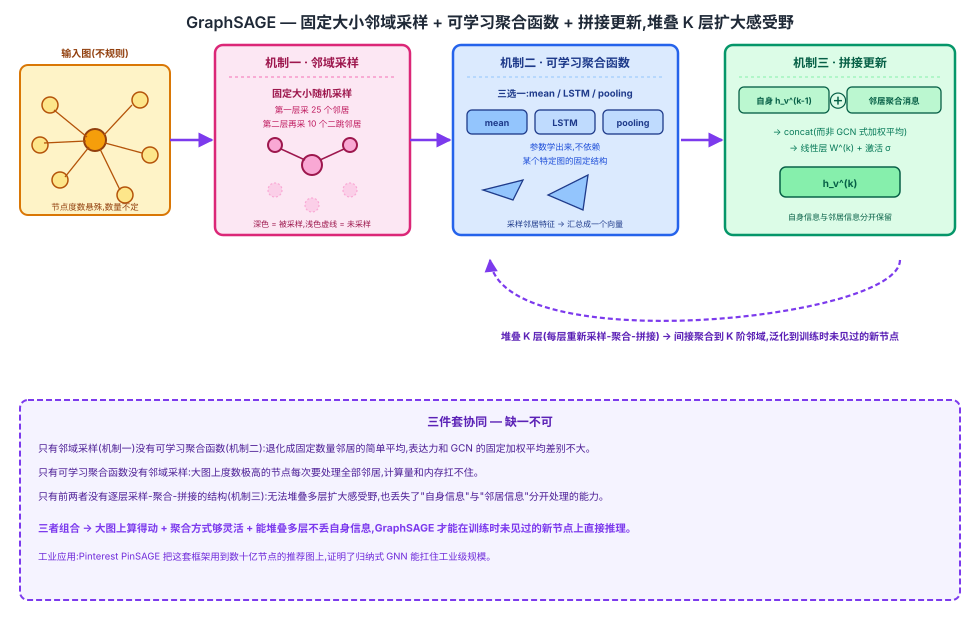

## 前作进展

[GCN](01-gcn.md)(Kipf & Welling, 2017)证明了简化的谱图卷积可行——一层 $\tilde{D}^{-1/2} \tilde{A} \tilde{D}^{-1/2} H W$ 传播规则在引文网络半监督节点分类上大幅超过此前方法,定义了"现代 GNN"这个范式的起点。

但 GCN 有一个根本限制:它的学习方式是**直推式**的(transductive)。GCN 的传播规则 $\tilde{D}^{-1/2} \tilde{A} \tilde{D}^{-1/2} H W$ 里,$\tilde{A}$ 和 $\tilde{D}$ 是针对训练时那一张**固定图**算出来的完整邻接矩阵和度数矩阵——模型学到的其实是"这个特定图里每个特定节点"的表征,而不是一个能推广到新节点的通用函数。要处理训练时没见过的新节点(比如社交网络新注册的用户、蛋白质相互作用网络里新发现的蛋白质),GCN 没有办法直接算,只能把新节点并入图后重新构造 $\tilde{A}$、$\tilde{D}$,再重新训练整个模型。

这个限制在小规模、静态的引文网络基准上不明显,但在真实世界持续增长的大图上完全不现实——Reddit 帖子流每天都有新帖子、新用户,社交网络每天都有新用户加入,不可能每来一个新节点就重新训练一次整张图的模型。GNN 要想真正在工业场景落地,需要一种不依赖"训练时见过完整图"的学习方式。

## 核心思想 + 直觉

GraphSAGE(SAmple + aggreGatE)的核心洞察是:**不要为图里每个节点学一个固定的嵌入向量,而是学一个通用的、与具体图结构无关的聚合函数**。这个函数的输入是"任意节点的邻居特征集合",输出是这个节点的表征。

这个转变看似微小,后果却很关键:只要聚合函数学得足够好,对一个训练时完全没见过的新节点,只要知道它的邻居是谁、邻居的原始特征是什么,就能用同一套聚合函数参数算出它的表征——不需要重新训练,也不需要这个新节点在训练图里出现过。这就是"归纳式(inductive)学习"相对于 GCN"直推式学习"的关键区别:GCN 学的是"图 + 节点表征"的一张查找表,GraphSAGE 学的是一个可以在任意图上复用的函数。

要把这个想法落地,GraphSAGE 需要解决两个具体问题:真实大图里节点邻居数量参差不齐、数量巨大,直接聚合全部邻居算不动;聚合函数本身要足够灵活、参数可学习,而不是像 GCN 那样由图结构(节点度数)直接决定权重。

## 机制一:固定大小邻域采样

真实大图里,一个节点可能有成千上万个邻居(比如社交网络里的大 V 账号)。如果每次聚合都要用上一个节点的全部邻居,单个节点的计算量和内存开销就会随其度数线性增长,遇到度数极高的节点会直接扛不住,也没法把训练 batch 化成统一大小的张量运算。

GraphSAGE 的做法是:对每个节点的邻居做**固定大小的随机采样**。比如一个两层的 GraphSAGE,第一层给每个节点采样 25 个邻居,第二层(即邻居的邻居)再给每个被采样到的邻居采样 10 个二跳邻居。这样不管某个节点在原图里实际有多少邻居,参与聚合计算的邻居数量都被统一裁剪成固定值,不规则、大小不一的邻域被规整成可以批量化处理的固定形状张量,训练时的计算量和内存占用因此可预测、可控。

## 机制二:可学习聚合函数(mean / LSTM / pooling)

GraphSAGE 提出了三种可选的聚合函数,负责把采样到的邻居特征汇总成一个向量:

- **Mean aggregator**:对采样到的邻居表征直接做逐元素均值池化,最简单也最接近 GCN 的加权平均,但表达力有限。
- **LSTM aggregator**:把采样到的邻居表征看作一个序列(先随机打乱顺序,消除人为强加的顺序偏差),喂给一个 LSTM,取最后一步的隐状态作为聚合结果。表达力更强(能建模邻居之间的交互),但需要人为定义一个图结构里本不存在的"顺序"。
- **Pooling aggregator**:每个邻居的表征先各自过一个共享的全连接层 + 非线性激活,再对变换后的向量逐元素取最大值(max-pooling)。既比 mean 有更强的表达力,又不像 LSTM 那样依赖人为顺序。

三种聚合函数的共同点是:它们的参数(LSTM 的权重、pooling 前那层全连接的权重)都是**学出来的**,不依赖某个特定图的固定拓扑结构(如节点度数)——这正是它们能被复用到任意新图、新节点上的原因。

## 机制三:逐层采样-聚合-拼接(K 层堆叠)

和 GCN 一样,GraphSAGE 靠堆叠多层来扩大每个节点的感受野,但每一层具体做的事不同。GraphSAGE 每一层是:先对当前节点做固定大小的邻居采样,再用选定的聚合函数汇总这些邻居在上一层的表征,得到一个"邻居消息"向量;然后把这个"邻居消息"和节点自己上一层的表征做**拼接**(concat),过一层线性变换和非线性激活,得到这个节点在这一层的新表征。

$$
h_v^{(k)} = \sigma\left(W^{(k)} \cdot \text{CONCAT}\left(h_v^{(k-1)},\ \text{AGGREGATE}\left(\{h_u^{(k-1)}, u \in \mathcal{N}(v)\}\right)\right)\right)
$$

这里关键的设计选择是**拼接**而不是像 GCN 那样把自己和邻居的表征直接加权平均到一起。拼接保留了"我自己上一层是什么样子"和"邻居传给我的信息"这两条信息通道的区分,不会在一次线性变换前就把两者混在一起;GCN 的对称归一化聚合($\tilde{D}^{-1/2}\tilde{A}\tilde{D}^{-1/2}$ 隐含把自环也当邻居平均掉)则天然地把自身信息和邻居信息混合成了一个数值。堆叠 $K$ 层后,每个节点的表征间接聚合到了 $K$ 阶邻域的信息,和 GCN 堆叠多层扩大感受野的思路一致,区别在于每一层内部具体怎么处理这两路信息。



## 三件套协同

三个机制必须组合在一起,才是 GraphSAGE 这个既能处理大图、又能泛化到新节点的框架:

- 只有**邻域采样**(机制一)没有**可学习聚合函数**(机制二):退化成对固定数量邻居做简单平均,表达力和 GCN 的固定加权平均差别不大,学不到比"按结构平均"更丰富的模式。
- 只有**可学习聚合函数**没有**邻域采样**:在真实大图上,度数极高的节点每次聚合都要处理全部邻居,计算量和内存开销扛不住,大图训练直接跑不动。
- 只有前两者、没有**逐层采样-聚合-拼接**的结构(机制三):没有一个统一的框架把"采样 + 聚合"堆叠成多层,既无法扩大感受野聚合到多阶邻域信息,也丢失了拼接结构里"自身信息"与"邻居信息"分开处理的能力。

三者组合起来,GraphSAGE 才能同时满足"大图上算得动"(靠采样)、"聚合方式足够灵活"(靠可学习聚合函数)、"能堆叠多层且不丢失自身信息"(靠拼接结构)——这也是它能在训练时没见过的新节点上直接推理、而不需要重新训练整个模型的根本原因。

## 关键代码

两层 GraphSAGE 前向传播的简化伪代码(邻域采样 + mean aggregator + 拼接更新,不追求完整可运行,参照 GCN 节点的详略程度):

```python
import torch
import torch.nn as nn
import random


def sample_neighbors(node, adj_list, num_samples):
    """机制一:固定大小邻域采样(不足则有放回采样补齐)"""
    neighbors = adj_list[node]
    if len(neighbors) >= num_samples:
        return random.sample(neighbors, num_samples)
    return random.choices(neighbors, k=num_samples)


class MeanAggregator(nn.Module):
    """机制二:mean aggregator(LSTM/pooling 是这里替换的另外两种选择)"""
    def forward(self, neighbor_feats):
        # neighbor_feats: [num_nodes, num_samples, feat_dim]
        return neighbor_feats.mean(dim=1)


class GraphSAGELayer(nn.Module):
    def __init__(self, in_dim, out_dim, aggregator):
        super().__init__()
        self.aggregator = aggregator
        # 机制三:拼接自身表征 + 邻居聚合表征,再过线性层
        self.linear = nn.Linear(in_dim * 2, out_dim, bias=False)

    def forward(self, self_feats, neighbor_feats):
        agg = self.aggregator(neighbor_feats)          # 聚合采样到的邻居
        combined = torch.cat([self_feats, agg], dim=-1)  # 拼接(而非 GCN 式加权平均)
        return torch.relu(self.linear(combined))


class GraphSAGE(nn.Module):
    def __init__(self, in_dim, hidden_dim, out_dim, sample_sizes=(25, 10)):
        super().__init__()
        self.sample_sizes = sample_sizes  # 每一层的采样邻居数,如 [25, 10]
        self.layer1 = GraphSAGELayer(in_dim, hidden_dim, MeanAggregator())
        self.layer2 = GraphSAGELayer(hidden_dim, out_dim, MeanAggregator())

    def forward(self, node, features, adj_list):
        # 逐层:先采样这一层需要的邻居,再聚合、拼接、更新
        # 真实实现里会为一个 batch 的节点批量采样、批量聚合
        one_hop = sample_neighbors(node, adj_list, self.sample_sizes[0])
        h1_self = features[node]
        h1_neighbors = torch.stack([features[n] for n in one_hop])
        h1 = self.layer1(h1_self, h1_neighbors.unsqueeze(0))

        two_hop = [sample_neighbors(n, adj_list, self.sample_sizes[1]) for n in one_hop]
        h2_neighbors = torch.stack([
            torch.stack([features[n] for n in nbrs]) for nbrs in two_hop
        ])
        return self.layer2(h1, h2_neighbors)
```

真实实现(如原论文的 TensorFlow 代码、后续 PyG/DGL 的封装)会按 mini-batch 批量组织采样和聚合,并支持在整张大图上做分布式采样,而不是像上面这样逐节点递归计算。

## 性能数据

> 以下数字基于训练知识回忆,本次任务执行时 WebSearch 工具报错不可用,未经实时联网核实。方向性结论(GraphSAGE 相对随机/浅层 embedding 基线有明显提升、归纳式设置下优势更突出)有较高把握,但具体数字请在引用前对照原论文(arXiv:1706.02216,NeurIPS 2017)核实。

论文在三个数据集上评估(micro-averaged F1,论文 Table 1):

- **Citation**(引文网络,直推式对比场景):GraphSAGE 相对 DeepWalk 等浅层 embedding 方法及原始特征基线有明显提升。
- **Reddit**(帖子社区分类,大规模图,约 23 万节点):GraphSAGE 相对 DeepWalk 有大幅提升,且推理速度远快于需要为每个新节点重新优化 embedding 的 DeepWalk。
- **PPI**(蛋白质相互作用网络,多图归纳式场景,训练和测试用的是完全不同的图):这是最能体现"归纳式"优势的数据集——GraphSAGE 可以直接在测试时的新图上做推理,而 DeepWalk 这类直推式方法在训练图之外的新图上根本无法直接使用,必须重新训练。

三种聚合函数之间的相对表现(方向性,数字待核对):pooling aggregator 通常略优于 mean aggregator,LSTM aggregator 表达力强但对随机打乱的邻居顺序更敏感、训练更慢;论文的整体结论是"聚合函数的具体选择在效果上有差异,但采样 + 可学习聚合这个框架本身的收益远大于三种聚合函数之间的差异"。

关键的邻域采样超参数:两层 GraphSAGE 常用配置为第一层采样 **25** 个邻居、第二层(二跳)再对每个一跳邻居采样 **10** 个邻居,在效果和计算开销之间取得平衡——论文发现继续增大采样数量带来的效果提升迅速递减,而计算量线性上升。

## 影响 / 后续

GraphSAGE 的归纳式框架成为工业界大规模图神经网络应用的基础。最直接的例子是 **Pinterest 的 PinSAGE** 推荐系统——把 GraphSAGE 的采样 + 聚合思路应用到数十亿节点、数百亿边的商品-用户交互图上做推荐,是"学术界的 GNN 方法能不能扛住工业级图规模"这个问题的第一个成功案例。

更根本的影响是,GraphSAGE 证明了 GNN 完全可以脱离"训练时必须见过完整图"这个假设,在持续增长的真实世界大图上落地——这对社交网络、推荐系统、知识图谱等每天都有新节点加入的场景至关重要。它和 GCN 一起,共同确立了"聚合(Aggregate)+ 更新(Update)"这个消息传递视角:GCN 定义了这个视角下最简单的一种实现(固定的、按度数加权的聚合),GraphSAGE 证明了这个视角可以推广到"聚合函数本身也可学习、可采样"的更一般形式。

GraphSAGE 也留下了一个开放问题:三种聚合函数(mean/LSTM/pooling)是人工设计后拿去试的,选哪种、怎么设计一个更好的聚合函数,仍然要靠经验和实验摸索。

→ [01-gcn.md](01-gcn.md) · 本文解决的直推式训练限制
→ [03-gat.md](03-gat.md) · 用可学习注意力替代本文里手工设计的聚合函数选择
