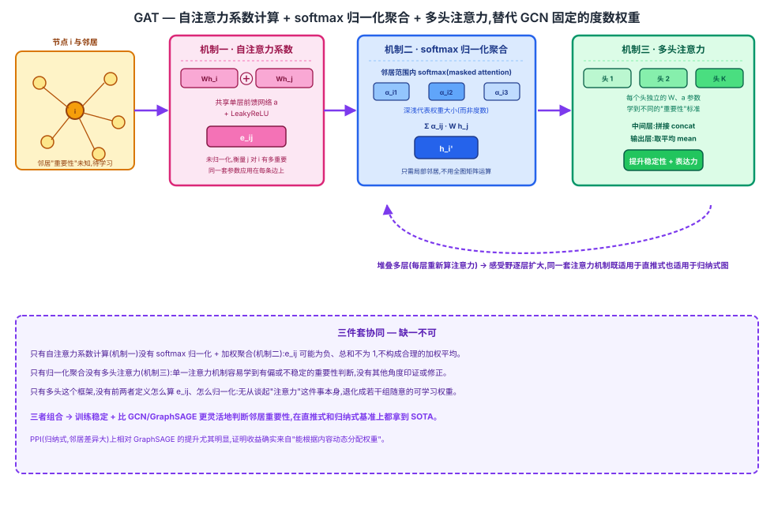

## 前作进展

[GCN](01-gcn.md)(Kipf & Welling, 2017)用对称归一化 $\tilde{D}^{-1/2} \tilde{A} \tilde{D}^{-1/2}$ 决定每条边的聚合权重——这个权重完全由两端节点的**度数**决定,是图的拓扑统计量,和节点的实际特征内容没有任何关系:两个节点无论表征多相似或多不相关,只要度数一样,聚合权重就一样。

[GraphSAGE](02-graphsage.md)(Hamilton et al., 2017)把固定的度数权重换成了可学习的聚合函数(mean/LSTM/pooling),解决了 GCN 直推式训练、无法泛化到新节点的问题。但它的三种聚合函数在**权重分配**这件事上仍然没有精细区分:mean aggregator 对采样到的所有邻居一视同仁地取平均;pooling aggregator 虽然每个邻居先过一层非线性变换,但最终取 max 时只留下"每个维度上最大的那个",不是一个对"这个邻居到底有多重要"显式建模的权重;LSTM aggregator 表达力更强,但依赖人为打乱后强加的序列顺序,而不是直接根据两个节点的内容相似或相关程度决定权重。

两条路线合起来看,一个共同的缺口浮现出来:无论是 GCN 的度数归一化,还是 GraphSAGE 的 mean/pooling,聚合时"每个邻居占多大权重"都不是由**这个节点和邻居的实际特征内容**联合决定的——模型没法根据具体输入判断"这条边上的邻居这次是否真的携带更多有用信息",权重要么是拓扑统计量,要么是不区分邻居差异的对称聚合。

## 核心思想 + 直觉

GAT(Graph Attention Network)的核心洞察是:借鉴 Transformer 里 self-attention 的思路,**让模型自己学习"给每个邻居分配多少权重",而不是用固定的图结构统计量(度数)或不区分邻居的对称聚合函数决定**。

具体做法是:对每一对相连的节点,用一个共享的小型注意力机制(参数量很小,本质是一个单层前馈网络)计算出一个注意力分数,再对一个节点的所有邻居的分数做 softmax 归一化,得到最终的聚合权重。这个注意力机制的参数是端到端学出来的,同一套参数应用在图里的每一条边上——不管是训练时见过的图还是全新的图,只要边两端节点的特征喂进去,就能算出一个权重,这也是 GAT 既能在直推式基准上也能在归纳式基准上直接使用的原因。

和 Transformer 的标准 self-attention 相比,GAT 有一个关键限制:它不对全图所有节点两两计算注意力,而只在图**已经存在的边**上计算——这被称为 masked attention,好处是计算量只随边数增长而不是节点数平方增长,坏处是完全依赖图里已有的边结构,没法像标准 Transformer 那样发现"图上不存在边、但内容上应该相关"的节点对。

## 机制一:自注意力系数计算

对每条边 $(i, j)$($j$ 是 $i$ 的邻居,包括自环意义上的 $i$ 自己),把两个节点当前层的表征 $h_i, h_j$ 先各自过一个共享的线性变换 $W$,再拼接起来,喂给一个共享的单层前馈网络(权重向量 $\vec{a}$)加 LeakyReLU 非线性,得到一个未归一化的注意力分数:

$$
e_{ij} = \text{LeakyReLU}\left(\vec{a}^T [W h_i \, \| \, W h_j]\right)
$$

$e_{ij}$ 衡量"节点 $j$ 对节点 $i$ 有多重要"。关键设计是:这个前馈网络的参数($W$ 和 $\vec{a}$)对图里**每一条边都共享**——不需要为不同的边单独学参数,参数量和图的规模无关,只和特征维度有关。

## 机制二:softmax 归一化 + 加权聚合

对一个节点 $i$ 的所有邻居 $j \in \mathcal{N}(i)$,把 $e_{ij}$ 在邻居范围内做 softmax 归一化(而不是像标准 Transformer 那样对全图所有节点做 softmax),得到归一化的注意力系数:

$$
\alpha_{ij} = \text{softmax}_j(e_{ij}) = \frac{\exp(e_{ij})}{\sum_{k \in \mathcal{N}(i)} \exp(e_{ik})}
$$

再用这些系数对邻居特征(过线性变换后的 $W h_j$)做加权求和,得到节点 $i$ 的新表征:

$$
h_i' = \sigma\left(\sum_{j \in \mathcal{N}(i)} \alpha_{ij} W h_j\right)
$$

这一步只需要局部邻居的信息就能算,不需要知道全图结构,也不用做 GCN 那样依赖完整邻接矩阵的矩阵运算(对称归一化、矩阵求逆等)——每个节点的更新只是对它自己那一小圈邻居做一次加权平均,这正是 GAT 能直接搬到训练时没见过的新图、新节点上的结构基础。

## 机制三:多头注意力

和 Transformer 一样,GAT 用多个独立的注意力头并行计算——每个头有自己独立的一套 $W$ 和 $\vec{a}$ 参数,分别学到不同的"重要性"判断标准(比如一个头可能更关注特征某几个维度的相似性,另一个头关注别的模式)。

多个头的输出如何合并,GAT 区分了中间层和输出层两种做法:

- **中间层**:把 $K$ 个头各自算出的 $h_i'$ **拼接**起来,维度变成 $K$ 倍,保留每个头学到的不同信息,不提前混合。
- **最后一层**(输出层):把 $K$ 个头的输出取**平均**而不是拼接,因为这一层要直接接分类器,拼接会让输出维度和头数绑死,取平均则不管用多少头,输出维度都固定,同时几个头的判断相互印证,让最终预测更稳定。

多头机制的意义不只是"多算几次取平均"——不同头独立学到的注意力模式提升了整个机制的稳定性(单一注意力头容易学到有偏的重要性判断,类似只用一个随机种子训练容易过拟合到某种特定模式),也让模型有能力在不同"角度"上刻画节点间的关系。



## 三件套协同

三个机制缺一不可,组合起来才是 GAT 完整的注意力聚合机制:

- 只有**自注意力系数计算**(机制一)没有 **softmax 归一化 + 加权聚合**(机制二):$e_{ij}$ 是任意实数,可能为负、也没有做过归一化,直接拿来加权求和不构成一个合理的加权平均——权重可能互相抵消或数值发散,聚合结果没有清晰的"归一化重要性"含义。
- 只有**归一化聚合**没有**多头注意力**(机制三):单一一套注意力参数容易学到有偏或不稳定的重要性判断,一旦这一套参数在某类边上学偏,整个模型没有其他角度去修正或印证。
- 只有**多头注意力**这个框架,没有前两者具体定义怎么算 $e_{ij}$、怎么归一化:无从谈起"注意力"这件事本身,退化成若干组随意的可学习权重,不构成 Transformer 式的 attention 机制。

三者组合起来,GAT 才能稳定训练,同时比 GCN(固定度数权重)、GraphSAGE(mean/LSTM/pooling 但不显式区分邻居重要性)更灵活地判断"哪个邻居更重要"——这也是它能同时在直推式和归纳式基准上都拿到 SOTA 的原因。

## 关键代码

单头 masked self-attention + 多头聚合的简化伪代码(参照 GCN/GraphSAGE 节点的详略程度,不追求完整可运行):

```python
import torch
import torch.nn as nn
import torch.nn.functional as F


class GATLayer(nn.Module):
    """单个注意力头:机制一(计算 e_ij)+ 机制二(softmax 归一化 + 加权聚合)"""

    def __init__(self, in_dim, out_dim):
        super().__init__()
        self.W = nn.Linear(in_dim, out_dim, bias=False)
        self.a = nn.Linear(2 * out_dim, 1, bias=False)      # 共享的单层前馈网络
        self.leaky_relu = nn.LeakyReLU(0.2)

    def forward(self, h, adj_mask):
        # h: [N, in_dim] 所有节点上一层表征;adj_mask: [N, N] 邻接掩码(含自环)
        Wh = self.W(h)                                       # [N, out_dim]
        N = Wh.size(0)

        # 机制一:对所有节点对拼接后过前馈网络,得到未归一化分数 e_ij
        Wh_i = Wh.unsqueeze(1).expand(N, N, -1)               # 广播出 i
        Wh_j = Wh.unsqueeze(0).expand(N, N, -1)               # 广播出 j
        e = self.leaky_relu(self.a(torch.cat([Wh_i, Wh_j], dim=-1)).squeeze(-1))  # [N, N]

        # masked attention:只在图的边上算 softmax,非边位置压成 -inf
        e = e.masked_fill(adj_mask == 0, float("-inf"))

        # 机制二:邻居范围内 softmax 归一化 + 加权聚合
        alpha = F.softmax(e, dim=1)                           # 对每个 i 的邻居 j 做归一化
        h_prime = torch.matmul(alpha, Wh)                     # 加权求和
        return h_prime


class MultiHeadGAT(nn.Module):
    """机制三:多头注意力,中间层拼接、输出层平均"""

    def __init__(self, in_dim, hidden_dim, num_classes, num_heads=8):
        super().__init__()
        self.heads = nn.ModuleList([
            GATLayer(in_dim, hidden_dim) for _ in range(num_heads)
        ])
        self.out_heads = nn.ModuleList([
            GATLayer(hidden_dim * num_heads, num_classes) for _ in range(num_heads)
        ])

    def forward(self, h, adj_mask):
        # 中间层:多头输出拼接
        h = torch.cat([F.elu(head(h, adj_mask)) for head in self.heads], dim=-1)
        # 输出层:多头输出取平均
        out = torch.stack([head(h, adj_mask) for head in self.out_heads], dim=0).mean(dim=0)
        return out
```

真实实现里,`e` 不会像上面这样对所有 $N \times N$ 节点对显式算一遍再 mask(大图上 $O(N^2)$ 内存扛不住),而是只在稀疏的边列表上算 $e_{ij}$,再用 scatter-softmax 之类的稀疏算子做邻居范围内的归一化——这也是后续 PyG/DGL 里 `GATConv` 的实现方式。

## 性能数据

> 以下数字基于训练知识回忆,本次任务执行时 WebSearch 工具报错不可用,未经实时联网核实。方向性结论(GAT 在直推式和归纳式基准上都优于 GCN/GraphSAGE,PPI 上提升尤其明显)有较高把握,但具体数字请在引用前对照原论文(arXiv:1710.10903,ICLR 2018)核实。

直推式:Cora / Citeseer / Pubmed 节点分类准确率(论文 Table 2):

| 方法 | Cora | Citeseer | Pubmed |
|------|------|------|------|
| [GCN](01-gcn.md) | ~81.5% | ~70.3% | ~79.0% |
| **GAT**(本文) | **~83.0%** | **~72.5%** | **~79.0%** |

归纳式:PPI(蛋白质相互作用网络,训练/测试为完全不同的图)micro-averaged F1(论文 Table 3):

| 方法 | Micro-F1 |
|------|------|
| [GraphSAGE](02-graphsage.md)(最优聚合函数) | ~0.612 |
| **GAT**(本文) | **~0.973** |

关键观察(方向性,数字待对照原文核实):

- GAT 在 Cora/Citeseer 上相对 GCN 有明显提升,在 Pubmed 上和 GCN 基本持平——说明注意力机制的收益在不同数据集上并不均匀,和图的结构特性(如邻居数量分布、特征噪声程度)有关。
- GAT 在 PPI 上相对 GraphSAGE 的提升远大于直推式数据集上的提升,这是这篇论文最亮眼的结果——PPI 里节点邻居数量差异大、特征更复杂,能根据内容动态判断邻居重要性的注意力机制,比 GraphSAGE 的 mean/LSTM/pooling 更能捕捉"哪些邻居其实携带更多信息"这件事。
- 论文里的消融实验(把注意力系数强制设成常数,退化成类似 GCN 的固定平均)显示,在 PPI 这类归纳式、邻居差异大的场景下,去掉可学习注意力后效果明显下降,证明提升确实来自"能根据内容动态分配权重"这件事,而不只是模型容量增大。

## 影响 / 后续

GAT 的注意力机制成为后续大量 GNN 变种的标准组件——把"聚合权重该怎么算"从人工设计的图结构统计量或对称聚合函数,变成一个可以端到端学习的模块,这个思路后来被大量后续工作直接复用或改造(如 GATv2 修正了原始 GAT 里注意力打分函数表达力受限的问题)。

GAT 也是"把 Transformer 的核心思想(注意力)迁移到非序列结构数据"的早期成功案例之一——比 ViT 把 Transformer 搬到图像 patch 序列还要早,证明了 self-attention 这一套机制不依赖网格或序列的规则结构,只要能定义"谁和谁之间可能有关系",就能算注意力权重。但 GAT 的 masked attention 仍然依赖图里已有的边——注意力只在存在边的节点对上计算,没有走到"完全抛弃图结构、对所有节点做全局注意力"这一步。这个方向后来被 Graphormer(2021)彻底推进:不再要求节点对之间必须有边才能计算注意力,而是用全局自注意力配合结构编码,把图的拓扑信息作为偏置项注入 attention 计算过程,而不是作为"能不能计算注意力"的硬性掩码。

→ [02-graphsage.md](02-graphsage.md) · 本文替代的手工聚合函数设计
→ [05-graphormer.md](05-graphormer.md) · 注意力机制在图数据上的思路延伸到全局自注意力
