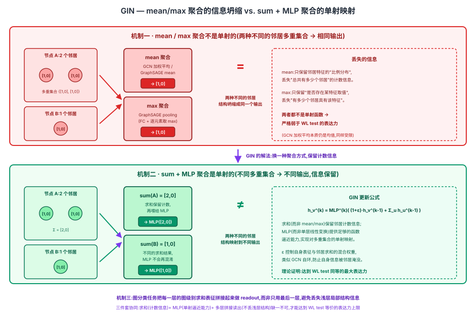

## 前作进展

[GCN](01-gcn.md)(2017)用度数归一化的加权平均聚合邻居,[GraphSAGE](02-graphsage.md)(2017)提供了 mean/LSTM/pooling 三种可学习聚合函数并靠固定大小采样解决了归纳式泛化,[GAT](03-gat.md)(2018)用可学习的注意力权重替代了固定的度数权重。三篇工作的路线各不相同,但都是**先设计一个看起来合理的聚合函数,再拿到基准数据集上跑分**——效果好就说明这个设计是对的,效果不够好就换一种聚合方式或加一层注意力。

没有人系统回答过一个更根本的问题:这些 GNN **到底有多强**?给定两个不同构(non-isomorphic)的图,或者一个节点的两种不同的局部子结构,消息传递框架下的 GNN 到底能不能把它们区分开、学到不同的表征?这不是一个"哪个数据集准确率更高"的实验问题,而是一个关于**架构表达力上限**的理论问题。

图论里其实早就有一个经典且简单的图同构检测算法——**Weisfeiler-Lehman(WL)测试**:每一轮,每个节点把自己和所有邻居的"颜色标签"收集起来,哈希成一个新标签;反复迭代若干轮后,如果两张图节点的标签多重集合(multiset)分布不同,就能确定这两张图不同构(注意反过来不成立:标签分布相同也不能保证一定同构,WL test 是一个必要不充分的判据,但已知它能区分绝大多数真实世界图)。Xu 等人的问题是:GNN 的"聚合邻居 + 更新自身"这一逐层机制,和 WL test 的"聚合邻居标签 + 哈希更新"这一逐轮机制,在数学结构上是不是同一件事?如果是,GCN/GraphSAGE/GAT 各自的聚合函数,能不能达到 WL test 这个理论上限?

## 核心思想 + 直觉

GIN 论文的核心洞察是:**GNN 的消息传递过程和 WL test 的邻居标签聚合过程在数学结构上是同一件事**——两者都是"收集邻居的（表征/标签）多重集合，再用某个函数把这个多重集合映射成一个新的（表征/标签）"。既然结构相同，GNN 的表达力天花板就是 WL test 的表达力天花板：没有一个消息传递 GNN 能比 WL test 区分更多不同构的图。

但这只是给出了上限，GIN 论文更进一步问：**要真正达到这个天花板，聚合函数和更新函数需要满足什么条件？** 答案是——它们必须是**单射的（injective）**。直觉上，一个节点的邻居集合本质上是一个多重集合（multiset）：同一个特征值可能在邻居里重复出现多次，顺序也无意义。如果聚合函数把两个明明不同的多重集合（比如"邻居数量不同"或"某个特征出现的次数不同"）映射成了同一个输出向量，那么无论后面接多复杂的网络，这两种不同的局部结构都已经在聚合这一步被"抹平"成了同一个表征——信息一旦在聚合这一步丢失，就永远补不回来了。GIN 要解决的问题就变成：什么样的聚合函数，对多重集合是单射的？

## 机制一:为什么 mean / max 聚合不是单射的

论文分别分析了三类聚合函数对多重集合的单射性,并明确点名了具体的算子:

- **均值聚合**——对应 [GCN](01-gcn.md) 的度数加权平均传播规则 $\tilde{D}^{-1/2}\tilde{A}\tilde{D}^{-1/2}HW$(本质上是一种加权均值)以及 [GraphSAGE](02-graphsage.md) 明确提供的 **mean aggregator** 选项:均值只保留了邻居特征的"比例分布",丢失了"总共有多少个邻居"这个信息。论文给出的经典反例是——一个节点有 2 个邻居,特征都是 $[1, 0]$;另一个节点只有 1 个邻居,特征是 $[1, 0]$。两种情况下均值聚合的结果都是 $[1, 0]$,完全一样,尽管这是两种不同的邻居多重集合(数量不同)。GCN 的度数归一化系数虽然让不同节点对之间的权重不再是简单的算术平均,但归一化之后本质上仍然是一种加权均值,同样无法区分"比例相同、数量不同"的邻居多重集合。
- **最大值聚合**——对应 GraphSAGE 明确提供的另一个选项 **pooling aggregator**(每个邻居先过一层全连接 + 非线性,再逐元素取 max):max 只保留了"某个特征维度上是否存在取值很大的邻居",完全丢失了"有多少个邻居具有这个特征"的计数信息。论文的反例是——一个节点的邻居多重集合是 $\{[1,0], [1,0]\}$,另一个节点的邻居多重集合是 $\{[1,0]\}$,逐元素取 max 之后两者结果都是 $[1,0]$,同样无法区分。

均值聚合和最大值聚合都不是单射函数,因此**严格弱于** WL test——存在 WL test 能区分、但用 mean 或 max 聚合的 GNN 无法区分的图结构对。需要说明的是,GraphSAGE 的 **LSTM aggregator** 是这三个选项里唯一对输入顺序敏感的,理论上如果不做随机打乱有可能保留更多顺序相关的信息,但论文并未把 LSTM 聚合作为单射性证明的重点,GIN 论文的核心反例集中在 mean 和 max 这两种置换不变(permutation-invariant)、显然非单射的聚合方式上。

## 机制二:GIN 的求和聚合 + MLP

论文证明:如果邻居特征取自一个**可数集合**(离散或可数无穷,神经网络里用浮点数表示的特征在实践中总可以看作可数),那么存在一个函数,能把任意多重集合**单射地**映射到一个向量。这个函数可以被参数化为——先对多重集合内所有元素**求和**,再把求和结果喂给一个**多层感知机(MLP)**,而不是单层线性变换:单层线性变换的表达力不足以逼近论文构造的这个单射函数(它本质上需要能表示某种"通用函数逼近器",这正是 MLP 而非单层线性层的用武之地)。

求和聚合本身保留了"总共有多少个邻居、每种特征各出现了多少次"这个计数信息(均值和最大值都丢失了这一信息),而 MLP 提供了足够的函数逼近能力,把这个求和结果映射到一个能区分不同多重集合的向量空间里。GIN 的核心更新公式是:

$$
h_v^{(k)} = \text{MLP}^{(k)}\left((1 + \epsilon^{(k)}) \cdot h_v^{(k-1)} + \sum_{u \in \mathcal{N}(v)} h_u^{(k-1)}\right)
$$

其中 $\epsilon^{(k)}$ 是一个标量(可以是固定超参数,即论文里的 GIN-0 变体设 $\epsilon = 0$;也可以是可学习参数,即 GIN-$\epsilon$ 变体),作用是让节点自己上一层的表征和邻居求和的表征以不同权重混合,避免节点"自己"在求和聚合中被邻居淹没(这个角色类似 [GCN](01-gcn.md) 里给邻接矩阵加自环 $\tilde{A} = A + I$,只是 GIN 用一个可调标量而非硬编码的自环权重)。

## 机制三:图级别读出函数(多层拼接而非只用最后一层)

对于图分类任务(需要把整张图所有节点的表征汇总成一个图级别的向量),一个直觉做法是只取模型最后一层的节点表征做全图求和(readout)。但论文证明这样做会**丢失浅层结构信息**:浅层(靠前的层)的节点表征捕捉的是更局部、跳数更小的子结构模式,深层表征捕捉的是更大范围的子结构模式——只用最后一层等于只保留了"跳数最大"的那一种粒度,中间过程里浅层的局部模式信息在逐层往后传递的过程中可能已经被稀释或覆盖。

GIN 论文提出的做法是:把模型**每一层**的图级别表征(每一层所有节点表征求和得到的向量)都单独算出来,再把这些不同层的图级别向量**拼接**起来,作为最终的图表征,而不是只用最深一层。这样图分类的下游分类器能同时看到从"1 跳局部结构"到"K 跳全局结构"各个粒度层次的信息。



## 三件套协同

三个机制组合起来才是 GIN 被证明达到 WL test 表达力上限的完整架构:

- 只有**求和聚合**(机制二的前半部分)没有 **MLP**(机制二的后半部分,换成单层线性变换):求和这一步本身保留了计数信息、理论上具备单射的可能,但单层线性变换的函数逼近能力不足以实现这个单射映射,理论上限达不到 WL test 的水平。
- 只有 **MLP** 没有**求和聚合**(比如用均值或最大值 + MLP):聚合这一步本身就已经把不同的多重集合坍缩成了相同的中间结果,信息在进入 MLP 之前就丢了,后面接多复杂、多深的 MLP 都补不回来——这正是 GraphSAGE 的 pooling aggregator(先过全连接层再取 max)没能达到理论上限的原因:非线性变换加在了 max 聚合**之前**,而不是加在聚合**之后**。
- 只有前两者(逐层的求和 + MLP 更新)没有**多层拼接读出**(机制三):节点级别的表征已经具备理论上的单射表达力,但图分类任务如果只用最后一层做 readout,依然会丢失浅层的局部结构信息,拿不到图级别任务上应有的效果。

三者组合起来,GIN 才被证明是消息传递框架下理论上表达力最强的架构——在图同构测试的意义上等价于 WL test,是这个框架能达到的上限,而不能再靠换一种聚合函数继续往上突破。

## 关键代码

GIN 层的求和聚合 + MLP 更新 + 多层拼接读出的简化伪代码(参照 GCN/GraphSAGE/GAT 节点的详略程度,不追求完整可运行):

```python
import torch
import torch.nn as nn


class GINLayer(nn.Module):
    """机制二:求和聚合 + (1+eps) 自身权重 + MLP 更新"""

    def __init__(self, in_dim, hidden_dim, out_dim, eps_trainable=True):
        super().__init__()
        self.mlp = nn.Sequential(
            nn.Linear(in_dim, hidden_dim),
            nn.ReLU(),
            nn.Linear(hidden_dim, out_dim),
        )
        init_eps = 0.0
        if eps_trainable:
            self.eps = nn.Parameter(torch.tensor(init_eps))   # GIN-eps
        else:
            self.register_buffer("eps", torch.tensor(init_eps))  # GIN-0

    def forward(self, h, adj):
        # 机制二:对邻居求和(而非 mean/max),而非仅保留比例或存在性
        neighbor_sum = adj @ h                     # [N, in_dim]
        combined = (1 + self.eps) * h + neighbor_sum
        return self.mlp(combined)                  # MLP 而非单层线性变换


class GIN(nn.Module):
    """机制三:每一层的图级别表征拼接,而非只用最后一层"""

    def __init__(self, in_dim, hidden_dim, num_classes, num_layers=5):
        super().__init__()
        dims = [in_dim] + [hidden_dim] * (num_layers - 1)
        self.layers = nn.ModuleList([
            GINLayer(dims[i], hidden_dim, hidden_dim) for i in range(num_layers - 1)
        ])
        # 每一层(含输入层)各自的图级别表征都接一个线性分类头,再把 logits 相加
        self.readout_heads = nn.ModuleList([
            nn.Linear(hidden_dim, num_classes) for _ in range(num_layers)
        ])

    def forward(self, h, adj, graph_batch):
        # graph_batch: 把节点分配到各自所属图的索引,用于图内求和 pooling
        layer_reprs = [h]
        for layer in self.layers:
            h = layer(h, adj)
            layer_reprs.append(h)

        # 机制三:每一层都做一次图级别求和 readout,不同层的分类 logits 相加(等价于拼接后接线性层)
        graph_logits = 0
        for layer_h, head in zip(layer_reprs, self.readout_heads):
            graph_repr = sum_pool_per_graph(layer_h, graph_batch)   # 全图节点求和
            graph_logits = graph_logits + head(graph_repr)
        return graph_logits


def sum_pool_per_graph(h, graph_batch):
    """把一个 batch 里多张图的节点表征,按所属图求和汇总成图级别向量"""
    num_graphs = graph_batch.max().item() + 1
    out = torch.zeros(num_graphs, h.size(-1), device=h.device)
    out.index_add_(0, graph_batch, h)
    return out
```

真实实现(如原论文代码、PyG 的 `GINConv`)里,MLP 通常还带 BatchNorm,`eps` 是否可训练是一个消融选项(GIN-0 固定为 0,GIN-$\epsilon$ 可学习),多层拼接读出在实现上等价于把每层的图级别向量拼接后接一个线性层,和上面"各层分类 logits 相加"在数学上是等价的简化写法。

## 性能数据

> 以下数字基于训练知识回忆,本次任务执行时 WebSearch 工具报错不可用,未经实时联网核实。方向性结论(GIN 在图分类基准上普遍优于 GCN/GraphSAGE,且训练集准确率能拟合到接近 100%,验证了表达力上限的理论预测)有较高把握,但具体数字请在引用前对照原论文(arXiv:1810.00826,ICLR 2019)核实。

论文在图分类基准上对比 GIN(-0 / -$\epsilon$ 两个变体)与 WL subtree kernel、其他 GNN 基线(方向性数字):

| 数据集 | 类型 | GCN | GraphSAGE | **GIN**(本文) |
|--------|------|-----|-----------|------|
| MUTAG(生物信息学,分子) | 二分类 | ~85% | ~85% | **~89–90%** |
| PROTEINS(生物信息学) | 二分类 | ~76% | ~76% | **~76%左右(提升不明显)** |
| IMDB-BINARY(社交网络) | 二分类 | ~74% | ~72% | **~75–76%** |
| COLLAB(社交网络) | 多分类 | — | ~73% | **~80%左右** |

关键观察(方向性,数字待对照原文核实):

- GIN(尤其是 GIN-0,即固定 $\epsilon=0$ 的变体)在多数基准上和 WL subtree kernel(理论表达力上限的经典算法)表现相当接近,在部分数据集上甚至超过 WL kernel 本身(因为 GIN 除了 WL 式的结构区分能力外,还多了端到端学习特征表示的能力),而 GCN/GraphSAGE 普遍不及 GIN。
- PROTEINS 这类数据集上 GIN 相对 GCN/GraphSAGE 的提升不算大,论文的解释方向是:并非所有真实世界图分类任务都需要区分"WL test 能分辨、mean/max 聚合分辨不了"的那些细粒度结构差异,任务本身对表达力上限的敏感程度不同。
- 论文里专门设计了一个**验证表达力上限的实验**:比较不同聚合方式(sum-MLP 即 GIN、sum-1layer 只用单层线性变换、mean-MLP、max-MLP 等)在训练集上能拟合到多高的准确率——结果显示 GIN(sum + MLP)的训练准确率能够拟合到接近或等于 100%,而 mean/max 聚合的变体、以及 sum + 单层线性变换的变体,训练准确率明显达不到 100%,尤其是在需要区分"结构上更微妙"的社交网络数据集(如 IMDB-BINARY、RDT 系列)上差距更明显。这个训练集拟合能力的差异,正是论文用来实证支撑"单射聚合函数理论上表达力更强"这一理论结论的关键实验。

## 影响 / 后续

GIN 的理论分析第一次给消息传递 GNN 这整个范式划出了一条清晰的表达力天花板——WL test。这个结论对整个 GNN 领域的意义,不亚于给出一个"不管你怎么设计聚合函数,只要还在消息传递框架内,就不可能比 WL test 更强"的上限定理。此后的研究大致分两条路:

- **在消息传递框架内逼近或突破这个上限**——用更高阶的 WL test 变种(如 k-WL、GNN 的高阶推广)作为理论参照,这类工作通常需要建模超过成对节点关系的高阶结构,超出本家族收录范围。
- **干脆放弃消息传递框架**——不再受限于"只能逐层聚合局部邻居"这个结构性限制,转而用全局注意力直接建模任意两个节点之间的关系,把图的拓扑信息作为额外的编码注入 attention 计算过程。[Graphormer](05-graphormer.md) 走的就是这条路。

→ [03-gat.md](03-gat.md) · GIN 的理论分析同样适用于分析本文的聚合方式
→ [05-graphormer.md](05-graphormer.md) · 跳出消息传递表达力上限的另一条路径
