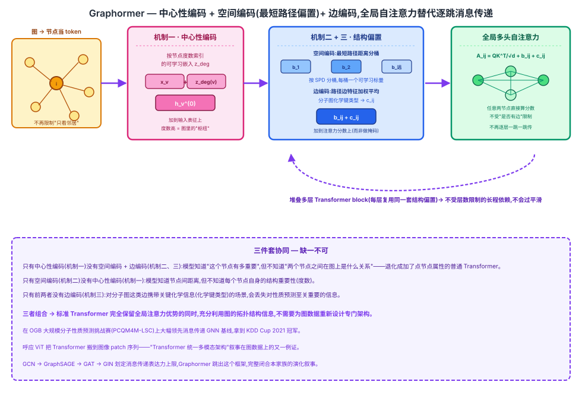

## 前作进展

[GCN](01-gcn.md) → [GraphSAGE](02-graphsage.md) → [GAT](03-gat.md) → [GIN](04-gin.md) 这条路线都没有跳出**消息传递(message passing)**这个框架:每一层,每个节点只从直接邻居收集信息,不管聚合函数换成度数加权平均、可学习聚合函数、注意力加权还是 [GIN](04-gin.md) 证明能达到 WL test 表达力上限的求和 + MLP,信息在每一层只能传播**一跳**。GIN 从理论上证明了消息传递框架的表达力天花板就是 Weisfeiler-Lehman 图同构测试,但这个证明本身也划定了一条边界:只要还在逐层聚合局部邻居这个结构里,不管聚合函数怎么设计,都不可能突破这条上限。

这个"一跳"限制带来一个实际问题:要建模长程依赖(比如图上相距很远的两个节点之间的关系),需要堆叠很多层才能让信息传到足够远的地方;但层数堆多了会出现**过平滑(over-smoothing)**——反复聚合之后,所有节点的表征逐渐趋同,彼此之间的区分度反而下降。这不是某一种聚合函数的问题,是"只能一跳一跳传"这个结构本身带来的代价。

与此同时,标准 Transformer 的全局自注意力天然不受"一跳"限制——任意两个 token 之间都能直接建立联系,不需要通过中间节点逐层传递。这个优势已经在 NLP 和视觉(呼应 [ViT](../08-vit/01-vit.md))领域被反复证明。但在 Graphormer 之前,没有工作系统地把标准 Transformer 应用到图数据上并证明其有效性——图数据不像文本有天然的序列顺序,也不像图像有天然的网格结构,Transformer 的注意力机制本身也不感知图的拓扑,把节点当成一个无序 token 集合直接喂给 Transformer,等于完全丢弃了图结构这个最重要的先验信息。

## 核心思想 + 直觉

Graphormer 的核心洞察是——**不需要为图数据设计全新的架构,标准 Transformer 的自注意力机制本身就足够强大,真正缺的是把图的结构信息(节点度数、节点对之间的距离、边上的特征)编码进 attention 的计算过程**,让模型在做全局注意力时能"知道"图的拓扑,而不是把图当成一个无结构的节点集合。

具体做法是把每个节点当作一个 token,直接套用标准 Transformer 的全局自注意力——每个节点都能看到、都能和图里所有其他节点直接计算注意力,不再受限于"只能看直接邻居"。图的结构信息不再靠"限制谁能和谁交互"(比如 [GAT](03-gat.md) 的 masked attention,只在已有边上算注意力)来体现,而是作为**额外的偏置项**,加到注意力分数的计算里,让全局注意力在计算的同时仍然"知道"两个节点在图上离得有多近、之间有没有边、边上是什么特征。

## 机制一:中心性编码(Centrality Encoding)

在标准 Transformer 里,每个 token 的重要性完全由它的内容和上下文决定,和它在序列里的位置(除了位置编码)没有额外的结构信号。但在图里,节点的**度数**(连接了多少条边)本身就是一个重要的结构信号——度数高的节点往往是图里的"枢纽",在很多任务里(比如分子图里的中心原子)天然更重要。

Graphormer 给每个节点的输入表征加上一个可学习的、按节点度数索引的嵌入向量:

$$
h_v^{(0)} = x_v + z^-_{\deg^-(v)} + z^+_{\deg^+(v)}
$$

其中 $z^-, z^+$ 是按入度、出度索引的可学习嵌入表(无向图时入度出度相同,只需一套)。这样模型在输入层就已经能感知每个节点在图里的"重要程度",而不需要指望后续的注意力层自己从数据里隐式学出"这个节点度数高"这件事。

## 机制二:空间编码(Spatial Encoding)——核心创新

标准 Transformer 的注意力分数只依赖两个 token 的内容相似度(Query 和 Key 的点积),完全不知道两个 token 在图上离得有多远。Graphormer 的核心创新是:在计算注意力分数时,给每一对节点 $(i, j)$ 额外加上一个偏置项 $b_{\phi(i,j)}$,这个偏置由 $i$ 和 $j$ 之间的**最短路径距离(SPD)** $\phi(i,j)$ 决定:

$$
A_{ij} = \frac{(h_i W_Q)(h_j W_K)^T}{\sqrt{d}} + b_{\phi(i,j)}
$$

$b_{\phi(i,j)}$ 是一个**可学习的标量**,按最短路径距离分桶(距离为 0、1、2、……每个桶一个独立的可学习参数,超过一定距离或不连通的节点对共用一个桶)。距离越远,对应的偏置通常会学到偏负的值,压低这对节点之间的注意力权重——但这个"图上距离近的节点更相关"的归纳偏置不是硬编码死的规则,而是让模型在训练中自己学出每个距离桶该给多少偏置。这一步让模型在保留全局注意力(任意两个节点都能直接算分数)的同时,仍然能利用图的拓扑结构信息,而不是把图退化成一个无结构的节点集合。

## 机制三:边编码(Edge Encoding)

很多图的边上还带有特征——比如分子图里化学键的类型(单键、双键、芳香键)。如果只有前两个机制,这些边特征完全没有渠道进入模型。Graphormer 的做法是:对每一对节点 $(i, j)$,沿着它们之间的最短路径,把路径上所有边的特征取出来,和一组可学习的权重向量做点积后取平均,得到另一个偏置项,加到注意力分数里:

$$
c_{ij} = \frac{1}{N} \sum_{n=1}^{N} x_{e_n} (w_n^E)^T
$$

其中 $e_1, \dots, e_N$ 是 $i$ 到 $j$ 最短路径上的边,$w_n^E$ 是路径第 $n$ 步位置对应的可学习权重。这样边的信息(而不只是节点特征)也能影响全局注意力的计算,分子图里化学键类型这类关键信息不会被丢弃。



## 三件套协同

三个机制组合起来才是 Graphormer 完整发挥全局注意力优势、同时不丢失图结构信息的架构:

- 只有**中心性编码**(机制一)没有空间编码 + 边编码(机制二、三):模型知道"这个节点有多重要",但完全不知道"两个节点之间在图上是什么关系"——退化成一个加了点节点属性的普通 Transformer,注意力分数纯粹靠内容相似度决定,图的拓扑结构对注意力计算没有任何影响。
- 只有**空间编码**(机制二)没有中心性编码(机制一):模型知道节点间的图上距离,但不知道每个节点自身的结构重要性(度数),对"哪个节点天然是枢纽"这类信号视而不见。
- 只有前两者(中心性编码 + 空间编码)没有**边编码**(机制三):对没有边特征的图(比如很多引文网络)没有影响,但对分子图这类边携带关键化学信息的场景,会丢失"两个原子之间到底是什么化学键"这个对性质预测至关重要的信息。

三者组合起来,标准 Transformer 才能在完全保留全局注意力优势(任意两节点直接交互、不受层数限制、不会过平滑)的同时,把图的拓扑结构(度数、距离、边特征)当作额外的先验注入注意力计算,而不需要为图数据重新设计一整套专门的架构。

## 关键代码

中心性编码 + 空间编码偏置矩阵计算 + 标准多头注意力(加偏置)的简化伪代码(参照 [../10-diffusion/05-dit.md](../10-diffusion/05-dit.md) 的详略程度,不追求完整可运行):

```python
import torch
import torch.nn as nn
import torch.nn.functional as F


class CentralityEncoding(nn.Module):
    """机制一:按节点度数索引的可学习嵌入,加到输入表征上"""

    def __init__(self, max_degree, hidden_dim):
        super().__init__()
        self.z_in = nn.Embedding(max_degree + 1, hidden_dim)
        self.z_out = nn.Embedding(max_degree + 1, hidden_dim)

    def forward(self, x, in_degree, out_degree):
        # x: [N, hidden_dim] 节点原始特征;in_degree/out_degree: [N] 每个节点的度数
        return x + self.z_in(in_degree) + self.z_out(out_degree)


class SpatialSpdEncoding(nn.Module):
    """机制二:按最短路径距离分桶的可学习注意力偏置"""

    def __init__(self, max_spd_bucket):
        super().__init__()
        # 每个距离桶(0, 1, 2, ..., 超过阈值或不连通共用一个桶)一个可学习标量
        self.spd_bias = nn.Embedding(max_spd_bucket + 1, 1)

    def forward(self, spd_bucket):
        # spd_bucket: [N, N] 每对节点的最短路径距离桶索引
        return self.spd_bias(spd_bucket).squeeze(-1)   # [N, N]


class GraphormerLayer(nn.Module):
    """标准多头自注意力 + 空间编码/边编码偏置注入注意力分数(而非限制谁能和谁交互)"""

    def __init__(self, hidden_dim, num_heads):
        super().__init__()
        self.num_heads = num_heads
        self.head_dim = hidden_dim // num_heads
        self.q_proj = nn.Linear(hidden_dim, hidden_dim)
        self.k_proj = nn.Linear(hidden_dim, hidden_dim)
        self.v_proj = nn.Linear(hidden_dim, hidden_dim)
        self.out_proj = nn.Linear(hidden_dim, hidden_dim)

    def forward(self, h, attn_bias):
        # h: [N, hidden_dim];attn_bias: [N, N] 机制二(spatial)+ 机制三(edge)偏置之和
        N = h.size(0)
        Q = self.q_proj(h).view(N, self.num_heads, self.head_dim)
        K = self.k_proj(h).view(N, self.num_heads, self.head_dim)
        V = self.v_proj(h).view(N, self.num_heads, self.head_dim)

        # 标准全局自注意力:任意两节点直接计算分数,不受"是否有边"限制
        scores = torch.einsum("ihd,jhd->hij", Q, K) / (self.head_dim ** 0.5)
        scores = scores + attn_bias.unsqueeze(0)   # 每个头共享同一套结构偏置

        attn = F.softmax(scores, dim=-1)
        out = torch.einsum("hij,jhd->ihd", attn, V).reshape(N, -1)
        return self.out_proj(out)
```

真实实现(原论文代码、微软 `Graphormer` 仓库)里,空间编码的距离桶数量、边编码沿最短路径的聚合方式(平均 vs. 加权)、以及虚拟的全图 `[VNode]` token(用于图级别读出,类似 BERT 的 `[CLS]`)都是具体的工程细节,上面的伪代码只保留了三个机制各自最核心的计算逻辑。

## 性能数据

> 以下数字基于训练知识回忆,本次任务执行时 WebSearch 工具报错不可用,未经实时联网核实。方向性结论(Graphormer 在 OGB 大规模分子性质预测挑战赛上大幅领先此前最优 GNN 基线)有较高把握,但具体数字请在引用前对照原论文(arXiv:2106.05234,NeurIPS 2021)及 KDD Cup 2021 OGB Large-Scale Challenge(OGB-LSC)官方榜单核实。

Graphormer 在 **KDD Cup 2021 OGB Large-Scale Challenge(OGB-LSC)** 的 **PCQM4M-LSC**(大规模分子性质预测,预测量子化学计算得到的 HOMO-LUMO 能隙)赛道上拿到第一名(方向性数字):

| 方法 | 类型 | 验证集 MAE(越低越好) |
|------|------|------|
| GCN / [GIN](04-gin.md)(带虚拟节点等增强变体) | 消息传递 GNN 基线 | ~0.12 左右 |
| **Graphormer**(本文) | 全局注意力 + 结构编码 | **明显更低,排名第一** |

关键观察(方向性,数字待对照原文核实):

- Graphormer 相对此前最强的消息传递 GNN 基线(包括针对该赛道专门调过的 GIN 变体)在验证集 MAE 上有明显提升,证明"全局注意力 + 结构编码"这条路线在大规模分子性质预测这类需要建模长程原子间关系的任务上,确实比逐跳消息传递更有效。
- 论文里的消融实验显示,去掉空间编码(机制二)后模型效果明显下降,证明"把最短路径距离作为注意力偏置"是三个机制里贡献最大的一个——这也是论文标题里强调 Transformer"其实并不差"的关键证据:标准注意力机制本身没问题,缺的只是把图结构编码进去这一步。
- Graphormer 在分子性质预测之外的图分类基准(如 OGB 的其他数据集)上也普遍优于此前的消息传递 GNN,但提升幅度不如 PCQM4M-LSC 这类大规模、长程依赖更重要的任务上明显。

## 影响 / 后续

Graphormer 证明了一件此前没人系统验证过的事:**图数据不需要专门设计消息传递架构,标准 Transformer 加上合适的结构编码就能表现优异,甚至在大规模分子性质预测任务上超过精心设计的消息传递 GNN**。这是"Transformer 统一多模态架构"这一更大叙事(呼应 ViT 统一视觉分类、Whisper/wav2vec 统一语音)在图数据上的又一例证——不管是网格、序列、还是图这种不规则拓扑结构,只要能把结构信息转化成合适的编码方式注入 Transformer,标准注意力机制本身足够通用。

Graphormer 也让"GNN 还是 Transformer 更适合图数据"成为后续几年的热门研究方向:一部分工作沿着 Graphormer 的思路继续给 Transformer 设计更精细的图结构编码(拉普拉斯特征向量位置编码等),另一部分工作则反过来把 Graphormer 式的全局注意力和消息传递结合成混合架构。这场家族叙事——从 [GCN](01-gcn.md) 的谱图卷积一阶近似,到 [GraphSAGE](02-graphsage.md) 的归纳式采样,到 [GAT](03-gat.md) 的注意力加权,到 [GIN](04-gin.md) 划定消息传递的表达力上限,最终到 Graphormer 跳出这个框架——完整展示了图神经网络这十年从"设计更好的聚合函数"到"干脆换一套不需要聚合函数的架构"的演化路径。

→ [04-gin.md](04-gin.md) · 本文跳出的消息传递表达力框架
→ [../05-transformer/01-transformer.md](../05-transformer/01-transformer.md) · 本文直接复用的 Transformer 架构
