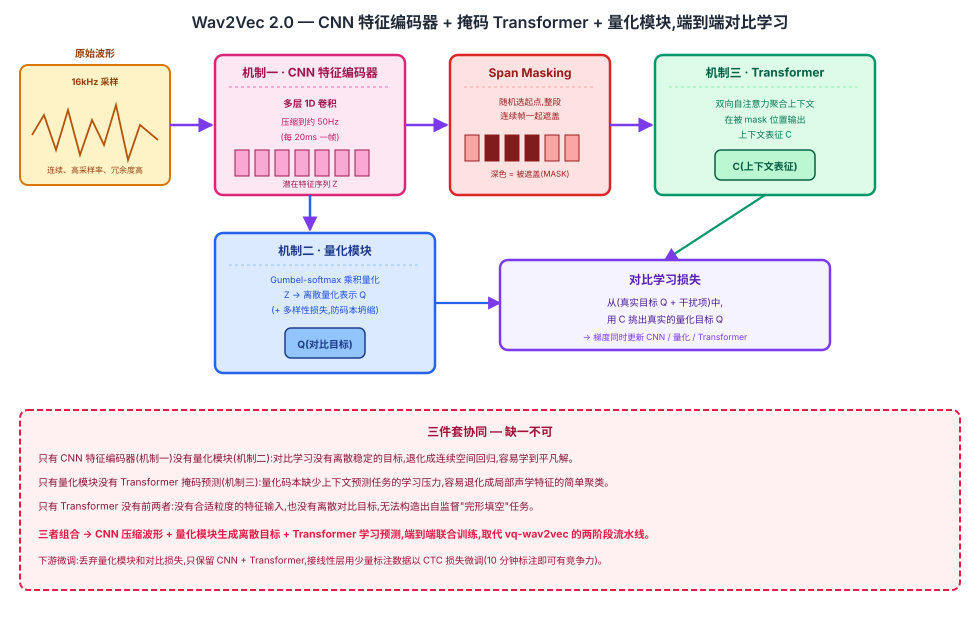

## 前作进展

语音识别长期依赖"手工特征(如 MFCC)+ 声学模型 + 语言模型"这套流水线:先用信号处理方法把原始波形转成梅尔频率倒谱系数等手工特征,再训练一个声学模型把特征映射到音素或字符,最后配合语言模型做解码。这条流水线的每一步都需要大量人工转写的标注数据来训练声学模型——高质量语音标注需要专业转写员逐字核对时间戳和文字内容,成本很高,导致低资源语言、方言、特定领域场景的语音识别覆盖始终有限。

早期的自监督尝试已经开始探索"先在无标注音频上预训练、再做下游任务"这条路。同一批作者在 2019 年提出的 **wav2vec** 用对比预测编码(CPC)式的目标,在原始波形上做自监督预训练,证明预训练得到的特征可以直接接给传统声学模型用,带来实际的 WER 提升;同年的 **vq-wav2vec** 进一步引入向量量化,把连续特征离散化成类似"语音单词"的离散单元,再把这些离散单元喂给 BERT 做第二阶段的上下文建模。但这两个方向都有明显局限:表征质量和下游任务的提升幅度比较有限,更关键的是量化和上下文建模是完全分离的两阶段训练——vq-wav2vec 先用一个独立目标训练量化模块把语音离散化,量化模块训练完就冻结,再单独训练一个 BERT 模型在离散单元序列上做掩码预测。这种两阶段流水线式的训练无法端到端联合优化,量化模块学到的离散单元也不一定是对下游上下文建模最有利的切分方式。

## 核心思想 + 直觉

Wav2Vec 2.0 的核心洞察是:把"学习连续表征"和"学习离散量化目标"放进同一个端到端训练过程里,而不是像 vq-wav2vec 那样分成互相独立的两个阶段。模型在做掩码预测的同时,联合学习一套量化码本作为对比学习的目标——量化模块和 Transformer 编码器一起被同一个损失函数训练,量化码本会随着上下文编码器的学习而动态调整,两者相互适配。

这个思路在直觉上类似 BERT 的掩码语言建模:遮住一部分输入,让模型根据上下文猜被遮住的内容是什么。但语音是连续信号,不像文本天然有离散的"词"作为预测目标——如果直接在连续特征空间里做回归式的"猜测",模型很容易学到一个平凡解(比如永远预测局部均值),因为连续空间没有清晰的"对/错"边界。Wav2Vec 2.0 的解法是额外引入一个可学习的量化步骤,把连续特征转换成离散的量化表示,这样掩码预测就可以被表述成一个有明确候选集合的对比学习问题:给定上下文,模型需要从一批离散候选里挑出真正被遮住位置对应的那个,这比连续空间的回归任务有清晰得多的学习信号。

## 机制一:CNN 特征编码器

原始波形是 16kHz 采样的一维序列,信息密度很低、冗余度很高,直接在采样点粒度上做 Transformer 建模计算量过大。Wav2Vec 2.0 用一个多层一维卷积网络(feature encoder)把原始波形逐层降采样,压缩成一个频率大约 50Hz(即每 20 毫秒一帧)的潜在特征序列 $Z$。这一步的作用类似图像模型里的 patch 化或早期卷积层:把高频、冗余的原始信号转换成更紧凑、更适合后续序列建模的表示,同时保留语音里说话内容相关的结构信息,丢弃掉与内容无关的高频细节。

## 机制二:量化模块 + 对比学习目标

CNN 编码器输出的 $Z$ 仍然是连续向量,不能直接作为掩码预测的"标准答案"。Wav2Vec 2.0 用 Gumbel-softmax 实现的乘积量化(product quantization)把 $Z$ 映射成离散的量化表示 $Q$:维护若干个码本(codebook),每个码本包含若干条目,量化时从每个码本里(可导地)挑出一条,再拼接起来得到最终的离散表示,这样码本条目数量的组合数远大于单个大码本能提供的容量,同时保持参数量可控。

训练时,模型先对 $Z$ 的一部分连续帧做随机 mask,然后要求 Transformer 从被 mask 位置的上下文里预测出该位置对应的量化表示 $Q$。这个预测被表述成对比学习:给定一批候选(其中只有一个是真实的量化目标,其余是从同一个序列里采样出的干扰项),模型需要让上下文表征与真实量化目标的相似度显著高于与干扰项的相似度。为了防止量化码本退化成只用少数几个条目(表征坍缩),损失里还额外加了一个多样性损失(diversity loss),鼓励训练过程中码本里的所有条目都被均匀地用到。

## 机制三:Transformer 上下文编码 + 掩码预测

CNN 输出的潜在特征序列在被送入 Transformer 之前,会随机选取若干起始位置,对每个起始位置往后的一段连续帧做整体遮盖(span masking),而不是像 BERT 那样零散地遮盖单个位置——因为语音相邻帧高度相关,遮盖单帧的信息很容易从紧邻帧插值出来,起不到强迫模型学习长程上下文的效果。被部分遮盖的序列送进标准的 Transformer encoder,得到融合了双向上下文的表征 $C$。训练目标就是用 $C$ 在被遮盖的位置去预测机制二里定义的量化目标 $Q$,梯度沿着这条路径反传,同时更新 CNN 特征编码器、量化模块和 Transformer 三部分的参数,是完全端到端的联合训练。

预训练完成后,下游微调阶段会丢弃量化模块和对比学习目标,只保留 CNN 编码器 + Transformer 这部分权重,在其上接一个线性输出层,用少量标注数据以 CTC 损失微调成语音识别模型。



*图 1:原始波形先经过 CNN 特征编码器压缩成潜在特征序列,随机 mask 一部分帧后送入 Transformer 得到上下文表征;同时潜在特征也被量化模块离散化为对比学习的目标;上下文表征在被 mask 的位置与量化目标做对比学习,三部分端到端联合训练。*

## 三件套协同

三个机制缺一不可,拆开任何一个都无法复现 Wav2Vec 2.0 的效果:

- 只有 **CNN 特征编码器**(机制一)没有**量化模块**(机制二):对比学习没有一个离散、稳定的预测目标可用,只能退化成在连续特征空间里做回归,容易学到平凡解(比如预测局部均值),学不到有区分度的语音表征。
- 只有**量化模块**没有**Transformer 掩码预测**(机制三):量化码本失去了"要支撑上下文预测任务"这个学习压力,容易退化成对局部声学特征的简单聚类,学不到长程语音结构。
- 只有 **Transformer** 没有前两者:没有 CNN 把原始波形压缩成合适粒度的特征序列,也没有量化模块提供离散对比目标,根本无法构造出这套自监督训练所需要的"完形填空"任务。

三者组合起来,CNN 负责把原始波形压缩成合适粒度的连续特征,量化模块把这些特征离散化成对比学习的目标,Transformer 在被 mask 的上下文里学习预测这些目标——三部分共享同一个损失、端到端联合训练,这正是 Wav2Vec 2.0 相对 vq-wav2vec 两阶段流水线的核心突破所在。

## 关键代码

CNN 特征编码器 + Gumbel-softmax 量化 + Transformer 掩码对比学习损失的简化 PyTorch 风格伪代码(不追求完整可运行,展示核心逻辑):

```python
import torch
import torch.nn as nn
import torch.nn.functional as F


class FeatureEncoder(nn.Module):
    """机制一:多层 1D 卷积,把 16kHz 原始波形降采样到约 50Hz 的潜在特征序列 Z"""
    def __init__(self, conv_channels=512, strides=(5, 2, 2, 2, 2, 2, 2)):
        super().__init__()
        layers = []
        in_ch = 1
        for stride in strides:                          # 总下采样倍数 = 5*2^6 = 320
            layers.append(nn.Conv1d(in_ch, conv_channels, kernel_size=3, stride=stride))
            layers.append(nn.GELU())
            in_ch = conv_channels
        self.conv = nn.Sequential(*layers)

    def forward(self, waveform):        # waveform: (B, 1, T_raw)
        return self.conv(waveform).transpose(1, 2)   # -> (B, T, C),16000Hz / 320 ≈ 每 20ms 一帧(约 50Hz)


class GumbelQuantizer(nn.Module):
    """机制二:乘积量化,Gumbel-softmax 可导地从每个码本挑一个条目,拼接得到离散目标 Q"""
    def __init__(self, dim, num_codebooks=2, codebook_size=320, out_dim=256):
        super().__init__()
        self.num_codebooks = num_codebooks
        self.codebook_size = codebook_size
        self.logits_proj = nn.Linear(dim, num_codebooks * codebook_size)
        self.codebooks = nn.Parameter(torch.randn(num_codebooks, codebook_size, out_dim // num_codebooks))

    def forward(self, z, tau=1.0):
        logits = self.logits_proj(z).view(*z.shape[:-1], self.num_codebooks, self.codebook_size)
        probs = F.gumbel_softmax(logits, tau=tau, hard=True, dim=-1)  # (B, T, num_codebooks, codebook_size)
        q = torch.einsum("btkc,kcd->btkd", probs, self.codebooks)     # 按码本挑条目
        q = q.reshape(*z.shape[:-1], -1)                               # 拼接多个码本 -> 离散目标 Q
        diversity_loss = (probs.mean(dim=(0, 1)) * probs.mean(dim=(0, 1)).clamp_min(1e-8).log()).sum()
        return q, diversity_loss    # diversity_loss = -entropy,最小化它等价于最大化熵,鼓励码本条目被均匀使用


def span_mask(z, mask_prob=0.065, mask_length=10):
    """机制三前置步骤:随机选起点,对每个起点往后 mask_length 帧整体遮盖"""
    B, T, _ = z.shape
    mask = torch.zeros(B, T, dtype=torch.bool)
    num_starts = int(T * mask_prob)
    for b in range(B):
        starts = torch.randperm(T - mask_length)[:num_starts]
        for s in starts:
            mask[b, s:s + mask_length] = True
    return mask


def contrastive_loss(context, quantized, mask, num_distractors=100, temperature=0.1):
    """机制三:在被 mask 的位置,用上下文表征从(真实目标 + 干扰项)里挑出真实量化目标"""
    ctx_masked = context[mask]          # 被 mask 位置的上下文表征 C
    pos_targets = quantized[mask]       # 对应位置的真实量化目标(正样本)
    neg_targets = sample_distractors(quantized, mask, num_distractors)  # 同序列内采样的负样本
    candidates = torch.cat([pos_targets.unsqueeze(1), neg_targets], dim=1)
    sim = F.cosine_similarity(ctx_masked.unsqueeze(1), candidates, dim=-1) / temperature
    labels = torch.zeros(sim.size(0), dtype=torch.long)   # 正样本永远放在第 0 位
    return F.cross_entropy(sim, labels)


class Wav2Vec2(nn.Module):
    def __init__(self, dim=512):
        super().__init__()
        self.feature_encoder = FeatureEncoder(conv_channels=dim)   # 机制一
        self.quantizer = GumbelQuantizer(dim)                       # 机制二
        self.transformer = nn.TransformerEncoder(
            nn.TransformerEncoderLayer(d_model=dim, nhead=8), num_layers=12)  # 机制三
        self.mask_embedding = nn.Parameter(torch.randn(dim))

    def forward(self, waveform):
        z = self.feature_encoder(waveform)              # (B, T, C) 连续潜在特征
        quantized, diversity_loss = self.quantizer(z)    # 离散对比目标 Q(与 z 联合训练)
        mask = span_mask(z)
        z_masked = z.clone()
        z_masked[mask] = self.mask_embedding             # 用可学习的 mask token 替换被遮盖帧
        context = self.transformer(z_masked)              # 上下文表征 C
        contrast_loss = contrastive_loss(context, quantized, mask)
        return contrast_loss + 0.1 * diversity_loss        # 对比损失 + 多样性损失,端到端联合训练
```

下游微调时会丢弃 `quantizer` 和对比损失,只保留 `feature_encoder` + `transformer`,在其输出上接一个线性层,用少量标注数据以 CTC 损失微调;这也呼应了自监督对比学习与 [foundations/08-attention-mechanism](../foundations/08-attention-mechanism) 里注意力机制作为上下文建模核心组件的通用角色——Transformer 在这里承担的正是"用双向注意力聚合上下文来完成完形填空"这个通用能力。

## 性能数据

*(以下数字来自训练知识回忆,未经实时核实,建议读者核对原论文 arXiv:2006.11477 及其 Librispeech 微调结果表确认准确数值)*

论文最引人注目的结果是在极低资源标注场景下的微调效果。用 Librispeech 960 小时无标注音频预训练大模型(LARGE,约 300M 参数)之后,分别用不同规模的标注数据做微调:

- **仅 10 分钟标注数据**:微调后在 Librispeech test-clean 上的 WER 大约在 5% 左右量级,这是论文最强调的结果——此前几乎不可能用如此少的标注数据训出可用的语音识别系统,证明自监督预训练把绝大部分"学语音结构"的工作转移到了无标注数据上,下游只需要极少标注数据来"对齐"到具体的识别任务。
- **1 小时标注数据**:WER 进一步下降,已经接近部分此前需要成百上千小时标注数据才能达到的水平。
- **100 小时标注数据(train-clean-100)**:WER 大约在 2% 左右量级,已经和此前全监督方法用同等标注量训练的结果相当或更好。
- **960 小时全量标注数据**:微调后的 WER 达到当时接近或匹配全监督 SOTA 的水平,说明自监督预训练即使在标注数据充足的场景下依然能带来提升,不只是"省标注数据"这一个价值。

方向性结论(把握较高):标注数据规模从 960 小时压缩到 10 分钟,WER 的下降幅度远小于此前监督方法在同等标注数据压缩比例下的退化幅度,这正是自监督预训练"用无标注数据换标注数据"这个价值主张的核心证据。

## 影响 / 后续

Wav2Vec 2.0 证明了自监督预训练在语音领域同样可行且效果显著——不只是"能用",而是能把标注数据需求压缩到几乎可以忽略的程度,这个结果直接类比了 BERT 在 NLP 领域证明"预训练 + 少量微调"范式可行时带来的冲击。它催生了大量后续自监督语音表征工作,评测基准(如 SUPERB)也迅速把"用 Wav2Vec 2.0 类模型的冻结表征做各种下游语音任务"当成标准评估协议。

其中最直接的后续是 **HuBERT**:Wav2Vec 2.0 的量化模块和 Transformer 编码器在训练过程中是联合演化的——量化码本随着表征学习不断变化,导致对比学习的目标本身在训练早期不够稳定,还需要精心设计负样本采样策略来避免退化。HuBERT 正是为了解决这个训练稳定性问题而提出的:用离线 k-means 聚类对声学特征生成固定的离散伪标签,把不稳定的对比学习目标换成稳定的分类任务目标。

→ [02-hubert.md](02-hubert.md) · 解决本文对比学习目标联合演化导致的训练不稳定问题
