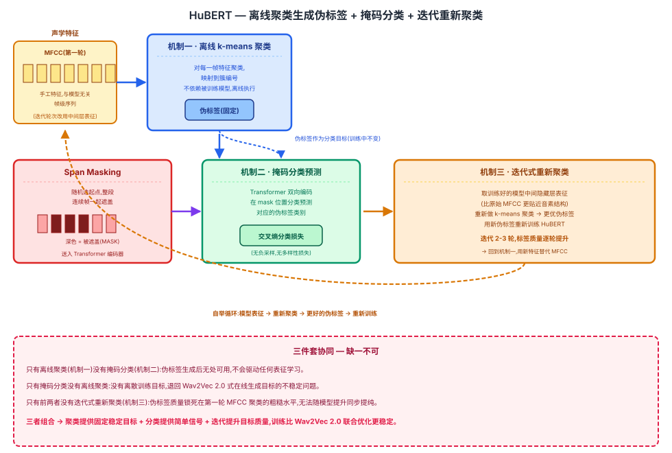

## 前作进展

[Wav2Vec 2.0](01-wav2vec2.md) 把"学习连续表征"和"学习离散量化目标"放进同一个端到端训练过程联合优化:量化模块和 Transformer 编码器共享同一个损失函数,量化码本随着上下文编码器的学习动态调整。这个联合演化的设计在训练早期会带来一个结构性问题——量化码本在训练刚开始时还很随机、质量差,把这样一个低质量的码本当作对比学习的目标去训练 Transformer,相当于让模型在噪声信号上学习,容易导致训练早期不稳定。为了让对比学习不至于退化,Wav2Vec 2.0 还需要额外的多样性损失来防止码本坍缩,以及精心设计负样本采样策略来避免正负样本被发音相似的片段混淆——这些都是对比学习这条路线为了工作起来而必须付出的额外复杂度和调参成本。

HuBERT 的作者正是瞄准这个训练稳定性问题:能不能把"生成离散目标"这一步彻底从端到端训练中拿出来,变成一个固定不变、不随主模型训练而演化的独立步骤?

## 核心思想 + 直觉

HuBERT 的核心洞察是把"生成离散目标"和"学习上下文表征"这两个步骤彻底解耦成两个独立阶段:先用一个离线的、不依赖被训练模型本身的聚类步骤,为每一帧语音生成一套固定的离散伪标签;再让 Transformer 去做一个标准的、类似 BERT 的掩码分类任务——预测被遮盖位置对应的伪标签类别。

这个思路在直觉上和 Wav2Vec 2.0 想解决的是同一个问题(连续语音信号没有天然的离散预测目标),但走了一条完全不同的路。Wav2Vec 2.0 选择让模型自己在训练中学出一套离散目标,代价是目标本身在训练过程中不稳定;HuBERT 选择在训练开始前就用聚类把目标固定下来,训练过程中目标不再变化,Transformer 要做的纯粹是一个分类任务,不需要负采样、不需要多样性损失来防止目标退化。伪标签的质量自然不如一个训练充分的量化模块精细,但因为目标在整个训练过程中保持稳定,反而给了优化过程一个更清晰、更容易收敛的信号。

## 机制一:离线聚类生成伪标签

第一轮迭代直接对传统声学特征(如 MFCC)做 k-means 聚类:把每一帧语音的声学特征映射到某个聚类中心的类别编号,这个类别编号就是这一帧的伪标签。MFCC 是完全独立于 HuBERT 模型本身计算出来的手工特征,聚类过程也不涉及任何梯度反传,所以这一步生成的伪标签在整个训练过程中是固定不变的。

这批第一轮伪标签的质量并不高——k-means 在传统声学特征上聚出来的类别边界和真实的音素边界不完全对齐,同一个音素的不同帧可能被分到不同类别,不同音素的帧也可能被错误地聚到同一类别。但即便是这样粗糙的伪标签,也已经携带了比"随机"好得多的语音结构信息,足以启动第一轮的掩码预测训练。

## 机制二:BERT 式掩码预测

把输入特征序列的若干片段做 span masking(和 Wav2Vec 2.0 类似,随机选起点、对连续一段帧整体遮盖,而不是像文本 BERT 那样零散遮盖单个位置),送入 Transformer 编码器得到融合上下文的表征。在每个被 mask 的位置,接一个线性分类头,预测机制一里为这一帧生成的伪标签类别,用标准的交叉熵损失训练。

这是一个纯粹的多分类任务:类别数就是 k-means 聚类的簇数(如 100 或几百类),不涉及对比学习里"从一批候选中挑出正样本"的负采样过程,也不需要为了防止目标退化而额外设计多样性损失。损失函数只在被 mask 的位置计算,迫使模型必须依赖双向上下文才能猜对被遮盖帧的类别,这一点和 Wav2Vec 2.0 的掩码机制在目的上是一致的,区别只在于"猜"的形式是分类还是对比。

## 机制三:迭代式重新聚类

训练完第一轮 HuBERT 模型之后,并不是就此结束。第一轮模型的某个中间隐藏层(通常不是最后一层,而是网络中段的某一层)此时已经学到了比原始 MFCC 更贴近语音内容结构的表征,因为它是在"预测伪标签"这个任务的监督下训练出来的,天然会把发音相似的帧聚拢、把不同发音的帧分开。用这个中间层的表征重新做一次 k-means 聚类,得到的新伪标签通常比第一轮直接对 MFCC 聚类的结果更贴近真实音素边界。

用这套质量更高的新伪标签重新训练一版 HuBERT,得到的模型表征质量会进一步提升,理论上又可以再拿去做下一轮聚类。这个"训练模型 → 用模型自身中间层特征重新聚类 → 用新伪标签重新训练"的自举(bootstrap)过程论文中通常进行 2 轮,每一轮伪标签的音素区分度都比上一轮更好,模型表征质量也随之提升。



*图 1:第一轮先对 MFCC 做 k-means 聚类生成初始伪标签,Transformer 在被 mask 的位置做分类预测;训练完成后用模型中间层表征重新聚类,生成更贴近音素边界的新伪标签,再重新训练,如此迭代 2 轮。*

## 三件套协同

三个机制缺一不可,拆开任何一个都无法复现 HuBERT 的效果:

- 只有**离线聚类**(机制一)没有**掩码预测**(机制二):伪标签生成出来之后无处可用,不会驱动任何表征学习,聚类步骤本身没有意义。
- 只有**掩码预测**没有**离线聚类**:Transformer 没有离散的训练目标可预测,退化回和 Wav2Vec 2.0 一样需要在线生成目标的问题,也就绕不开量化目标不稳定的原始痛点。
- 只有前两者没有**迭代式重新聚类**(机制三):伪标签质量永远停留在第一轮对原始 MFCC 聚类的粗糙水平,无法随着模型表征质量的提升而同步提纯,模型的上限会被锁死在"用一份质量一般的伪标签能学到多好"这个天花板上。

三者组合起来,HuBERT 才能用一条完全解耦、逐轮自举提升的训练路径:聚类提供固定稳定的目标,掩码分类提供简单直接的学习信号,迭代重新聚类让目标质量随着模型能力同步进化——最终达到比 Wav2Vec 2.0 联合优化路线更稳定的训练过程,下游效果也相当或更好。

## 关键代码

k-means 聚类生成伪标签 + Transformer 掩码分类损失的简化 PyTorch 风格伪代码(不追求完整可运行,展示核心逻辑,忽略了实际实现中的批处理细节):

```python
import torch
import torch.nn as nn
import torch.nn.functional as F
from sklearn.cluster import KMeans


def generate_pseudo_labels(features, num_clusters=100):
    """机制一:离线 k-means 聚类,输入是一批帧级声学特征(如 MFCC 或某轮模型的中间层输出)
    features: (N, D) numpy array,N 是所有音频拼起来的总帧数
    返回每一帧对应的簇编号,作为固定不变的伪标签"""
    kmeans = KMeans(n_clusters=num_clusters, n_init=10)
    kmeans.fit(features)
    return kmeans.labels_          # (N,),每一帧的伪标签类别,训练过程中不再更新


def span_mask(x, mask_prob=0.08, mask_length=10):
    """随机选起点,对每个起点往后 mask_length 帧整体遮盖(与 Wav2Vec 2.0 的 span masking 思路一致)"""
    B, T, _ = x.shape
    mask = torch.zeros(B, T, dtype=torch.bool)
    num_starts = int(T * mask_prob)
    for b in range(B):
        starts = torch.randperm(T - mask_length)[:num_starts]
        for s in starts:
            mask[b, s:s + mask_length] = True
    return mask


class HuBERT(nn.Module):
    def __init__(self, feat_dim=80, dim=768, num_clusters=100):
        super().__init__()
        self.feature_proj = nn.Linear(feat_dim, dim)     # 把输入特征(如 MFCC)投影到模型维度
        self.transformer = nn.TransformerEncoder(
            nn.TransformerEncoderLayer(d_model=dim, nhead=12), num_layers=12)
        self.mask_embedding = nn.Parameter(torch.randn(dim))
        self.classify_head = nn.Linear(dim, num_clusters)  # 机制二:预测伪标签类别,而非对比目标

    def forward(self, feats, pseudo_labels):
        # feats: (B, T, feat_dim) 输入特征;pseudo_labels: (B, T) 机制一预先算好、固定不变的伪标签
        x = self.feature_proj(feats)
        mask = span_mask(x)
        x_masked = x.clone()
        x_masked[mask] = self.mask_embedding          # 用可学习的 mask token 替换被遮盖帧
        context = self.transformer(x_masked)            # 双向上下文表征
        logits = self.classify_head(context)             # (B, T, num_clusters)

        # 只在被 mask 的位置计算交叉熵分类损失,不涉及负采样或多样性损失
        loss = F.cross_entropy(logits[mask], pseudo_labels[mask])
        return loss, context


def extract_mid_layer_features(model, feats, layer_idx=6):
    """机制三:取某一轮训练好的模型的中间隐藏层输出,作为下一轮重新聚类的输入特征"""
    with torch.no_grad():
        x = model.feature_proj(feats)
        for i, layer in enumerate(model.transformer.layers):
            x = layer(x)
            if i == layer_idx:
                return x                                  # (B, T, dim),中间层表征,比原始 MFCC 更贴近音素结构
    return x


# 迭代自举流程(伪代码,实际每轮都是独立的完整训练):
# round1_labels = generate_pseudo_labels(mfcc_features)                     # 第一轮:对 MFCC 聚类
# model1 = train(HuBERT(), mfcc_features, round1_labels)                     # 训练第一轮模型
# mid_feats = extract_mid_layer_features(model1, mfcc_features)              # 提取中间层表征,(B, T, dim) torch.Tensor
# mid_feats_flat = mid_feats.reshape(-1, mid_feats.shape[-1]).detach().cpu().numpy()  # 展平成 (N, D) numpy,供 k-means 使用
# round2_labels = generate_pseudo_labels(mid_feats_flat)                     # 第二轮:对中间层表征重新聚类
# model2 = train(HuBERT(), mfcc_features, round2_labels)                     # 用更好的伪标签重新训练
# 论文中通常迭代 2 轮,伪标签质量逐轮提升
```

## 性能数据

*(以下数字来自训练知识回忆,未经实时核实,建议读者核对原论文 arXiv:2106.07447 及其 Librispeech 微调结果表确认准确数值)*

论文同样在 Librispeech 960 小时无标注数据上预训练(对齐 Wav2Vec 2.0 的实验设置以便直接比较),再用不同规模的标注数据微调:

- **10 分钟标注数据**:HuBERT 的 WER 与同规模的 Wav2Vec 2.0 大致相当或略有优势,尤其是在 LARGE 规模模型上这个优势更明显一些,说明离线聚类目标带来的更稳定训练过程在极低资源场景下依然能保持竞争力。
- **1 小时 / 10 小时标注数据**:两者整体接近,HuBERT 在部分设置下略胜一筹。
- **100 小时 / 960 小时标注数据**:随着标注数据增多,两者差距进一步缩小,都能达到接近全监督 SOTA 的水平。

论文强调的定性结论(把握较高)是训练稳定性和收敛过程本身的差异,而不只是最终 WER 的高低:由于目标在训练过程中固定不变,HuBERT 不需要像 Wav2Vec 2.0 那样依赖精心调过的负采样策略和多样性损失来防止目标退化,训练过程整体更简单、对超参数的敏感度更低;经过迭代重新聚类后,后续轮次的伪标签质量(用聚类结果和真实音素标注的对齐度衡量)相比第一轮有明显提升,这也是论文用来证明"自举"这一设计有效性的关键实验证据。

## 影响 / 后续

HuBERT 证明了"离线聚类生成固定目标 + 掩码分类"这条更简单、更稳定的自监督路线,在效果上完全可以和 Wav2Vec 2.0 的端到端对比学习路线分庭抗礼,甚至在训练稳定性和实现复杂度上更有优势。这也让"用离散伪标签做语音自监督学习"成为 Wav2Vec 2.0 之后另一条被广泛验证的主流分支,后续不少工作(包括语音语言模型里把语音转成离散 token 序列再用语言模型建模的技术路线)都借鉴了 HuBERT 这套"聚类产生离散单元"的思路。

→ [01-wav2vec2.md](01-wav2vec2.md) · 本文解决的对比学习训练不稳定问题
→ [04-audiolm.md](04-audiolm.md) · 本文的离散伪标签思路呼应该文语义 token 的技术路线
