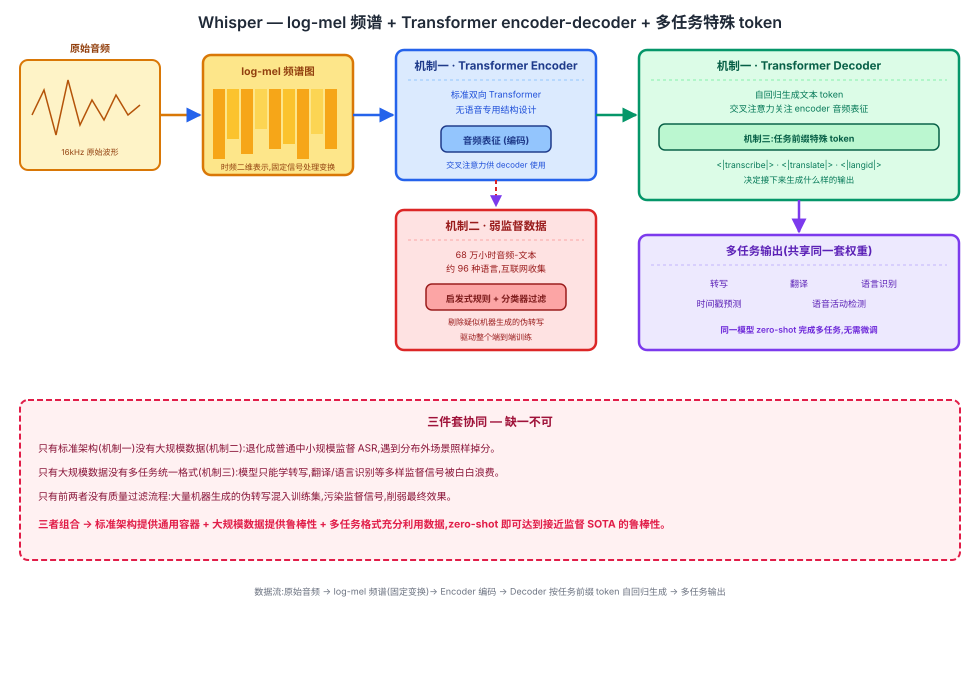

## 前作进展

[Wav2Vec 2.0](01-wav2vec2.md) 和 [HuBERT](02-hubert.md) 都遵循同一条范式:先在海量无标注音频上做自监督预训练,学到一套可迁移的语音表征,再用少量标注数据在下游任务(通常是 Librispeech 这样的单一数据集)上微调,才能得到一个真正能做语音识别的模型。这条路径的价值主张非常清楚——Wav2Vec 2.0 证明了仅用 10 分钟标注数据微调就能得到可用的识别系统,HuBERT 用更稳定的离线聚类目标进一步巩固了这条路线。但两者共享一个结构性局限:预训练阶段学到的是"通用语音表征",真正要落地成一个语音识别器,仍然离不开在某个具体数据集上的微调这一步,而微调过程本质上是让模型去适配这个数据集的口音分布、录音条件、话题领域。一旦部署场景和微调数据的分布不一致——换了口音、换了背景噪音环境、换了录音设备——识别效果就可能明显下降,这种"分布内表现优秀、分布外脆弱"的问题在两篇论文本身的评测里都没有被系统性地检验,因为两者报告的 WER 几乎全部来自 Librispeech(如 test-clean)这样单一、干净的测试集。

换句话说,自监督预训练解决的是"标注数据不够"的问题,却没有直接解决"识别系统够不够鲁棒"的问题——这两者是两个独立的维度,前作的重心完全在前者。

## 核心思想 + 直觉

Whisper 的核心洞察是反过来走一条路:与其在无标注数据上做精巧的自监督预训练、再想办法用少量标注数据微调,不如直接收集海量、多样、弱监督(不追求每条转写都完美准确,允许存在噪声,靠数据规模去稀释噪声的影响)的音频-文本配对数据,用一个标准的序列到序列模型做端到端的有监督训练。这样模型在训练阶段就已经见过足够多样的语言、口音、录音条件、背景噪音组合,不需要针对任何具体部署场景做微调(zero-shot),就自带较强的泛化能力。

这本质上是"用规模换鲁棒性":GPT-3 证明了把语言模型训练数据和参数量都推到足够大规模,模型就能在没见过的任务上做出合理的少样本甚至零样本泛化;Whisper 把同样的逻辑搬到语音识别上——不是让架构变得更聪明,而是让训练数据的规模和多样性大到让"过拟合到单一数据集分布"这件事根本无从发生。这也是为什么 Whisper 刻意选用没有任何语音专用花活的标准 Transformer:它要验证的正是"数据规模而非架构精巧"这条经验在语音领域依然成立。

## 机制一:标准 Transformer encoder-decoder + log-mel 频谱输入

Whisper 不在原始波形上直接建模,而是先把音频转换成 log-mel 频谱图(log-mel spectrogram)——这是语音处理里的常规特征表示,把时域波形转成时频二维表示,压缩了原始波形的采样点密度,同时保留了对语音识别有用的频谱结构。这一步和 Wav2Vec 2.0 用 CNN 特征编码器直接在原始波形上学习降采样表征的做法不同:Whisper 用的是固定的信号处理变换,不需要额外学习。

频谱特征送入一个标准的 Transformer encoder 做双向编码,decoder 则以自回归的方式逐 token 生成输出文本,和机器翻译里常见的 encoder-decoder 架构没有本质区别。整个模型没有任何语音专用的结构设计——没有 CTC 对齐、没有语音专用的位置编码技巧、没有针对音素或声学单元的特殊建模。这种"平淡无奇"的架构选择是刻意的:如果一个毫无特殊设计的标准架构,单靠数据规模就能打出很强的效果,恰恰说明架构精巧不是语音识别效果的瓶颈,数据才是。

## 机制二:大规模弱监督数据收集与过滤

Whisper 的训练数据来自互联网上大规模收集的音频及其配对文字(如字幕、转写稿等),总量约 68 万小时,覆盖约 96 种语言。这个规模比此前任何一个语音识别训练集都大出一到两个数量级,但代价是数据质量参差不齐:字幕和转写的来源五花八门,其中不少并非人工转写,而是别的自动化系统生成的转写或机器翻译结果——这些"伪转写"如果不加甄别地混入训练集,质量差、错误模式各异,反而会污染监督信号。

为此,作者设计了一系列启发式规则和分类器,专门用来识别并过滤掉疑似机器生成而非人工转写/翻译的样本,尽量把训练数据里那些低质量、模式化的自动生成内容筛出去,保留更接近自然人工监督的那部分。这一步过滤是"弱监督"这个词里"弱"字的关键平衡点:数据不追求完美干净(那样规模不可能做到 68 万小时),但也不能完全不加过滤地照单全收。

## 机制三:多任务统一格式

Whisper 并不只做"语音转文本"这一件事。转写(同语言语音转文本)、翻译(任意语言语音转英文文本)、语言识别、时间戳预测、语音活动检测等多个任务,被统一编码进同一个序列到序列格式里:decoder 生成序列的最前面几个 token 是特殊的任务指定 token,用来告诉模型接下来要做的是转写还是翻译、目标语言是什么、是否需要输出时间戳。模型根据这个前缀读出任务类型,再决定接下来该生成什么样的输出序列。

这样一个模型就同时具备多种能力,不需要为每个任务单独训练一套参数,也不需要额外的任务专用输出头——所有任务共享同一套 encoder-decoder 权重,任务的切换完全靠 decoder 输入端的特殊 token 来控制。



*图 1:原始音频先转换成 log-mel 频谱图,送入标准 Transformer encoder 编码;decoder 以任务指定的特殊 token(转写/翻译/语言识别/时间戳)作为前缀,自回归生成对应任务的输出序列;68 万小时弱监督多语言数据经过质量过滤后驱动整个端到端训练。*

## 三件套协同

三个机制缺一不可,拆开任何一个都无法复现 Whisper 的零样本鲁棒性:

- 只有**标准架构**(机制一)没有**大规模数据**(机制二):退化成一个普通的中小规模监督 ASR 模型,架构本身不带来任何鲁棒性优势,遇到训练分布之外的口音或噪音场景照样会掉分。
- 只有**大规模数据**没有**多任务统一格式**(机制三):模型只能学会单一的转写任务,68 万小时数据里蕴含的翻译对、语言标签、时间戳信息等多样监督信号被白白浪费,数据的价值没有被充分利用。
- 只有前两者没有**质量过滤流程**:大量低质量的机器生成"伪转写"会混入训练集,污染监督信号,削弱最终模型的识别质量,规模优势被噪声抵消一部分。

三者组合起来,标准架构提供了一个足够通用、不对特定任务做过拟合假设的容器,大规模多样数据提供了鲁棒性的来源,过滤流程保证了这些数据的监督信号质量,多任务格式让海量数据里的每一种信号都被利用起来——这正是 Whisper 能够在完全不针对任何具体数据集微调的情况下,就达到接近甚至超过监督微调模型鲁棒性的核心原因。

## 关键代码

log-mel 频谱预处理 + 标准 Transformer encoder-decoder + 多任务特殊 token 前缀的简化 PyTorch 风格伪代码(不追求完整可运行,展示核心逻辑):

```python
import torch
import torch.nn as nn
import torch.nn.functional as F
import torchaudio


def log_mel_spectrogram(waveform, sample_rate=16000, n_mels=80, hop_length=160):
    """机制一前置步骤:原始波形 -> log-mel 频谱图
    waveform: (B, T_raw) 16kHz 原始波形
    返回: (B, n_mels, T_frames),T_frames ≈ T_raw / hop_length,每帧对应 10ms"""
    mel_transform = torchaudio.transforms.MelSpectrogram(
        sample_rate=sample_rate, n_mels=n_mels, hop_length=hop_length)
    mel = mel_transform(waveform)                       # (B, n_mels, T_frames)
    log_mel = torch.log(mel.clamp(min=1e-10))            # 取对数压缩动态范围
    return log_mel.transpose(1, 2)                        # -> (B, T_frames, n_mels)


class WhisperEncoder(nn.Module):
    """机制一:标准 Transformer encoder,双向编码 log-mel 频谱特征"""
    def __init__(self, n_mels=80, dim=512, n_layers=6, n_heads=8):
        super().__init__()
        self.input_proj = nn.Linear(n_mels, dim)
        self.pos_embedding = nn.Parameter(torch.randn(1, 1500, dim))  # 固定最大帧数的位置编码
        self.layers = nn.TransformerEncoder(
            nn.TransformerEncoderLayer(d_model=dim, nhead=n_heads, batch_first=True),
            num_layers=n_layers)

    def forward(self, log_mel):          # log_mel: (B, T_frames, n_mels)
        x = self.input_proj(log_mel)      # (B, T_frames, dim)
        x = x + self.pos_embedding[:, :x.size(1), :]
        return self.layers(x)              # (B, T_frames, dim) 编码后的音频表征


class WhisperDecoder(nn.Module):
    """decoder 自回归生成文本 token,第一个生成的 token 是任务指定前缀
    (如 <|transcribe|>/<|translate|>/<|langid|>,由 vocab 里的特殊 token id 表示)"""
    def __init__(self, vocab_size, dim=512, n_layers=6, n_heads=8, max_len=448):
        super().__init__()
        self.token_embedding = nn.Embedding(vocab_size, dim)
        self.pos_embedding = nn.Parameter(torch.randn(1, max_len, dim))
        decoder_layer = nn.TransformerDecoderLayer(d_model=dim, nhead=n_heads, batch_first=True)
        self.layers = nn.TransformerDecoder(decoder_layer, num_layers=n_layers)
        self.output_proj = nn.Linear(dim, vocab_size)

    def forward(self, token_ids, encoder_out):
        # token_ids: (B, T_text),第 0 位是任务前缀 token(如 <|transcribe|><|en|>)
        # encoder_out: (B, T_frames, dim) 来自机制一的音频表征
        x = self.token_embedding(token_ids) + self.pos_embedding[:, :token_ids.size(1), :]
        causal_mask = nn.Transformer.generate_square_subsequent_mask(token_ids.size(1))
        x = self.layers(tgt=x, memory=encoder_out, tgt_mask=causal_mask)  # 自回归 + 交叉注意力关注音频表征
        return self.output_proj(x)          # (B, T_text, vocab_size) 每个位置的下一 token 分布


class Whisper(nn.Module):
    def __init__(self, n_mels=80, vocab_size=51865, dim=512):
        super().__init__()
        self.encoder = WhisperEncoder(n_mels=n_mels, dim=dim)   # 机制一
        self.decoder = WhisperDecoder(vocab_size=vocab_size, dim=dim)  # 机制一

    def forward(self, waveform, token_ids):
        # token_ids 的前几位由机制三决定,例如:
        # [<|startoftranscript|>, <|en|>, <|transcribe|>, <|notimestamps|>, ...实际文本 token...]
        log_mel = log_mel_spectrogram(waveform)         # (B, T_frames, n_mels)
        encoder_out = self.encoder(log_mel)               # (B, T_frames, dim)
        logits = self.decoder(token_ids[:, :-1], encoder_out)  # 用前 T-1 个 token 预测下一个 token
        loss = F.cross_entropy(
            logits.reshape(-1, logits.size(-1)), token_ids[:, 1:].reshape(-1))
        return loss


# 机制三:多任务格式示例——同一个模型,不同的任务前缀 token 决定不同的行为
# 转写(中文语音 -> 中文文本):  [<|startoftranscript|>, <|zh|>, <|transcribe|>, <|notimestamps|>, ...]
# 翻译(中文语音 -> 英文文本):  [<|startoftranscript|>, <|zh|>, <|translate|>,   <|notimestamps|>, ...]
# 语言识别(不生成文本,只输出语言标签概率): [<|startoftranscript|>, <|langid|>]
# 带时间戳转写:               [<|startoftranscript|>, <|en|>, <|transcribe|>, <|0.00|>, ...]
```

## 性能数据

*(以下数字来自训练知识回忆,未经实时核实,建议读者核对原论文 arXiv:2212.04356 及其跨数据集 WER 结果表确认准确数值)*

Whisper 论文的核心实验设计和 Wav2Vec 2.0 / HuBERT 都只报告 Librispeech 单一数据集上的 WER 不同——它特意在几十个跨领域、跨录音条件的测试集(涵盖有噪音的电话录音、会议录音、不同口音的英语、多语言场景等)上评测零样本 WER,并把结果和专门在这些数据集各自的训练集上微调过的监督模型做对比。

方向性结论(把握较高):

- 在 Librispeech 这类干净、分布内的测试集上,Whisper 的零样本 WER 和专门微调过的监督模型相比没有明显优势,甚至可能略逊一筹——这符合预期,毕竟监督模型是针对性优化过的。
- 但在训练分布之外的测试集(嘈杂环境、不同口音、非常规录音条件)上,专门针对 Librispeech 微调的监督模型 WER 会明显上升,泛化能力较差;Whisper 的零样本 WER 相对更稳定,跨数据集之间的方差远小于监督基线,这正是论文标题里"Robust"(鲁棒)一词想强调的核心结果。
- 不同规模的 Whisper 模型(从 tiny 到 large,参数量从几千万到十几亿量级)呈现出清晰的规模-效果梯度:模型越大,零样本 WER 越低,鲁棒性优势也越明显,符合预训练规模化工作里常见的 scaling 规律。
- 在多语言、语音翻译等任务上,Whisper 同样展现出随模型规模提升而改善的趋势,虽然在低资源语言上的绝对效果仍明显弱于高资源语言(英语),这和训练数据里语言分布本身不均衡直接相关。

## 影响 / 后续

Whisper 发布后迅速成为事实上的开源语音识别标准基线——相比此前需要针对具体场景微调才能用的语音识别模型,Whisper 开箱即用的零样本鲁棒性大幅降低了部署门槛,催生了大量衍生工作:推理加速(如用更高效的解码策略或量化压缩降低延迟)、蒸馏出更小的模型(在保留大部分鲁棒性的同时减少计算成本)、针对特定领域(医疗、法律等专业术语场景)继续微调等。

它同时也是"规模化弱监督"这条路径的一次有力验证——不只在语音识别上,后续在其他感知模态(如视觉-语言、音乐理解)上也能看到类似"用海量弱标注数据换泛化鲁棒性"的思路被复用。在这条语音技术演进主线里,Whisper 是"识别"这一类任务(把语音转换成人类可读文本)的最后一个代表性节点——它之后,技术路线的重心开始从"识别"转向"生成":把语音本身编码成离散 token 序列,再借助语言模型的框架去建模、生成语音,而不再局限于把语音转换成文字。

→ [02-hubert.md](02-hubert.md) · 本文放弃的自监督预训练+微调范式
→ [04-audiolm.md](04-audiolm.md) · 同样基于 Transformer 但转向生成任务的下一篇
