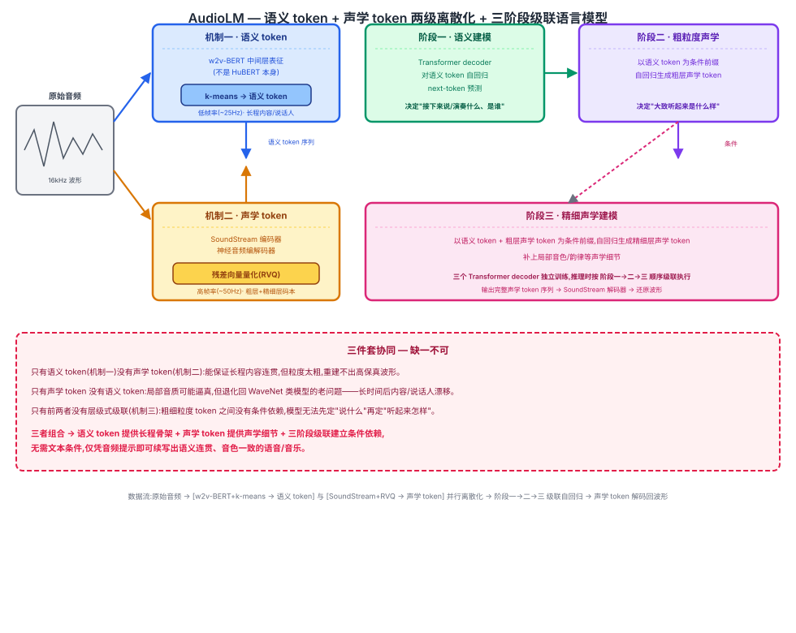

## 前作进展

[Wav2Vec 2.0](01-wav2vec2.md)、[HuBERT](02-hubert.md)、[Whisper](03-whisper.md) 这条线索走的都是"理解"类任务:Wav2Vec 2.0 和 HuBERT 用自监督预训练学一套可迁移的语音表征,再微调成识别系统;Whisper 干脆放弃自监督预训练,直接用大规模弱监督数据端到端训练出一个鲁棒的转写/翻译模型。三者的共同点是——模型的输出终点都是文本,音频本身从未被当作"生成目标"。

音频"生成"这件事此前主要靠 WaveNet 这类自回归波形合成模型来做:它们逐采样点地对波形建模,在局部能生成非常逼真的音频细节(音色、韵律的精细起伏),但天生缺乏长程语义一致性——生成到几十秒之后,内容或说话人身份经常"跑偏",因为在采样点这个粒度上建模,模型的有效感受野很难覆盖到足以维持句子级、段落级结构的时间跨度。与此同时,Wav2Vec 2.0 和 HuBERT 已经证明自监督语音表征能学到蕴含长程语义结构的离散/连续表示——HuBERT 甚至专门设计了一套离线聚类生成固定离散伪标签的机制,但这套机制此前只被用来给"理解"任务(掩码预测)提供训练目标,没有工作系统性地把这类离散表征反过来用于指导"生成"。这条从识别到生成的过渡,也正是本仓库上一篇 Whisper 笔记结尾处提出的观察:识别类任务的重心已经从"把语音转成文字"转向"把语音本身编码成离散 token 序列,再借助语言模型的框架去建模、生成语音"——AudioLM 正是这个转向的第一个代表性节点。

## 核心思想 + 直觉

AudioLM 的核心洞察是把"保证长程语义连贯"和"保证局部声学细节逼真"这两个此前互相冲突的目标,拆解成两级不同粒度的离散 token,分别交给不同的机制去生成,再用语言模型对这两级 token 做层级式的自回归预测。粗粒度的**语义 token** 负责回答"接下来该说/演奏什么内容、是谁在说/演奏"这个长程结构问题;细粒度的**声学 token** 负责回答"这段内容具体听起来是什么音色、什么声学细节"这个局部保真度问题。

直觉上,这和 WaveNet 类模型的差别在于:WaveNet 只有一层粒度(采样点),既要负责内容连贯又要负责音质逼真,两个目标在同一个建模尺度上互相拖累;AudioLM 先在粗粒度上把"说什么"定下来,再在细粒度上把"听起来怎么样"补上去,相当于把一个难题拆成两个更容易的子问题分别求解。而"用语言模型在离散 token 序列上做 next-token 预测"这个建模范式本身,和文本 GPT 系列的自回归生成没有任何区别——AudioLM 的贡献不在于发明新的生成机制,而在于找到了一套把音频转成离散 token、并且分层组织这些 token 的方法,使得音频生成可以直接复用文本语言模型这一整套已经被验证过的工具箱。

## 机制一:语义 token —— 来自自监督音频模型

语义 token 的提取依赖一个预训练好的自监督音频模型 **w2v-BERT**:取它某个中间层的表征,再用 k-means 把这些连续表征离散化(聚类)成语义 token 序列。这套 token 的采样率较低(比如约 25Hz 的量级),也就是每个 token 覆盖更长的一段时间跨度——粒度粗,携带的是内容和说话人身份这类长程结构信息,而不是精细的声学细节。

这里的技术路线——用自监督模型的中间层表征、再聚类离散化——和 [HuBERT](02-hubert.md) 用中间层表征迭代重新聚类生成伪标签的思路是彼此呼应的,两者都相信"自监督模型的中间层已经隐式学到了比原始信号更贴近语义结构的表示,聚类能把这种结构显式地抽取成离散单元"。但需要明确区分:AudioLM 实际使用的自监督模型是 **w2v-BERT**,不是 HuBERT 本身——两者是同一条技术脉络下的不同模型,AudioLM 并没有直接复用 HuBERT 这个模型或它训练出的伪标签,只是借鉴了"中间层表征 + 聚类离散化"这一套做法。

## 机制二:声学 token —— 来自神经编解码器,残差量化

声学 token 的提取依赖神经音频编解码器 **SoundStream**,它用多层**残差向量量化**(Residual Vector Quantization, RVQ)把音频压缩成一组分层的离散码本:第一层码本捕捉最粗粒度的声学信息(比如整体音色骨架),后续每一层在前面所有层重建误差的基础上继续量化,逐层补充更精细的声学细节。这套 token 的采样率比语义 token 更高(比如约 50Hz 的量级),粒度更细,负责的是重建出高保真、听感自然的波形,而不是长程内容结构。

## 机制三:层级式级联生成

整个生成过程分三个阶段级联执行:

1. **阶段一(语义建模)**:自回归生成语义 token 序列,决定"接下来的内容和说话人是什么"。
2. **阶段二(粗粒度声学建模)**:以阶段一生成的语义 token 为条件,自回归生成 RVQ 码本中较粗的几层声学 token,决定"这段内容大致听起来是什么样"。
3. **阶段三(精细声学建模)**:以阶段一、阶段二的结果为条件,生成 RVQ 码本中剩余的精细层声学 token,补上最后的声学细节。

三个阶段分别用独立的 Transformer decoder 训练,推理时按顺序级联执行——前一阶段的输出作为后一阶段的条件前缀,拼接进输入序列里,靠因果注意力让后一阶段"看到"前一阶段已经确定的内容,再继续做自己那部分的 next-token 预测。



*图 1:原始音频分两路离散化——上路经 w2v-BERT 中间层表征 + k-means 得到低帧率语义 token,下路经 SoundStream 编码器 + 残差向量量化(RVQ)得到高帧率声学 token(粗粒度层 + 精细层);三个 Transformer decoder 级联执行:阶段一自回归生成语义 token,阶段二以语义 token 为条件生成粗粒度声学 token,阶段三以语义 token + 粗粒度声学 token 为条件生成精细声学 token,最终由声学 token 解码回波形。*

## 三件套协同

三个机制缺一不可,拆开任何一个都无法复现 AudioLM 的生成效果:

- 只有**语义 token**(机制一)没有**声学 token**(机制二):能保证生成内容在长程上连贯,但语义 token 粒度太粗、采样率太低,根本重建不出具体的高保真波形——它描述的是"说什么",不是"听起来怎么样"。
- 只有**声学 token**没有**语义 token**:局部声学细节可能很逼真,但退化回 WaveNet 类模型的老问题——生成几十秒之后内容和说话人身份容易漂移,因为没有一个粗粒度、长跨度的骨架去约束长程结构。
- 只有前两者没有**层级式级联结构**(机制三):粗细粒度的 token 之间没有清晰的条件依赖关系,模型无法先确定"说什么"再确定"听起来怎么样",两套 token 各自独立训练也无法保证生成时相互一致。

三者组合起来,AudioLM 才能在不需要任何文本条件的情况下,仅靠一段音频提示做续写,生成出既语义连贯(内容、说话人身份在长时间跨度上保持一致)又声学逼真(音质、韵律细节自然)的语音或音乐。

## 关键代码

语义 token 提取 + 声学 token(RVQ)提取 + 三阶段级联 decoder-only Transformer 的简化 PyTorch 风格伪代码(不追求完整可运行,展示核心逻辑;张量 shape 已在注释里逐步标注,均以 3 秒、16kHz 音频为例手工验证过):

```python
import torch
import torch.nn as nn
import torch.nn.functional as F


# ---------- 两级离散化(机制一 + 机制二,预训练好的 tokenizer,不参与语言模型本身的训练) ----------

def extract_semantic_tokens(w2v_bert, kmeans, waveform, layer_idx=7):
    """机制一:w2v-BERT 中间层表征 + k-means 离散化(注意:是 w2v-BERT,不是 HuBERT)
    waveform: (B, T_raw) 16kHz 原始波形,3 秒音频 T_raw = 48000
    返回: (B, T_sem) long,T_sem ≈ T_raw / 640(w2v-BERT ~25Hz 帧率),3 秒音频 T_sem = 75"""
    with torch.no_grad():
        hidden = w2v_bert.encode_layer(waveform, layer_idx)        # (B, T_sem=75, D_w2v)
    B, T_sem, D = hidden.shape
    flat = hidden.reshape(B * T_sem, D).cpu().numpy()                # (B*75, D_w2v)
    ids = kmeans.predict(flat)                                          # (B*75,) 簇编号 in [0, K_SEM)
    semantic_ids = torch.from_numpy(ids).long().reshape(B, T_sem)      # (B, 75) long
    return semantic_ids


def extract_acoustic_tokens(soundstream, waveform, num_quantizers=12):
    """机制二:SoundStream 编码 + 残差向量量化(RVQ)
    waveform: (B, T_raw) 同上,3 秒音频 T_raw = 48000
    返回: (B, T_ac, Q) long,T_ac ≈ T_raw / 320(SoundStream ~50Hz 帧率,是语义 token 帧率的 2 倍),
    3 秒音频 T_ac = 150,Q=12 层残差码本,第 0 层最粗粒度,第 11 层最精细"""
    with torch.no_grad():
        emb = soundstream.encoder(waveform)                            # (B, T_ac=150, D_ac)
        acoustic_ids = soundstream.rvq.encode(emb, num_quantizers=num_quantizers)  # (B, 150, 12)
    return acoustic_ids


# ---------- 机制三:三阶段共用的 decoder-only Transformer(GPT 式,因果掩码 next-token 预测) ----------

class CausalTokenLM(nn.Module):
    """三个阶段结构相同,区别只在词表大小、输入序列的拼接方式(条件段+目标段),
    以及损失只在各自的目标 token 段上计算"""
    def __init__(self, vocab_size, dim=1024, n_layers=12, n_heads=16, max_len=4096):
        super().__init__()
        self.token_emb = nn.Embedding(vocab_size, dim)
        self.pos_emb = nn.Parameter(torch.randn(1, max_len, dim))
        enc_layer = nn.TransformerEncoderLayer(d_model=dim, nhead=n_heads, batch_first=True)
        self.blocks = nn.TransformerEncoder(enc_layer, num_layers=n_layers)
        self.head = nn.Linear(dim, vocab_size)

    def forward(self, token_ids):
        # token_ids: (B, T) long,T 是"条件段 + 目标段"拼接后的总长度
        B, T = token_ids.shape
        x = self.token_emb(token_ids) + self.pos_emb[:, :T, :]          # (B, T, dim)
        causal_mask = nn.Transformer.generate_square_subsequent_mask(T).to(x.device)  # (T, T)
        h = self.blocks(x, mask=causal_mask)                              # (B, T, dim)
        logits = self.head(h)                                              # (B, T, vocab_size)
        return logits


K_SEM, K_AC = 1024, 1024          # 语义 / 每层声学 token 的词表大小(示意性数值)
Q_COARSE, Q_FINE = 4, 8            # 12 层 RVQ 拆成粗粒度 4 层 + 精细 8 层(示意性拆分,非论文精确取值)


def flatten_acoustic(acoustic_ids, level_start, level_end, base_offset, codebook_size):
    """acoustic_ids: (B, T_ac, Q) 每个时间步 Q 个并行码本的 id
    把 [level_start, level_end) 范围内的码本层展平成一条序列,
    每一层加上不同的 offset(base_offset + 层号 * codebook_size),
    避免不同码本层的相同 id 被映射到同一个 token id 上。"""
    B, T_ac, _ = acoustic_ids.shape
    tokens = []
    for level in range(level_start, level_end):
        level_offset = base_offset + (level - level_start) * codebook_size
        tokens.append(acoustic_ids[:, :, level] + level_offset)  # (B, T_ac)
    return torch.stack(tokens, dim=-1).reshape(B, -1)  # 按时间步交错展平,(B, (level_end-level_start)*T_ac)


# ---------- 阶段一:语义 token 自回归建模 ----------
stage1 = CausalTokenLM(vocab_size=K_SEM)

def stage1_loss(semantic_ids):
    # semantic_ids: (B, 75) long
    logits = stage1(semantic_ids[:, :-1])                                   # (B, 74, K_SEM)
    loss = F.cross_entropy(
        logits.reshape(-1, K_SEM), semantic_ids[:, 1:].reshape(-1))          # 目标右移一位,(B*74,)
    return loss


# ---------- 阶段二:粗粒度声学 token 建模(以语义 token 为条件前缀) ----------
# 共享词表:语义 token 用 [0, K_SEM);4 层粗粒度声学码本各自独占一段 K_AC 大小的区间,
# 落在 [K_SEM, K_SEM+Q_COARSE*K_AC),避免不同层的相同 id 被映射到同一个 token id 上
VOCAB_STAGE2 = K_SEM + Q_COARSE * K_AC
stage2 = CausalTokenLM(vocab_size=VOCAB_STAGE2)

def stage2_loss(semantic_ids, acoustic_ids):
    # semantic_ids: (B, 75);acoustic_ids: (B, 150, 12)
    coarse = flatten_acoustic(acoustic_ids, 0, Q_COARSE, K_SEM, K_AC)          # (B, 150*4=600),id ∈ [1024, 5120)
    seq = torch.cat([semantic_ids, coarse], dim=1)                            # (B, 75+600=675)
    logits = stage2(seq[:, :-1])                                               # (B, 674, VOCAB_STAGE2)
    target = seq[:, 1:]                                                         # (B, 674)
    acoustic_start = semantic_ids.size(1) - 1                                   # =74
    logits_ac = logits[:, acoustic_start:, :]                                   # (B, 600, VOCAB_STAGE2)
    target_ac = target[:, acoustic_start:]                                       # (B, 600)
    loss = F.cross_entropy(logits_ac.reshape(-1, VOCAB_STAGE2), target_ac.reshape(-1))
    return loss


# ---------- 阶段三:精细声学 token 建模(以语义 token + 粗粒度声学 token 为条件前缀) ----------
# 词表在阶段二的基础上继续扩展:8 层精细声学码本再各自独占一段 K_AC 大小的区间,
# 紧接在粗粒度区间之后,落在 [K_SEM+Q_COARSE*K_AC, K_SEM+Q_COARSE*K_AC+Q_FINE*K_AC)
VOCAB_STAGE3 = K_SEM + Q_COARSE * K_AC + Q_FINE * K_AC
stage3 = CausalTokenLM(vocab_size=VOCAB_STAGE3)

def stage3_loss(semantic_ids, acoustic_ids):
    coarse = flatten_acoustic(acoustic_ids, 0, Q_COARSE, K_SEM, K_AC)                       # (B, 600),id ∈ [1024, 5120)
    fine = flatten_acoustic(acoustic_ids, Q_COARSE, Q_COARSE + Q_FINE,
                             K_SEM + Q_COARSE * K_AC, K_AC)                                    # (B, 150*8=1200),id ∈ [5120, 13312)
    seq = torch.cat([semantic_ids, coarse, fine], dim=1)                        # (B, 75+600+1200=1875)
    logits = stage3(seq[:, :-1])                                                  # (B, 1874, VOCAB_STAGE3)
    target = seq[:, 1:]                                                            # (B, 1874)
    fine_start = semantic_ids.size(1) + coarse.size(1) - 1                         # =674
    logits_fine = logits[:, fine_start:, :]                                        # (B, 1200, VOCAB_STAGE3)
    target_fine = target[:, fine_start:]                                            # (B, 1200)
    loss = F.cross_entropy(logits_fine.reshape(-1, VOCAB_STAGE3), target_fine.reshape(-1))
    return loss


# 推理时按 阶段一 -> 阶段二 -> 阶段三 顺序自回归采样,前一阶段的输出拼接为后一阶段的条件前缀,
# 最终把三阶段拼出的完整声学 token 序列送入 SoundStream 解码器还原波形(此处从略)
```

## 性能数据

*(以下数字来自训练知识回忆,未经实时核实,建议读者核对原论文 arXiv:2209.03143 确认准确数值)*

论文的评测主要围绕两类续写任务:

- **语音续写**:给模型一段几秒钟的语音提示(prompt),让它自回归续写后续内容。人工评估显示,续写片段在**说话人身份保持**(续写部分是否听起来像同一个人在说话)和**语义合理性/连贯性**(续写内容是否符合语法、语义上说得通)两方面都获得了较高的主观评分,且随着模型只依赖语义 token 生成"内容骨架"、再由声学 token 补全细节,长时间续写后说话人身份漂移的问题相比纯波形自回归模型有明显改善。论文还专门设计了"语音延续的合理性"(likelihood/合理度)对比实验,证明引入语义 token 这一层显著提升了长程语义一致性,相比跳过语义 token、直接对声学 token 建模的消融基线有明显优势。
- **钢琴音乐续写**:给模型一段钢琴演奏片段作为提示,续写后续的旋律与和声。定性听感上,续写部分能维持与提示段一致的调性、节奏型和大致的旋律走向,展现出模型学到的不只是语音特有的结构,层级 token + 语言模型这套框架本身对音乐这类结构化音频信号同样适用,这也为后续 MusicLM 这类音乐生成工作打下基础。

## 影响 / 后续

AudioLM 确立了"离散化音频 token(语义 + 声学两级)+ 语言模型自回归生成"这一后续音频/音乐生成工作的主流范式:隔年发布的 **MusicLM** 直接基于 AudioLM 的层级 token 框架、加入文本条件做文本到音乐生成,后续的 **MusicGen** 同样受其启发。但 AudioLM 的三阶段级联结构也带来了明显代价——三个独立训练的 Transformer decoder 串行推理,速度慢,而且前一阶段的预测错误会传播、累积到后续阶段,这正是 MusicGen 之后要解决的问题——把多阶段级联简化成单阶段生成。

→ [02-hubert.md](02-hubert.md) · 本文语义 token 提取思路的技术源头之一
→ [05-musicgen.md](05-musicgen.md) · 简化本文级联结构为单阶段生成的后续工作
