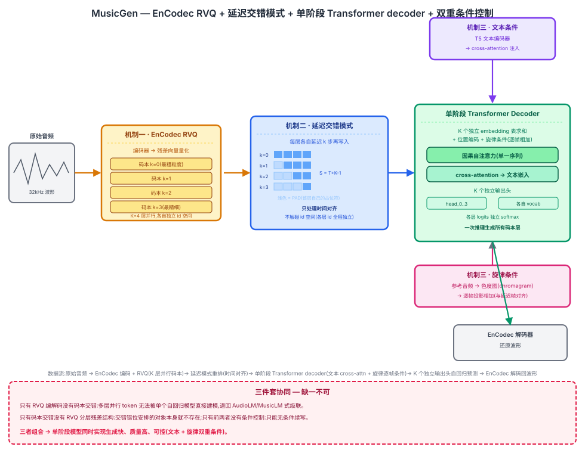

## 前作进展

[AudioLM](04-audiolm.md) 用语义 token(w2v-BERT 中间层表征 + k-means 离散化)和声学 token(SoundStream 残差向量量化)两级离散表示,配合三阶段级联的 Transformer decoder——阶段一自回归生成语义 token,阶段二以语义 token 为条件生成粗粒度声学 token,阶段三再以前两阶段结果为条件补上精细声学 token——验证了"离散化音频 + 语言模型"这套范式能在不需要任何文本条件的情况下,仅靠音频提示续写出语义连贯、声学逼真的语音或音乐。但这套三阶段级联结构本身有明显代价:三个 Transformer decoder 需要独立训练、独立维护,推理时必须按语义 → 粗声学 → 精细声学的顺序依次执行,速度慢;而且前一阶段的预测误差会传播、累积到后续阶段,影响最终生成质量。

同期的 **MusicLM** 沿用了与 AudioLM 类似的层级级联结构,并在此基础上加入文本条件——通过联合文本-音乐嵌入模型 MuLan 把文本描述映射到与音乐音频同一个嵌入空间,再用这个联合嵌入去调控级联生成过程,实现了"按文本描述生成音乐"的能力。但 MusicLM 同样继承了级联结构固有的复杂性问题:多个独立模型串行推理、误差逐阶段累积。AudioLM 笔记结尾处已经点出这正是 MusicGen 要解决的方向——把多阶段级联简化成单阶段生成。

## 核心思想 + 直觉

MusicGen 的核心洞察是:不必用多个独立模型分阶段生成不同粒度的音频 token,只要设计一种巧妙的方式,把神经编解码器输出的多层并行残差量化(RVQ)码本"摊平"成一条能被单个自回归 Transformer 直接建模的序列,就可以用一个模型、一次推理过程生成所有层级的音频 token。

直觉上,AudioLM/MusicLM 的级联结构本质是在用"多个模型接力"来处理 RVQ 编解码器天然带来的"每个时间步有多层并行 token"这个结构性矛盾——自回归语言模型一次只能预测一个 token,而 RVQ 每一帧却同时有 K 个码本各自贡献一个 token。MusicGen 不再用多个模型分别负责不同层级,而是在**同一个** Transformer decoder 内部,通过在时间维度上对不同码本层做交错错位安排,把"多层并行"问题转化成"单一序列上的顺序预测"问题,从而只需要一个模型、一次前向推理链路就能覆盖所有层级的信息。

## 机制一:EnCodec 残差量化

MusicGen 用神经音频编解码器 **EnCodec** 把音频压缩成 K 层残差量化(RVQ)码本。每一帧时间步上,K 个码本并行地各自贡献一个离散 token:第一层码本捕捉最粗粒度的声学信息(整体音色骨架),后续每一层在前面所有层重建误差的基础上继续量化,逐层补充更精细的声学细节。K 层组合起来能重建出接近原始质量的音频,这套结构与 AudioLM 里 SoundStream 的 RVQ 声学 token 提取思路一致,都属于神经编解码器 + 残差量化这条技术路线。

## 机制二:码本交错(codebook interleaving)

标准自回归 Transformer 一次只能预测一个 token,但 EnCodec 每个时间步有 K 个并行码本 token 需要生成。MusicGen 提出几种交错模式,其中最关键的是**延迟模式(delay pattern)**:把 K 个并行码本流按固定的时间错位规则重新排列——第 k 层码本在时间上整体延迟 k 步再送入序列,使得同一个"解码步"里排布的是不同时间步、不同码本层的 token 组合。这样,单个 decoder-only Transformer 就能在一次自回归展开里,按固定顺序逐步预测出所有码本层的 token,而不需要为每层码本单独训练模型或额外增加级联阶段。

需要强调的是,延迟模式解决的是"如何在时间维度上对齐、排布多层 token,使其能被一个自回归序列建模"这个问题,它本身**不解决**"不同码本层的 token id 要不要共享同一个空间"这个独立的问题——这两件事必须分开处理(详见"关键代码"一节)。

## 机制三:文本 + 旋律双重条件控制

MusicGen 支持两种条件输入,可单独使用也可组合使用:

- **文本条件**:用预训练的 T5 文本编码器提取文本描述的嵌入,以 cross-attention 的方式注入 Transformer decoder,控制生成音乐的风格、乐器编配、情绪等由文本描述的属性。
- **旋律条件**:从参考音频里提取色度图(chromagram)——一种反映音高/和声走向而非具体音色的表示,作为额外条件输入,让模型可以按指定的旋律轮廓生成不同编曲风格的音乐,例如把一段哼唱的旋律改编成摇滚或爵士风格。

## 三件套协同

三个机制缺一不可:

- 只有**RVQ 编解码**(机制一)没有**码本交错**(机制二):多层并行 token 无法被单个自回归模型直接建模,退回到需要为每层单独训练模型、按阶段级联的 AudioLM/MusicLM 式老路。
- 只有**码本交错**没有**RVQ 提供的分层残差结构**:交错错位安排的对象本身就不存在,机制二无从谈起。
- 只有前两者没有**条件控制机制**(机制三):模型只能做无条件的音频续写,不具备"按文本描述或参考旋律生成音乐"这一实用能力,失去了作为可控音乐生成工具的核心价值。

三者组合起来,MusicGen 才能用**单阶段模型**同时实现"生成快(一次推理覆盖所有码本层)、质量高(RVQ 分层残差保真)、可控(文本 + 旋律双重条件)"这三个目标。



*图 1:原始音频经 EnCodec 编码器 + 残差量化(RVQ)得到 K 个并行码本流;延迟模式(delay pattern)把 K 层按不同延迟错位重排后,在每个解码步上求和送入单个 Transformer decoder;decoder 通过 cross-attention 接收 T5 文本嵌入、通过逐帧相加接收色度图旋律嵌入两种条件,自回归预测 K 个码本各自的下一 token,最终由 EnCodec 解码器还原波形。*

## 关键代码

EnCodec RVQ token 提取 + 延迟交错模式重排 + T5 文本条件 cross-attention 的简化 PyTorch 风格伪代码。**关键设计**:每个码本层使用独立的 embedding 表和独立的输出头(而不是像常见误做法那样,把所有码本层的 id 塞进同一个共享词表、靠延迟错位"顺便"避免 id 冲突)——延迟模式解决的是时间对齐问题,不是 token id 空间问题,这两者必须分开处理,否则会重蹈上一节点 AudioLM 曾经踩过的"不同码本层 id 冲突"的坑。所有张量 shape 与 id 范围已在注释里逐步手工验证,均以 3 秒、32kHz 音频为例:

```python
import torch
import torch.nn as nn
import torch.nn.functional as F


# ---------- 机制一:EnCodec RVQ token 提取(预训练好的 tokenizer,不参与语言模型训练) ----------

def extract_rvq_tokens(encodec, waveform, num_codebooks=4):
    """waveform: (B, T_raw) 32kHz 原始波形,3 秒音频 T_raw = 96000
    返回: (B, T, K) long,T ≈ T_raw / 640(EnCodec ~50Hz 帧率),3 秒音频 T = 150,
    K=4 层残差码本,每层各自的 id 都独立落在 [0, codebook_size) 内(层与层之间没有共享/偏移关系)"""
    with torch.no_grad():
        emb = encodec.encoder(waveform)                                  # (B, T=150, D_enc)
        rvq_ids = encodec.rvq.encode(emb, num_quantizers=num_codebooks)  # (B, 150, 4), 每个值 in [0, codebook_size)
    return rvq_ids


CODEBOOK_SIZE = 2048        # 每层码本独立的词表大小
K = 4                        # 码本层数
PAD_ID = CODEBOOK_SIZE       # 每层各自的“延迟填充”占位符,占用该层 embedding 表的最后一个槽位


# ---------- 机制二:延迟模式(delay pattern)—— 只处理时间对齐,不触碰 id 空间 ----------

def build_delay_pattern(rvq_ids):
    """rvq_ids: (B, T=150, K=4),每层 id 各自独立落在 [0, 2048)
    返回: (B, S, K) long,S = T + K - 1 = 153
    delayed[:, s, k] = rvq_ids[:, s-k, k]  若 0 <= s-k < T,否则填 PAD_ID(该层自己的占位符)
    验证:s=0 时只有 k=0 有效(s-k=0);s=152 时只有 k=3 有效(s-k=149=T-1);
    中间 s=3..149 时四层同时有效——这就是“延迟错位”本身要处理的时间对齐问题,
    每一层的取值范围全程仍是各自独立的 [0, 2048) ∪ {PAD_ID},层间从不共享 id"""
    B, T, K_ = rvq_ids.shape
    assert K_ == K
    S = T + K - 1                                                # 150 + 4 - 1 = 153
    delayed = rvq_ids.new_full((B, S, K), PAD_ID)                # (B, 153, 4),先全填各自的 PAD
    for k in range(K):
        delayed[:, k:k + T, k] = rvq_ids[:, :, k]                # 第 k 层整体右移 k 步写入
    return delayed                                                # (B, 153, 4)


# ---------- 机制三:T5 文本条件(cross-attention)+ 色度图旋律条件(逐帧相加) ----------

def extract_chroma(chroma_extractor, ref_waveform, target_len):
    """ref_waveform: (B, T_raw) 参考音频；返回 (B, target_len, 12) 色度图,
    与延迟后的帧序列等长做零填充(旋律条件按帧对齐相加,不参与延迟错位,因为它不是码本层)"""
    with torch.no_grad():
        chroma = chroma_extractor(ref_waveform)                  # (B, T=150, 12)
    B, T, C = chroma.shape
    pad_len = target_len - T                                      # 153 - 150 = 3
    chroma_padded = F.pad(chroma, (0, 0, 0, pad_len))             # (B, 153, 12)
    return chroma_padded


class MusicGenDecoder(nn.Module):
    """单阶段 decoder-only Transformer:K 个独立 embedding 表(+ 各自的 PAD 槽位)、
    K 个独立输出头(各自 vocab_size=CODEBOOK_SIZE,不含 PAD,因为 PAD 从不作为预测目标)、
    自注意力做因果掩码(生成),cross-attention 接文本条件"""
    def __init__(self, dim=1024, n_layers=12, n_heads=16, max_len=256,
                 text_dim=768, num_codebooks=K, codebook_size=CODEBOOK_SIZE):
        super().__init__()
        # 每层码本独立的 embedding 表,大小 codebook_size+1(多一个槽位给该层自己的 PAD_ID)
        self.token_embs = nn.ModuleList([
            nn.Embedding(codebook_size + 1, dim) for _ in range(num_codebooks)
        ])
        self.pos_emb = nn.Parameter(torch.randn(1, max_len, dim))
        self.chroma_proj = nn.Linear(12, dim)                     # 旋律条件投影
        self.text_proj = nn.Linear(text_dim, dim)                  # T5 文本条件投影
        dec_layer = nn.TransformerDecoderLayer(d_model=dim, nhead=n_heads, batch_first=True)
        self.blocks = nn.TransformerDecoder(dec_layer, num_layers=n_layers)
        # 每层码本独立的输出头,只在自己的 [0, codebook_size) 范围内预测,层间输出空间互不重叠也互不共享
        self.heads = nn.ModuleList([
            nn.Linear(dim, codebook_size) for _ in range(num_codebooks)
        ])

    def forward(self, delayed_ids, chroma_padded, text_emb):
        # delayed_ids: (B, S, K) long, id 范围逐层独立 in [0, codebook_size] (含 PAD_ID)
        # chroma_padded: (B, S, 12)
        # text_emb: (B, L_text, 768) 来自 T5 编码器
        B, S, K_ = delayed_ids.shape
        frame = sum(self.token_embs[k](delayed_ids[:, :, k]) for k in range(K_))  # (B, S, dim) 各层独立 embedding 求和
        frame = frame + self.pos_emb[:, :S, :] + self.chroma_proj(chroma_padded)   # (B, S, dim)
        memory = self.text_proj(text_emb)                                           # (B, L_text, dim)
        causal_mask = nn.Transformer.generate_square_subsequent_mask(S).to(frame.device)  # (S, S)
        h = self.blocks(tgt=frame, memory=memory, tgt_mask=causal_mask)             # (B, S, dim)
        logits_per_k = [head(h) for head in self.heads]                             # K 个 (B, S, codebook_size)
        return logits_per_k


def musicgen_loss(model, rvq_ids, chroma_padded, text_emb):
    # rvq_ids: (B, 150, 4);chroma_padded: (B, 153, 12);text_emb: (B, L_text, 768)
    delayed = build_delay_pattern(rvq_ids)                          # (B, 153, 4)
    inputs = delayed[:, :-1, :]                                       # (B, 152, 4) 当前步输入
    targets = delayed[:, 1:, :]                                       # (B, 152, 4) 下一步目标(next-token)
    logits_per_k = model(inputs, chroma_padded[:, :-1, :], text_emb)  # K 个 (B, 152, codebook_size)

    total_loss = 0.0
    for k in range(K):
        target_k = targets[:, :, k]                                    # (B, 152), 值 in [0, codebook_size] (可能含 PAD_ID)
        valid = target_k != PAD_ID                                     # (B, 152) 掩掉延迟边界上的占位位置
        logits_k = logits_per_k[k][valid]                               # (N_valid, codebook_size)
        target_valid = target_k[valid]                                  # (N_valid,), 此时保证 in [0, codebook_size)
        total_loss = total_loss + F.cross_entropy(logits_k, target_valid)
    return total_loss / K


# 推理时单阶段自回归展开:从 s=0 开始,每步用已生成的 delayed_ids 前缀预测下一步 K 层 token,
# 生成完 S=153 步后按延迟规则反解出每层各自长度为 150 的 RVQ token 序列,送入 EnCodec 解码器还原波形(此处从略)
```

## 性能数据

*(以下数字来自训练知识回忆,未经实时核实,建议读者核对原论文确认准确数值)*

论文在文本到音乐生成任务上对比了不同规模的 MusicGen 模型(300M / 1.5B / 3.3B 参数),整体趋势是模型规模越大,人工评估中的音质(audio quality)和与文本描述的贴合度(text relevance / adherence)都稳步提升,3.3B 规模的模型在两项主观评分上都取得了当时公开可比模型中较有竞争力的结果,且相比同期基线(包括 MusicLM)在多个自动化指标上也有优势。方向上更值得关注的是效率:由于把 MusicLM/AudioLM 式的多阶段级联简化成单阶段 + 码本交错的单个 Transformer,MusicGen 在推理时只需要一次自回归解码链路就能生成所有码本层的 token,相比多阶段级联需要依次跑完多个独立模型,自回归步数和实际推理延迟都有明显下降。

## 影响 / 后续

MusicGen 成为广泛使用的开源文本到音乐生成基线,证明了"码本交错"这一技巧可以把多阶段级联的音频语言模型简化成单阶段模型,而不显著牺牲生成质量——这个"用时间维度上的错位交错来摊平多层并行离散表示"的思路,后续也被其他音频/语音生成工作借鉴,成为处理神经编解码器多层 RVQ token 的一种通用范式选择。

这是本家族按教学顺序收录的最后一篇节点,完整走完"自监督表征学习(Wav2Vec2/HuBERT)→ 大规模弱监督识别(Whisper)→ 音频离散化 + 语言建模生成(AudioLM/MusicGen)"这条主线:前三篇节点解决"听懂"的问题,后两篇节点解决"生成"的问题,而 MusicGen 用单阶段模型简化了 AudioLM 开创的级联生成范式,为这条主线画上句点。

→ [04-audiolm.md](04-audiolm.md) · 本文简化的多阶段级联结构
