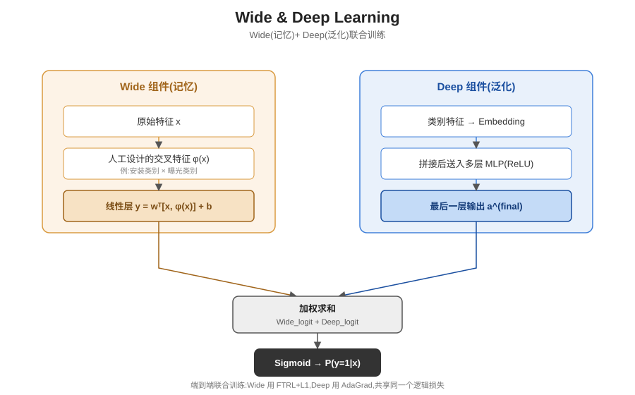

## 前作进展

在 Wide & Deep 之前,工业级推荐/排序系统的主力是**逻辑回归 + 人工设计的交叉特征**。具体做法是把原始类别特征(比如"用户已安装的 App 类别"和"当前曝光的 App 类别")做叉乘(cross-product transformation),生成一个新的稀疏特征,让线性模型可以"记住"诸如"安装过美食类 App 的用户点击美食类广告"这类具体的共现规律。这条路线的优点是可解释、训练快、在样本充足的头部共现模式上效果扎实,但代价很高:交叉特征需要领域专家手工设计,特征组合数量随原始特征数量指数级增长,而且这些特征本质上只是在"记忆训练数据里出现过的组合",对从未出现过的新组合完全没有泛化能力——一个用户如果没有和某个 App 类别共现过,线性模型就学不到任何关于这个新组合的信号。

另一条路线是纯深度模型:把类别特征映射成低维稠密 embedding,拼接后送进多层前馈网络,让网络自动学习特征之间的隐式高阶交互。这类模型泛化能力强,即使某个用户-物品组合从未在训练数据里直接出现过,只要 embedding 空间里存在相似的用户或物品,模型也能给出合理的预测。但泛化能力强也是把双刃剑:在用户-物品交互矩阵**非常稀疏**(推荐系统的常态——大多数用户只和极少数物品有过交互)的场景下,纯深度模型容易"过度泛化",把一些实际上不相关的物品也推荐出来,因为 embedding 空间里的相似性不总是等价于真实的偏好相关性。

工业界的排序系统因此长期卡在一个两难上:要记忆效果就得靠人工特征工程,要泛化效果就得承受稀疏场景下的不精准推荐,没有一个统一的模型能同时把两者都做好。

## 核心思想 + 直觉

Wide & Deep 的核心洞察很直接:**没必要在"记忆"和"泛化"之间二选一,把两种模型联合训练成一个模型就行**。具体做法是让一个广义线性模型(Wide 部分,负责记忆)和一个深度前馈网络(Deep 部分,负责泛化)在同一个训练过程里共同产出最终预测,而不是先训好两个独立模型再做加权融合或者投票。

这个思路的直觉可以类比人类大脑的两种记忆机制:一种是对具体事件、具体规律的"死记硬背"(记住"张三喜欢辣的"),另一种是从大量经验里抽象出的"举一反三"(从"喜欢辣的人通常也喜欢重口味"推断出新的偏好)。单靠死记硬背,遇到没见过的新情况就抓瞎;单靠举一反三,又容易在缺乏具体证据时做出不靠谱的联想。Wide & Deep 让这两种机制在同一个模型里分工协作、共享同一个训练目标,而不是各自为战。

## 机制一:Wide 组件——广义线性模型做记忆

Wide 组件是一个广义线性模型:

```
y = w^T x + b
```

其中 `x` 不仅包含原始的类别/数值特征,还包含**人工设计的特征叉乘变换**(cross-product transformation)。例如把"用户已安装 App 类别 = 美食"和"当前曝光 App 类别 = 美食"两个二值特征叉乘,得到一个新的二值特征"两者都是美食类",这个叉乘特征直接编码了"这两个具体类别同时出现"这一共现信号。Wide 组件的表达能力有限(本质是线性模型),但正因为简单、可解释,它能非常精确地记住训练数据里反复出现的强共现模式——这正是纯深度模型难以稳定做到的。

## 机制二:Deep 组件——Embedding + 前馈网络做泛化

Deep 组件把每个类别特征映射到一个低维(通常几十维)的稠密 embedding 向量,所有类别特征的 embedding 与数值特征拼接后,送入一个多层前馈网络(每层用 ReLU 激活),逐层学习特征之间的隐式高阶非线性交互:

```
a^(l+1) = ReLU(W^(l) a^(l) + b^(l))
```

Embedding 是随机初始化后随整个网络一起训练的,不需要任何人工设计的交叉规则。因为 embedding 把离散类别映射进了一个连续的相似性空间,即使某个具体的用户-物品组合从未在训练数据里出现过,只要 embedding 空间里存在语义相似的组合,Deep 组件就能给出合理的泛化预测——这正是 Wide 组件做不到的能力。

## 机制三:联合训练——共享同一个损失,而非事后融合

Wide 组件的输出和 Deep 组件最后一层的输出做加权求和,再过一个 sigmoid 得到最终预测:

```
P(y=1 | x) = sigmoid(w_wide^T [x, φ(x)] + w_deep^T a^(final) + b)
```

关键在于这是**联合训练(joint training)**,而不是分别训练两个模型再做集成(ensemble)。集成是两个模型各自独立优化各自的目标,训练完之后才在预测阶段做融合,每个模型都不知道另一个模型的存在;联合训练则是 Wide 和 Deep 两部分的参数在同一次反向传播里根据同一个损失函数(通常是逻辑损失)同时更新,Deep 部分可以"知道"Wide 部分已经记住了哪些强共现模式,从而更专注于学习 Wide 部分覆盖不到的泛化模式,两者互补而不是各自为政。论文中 Wide 部分用 **FTRL(Follow-the-Regularized-Leader)配合 L1 正则**优化(L1 正则鼓励稀疏解,适合 Wide 部分本来就依赖大量稀疏交叉特征这一场景),Deep 部分用 **AdaGrad** 优化,两个优化器在同一个训练循环里协同更新各自负责的参数。



*图 1:Wide 组件用原始特征加人工交叉特征做线性记忆,Deep 组件把类别特征映射成 embedding 后经过多层 ReLU 网络做泛化;两路输出加权求和后过 sigmoid,用同一个逻辑损失端到端联合训练。*

## 三件套协同

三个机制拆开看都不完整,合起来才是 Wide & Deep 的真正贡献:

- 只有 **Wide 组件**(机制一):模型退化成一个传统的逻辑回归 + 交叉特征系统,记忆能力强但完全依赖人工设计的交叉特征,组合数量爆炸、维护成本高,对没设计过交叉规则的新组合毫无泛化能力。
- 只有 **Deep 组件**(机制二):模型退化成纯 embedding-MLP 深度模型,泛化能力强,但在用户-物品交互高度稀疏的场景下容易"过度泛化"、推荐出不相关物品,也失去了对强共现模式的精确记忆能力。
- 有 Wide 和 Deep 但缺少**联合训练**(机制三)、改成训练完两个独立模型再做融合(ensemble):两部分各自优化各自的目标,Deep 部分不会因为"Wide 已经记住了某些强共现"而调整自己的学习重心,融合阶段也只能做简单加权,无法像联合训练那样让两部分互相适配、分工明确。

三者组合后,Wide 部分专注记忆训练数据里的强共现规律,Deep 部分专注泛化到未见过的特征组合,联合训练让两部分共享同一个优化目标、互相补位,这正是 Wide & Deep 能在 Google Play 这种数十亿级用户-App 交互、长尾极端稀疏的工业场景下同时兼顾精确度和覆盖面的核心原因。

## 关键代码

Wide 线性层 + Deep embedding-MLP 分支 + 加权求和联合预测的简化 PyTorch 风格伪代码(不追求完整可运行,展示核心逻辑):

```python
import torch
import torch.nn as nn


class WideComponent(nn.Module):
    """机制一:广义线性模型,输入是原始特征 + 人工设计的交叉特征"""
    def __init__(self, wide_input_dim):
        super().__init__()
        self.linear = nn.Linear(wide_input_dim, 1)   # y = w^T x + b

    def forward(self, wide_features):   # wide_features: 原始特征 + cross-product 特征拼接
        return self.linear(wide_features)   # (B, 1),未经过 sigmoid 的 logit


class DeepComponent(nn.Module):
    """机制二:类别特征 embedding 拼接后过多层前馈网络"""
    def __init__(self, cat_cardinalities, embed_dim=32, hidden_dims=(1024, 512, 256)):
        super().__init__()
        self.embeddings = nn.ModuleList([
            nn.Embedding(card, embed_dim) for card in cat_cardinalities
        ])
        input_dim = embed_dim * len(cat_cardinalities)
        layers = []
        for h in hidden_dims:
            layers += [nn.Linear(input_dim, h), nn.ReLU()]
            input_dim = h
        self.mlp = nn.Sequential(*layers)
        self.out = nn.Linear(input_dim, 1)

    def forward(self, cat_features):    # cat_features: (B, num_cat_fields) 每列是类别 id
        embeds = [emb(cat_features[:, i]) for i, emb in enumerate(self.embeddings)]
        x = torch.cat(embeds, dim=-1)   # 所有类别 embedding 拼接
        return self.out(self.mlp(x))    # (B, 1),未经过 sigmoid 的 logit


class WideAndDeep(nn.Module):
    def __init__(self, wide_input_dim, cat_cardinalities, embed_dim=32):
        super().__init__()
        self.wide = WideComponent(wide_input_dim)     # 机制一
        self.deep = DeepComponent(cat_cardinalities, embed_dim)  # 机制二

    def forward(self, wide_features, cat_features):
        wide_logit = self.wide(wide_features)
        deep_logit = self.deep(cat_features)
        combined_logit = wide_logit + deep_logit      # 机制三:加权求和(此处权重隐含在各自线性层里)
        return torch.sigmoid(combined_logit)           # 联合训练用同一个逻辑损失反传给两部分


# 训练时:wide 参数用 FTRL + L1 正则更新,deep 参数用 AdaGrad 更新,
# 但两者在同一次前向/反向传播里根据同一个 loss.backward() 联合优化,而非分别训练后融合。
```

## 性能数据

*(以下数字来自训练知识回忆,本次任务执行时 WebSearch 工具报错不可用,未经实时联网核实,建议读者核对原论文及 Google Play 生产环境的实际公开数据加以确认)*

论文报告的核心结果来自 Google Play 应用商店的线上 A/B 测试和离线评估两部分:

- **线上 A/B 测试**:相比只用 Wide(逻辑回归 + 交叉特征)的基线,Wide & Deep 在 Google Play 生产流量上带来了**应用获取率(acquisition rate)百分之几量级的提升**——这是论文最强调的结果,证明了在真实工业流量、真实用户行为分布下,联合模型确实比单一模型带来可衡量的业务收益,而不仅仅是离线指标好看。
- **离线 AUC 对比**:论文报告 Wide & Deep 的离线 AUC 高于仅 Wide(线性 + 交叉特征)和仅 Deep(embedding-MLP)两个单独基线,方向性结论是——单独任何一个组件的 AUC 都不如两者联合训练的效果,验证了"联合训练优于单模型"这一核心假设。

方向性结论(把握较高):Wide & Deep 相对单一模型基线的提升幅度不算爆炸性(不是数量级的跃升),但在 Google Play 这种日活跃用户以十亿计的场景下,哪怕百分之几的获取率提升也对应巨大的绝对业务价值,这也是这篇论文虽然模型结构相对简单、却被工业界广泛采纳的重要原因。

## 影响 / 后续

Wide & Deep 确立了"线性记忆 + 深度泛化联合训练"这一至今仍被工业界广泛使用的推荐系统范式——不是让一个模型独自承担记忆和泛化两种能力,而是显式拆成两个组件、用同一套训练信号把它们粘合在一起。这个思路直接影响了后续大量工业排序模型的设计:很多后续工作都保留了"双路结构 + 联合训练"这一骨架,只是不断替换 Wide 部分或者升级 Deep 部分的具体实现。

最直接的后续是 **DeepFM**:Wide & Deep 的 Wide 部分仍然依赖人工设计的交叉特征,DeepFM 用因子分解机(FM)自动学习特征的二阶交叉,让"记忆"这部分也摆脱人工特征工程,同时 FM 和 Deep 部分共享同一套特征 embedding 端到端训练。

→ [03-deepfm.md](03-deepfm.md) · 用 FM 自动学习特征交叉,替代本文需要人工设计的交叉特征
