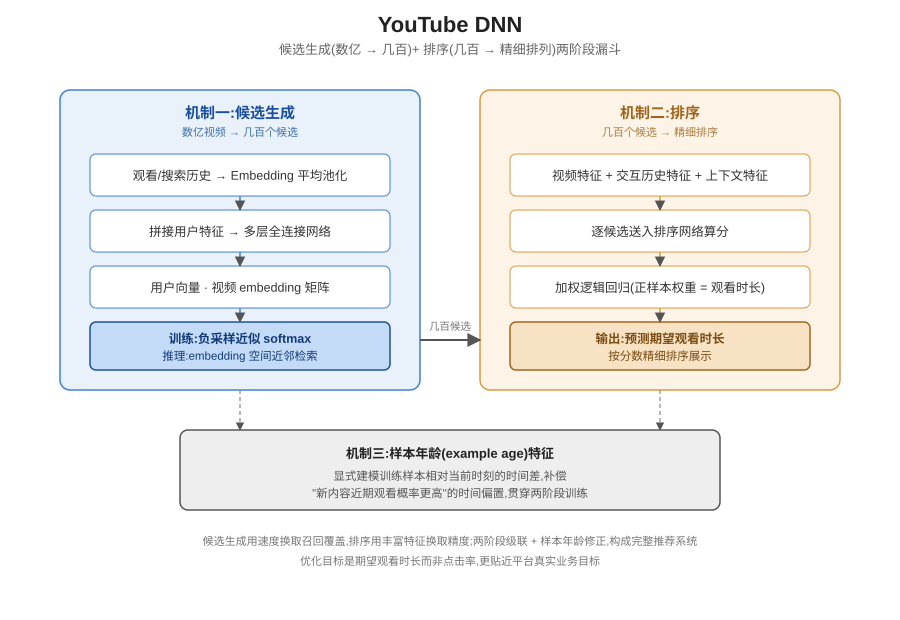

## 前作进展

同年发布的 [Wide & Deep](01-wide-deep.md) 证明了线性模型(记忆)和深度网络(泛化)联合训练能同时兼顾这两种能力,但那篇论文聚焦的问题是**如何精确排序一小批候选**——Google Play 应用商店的场景是,候选池本身已经是一个规模有限、可以逐一算分的应用集合。YouTube 面对的是一个完全不同量级的挑战:整个视频库有数亿条视频,而给用户展示推荐结果的响应时间要求是毫秒级,不可能对每个用户都把数亿视频逐一喂进一个复杂模型算一遍分数——即使 Wide & Deep 这样的联合模型,如果直接套用在数亿候选规模上,单次请求的计算量也完全无法承受。

在 YouTube DNN 之前,主流方案是基于矩阵分解的协同过滤:把用户-视频交互矩阵分解成用户向量和视频向量,用内积衡量偏好。这类方法能利用协同信号(相似用户喜欢相似视频),但难以直接融入视频的元数据特征(标题、上传时间、类别)、用户的观看和搜索历史序列、以及所处的上下文特征(设备、地理位置、时间),因为矩阵分解的输入本质上只是一张稀疏的交互矩阵,新特征很难自然地拼接进去。同时,协同过滤在数亿规模的候选池上做实时检索也面临类似的工程瓶颈——想要精确又快,过去的方法难以两者兼得。

## 核心思想 + 直觉

YouTube DNN 的核心洞察是:与其用一个模型直接在数亿候选里做精细排序,不如把推荐问题拆成两个复杂度递减的阶段。第一阶段——**候选生成(candidate generation)**——用一个相对简单、可以快速计算的模型,从数亿视频里粗筛出几百个大致相关的候选,这一步允许损失一些精度来换取速度;第二阶段——**排序(ranking)**——在这几百个候选上应用一个更丰富、计算成本更高的模型做精细排序,因为候选集合已经缩小到几百量级,这时候用复杂模型逐一算分才变得可以承受。

这个思路可以类比一个先粗筛简历再精读的招聘流程:招聘方不可能对成千上万份简历都做深度面试,而是先用简单规则(学历、关键词)快速筛出几十份候选,再对这几十份做深入评估。"先粗后精"的两阶段漏斗,本质上是用两次代价不同的计算换取整体系统在准确度和延迟之间的平衡,这个架构模式此后成为几乎所有工业级推荐系统的标准范式。

## 机制一:候选生成——极端多分类 + embedding 近邻检索

候选生成阶段把"预测用户接下来会观看哪个视频"建模成一个**极端多分类问题(extreme multiclass classification)**:类别数量等于整个视频库的大小(数百万甚至更多),每个类别对应一个具体的视频。用户的观看历史和搜索历史被映射成 embedding 向量后取平均池化,与其他用户特征(人口统计信息、地理位置等)拼接,送入若干层全连接网络,得到一个用户向量;这个用户向量与一个 softmax 权重矩阵做点积——权重矩阵的每一行本质上就是对应视频的 embedding——点积结果最高的一批视频就是候选。

直接在数百万类别上计算完整的 softmax 归一化代价太高,训练时用**负采样(negative sampling)**来近似:对每个正样本(用户真实观看的视频),只采样一小批负样本参与损失计算,而不是对全部视频类别做归一化。更关键的是,一旦训练完成,"预测用户最可能观看的视频"这个推理过程就不再需要重新跑一遍神经网络前向传播——因为用户向量和视频 embedding 都是固定维度的稠密向量,取候选就等价于在 embedding 空间里做**近似最近邻检索(approximate nearest neighbor search)**,这一步可以用现成的高效近邻检索算法在毫秒级完成,不需要对每个候选视频单独跑一次网络。

## 机制二:排序——加权逻辑回归预测期望观看时长

候选生成阶段产出的几百个候选进入排序阶段,这时候可以引入远比候选生成阶段丰富的特征:视频本身的特征(时长、上传时间、话题类别)、用户与视频交互历史的特征(该用户过去看过多少同一频道的视频、距上次看该频道视频过去了多久)、以及当前请求的上下文特征。排序模型的整体结构类似逻辑回归,但优化目标不是简单的点击率——如果只优化点击率,模型会倾向于推荐"标题党"式的诱导点击视频,用户点进去却很快关闭,对 YouTube 真正在意的用户长期参与度是有害的。

论文的解法是用**加权逻辑回归(weighted logistic regression)**去预测期望观看时长:正样本(用户观看过的视频)的权重设为该次观看的实际时长,负样本权重设为 1;这样训练出来的模型在推理阶段输出的分数,经过换算后近似对应"预期观看时长"而不是单纯的点击概率。这个设计直接把优化目标从"用户会不会点"换成了"用户点了之后会不会真正看下去、看多久",更贴近 YouTube 作为视频平台的核心业务目标。

## 机制三:工程细节——样本年龄特征

视频的受欢迎程度会随时间快速变化——一条视频刚上传时往往有一波集中的观看热度,几周后热度自然衰减;这种时间动态如果不显式建模,模型会系统性地低估新上传视频的价值,因为训练数据里"老视频被大量观看"的样本远多于"新视频刚上传就被观看"的样本,模型学到的是一个偏向老内容的静态分布。论文引入一个显式的**样本年龄(example age)**特征,把每条训练样本相对于当前时刻的时间差作为输入特征之一,让模型能够学习并补偿"内容越新、近期被观看的概率相对越高"这一时间偏置,而不是把所有样本一视同仁地当作静态快照来训练。

除了样本年龄这个特征本身,论文也花了不少篇幅讨论训练数据的构造细节:如何从原始日志里生成正负样本、如何截取和处理用户的观看历史序列、如何避免让模型"看到未来"的数据泄漏——这些看似琐碎的工程细节,在数亿规模的真实生产系统里往往和模型架构本身同样重要。

## 三件套协同

三个机制拆开看都不完整,合起来才是 YouTube DNN 能在生产环境落地的关键:

- 只有**候选生成**(机制一)没有**排序**(机制二):候选生成产出的几百个候选彼此之间相关度参差不齐,缺乏精细排序,直接按候选生成阶段的粗略打分展示给用户,体验会很差——粗筛的目标本来就是速度优先,不是精度优先。
- 只有**排序**没有**候选生成**:排序模型特征丰富、计算成本高,如果直接对数亿视频都跑一遍排序模型,单次请求的计算量在真实的毫秒级响应要求下完全不可行。
- 有候选生成和排序,但没有**样本年龄等工程细节**(机制三):模型会系统性偏向老内容,无法跟踪 YouTube 这种内容生态持续快速新增视频的动态特性,推荐结果会显得"过时"。

三者组合起来,候选生成负责把不可能的检索规模问题变得可计算,排序负责在小规模候选集上做精细的、贴近真实业务目标的打分,样本年龄等工程细节负责让模型跟上内容生态的动态变化——这正是 YouTube DNN 能在数亿视频规模下做到实时、精确、且不落后于内容更新节奏的原因。



*图 1:候选生成阶段把用户观看/搜索历史 embedding 平均池化后经全连接网络得到用户向量,与视频 embedding 矩阵做点积并用负采样近似 softmax 训练,推理时转化为 embedding 空间的近邻检索;排序阶段对候选生成产出的几百个候选引入更丰富特征,用加权逻辑回归预测期望观看时长完成精细排序。*

## 关键代码

候选生成(embedding 平均池化 → MLP → 负采样 softmax)与排序(加权逻辑回归预测期望观看时长)的简化 PyTorch 风格伪代码(不追求完整可运行,展示核心逻辑):

```python
import torch
import torch.nn as nn
import torch.nn.functional as F


class CandidateGenerationModel(nn.Module):
    """机制一:观看/搜索历史 embedding 平均池化 -> MLP -> 视频 embedding 矩阵点积"""
    def __init__(self, num_videos, embed_dim=256, hidden_dims=(1024, 512, 256)):
        super().__init__()
        self.video_embeddings = nn.Embedding(num_videos, embed_dim)   # 兼作 softmax 权重矩阵

        input_dim = embed_dim  # 观看历史平均池化后的维度(此处省略用户画像/上下文特征拼接)
        layers = []
        for h in hidden_dims:
            layers += [nn.Linear(input_dim, h), nn.ReLU()]
            input_dim = h
        self.mlp = nn.Sequential(*layers)
        self.user_proj = nn.Linear(input_dim, embed_dim)   # 输出维度对齐视频 embedding 维度

    def forward(self, watch_history_ids):     # watch_history_ids: (B, L) 变长历史,已 padding
        history_embeds = self.video_embeddings(watch_history_ids)      # (B, L, embed_dim)
        pooled = history_embeds.mean(dim=1)                             # 平均池化 -> 定长用户特征
        user_vector = self.user_proj(self.mlp(pooled))                  # (B, embed_dim)
        return user_vector

    def training_loss(self, user_vector, positive_video_ids, num_negatives=2000):
        """负采样近似 softmax:只对一小批负样本计算损失,而非全量视频库归一化"""
        batch_size = user_vector.size(0)
        pos_embeds = self.video_embeddings(positive_video_ids)          # (B, embed_dim)
        neg_ids = torch.randint(0, self.video_embeddings.num_embeddings,
                                 (batch_size, num_negatives))
        neg_embeds = self.video_embeddings(neg_ids)                     # (B, num_neg, embed_dim)

        pos_logit = (user_vector * pos_embeds).sum(-1, keepdim=True)    # (B, 1)
        neg_logits = torch.einsum("bd,bnd->bn", user_vector, neg_embeds)  # (B, num_neg)
        logits = torch.cat([pos_logit, neg_logits], dim=1)              # 正样本永远放第 0 位
        labels = torch.zeros(batch_size, dtype=torch.long)
        return F.cross_entropy(logits, labels)

    @torch.no_grad()
    def generate_candidates(self, user_vector, top_k=300):
        """推理时:等价于在 embedding 空间做近似最近邻检索,而非重跑整个网络"""
        scores = user_vector @ self.video_embeddings.weight.T           # (B, num_videos)
        return scores.topk(top_k, dim=-1).indices                       # 实际生产用 ANN 索引,此处仅示意


class RankingModel(nn.Module):
    """机制二:候选生成产出的几百个候选上,用更丰富特征做加权逻辑回归预测期望观看时长"""
    def __init__(self, feature_dim, hidden_dims=(512, 256, 128)):
        super().__init__()
        layers = []
        input_dim = feature_dim   # 视频特征 + 用户-视频交互历史特征 + 上下文特征拼接
        for h in hidden_dims:
            layers += [nn.Linear(input_dim, h), nn.ReLU()]
            input_dim = h
        self.mlp = nn.Sequential(*layers)
        self.out = nn.Linear(input_dim, 1)

    def forward(self, features):        # features: (B, feature_dim),候选集合规模小,可以逐一算分
        return self.out(self.mlp(features))    # (B, 1),未经过 sigmoid 的 logit

    def weighted_loss(self, logits, labels, watch_time):
        """正样本权重 = 观看时长,负样本权重 = 1;训练出的分数近似对应期望观看时长而非单纯点击率"""
        weights = torch.where(labels == 1, watch_time, torch.ones_like(watch_time))
        return F.binary_cross_entropy_with_logits(logits.squeeze(-1), labels.float(),
                                                    weight=weights)


# 完整流程:候选生成模型先把数亿视频缩小到几百个候选(近邻检索,毫秒级),
# 排序模型再对这几百个候选算出期望观看时长分数并排序,两阶段级联构成完整推荐系统。
```

## 性能数据

*(以下数字来自训练知识回忆,本次任务执行时 WebSearch 工具报错不可用,未经实时联网核实,建议读者核对原论文及后续 YouTube 公开的生产系统说明加以确认)*

论文报告的评估同样分离线和线上两部分:

- **离线指标**:论文用留出数据集上的 mAP(mean average precision)等排序类指标比较不同模型变体,方向性结论是——引入更多用户历史与上下文特征、以及排序阶段用更丰富特征和更深网络,都能带来离线指标的稳定提升,但论文本身也指出离线指标提升和线上真实效果之间不总是完全一致。
- **线上 A/B 测试**:论文更强调的是线上实验里用户观看时长等参与度指标相对此前系统的提升——这是这篇论文的核心论点,即"排序阶段优化期望观看时长而非点击率"这一设计选择,在真实线上流量里带来了可衡量的参与度提升,而不仅仅是离线指标好看。

方向性结论(把握较高):这篇论文的实际贡献重心不在于把某个单一离线指标刷到多高,而在于验证"候选生成 + 排序"两阶段架构、以及"用期望观看时长而非点击率做排序目标"这两个设计决策,在数亿视频规模的真实生产环境里是可行且有效的——具体数值请以原论文和后续公开资料为准。

## 影响 / 后续

YouTube DNN 确立的"候选生成 + 排序"两阶段漏斗架构,此后成为几乎所有大规模工业推荐系统的标准范式——电商推荐、广告系统、社交内容分发,几乎都能看到这个"先粗筛后精排"的骨架,区别只在于每个阶段具体用什么模型。候选生成阶段"把推荐问题转化为 embedding 空间近邻检索"这一思路,更是直接启发了后续大量的**双塔模型(two-tower model)**——用户塔和物品塔分别独立编码成 embedding,通过内积或余弦相似度衡量匹配程度,这类结构在设计上和 YouTube DNN 的候选生成阶段一脉相承,也直接推动了大规模向量检索系统在工业界的普及。

→ [01-wide-deep.md](01-wide-deep.md) · 同年发布,聚焦排序问题的互补工作
→ [04-din.md](04-din.md) · 排序阶段用户历史行为建模的后续改进
