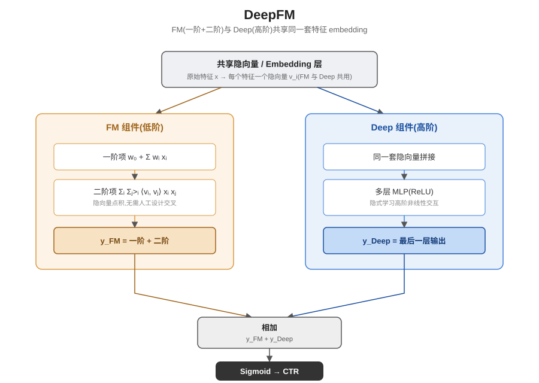

## 前作进展

[Wide & Deep](01-wide-deep.md) 用联合训练解决了"记忆"和"泛化"二选一的难题:Wide 部分(广义线性模型)负责记住训练数据里反复出现的强共现模式,Deep 部分(embedding + 前馈网络)负责泛化到没见过的特征组合,两者共享同一个损失端到端训练。但 Wide 组件自身有一个没解决的老问题——它对特征交互的建模完全依赖**人工设计的特征叉乘变换**(cross-product transformation)。工程师需要事先猜测"用户已安装 App 类别"和"当前曝光 App 类别"这类特征两两组合是否有意义,再手工构造成新特征喂给线性模型。这个过程成本高、容易出错:特征数量一多,可能有意义的组合数量随之指数级增长,人工枚举既覆盖不全,也难以维护,还完全依赖领域专家的经验。

与此同时,**因子分解机(Factorization Machine, FM)** 在业界已经被广泛使用。FM 的关键设计是给每个特征学一个低维隐向量(latent vector),任意两个特征之间的二阶交互强度用它们隐向量的点积来表示,而不是像线性模型那样需要显式构造出交叉特征这一列。这样一来,特征两两之间的交互权重就能从训练数据里自动学出来,不再需要人工设计——即便某个具体的特征组合在训练数据里很稀疏甚至没有直接共现过,只要两个特征各自的隐向量学得好,FM 依然能给出合理的交互强度估计。但 FM 也有明显的天花板:它的建模能力只覆盖到**二阶**交互,对更高阶、更复杂的特征组合模式无能为力,而这类高阶交互在很多推荐场景里恰恰是提升效果的关键。

## 核心思想 + 直觉

DeepFM 的核心思路可以理解成对 Wide & Deep 做一次直接替换加一次结构统一:**把 Wide & Deep 里的 Wide 组件直接换成 FM**,这样原本需要人工设计的二阶特征交叉就变成了自动学习;同时,**让 FM 组件和 Deep(DNN)组件共享同一套特征 embedding**,而不是像 Wide & Deep 那样 Wide 和 Deep 各自用不同的输入特征表示。共享 embedding 之后,模型端到端联合学习两类信号:FM 分支贡献显式的低阶(一阶+二阶)特征交互,Deep 分支的多层非线性变换贡献隐式的高阶特征交互,整个过程完全不需要人工设计任何交叉特征。

这个思路的直觉很朴素:与其让两条分支各用一套"世界观"(Wide 的稀疏叉乘特征 vs Deep 的稠密 embedding)去理解同一个用户和同一个物品,不如让它们看同一套特征表示,只是在这套表示之上做不同层次的加工——FM 做浅层、可解释的二阶组合,DNN 做深层、隐式的高阶组合。两条分支从同一个起点出发、各自往不同深度延伸,最后把结果汇合到一起,既避免了人工特征工程,又避免了 Wide 和 Deep 各学一套表示带来的冗余和不一致。

## 机制一:FM 组件——一阶 + 二阶特征交互

FM 组件的输出由两部分相加构成:

```
y_FM = w_0 + Σ_i w_i x_i + Σ_i Σ_{j>i} <v_i, v_j> x_i x_j
```

第一部分 `w_0 + Σ_i w_i x_i` 是**一阶(线性)项**,对每个特征单独加权求和,和普通线性模型一样,负责捕捉单个特征本身对预测目标的直接贡献。第二部分 `Σ_i Σ_{j>i} <v_i, v_j> x_i x_j` 是**二阶交互项**,对每一对特征 `(i, j)` 计算它们隐向量 `v_i` 和 `v_j` 的点积,再乘以两个特征的取值,加权求和。关键在于这个二阶项**不需要显式枚举所有特征对**——利用矩阵运算的展开技巧,`Σ_i Σ_{j>i} <v_i, v_j> x_i x_j` 可以改写成只需要遍历一次所有特征的形式,整体计算复杂度是特征数量的**线性**而不是平方,这让 FM 在特征维度很高的推荐场景里依然可以高效计算全部两两交互,而不必像 Wide 组件那样人工挑出"值得交叉"的那一小部分特征对。

## 机制二:Deep 组件——共享 embedding 的高阶交互

Deep 组件复用的正是 FM 二阶项里用到的那些隐向量:每个特征的隐向量 `v_i` 同时也是 Deep 组件的 embedding 向量,把所有类别特征的隐向量拼接起来,送入一个多层前馈网络(每层 ReLU 激活),逐层学习特征之间的隐式高阶非线性组合——这一层的结构和 [Wide & Deep 的 Deep 组件](01-wide-deep.md)几乎一样,区别在于关键的输入来源:Wide & Deep 里 Wide 和 Deep 用的是两套互不相关的特征表示(Wide 用原始特征加人工交叉特征,Deep 用独立训练的 embedding),而 DeepFM 里 FM 和 Deep **共享同一套隐向量**,这套隐向量在一次反向传播里同时接受来自 FM 二阶项和 Deep 高阶项两个方向的梯度信号,被两边同时塑造。

## 机制三:端到端联合训练

FM 组件的输出(一阶项 + 二阶项)和 Deep 组件最后一层的输出直接相加,过一个 sigmoid 得到最终的 CTR 预测:

```
ŷ = sigmoid(y_FM + y_Deep)
```

整个模型——包括共享的隐向量/embedding 层、FM 的一阶权重、Deep 的多层网络参数——在同一个训练循环里根据同一个损失函数(通常是逻辑损失)一次性端到端训练完成。这一点和 [Wide & Deep](01-wide-deep.md) 有一个直接的工程简化:Wide & Deep 因为 Wide 和 Deep 用的是不同的特征表示,需要 Wide 部分用 FTRL 配合 L1 正则、Deep 部分用 AdaGrad 这样两套不同的优化器分别更新各自的参数;而 DeepFM 因为不再有 Wide/Deep 各自独立特征表示这个割裂,FM 分支和 Deep 分支共享同一套 embedding,自然可以用统一的优化器和统一的训练流程端到端联合优化,不需要为两条分支分别设计优化策略。



*图 1:原始特征先映射成一套共享的隐向量(embedding);FM 分支用这套隐向量计算一阶项和二阶点积交互项,Deep 分支把同一套隐向量拼接后送入多层 ReLU 网络学习高阶交互;两路输出相加后过 sigmoid,用同一个逻辑损失端到端联合训练。*

## 三件套协同

三个机制拆开看都不完整,合起来才是 DeepFM 相对 Wide & Deep 和纯 FM 的真正贡献:

- 只有 **FM 组件**(机制一):模型退化成经典的因子分解机,只能建模一阶和二阶特征交互,表达能力有上限,对更复杂的高阶交互模式无能为力。
- 只有 **Deep 组件**(机制二)、缺少 FM:模型失去了对二阶交互这一常见且重要的模式的显式建模能力,DNN 需要用更多参数、更多数据去隐式逼近本来 FM 一步点积就能表达的二阶关系,学习效率更低,也失去了 FM 这种结构化先验带来的稳定性。
- 有 FM 和 Deep,但没有**共享 embedding**(机制二里的关键设计),各自用独立的隐向量/embedding:FM 和 Deep 会分别学出两套互不相关的特征表示,不仅参数量翻倍,还可能学出彼此不一致甚至冲突的特征刻画——FM 认为两个特征"相关",Deep 那套独立表示却可能给出矛盾的信号,两条分支各说各话,协同效果大打折扣。

三者组合后,共享的隐向量给 FM 和 Deep 提供了统一的特征表示基础,FM 在这套表示上精确覆盖一阶和二阶交互,Deep 在同一套表示上进一步挖掘更高阶的非线性组合模式,整个过程完全不需要人工设计任何交叉特征,这正是 DeepFM 相对 Wide & Deep"自动化替代人工特征叉乘"这一核心贡献的落地方式。

## 关键代码

FM 二阶项(隐向量点积展开)+ 共享 embedding 送入 DNN + 两路输出相加的简化 PyTorch 风格伪代码(不追求完整可运行,展示核心逻辑):

```python
import torch
import torch.nn as nn


class FMComponent(nn.Module):
    """机制一:一阶线性项 + 二阶隐向量点积交互项(共享 embedding 作为隐向量)"""
    def __init__(self, num_fields, embed_dim):
        super().__init__()
        self.first_order_weight = nn.Parameter(torch.zeros(num_fields))  # w_i
        self.bias = nn.Parameter(torch.zeros(1))                          # w_0

    def forward(self, x_values, embeddings):
        # x_values: (B, num_fields) 特征取值; embeddings: (B, num_fields, embed_dim) 共享隐向量 v_i
        first_order = self.bias + (self.first_order_weight * x_values).sum(dim=1, keepdim=True)

        # 二阶项展开技巧,避免显式枚举所有特征对,复杂度从 O(n^2) 降到 O(n):
        # sum_i sum_{j>i} <v_i,v_j> x_i x_j = 0.5 * [ (sum_i v_i x_i)^2 - sum_i (v_i x_i)^2 ]
        vx = embeddings * x_values.unsqueeze(-1)          # (B, num_fields, embed_dim)
        sum_square = vx.sum(dim=1).pow(2)                  # (sum_i v_i x_i)^2
        square_sum = vx.pow(2).sum(dim=1)                  # sum_i (v_i x_i)^2
        second_order = 0.5 * (sum_square - square_sum).sum(dim=1, keepdim=True)

        return first_order + second_order                  # (B, 1),未经过 sigmoid 的 logit


class DeepComponent(nn.Module):
    """机制二:复用 FM 同一套隐向量(共享 embedding)拼接后送入多层前馈网络"""
    def __init__(self, num_fields, embed_dim, hidden_dims=(400, 400, 400)):
        super().__init__()
        input_dim = num_fields * embed_dim
        layers = []
        for h in hidden_dims:
            layers += [nn.Linear(input_dim, h), nn.ReLU()]
            input_dim = h
        self.mlp = nn.Sequential(*layers)
        self.out = nn.Linear(input_dim, 1)

    def forward(self, embeddings):     # embeddings: (B, num_fields, embed_dim),与 FM 组件共享同一套
        x = embeddings.flatten(start_dim=1)
        return self.out(self.mlp(x))    # (B, 1),未经过 sigmoid 的 logit


class DeepFM(nn.Module):
    def __init__(self, field_cardinalities, embed_dim=10):
        super().__init__()
        self.num_fields = len(field_cardinalities)
        # 共享 embedding 层:FM 的隐向量和 Deep 的输入用的是同一组参数
        self.shared_embeddings = nn.ModuleList([
            nn.Embedding(card, embed_dim) for card in field_cardinalities
        ])
        self.fm = FMComponent(self.num_fields, embed_dim)     # 机制一
        self.deep = DeepComponent(self.num_fields, embed_dim)  # 机制二

    def forward(self, field_ids, x_values):
        # field_ids: (B, num_fields) 每列是该 field 的类别 id
        embeddings = torch.stack(
            [emb(field_ids[:, i]) for i, emb in enumerate(self.shared_embeddings)], dim=1
        )  # (B, num_fields, embed_dim) —— FM 和 Deep 共享的同一套隐向量

        fm_logit = self.fm(x_values, embeddings)
        deep_logit = self.deep(embeddings)
        combined_logit = fm_logit + deep_logit              # 机制三:两路输出直接相加
        return torch.sigmoid(combined_logit)                 # 端到端联合训练,单一逻辑损失反传给两条分支


# 训练时:shared_embeddings、FM 的一阶权重、Deep 的多层网络参数,
# 全部在同一次 loss.backward() 里根据同一个逻辑损失联合更新,不需要像 Wide & Deep 那样为两条分支配不同的优化器。
```

## 性能数据

*(以下数字来自训练知识回忆,本次任务执行时未做实时联网核实,建议读者核对原论文及后续复现工作里的公开表格确认准确数值)*

论文在两个数据集上做了评估:公开的 **Criteo** 点击率预测数据集,以及华为应用商店的内部数据集(论文里称为 **Company 数据集**)。方向性结论(把握较高):

- **相比纯 FM**:DeepFM 在两个数据集上的 AUC 都更高、Logloss 都更低——说明加入 Deep 分支学到的高阶交互确实带来了增量信息,单靠 FM 的二阶交互不足以逼近 DeepFM 的效果。
- **相比 Wide & Deep**:DeepFM 同样取得了更优的 AUC/Logloss——论文将这一差距归因于 FM 自动学习的二阶交互替代了 Wide & Deep 里需要人工设计的交叉特征,减少了人工特征工程的信息损失,同时共享 embedding 让两条分支的表示更一致。
- **相比纯 DNN(去掉 FM 分支)**:DeepFM 依然占优——验证了显式建模低阶交互(FM 的结构化先验)相比让 DNN 独自隐式学习全部交互模式更高效、更容易训练。

论文最强调的一点是:DeepFM 在**完全不需要任何人工特征工程**的前提下取得了优于几种依赖人工特征或者结构更简单的基线的效果,这也是它被工业界迅速采纳的核心原因——不是效果甩开一大截,而是"零特征工程 + 效果不输甚至更优"这个组合本身的工程价值很高。

## 影响 / 后续

DeepFM 很快成为工业界 CTR 预估任务里被广泛采用的基线模型之一——结构相对简单、不需要人工特征工程、FM 和 Deep 共享 embedding 带来的参数效率,这些特点让它在很多公司的排序系统里长期作为对比基线甚至生产模型存在。它确立的"自动学习特征交叉 + 多分支共享 embedding"这一设计范式,直接启发了后续一系列工作朝着"进一步减少人工设计、显式建模更高阶交互"的方向演化,其中最具代表性的是 **xDeepFM**——在 DeepFM 的基础上引入压缩交互网络(CIN),显式地建模任意阶数的特征交互,而不再像 DeepFM 的 Deep 分支那样只能隐式地、不可控地逼近高阶交互。"去掉人工特征工程、让模型自动适应"这条主线也延续到了后续对用户行为建模的工作里。

→ [01-wide-deep.md](01-wide-deep.md) · 本文自动化替代的人工特征叉乘设计
→ [04-din.md](04-din.md) · 同样追求减少人工设计、让模型自动适应用户行为的后续工作
