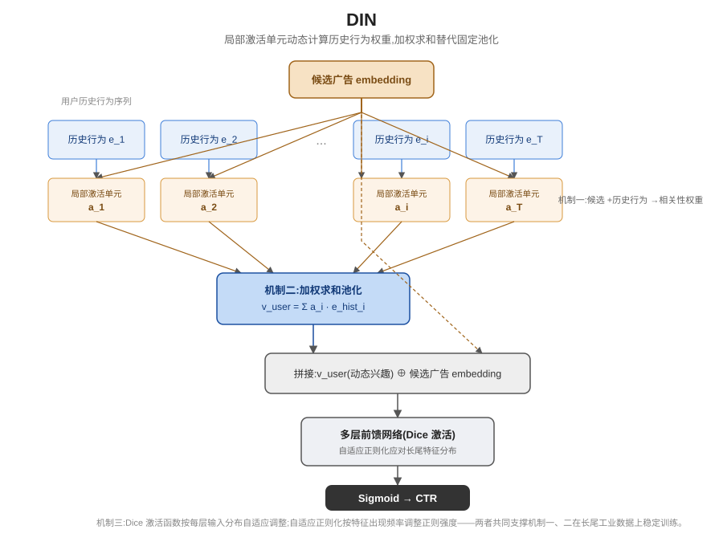

## 前作进展

[Wide & Deep](01-wide-deep.md) 和 [DeepFM](03-deepfm.md) 都要处理同一类输入:用户的历史行为序列(比如最近点击过、购买过的一串商品)。两者的处理方式其实是同一套思路——Wide & Deep 的 Deep 组件把每个类别特征(包括历史行为里的物品)映射成 embedding 后直接拼接送入前馈网络,DeepFM 更进一步用共享隐向量统一了 FM 和 Deep 两条分支的输入,但对历史行为序列本身,两者都还是把序列里每个物品的 embedding 做求和或平均池化,压缩成一个**定长的用户兴趣向量**。这个向量一旦算出来,不管接下来要给用户评估的候选广告是什么,它都保持不变。

问题在于真实用户的兴趣是多面的。一个既买过跑鞋又买过婴儿用品的用户,如果当前候选广告是运动装备,理想情况下模型应该更看重他历史里和"跑鞋"相关的那部分行为;如果候选广告是婴儿用品,则应该更看重和"婴儿用品"相关的那部分行为。但固定池化把所有历史行为一视同仁地压进同一个向量,天然做不到"针对当前候选动态调整关注哪部分历史"——不管候选是什么,喂给后续网络的用户兴趣表示都是同一个数,模型只能被动地在一个信息已经被压缩、细节已经被抹平的向量上做预测。

## 核心思想 + 直觉

DIN 借用了注意力机制的思路:与其把用户历史行为一视同仁地池化成一个固定向量,不如针对"当前正在评估的候选广告",动态计算历史序列里每一个行为和这个候选的相关性权重,再按权重加权求和。这样同一个用户,面对不同候选广告时,模型看到的"用户兴趣表示"是不一样的——过滤掉了和当前候选不相关的历史噪声,放大了真正相关的那部分历史信号。

直觉上可以类比人回忆的方式:被问到"你会喜欢这双跑鞋吗",大脑会自动调用和跑步、运动相关的记忆片段来做判断,而不是把这辈子买过的所有东西不分主次地在脑子里过一遍再给出结论。DIN 让模型也具备这种"看菜下饭"的能力——回忆的内容根据当前问题动态调整,而不是永远调用同一份压缩摘要。

## 机制一:局部激活单元(Local Activation Unit)

对用户历史行为序列里的每一个物品,DIN 把它的 embedding 和当前候选广告的 embedding 一起送入一个小型前馈网络——这就是局部激活单元(local activation unit)。网络的输入通常不只是两个 embedding 本身,还包括两者的外积或逐元素差值等交互特征,帮助网络更容易捕捉两者的相关模式,输出是一个标量:

```
a_i = f(e_candidate, e_hist_i)
```

其中 `f` 是一个小型 MLP,`e_candidate` 是候选广告的 embedding,`e_hist_i` 是历史行为序列里第 `i` 个物品的 embedding,`a_i` 表示这个历史行为对当前候选广告的相关性权重(注意力得分)。因为局部激活单元的输入始终包含候选广告,所以同一个历史行为在面对不同候选时,算出来的权重是不同的——这正是"动态"两个字的来源,和 Wide & Deep、DeepFM 里那种和候选无关、只对历史本身做变换的固定池化有本质区别。

## 机制二:加权求和池化替代固定池化

有了每个历史行为对当前候选的相关性权重之后,DIN 用这些权重对历史行为的 embedding 做加权求和,替代原来的简单求和/平均池化:

```
v_user = Σ_i a_i · e_hist_i
```

`v_user` 就是针对"当前候选广告"专门计算出来的用户兴趣表示——同一个用户的同一段历史,换一个候选广告,`a_i` 的分布会跟着变,`v_user` 也会跟着变。这个动态兴趣表示再和候选广告 embedding、其他用户/上下文特征拼接,送入后续的多层前馈网络,最终输出 CTR 预测。相比之下,不管是 Wide & Deep 的 Deep 组件还是 DeepFM 的 Deep 组件,历史行为部分算出来的都是一个和候选无关的固定表示,DIN 在这一步引入的"依候选而变"的动态性是它相对前两者最核心的结构差异。

## 机制三:训练稳定性的工程改进——Dice 激活函数与自适应正则化

论文同时提出了两个工程改进,支撑上面两个机制在真实工业数据上稳定训练:

- **Dice 激活函数**:传统的 PReLU 在 0 点附近有一个固定的、人工设定的分段点,不管每一层的输入数据分布是什么样,分段点都不变。Dice 把这个分段点替换成根据每层输入数据的均值和方差自适应计算出来的值,让激活函数的形状能跟着数据分布自动调整,而不是用一个对所有层、所有数据分布都固定不变的形状。
- **自适应正则化(mini-batch aware regularization)**:CTR 数据里的类别特征(比如具体的商品 ID)天然是长尾分布——少数热门商品出现频率极高,大量长尾商品出现频率很低。如果对所有特征用同一个正则化强度,高频特征容易过拟合(因为它们贡献了绝大部分的梯度更新次数),低频特征又容易欠拟合。论文提出的自适应正则化按特征在当前 mini-batch 里的出现频率动态调整正则化强度,让高频和低频特征都能得到与自身数据量匹配的正则化力度。

## 三件套协同

三个机制拆开看都不完整,合起来才是 DIN 的真正贡献:

- 只有**局部激活单元**(机制一):算出了每个历史行为对候选广告的相关性权重,但如果不用这些权重去改变历史行为的聚合方式,权重就只是算出来摆在那里,没有任何下游作用,模型行为和固定池化没有区别。
- 只有**加权求和池化**(机制二)、缺少局部激活单元:没有办法决定每个历史行为该赋予多大权重,退化回等权重的固定池化,回到 Wide & Deep、DeepFM 处理历史序列的老路。
- 没有**Dice 激活函数和自适应正则化**(机制三):在阿里巴巴这种真实的、长尾分布极端的广告点击数据上,模型要么因为激活函数形状固定、不适应各层实际数据分布而训练不稳定,要么因为正则化强度一刀切,在高频商品上过拟合、在长尾商品上又学不充分,最终整体效果打折扣,前两个机制算出来的动态兴趣表示也没法被稳定地训练出来。

三者组合后,局部激活单元负责"算权重"、加权求和池化负责"用权重"、Dice 和自适应正则化负责"让前两者能在真实工业长尾数据上训练得稳",三层协同才让 DIN 既保持了强表达能力,又能在阿里巴巴规模的生产数据上稳定落地。



*图 1:候选广告 embedding 和用户历史行为序列里每个物品的 embedding 一起送入局部激活单元,输出每个历史行为对当前候选的注意力权重;这些权重再用于对历史行为 embedding 做加权求和,得到针对当前候选动态变化的用户兴趣表示,与候选 embedding 等特征拼接后送入后续网络预测 CTR。*

## 关键代码

局部激活单元(候选 embedding + 历史行为 embedding → 注意力得分)+ 加权求和池化的简化 PyTorch 风格伪代码(不追求完整可运行,展示核心逻辑):

```python
import torch
import torch.nn as nn


class LocalActivationUnit(nn.Module):
    """机制一:候选广告 embedding + 单个历史行为 embedding → 相关性权重(标量)"""
    def __init__(self, embed_dim, hidden_dim=64):
        super().__init__()
        # 输入拼接:候选 embedding、历史行为 embedding、两者外积/差值等交互特征
        input_dim = embed_dim * 4
        self.mlp = nn.Sequential(
            nn.Linear(input_dim, hidden_dim),
            nn.PReLU(),   # 论文中实际用 Dice,此处用 PReLU 示意结构
            nn.Linear(hidden_dim, 1),
        )

    def forward(self, e_candidate, e_hist):
        # e_candidate: (B, D),e_hist: (B, T, D) —— T 为历史行为序列长度
        e_cand_expand = e_candidate.unsqueeze(1).expand_as(e_hist)   # (B, T, D)
        interaction = e_cand_expand * e_hist                          # 逐元素交互
        diff = e_cand_expand - e_hist
        concat = torch.cat([e_cand_expand, e_hist, interaction, diff], dim=-1)  # (B, T, 4D)
        scores = self.mlp(concat).squeeze(-1)   # (B, T),每个历史行为一个注意力得分 a_i
        return scores


class DIN(nn.Module):
    """机制二:用局部激活单元算出的权重对历史行为做加权求和,替代固定池化"""
    def __init__(self, embed_dim, hidden_dims=(200, 80)):
        super().__init__()
        self.activation_unit = LocalActivationUnit(embed_dim)
        input_dim = embed_dim * 2   # v_user (动态兴趣) + e_candidate 拼接
        layers = []
        for h in hidden_dims:
            layers += [nn.Linear(input_dim, h), nn.PReLU()]
            input_dim = h
        self.mlp = nn.Sequential(*layers)
        self.out = nn.Linear(input_dim, 1)

    def forward(self, e_candidate, e_hist, hist_mask):
        # hist_mask: (B, T),标记历史序列里的 padding 位置,padding 处权重需置零
        scores = self.activation_unit(e_candidate, e_hist)     # (B, T)
        scores = scores.masked_fill(hist_mask == 0, float("-inf"))
        weights = torch.softmax(scores, dim=-1)                 # a_i,归一化的注意力权重
        v_user = (weights.unsqueeze(-1) * e_hist).sum(dim=1)     # 机制二:加权求和池化,依候选而变

        x = torch.cat([v_user, e_candidate], dim=-1)
        return torch.sigmoid(self.out(self.mlp(x)))              # (B, 1),CTR 预测


# 训练时:Dice 激活函数按每层输入的均值/方差自适应调整分段点,
# 自适应正则化按特征在 mini-batch 内的出现频率动态调整正则化强度——
# 两者都是工程细节,不改变上面这段前向逻辑的结构,但决定了模型能否在长尾分布的真实广告数据上稳定训练。
```

## 性能数据

*(以下数字来自训练知识回忆,本次任务执行时未做实时联网核实,建议读者核对原论文及后续复现工作里的公开表格确认准确数值)*

论文在阿里巴巴的展示广告数据集上做了离线评估,并在阿里巴巴的展示广告系统上做了线上 A/B 测试。方向性结论(把握较高):

- **离线 AUC 对比**:相比不带注意力机制、把历史行为做简单求和/平均池化的基线模型(结构上接近 Wide & Deep、DeepFM 处理用户历史序列的方式),DIN 的离线 AUC 更高——论文将这一提升归因于注意力机制能够针对不同候选广告动态捕捉用户历史行为里真正相关的部分,而不是被无关历史行为稀释。
- **线上 A/B 测试**:DIN 在阿里巴巴真实广告投放系统上线后,带来了 CTR 的可衡量提升——论文强调这不只是离线指标的改善,而是在真实工业流量、真实长尾分布数据上验证了动态用户兴趣建模的业务价值。

论文同时报告了 Dice 激活函数和自适应正则化各自带来的增量提升,方向性结论是——去掉其中任何一项,模型在长尾分布的真实数据上都会出现不同程度的过拟合或训练不稳定,说明这两项工程改进不是可有可无的锦上添花,而是让核心的注意力机制在生产数据上真正发挥作用的必要支撑。

## 影响 / 后续

DIN 确立了"基于注意力的动态用户兴趣建模"这一序列推荐的主流范式——不再把用户历史压缩成一个和候选无关的定长向量,而是让模型学会"看菜下饭",根据当前候选动态决定该重点参考哪部分历史行为。这个思路直接启发了后续一系列工作:**DIEN** 在 DIN 的基础上引入 GRU 结构,进一步建模用户兴趣随时间演化的动态过程,而不只是对历史行为做静态的加权;**DSIN** 则进一步刻画用户历史行为里天然存在的会话(session)结构,认为同一次会话内的行为往往围绕同一个意图展开,跨会话的行为则可能对应完全不同的兴趣。"序列建模 + 注意力"由此成为工业级推荐排序模型里的标准组件之一。

→ [03-deepfm.md](03-deepfm.md) · 本文改进的固定池化用户兴趣表示方式
→ [05-pinsage.md](05-pinsage.md) · 同年发布,从表格特征交互转向图结构建模的互补路径
