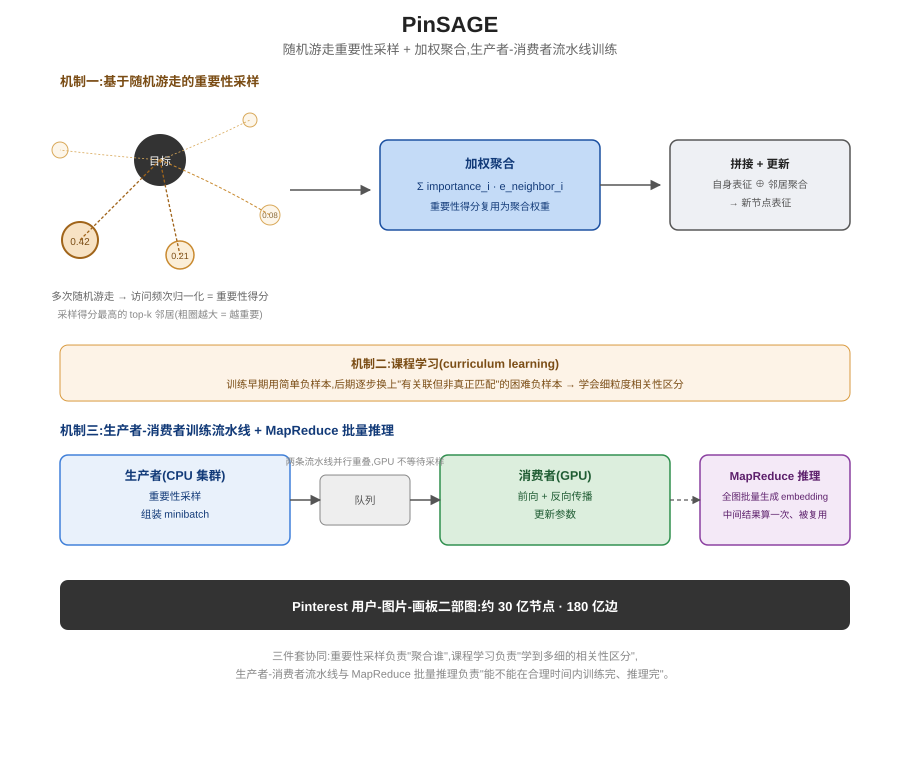

## 前作进展

[GraphSAGE](../17-graph-neural-networks/02-graphsage.md)(Hamilton, Ying & Leskovec, 2017)证明了一件事:GNN 不需要为图里每个节点学一个固定的嵌入,而是可以学一个通用的、与具体图结构无关的"采样 + 聚合"函数——固定大小的邻域随机采样把不规则的邻居数量规整成统一形状,再用可学习的聚合函数(mean / LSTM / pooling)把采样到的邻居特征汇总起来。这让 GNN 第一次能够**归纳式**地泛化到训练时完全没见过的新节点,不需要重新训练整个模型。

但 GraphSAGE 论文实际验证的规模远远够不上 Pinterest 的生产环境。GraphSAGE 的实验用的是 Reddit(约 23 万节点)和 PPI(蛋白质相互作用网络,多图归纳式场景)这类中等规模的图;而 Pinterest 真实的用户-图片-画板关系图有约 **30 亿节点、180 亿边**。GraphSAGE 论文本身也没有讨论过在这个数量级的图上要怎么采样、怎么训练、怎么给全图节点批量生成 embedding。直接照搬 GraphSAGE 的训练方式——单机、把邻接表整个放进内存、对每个节点做均匀随机采样——在这个规模下完全跑不动:随机采样到的邻居大概率是无关紧要的长尾节点,训练效率低;单机内存装不下 30 亿节点的图结构和特征;就算训练出模型,给全部节点生成一遍 embedding 这件事本身,如果不做任何计算复用,也是天文数字级别的开销。PinSAGE 要解决的正是这三个工程问题:怎么采样到"最重要"的邻居而不是随机邻居,怎么设计一套能在分布式集群上高效运行的训练流水线,怎么给数十亿节点批量生成 embedding 而不做重复计算。

## 核心思想 + 直觉

PinSAGE 保留了 GraphSAGE"采样 + 聚合"的核心框架——没有发明新的图卷积范式,而是把其中两个关键环节换成了能扛住工业级规模的工程方案。第一处替换:用**基于随机游走的重要性采样**取代 GraphSAGE 的均匀随机采样,让模型优先聚合那些对目标节点真正重要的邻居,而不是随机挑到的邻居。第二处替换:用**生产者-消费者流水线**取代单机训练循环,让"从图里采样构造 batch"和"GPU 做前向反向传播"这两件事并行重叠,而不是互相等待。

直觉上可以类比这样一个场景:面对一张几十亿人的巨大社交图,想搞清楚"谁对我影响最大",与其在我认识的人里随便抽几个(均匀随机采样),不如反复从我出发做几次短距离随机游走,看看哪些人被反复经过——被经过次数多的人,大概率就是关系更紧密、更值得重点参考的人。PinSAGE 把这个直觉用在图卷积的邻居选择上,同时把训练这件事拆成"边采样边训练"的两条并行流水线,而不是采样完再训练。

## 机制一:基于随机游走的重要性采样

对图里的每个目标节点,PinSAGE 从它出发反复做多次短距离随机游走,统计每个被访问到的节点的**归一化访问频次**,作为这个节点相对目标节点的"重要性得分"。采样邻居时,不再像 GraphSAGE 那样均匀随机挑,而是优先选择重要性得分最高的一批节点。

这样做同时解决了两个问题:一是控制了每一层参与聚合计算的邻居数量,计算开销可控;二是确保模型聚合到的确实是对目标节点有意义的邻居,而不是随机采样到的、大概率不相关的长尾噪声节点。这个重要性得分不只用来决定"采样谁",后续聚合时还会被复用为**聚合权重**——重要性得分高的邻居,在加权聚合时贡献也更大,而不是像 mean aggregator 那样把所有采样到的邻居一视同仁。

## 机制二:高效图卷积与困难负样本的课程学习

PinSAGE 的图卷积本身沿用 GraphSAGE 式的"采样-聚合"结构:每一层对目标节点的邻居做重要性采样,加权聚合邻居在上一层的表征,再和目标节点自身上一层的表征结合,得到这一层的新表征。

在此之上,论文额外引入了**课程学习(curriculum learning)**来训练这套图卷积:训练过程中逐步引入难度更高的负样本——不是那种和目标节点完全无关、一眼就能分辨出"不相关"的随机负样本,而是和目标节点有一定关联、但并非真正匹配的物品(比如同一个大类目下但用户实际不感兴趣的商品)。训练早期用简单负样本让模型先学会区分"完全无关"和"相关",训练后期逐步换上这些更难分辨的负样本,逼着模型学会区分更细粒度的相关性差异,而不是止步于粗糙的"相关 / 不相关"二分类。

## 机制三:生产者-消费者分布式训练流水线与 MapReduce 批量推理

训练阶段,PinSAGE 采用生产者(producer)/ 消费者(consumer)流水线架构:生产者是一个 CPU 集群,负责在图上做重要性采样、组装训练用的 minibatch;消费者是 GPU,负责对组装好的 minibatch 做前向-反向传播、更新参数。两者并行运行——CPU 在为下一个 batch 采样的同时,GPU 正在训练当前 batch,而不是"采样完等 GPU、GPU 训练完等采样"的串行等待,避免了 GPU 因为等待数据采样而空转。

推理阶段(给图上全部数十亿节点批量生成 embedding)则采用类似 **MapReduce** 的批量处理方式:把图卷积的计算按层拆解成 map/reduce 步骤,确保每个节点在某一层的中间计算结果只被计算一次,后续需要用到这个结果的所有下游节点都直接复用,而不是像朴素实现那样——对每个目标节点独立地把它所有邻居、邻居的邻居的表征重新算一遍,导致同一个节点的中间结果在不同目标节点的计算路径里被反复重复计算。这个复用机制是能否在合理时间内给 30 亿节点全部生成 embedding 的关键。

## 三件套协同

三个机制拆开看都不足以支撑 PinSAGE 在 Pinterest 真实规模的图上落地:

- 只有**重要性采样**(机制一),没有课程学习和高效卷积(机制二):模型能聚合到真正重要的邻居,但训练时只用简单负样本,学不会区分"有点相关但不是真正匹配"这类精细的相关性差异,排序质量上不去。
- 只有**课程学习**(机制二),没有分布式训练流水线(机制三):课程学习本身能提升排序能力,但单机训练循环在 30 亿节点规模的图上根本跑不起来,连基本的训练都无法完成,更谈不上引入困难负样本这种进阶训练技巧。
- 没有 **MapReduce 式批量推理**(机制三的另一半):就算前两者都训好了模型,给全图数十亿节点生成 embedding 这一步如果不做计算复用,推理开销依然是天文数字,模型实际上无法部署上线提供服务。

三者组合起来,重要性采样负责"聚合谁",课程学习负责"学到多细的相关性区分",生产者-消费者流水线和 MapReduce 批量推理负责"能不能在合理时间内训练完、推理完"——缺一个,PinSAGE 都无法在 Pinterest 真实的 30 亿节点、180 亿边规模的图上训练出一个真正能部署的推荐模型。



*图 1:从目标节点出发做多次随机游走,按访问频次算出每个邻居的重要性得分,采样并加权聚合成节点的新表征;训练阶段 CPU 生产者持续采样组装 minibatch,GPU 消费者并行做前向反向传播,两条流水线重叠运行。*

## 关键代码

随机游走重要性采样 + 加权聚合更新的简化伪代码(不追求完整可运行,详略程度参照 [DeepSeek-V3](../13-moe-efficient/04-deepseek-v3.md) 节点):

```python
import torch
import torch.nn as nn
from collections import Counter


def random_walk_importance_sample(node, adj_list, num_walks=200, walk_len=3, top_k=20):
    """机制一:从 node 出发做多次短随机游走,按访问频次算重要性得分,
    取 top_k 个得分最高的邻居及其归一化得分作为采样结果"""
    visit_count = Counter()
    for _ in range(num_walks):
        cur = node
        for _ in range(walk_len):
            neighbors = adj_list[cur]
            if not neighbors:
                break
            cur = neighbors[torch.randint(len(neighbors), (1,)).item()]
            visit_count[cur] += 1
    total = sum(visit_count.values()) or 1
    top_neighbors = visit_count.most_common(top_k)
    sampled = [n for n, _ in top_neighbors]
    weights = torch.tensor([c / total for _, c in top_neighbors])  # 重要性得分,后续复用为聚合权重
    return sampled, weights


class ImportanceWeightedAggregator(nn.Module):
    """用重要性得分做加权聚合,而非 GraphSAGE mean aggregator 的等权平均"""
    def forward(self, neighbor_feats, importance_weights):
        # neighbor_feats: (num_samples, feat_dim), importance_weights: (num_samples,)
        w = importance_weights / importance_weights.sum()
        return (neighbor_feats * w.unsqueeze(-1)).sum(dim=0)


class PinSAGELayer(nn.Module):
    def __init__(self, in_dim, out_dim):
        super().__init__()
        self.aggregator = ImportanceWeightedAggregator()
        self.linear = nn.Linear(in_dim * 2, out_dim, bias=False)  # 拼接自身表征 + 邻居聚合表征

    def forward(self, self_feat, neighbor_feats, importance_weights):
        agg = self.aggregator(neighbor_feats, importance_weights)
        combined = torch.cat([self_feat, agg], dim=-1)
        return torch.relu(self.linear(combined))


# 训练时:producer(CPU 集群)持续跑 random_walk_importance_sample 组装 minibatch,
# consumer(GPU)持续消费 minibatch 做前向 + 反向传播,两者通过队列并行重叠,
# 并配合课程学习逐步加入更难区分的负样本(机制二)——这些调度细节不改变上面
# 单层前向逻辑的结构,但决定了训练能否在数十亿节点规模的图上跑得动。
# 推理时:给全图节点批量生成 embedding 采用 MapReduce 式分层计算,
# 每个节点在某一层的中间结果只算一次、被所有下游节点复用(机制三)。
```

## 性能数据

> 以下数字基于训练知识回忆,本次任务执行时未做实时联网核实,建议读者对照原论文(arXiv:1806.01973,KDD 2018)核实具体数值后再引用。方向性结论(离线评估相对纯内容特征方法和传统协同过滤有明显提升、上线后带来可衡量的用户互动提升)把握较高。

- **离线评估**:论文用 hit-rate 等离线指标,对比纯视觉/文本内容特征方法(不利用图结构信息)以及传统协同过滤方法,PinSAGE 在推荐相关性上有明显提升——论文将这一提升归因于图卷积能同时利用节点自身内容特征和图结构里蕴含的邻域信息,而不是只依赖其中一种。
- **线上 A/B 测试**:PinSAGE 部署到 Pinterest 生产环境的相关图片推荐场景后,带来了用户互动指标(如repin 率等)的可衡量提升,论文强调这是在 30 亿节点、180 亿边的真实生产图上跑出来的结果,而不只是离线基准上的改善。
- **工程规模**:论文报告了在数十台机器规模的集群上训练、并对全图数十亿节点批量生成 embedding 所需的时间量级,证明了这套采样 + 流水线方案在真实工业规模下是可落地的,而不仅仅是理论上可行。

## 影响 / 后续

PinSAGE 是 GNN 技术在推荐系统里最早、影响力最大的工业级落地案例之一,证明了图卷积可以扩展到真正生产环境规模的图(数十亿节点/边),而不只是学术基准上的中小规模验证。它给后续一大批"用 GNN 做推荐"的工业实践——电商场景的商品图卷积、社交网络场景的关系图卷积等——提供了一套可复用的工程蓝图:重要性采样解决"聚合谁",分布式流水线解决"训得动训不动",批量推理复用解决"部署不部署得起"。这三个问题在任何试图把 GNN 用到大规模图上做推荐的团队那里都会重新遇到,PinSAGE 是第一个把三者系统性解决掉的公开案例。

对本家族而言,PinSAGE 也是教学顺序上的最后一个节点,补上了这条主线的最后一块拼图:从 Wide & Deep 的人工特征叉乘记忆,到 DeepFM 的自动特征交互建模,到 DIN 的动态用户兴趣建模,再到 PinSAGE 完全跳出表格特征框架、直接在用户-物品关系图上做归纳式表征学习——推荐系统这条主线从"人工特征工程"一路走到"端到端建模用户兴趣与关系结构"。

→ [../17-graph-neural-networks/02-graphsage.md](../17-graph-neural-networks/02-graphsage.md) · 本文直接扩展的归纳式图卷积架构
→ [04-din.md](04-din.md) · 同年发布,从表格特征交互转向图结构建模的互补路径
