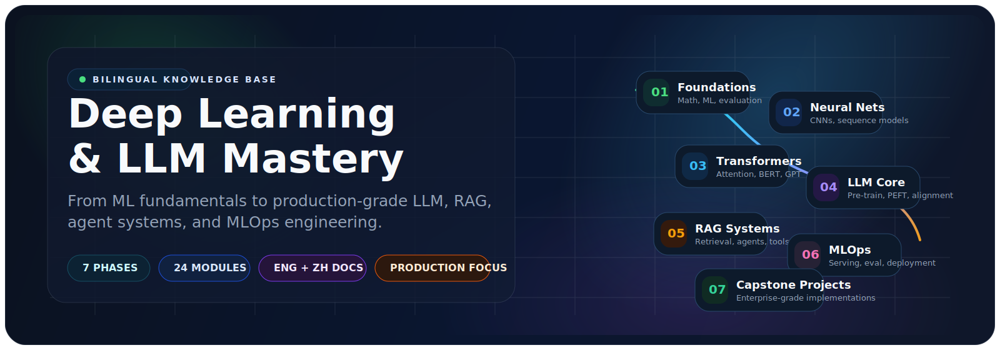

<div align="center">



# 深度学习与大模型精通之路

### Deep Learning & LLM Mastery

<p>
  <strong>从机器学习基础，到生产级 LLM / RAG / Agent / MLOps 系统的一条完整工程路线。</strong>
</p>

<p>
  面向工程师、研究者与技术负责人设计的双语知识库。<br/>
  不只讲概念，更强调架构理解、系统设计、实现细节、评估方法与真实落地。
</p>

<p>
  <a href="README_EN.md"><strong>English</strong></a>
  ·
  <a href="#highlights"><strong>亮点速览</strong></a>
  ·
  <a href="#why-this-repo"><strong>为什么值得收藏</strong></a>
  ·
  <a href="#learning-map"><strong>学习地图</strong></a>
  ·
  <a href="#quick-start"><strong>快速开始</strong></a>
  ·
  <a href="CONTRIBUTING.md"><strong>贡献指南</strong></a>
</p>

[](LICENSE)
[](https://www.python.org/downloads/)
[](./)
[](./)
[](README_EN.md)

</div>

> [!TIP]
> 如果这个仓库帮你节省了调研时间、理清了技术脉络，欢迎点一个 Star。

<a id="highlights"></a>

## 亮点速览

<table>
  <tr>
    <td width="25%" align="center" valign="top">
      <strong><sub>PHASES</sub></strong><br/>
      <strong>7</strong><br/>
      渐进阶段
    </td>
    <td width="25%" align="center" valign="top">
      <strong><sub>MODULES</sub></strong><br/>
      <strong>24</strong><br/>
      一级核心模块
    </td>
    <td width="25%" align="center" valign="top">
      <strong><sub>COVERAGE</sub></strong><br/>
      <strong>ML → LLM → RAG → MLOps</strong><br/>
      从基础到生产
    </td>
    <td width="25%" align="center" valign="top">
      <strong><sub>DOCS</sub></strong><br/>
      <strong>English + 中文</strong><br/>
      适合长期沉淀
    </td>
  </tr>
</table>

> 用一套连续的工程学习路径，把原理、架构、实现、评测与落地串成完整闭环。

<a id="why-this-repo"></a>

## 为什么这个仓库值得收藏

<table>
  <tr>
    <td width="33%" valign="top">
      <strong>系统化，而不是碎片化</strong><br/>
      用 7 个阶段串起 ML、神经网络、Transformer、LLM、RAG、Agent、MLOps 与项目实战，减少“会调 API 但不懂底层和工程”的断层。
    </td>
    <td width="33%" valign="top">
      <strong>工程导向，而不是纯概念导向</strong><br/>
      内容覆盖预训练、微调、对齐、检索、推理服务、监控评测、部署与成本优化，强调真正可落地的系统能力。
    </td>
    <td width="33%" valign="top">
      <strong>双语沉淀，适合长期回看</strong><br/>
      核心文档提供中英文版本，既适合中文学习，也方便和国际资料、团队文档与开源生态对齐。
    </td>
  </tr>
</table>

## 仓库一览

| 维度 | 内容 |
| --- | --- |
| 学习路径 | 7 个渐进阶段，覆盖从基础到生产的完整链路 |
| 核心模块 | 24 个一级模块，按主题拆分清晰 |
| 内容风格 | 原理 + 工程 + 架构 + 实战，不止是教程索引 |
| 适合人群 | ML 工程师、软件工程师、研究者、技术负责人 |
| 文档语言 | 中文 / English |

## 学完这套内容后，你会得到什么

- 能从经典机器学习一路理解到 Transformer、LLM、RAG 与 Agent 系统的关键原理。
- 能判断不同技术栈各自适合什么场景，而不是只会套一个流行框架。
- 能把知识迁移到真实项目：微调、检索、服务化、评测、观测与部署。
- 能更系统地搭建自己的 AI 工程认知，而不是长期停留在零散文章和视频里。

<a id="learning-map"></a>

## 学习地图

| Phase | 主题 | 你会掌握什么 | 入口 |
| --- | --- | --- | --- |
| **01** | Foundations | 经典 ML、数学基础、评估方法、深度学习入门 | [进入 Phase 01](01-Foundations/) |
| **02** | Neural Networks | CNN、序列模型、训练技巧、优化方法 | [进入 Phase 02](02-Neural-Networks/) |
| **03** | NLP & Transformers | 注意力机制、Transformer 架构、BERT/GPT/T5 | [进入 Phase 03](03-NLP-Transformers/) |
| **04** | LLM Core | 预训练、PEFT、对齐、提示工程、框架、多模态 | [进入 Phase 04](04-LLM-Core/) |
| **05** | RAG & Agents | 检索增强生成、向量数据库、工具调用、多智能体 | [进入 Phase 05](05-RAG-Systems/README.md) |
| **06** | MLOps & Production | 分布式训练、服务化、监控、评测、部署与成本 | [进入 Phase 06](06-MLOps-Production/README.md) |
| **07** | Capstone Projects | 企业级 RAG、自动化微调与部署流水线 | [进入 Phase 07](07-Capstone-Projects/) |

## 按你的目标选择起点

| 你的身份 / 目标 | 推荐阅读顺序 |
| --- | --- |
| 想系统补全基础的工程师 | `01 -> 02 -> 03 -> 04 -> 05 -> 06 -> 07` |
| 想尽快做出 RAG / Agent 项目 | `03 -> 04 -> 05 -> 06 -> 07` |
| 想专注大模型训练与微调 | `02 -> 03 -> 04 -> 06 -> 07` |
| 负责 AI 架构与团队落地 | `04 -> 05 -> 06 -> 07` |

<a id="structure"></a>

## 知识结构

<details>
<summary><strong>展开查看仓库目录</strong></summary>

```text
Daily-LLM/
├── 01-Foundations/          # 机器学习与深度学习基石
├── 02-Neural-Networks/      # CNN、序列模型、训练与优化
├── 03-NLP-Transformers/     # 注意力机制与 Transformer 体系
├── 04-LLM-Core/             # 预训练、PEFT、对齐、提示工程、多模态
├── 05-RAG-Systems/          # RAG、向量检索、Agent、生产模式
├── 06-MLOps-Production/     # 训练基础设施、服务、监控、部署
├── 07-Capstone-Projects/    # 企业级端到端项目
├── CHANGELOG.md
├── CONTRIBUTING.md
├── README.md
└── README_EN.md
```

</details>

## 你将在这里看到的典型主题

- **模型基础**: 机器学习算法、反向传播、优化、评估指标。
- **Transformer 体系**: 自注意力、编码器-解码器、主流预训练模型家族。
- **LLM 核心能力**: 预训练流程、LoRA/QLoRA、RLHF、DPO、提示工程、多模态。
- **RAG 与 Agent**: Chunking、Embedding、Rerank、Query Rewriting、Tool Use、Memory、多智能体。
- **生产工程**: vLLM、模型服务、可观测性、基准测试、CI/CD、Kubernetes、成本优化。
- **实战项目**: 企业搜索、代码助手、对话系统、自动化微调与部署流水线。

<a id="quick-start"></a>

## 快速开始

### 1. 克隆仓库

```bash
git clone https://github.com/zkywsg/Daily-LLM.git
cd Daily-LLM
```

### 2. 安装依赖

```bash
pip install -r requirements.txt
```

<details>
<summary><strong>按阶段选择性安装依赖</strong></summary>

```bash
# Phase 1-2
pip install torch numpy scikit-learn matplotlib

# Phase 3-4
pip install transformers datasets peft trl sentence-transformers

# Phase 5
pip install sentence-transformers faiss-cpu chromadb langchain

# Phase 6-7
pip install vllm fastapi mlflow wandb
```

</details>

### 3. 选择你的起点

- 想打牢基础：从 [01-Foundations](01-Foundations/) 开始。
- 想快速进入 LLM 工程：从 [04-LLM-Core](04-LLM-Core/) 开始。
- 想构建检索与智能体系统：从 [05-RAG-Systems](05-RAG-Systems/README.md) 开始。
- 想关注线上落地与工程化：从 [06-MLOps-Production](06-MLOps-Production/README.md) 开始。

## 适合谁

- **机器学习工程师**: 想从传统 ML 走向 LLM / GenAI 工程。
- **软件工程师**: 想构建 AI 产品，而不只是调用一个 API。
- **研究者**: 想把方法论、架构与实现细节串起来理解。
- **技术负责人**: 想建立可扩展、可观测、可维护的 AI 系统认知。

## 贡献

欢迎贡献改进内容、补充案例、修正文档或完善结构。提交前请先阅读 [CONTRIBUTING.md](CONTRIBUTING.md)。

## 许可证

本项目采用 [MIT License](LICENSE)。

---

<div align="center">
  如果这个仓库对你有帮助，欢迎 Star，它会直接影响这个知识库后续整理和扩展的优先级。
</div>
