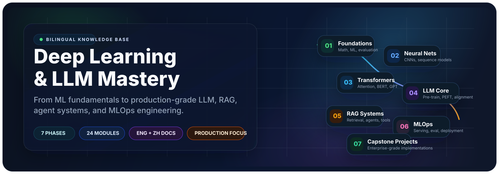

<div align="center">



# Deep Learning & LLM Mastery

### An explorable history and structured learning map of modern AI architectures

<p>
  From the 1986 RNN to 2025 reasoning models: 89 works organized into 19 architecture families.
</p>

<p>
  <a href="README.md"><strong>中文</strong></a>
  ·
  <a href="#timeline"><strong>Timeline</strong></a>
  ·
  <a href="#web"><strong>Interactive Web App</strong></a>
  ·
  <a href="#quick-start"><strong>Quick Start</strong></a>
  ·
  <a href="CONTRIBUTING.md"><strong>Contributing</strong></a>
</p>

[](LICENSE)
[](https://www.python.org/downloads/)
[](./)
[](README.md)

</div>

Daily-LLM is a Chinese-first, bilingual knowledge base for understanding how deep-learning and large-model architectures evolved. Markdown remains the canonical content source; the Web app turns that material into a searchable timeline, family browser, and interactive learning experience.

<a id="timeline"></a>

## Timeline: 19 Architecture Families

| # | Family | Years | Focus |
|---|---|---|---|
| 01 | [Convolutional Neural Networks](01-cnn/) | 1998–2022 | Learned visual features and deep residual backbones |
| 02 | [RNN / LSTM / GRU](02-rnn-lstm/) | 1986–2015 | Recurrent memory and sequence modeling |
| 03 | [Word Embeddings](03-word-embedding/) | 2013–2018 | Distributed and contextual word representations |
| 04 | [Generative Adversarial Networks](04-gan/) | 2014–2018 | Generative modeling through adversarial training |
| 05 | [Transformer](05-transformer/) | 2017–2022 | Parallel sequence modeling with attention |
| 06 | [BERT Family](06-bert-family/) | 2018–2019 | Bidirectional pretraining and task fine-tuning |
| 07 | [GPT and Scaling](07-gpt-scaling/) | 2018–2023 | Autoregressive pretraining and scaling laws |
| 08 | [Vision Transformers](08-vit/) | 2020–2022 | Transformer architectures for vision |
| 09 | [Multimodal Alignment](09-multimodal-clip/) | 2021–2023 | Shared representations across images and language |
| 10 | [Diffusion Models](10-diffusion/) | 2020–2023 | High-quality generation through iterative denoising |
| 11 | [Parameter-Efficient Fine-Tuning](11-peft-lora/) | 2019–2023 | Adapting large models with a small trainable footprint |
| 12 | [Alignment and RLHF](12-rlhf-alignment/) | 2020–2023 | Aligning model behavior with human preferences |
| 13 | [Mixture of Experts](13-moe-efficient/) | 2017–2024 | Separating parameter capacity from active compute |
| 14 | [RAG and Agents](14-rag-agent/) | 2020–2023 | Connecting models to knowledge and tools |
| 15 | [Reasoning Models](15-reasoning-o1-r1/) | 2022–2025 | Scaling inference-time computation |
| 16 | [World Models and Video Generation](16-world-models/) | 2018–2024 | Learning environment dynamics and generative worlds |
| 17 | [Graph Neural Networks](17-graph-neural-networks/) | 2017–2021 | Learning representations over arbitrary graphs |
| 18 | [Speech and Audio Models](18-speech-audio/) | 2020–2023 | Self-supervised speech and audio-token generation |
| 19 | [Recommendation Systems](19-recommendation/) | 2016–2018 | Feature interactions, user interest, and graph recommendation |

Browse all 89 works by year in [TIMELINE.md](TIMELINE.md), or review shared prerequisites in [foundations/](foundations/).

<a id="web"></a>

## Interactive Web App

The app in [web/](web/) provides:

- a density-aware chronological timeline;
- a 19-family visual browser;
- search across model names and key ideas;
- Markdown article rendering with math, code, diagrams, and local assets;
- interactive “golden sample” pages for selected models;
- shared foundation modules.

The public deployment URL will be added after the first release. To run it locally:

```bash
cd web
npm install
npm run dev -- --host 127.0.0.1 --port 5173 --strictPort
```

Open `http://127.0.0.1:5173/`.

## Repository Structure

- `01-cnn/` … `19-recommendation/` — canonical family and node content
- `foundations/` — shared foundations such as optimization, normalization, and attention
- `projects/` — cross-family capstone projects
- `web/` — React and TypeScript Web experience
- `TIMELINE.md` — generated chronological index; do not edit manually
- `_archive/` — read-only historical material

<a id="quick-start"></a>

## Quick Start

```bash
git clone https://github.com/zkywsg/Daily-LLM.git
cd Daily-LLM
pip install -r requirements.txt
```

When node frontmatter changes or a node is added, regenerate the timeline and Web metadata:

```bash
python3 scripts/generate_timeline.py
```

## Contributing

Contributions that improve explanations, examples, diagrams, facts, accessibility, or the Web experience are welcome. Read [CONTRIBUTING.md](CONTRIBUTING.md) before submitting changes.

## License

Daily-LLM is released under the [MIT License](LICENSE).
