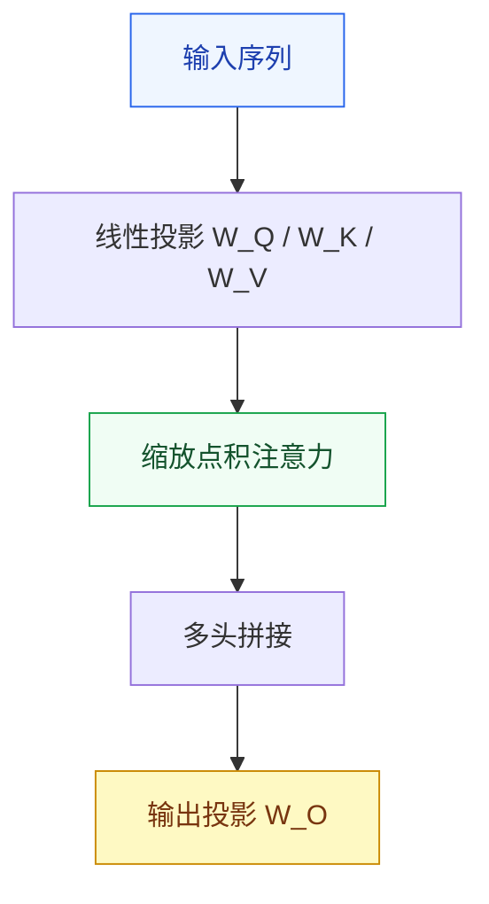

# Daily-LLM 风格指南

> 本文件是仓库所有内容的唯一权威风格参考。
> 新建模块、补充内容、修改文档，均以此为准。

---

## 一、写作结构模板

每个概念模块（README.md）必须包含以下结构，顺序不变：

```
# 模块名

## 概述          ← 1-3 句话，说清楚"这是什么，解决什么问题"
## 学习目标      ← 3 个可回答的问题（完成后能回答什么）
## 1. 直觉       ← 生活类比 / 感性场景，不用公式
## 2. 机制       ← 公式 + 伪代码 + 最小实现
## 3. 工程陷阱   ← 编号清单，按优先级排序
## 下一步学习    ← 链接到下一个模块
```

**三段式教学法**是贯穿全仓库的核心教学逻辑：

| 段落 | 目的 | 典型内容 |
|------|------|---------|
| 直觉 | 建立感性认知 | 生活类比、直观场景、一句话定义 |
| 机制 | 精确理解原理 | 数学公式、伪代码、最小可运行实现 |
| 工程陷阱 | 避开真实坑 | 按优先级排序的 debug 清单 |

---

## 二、签名写作元素

### 2.1 "你要记住" Callout

每个重要知识点结束后，用一句话做提炼性总结：

```markdown
> 你要记住：[一句话核心结论]
```

**使用规则：**
- 每节最多出现 1 次，全模块不超过 5 次
- 必须是结论性的，不是描述性的（"A 比 B 快" 而不是 "A 和 B 都很重要"）
- 用自己的语言写，不要直接复制公式

**示例：**
```markdown
> 你要记住：`QK^T` 给相关性，`softmax` 给权重，`@V` 给上下文聚合结果。
```

### 2.2 表格三列规范

涉及多个组件/概念对比时，使用三列表格：**组件 | 作用 | 类比（或场景）**

```markdown
| 组件 | 作用 | 类比 |
|------|------|------|
| Query | 当前要找的信息 | 检索请求 |
| Key   | 可匹配的索引   | 倒排索引项 |
| Value | 被汇聚的内容   | 真实文档内容 |
```

### 2.3 陷阱清单格式

工程陷阱用编号清单，格式固定为：**原因 → 现象**

```markdown
## 常见陷阱与排障优先级

1. [忘记做 X] → [导致 Y 问题]
2. [掩码形状错误] → [泄露未来信息/训练失效]
3. [序列过长] → [OOM，先降序列长度]
```

---

## 三、图示规范

### 3.1 工具选择

| 图示类型 | 工具 | 原因 |
|---------|------|------|
| 架构图、数据流 | **Mermaid** | 纯文本，进版本控制，GitHub 原生渲染 |
| 手绘概念草图 | Excalidraw (.excalidraw 文件) | 手绘风格适合解释直觉 |
| 不允许使用 | 截图、PPT 导出图 | 无法版本控制，无法协作修改 |

### 3.2 Mermaid 架构图模板

架构图统一使用 `graph TD`（从上到下），颜色使用下方色彩规范：



### 3.3 色彩规范

全仓库统一使用以下 6 种颜色，不引入其他颜色：

| 用途 | 填充色 | 边框色 | 文字色 |
|------|--------|--------|--------|
| 输入/数据 | `#EFF6FF` | `#2563EB` | `#1E40AF` |
| 计算/处理 | `#F0FDF4` | `#16A34A` | `#14532D` |
| 输出/结果 | `#FEF9C3` | `#CA8A04` | `#78350F` |
| 警告/陷阱 | `#FEF2F2` | `#DC2626` | `#7F1D1D` |
| 中性/注释 | `#F8FAFC` | `#94A3B8` | `#475569` |
| 强调/关键 | `#FAF5FF` | `#7C3AED` | `#4C1D95` |

---

## 四、代码规范

### 4.1 三行注释头

每个核心函数/类，注释头固定三行：

```python
# 核心思想：[用一句话解释这段代码在做什么]
# 数学对应：[对应公式，如 Attention(Q,K,V) = softmax(QK^T/√d_k)V]
# 复杂度：时间 O(n²d)，空间 O(n²)
def scaled_dot_product_attention(q, k, v, mask=None):
    """
    Args:
        q: (batch, heads, seq_q, d_k)
        k: (batch, heads, seq_k, d_k)
        v: (batch, heads, seq_k, d_v)
        mask: (batch, 1, 1, seq_k) 或 None
    Returns:
        context: (batch, heads, seq_q, d_v)
        weights: (batch, heads, seq_q, seq_k)
    """
```

**规则：**
- 数学对应行：如果没有对应公式，写"无显式公式"，不省略这行
- 复杂度行：至少写时间复杂度，空间复杂度能写则写
- Docstring 中 Args 必须标注 shape，不能只写类型

### 4.2 代码文件头

每个独立 `.py` 文件顶部统一格式：

```python
"""
模块名称：[简短名称]
所属路径：[如 03-NLP-Transformers/attention-mechanisms]
核心内容：[1-2 句话]

依赖：
    torch>=2.0, einops>=0.7
"""
```

### 4.3 其他代码规范

- 格式化工具：Black（行宽 88）
- 类型注解：核心函数必须有，工具函数可选
- 魔法数字：必须命名为常量，如 `D_MODEL = 512`
- 随机种子：示例代码统一用 `torch.manual_seed(42)`

---

## 五、Notebook 规范

每个模块的 `notebook.ipynb` 统一结构：

```
Cell 1 [Markdown]  # 模块标题 + 2 句话说明本 notebook 做什么
Cell 2 [Code]      # 导入 + 环境检查（torch 版本、GPU 状态）
Cell 3 [Markdown]  ## 1. 直觉（复用 README 直觉部分，可补可视化）
Cell 4 [Code]      # 最小实现，有逐行注释
Cell 5 [Markdown]  ## 2. 验证
Cell 6 [Code]      # 验证代码：打印 shape / 对比期望输出
Cell 7 [Markdown]  ## 3. 进一步探索（可选，实验性内容放这里）
```

**规则：**
- Cell 4 的代码必须能独立运行（不依赖前面 cell 的中间变量）
- 所有 `print` 输出必须带标签，如 `print(f"注意力权重 shape: {weights.shape}")`
- Notebook 不做训练，只做推理和可视化（训练放 `src/` 目录）

---

## 六、文件命名规范

| 文件类型 | 命名规则 | 示例 |
|---------|---------|------|
| 文档（主）| `README.md` | — |
| 文档（英文）| `README_EN.md` | — |
| Notebook | `notebook.ipynb` | — |
| Python 实现 | `snake_case.py` | `attention.py` |
| 目录名 | `kebab-case` | `attention-mechanisms` |

**Production 目录下的 PascalCase 目录**（`Code-Assistant` 等）暂时保留，新建目录一律用 `kebab-case`。

---

## 七、章节导航规范

每个 README.md 底部必须有：

```markdown
---

**上一章**: [章节名](../上一模块/README.md) | **下一章**: [章节名](../下一模块/README.md)
```

Phase 级别的 README.md 底部：

```markdown
---

**上一阶段**: [Phase XX](../0X-Phase/README.md) | **下一阶段**: [Phase XX](../0X-Phase/README.md)
```

---

## 参考：金标准模块

`03-NLP-Transformers/attention-mechanisms/README.md` 是目前最接近完整风格的模块。
新内容写完后，对照该模块逐项检查。
