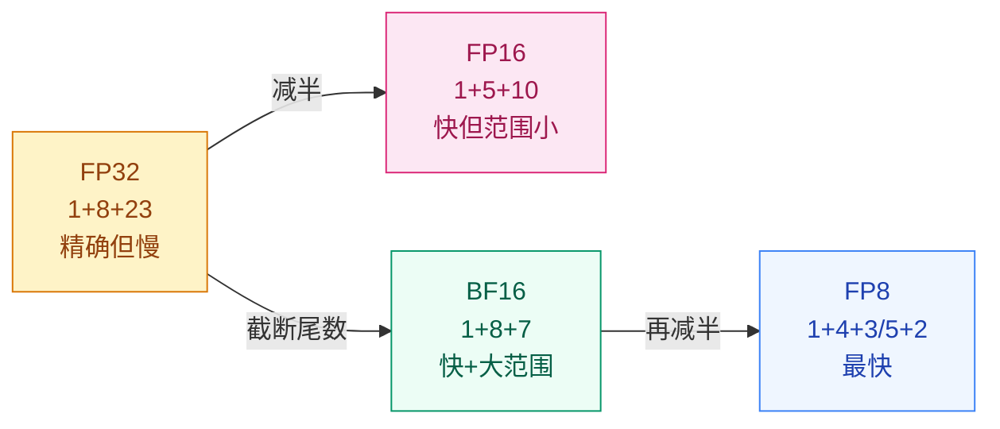

# 为什么 FP16 训练会"丢精度"？—— 数值精度与分布式训练基础

## 这个问题从哪来

> 2017 年前后，混合精度训练开始流行：用 FP16（半精度浮点）做前向和反向传播，速度翻倍、显存减半。但直接把模型从 FP32 丢进 FP16 训练，loss 可能直接变成 NaN。
> 后来 BF16（Brain Float）解决了 FP16 的精度陷阱，A100/H100 硬件原生支持 BF16——大模型训练几乎全部迁移到了 BF16。
> 同时，模型大到单张 GPU 装不下，数据并行、ZeRO、张量并行成为训练基础设施的核心概念。

## 学习目标

完成本章后，你应能回答：

1. FP32、FP16、BF16 的位数分配有什么区别？为什么 BF16 比 FP16 更适合训练？
2. 混合精度训练的工作流程是什么？为什么需要 loss scaling？
3. 数据并行的核心思想是什么？

---

## 1. 直觉

FP32 是"精确记账"：每一分钱都记到小数点后 7 位。
FP16 是"粗略估算"：只记到小数点后 3 位，但速度快一倍。
BF16 是"FP32 的精度 + FP16 的速度"：牺牲了一点点精度，但范围和 FP32 一样大。

问题在于：梯度通常很小（如 $10^{-5}$），FP16 的最小正数约 $6 \times 10^{-8}$，再小的梯度就变成 0（underflow）。Loss scaling 的思路是"先把 loss 放大，算完梯度再缩回来"——给小数字一台放大镜。

> 你要记住：FP16 的致命问题不是"算不准"，而是"小数字直接变零"（梯度下溢）。BF16 用更多指数位解决了这个问题。

---

## 2. 机制

### 2.1 浮点格式对比

IEEE 754 浮点数由三部分组成：符号位（S）、指数位（E）、尾数位（M）。

$$
\text{value} = (-1)^S \times 2^{E - \text{bias}} \times 1.M
$$

| 格式 | 总位数 | 符号位 | 指数位 | 尾数位 | 范围 | 精度 |
|------|--------|--------|--------|--------|------|------|
| FP32 | 32 | 1 | 8 | 23 | $\pm 3.4 \times 10^{38}$ | ~7 位有效数字 |
| FP16 | 16 | 1 | 5 | 10 | $\pm 6.5 \times 10^{4}$ | ~3 位有效数字 |
| BF16 | 16 | 1 | 8 | 7 | $\pm 3.4 \times 10^{38}$ | ~2 位有效数字 |
| FP8 (E4M3) | 8 | 1 | 4 | 3 | $\pm 448$ | ~1 位有效数字 |
| FP8 (E5M2) | 8 | 1 | 5 | 2 | $\pm 57344$ | ~1 位有效数字 |

关键洞察：
- **FP16 vs BF16**：BF16 牺牲了 3 位尾数换取 3 位指数，范围与 FP32 相同，不容易溢出
- **FP16 的瓶颈**：5 位指数 → 范围只有 $\pm 65504$，大 loss 值溢出；10 位尾数 → 小梯度下溢
- **BF16 的权衡**：7 位尾数（精度较低）但范围足够大，训练更稳定



### 2.2 混合精度训练

混合精度训练（Micikevicius et al., 2018）不是"全部用 FP16"，而是 FP32 和 FP16 混合使用：

```
1. 维护 FP32 主权重（master weights）
2. 每步将 FP32 权重转成 FP16 做前向传播（快）
3. 用 FP16 计算 loss
4. 放大 loss（× scale_factor）
5. FP16 反向传播（梯度也是 FP16，但因放大而不下溢）
6. 缩回梯度（÷ scale_factor），转成 FP32
7. 用 FP32 梯度更新 FP32 主权重
```

**为什么需要 loss scaling？**

FP16 的最小正常数约 $6 \times 10^{-8}$，而很多梯度在 $10^{-5}$ 到 $10^{-8}$ 之间。不放大就直接变成 0。

放大后（如 × 1024），$10^{-8}$ 变成 $10^{-5}$，FP16 可以表示，反向传播结束后再缩回来。

**动态 vs 静态 scaling**：
- 静态：固定 scale factor（如 1024），简单但不够灵活
- 动态：从大 scale 开始，遇到 inf/nan 就减半，否则翻倍。PyTorch AMP 用动态 scaling

### 2.3 数据并行

当模型可以装进单张 GPU 但训练太慢时，用数据并行加速。

核心思想：每张 GPU 持有模型的完整副本，但处理不同的数据分片。

```
GPU 0: 模型副本 + 数据分片 0  →  梯度 0 ─┐
GPU 1: 模型副本 + 数据分片 1  →  梯度 1 ─┤→ AllReduce → 平均梯度 → 更新所有副本
GPU 2: 模型副本 + 数据分片 2  →  梯度 2 ─┤
GPU 3: 模型副本 + 数据分片 3  →  梯度 3 ─┘
```

有效 batch size = `per_gpu_batch × num_gpus`。8 张 GPU 各用 batch=32，等效 batch=256。

### 2.4 分布式训练演进

| 方法 | 核心思想 | 通信量 | 适用场景 |
|------|---------|--------|---------|
| DP (数据并行) | 同模型，不同数据 | 梯度 AllReduce | 模型能装进单卡 |
| DDP | DP 的分布式实现 | 梯度 AllReduce | 多机多卡 |
| FSDP/ZeRO | 分片存储模型状态 | 按需 AllGather | 大模型，单卡装不下 |
| 张量并行 | 切分单个矩阵运算 | 激活值 AllReduce | 单层太大 |
| 流水线并行 | 按层切分到不同 GPU | 隐状态点对点 | 层数太多 |

> 你要记住：数据并行是"模型不变，数据变"。模型并行是"数据不变，模型变"。实际大模型训练通常混合使用。

---

## 3. 渐进式实现

**Step 1 · 浮点精度对比**

```python
# 对比 FP32 与 FP16 的数值范围与精度
# 演示 FP16 的梯度下溢与精度丢失
# 理解混合精度训练的必要性
import numpy as np

# FP32 vs FP16 的表示范围
print("=== 数值范围 ===")
print(f"FP32 最大值: {np.finfo(np.float32).max:.2e}")
print(f"FP32 最小正值: {np.finfo(np.float32).tiny:.2e}")
print(f"FP16 最大值: {np.finfo(np.float16).max:.2e}")
print(f"FP16 最小正值: {np.finfo(np.float16).tiny:.2e}")

# FP16 的精度损失演示
a = np.float32(1.0)
b = np.float32(1e-4)
print(f"\nFP32: 1.0 + 1e-4 = {a + b}")  # 1.0001

a16 = np.float16(1.0)
b16 = np.float16(1e-4)
print(f"FP16: 1.0 + 1e-4 = {a16 + b16}")  # 可能丢失精度

# 梯度下溢演示
small_grad = np.float16(1e-7)
print(f"\nFP16 梯度下溢: 1e-7 → {small_grad}")  # 可能变成 0
```

**Step 2 · Loss Scaling 模拟**

```python
# 模拟 Loss Scaling 对小梯度的保护效果
# 对比直接转 FP16 与先放大再转 FP16
# 理解动态 scale 的核心思想
import numpy as np

np.random.seed(42)

# 模拟小梯度
gradients = np.array([1e-5, 1e-6, 1e-7, 1e-8, 1e-9], dtype=np.float32)

# 不 scaling：直接转 FP16
grad_fp16_no_scale = gradients.astype(np.float16)
print("无 scaling:")
for g32, g16 in zip(gradients, grad_fp16_no_scale):
    print(f"  FP32: {g32:.1e} → FP16: {g16:.1e}")

# 有 scaling：先放大再转 FP16，再缩回
SCALE = 1024.0
grad_scaled = gradients * SCALE
grad_fp16_scaled = grad_scaled.astype(np.float16)
grad_recovered = grad_fp16_scaled.astype(np.float32) / SCALE

print("\n有 scaling (×1024):")
for g32, g16, g_rec in zip(gradients, grad_fp16_scaled, grad_recovered):
    print(f"  FP32: {g32:.1e} → FP16×1024: {g16:.1e} → 恢复: {g_rec:.1e}")
```

**Step 3 · PyTorch AMP（自动混合精度）**

```python
# 使用 PyTorch AMP 进行自动混合精度训练
# 演示 autocast 与 GradScaler 的配合
# 验证 BF16/FP16 前向与反向流程
import torch
import torch.nn as nn

torch.manual_seed(42)

DIM, HIDDEN, CLASSES = 64, 128, 10

model = nn.Sequential(
    nn.Linear(DIM, HIDDEN),
    nn.ReLU(),
    nn.Linear(HIDDEN, CLASSES),
).cuda()

optimizer = torch.optim.Adam(model.parameters(), lr=1e-3)
loss_fn = nn.CrossEntropyLoss()

# AMP: 自动混合精度
scaler = torch.amp.GradScaler('cuda')

x = torch.randn(32, DIM).cuda()
y = torch.randint(0, CLASSES, (32,)).cuda()

# 训练一步
optimizer.zero_grad()
with torch.amp.autocast('cuda', dtype=torch.bfloat16):
    logits = model(x)
    loss = loss_fn(logits, y)

scaler.scale(loss).backward()
scaler.step(optimizer)
scaler.update()

print(f"Loss: {loss.item():.4f}")
print(f"Scaler scale factor: {scaler.get_scale()}")
```

**Step 4 · 梯度累积（模拟大 batch）**

```python
# 模拟梯度累积实现等效大 batch
# 每步 loss 除以 accum_steps 保持梯度尺度
# 验证累积完成后的参数更新
import torch
import torch.nn as nn

torch.manual_seed(42)

DIM, HIDDEN, CLASSES = 64, 128, 10
ACCUM_STEPS = 4  # 等效 batch = 32 × 4 = 128

model = nn.Sequential(
    nn.Linear(DIM, HIDDEN),
    nn.ReLU(),
    nn.Linear(HIDDEN, CLASSES),
)

optimizer = torch.optim.Adam(model.parameters(), lr=1e-3)
loss_fn = nn.CrossEntropyLoss()

# 模拟 4 个 mini-batch 的梯度累积
for step in range(ACCUM_STEPS):
    x = torch.randn(32, DIM)
    y = torch.randint(0, CLASSES, (32,))

    logits = model(x)
    loss = loss_fn(logits, y) / ACCUM_STEPS  # 除以累积步数
    loss.backward()

    if (step + 1) % ACCUM_STEPS == 0:
        optimizer.step()
        optimizer.zero_grad()

print(f"最终 loss: {loss.item() * ACCUM_STEPS:.4f}")
print(f"等效 batch size: {32 * ACCUM_STEPS}")
```

---

## 4. 工程陷阱（按严重度排序）

1. **FP16 训练出现 NaN**
   现象：loss 突然变成 NaN，权重变成 inf。
   处置：优先用 BF16（A100/H100 原生支持）。必须用 FP16 时，使用 AMP + GradScaler。

2. **GradScaler scale factor 不调整**
   现象：scaler 的 scale factor 始终很高，梯度一直有 inf。
   处置：PyTorch AMP 的 GradScaler 会自动降 scale——确保每步都调用 `scaler.step()` 和 `scaler.update()`。

3. **BF16 vs FP16 选错**
   现象：在 V100（不支持 BF16）上用 BF16，或在 A100 上用 FP16（次优）。
   处置：V100 → FP16 + AMP；A100/H100 → BF16（不需要 loss scaling）；消费级 GPU → 先检查是否支持 BF16。

4. **梯度累积时忘记除以步数**
   现象：累积 4 步的梯度后直接更新，等效学习率放大了 4 倍。
   处置：每步 loss 除以 `accum_steps`，或更新时 `lr / accum_steps`。

> 你要记住：有 A100/H100 就用 BF16，不需要 GradScaler。没有就用 FP16 + AMP。永远不要裸跑 FP16 训练。

---

## 演进笔记

> **精度的演进**：FP32 → FP16 混合精度 → BF16 主流 → FP8 探索。趋势是"越来越低精度"，但每次降精度都需要新的硬件支持和训练技巧。
>
> **分布式的演进**：单 GPU → 数据并行（DDP）→ ZeRO 分片 → 张量并行 + 流水线并行（3D 并行）。大模型训练（GPT-4 级别）通常同时使用三种并行策略。
>
> **留下的新问题**：本阶段（Prerequisites）到此结束。你已经掌握了理解后续所有模块的基础：从基础概念到数值精度。下一阶段将进入视觉智能——CNN 如何利用图像的局部结构。

→ 下一阶段：[视觉智能 — CNN 架构](../../../tracks/vision/cnn-architectures/README.md)

---

**上一章**：[归纳偏置](../inductive-bias/README.md) | **下一阶段**：[视觉智能 →](../../../tracks/vision/)
