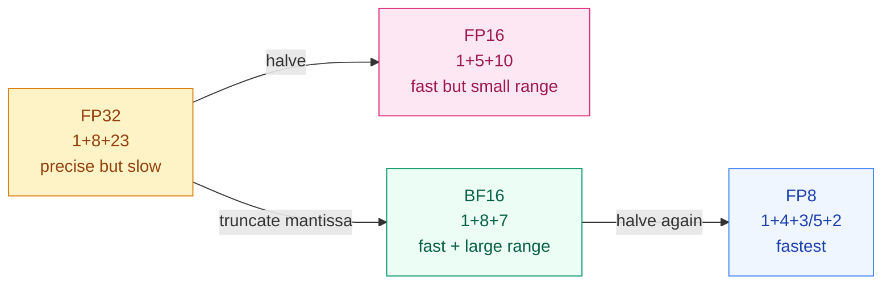

[English](README_EN.md) | [中文](README.md)

# Why Does FP16 Training "Lose Precision"? — Numerical Precision and Distributed Training

## Where This Problem Comes From

> Around 2017, mixed-precision training became popular: using FP16 (half-precision floating-point) for forward and backward passes, doubling speed and halving memory. But directly throwing a model from FP32 into FP16 training could cause loss to become NaN.
> Later, BF16 (Brain Float) solved FP16's precision trap, and A100/H100 hardware natively supports BF16 — large model training has almost entirely migrated to BF16.
> At the same time, as models grew too large for a single GPU, data parallelism, ZeRO, and tensor parallelism became core concepts in training infrastructure.

## Learning Objectives

After completing this chapter, you should be able to answer:

1. What are the bit allocations of FP32, FP16, and BF16? Why is BF16 more suitable for training than FP16?
2. What is the workflow of mixed-precision training? Why is loss scaling needed?
3. What is the core idea of data parallelism?

---

## 1. Intuition

FP32 is "precise bookkeeping": every cent is recorded to 7 decimal places.
FP16 is "rough estimation": only recorded to 3 decimal places, but twice as fast.
BF16 is "FP32's range + FP16's speed": sacrificing a bit of precision, but with the same range as FP32.

The problem is: gradients are usually very small (e.g., $10^{-5}$), and FP16's smallest positive normal number is about $6 \times 10^{-8}$; any smaller gradient becomes 0 (underflow). Loss scaling's idea is "first magnify the loss, then shrink the gradients back after computing them" — giving small numbers a magnifying glass.

> Key takeaway: FP16's fatal problem is not "inaccuracy," but "small numbers directly becoming zero" (gradient underflow). BF16 solves this with more exponent bits.

---

## 2. Mechanics

### 2.1 Floating-Point Format Comparison

IEEE 754 floating-point numbers consist of three parts: sign bit (S), exponent bits (E), and mantissa bits (M).

$$
\text{value} = (-1)^S \times 2^{E - \text{bias}} \times 1.M
$$

| Format | Total Bits | Sign Bits | Exponent Bits | Mantissa Bits | Range | Precision |
|--------|------------|-----------|---------------|---------------|-------|-----------|
| FP32 | 32 | 1 | 8 | 23 | $\pm 3.4 \times 10^{38}$ | ~7 significant digits |
| FP16 | 16 | 1 | 5 | 10 | $\pm 6.5 \times 10^{4}$ | ~3 significant digits |
| BF16 | 16 | 1 | 8 | 7 | $\pm 3.4 \times 10^{38}$ | ~2 significant digits |
| FP8 (E4M3) | 8 | 1 | 4 | 3 | $\pm 448$ | ~1 significant digit |
| FP8 (E5M2) | 8 | 1 | 5 | 2 | $\pm 57344$ | ~1 significant digit |

Key insights:
- **FP16 vs BF16**: BF16 sacrifices 3 mantissa bits for 3 exponent bits, giving the same range as FP32 and making overflow less likely
- **FP16 bottleneck**: 5 exponent bits → range only $\pm 65504$, large loss values overflow; 10 mantissa bits → small gradients underflow
- **BF16 trade-off**: 7 mantissa bits (lower precision) but large enough range, making training more stable



### 2.2 Mixed-Precision Training

Mixed-precision training (Micikevicius et al., 2018) is not "everything in FP16," but a mix of FP32 and FP16:

```
1. Maintain FP32 master weights
2. Each step, cast FP32 weights to FP16 for forward pass (fast)
3. Compute loss in FP16
4. Scale up loss (× scale_factor)
5. FP16 backward pass (gradients are also FP16, but won't underflow due to scaling)
6. Unscale gradients (÷ scale_factor), convert to FP32
7. Update FP32 master weights with FP32 gradients
```

**Why is loss scaling needed?**

FP16's smallest positive normal number is about $6 \times 10^{-8}$, while many gradients are between $10^{-5}$ and $10^{-8}$. Without scaling, they directly become 0.

After scaling (e.g., × 1024), $10^{-8}$ becomes $10^{-5}$, which FP16 can represent; shrink back after backward pass.

**Dynamic vs Static Scaling:**
- Static: fixed scale factor (e.g., 1024), simple but inflexible
- Dynamic: start from a large scale, halve when encountering inf/nan, otherwise double. PyTorch AMP uses dynamic scaling

### 2.3 Data Parallelism

When a model fits on a single GPU but training is too slow, use data parallelism to accelerate.

Core idea: each GPU holds a complete copy of the model, but processes different data shards.

```
GPU 0: model copy + data shard 0  →  gradient 0 ─┐
GPU 1: model copy + data shard 1  →  gradient 1 ─┤→ AllReduce → average gradient → update all copies
GPU 2: model copy + data shard 2  →  gradient 2 ─┤
GPU 3: model copy + data shard 3  →  gradient 3 ─┘
```

Effective batch size = `per_gpu_batch × num_gpus`. 8 GPUs each with batch=32, equivalent batch=256.

### 2.4 Distributed Training Evolution

| Method | Core Idea | Communication | Applicable Scenario |
|--------|-----------|---------------|---------------------|
| DP (Data Parallelism) | Same model, different data | Gradient AllReduce | Model fits on single GPU |
| DDP | Distributed implementation of DP | Gradient AllReduce | Multi-machine multi-GPU |
| FSDP/ZeRO | Shard model states | On-demand AllGather | Large models, single GPU can't fit |
| Tensor Parallelism | Split individual matrix operations | Activation AllReduce | Single layer too large |
| Pipeline Parallelism | Split layers across different GPUs | Hidden state point-to-point | Too many layers |

> Key takeaway: Data parallelism is "model stays the same, data changes." Model parallelism is "data stays the same, model changes." In practice, large model training usually mixes both.

---

## 3. Progressive Implementation

**Step 1 · Floating-point precision comparison**

```python
import numpy as np

# FP32 vs FP16 representation range
print("=== Numerical Range ===")
print(f"FP32 max: {np.finfo(np.float32).max:.2e}")
print(f"FP32 min positive: {np.finfo(np.float32).tiny:.2e}")
print(f"FP16 max: {np.finfo(np.float16).max:.2e}")
print(f"FP16 min positive: {np.finfo(np.float16).tiny:.2e}")

# FP16 precision loss demo
a = np.float32(1.0)
b = np.float32(1e-4)
print(f"\nFP32: 1.0 + 1e-4 = {a + b}")  # 1.0001

a16 = np.float16(1.0)
b16 = np.float16(1e-4)
print(f"FP16: 1.0 + 1e-4 = {a16 + b16}")  # may lose precision

# Gradient underflow demo
small_grad = np.float16(1e-7)
print(f"\nFP16 gradient underflow: 1e-7 → {small_grad}")  # may become 0
```

**Step 2 · Loss Scaling simulation**

```python
import numpy as np

np.random.seed(42)

# Simulate small gradients
gradients = np.array([1e-5, 1e-6, 1e-7, 1e-8, 1e-9], dtype=np.float32)

# Without scaling: cast directly to FP16
grad_fp16_no_scale = gradients.astype(np.float16)
print("No scaling:")
for g32, g16 in zip(gradients, grad_fp16_no_scale):
    print(f"  FP32: {g32:.1e} → FP16: {g16:.1e}")

# With scaling: scale up, cast to FP16, then scale back
SCALE = 1024.0
grad_scaled = gradients * SCALE
grad_fp16_scaled = grad_scaled.astype(np.float16)
grad_recovered = grad_fp16_scaled.astype(np.float32) / SCALE

print("\nWith scaling (×1024):")
for g32, g16, g_rec in zip(gradients, grad_fp16_scaled, grad_recovered):
    print(f"  FP32: {g32:.1e} → FP16×1024: {g16:.1e} → recovered: {g_rec:.1e}")
```

**Step 3 · PyTorch AMP (Automatic Mixed Precision)**

```python
import torch
import torch.nn as nn

torch.manual_seed(42)

DIM, HIDDEN, CLASSES = 64, 128, 10

model = nn.Sequential(
    nn.Linear(DIM, HIDDEN),
    nn.ReLU(),
    nn.Linear(HIDDEN, CLASSES),
).cuda()

optimizer = torch.optim.Adam(model.parameters(), lr=1e-3)
loss_fn = nn.CrossEntropyLoss()

# AMP: automatic mixed precision
scaler = torch.amp.GradScaler('cuda')

x = torch.randn(32, DIM).cuda()
y = torch.randint(0, CLASSES, (32,)).cuda()

# One training step
optimizer.zero_grad()
with torch.amp.autocast('cuda', dtype=torch.bfloat16):
    logits = model(x)
    loss = loss_fn(logits, y)

scaler.scale(loss).backward()
scaler.step(optimizer)
scaler.update()

print(f"Loss: {loss.item():.4f}")
print(f"Scaler scale factor: {scaler.get_scale()}")
```

**Step 4 · Gradient accumulation (simulating large batch)**

```python
import torch
import torch.nn as nn

torch.manual_seed(42)

DIM, HIDDEN, CLASSES = 64, 128, 10
ACCUM_STEPS = 4  # effective batch = 32 × 4 = 128

model = nn.Sequential(
    nn.Linear(DIM, HIDDEN),
    nn.ReLU(),
    nn.Linear(HIDDEN, CLASSES),
)

optimizer = torch.optim.Adam(model.parameters(), lr=1e-3)
loss_fn = nn.CrossEntropyLoss()

# Simulate gradient accumulation over 4 mini-batches
for step in range(ACCUM_STEPS):
    x = torch.randn(32, DIM)
    y = torch.randint(0, CLASSES, (32,))

    logits = model(x)
    loss = loss_fn(logits, y) / ACCUM_STEPS  # divide by accumulation steps
    loss.backward()

    if (step + 1) % ACCUM_STEPS == 0:
        optimizer.step()
        optimizer.zero_grad()

print(f"Final loss: {loss.item() * ACCUM_STEPS:.4f}")
print(f"Effective batch size: {32 * ACCUM_STEPS}")
```

---

## 4. Engineering Pitfalls (Sorted by Severity)

1. **NaN in FP16 training**
   Symptom: loss suddenly becomes NaN, weights become inf.
   Fix: Prefer BF16 (natively supported on A100/H100). When FP16 is necessary, use AMP + GradScaler.

2. **GradScaler scale factor not adjusting**
   Symptom: scaler's scale factor stays very high, gradients consistently have inf.
   Fix: PyTorch AMP's GradScaler automatically lowers scale — ensure `scaler.step()` and `scaler.update()` are called every step.

3. **Choosing wrong between BF16 and FP16**
   Symptom: Using BF16 on V100 (doesn't support BF16), or using FP16 on A100 (suboptimal).
   Fix: V100 → FP16 + AMP; A100/H100 → BF16 (no loss scaling needed); consumer GPUs → first check BF16 support.

4. **Forgetting to divide by steps during gradient accumulation**
   Symptom: After accumulating gradients for 4 steps, update directly, equivalent learning rate magnified 4×.
   Fix: Divide loss by `accum_steps` each step, or use `lr / accum_steps` when updating.

> Key takeaway: If you have A100/H100, use BF16 — no GradScaler needed. If not, use FP16 + AMP. Never run bare FP16 training.

---

## Evolution Notes

> **The evolution of precision**: FP32 → FP16 mixed precision → BF16 mainstream → FP8 exploration. The trend is "lower and lower precision," but every precision reduction requires new hardware support and training techniques.
>
> **The evolution of distributed training**: Single GPU → Data Parallelism (DDP) → ZeRO sharding → Tensor Parallelism + Pipeline Parallelism (3D parallelism). Large model training (GPT-4 scale) typically uses all three parallelism strategies simultaneously.
>
> **New problems left behind**: This stage (Prerequisites) ends here. You have already mastered the foundations needed to understand all subsequent modules: from basic concepts to numerical precision. The next phase enters Visual Intelligence — how CNNs exploit the local structure of images.

→ Next Phase: [Visual Intelligence](../../../tracks/vision/)

---

**Previous**: [Inductive Bias](../inductive-bias/README_EN.md) | **Next Phase**: [Visual Intelligence](../../../tracks/vision/)
