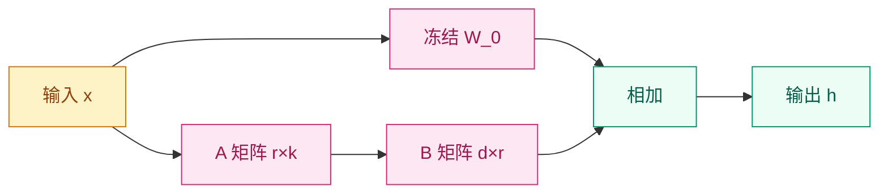

# 为什么全量微调不够用了？—— 参数高效微调（PEFT）

[English](README_EN.md) | [中文](README.md)

## 这个问题从哪来

> 2021年，GPT-3 和后续的大模型将参数规模推到了百亿甚至千亿级别。全量微调一个 175B 模型需要 TB 级显存，绝大多数研究者和企业无法承受。PEFT 技术的出现证明：只需训练不到 1% 的参数，就能达到接近全量微调的效果。

## 学习目标

完成后你应能回答：
1. 为什么 LoRA 用低秩矩阵就能有效适配大模型？
2. QLoRA 如何在消费级 GPU 上微调 70B 模型？
3. 实际应用 LoRA 时，秩 r、目标模块、学习率应如何选择？

## 1. 直觉

想象一栋摩天大楼。全量微调就像对整个大楼进行结构改造——需要动用大量工程队、材料和审批。而 PEFT 则像是在大楼的每个房间里加装一个即插即用的小插座面板：不改变承重墙和主体结构，只增加少量可替换的接口，就能让大楼支持新的电器标准。

LoRA 是其中最高效的方案。它的核心假设是：大模型的预训练权重已经学到了丰富的通用特征，而下游任务所需的调整，往往只需要在一个**低维子空间**里进行。与其更新整个巨大的权重矩阵，不如只学习一个微小的低秩增量。

> 你要记住：PEFT 的本质不是"偷懒"，而是利用预训练权重中已编码的丰富结构，在最小扰动下实现任务适配。

## 2. 机制

### 2.1 LoRA：低秩增量分解

对于预训练权重矩阵 $W_0 \in \mathbb{R}^{d \times k}$，LoRA 将更新约束为两个低秩矩阵的乘积：

```
W = W_0 + ΔW = W_0 + BA

其中:
- W_0: 冻结的预训练权重 (d × k)
- B ∈ ℝ^(d × r), A ∈ ℝ^(r × k): 可训练低秩矩阵
- r: 低秩维度 (r ≪ min(d, k))
```

前向传播变为：
```
h = W_0·x + ΔW·x = W_0·x + B·A·x
```

**参数节省**：当 d=k=4096, r=16 时，全量微调需要 16.8M 参数，而 LoRA 仅需 131K，节省了 **99.2%**。



### 2.2 QLoRA：4-bit 量化 + LoRA

QLoRA 通过三重技术将 65B 模型塞入 48GB GPU：
1. **4-bit NormalFloat (NF4)** 量化基础模型权重
2. **双重量化**：对量化常数本身再次量化，进一步节省显存
3. **分页优化器**：在显存不足时将优化器状态分页到 CPU

| Model Size | Full FT | LoRA | QLoRA |
|------------|---------|------|-------|
| 7B | 28GB | 14GB | 8GB |
| 13B | 52GB | 26GB | 14GB |
| 70B | 280GB | 140GB | 48GB |

### 2.3 其他 PEFT 方法速览

**Adapter**：在 Transformer 层中插入小型瓶颈模块（down-projection → activation → up-projection），通过残差连接融合。

**Prompt Tuning**：不修改模型权重，而是学习一组连续的可训练 soft prompt tokens，拼接在输入嵌入前。

**P-tuning v2**：将可训练提示词扩展到每一层 Transformer，而不仅仅是输入层。

| Method | Trainable Params | Memory | Speed | Performance |
|--------|-----------------|--------|-------|-------------|
| **Full FT** | 100% | 100% | 1x | 100% |
| **LoRA** | 0.5-2% | 30-40% | 4x | 98% |
| **QLoRA** | 0.5-2% | 20-25% | 3x | 97% |
| **Adapter** | 1-3% | 35-45% | 3x | 96% |
| **Prompt Tuning** | <0.1% | 15-20% | 5x | 90% |
| **P-tuning v2** | 0.2-0.5% | 20-25% | 4x | 94% |

> 你要记住：LoRA 是 PEFT 中性能与易用性的最佳平衡点；QLoRA 则是个人开发者触达百亿参数模型的最低门槛路径。

## 3. 渐进式实现

### Step 1 LoRA 低秩层（核心逻辑）

```python
import torch
import torch.nn as nn
import math

# 实现低秩增量 ΔW = B @ A
# A 用 kaiming 初始化，B 用零初始化
# 确保训练开始时 ΔW = 0，模型行为与预训练一致
def lora_forward(x, lora_A, lora_B, scaling):
    return (x @ lora_A @ lora_B) * scaling


class LoRALayer(nn.Module):
    def __init__(self, in_features, out_features, rank=16, lora_alpha=32):
        super().__init__()
        self.rank = rank
        self.lora_alpha = lora_alpha
        self.scaling = lora_alpha / rank

        self.lora_A = nn.Parameter(torch.zeros(in_features, rank))
        self.lora_B = nn.Parameter(torch.zeros(rank, out_features))

        nn.init.kaiming_uniform_(self.lora_A, a=math.sqrt(5))
        nn.init.zeros_(self.lora_B)

    def forward(self, x, base_output):
        lora_output = (x @ self.lora_A @ self.lora_B) * self.scaling
        return base_output + lora_output
```

### Step 2 完整的 LoRA 线性层（边界处理）

```python
# 包装现有线性层，冻结基础权重并注入 LoRA 路径
# 支持 dropout 正则化
# 训练时仅 LoRA 参数可更新
class LoRALinear(nn.Module):
    def __init__(self, base_layer, rank=16, lora_alpha=32, dropout=0.0):
        super().__init__()
        self.base_layer = base_layer
        for param in self.base_layer.parameters():
            param.requires_grad = False

        in_features = base_layer.in_features
        out_features = base_layer.out_features

        self.lora = LoRALayer(in_features, out_features, rank, lora_alpha)
        self.dropout = nn.Dropout(dropout) if dropout > 0 else nn.Identity()

    def forward(self, x):
        base_output = self.base_layer(x)
        x_dropped = self.dropout(x)
        return self.lora(x_dropped, base_output)
```

### Step 3 QLoRA 量化配置（工程实现）

```python
from transformers import AutoModelForCausalLM, BitsAndBytesConfig
from peft import prepare_model_for_kbit_training, LoraConfig, get_peft_model

# 加载 4-bit NF4 量化模型
# 双重量化减少显存，BF16 作为计算精度
# 为后续 k-bit 训练做准备
bnb_config = BitsAndBytesConfig(
    load_in_4bit=True,
    bnb_4bit_use_double_quant=True,
    bnb_4bit_quant_type="nf4",
    bnb_4bit_compute_dtype=torch.bfloat16
)

model = AutoModelForCausalLM.from_pretrained(
    "meta-llama/Llama-2-7b-hf",
    quantization_config=bnb_config,
    device_map="auto",
    trust_remote_code=True
)

model = prepare_model_for_kbit_training(model)

lora_config = LoraConfig(
    r=16,
    lora_alpha=32,
    target_modules=["q_proj", "v_proj", "k_proj", "o_proj"],
    lora_dropout=0.05,
    bias="none",
    task_type="CAUSAL_LM"
)

model = get_peft_model(model, lora_config)
```

### Step 4 训练、合并与部署（生产级）

```python
from trl import SFTTrainer
from transformers import TrainingArguments

# 配置 LoRA/QLoRA 训练参数
# 学习率比全量微调高 10-100 倍，使用 cosine warmup
# paged_adamw_8bit 用于 QLoRA 场景进一步节省显存
training_args = TrainingArguments(
    output_dir="./lora_model",
    num_train_epochs=3,
    per_device_train_batch_size=4,
    gradient_accumulation_steps=4,
    learning_rate=2e-4,
    warmup_ratio=0.03,
    lr_scheduler_type="cosine",
    logging_steps=10,
    save_strategy="epoch",
    fp16=True,
    optim="paged_adamw_8bit",
    group_by_length=True,
)

trainer = SFTTrainer(
    model=model,
    train_dataset=train_dataset,
    args=training_args,
    dataset_text_field="text",
    max_seq_length=2048,
)

trainer.train()
```

推理时可以选择合并权重或保持适配器分离：

```python
from peft import PeftModel

# 加载基础模型与 LoRA 权重
# 选项 1: merge_and_unload() 消除 PEFT 依赖、推理更快
# 选项 2: 保持分离，便于多适配器热切换
base_model = AutoModelForCausalLM.from_pretrained("meta-llama/Llama-2-7b-hf")
model = PeftModel.from_pretrained(base_model, "./lora_weights")

# 合并权重
model = model.merge_and_unload()
model.save_pretrained("./merged_model")
```

## 4. 工程陷阱

| 陷阱 | 原因 | 现象 | 对策 |
|------|------|------|------|
| **秩太低** | 低秩子空间不足以表达任务差异 | 验证集性能始终差于全量微调 5-10% | 将 r 提高到 16 或以上 |
| **目标模块选错** | 只在不重要的层加了 LoRA | 训练 loss 下降但下游指标无改善 | 至少包含 q_proj 和 v_proj |
| **学习率过低** | 用全量微调的学习率训练 LoRA | 收敛极慢，需要数十倍 epoch | LoRA 学习率应为全量微调的 10-100 倍 |
| **过拟合** | 可训练参数虽少，但 rank 过大或数据太少 | 训练 loss 低，验证 loss 高 | 增加 lora_dropout，减少 epochs，降低 r |
| **QLoRA 数值不稳定** | 4-bit 量化 + FP16 梯度溢出 | 训练中出现 NaN 或 loss 尖峰 | 改用 BF16 计算，降低学习率，增加 warmup |

### 目标模块选择指南

```python
# 最小配置（最快实验）
target_modules = ["q_proj", "v_proj"]

# 推荐配置（最佳性价比）
target_modules = ["q_proj", "k_proj", "v_proj", "o_proj"]

# 全面配置（追求极致质量）
target_modules = [
    "q_proj", "k_proj", "v_proj", "o_proj",
    "gate_proj", "up_proj", "down_proj"
]
```

### 学习率参考

| Model Size | LoRA LR | Full FT LR |
|------------|---------|------------|
| < 1B | 1e-3 | 5e-5 |
| 7B | 1e-4 | 2e-5 |
| 13B | 1e-4 | 1e-5 |
| 70B+ | 5e-5 | 5e-6 |

> 你要记住：LoRA 不是万能的——如果任务需要模型改变底层的知识结构（如学习全新语言或领域），全量微调仍是更优选择。

## 5. 演进笔记

> 这一技术的遗产：PEFT 尤其是 LoRA/QLoRA，让大模型从"实验室专属"变成了"个人可触达"，催生了开源微调生态的爆发；但它也带来了适配器管理、多任务组合、以及微调后模型安全边界漂移的新挑战。
→ 详见 [对齐](../alignment/README.md)

---

**上一章**: [预训练](../../scale-multimodal/scale/pre-training/README.md) | **下一章**: [对齐](../alignment/README.md)
