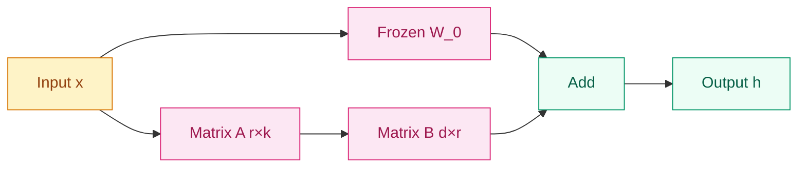

# Why Full Fine-Tuning Stopped Being Enough? — Parameter-Efficient Fine-Tuning (PEFT)

[English](README_EN.md) | [中文](README.md)

## Where does this problem come from?

> In 2021, GPT-3 and subsequent large models pushed parameter scales to tens or even hundreds of billions. Full fine-tuning a 175B model requires terabytes of GPU memory—unaffordable for most researchers and organizations. The emergence of PEFT proved that training less than 1% of parameters can achieve results close to full fine-tuning.

## Learning Objectives

After completing this module, you should be able to answer:
1. Why can low-rank matrices effectively adapt large models in LoRA?
2. How does QLoRA enable fine-tuning 70B models on consumer GPUs?
3. How should rank r, target modules, and learning rate be chosen in practice?

## 1. Intuition

Imagine a skyscraper. Full fine-tuning is like renovating the entire building's structure—you need a huge construction crew, massive materials, and extensive permits. PEFT, by contrast, is like adding small plug-and-play outlet panels in each room: without changing load-bearing walls or the main structure, you add a few replaceable interfaces that let the building support new electrical standards.

LoRA is the most efficient approach among these. Its core assumption is that large pre-trained weights already capture rich general features, while downstream adjustments often live in a **low-dimensional subspace**. Instead of updating the entire enormous weight matrix, LoRA learns only a tiny low-rank increment.

> Remember this: the essence of PEFT is not "cutting corners"—it leverages the rich structure already encoded in pre-trained weights to adapt to tasks with minimal perturbation.

## 2. Mechanism

### 2.1 LoRA: Low-Rank Incremental Decomposition

For a pre-trained weight matrix $W_0 \in \mathbb{R}^{d \times k}$, LoRA constrains the update to the product of two low-rank matrices:

```
W = W_0 + ΔW = W_0 + BA

Where:
- W_0: frozen pre-trained weights (d × k)
- B ∈ ℝ^(d × r), A ∈ ℝ^(r × k): trainable low-rank matrices
- r: low-rank dimension (r ≪ min(d, k))
```

The forward pass becomes:
```
h = W_0·x + ΔW·x = W_0·x + B·A·x
```

**Parameter savings**: when d=k=4096 and r=16, full fine-tuning needs 16.8M parameters, while LoRA needs only 131K—a **99.2%** reduction.



### 2.2 QLoRA: 4-bit Quantization + LoRA

QLoRA fits a 65B model into a 48GB GPU through three techniques:
1. **4-bit NormalFloat (NF4)** quantization of base model weights
2. **Double quantization**: quantizing the quantization constants themselves to save more memory
3. **Paged optimizer**: paging optimizer states to CPU when GPU memory runs low

| Model Size | Full FT | LoRA | QLoRA |
|------------|---------|------|-------|
| 7B | 28GB | 14GB | 8GB |
| 13B | 52GB | 26GB | 14GB |
| 70B | 280GB | 140GB | 48GB |

### 2.3 Other PEFT Methods at a Glance

**Adapter**: inserts small bottleneck modules into Transformer layers (down-projection → activation → up-projection), fused via residual connection.

**Prompt Tuning**: does not modify model weights; instead, it learns a set of continuous trainable soft prompt tokens prepended to input embeddings.

**P-tuning v2**: extends trainable prompts to every Transformer layer, not just the input layer.

| Method | Trainable Params | Memory | Speed | Performance |
|--------|-----------------|--------|-------|-------------|
| **Full FT** | 100% | 100% | 1x | 100% |
| **LoRA** | 0.5-2% | 30-40% | 4x | 98% |
| **QLoRA** | 0.5-2% | 20-25% | 3x | 97% |
| **Adapter** | 1-3% | 35-45% | 3x | 96% |
| **Prompt Tuning** | <0.1% | 15-20% | 5x | 90% |
| **P-tuning v2** | 0.2-0.5% | 20-25% | 4x | 94% |

> Remember this: LoRA is the best balance of performance and usability among PEFT methods; QLoRA is the lowest-barrier path for individual developers to reach hundred-billion-parameter models.

## 3. Progressive Implementation

### Step 1 LoRA Low-Rank Layer (Core Logic)

```python
import torch
import torch.nn as nn
import math

# Implement low-rank increment ΔW = B @ A
# Initialize A with kaiming and B with zeros
# Ensures ΔW = 0 at start so behavior matches pre-training
def lora_forward(x, lora_A, lora_B, scaling):
    return (x @ lora_A @ lora_B) * scaling


class LoRALayer(nn.Module):
    def __init__(self, in_features, out_features, rank=16, lora_alpha=32):
        super().__init__()
        self.rank = rank
        self.lora_alpha = lora_alpha
        self.scaling = lora_alpha / rank

        self.lora_A = nn.Parameter(torch.zeros(in_features, rank))
        self.lora_B = nn.Parameter(torch.zeros(rank, out_features))

        nn.init.kaiming_uniform_(self.lora_A, a=math.sqrt(5))
        nn.init.zeros_(self.lora_B)

    def forward(self, x, base_output):
        lora_output = (x @ self.lora_A @ self.lora_B) * self.scaling
        return base_output + lora_output
```

### Step 2 Complete LoRA Linear Layer (Boundary Handling)

```python
# Wrap an existing linear layer, freeze base weights, and inject LoRA path
# Supports dropout regularization
# Only LoRA parameters are updated during training
class LoRALinear(nn.Module):
    def __init__(self, base_layer, rank=16, lora_alpha=32, dropout=0.0):
        super().__init__()
        self.base_layer = base_layer
        for param in self.base_layer.parameters():
            param.requires_grad = False

        in_features = base_layer.in_features
        out_features = base_layer.out_features

        self.lora = LoRALayer(in_features, out_features, rank, lora_alpha)
        self.dropout = nn.Dropout(dropout) if dropout > 0 else nn.Identity()

    def forward(self, x):
        base_output = self.base_layer(x)
        x_dropped = self.dropout(x)
        return self.lora(x_dropped, base_output)
```

### Step 3 QLoRA Quantization Configuration (Engineering)

```python
from transformers import AutoModelForCausalLM, BitsAndBytesConfig
from peft import prepare_model_for_kbit_training, LoraConfig, get_peft_model

# Load a 4-bit NF4 quantized model
# Double quantization saves memory, BF16 as compute dtype
# Prepare for subsequent k-bit training
bnb_config = BitsAndBytesConfig(
    load_in_4bit=True,
    bnb_4bit_use_double_quant=True,
    bnb_4bit_quant_type="nf4",
    bnb_4bit_compute_dtype=torch.bfloat16
)

model = AutoModelForCausalLM.from_pretrained(
    "meta-llama/Llama-2-7b-hf",
    quantization_config=bnb_config,
    device_map="auto",
    trust_remote_code=True
)

model = prepare_model_for_kbit_training(model)

lora_config = LoraConfig(
    r=16,
    lora_alpha=32,
    target_modules=["q_proj", "v_proj", "k_proj", "o_proj"],
    lora_dropout=0.05,
    bias="none",
    task_type="CAUSAL_LM"
)

model = get_peft_model(model, lora_config)
```

### Step 4 Training, Merging, and Deployment (Production-Grade)

```python
from trl import SFTTrainer
from transformers import TrainingArguments

# Configure LoRA/QLoRA training hyperparameters
# Learning rate is 10-100x higher than full fine-tuning, with cosine warmup
# paged_adamw_8bit further saves memory for QLoRA scenarios
training_args = TrainingArguments(
    output_dir="./lora_model",
    num_train_epochs=3,
    per_device_train_batch_size=4,
    gradient_accumulation_steps=4,
    learning_rate=2e-4,
    warmup_ratio=0.03,
    lr_scheduler_type="cosine",
    logging_steps=10,
    save_strategy="epoch",
    fp16=True,
    optim="paged_adamw_8bit",
    group_by_length=True,
)

trainer = SFTTrainer(
    model=model,
    train_dataset=train_dataset,
    args=training_args,
    dataset_text_field="text",
    max_seq_length=2048,
)

trainer.train()
```

At inference time, you can either merge weights or keep adapters separate:

```python
from peft import PeftModel

# Load base model and LoRA weights
# Option 1: merge_and_unload() removes PEFT dependency and speeds up inference
# Option 2: keep separate for easy multi-adapter hot-swapping
base_model = AutoModelForCausalLM.from_pretrained("meta-llama/Llama-2-7b-hf")
model = PeftModel.from_pretrained(base_model, "./lora_weights")

# Merge weights
model = model.merge_and_unload()
model.save_pretrained("./merged_model")
```

## 4. Engineering Pitfalls

| Pitfall | Cause | Symptom | Fix |
|---------|-------|---------|-----|
| **Rank too low** | Low-rank subspace insufficient to capture task differences | Validation performance consistently 5-10% below full FT | Increase r to 16 or higher |
| **Wrong target modules** | LoRA applied to unimportant layers only | Training loss drops but downstream metrics don't improve | Include at least q_proj and v_proj |
| **Learning rate too low** | Using full-FT learning rate for LoRA | Extremely slow convergence, needs many more epochs | LoRA LR should be 10-100x full-FT LR |
| **Overfitting** | Few trainable params but rank too large or data too small | Low training loss, high validation loss | Increase lora_dropout, reduce epochs, lower r |
| **QLoRA numerical instability** | 4-bit quantization + FP16 gradient overflow | NaNs or loss spikes during training | Switch to BF16 compute, lower LR, increase warmup |

### Target Module Selection Guide

```python
# Minimal configuration (fastest experimentation)
target_modules = ["q_proj", "v_proj"]

# Recommended configuration (best cost-performance)
target_modules = ["q_proj", "k_proj", "v_proj", "o_proj"]

# Comprehensive configuration (maximum quality)
target_modules = [
    "q_proj", "k_proj", "v_proj", "o_proj",
    "gate_proj", "up_proj", "down_proj"
]
```

### Learning Rate Reference

| Model Size | LoRA LR | Full FT LR |
|------------|---------|------------|
| < 1B | 1e-3 | 5e-5 |
| 7B | 1e-4 | 2e-5 |
| 13B | 1e-4 | 1e-5 |
| 70B+ | 5e-5 | 5e-6 |

> Remember this: LoRA is not a panacea—if the task requires changing the model's underlying knowledge structure (e.g., learning an entirely new language or domain), full fine-tuning remains the better choice.

## 5. Evolution Notes

> The legacy of this technology: PEFT, especially LoRA/QLoRA, transformed large models from "lab-only" to "personally accessible," sparking an explosion in the open-source fine-tuning ecosystem. But it also brings new challenges in adapter management, multi-task composition, and safety boundary drift after fine-tuning.
→ See [Alignment](../alignment/README.md)

---

**Previous**: [Pre-training](../../scale-multimodal/scale/pre-training/README.md) | **Next**: [Alignment](../alignment/README.md)
