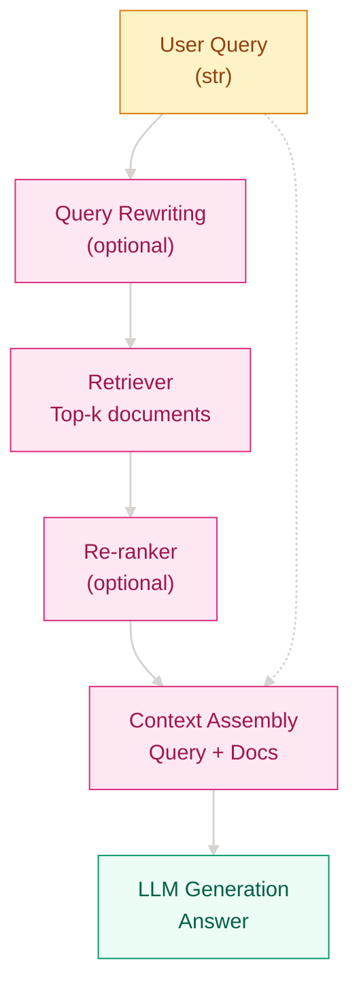

# Why Do LLMs Keep Getting Facts Wrong? — RAG and Retrieval-Augmented Generation

## Where Does This Problem Come From

> In 2020, Lewis et al. at Facebook AI proposed RAG (Retrieval-Augmented Generation). At the time, GPT-3 could generate fluent text, but when faced with questions requiring precise facts it often "confidently hallucinated" — the model had no external knowledge base, relied entirely on parametric memory, its training data had a cutoff date, and professional domain knowledge was even scarcer.
>
> The core idea of RAG is: before generating an answer, let the model retrieve relevant documents from an external knowledge base, feed the retrieval results as context to the generation model, and thus transform "pure memorization" into "look it up first, then answer."

## Learning Objectives

After completing this chapter, you should be able to answer:

1. How to choose between RAG and Fine-tuning for different scenarios?
2. What is the evolution logic from Naive RAG to Advanced RAG to Modular RAG?
3. How to evaluate and optimize the retrieval quality of a RAG system?

---

## 1. Intuition

Imagine a student taking a closed-book exam versus one taking an open-book exam. A pure LLM generation is like a closed-book exam — you can only answer with what you remember, and if you misremember, you get it wrong. RAG is like an open-book exam where you are allowed to bring reference materials: first flip through the book to find relevant chapters, then organize your answer based on what you found. The act of flipping through the book (retrieval) doesn't do the thinking for you, but it greatly reduces the chance of "misremembering" and "not knowing at all."

The key difference goes further. A closed-book student can be wrong with full confidence; an open-book student can at least point to the material and say "according to page X," making the answer verifiable even when wrong.

> Remember: RAG is not about feeding new knowledge into an LLM, but about giving the LLM a pair of "glasses" — letting it see relevant facts before answering.

---

## 2. Mechanism

### 2.1 Core Architecture

A RAG system consists of two core components: a **Retriever** responsible for finding relevant documents from a knowledge base, and a **Generator** responsible for producing the final answer based on the retrieved documents.

```
Traditional LLM:  Query → LLM → Answer
RAG:              Query → Retriever → [Docs] → LLM → Answer
                        ↑_________________________↓
                              (enhanced context)
```

### 2.2 Two Retrieval Scoring Paradigms

**Bi-Encoder**: query and document are encoded independently into vectors, scored by cosine similarity.

$$
\mathbf{e}_q = f_\theta(q), \quad \mathbf{e}_d = f_\theta(d), \quad s(q, d) = \frac{\mathbf{e}_q \cdot \mathbf{e}_d}{\|\mathbf{e}_q\| \|\mathbf{e}_d\|}
$$

Advantages: document vectors can be pre-computed, retrieval is extremely fast. Disadvantages: no fine-grained interaction between query and document.

**Cross-Encoder**: concatenate query and document as input to the model, output relevance score.

$$
s(q, d) = f_\theta([q; d])
$$

Advantages: captures fine-grained semantic interactions, high accuracy. Disadvantages: cannot pre-compute, must run the model every time, slower.

### 2.3 Computation Flow



### 2.4 Progressive Implementation

**Step 1 · Minimal RAG (understand retrieve-then-generate flow)**

```python
# What problem does this solve: establish the smallest closed loop of "retrieve first, then generate"
# Verify whether vector similarity can rank relevant documents first
# Dependencies: numpy, sentence-transformers (or mock)
import numpy as np


def cosine_similarity(a, b):
    return np.dot(a, b) / (np.linalg.norm(a) * np.linalg.norm(b) + 1e-9)


class NaiveRAG:
    def __init__(self, documents, embed_fn):
        self.docs = documents
        self.embed_fn = embed_fn
        # Pre-compute all document vectors
        self.doc_vectors = [self.embed_fn(d) for d in documents]

    def retrieve(self, query, k=3):
        q_vec = self.embed_fn(query)
        scores = [cosine_similarity(q_vec, d_vec) for d_vec in self.doc_vectors]
        top_k = np.argsort(scores)[::-1][:k]
        return [(i, scores[i]) for i in top_k]

    def answer(self, query, k=3):
        retrieved = self.retrieve(query, k)
        context = "\n".join([self.docs[i] for i, _ in retrieved])
        # In a real system this calls an LLM; minimal implementation only returns context
        return {"query": query, "context": context, "sources": retrieved}
```

**Step 2 · Hybrid Retrieval (keywords + semantics complement each other)**

```python
# What problem does this solve: pure vector retrieval is weak on exact term matching,
# pure keyword retrieval is weak on semantic synonyms; weighted fusion makes them complementary
# Dependencies: numpy, rank_bm25 (or simplified implementation)
import numpy as np


class HybridRetriever:
    def __init__(self, documents, embed_fn, alpha=0.5):
        self.docs = documents
        self.embed_fn = embed_fn
        self.alpha = alpha
        self.doc_vectors = [self.embed_fn(d) for d in documents]
        # Simplified BM25: use term frequency as proxy
        self.term_freq = [set(d.lower().split()) for d in documents]

    def bm25_score(self, query, idx):
        terms = set(query.lower().split())
        return len(terms & self.term_freq[idx]) / max(len(terms), 1)

    def dense_score(self, query, idx):
        q_vec = self.embed_fn(query)
        return cosine_similarity(q_vec, self.doc_vectors[idx])

    def retrieve(self, query, k=3):
        scores = []
        for i in range(len(self.docs)):
            s = self.alpha * self.bm25_score(query, i) + (1 - self.alpha) * self.dense_score(query, i)
            scores.append((i, s))
        scores.sort(key=lambda x: x[1], reverse=True)
        return scores[:k]
```

**Step 3 · Re-ranking and Context Compression (precision first)**

```python
# What problem does this solve: Top-k from recall isn't necessarily sorted by true relevance;
# long context eats up the generation budget
# Use cross-encoder re-ranking + relevance-based truncation
class RerankRAG:
    def __init__(self, retriever, cross_encoder, max_ctx_tokens=2000):
        self.retriever = retriever
        self.cross_encoder = cross_encoder  # input (query, doc) → score
        self.max_ctx = max_ctx_tokens

    def retrieve(self, query, k=10, rerank_top=3):
        # Stage 1: recall more candidates
        candidates = self.retriever.retrieve(query, k=k)
        # Stage 2: cross-encoder re-ranking
        scored = [(i, self.cross_encoder(query, self.retriever.docs[i])) for i, _ in candidates]
        scored.sort(key=lambda x: x[1], reverse=True)
        return scored[:rerank_top]

    def build_context(self, query, retrieved):
        # Accumulate documents by relevance until near the window limit
        context = []
        tokens = 0
        for i, _ in retrieved:
            doc = self.retriever.docs[i]
            # Simplified: use character count as proxy for token count
            if tokens + len(doc) > self.max_ctx:
                break
            context.append(doc)
            tokens += len(doc)
        return "\n".join(context)
```

**Step 4 · Production-grade Evaluation and Multi-hop Retrieval**

```python
# What problem does this solve: without evaluation you don't know what to optimize;
# complex questions need multiple retrievals to gather evidence
# Production-grade: Recall/Precision/NDCG + multi-hop retrieval pipeline
class MultiHopRAG:
    def __init__(self, retriever, max_hops=2):
        self.retriever = retriever
        self.max_hops = max_hops

    def rewrite_query(self, original, context_docs):
        # Simplified: in practice use an LLM to rewrite the query
        return original + " " + " ".join(context_docs[:1])

    def retrieve_multi_hop(self, query, k=3):
        all_docs = set()
        current_query = query
        for _ in range(self.max_hops):
            results = self.retriever.retrieve(current_query, k)
            doc_ids = [i for i, _ in results]
            all_docs.update(doc_ids)
            # Rewrite query based on retrieved content for the next round
            contents = [self.retriever.docs[i] for i in doc_ids]
            current_query = self.rewrite_query(query, contents)
        return list(all_docs)


class RAGEvaluator:
    def evaluate_retrieval(self, queries, ground_truth, retriever, k=5):
        recalls, precisions = [], []
        for query, truth in zip(queries, ground_truth):
            results = retriever.retrieve(query, k)
            retrieved = set([i for i, _ in results])
            truth_set = set(truth)
            recall = len(retrieved & truth_set) / len(truth_set) if truth_set else 0
            precision = len(retrieved & truth_set) / len(retrieved) if retrieved else 0
            recalls.append(recall)
            precisions.append(precision)
        return {
            f"recall@{k}": sum(recalls) / len(recalls),
            f"precision@{k}": sum(precisions) / len(precisions),
        }
```

---

## 3. Engineering Pitfalls (sorted by severity)

1. **Poor retrieval quality → generation is led astray by irrelevant documents**
   Symptom: The LLM produces wrong answers based on incorrect context, and because the documents "look relevant," the error is even harder to spot.
   Fix: Introduce hybrid retrieval (BM25 + Dense) + cross-encoder re-ranking; establish human-labeled evaluation sets to continuously monitor recall.

2. **Overly long context → exceeds window limit, important information truncated**
   Symptom: Retrieved 10 documents, concatenation exceeds the LLM context window, and key evidence at the end is cut off.
   Fix: Context compression (keep only the most relevant paragraphs), dynamically adjust Top-k, use models with longer context windows.

3. **Semantic gap between query and documents → can't retrieve relevant content**
   Symptom: User asks "how to fix a printer," but the document says "printer troubleshooting guide," vector similarity is very low.
   Fix: Query rewriting, HyDE (generate hypothetical documents with an LLM first, then retrieve), synonym expansion.

4. **Static knowledge base → information becomes outdated**
   Symptom: Product has been updated, but the knowledge base still contains old documents, and the model answers based on obsolete information.
   Fix: Establish a knowledge base update pipeline with periodic re-indexing; for time-sensitive questions add a "knowledge cutoff date" hint.

5. **Missing re-ranking → many recalled but low precision**
   Symptom: Bi-encoder recalls 50 documents, but only 1 of the top 5 is truly relevant.
   Fix: Two-stage retrieval (recall → re-rank), use cross-encoder to re-rank top-50 and take top-5.

> Remember: The quality ceiling of RAG is first determined by **retrieval quality**, then by **generation quality**. If retrieval is wrong, even the strongest model can't save it.

---

## Evolution Notes

> **Legacy of this technology**: RAG dramatically expanded the knowledge boundary of large models at low cost and with high interpretability. It decoupled "what the model knows" from "what the model can look up," making knowledge updates possible without retraining. The citation sources provided by retrieval results also make generated content verifiable.
>
> **New problems left behind**: Unstable retrieval quality, context window bottlenecks, and limitations of complex multi-hop queries continue to drive the evolution toward Agentic RAG (letting the model autonomously decide when and what to retrieve) and deeper retrieval-generation integration.

→ Next: [Vector Databases](../vector-databases/README_EN.md) — understand how to choose and optimize semantic search storage engines.

---

**Previous**: [Multimodal](../../scale-multimodal/multimodal/README_EN.md) | **Next**: [Vector Databases](../vector-databases/README_EN.md)
