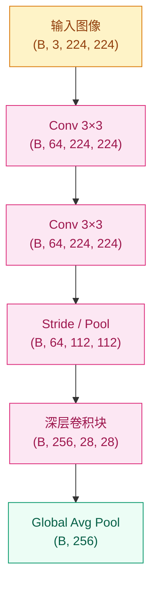
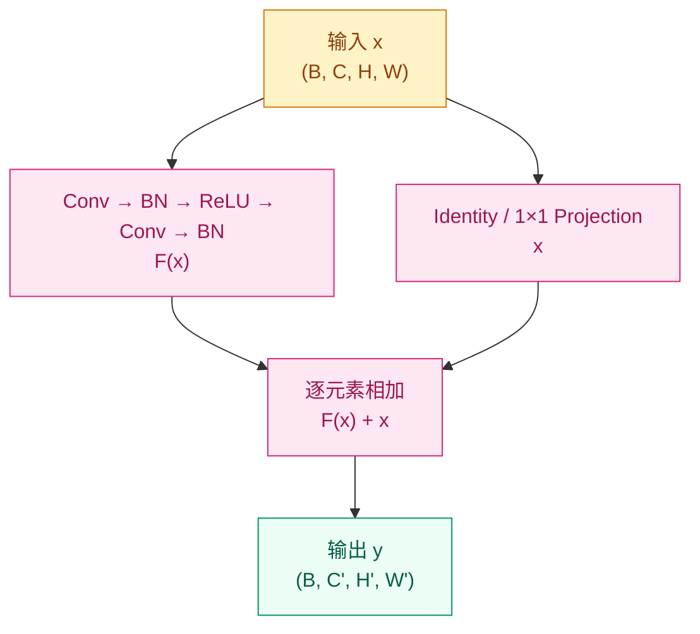

# 为什么图像不能直接交给全连接网络？—— CNN 架构演进（2012–2022）

## 这个问题从哪来

> 2012 年之前，视觉识别系统大量依赖 SIFT、HOG 等手工特征，图像先被设计成特征，再交给分类器。即便使用多层感知机，把图像直接压平成向量也会带来参数爆炸，并破坏像素的空间邻域关系。AlexNet 的突破不只是"更深"，而是第一次大规模证明：把局部性和参数共享写进网络结构，才能让模型真正利用图像这种数据的形状。

## 前置基础与时间线锚点

读这一章之前最好先过这几块基础（Layer 0 工具箱）：

- [反向传播](../../../foundations/deep-learning/backpropagation/) — 卷积层的梯度也走链式法则
- [激活函数](../../../foundations/deep-learning/activation-functions/) — 为什么 ReLU 成了 CNN 标配
- [归一化](../../../foundations/deep-learning/normalization/) — BN/LN/GN 的统一视角
- [残差连接](../../../foundations/structures/residual-connections/) — ResNet 之后所有视觉模型的底座

这条 track 在主时间线上的锚点（Layer 1 编年史）：

- [2012 AlexNet](../../../timeline/2012/) — CNN 大规模工业化起点
- [2015 ResNet](../../../timeline/2015/) — 残差让网络深度变得可扩展
- [2014 GAN](../../../timeline/2014/) — 转置卷积在生成模型上的早期使用
- [2017 Transformer](../../../timeline/2017/) — CNN 与 Attention 开始汇流的转折

## 学习目标

完成本章后，你应能回答：

1. 卷积的局部连接、参数共享、层级特征分别解决了什么问题？
2. Pooling / 1×1 卷积 / BN / depthwise separable conv / dilated conv / transposed conv 各自的几何含义是什么，为什么必须出现？
3. 给定 (kernel, stride, padding, dilation)，能不能手算出输出 shape 和感受野？
4. 为什么 VGG、GoogLeNet、ResNet、DenseNet、SE-Net、ResNeXt、MobileNet、EfficientNet、ConvNeXt 会按这样的顺序出现？
5. CNN 为什么在视觉任务中强大，又为什么最终要与注意力机制汇流？

---

## 1. 直觉

图像不是"很多数字的集合"，而是带有二维邻域关系的信号：相邻像素通常共同构成边缘、纹理和局部形状，远处像素的关联则往往要到更高层语义才会建立。

如果把一张图像直接压平成向量，全连接层会同时犯两个错误：一是参数量随输入尺寸急剧膨胀；二是模型看不见"谁和谁本来是邻居"。对模型而言，左上角的像素和右下角的像素只是两个普通维度，没有结构差别。

卷积层的做法正好相反：先承认图像的局部性，只让一个小卷积核看局部窗口，再把同一组参数复用到整张图上。这样模型学到的就不是"某个固定坐标上的模式"，而是"无论出现在何处都成立的局部模式"。

把卷积核想成一组可复用的小探测器会更直观：第一层看边缘，第二层看纹理与轮廓，后面逐层组合成部件和物体。CNN 的力量不只是"层更多"，而是它从一开始就假设图像有空间结构。

> 你要记住：CNN 的本质不是"层更多"，而是"把空间结构写进模型假设里"。

---

## 2. 机制

### 2.1 卷积与特征图

二维卷积可以写成：

$$
Y(i,j) = \sum_m \sum_n X(i+m,\, j+n) \cdot K(m,n)
$$

真正重要的不是公式本身，而是它隐含的结构假设：

- `kernel size` 决定每次只观察多大的局部窗口
- `stride` 决定特征图按多粗的步幅向前推进
- `padding` 决定边界信息是否被保留
- `channels` 决定同一位置上并行提取多少种模式

特征图不是"压缩后的图像"，而是"某类模式在各个位置上的响应图"。一个卷积核像一个模板，激活越高，表示当前位置越像它要找的模式。

### 2.2 输出尺寸公式与 padding 模式

给定输入 H、kernel k、stride s、padding p、dilation d，卷积输出 H' 的递推为：

$$
H' = \left\lfloor \frac{H + 2p - d(k-1) - 1}{s} \right\rfloor + 1
$$

不带 dilation 时退化成大家熟悉的 `(H + 2p − k) / s + 1`。

PyTorch 里 `padding` 既可以是整数也可以是字符串：

| 模式 | 直觉 | 输出尺寸 |
|---|---|---|
| `valid` (p=0) | "只在合法位置算卷积，边缘像素卷积不到就不算" | 比输入小 (`k−1`) |
| `same` | "无论 k 是几，都补成与输入同 H/W" | 与输入相同（仅 s=1 时严格） |
| `full` | "卷到一边只搭一格也算"（少用） | 比输入大 (`k−1`) |

实操中 99% 的现代 CNN 都用 `same` + 后续用 stride=2 或 pool 显式下采样，把"特征提取"和"空间尺寸变化"两个动作解耦。

### 2.3 感受野与有效感受野

**理论感受野（Receptive Field）** 指特征图上一个点能"看到"原始输入的多大区域。逐层递推公式：

$$
\mathrm{RF}_{\ell} = \mathrm{RF}_{\ell-1} + (k_\ell - 1) \cdot j_{\ell-1}, \qquad
j_\ell = j_{\ell-1} \cdot s_\ell
$$

其中 `jₗ` 是当前层相对原图的"跳步"。直观看：每多一层 3×3 卷积，RF 扩 2 个 jump；遇到 stride=2 的层，后续每多一层 jump 翻倍。

这就解释了为什么现代 CNN 偏好"连续两个 3×3" 而不是"一个 5×5"：

- 5×5 感受野相同（连续两个 3×3 累积 RF=5），参数 25C² → 18C²，省 ~28%
- 中间多一次非线性，表达力更强
- 结构更规整，便于堆深

**有效感受野（Effective Receptive Field）** 是 2017 年 Luo 等人发现的反直觉结论：尽管理论 RF 可能覆盖整张图，但实际起作用的部分是一个**近似高斯分布**，集中在中心，远端权重指数衰减。两个推论：

- "深 = 看得远"是真的，但增益是次线性的
- 在分割、检测这类需要全局上下文的任务里，光靠堆深还不够 —— 这就是 dilated conv、全局池化、attention 后来进场的动力

下采样则是另一个核心决定。无论是 pooling 还是 stride=2 卷积，本质都是在用分辨率换计算预算和更大的上下文。但代价也很直接：如果过早下采样，小目标和高频细节会先被抹掉，后面的层再深也救不回来。



理论上，网络够深就能把局部信息一路汇总成全局信息；但这条路是逐层传播的，不是原生的全局连接。

### 2.4 Pooling

Pooling 看似只是下采样工具，但它承担了两件不同的事：**缩空间尺寸**和**对小幅扰动稳健**。

| 类型 | 计算 | 直觉 | 典型用法 |
|---|---|---|---|
| **Max Pool** | 窗口内取最大 | "这片区域最强响应是多少" | 早期 CNN 主力，detection / 分类网络浅层 |
| **Average Pool** | 窗口内平均 | "这片区域平均能量如何" | 噪声抑制、整体平滑 |
| **Global Avg Pool (GAP)** | 整张特征图平均 → 一个标量 | 直接把 (B, C, H, W) → (B, C) | 替代 FC 头，大幅减参数（NIN、ResNet） |
| **Adaptive Pool** | 给目标 H'×W'，自动选窗口 | 输入尺寸不定时的统一接口 | 多尺度训练 / 不同输入分辨率 |

实务上的几个判断：

- **早期 CNN 用 MaxPool + FC**（AlexNet/VGG）；现代 CNN 用 **stride 卷积 + GAP**（ResNet 之后）—— 因为 stride 卷积是可学的，比固定 max 更灵活，GAP 直接干掉 FC 那座参数大山
- **Detection / segmentation 慎用 MaxPool**：信息只保留一个最大值，小目标会被吞掉；现在主流是 stride 2 conv
- **GAP 的副产品**：让网络对输入尺寸不敏感，可以训 224×224 再推理 480×480

```python
import torch.nn as nn

head = nn.Sequential(
    nn.AdaptiveAvgPool2d(1),  # (B, C, H, W) → (B, C, 1, 1)
    nn.Flatten(),             # → (B, C)
    nn.Linear(512, 1000),     # 仅一层 FC
)
```

### 2.5 1×1 卷积：通道维度的全连接

1×1 卷积看似没动空间维度，但它对**通道维度**做了完整的线性组合：

$$
Y(i, j, c') = \sum_{c=1}^{C_\mathrm{in}} W(c', c) \cdot X(i, j, c)
$$

把整张特征图想象成一个 H×W 网格，每个格子里有 C 个数字 —— 1×1 卷积就是"在每个格子内独立做一次 Linear(C, C')"。所以也叫 **point-wise conv**。

它一次性解决了三个问题：

1. **跨通道融合**：让原本独立的 C 个通道线性混合，得到新的 C' 个通道
2. **降维（瓶颈）**：用 1×1 把 256 通道压成 64，做完 3×3 再升回 256 —— 计算量直接掉一个量级
3. **嵌入非线性**：1×1 + BN + ReLU 本身就是一个轻量级 MLP；这是 "Network in Network"（NIN, 2013）的核心思想

**用例对照**：

| 架构 | 1×1 用法 | 目的 |
|---|---|---|
| GoogLeNet Inception | 每条分支前先 1×1 降维 | 多尺度分支不至于太贵 |
| ResNet bottleneck | 1×1↓ → 3×3 → 1×1↑ | 50/101/152 层深网络的标配 |
| SE-Net | 1×1 学习通道权重 | 给每个 channel 加一个可学习的"重要性系数" |
| MobileNet | depthwise + 1×1 pointwise | 把标准卷积拆成"空间 × 通道"两步 |

> 你要记住：1×1 不是"什么都没做"，它是把"通道"这一维度当成可学习的全连接来处理。

### 2.6 Batch Normalization

BN 是 2015 年和 ResNet 同年提出的另一支柱。**没有 BN，ResNet 也很难训稳**。

**前向公式**（对每个 channel 在 batch + spatial 维度上做统计）：

$$
\hat{x} = \frac{x - \mu_B}{\sqrt{\sigma_B^2 + \varepsilon}}, \qquad
y = \gamma \hat{x} + \beta
$$

其中 `μ_B, σ_B²` 是当前 mini-batch 在该 channel 上的均值和方差，`γ, β` 是每 channel 的可学习仿射参数。

**为什么有效**（这部分至今仍有争议，但有几个公认收益）：

- 中间层激活分布更稳定 → 梯度尺度可控 → 可以用更大学习率
- 类似一种"正则化"：每个 batch 的统计有噪声，相当于给激活加了随机扰动
- 损失景观被显著平滑（Santurkar 2018），优化器更容易跨越鞍点

**train vs eval 的两套统计**：

- 训练时：用当前 batch 的 `μ_B, σ_B²`，同时维护移动平均 `μ̂, σ̂²`
- 推理时：用累积的移动平均，跟具体 batch 无关 —— 这就是 PyTorch `model.eval()` 切换的核心
- 忘记切换会让推理结果跟 batch 内容相关，是非常常见的 bug

**BN 家族选择**：

| 归一化方式 | 沿哪几个维度统计 | 适用 | 不适用 |
|---|---|---|---|
| **BatchNorm** | 沿 (N, H, W) 算每 channel 的统计 | 大 batch 训练 (B ≥ 32) | 小 batch 训练、序列模型 |
| **LayerNorm** | 沿 (C, H, W) 算每 sample 统计 | Transformer | 卷积网络效果一般 |
| **GroupNorm** | 把 C 分组，每组沿 (H, W) | 小 batch（检测/分割）、视频 | 没有特别失效场景 |
| **InstanceNorm** | 每 sample 每 channel 单独 | 风格迁移、GAN | 分类网络 |

**工程陷阱**：

- batch size 2/4 训分类网络？BN 几乎没用 → 换 GroupNorm
- 多卡训练时每张卡只统计自己的 batch？跨卡精度损失 → 用 SyncBN
- 推理时忘记 `model.eval()`？输出会随 batch 内容变化 → 永远在推理前显式切

### 2.7 残差连接

当 CNN 从 AlexNet、VGG 继续往更深处走时，问题不再只是参数量，而是"深了之后为什么反而更难训练"。这不是简单的过拟合，而是优化退化：理论上更深的网络至少能学到和浅层网络一样好，但实际训练却更差。

ResNet 的核心写法很简单：

$$
y = F(x, \{W_i\}) + x
$$

这里的关键不是加法本身，而是 identity shortcut：

- 如果新增的层暂时学不到有用东西，网络至少还能走恒等映射
- 梯度可以沿 shortcut 直接回传，信息流和梯度流都更顺
- 网络不必强行"重学一遍输入"，而是只学习相对输入的增量修正



> 你要记住：ResNet 真正解决的不是"表达能力不足"，而是"信息和梯度跨深层流动困难"。

### 2.8 扩张感受野的工具箱：Dilated Conv

如果想在不增加参数、不下采样的前提下扩大感受野，**dilated（空洞 / 膨胀）卷积**是最优雅的工具：在卷积核的采样点之间插孔。

$$
Y(i,j) = \sum_m \sum_n X(i + d \cdot m,\, j + d \cdot n) \cdot K(m,n)
$$

`d=1` 退化成普通卷积；`d=2` 让 3×3 卷积的有效感受野变成 5×5，但参数仍是 9 个权重。

**关键用例**：

- **DeepLab 系列**（语义分割）：把分类网络后段的 stride 卷积替换成 dilated，保留高分辨率特征图同时获得足够大的感受野
- **ASPP（Atrous Spatial Pyramid Pooling）**：并行多个不同 `d` 的 dilated 卷积，一次性看多尺度
- **WaveNet**（音频）：在 1D 序列上用指数增长的 dilation 看几千步上下文

**注意**：dilation 大时容易产生"网格伪影"（gridding artifact），相邻 dilation 互质或递增能缓解。

### 2.9 计算效率工具箱：Grouped & Depthwise Separable

**Grouped Conv**：把 C_in 个输入通道分成 g 组，每组独立卷积输出 C_out/g 个通道，再拼起来。参数和计算都缩到 1/g。

| 设置 | 输入 | 卷积 | 输出 |
|---|---|---|---|
| 普通 conv | C_in | 一个 k×k×C_in×C_out 核 | C_out |
| Grouped g | C_in/g 每组 | g 个 k×k×(C_in/g)×(C_out/g) | C_out |
| Depthwise (g=C_in) | 每通道单独 | 每个 k×k 1 通道 | C_in |

代表：**AlexNet 因显存被迫双 GPU = 2 组**；**ResNeXt** 把 g（cardinality）当作宽度/深度之外的第三个调优旋钮。

**Depthwise Separable Conv**：把标准卷积拆成两步（MobileNet 的核心）：

1. **Depthwise conv (DW)**：每个 channel 独立做 k×k 空间卷积（grouped 的极端形式 g=C）
2. **Pointwise conv (PW)**：1×1 跨通道融合

```
       标准 conv        =        depthwise        +        pointwise
   k×k×C_in×C_out                k×k×C_in                 1×1×C_in×C_out
   计算: k²·C_in·C_out·HW        k²·C_in·HW              C_in·C_out·HW
```

总计算量从 `k²·C_in·C_out·HW` 降到 `(k² + C_out)·C_in·HW`。当 C_out 较大时（典型 256+），节省 8–10×。

```python
import torch.nn as nn

def dw_separable(in_ch: int, out_ch: int, stride: int = 1) -> nn.Sequential:
    return nn.Sequential(
        # depthwise: groups=in_ch 让每个通道独立卷积
        nn.Conv2d(in_ch, in_ch, 3, stride=stride, padding=1, groups=in_ch, bias=False),
        nn.BatchNorm2d(in_ch),
        nn.ReLU6(inplace=True),
        # pointwise: 1×1 做跨通道融合
        nn.Conv2d(in_ch, out_ch, 1, bias=False),
        nn.BatchNorm2d(out_ch),
        nn.ReLU6(inplace=True),
    )
```

代表作：MobileNet / EfficientNet / Xception。**注意**：depthwise 在 GPU 上常常**不如标准 conv 快**（虽然 FLOPs 少），因为它访存比低、并行度差；移动端 / CPU 上才显出优势。

### 2.10 上采样：Transposed Conv

分割、生成、超分都需要把特征图放大。**转置卷积**（俗称反卷积、deconv）是其中最常见的方案。

**它不是真正的逆运算**。前向上，它把输入每个像素"喷出"一个 k×k 核加权图案，相邻像素的喷射区域累加，可以理解为"带 stride 的 conv 反向"。

```
输入 (C_in, H, W)
   ↓ ConvTranspose2d(C_in → C_out, k=4, s=2, p=1)
输出 (C_out, 2H, 2W)
```

**棋盘效应（checkerboard artifacts）**：当 `k` 不能被 `s` 整除时，输出图会出现规则的明暗格子。缓解办法：

- 保证 `k % s == 0`（最常用：k=4, s=2）
- 用 **bilinear upsample + 3×3 conv** 替代 transposed conv（生成质量更稳）
- **Pixel Shuffle / Sub-pixel conv**：先用 conv 输出 `r²·C_out` 通道，再重排成 `(r·H, r·W, C_out)`，无棋盘且高效（超分主力）

**典型用例**：

- **U-Net**（语义分割）：encoder 下采样 → decoder 用 transposed conv 上采样，配合 skip connection
- **DCGAN**（图像生成）：从 100 维噪声开始，逐层 transposed conv 放大到 64×64
- **超分网络**（ESPCN/EDSR）：偏好 pixel shuffle

### 2.11 从局部到全局的限制

CNN 的强项来自局部归纳偏置：图像中近处像素往往先组成边缘、纹理、局部部件，再汇总成语义对象。这让 CNN 在数据量不算夸张、视觉先验明确时表现非常强。

但同样的固定偏置也构成了边界。CNN 想看更大范围上下文，通常要靠：

- 堆更多层
- 扩大感受野（dilated）
- 多尺度分支（Inception / ASPP）
- 空洞卷积或全局池化
- 通道重标定（SE）

这些办法都能逼近全局信息，但路径依然偏"逐层传递"。模型不擅长一开始就灵活连接任意远的位置，这也是后面视觉模型会逐步引入注意力机制（ViT、Swin、ConvNeXt）的根本原因。

### 2.12 权重初始化

激活值的方差如果在前向时指数爆炸或衰减，反向梯度同样会爆/消。**权重初始化**就是让这个方差从第一层起就稳定。

| 方法 | 方差 | 适配 | 出处 |
|---|---|---|---|
| **Xavier (Glorot)** | `Var(W) = 2 / (fan_in + fan_out)` | tanh / sigmoid | Glorot 2010 |
| **He (Kaiming)** | `Var(W) = 2 / fan_in` | ReLU / LeakyReLU | He 2015 |
| **正交初始化** | `W = QR` 的 Q 部分 | RNN / 深度网络稳定起点 | Saxe 2014 |

为什么 ReLU 要用 He 而不是 Xavier：ReLU 会把负半轴清零，相当于砍掉一半激活方差。Xavier 假设激活是对称的，会让 ReLU 网络的方差逐层衰减。He 把分子翻倍正好补上。

PyTorch 默认对 `Conv2d` 用 Kaiming uniform，所以**多数时候不必手动初始化**；但下面几种情况要手动：

- 自定义层（不是 nn.Conv2d 而是 Functional）
- 用 BN 时（BN 的 γ 应初始化为 1，β 为 0；某些 ResNet 变体把最后一个 BN 的 γ 初始化为 0 让 residual 起步为恒等映射）
- 实验需要复现特定论文（很多论文用 truncated normal）

```python
import torch.nn as nn

def init_weights(m: nn.Module) -> None:
    if isinstance(m, nn.Conv2d):
        nn.init.kaiming_normal_(m.weight, mode="fan_out", nonlinearity="relu")
        if m.bias is not None:
            nn.init.zeros_(m.bias)
    elif isinstance(m, nn.BatchNorm2d):
        nn.init.ones_(m.weight)
        nn.init.zeros_(m.bias)
    elif isinstance(m, nn.Linear):
        nn.init.normal_(m.weight, std=0.01)
        nn.init.zeros_(m.bias)

model.apply(init_weights)
```

### 2.13 渐进式实现

**Step 1 · 最小卷积层（理解 shape 与参数共享）**

```python
# 验证卷积如何改变通道数，同时保持 H/W
# 只保留最小 Conv2d 逻辑，先把 shape 看懂
import torch
import torch.nn as nn

torch.manual_seed(42)

conv = nn.Conv2d(in_channels=3, out_channels=16, kernel_size=3, padding=1)
x = torch.randn(4, 3, 32, 32)
out = conv(x)

assert out.shape == (4, 16, 32, 32), f"Shape 错误: {out.shape}"
print(f"in: {x.shape}  out: {out.shape}")
print(f"参数量: {sum(p.numel() for p in conv.parameters())}")
```

**Step 2 · 标准卷积块（卷积 + 归一化 + 激活 + 下采样）**

```python
# 把 CNN 常见积木拆成最小可运行形式
# 重点观察 stride 如何同时影响通道和空间尺寸
import torch
import torch.nn as nn

torch.manual_seed(42)


def conv_block(in_ch: int, out_ch: int, stride: int = 1) -> nn.Sequential:
    return nn.Sequential(
        nn.Conv2d(in_ch, out_ch, kernel_size=3, stride=stride, padding=1, bias=False),
        nn.BatchNorm2d(out_ch),
        nn.ReLU(inplace=True),
    )


net = nn.Sequential(
    conv_block(3, 32),            # (B, 3, 32, 32) -> (B, 32, 32, 32)
    conv_block(32, 64, stride=2), # -> (B, 64, 16, 16)
    nn.AdaptiveAvgPool2d(1),      # -> (B, 64, 1, 1)
    nn.Flatten(),                 # -> (B, 64)
)

x = torch.randn(4, 3, 32, 32)
out = net(x)
assert out.shape == (4, 64)
print(f"输出 shape: {out.shape}")
```

**Step 3 · 最小残差块（理解 shortcut 对齐）**

```python
# 只保留 ResNet 最关键的残差相加逻辑
# 当通道数或分辨率变化时，用 1×1 Conv 对齐 shortcut
import torch
import torch.nn as nn

torch.manual_seed(42)


class ResBlock(nn.Module):
    def __init__(self, in_ch: int, out_ch: int, stride: int = 1):
        super().__init__()
        self.body = nn.Sequential(
            nn.Conv2d(in_ch, out_ch, 3, stride=stride, padding=1, bias=False),
            nn.BatchNorm2d(out_ch),
            nn.ReLU(inplace=True),
            nn.Conv2d(out_ch, out_ch, 3, padding=1, bias=False),
            nn.BatchNorm2d(out_ch),
        )
        self.shortcut = nn.Sequential(
            nn.Conv2d(in_ch, out_ch, 1, stride=stride, bias=False),
            nn.BatchNorm2d(out_ch),
        ) if (stride != 1 or in_ch != out_ch) else nn.Identity()
        self.relu = nn.ReLU(inplace=True)

    def forward(self, x: torch.Tensor) -> torch.Tensor:
        return self.relu(self.body(x) + self.shortcut(x))


block = ResBlock(64, 128, stride=2)
x = torch.randn(4, 64, 16, 16)
out = block(x)
assert out.shape == (4, 128, 8, 8), f"Shape 错误: {out.shape}"
print(f"in: {x.shape}  out: {out.shape}")
```

**Step 4 · mini-ResNet-18 跑 CIFAR-10（端到端）**

把前面的积木拼起来，在 CIFAR-10 上训练并报告测试精度。这是验证你确实把 CNN "搞通" 的最低门槛实验。

```python
# 一个 ~0.27M 参数的迷你 ResNet，在 CIFAR-10 上 50 epoch 应能稳定到 88–90% 测试精度
import torch
import torch.nn as nn
import torch.nn.functional as F
from torch.utils.data import DataLoader
from torchvision import datasets, transforms

torch.manual_seed(42)
device = "cuda" if torch.cuda.is_available() else "cpu"


class BasicBlock(nn.Module):
    def __init__(self, in_ch: int, out_ch: int, stride: int = 1):
        super().__init__()
        self.conv1 = nn.Conv2d(in_ch, out_ch, 3, stride, 1, bias=False)
        self.bn1 = nn.BatchNorm2d(out_ch)
        self.conv2 = nn.Conv2d(out_ch, out_ch, 3, 1, 1, bias=False)
        self.bn2 = nn.BatchNorm2d(out_ch)
        self.shortcut = (
            nn.Sequential(
                nn.Conv2d(in_ch, out_ch, 1, stride, bias=False),
                nn.BatchNorm2d(out_ch),
            )
            if stride != 1 or in_ch != out_ch
            else nn.Identity()
        )

    def forward(self, x: torch.Tensor) -> torch.Tensor:
        out = F.relu(self.bn1(self.conv1(x)), inplace=True)
        out = self.bn2(self.conv2(out))
        out = out + self.shortcut(x)
        return F.relu(out, inplace=True)


def make_stage(in_ch: int, out_ch: int, n_blocks: int, stride: int) -> nn.Sequential:
    layers = [BasicBlock(in_ch, out_ch, stride)]
    for _ in range(n_blocks - 1):
        layers.append(BasicBlock(out_ch, out_ch, 1))
    return nn.Sequential(*layers)


class MiniResNet(nn.Module):
    def __init__(self, num_classes: int = 10):
        super().__init__()
        self.stem = nn.Sequential(
            nn.Conv2d(3, 32, 3, 1, 1, bias=False),
            nn.BatchNorm2d(32),
            nn.ReLU(inplace=True),
        )
        self.stage1 = make_stage(32, 32, n_blocks=2, stride=1)   # 32×32
        self.stage2 = make_stage(32, 64, n_blocks=2, stride=2)   # 16×16
        self.stage3 = make_stage(64, 128, n_blocks=2, stride=2)  # 8×8
        self.pool = nn.AdaptiveAvgPool2d(1)
        self.fc = nn.Linear(128, num_classes)

    def forward(self, x: torch.Tensor) -> torch.Tensor:
        x = self.stem(x)
        x = self.stage1(x)
        x = self.stage2(x)
        x = self.stage3(x)
        x = self.pool(x).flatten(1)
        return self.fc(x)


# 数据：标准 CIFAR-10 增强
train_tf = transforms.Compose([
    transforms.RandomCrop(32, padding=4),
    transforms.RandomHorizontalFlip(),
    transforms.ToTensor(),
    transforms.Normalize((0.4914, 0.4822, 0.4465), (0.2470, 0.2435, 0.2616)),
])
test_tf = transforms.Compose([
    transforms.ToTensor(),
    transforms.Normalize((0.4914, 0.4822, 0.4465), (0.2470, 0.2435, 0.2616)),
])

train_set = datasets.CIFAR10("./data", train=True, download=True, transform=train_tf)
test_set = datasets.CIFAR10("./data", train=False, download=True, transform=test_tf)
train_loader = DataLoader(train_set, batch_size=128, shuffle=True, num_workers=2)
test_loader = DataLoader(test_set, batch_size=256, shuffle=False, num_workers=2)

model = MiniResNet().to(device)
optimizer = torch.optim.SGD(model.parameters(), lr=0.1, momentum=0.9, weight_decay=5e-4)
scheduler = torch.optim.lr_scheduler.CosineAnnealingLR(optimizer, T_max=50)
criterion = nn.CrossEntropyLoss()

print(f"参数量: {sum(p.numel() for p in model.parameters()):,}")  # ~0.27M

for epoch in range(50):
    model.train()
    for x, y in train_loader:
        x, y = x.to(device), y.to(device)
        optimizer.zero_grad()
        loss = criterion(model(x), y)
        loss.backward()
        optimizer.step()
    scheduler.step()

    # 测试
    model.eval()
    correct = total = 0
    with torch.no_grad():
        for x, y in test_loader:
            x, y = x.to(device), y.to(device)
            pred = model(x).argmax(1)
            correct += (pred == y).sum().item()
            total += y.size(0)
    print(f"epoch {epoch+1:02d}  test acc {correct/total:.4f}")
```

跑完之后建议改几个开关再跑一次，亲手感受影响：

- 把 `BatchNorm2d` 全部换成 `Identity` —— 看精度掉多少（通常 5–10pp）
- 去掉 `shortcut` —— 网络勉强能训但精度下降明显
- 把 `optimizer` 从 SGD+momentum 换成 Adam —— 看是不是真的更好
- 把 `RandomCrop + Flip` 增强去掉 —— 看过拟合曲线

---

## 3. 架构演进：每一代都在修上一代的问题

### 3.1 AlexNet：先把 CNN 跑通

AlexNet 回答的第一个问题不是"怎么做到最优"，而是"深度卷积网络到底能不能在大规模视觉任务上稳定工作"。它把卷积、ReLU、GPU 训练、数据增强和 Dropout 放进同一个闭环里，第一次把 ImageNet 级别的视觉学习跑成了工程现实。

它解决了手工特征难以扩展的问题，但也留下两个明显缺口：结构还很经验主义，且不同层的卷积核大小、分组设计都偏试验驱动。

### 3.2 VGG：把"深而整齐"做成范式

VGG 的回应非常干脆：别再用太多花式设计，统一用 3×3 卷积反复堆叠。这样得到的是一个非常规整的深层 CNN 范式，也把"深度本身可以成为性能来源"这件事讲得更清楚。

VGG 的问题也同样明显：参数量和计算量都非常重，尤其全连接层的成本很夸张。它证明了"深而整齐"可行，但没解决"太贵"。

### 3.3 GoogLeNet / Inception：回应 VGG 的计算负担

GoogLeNet 针对的瓶颈是：既想扩大表达能力，又不能继续让参数量暴涨。Inception 的做法是同层并行使用多种尺度的卷积，再用 **1×1 卷积**（见 §2.5）先降维，把"多尺度特征提取"变成模块化设计。

它的贡献不只是省参数，而是把一个重要思想讲清楚：视觉模式没有单一尺度，网络需要同时看细粒度和粗粒度结构。

### 3.4 ResNet：解决"越深越难训练"

当网络继续加深，问题从"太重"变成"退化"。ResNet 的 shortcut 给出的答案是：如果新增层暂时没学到东西，那就至少别挡住信息流。网络不必从零开始重写映射，而是只学残差修正。

这是 CNN 演进中最关键的一跳，因为它把"深度"从高风险尝试，变成了可系统扩展的设计维度。152 层的意义不只在数值，而在它证明了深层网络可以被稳定组织起来。

### 3.5 DenseNet / SE-Net：在复用与重标定上继续打磨

DenseNet 继续追问：如果每层都重新学一遍相似特征，是不是还在浪费？它让每层都直接接收前面所有层的输出，把特征复用推到更极致。

SE-Net 则追问另一个问题：即便卷积提取了很多通道特征，为什么默认所有通道权重都一样？它通过 squeeze-excitation 机制，让模型按输入自适应地重标定通道重要性。

这两代不再像 AlexNet 或 ResNet 那样改变整条主线，但它们说明了 CNN 后期优化已经从"能不能工作"转向"如何更高效地复用与筛选信息"。

### 3.6 ResNeXt：把"宽度"换成"基数"（cardinality）

ResNeXt（2017）把 ResNet bottleneck 里的 3×3 卷积换成**多组小卷积并行**（grouped conv，见 §2.9）。它给设计空间加了第三个旋钮：

| 旋钮 | 直觉 |
|---|---|
| **深度** d | 多堆几个 block |
| **宽度** w | 让每层 channel 多一些 |
| **基数** g | 把一层切成几组并行子网 |

实验显示：在同等 FLOPs 下，**调 cardinality 比调宽度更有效**。这也直接启发了后续 MobileNet / EfficientNet 把"分组"用到极致（depthwise = 每 channel 一组）。

### 3.7 MobileNet / EfficientNet：把效率推到极致

**MobileNet v1**（2017）用 §2.9 的 depthwise separable conv 把标准卷积的计算量打到 1/8 量级，让 CNN 第一次能跑在手机 CPU 上。

**MobileNet v2**（2018）加了两个改进：

- **Inverted residual**：与 ResNet bottleneck 反过来 —— 先 1×1 升维到很高维做 depthwise，再 1×1 降回去；高维中间层让 ReLU 信息丢失最小
- **Linear bottleneck**：最后一层 1×1 后不接 ReLU，避免压缩后信息再被砍

**EfficientNet**（2019）把三轴缩放公式化：用 NAS 找到一个种子模型 B0，然后按 `(d^α, w^β, r^γ)` 联合缩放出 B1–B7。结论很简单 —— **三个维度等比例缩放才高效**，单独砸某一个会很快饱和。

| 模型 | 参数 | ImageNet Top-1 |
|---|---|---|
| ResNet-50 | 26M | 76% |
| MobileNet v1 | 4M | 70% |
| MobileNet v2 | 3.4M | 72% |
| EfficientNet-B0 | 5.3M | 77% |
| EfficientNet-B7 | 66M | 84% |

### 3.8 ConvNeXt：把 ViT 的设计选择反哺回 CNN

到 2020 年 ViT 横空出世后，CNN 一度被认为"过时了"。但 2022 年的 **ConvNeXt** 证明：把 ViT 用到的现代化设计（大 kernel、LayerNorm、GELU、AdamW、强数据增强等）逐项加回 ResNet，CNN **完全可以追平甚至略超** ViT。

关键改造（每一项都对应 ViT 的某个设计）：

| ViT 的选择 | ConvNeXt 的对应 | 提升 |
|---|---|---|
| Patchify | Stem 用 4×4 stride=4 卷积 | + ~0.5pp |
| 大 kernel attention | 7×7 depthwise conv | + 0.7pp |
| Inverted bottleneck (4× hidden) | 借鉴 MobileNet v2 | + 0.4pp |
| LayerNorm | BN → LN | + 0.1pp |
| GELU | ReLU → GELU | + 0.1pp |
| 一个 activation / block | 减少 norm 和 act 次数 | + 0.5pp |

最终 ConvNeXt-XL 在 ImageNet 上 87.8%，参数和 FLOPs 接近 Swin-XL。意义不在于"谁赢"，而在于：**架构设计选择比"卷积 vs 注意力"这件事更重要**；CNN 的局部归纳偏置 + ViT 的现代训练方法 = 二者并不互斥。

---

## 4. 工程陷阱

1. **shortcut 未对齐** → 通道数或 stride 不匹配时直接相加，立刻触发 shape 错误
   处置：分辨率或通道变化时，用 1×1 Conv projection 对齐残差分支

2. **过早下采样** → 算力省了，但高频细节和小目标信息会被提前抹掉
   处置：浅层慎用激进 stride，先看任务是否依赖细粒度局部结构

3. **只堆层数，不看感受野设计** → 网络很深，却仍看不到足够大的上下文
   处置：联合检查 kernel、stride、多尺度分支和最终感受野，而不是只数层数

4. **BN / activation / residual 顺序混乱** → 训练不稳定，性能与论文实现明显偏离
   处置：严格对齐目标架构的 block 顺序，尤其是 post-activation / pre-activation 的差异

5. **小 batch 训练时仍用 BN** → batch 统计噪声太大，BN 几乎失效，精度断崖
   处置：B < 16 优先用 GroupNorm；多卡训练用 SyncBN

6. **推理时忘记 `model.eval()`** → BN/Dropout 仍在训练模式，输出依赖 batch 内容
   处置：所有推理代码用 `with torch.no_grad(): model.eval(); ...` 模式

7. **Transposed conv 棋盘伪影** → 生成 / 分割上采样出现规则明暗格子
   处置：保证 `k % s == 0`（k=4, s=2）；或换 bilinear upsample + conv；或 pixel shuffle

8. **Depthwise conv 看起来快实际慢** → FLOPs 少但 GPU 上访存比低，wall-clock 反而慢
   处置：先用真实硬件 profile 而不是只看论文 FLOPs；GPU 上 grouped conv 也常有同样问题

9. **大 kernel + 同时大 batch + 大 channel** → 显存爆炸
   处置：grad checkpoint / mixed precision / 拆 batch；优先排查 activation 显存而非参数

10. **dilation 太大产生网格伪影** → 邻居 rate 互质或递增能缓解（如 1, 2, 5 而非 1, 2, 4）

> 你要记住：CNN 强在局部归纳偏置，限制也同样来自这种固定偏置。

---

## 5. 进一步阅读

**奠基论文（按时间）**

- Krizhevsky et al. 2012 · *ImageNet Classification with Deep Convolutional Neural Networks*（AlexNet）
- Simonyan & Zisserman 2014 · *Very Deep Convolutional Networks for Large-Scale Image Recognition*（VGG）
- Szegedy et al. 2014 · *Going Deeper with Convolutions*（GoogLeNet / Inception）
- Lin et al. 2013 · *Network In Network*（1×1 卷积和 GAP 起源）
- Ioffe & Szegedy 2015 · *Batch Normalization*
- He et al. 2015 · *Deep Residual Learning for Image Recognition*（ResNet）
- He et al. 2015 · *Delving Deep into Rectifiers*（He 初始化）
- Huang et al. 2016 · *Densely Connected Convolutional Networks*（DenseNet）
- Hu et al. 2017 · *Squeeze-and-Excitation Networks*（SE-Net）
- Xie et al. 2017 · *Aggregated Residual Transformations*（ResNeXt）
- Howard et al. 2017 · *MobileNets*；Sandler et al. 2018 · *MobileNetV2*
- Yu & Koltun 2016 · *Multi-Scale Context Aggregation by Dilated Convolutions*
- Chen et al. 2017 · *DeepLab*（dilated + ASPP 经典应用）
- Tan & Le 2019 · *EfficientNet*
- Liu et al. 2022 · *A ConvNet for the 2020s*（ConvNeXt）

**深入理解**

- Luo et al. 2017 · *Understanding the Effective Receptive Field* —— 解释为什么"理论 RF" ≠ "有效 RF"
- Santurkar et al. 2018 · *How Does Batch Normalization Help Optimization?* —— BN 工作机理的反思（不是"减少 ICS"）
- Wu & He 2018 · *Group Normalization* —— GN 出处 + 与 BN 的对比

**实战教程**

- CS231n（Stanford）—— 反向传播与 CNN 的最权威入门
- d2l.ai 第 6–9 章 —— 双语 + 可运行代码
- PyTorch 官方 vision tutorials —— transfer learning 与微调实操

---

## 演进笔记

> **这一技术的遗产**：CNN 把"局部性 + 参数共享"发挥到极致，让视觉模型第一次能稳定、系统地从像素中学习层级特征。它在数据较少、空间先验明确时依然极有优势。但这种固定局部窗口也意味着：模型更擅长从近邻累积全局信息，而不擅长一开始就灵活建模远程依赖。
>
> 这正是后续视觉模型逐步引入注意力机制、并最终走向 ViT 的原因。ConvNeXt 又反过来证明：把 ViT 的训练技术倒灌回 CNN，二者并不互斥。
>
> → 后续汇流：[Transformer / 注意力架构](../../language/transformer-architecture/) · [多模态 CLIP](../../scale-multimodal/multimodal/)

---

**上一章**：[训练与优化](../training/README.md) | **下一章**：[目标检测](../object-detection/README.md)
