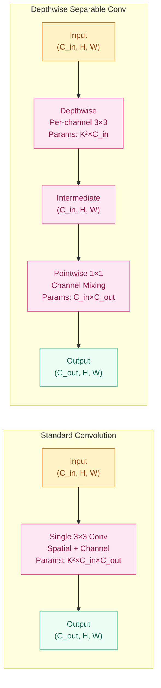
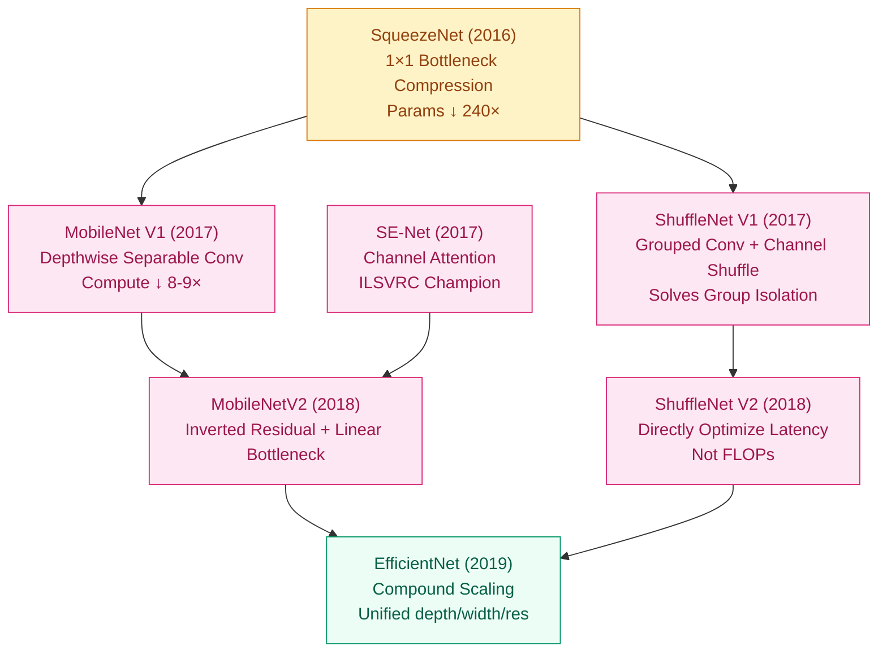

**[English](README_EN.md) | [中文](README.md)**

# Great Models, But They Don't Fit on Phones — Lightweight Architectures (2016–2017)

## Where Does This Problem Come From?

> ResNet-152 has 60 million parameters and requires 11.3 GFLOPs. It can accurately classify ImageNet,
> but when deployed on phones, drones, or embedded devices, there isn't enough memory or compute.
> In 2016–2017, researchers began asking: can we achieve the same accuracy with 1/10 or even 1/50 of the parameters?
> SqueezeNet, MobileNet, and SE-Net answered this question from different angles.

## Learning Objectives

After completing this chapter, you should be able to answer:

1. Why can depthwise separable convolution reduce computation by 8–9×? What is the mathematical principle?
2. How does SE-Net's channel attention mechanism allow the network to "learn to focus on important channels"?
3. How did these lightweight strategies influence subsequent EfficientNet and NAS directions?

---

## 1. Intuition

Imagine you have a large toolbox (standard convolution) with every tool inside, but it's very heavy. Every time you use it, you have to carry all the tools out, even if you only need to tighten one screw.

Depthwise separable convolution takes this approach: split "looking at spatial patterns per channel" and "mixing information across channels" into two steps. It's like first shining a flashlight on each one individually (depthwise), then using a mixer to blend the results (pointwise). Although there are more steps, each step is lightweight, and the overall process is much faster.

SE-Net's intuition: give each channel a score — "is this layer's information useful?" — amplify the useful ones, suppress the useless ones. Like an orchestra conductor: not every section needs to be equally loud. Important sections get more volume; secondary ones are dialed back.

SqueezeNet takes a different approach: use 1×1 convolutions to first narrow the channel count, then use 3×3 convolutions for spatial feature extraction on the narrow channels. The whole strategy is like moving house — first throw out things you rarely use, and only bring the essentials.

> Key takeaway: the three paths to lightweight design are ① structural simplification (MobileNet), ② channel selection (SE-Net), and ③ architecture search (NAS).

---

## 2. Mechanisms

### 2.1 SqueezeNet: The Compression Power of 1×1 Convolutions

Iandola et al. (2016) — AlexNet-level accuracy with only 1.2MB of parameters (vs. AlexNet's 240MB). A 240× compression ratio — how was this achieved?

The core idea is remarkably simple: a 1×1 convolution has only 1/9 the parameters of a 3×3 convolution. If you can replace as many 3×3 convolutions with 1×1 as possible without losing accuracy, the parameter count naturally drops significantly. But this introduces a new problem — 1×1 convolutions have no spatial receptive field and cannot model neighborhood relationships between pixels. SqueezeNet's solution is "squeeze then expand": first use 1×1 to narrow the channels, then use 3×3 for spatial feature extraction on the narrow channels, and finally concatenate the 1×1 and 3×3 results.

Three design strategies:

1. **Replace some 3×3 convolutions with 1×1** (squeeze layer: channels first compressed then expanded) — directly cuts parameter count
2. **Reduce the number of input channels** (use 1×1 to narrow channels before 3×3) — lets expensive 3×3 convolutions operate on fewer channels
3. **Delay downsampling** (larger feature maps → higher accuracy) — preserve high resolution in early layers, only shrink later

**Fire Module structure**:

- Squeeze layer: 1×1 convolution, outputting $s_1$ channels ($s_1$ is typically small, e.g., 16)
- Expand layer: 1×1 convolution ($e_1$ channels) + 3×3 convolution ($e_3$ channels), outputs concatenated
- Design constraint: $s_1 < e_1 + e_3$ (squeeze is narrower than expand, ensuring bottleneck compression)

The information flow in a Fire Module is: wide channels → narrow channels (squeeze) → expand again. This bottleneck structure later reappears in MobileNet and EfficientNet, just under different names.

**SqueezeNet's limitations**: Although it has very few parameters, its actual inference speed is not much faster than AlexNet. The reason is that its layers are too shallow and have too many branches, resulting in poor memory access efficiency. This reveals an important lesson: **parameter count does not equal computation, and computation does not equal actual latency**. SqueezeNet's true contribution is not practical deployment, but rather being the first to clearly articulate the research direction that "small models can also achieve large model accuracy," inspiring all subsequent lightweight work.

### 2.2 MobileNet: Depthwise Separable Convolution

Howard et al. (2017) — splitting standard convolution into two steps. This is the most fundamental insight in the lightweight direction.

**Standard convolution computation**: A $K \times K$ kernel, $C_{in}$ input channels, $C_{out}$ output channels, sliding over an $H \times W$ feature map. Each output channel must "look at" all input channels, so the total computation is:

$$\text{FLOPs}_{\text{standard}} = K \times K \times C_{in} \times C_{out} \times H \times W$$

**Key insight of depthwise separable convolution**: Standard convolution does two things simultaneously — spatial feature extraction (looking at local window patterns) and channel mixing (combining information from different channels). What if we split it into two steps?

- **Depthwise convolution**: Each input channel independently uses a $K \times K$ kernel for spatial feature extraction, with no cross-channel interaction. Computation: $K \times K \times 1 \times C_{in} \times H \times W$
- **Pointwise convolution (1×1)**: Uses 1×1 convolutions for linear combinations across channels, mapping $C_{in}$ channels to $C_{out}$ channels. Computation: $1 \times 1 \times C_{in} \times C_{out} \times H \times W$

Computation ratio:

$$\frac{\text{FLOPs}_{\text{ds}}}{\text{FLOPs}_{\text{std}}} = \frac{K^2 \cdot C_{in} + C_{in} \cdot C_{out}}{K^2 \cdot C_{in} \cdot C_{out}} = \frac{1}{C_{out}} + \frac{1}{K^2} \approx \frac{1}{8} \sim \frac{1}{9} \quad (K{=}3,\ C_{out}{=}128{\sim}512)$$

In other words, depthwise separable convolution requires only 1/8 to 1/9 of the computation of standard convolution, with accuracy loss typically within 1–2%.

Intuitive understanding of this result: In standard convolution, $C_{out}$ kernels each traverse all $C_{in}$ channels — this is the $C_{in} \times C_{out}$ combinatorial explosion. Depthwise separable convolution splits this problem — depthwise only needs $C_{in}$ independent spatial convolutions (no channel mixing), and pointwise uses 1×1 for channel mixing (no spatial overhead). Each step handles its own responsibility, and the total cost is far lower than doing everything at once.



**Width Multiplier $\alpha$**: Uniformly scales the number of channels per layer. $\alpha \in \{0.25, 0.5, 0.75, 1.0\}$. When $\alpha < 1$, all layer channel counts are proportionally reduced, and computation and parameters scale approximately by $\alpha^2$. This is a very practical design: the same architecture can adapt to different devices — from high-end servers to low-end watches — by changing a single parameter.

**Resolution Multiplier $\rho$**: Reduces input resolution. $\rho \in \{224, 192, 160, 128\}$. As resolution decreases, all feature map spatial dimensions shrink, and computation scales by $\rho^2$.

These two multipliers provide continuous accuracy-efficiency tuning knobs, allowing the same architecture to adapt to devices with different compute budgets. Experiments in the paper show: with $\alpha=0.5$, parameters are about 1.3M and ImageNet top-1 accuracy is about 63.7%; with $\alpha=1.0$, parameters are about 4.2M and accuracy is about 70.6%. The trade-off between accuracy and cost is approximately linear.

**MobileNet overall architecture**: The first layer is a standard 3×3 convolution (extracting low-level features), followed by 13 layers of depthwise separable convolution, and finally global average pooling and a fully connected layer. Note: not all layers use depthwise separable convolution — the first layer keeps standard convolution because the edge and texture features extracted in shallow layers are more sensitive to spatial precision, and the accuracy loss from depthwise separable convolution there is unacceptable.

### 2.3 SE-Net: Channel Attention

Hu et al. (2017) — ILSVRC 2017 champion. Core idea: let the network learn which channels are more important at each layer.

An implicit assumption of standard CNNs is that all channels are equally important. But in a given layer of ResNet, some channels may be encoding background texture, some encoding object contours, and others encoding lighting information. For the current task, not all information is equally useful — SE-Net lets the network learn to do this selection on its own.

**SE Block pipeline**:

1. **Squeeze**: Global average pooling → $(B, C, 1, 1)$, compressing each channel into a scalar. This step completely removes spatial information, retaining only the signal of "how active is this channel on average."
2. **Excitation**: FC → ReLU → FC → Sigmoid → $(B, C)$, generating channel weights. The two FC layers form a bottleneck structure, first reducing then increasing dimensionality.
3. **Scale**: Original feature map × channel weights. Important channels are amplified, unimportant ones are suppressed.

Mathematical formulation:

$$s = \sigma(W_2 \cdot \text{ReLU}(W_1 \cdot z)), \quad z_c = \frac{1}{H \times W} \sum_{i=1}^{H} \sum_{j=1}^{W} u_c(i,j)$$

Where $z$ is the squeezed channel descriptor vector, $W_1$ reduces the dimension from $C$ to $C/r$, $W_2$ restores it to $C$, and $\sigma$ is Sigmoid.

**Key design: intermediate layer reduction ratio $r=16$**. $W_1$ compresses $C$ to $C/r$, and $W_2$ restores to $C$. This reduction ratio is empirically optimal — too large ($r=64$) makes the attention too coarse, too small ($r=2$) adds too many parameters with diminishing returns. The parameter overhead of SE Blocks is typically less than 1% of total parameters, but can bring 0.5–1.5% accuracy improvement.

The elegance of the SE Block lies in its **plug-and-play** nature: it can be inserted after convolution blocks in any existing architecture. SE-ResNet-50 has about 10% more parameters than ResNet-50, but improves ImageNet top-1 accuracy from 76.0% to 77.6%. SE-ResNeXt-101 was the winning solution for the 2017 ILSVRC classification task.

**Why not use more complex attention?** A natural question is: why not simultaneously do spatial attention (which positions are important) and channel attention (which channels are important)? The answer is computational cost. SE Block's design philosophy is "minimum overhead for maximum gain" — global average pooling and two FC layers have extremely low cost, yet the accuracy improvement from channel selection is significant. Spatial attention (e.g., CBAM) is more refined but also more expensive, and may not be worthwhile in lightweight scenarios.

### 2.4 ShuffleNet: Grouped Convolution + Channel Shuffle

Zhang et al. (2017) — reducing computation from a different angle.

Grouped Convolution divides input channels into $g$ groups, each performing convolution independently. This reduces computation to $1/g$ of standard convolution. But grouped convolution has a fatal flaw: channels in different groups never interact, and information flow is isolated.

ShuffleNet's solution is **Channel Shuffle**: between two grouped convolutions, rearrange the channels so that each group in the next layer can see information from all groups in the previous layer.

The channel shuffle operation is very simple: reshape → transpose → flatten. Assuming $g$ groups with $n$ channels each, totaling $g \times n$ channels. First reshape the channel dimension to $(g, n)$, transpose to $(n, g)$, then flatten back to $(g \times n)$. This transforms "within-group contiguous" into "cross-group interleaved," so when the next layer does grouped convolution, each group can see channels from different groups.

ShuffleNet's contribution is proving that grouped convolution + channel shuffle is also an effective lightweight strategy. On some hardware (especially ARM CPUs), it is more efficient than grouped convolution alone because its memory access pattern is more regular.

### 2.5 Capsule Networks (Brief Comparison)

Hinton's (2017) intuition: pooling operations lose spatial relationships ("the mouth is above the nose"). Max pooling only preserves the strongest response but ignores the relative positions and hierarchical relationships between responses.

Capsule networks replace scalar neurons with "capsules," where each capsule is a vector encoding the existence probability of a feature (vector magnitude) and instantiation parameters (vector direction, such as pose, deformation, lighting). Dynamic routing replaces max pooling, allowing lower-level capsules to learn to send information to the most relevant higher-level capsules, preserving part-whole spatial hierarchical relationships.

It performed well on MNIST and SmallNORB, but failed to replace CNNs when scaled to large-scale tasks (e.g., ImageNet) — high computational cost, unstable training, and difficulty scaling the routing algorithm. Capsule networks are more of a "directionally correct but engineering-immature" attempt. The idea of "preserving spatial relationships" it proposed was later re-implemented in different forms through Transformer's positional encoding.

### 2.6 Step-by-Step Implementation

**Step 1 · Depthwise Separable Convolution**:

```python
import torch
import torch.nn as nn

class DepthwiseSeparableConv(nn.Module):
    """DepthwiseSeparableConv · . · Depthwise separable conv · Dependencies: torch"""
    def __init__(self, in_ch, out_ch, stride=1):
        super().__init__()
        # Depthwise: each input channel independently does spatial convolution
        self.depthwise = nn.Conv2d(in_ch, in_ch, 3, stride, 1, groups=in_ch, bias=False)
        # Pointwise: 1×1 convolution to mix channel information
        self.pointwise = nn.Conv2d(in_ch, out_ch, 1, bias=False)
        self.bn1 = nn.BatchNorm2d(in_ch)
        self.bn2 = nn.BatchNorm2d(out_ch)

    def forward(self, x):
        x = torch.relu(self.bn1(self.depthwise(x)))
        x = torch.relu(self.bn2(self.pointwise(x)))
        return x
```

**Step 2 · SE Block**:

```python
class SEBlock(nn.Module):
    """SEBlock · . · Channel attention · Dependencies: torch"""
    def __init__(self, channels, reduction=16):
        super().__init__()
        self.squeeze = nn.AdaptiveAvgPool2d(1)  # (B, C, H, W) → (B, C, 1, 1)
        self.excitation = nn.Sequential(
            nn.Linear(channels, channels // reduction, bias=False),
            nn.ReLU(inplace=True),
            nn.Linear(channels // reduction, channels, bias=False),
            nn.Sigmoid(),
        )

    def forward(self, x):
        b, c, _, _ = x.shape
        s = self.squeeze(x).view(b, c)          # squeeze: spatial dims compressed to 1
        s = self.excitation(s).view(b, c, 1, 1) # excitation: generate channel weights
        return x * s                              # scale: recalibrate
```

**Step 3 · Computation Comparison**:

```python
def count_flops(conv_type, in_ch, out_ch, h, w, kernel=3):
    """Compare computation of standard convolution vs depthwise separable convolution"""
    if conv_type == "standard":
        # Each output channel looks at all input channels, kernel slides over H×W
        return kernel * kernel * in_ch * out_ch * h * w
    else:  # depthwise separable
        dw = kernel * kernel * in_ch * h * w      # depthwise: per-channel independent
        pw = in_ch * out_ch * h * w               # pointwise: 1×1 channel mixing
        return dw + pw

in_ch, out_ch, h, w = 64, 128, 56, 56
std_flops = count_flops("standard", in_ch, out_ch, h, w)
ds_flops  = count_flops("depthwise_separable", in_ch, out_ch, h, w)
print(f"Standard: {std_flops/1e6:.1f}M | Depthwise Sep: {ds_flops/1e6:.1f}M | Ratio: {ds_flops/std_flops:.2%}")
# Output: Standard: 120.5M | Depthwise Sep: 26.8M | Ratio: 22.26%
```

**Step 4 · Complete Lightweight Network (MobileNet-style)**:

```python
import torch
import torch.nn as nn

torch.manual_seed(42)


class MobileNetTiny(nn.Module):
    """MobileNetTiny · . · Lightweight classifier · Dependencies: torch"""

    def __init__(self, n_class: int = 10):
        super().__init__()
        # First layer: standard convolution (shallow layers are sensitive to spatial precision)
        self.stem = nn.Sequential(
            nn.Conv2d(3, 32, 3, stride=2, padding=1, bias=False),
            nn.BatchNorm2d(32),
            nn.ReLU(inplace=True),
        )
        # Middle layers: depthwise separable convolutions
        self.features = nn.Sequential(
            DepthwiseSeparableConv(32, 64, stride=1),
            DepthwiseSeparableConv(64, 128, stride=2),
            DepthwiseSeparableConv(128, 128, stride=1),
            DepthwiseSeparableConv(128, 256, stride=2),
            DepthwiseSeparableConv(256, 256, stride=1),
        )
        self.classifier = nn.Sequential(
            nn.AdaptiveAvgPool2d(1),
            nn.Flatten(),
            nn.Linear(256, n_class),
        )

    def forward(self, x: torch.Tensor) -> torch.Tensor:
        """Args: x (B, 3, 224, 224) → returns logits (B, n_class)"""
        x = self.stem(x)
        x = self.features(x)
        return self.classifier(x)


model = MobileNetTiny()
x = torch.randn(4, 3, 224, 224)
out = model(x)
params = sum(p.numel() for p in model.parameters())
print(f"Input: {x.shape}  Output: {out.shape}  Params: {params/1e6:.2f}M")
# Input: (4, 3, 224, 224)  Output: (4, 10)  Params: ~0.3M
```

**Step 5 · SE-ResNet Block (SE module embedded in residual block)**:

```python
import torch
import torch.nn as nn


class SEResBlock(nn.Module):
    """SEResBlock · . · SE residual block · Dependencies: torch"""

    def __init__(self, in_ch, out_ch, stride=1, reduction=16):
        super().__init__()
        self.body = nn.Sequential(
            nn.Conv2d(in_ch, out_ch, 3, stride=stride, padding=1, bias=False),
            nn.BatchNorm2d(out_ch),
            nn.ReLU(inplace=True),
            nn.Conv2d(out_ch, out_ch, 3, padding=1, bias=False),
            nn.BatchNorm2d(out_ch),
        )
        self.se = SEBlock(out_ch, reduction)
        self.shortcut = nn.Sequential(
            nn.Conv2d(in_ch, out_ch, 1, stride=stride, bias=False),
            nn.BatchNorm2d(out_ch),
        ) if (stride != 1 or in_ch != out_ch) else nn.Identity()
        self.relu = nn.ReLU(inplace=True)

    def forward(self, x: torch.Tensor) -> torch.Tensor:
        """Args: x (B, C_in, H, W) → returns (B, C_out, H', W')"""
        out = self.body(x)
        out = self.se(out)       # SE recalibration before residual addition
        return self.relu(out + self.shortcut(x))


block = SEResBlock(64, 128, stride=2, reduction=16)
x = torch.randn(4, 64, 16, 16)
out = block(x)
print(f"Input: {x.shape}  Output: {out.shape}")
# Input: (4, 64, 16, 16)  Output: (4, 128, 8, 8)
```

---

## 3. Engineering Considerations

1. **Depthwise separable convolution accuracy loss** → Not all layers are suitable for replacement
   Shallow layers (edge/texture extraction) use standard convolution, deep layers use depthwise separable. Or adopt a mixed strategy: use standard convolution for accuracy-sensitive blocks, depthwise separable for the rest. In practice, replacing all convolution layers except the first two usually achieves a good balance between accuracy and efficiency. MobileNetV2 further optimized this strategy with inverted residual structures (expand then compress), allowing depthwise to work on wider channels and reducing information loss.

2. **SE Block overhead** → Additional FC layers add parameters
   Reduction ratio $r=16$ is empirically optimal. Too small ($r=2$) means many parameters with diminishing returns; too large ($r=64$) makes attention too coarse. Additionally, the matrix multiplications introduced by SE Blocks can become a bottleneck on some hardware (especially with very large channel counts), requiring empirical verification. In deployment, the two FC layers of an SE Block can be fused into a single operator to reduce kernel launch overhead.

3. **Quantized deployment** → FP models converted to INT8 lose accuracy
   Lightweight models usually need further quantization for real-time inference on mobile. Quantization-aware training (QAT) or post-training quantization (PTQ) + calibration dataset is the standard pipeline. The depthwise part of depthwise separable convolutions is more sensitive to quantization (few channels, unstable per-channel statistics), potentially requiring per-channel quantization rather than per-tensor quantization. In practice, FP16 is a safer intermediate choice — minimal accuracy loss and near-INT8 speed on mobile chips that support FP16.

4. **Latency vs. accuracy Pareto curve** → Cannot just look at FLOPs
   Low FLOPs does not equal fast inference. Memory access patterns, cache hit rates, and operator fusion opportunities all affect actual latency. ShuffleNet noted that although group convolution has low computation, its memory access is non-contiguous and can actually be slower on some GPUs. Benchmarking on the target device is the only reliable standard. A practical approach: first run benchmarks on the target device to identify the bottleneck (compute vs. memory bandwidth), then choose the corresponding optimization strategy.

5. **Knowledge distillation combined with lightweight models** → Small models learn from large models
   Lightweight architectures are capacity-limited and may not achieve sufficient accuracy on their own. Using a large model (e.g., ResNet-152) as a teacher, knowledge distillation transfers dark knowledge to the lightweight student model, typically improving accuracy by another 1–3%. This is an important supplement to the lightweight direction in subsequent years (2018–2019). The core of knowledge distillation is having the student model learn the teacher's soft labels (temperature-scaled probability distributions) rather than just hard labels (one-hot encoding). Soft labels contain inter-class similarity information, such as "cats are more similar to dogs than to cars" — this information is very valuable for training small models.

6. **Operator fusion and inference optimization** → The last mile before deployment
   Depthwise separable convolution is two independent operators at the framework level (depthwise conv + pointwise conv), but in inference engines (e.g., TensorRT, TFLite) they can usually be fused with BatchNorm and ReLU into a single operator. Fusion reduces memory read/write count and kernel launch overhead. When benchmarking latency, always use the fused version — otherwise the comparison is unfair.

> Key takeaway: the goal of lightweight design is "the fastest model that achieves target accuracy on the target device," not "the fewest parameters." Parameter count, FLOPs, and actual latency are three different metrics — all must be considered during optimization.

---

## 4. Architecture Comparison

| Model | Year | Core Strategy | Parameters | ImageNet Top-1 | Key Insight |
|-------|------|--------------|------------|----------------|-------------|
| SqueezeNet | 2016 | 1×1 bottleneck compression | 1.2MB | 57.5% | Parameters can be extremely compressed, but speed may not improve |
| MobileNet V1 | 2017 | Depthwise separable convolution | 4.2M | 70.6% | Split spatial and channel operations, 8–9× computation reduction |
| ShuffleNet V1 | 2017 | Grouped conv + channel shuffle | ~2M | 70.9% | Solves channel isolation in grouped convolutions |
| SE-Net | 2017 | Channel attention | ~28M | 77.6% | Lets networks adaptively adjust channel importance |
| Capsule Net | 2017 | Dynamic routing | ~8M | — | Conceptually innovative but failed to scale |

This table reveals a key fact: although SqueezeNet has the fewest parameters, its accuracy is far below MobileNet's. Simply compressing parameters is a dead end — you must redesign the computation itself from an efficiency perspective. MobileNet's depthwise separable convolution and SE-Net's channel attention represent the two paths of "redesigning computation" and "redesigning information flow" respectively. They are not mutually exclusive — MobileNetV3 uses both depthwise separable convolution and SE modules.

Another notable trend: 2016–2017 lightweight work primarily focused on ImageNet classification. But these techniques were quickly transferred to object detection (SSD + MobileNet), semantic segmentation (DeepLabV3 + MobileNet), and face recognition, becoming standard for mobile vision applications.

---

## 5. Timeline: The Evolution of Lightweight Architectures



This timeline shows how three main threads of the lightweight direction evolved and eventually converged:

- **Parameter compression thread**: SqueezeNet → proved the feasibility of extreme compression
- **Structural redesign thread**: MobileNet → ShuffleNet → MobileNetV2/V3 → EfficientNet
- **Attention thread**: SE-Net → CBAM → integrated into MobileNetV3 → Transformer attention

The three threads ultimately converge at EfficientNet (2019), which simultaneously uses depthwise separable convolution, SE modules, and compound scaling strategies. This marks the maturation of hand-designed lightweight architectures, after which NAS and knowledge distillation became the new frontier.

---

## Evolution Notes

> **The legacy of this technology**: MobileNet established depthwise separable convolution as the cornerstone of mobile vision models. Its decomposition insight — "spatial feature extraction" and "channel mixing" done separately — was subsequently adopted by nearly all lightweight architectures.
>
> MobileNet → MobileNetV2 (2018) introduced inverted residual structures (expand then compress) and linear bottlenecks, improving both accuracy and speed simultaneously. MobileNetV3 (2019) combined NAS search with SE modules for further optimization. The MobileNet family is the most successful mobile vision architecture and is still widely used in the Android ecosystem today.
>
> SE-Net's attention idea was later extended to spatial attention (CBAM, 2018) and temporal attention (video understanding), and ultimately inspired the self-attention mechanism in Transformers. It proved that "letting networks learn to select information" is a universal performance improvement paradigm.
>
> ShuffleNet → ShuffleNetV2 (2018) proposed an important viewpoint: one should directly optimize actual inference latency, not FLOPs. It provided four guiding principles: equal channel widths, reduce group count, reduce fragmentation, and reduce element-wise operations. These principles profoundly influenced subsequent model design.
>
> NAS (Neural Architecture Search) emerged in 2018, using search to replace hand design. EfficientNet (2019) used compound scaling (synchronized depth/width/resolution) to unify the lightweight direction, achieving 84.3% top-1 accuracy on ImageNet with 66M parameters.
>
> The lightweight path was eventually partially superseded by ViT's patch embedding and knowledge distillation — small models no longer rely on special convolution structures but instead learn from large models via distillation. However, depthwise separable convolution still lives on in modern architectures: ViT's patch embedding layer and ConvNeXt's depthwise conv are both continuations of this idea.
>
> → Next phase: [Language Line — Sequence Modeling & Transformers](../../language/README_EN.md)

---

**Previous chapter**: [Advanced GAN](../gan-advanced/README_EN.md) | **Next phase**: [Language Line](../../language/README_EN.md)
