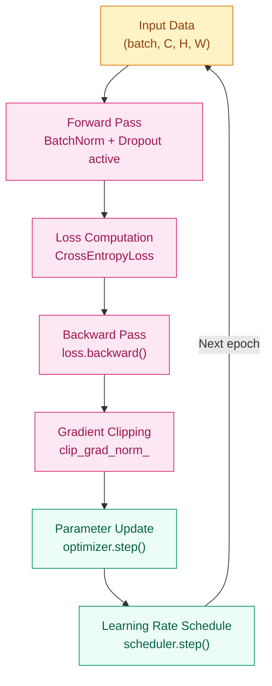

# Why Does Making Networks Deeper Make Training Worse? — Optimization & Training Stability

**[English](README_EN.md) | [中文](README.md)**

## Where This Problem Came From

> In 2012, when Krizhevsky trained AlexNet, he found that adding Dropout and ReLU allowed an 8-layer network to stably complete ImageNet training. But there was no systematic answer to "why it was stable."
> Three years later, Ioffe and Szegedy (2015) offered a deeper explanation: as long as the input distribution of each layer remains stable, a network can be trained to arbitrary depth — this is Batch Normalization.
> This chapter organizes the training techniques that emerged between 2012 and 2015 into a complete methodology.

## Learning Goals

After completing this chapter, you should be able to answer:

1. What problems do Dropout, BatchNorm, and weight decay each solve? Can they be used together?
2. At which stages of training do learning rate scheduling and gradient clipping respectively take effect?
3. When training is unstable or val loss won't go down, what should the debugging order be?

---

## 1. Intuition

Imagine you're learning to ride a bicycle.

If the slope, wind speed, and road surface are different every time you practice (internal covariate shift), it's hard to build stable muscle memory. But if conditions are consistent each time, your body knows "this amount of force under these conditions produces this result," and learning is much faster.

BatchNorm does exactly the same thing: it keeps the "input environment" of each layer consistent, so downstream layers don't have to re-adapt to upstream distribution changes every round.

Dropout, on the other hand, is like "blindfolded practice" — forcing each neuron not to rely on specific other neurons, learning more independent and robust features.

> Key takeaway: BatchNorm solves "training instability," Dropout solves "poor generalization." They target different problems and can be stacked.

---

## 2. Mechanism

### 2.1 Training Loop Overview



### 2.2 Dropout

During training, randomly zero out neurons with probability $p$; during inference, turn it off. Key point: **on during training, off during inference** — `model.eval()` handles the switch automatically.

> For the principles of Dropout, the inverted dropout formula, and variants (DropConnect / SpatialDropout / DropBlock / RNN Dropout), see the prerequisite chapter [Regularization & Dropout](../../../foundations/deep-learning/regularization/README_EN.md).

### 2.3 Batch Normalization

Normalize activations over a mini-batch, then restore expressiveness with learnable $\gamma, \beta$:

$$
\hat{x}_i = \frac{x_i - \mu_B}{\sqrt{\sigma_B^2 + \epsilon}}, \qquad
y_i = \gamma \hat{x}_i + \beta
$$

- **During training**: uses the mean and variance of the current batch
- **During inference**: uses the running mean and running variance maintained during training (`model.eval()` switches)

### 2.4 Learning Rate Scheduling

| Strategy | Formula Intuition | Use Case |
|----------|-------------------|----------|
| StepLR | Multiply by decay factor every N epochs | Traditional CV pipelines |
| CosineAnnealing | Cosine curve from max to min | Modern general-purpose default |
| Warmup + Cosine | Linearly ramp up to peak, then cosine decay | Transformers / large models |
| ReduceLROnPlateau | Automatically lower LR when val metric plateaus | Safety strategy when tuning is uncertain |

### 2.5 Progressive Implementation

**Step 1 · Minimal Training Loop (core skeleton, runnable standalone)**

```python
# Build a reproducible minimal closed loop
# Verify zero_grad -> backward -> step order
import torch
import torch.nn as nn

torch.manual_seed(42)

model = nn.Sequential(nn.Linear(16, 32), nn.ReLU(), nn.Linear(32, 10))
optimizer = torch.optim.SGD(model.parameters(), lr=0.01)
loss_fn = nn.CrossEntropyLoss()

x = torch.randn(32, 16)
y = torch.randint(0, 10, (32,))

logits = model(x)              # forward
loss = loss_fn(logits, y)      # compute loss

optimizer.zero_grad()          # clear previous gradients
loss.backward()                # backpropagation
optimizer.step()               # parameter update

print(f"loss: {loss.item():.4f}")
```

**Step 2 · Add Regularization (Dropout + BatchNorm)**

```python
# BatchNorm stabilizes training; Dropout prevents neuron co-adaptation
# train() / eval() mode switching affects both behaviors
import torch
import torch.nn as nn

torch.manual_seed(42)


class RegularizedNet(nn.Module):
    """RegularizedNet · . · BN+Dropout demo · deps: torch"""

    def __init__(self, in_dim: int = 16, hidden: int = 64, n_class: int = 10):
        super().__init__()
        self.net = nn.Sequential(
            nn.Linear(in_dim, hidden),
            nn.BatchNorm1d(hidden),   # stabilize per-layer input distribution
            nn.ReLU(),
            nn.Dropout(0.3),          # suppress co-adaptation
            nn.Linear(hidden, n_class),
        )

    def forward(self, x: torch.Tensor) -> torch.Tensor:
        """Args: x (batch, in_dim) -> returns logits (batch, n_class)"""
        return self.net(x)


model = RegularizedNet()
optimizer = torch.optim.AdamW(model.parameters(), lr=1e-3, weight_decay=1e-2)
loss_fn = nn.CrossEntropyLoss()

x, y = torch.randn(32, 16), torch.randint(0, 10, (32,))

model.train()
logits = model(x)
loss = loss_fn(logits, y)

optimizer.zero_grad()
loss.backward()
optimizer.step()

# Inference mode: BN uses running statistics, Dropout is off
model.eval()
with torch.no_grad():
    val_logits = model(x)
```

**Step 3 · Add Gradient Clipping and Learning Rate Scheduling**

```python
# Gradient clipping prevents explosion; Warmup+Cosine is the modern standard schedule
import torch
import torch.nn as nn
from torch.optim.lr_scheduler import LinearLR, CosineAnnealingLR, SequentialLR

torch.manual_seed(42)

WARMUP_STEPS = 100
TOTAL_STEPS  = 1000
MAX_GRAD_NORM = 1.0

model = nn.Sequential(
    nn.Linear(16, 64), nn.BatchNorm1d(64), nn.ReLU(), nn.Dropout(0.3),
    nn.Linear(64, 10),
)
optimizer = torch.optim.AdamW(model.parameters(), lr=1e-3, weight_decay=1e-2)
loss_fn = nn.CrossEntropyLoss()

warmup = LinearLR(optimizer, start_factor=0.01, end_factor=1.0, total_iters=WARMUP_STEPS)
cosine = CosineAnnealingLR(optimizer, T_max=TOTAL_STEPS - WARMUP_STEPS, eta_min=1e-6)
scheduler = SequentialLR(optimizer, schedulers=[warmup, cosine], milestones=[WARMUP_STEPS])

x, y = torch.randn(32, 16), torch.randint(0, 10, (32,))

model.train()
logits = model(x)
loss = loss_fn(logits, y)

optimizer.zero_grad()
loss.backward()
nn.utils.clip_grad_norm_(model.parameters(), MAX_GRAD_NORM)  # clip before step
optimizer.step()
scheduler.step()

print(f"loss: {loss.item():.4f}  lr: {scheduler.get_last_lr()[0]:.2e}")
```

**Step 4 · Production-Grade (full epoch loop + early stopping + checkpoint)**

```python
# Complete loop: train/val separation + early stopping + best model saving
# train() / eval() switching is prerequisite for BatchNorm and Dropout to work correctly
import torch
import torch.nn as nn
from torch.utils.data import DataLoader, TensorDataset
from torch.optim.lr_scheduler import CosineAnnealingLR

torch.manual_seed(42)

BATCH, IN_DIM, N_CLASS = 32, 16, 10
NUM_EPOCHS, PATIENCE = 20, 5
MAX_GRAD_NORM = 1.0


class Net(nn.Module):
    """Net · . · production-grade training demo · deps: torch"""

    def __init__(self, in_dim: int, n_class: int):
        super().__init__()
        self.net = nn.Sequential(
            nn.Linear(in_dim, 64), nn.BatchNorm1d(64), nn.ReLU(), nn.Dropout(0.3),
            nn.Linear(64, n_class),
        )
        for m in self.modules():
            if isinstance(m, nn.Linear):
                nn.init.kaiming_normal_(m.weight, nonlinearity="relu")
                nn.init.zeros_(m.bias)

    def forward(self, x: torch.Tensor) -> torch.Tensor:
        """Args: x (batch, in_dim) -> returns logits (batch, n_class)"""
        return self.net(x)


def run_epoch(model, loader, loss_fn, optimizer=None):
    is_train = optimizer is not None
    model.train() if is_train else model.eval()
    total_loss, correct, n = 0.0, 0, 0
    for x, y in loader:
        with torch.set_grad_enabled(is_train):
            logits = model(x)
            loss = loss_fn(logits, y)
        if is_train:
            optimizer.zero_grad()
            loss.backward()
            nn.utils.clip_grad_norm_(model.parameters(), MAX_GRAD_NORM)
            optimizer.step()
        total_loss += loss.item() * y.size(0)
        correct += (logits.argmax(1) == y).sum().item()
        n += y.size(0)
    return total_loss / n, correct / n


# Data
x_all = torch.randn(400, IN_DIM)
y_all = torch.randint(0, N_CLASS, (400,))
train_loader = DataLoader(TensorDataset(x_all[:320], y_all[:320]), batch_size=BATCH, shuffle=True)
val_loader   = DataLoader(TensorDataset(x_all[320:], y_all[320:]), batch_size=BATCH)

model = Net(IN_DIM, N_CLASS)
optimizer = torch.optim.AdamW(model.parameters(), lr=1e-3, weight_decay=1e-2)
scheduler = CosineAnnealingLR(optimizer, T_max=NUM_EPOCHS, eta_min=1e-6)
loss_fn = nn.CrossEntropyLoss()

best_val_acc, bad_epochs = 0.0, 0
for epoch in range(NUM_EPOCHS):
    tr_loss, tr_acc = run_epoch(model, train_loader, loss_fn, optimizer)
    val_loss, val_acc = run_epoch(model, val_loader, loss_fn)
    scheduler.step()

    if val_acc > best_val_acc:
        best_val_acc, bad_epochs = val_acc, 0
        torch.save({"epoch": epoch, "state_dict": model.state_dict()}, "best.pth")
    else:
        bad_epochs += 1
        if bad_epochs >= PATIENCE:
            print(f"Early stopping at epoch {epoch+1}")
            break

    print(f"[{epoch+1:02d}] train_acc={tr_acc:.3f}  val_acc={val_acc:.3f}  lr={scheduler.get_last_lr()[0]:.2e}")
```

---

## 3. Engineering Pitfalls

Listed by priority from high to low:

1. **Forgetting `zero_grad()`** -> gradients accumulate across batches, effectively making the learning rate explode with each step
   Fix: place `optimizer.zero_grad()` right before `loss.backward()`

2. **Not switching train/eval mode** -> BatchNorm uses current batch statistics instead of running statistics during inference; Dropout remains active during inference
   Fix: call `model.eval()` before inference and `model.train()` during training — this is one of the easiest mistakes to miss and hardest to debug

3. **Wrong learning rate** -> too high: loss oscillates/explodes; too low: training is extremely slow or gets stuck at saddle points
   Fix: start with `1e-3` (AdamW), check whether loss steadily decreases over the first 10 batches

4. **Gradient explosion** -> loss suddenly becomes NaN or a very large value
   Fix: add `clip_grad_norm_(model.parameters(), 1.0)` after `backward()` and before `step()`

5. **Improper Dropout ratio** -> too high (>0.5) can cause underfitting in shallow networks; in CNNs, Dropout is typically only added to fully connected layers
   Fix: start from 0.2-0.3 and adjust based on validation performance

> Key takeaway: first confirm the `zero_grad -> backward -> step` order and `train/eval` switching are correct, then check hyperparameters. These two categories of errors account for over 60% of "mysteriously not converging" problems.

---

## Evolution Notes

> **The legacy of this technology**: The combination of Dropout + BatchNorm + Adam made training deep networks reliable, but what they solved was "training stability of fully connected layers." Image data has a natural prior — adjacent pixels are highly correlated, while distant pixels are nearly independent. Processing images with fully connected layers connects every pixel to all parameters, which is both wasteful and ignores this prior.
>
> This problem gave rise to CNNs: using local convolutional kernels to capture spatial structure, reducing the parameter count of vision models from millions to something manageable.

-> Next chapter: [CNN Architectures — Why Are Fully Connected Networks Too Wasteful for Images?](../cnn-architectures/README_EN.md)

---

**Previous**: [Deep Learning Basics](../../../foundations/deep-learning/deep-learning-basics/README_EN.md) | **Next**: [CNN Architectures](../cnn-architectures/README_EN.md)
