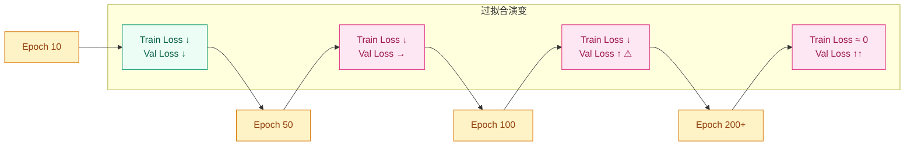
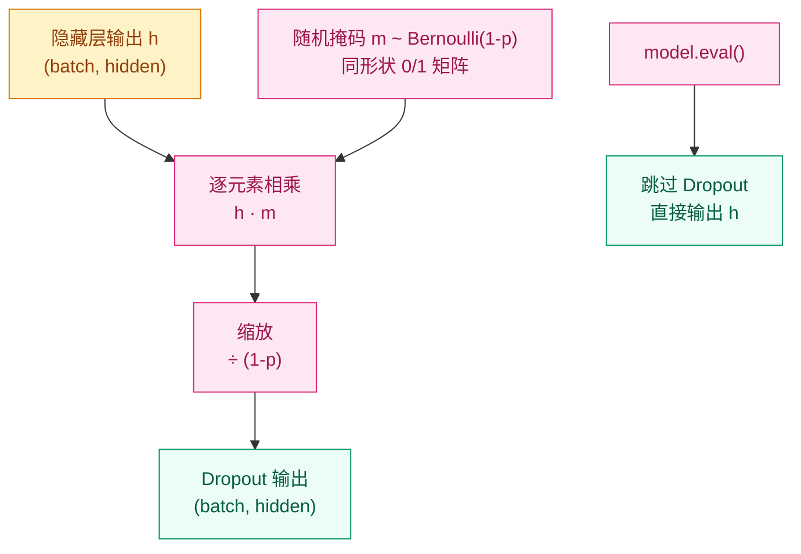

# Dropout 与正则化章节实现计划

> **For agentic workers:** REQUIRED SUB-SKILL: Use superpowers:subagent-driven-development (recommended) or superpowers:executing-plans to implement this plan task-by-task. Steps use checkbox (`- [ ]`) syntax for tracking.

**Goal:** 在 `00-Prerequisites/regularization/` 下新建正则化与 Dropout 完整专题章节，并联动更新 5 个相关文件。

**Architecture:** 新建独立目录 `00-Prerequisites/regularization/`，包含一个遵循 STYLE.md 全部规范的 README.md。联动更新 Prerequisites 概览、deep-learning-basics 导航、training 章节交叉引用、Phase 01 概览、Timeline 链接。

**Tech Stack:** Markdown (含 Mermaid 图)、Python/PyTorch 代码示例、LaTeX 数学公式

**Design Spec:** `docs/superpowers/specs/2026-04-02-dropout-regularization-design.md`

---

### Task 1: 创建 regularization 目录和 README.md 主文件

**Files:**
- Create: `00-Prerequisites/regularization/README.md`

- [ ] **Step 1: 创建目录**

```bash
mkdir -p 00-Prerequisites/regularization
```

- [ ] **Step 2: 写入 README.md 完整内容**

写入 `00-Prerequisites/regularization/README.md`，完整内容如下（严格遵循 STYLE.md 规范）：

```markdown
# 为什么模型会"死记硬背"？—— 正则化与 Dropout

## 这个问题从哪来

> 2012 年，Hinton 组在训练深度网络时发现一个诡异的现象：训练集上的 loss 可以逼近零，但测试集上的 loss 不降反升。模型不是"没学会"，而是"死记硬背"了训练数据——这叫**过拟合**。
> 同年他们提出了 Dropout：训练时随机丢掉一部分神经元，强迫网络学到更鲁棒的特征。这个简单到令人怀疑的想法，后来成为深度学习最常用的正则化手段。

## 学习目标

完成本章后，你应能回答：

1. 为什么大模型容易过拟合？容量和泛化的矛盾在哪？
2. Dropout 的 inverted dropout 是怎么操作的？为什么推理时要关掉？
3. L2 正则化和 Dropout 分别从什么角度抑制过拟合？
4. DropConnect / SpatialDropout / DropBlock 各自解决什么场景的问题？
5. 什么时候该用哪种正则化手段？

---

## 1. 直觉

想象两个学生准备考试。

学生 A 把每道练习题的答案都背下来了，练习册上 100 分，换一套题就傻眼。学生 B 做题时偶尔被蒙住眼睛——看不到相邻的笔记，只能靠自己推导。考试时 B 反而更稳。

**过拟合**就是学生 A：模型把训练数据记住了，但没学到规律。**Dropout**就是蒙眼练习：每次随机让一部分神经元"闭嘴"，强迫其他神经元独立学会完成任务。

**L2 权重衰减**是另一条路：给每个参数设一个"体重上限"，不允许任何一个权重长得太大。这像是给模型减肥——不让它靠某一个超大参数来"作弊"。

**变体直觉**：DropConnect 不是蒙住眼睛（drop 激活），而是蒙住手脚（drop 权重连接），更激进但也更慢。

---

## 2. 机制

### 2.1 过拟合的诊断与根源



过拟合的根源是**模型容量 > 数据提供的信息量**。参数越多、数据越少，模型越有"余力"去记忆噪声而非学习规律。

诊断方法很简单：画训练 loss 和验证 loss 的曲线。当两条线开始分叉——训练 loss 继续降，验证 loss 横盘甚至上升——就是过拟合的信号。

> 你要记住：正则化的本质不是"让模型变差"，而是"限制有效容量"，让模型把有限的容量花在学习规律而非记忆噪声上。

### 2.2 Dropout：核心机制



Inverted Dropout 的操作分三步：

1. 生成掩码：$m_i \sim \text{Bernoulli}(1-p)$，即每个神经元以概率 $1-p$ 保留
2. 逐元素相乘：$\tilde{h}_i = m_i \cdot h_i$
3. 缩放：$\tilde{h}_i = \frac{m_i \cdot h_i}{1-p}$

**为什么除以 $(1-p)$？** 这是 inverted dropout 的关键：在训练时就把缩放做了，推理时就不需要任何调整。如果不做这一步，推理时需要乘以 $(1-p)$ 来补偿——容易忘，也容易出错。

从贝叶斯视角看，Dropout 等价于对指数级多个子网络做**模型平均（model averaging）**的近似。每次 drop 掉不同的神经元组合，相当于训练了一个不同的子网络；推理时用全部神经元，约等于这些子网络的平均预测。

> 你要记住：Dropout 推理时必须关闭——它不是在给网络加噪声，是在做模型平均的近似。忘记 `model.eval()` 会导致推理结果随机抖动。

### 2.3 权重衰减（L2 正则化）

在损失函数后加一个对参数大小的惩罚项：

$$
L_{reg} = L + \frac{\lambda}{2}\|\theta\|^2
$$

梯度更新时多出一项 $\lambda \theta$，效果是每次更新都把权重往零拉一点——这就是"衰减"的名字来源。

**与 Dropout 的对比**：

| 维度 | L2 正则化 | Dropout |
|------|----------|---------|
| 作用对象 | 参数值的大小 | 神经元的激活 |
| 直觉 | 不允许任何权重过大 | 不允许任何神经元过于重要 |
| 理论视角 | 参数空间约束（MAP 近似） | 集成学习近似 |
| 适用层 | 所有层 | 通常是全连接层 |
| 推理开销 | 无 | 无（已关闭） |

PyTorch 中 `optimizer = torch.optim.AdamW(model.parameters(), lr=1e-3, weight_decay=1e-2)` 的 `weight_decay` 就是 L2 正则化的强度 $\lambda$。注意用 `AdamW` 而非 `Adam + weight_decay`——AdamW 把权重衰减从梯度更新中解耦出来，效果更稳定（Loshchilov & Hutter, 2019）。

### 2.4 变体演进

**DropConnect（2013, Wan et al.）**

不 drop 激活值，而是 drop **权重矩阵的元素**。比 Dropout 更激进——每次前向传播用的是网络的一个随机稀疏子结构。

$$
\tilde{W} = M \odot W
$$

其中 $M$ 是与 $W$ 同形状的 Bernoulli 掩码。

优势：更强的正则化效果。代价：实现更复杂，训练更慢，实际使用较少。

**SpatialDropout（2014）**

标准 Dropout 对特征图的每个像素独立 drop，但 CNN 的特征图中相邻像素高度相关——drop 掉一个像素，旁边的像素可能提供几乎相同的信息。

SpatialDropout 直接 drop **整个 channel**：以概率 $p$ 把某个特征图通道全部置零。这样网络被迫不能依赖任何一个特定通道。

```python
# 标准 Dropout vs SpatialDropout
nn.Dropout(p)           # 每个 pixel 独立 drop
nn.Dropout2d(p)         # 整个 channel 一起 drop
```

**DropBlock（2018, Ghose et al.）**

SpatialDropout drop 整个 channel，但有时特征的相关性不在整个通道上，而是在**局部区域**（比如一只猫的耳朵占据特征图的一小块）。

DropBlock drop 的是**连续的方形区域**。参数 `block_size` 控制区域大小，是 SpatialDropout 的泛化（`block_size=1` 时退化为标准 Dropout，`block_size=feature_size` 时退化为 SpatialDropout）。

**Dropout in RNNs（2014, Zaremba et al.）**

RNN 的循环连接是时间步之间传递信息的通道。如果在这里加 Dropout，每一步都可能丢掉关键信息，导致长程依赖被破坏。

Zaremba 的方案：**只在非循环连接上**（层与层之间）加 Dropout，循环连接上不加。这样既起到了正则化效果，又不干扰时序信息的传递。

```python
# PyTorch 的 LSTM/GRU 内置了这个策略
nn.LSTM(input_size, hidden_size, num_layers=2, dropout=0.3)
# dropout 只作用于层间（非循环）连接
```

### 2.5 其他正则化手段（点到为止）

**Early Stopping**：验证集 loss 连续 N 个 epoch 不降就停止训练。N 称为 patience。这是最简单也最常用的正则化——与其限制模型能力，不如在它"开始死记硬背"之前叫停。

**Data Augmentation**：对训练数据做随机变换（图像的裁剪、翻转、颜色抖动；文本的同义词替换、回译），相当于用少量数据"变出"更多样本。很多实验表明，数据增强的正则化效果超过 Dropout。

**Label Smoothing**：把硬标签 `[0, 1, 0]` 软化为 `[0.1, 0.8, 0.1]`，防止模型对某个类别过度自信。在 Transformer 训练中几乎标配。

> 你要记住：正则化手段没有银弹，实际效果取决于数据、模型和任务的组合。最常见的组合是 Data Augmentation + Weight Decay + Early Stopping。

### 2.6 渐进式实现

**Step 1 · 纯 NumPy 实现 inverted dropout（核心逻辑，可独立运行）**

```python
# 实现 inverted dropout：训练时 mask+缩放，推理时直接通过
import numpy as np

np.random.seed(42)

def dropout_forward(x, p=0.5, training=True):
    # x: (batch, hidden), p: drop 概率
    if not training or p == 0:
        return x
    mask = (np.random.rand(*x.shape) > p).astype(x.dtype)
    return x * mask / (1 - p)

h = np.random.randn(4, 8)
print("训练模式:", dropout_forward(h, p=0.5, training=True))
print("推理模式:", dropout_forward(h, p=0.5, training=False))
```

**Step 2 · PyTorch `nn.Dropout` + train/eval 切换**

```python
# 对比手动实现和 PyTorch 内置，验证 train/eval 模式切换行为
import torch
import torch.nn as nn

torch.manual_seed(42)

DROPOUT_P = 0.3

layer = nn.Dropout(DROPOUT_P)
x = torch.ones(4, 8)

layer.train()
out_train = layer(x)
print(f"训练模式 (非零元素比): {(out_train != 0).float().mean():.2f}")

layer.eval()
out_eval = layer(x)
print(f"推理模式 (与输入一致): {torch.allclose(out_eval, x)}")
```

**Step 3 · CNN 中 SpatialDropout 的使用**

```python
# SpatialDropout drop 整个 channel，适配 CNN 特征图的空间相关性
import torch
import torch.nn as nn

torch.manual_seed(42)

DROPOUT_P = 0.2

layer = nn.Dropout2d(DROPOUT_P)
x = torch.randn(4, 32, 8, 8)  # (batch, channels, H, W)

layer.train()
out = layer(x)
# 被 drop 的 channel 全部为零
zero_channels = (out == 0).all(dim=(2, 3))  # (batch, channels)
print(f"被 drop 的 channel 比例: {zero_channels.float().mean():.2f}")
```

**Step 4 · 对比实验：不同 Dropout 率下的 train/val loss**

```python
# 验证 Dropout 率对过拟合的影响
# 同一 MLP，仅改变 dropout rate，对比 train/val loss 曲线
import torch
import torch.nn as nn
import matplotlib.pyplot as plt

torch.manual_seed(42)

# --- 数据 ---
X = torch.randn(1000, 20)
y = (X[:, 0] + X[:, 1] > 0).long()
train_X, val_X = X[:800], X[800:]
train_y, val_y = y[:800], y[800:]


def make_model(dropout_p):
    return nn.Sequential(
        nn.Linear(20, 256),
        nn.ReLU(),
        nn.Dropout(dropout_p),
        nn.Linear(256, 256),
        nn.ReLU(),
        nn.Dropout(dropout_p),
        nn.Linear(256, 2),
    )


rates = [0.0, 0.2, 0.5, 0.8]
fig, axes = plt.subplots(1, 4, figsize=(16, 4), sharey=True)

for ax, p in zip(axes, rates):
    model = make_model(p)
    opt = torch.optim.Adam(model.parameters(), lr=1e-3)
    train_losses, val_losses = [], []

    for epoch in range(200):
        model.train()
        loss = nn.functional.cross_entropy(model(train_X), train_y)
        opt.zero_grad()
        loss.backward()
        opt.step()
        train_losses.append(loss.item())

        model.eval()
        with torch.no_grad():
            val_loss = nn.functional.cross_entropy(model(val_X), val_y)
        val_losses.append(val_loss.item())

    ax.plot(train_losses, label="train")
    ax.plot(val_losses, label="val")
    ax.set_title(f"dropout={p}")
    ax.legend()
    ax.set_xlabel("epoch")

axes[0].set_ylabel("loss")
plt.suptitle("不同 Dropout 率下的训练/验证 Loss 对比")
plt.tight_layout()
plt.savefig("dropout_comparison.png", dpi=150)
```

---

## 3. 工程陷阱

优先级从高到低：

1. **Dropout rate 过高（> 0.5）** → 浅层网络欠拟合，训练 loss 降不下去
   处置：从 0.2–0.3 起步，观察 train/val loss 差距再决定是否调大

2. **忘记 `model.eval()`** → 推理时 Dropout 仍然生效，每次预测结果不同
   处置：推理前一律 `model.eval()`，推理后 `model.train()` 恢复

3. **weight_decay + Adam 的互动** → 标准 Adam 中 weight_decay 会和自适应学习率耦合，效果不稳定
   处置：使用 `AdamW` 替代 `Adam + weight_decay`，解耦权重衰减

4. **BatchNorm 和 Dropout 顺序不当** → Dropout 改变激活分布，BatchNorm 的统计被干扰，训练不稳定
   处置：推荐顺序 `Linear → BN → ReLU → Dropout`，BN 先稳定分布，Dropout 再做正则化

5. **RNN 中 Dropout 加错位置** → 在循环连接上加 Dropout 会破坏长程依赖
   处置：使用 PyTorch LSTM/GRU 的 `dropout` 参数（只在层间加），或手动在非循环连接上加

---

## 演进笔记

> **正则化的遗产**：从 2012 年 Dropout 开始，正则化手段从"手动加噪声"演变为"自适应正则"——BatchNorm 在稳定训练的同时起到了隐式正则化效果，数据增强则从随机裁剪进化到 MixUp、CutMix 等语义级增强。
>
> **留下的新问题**：大模型时代（GPT-4 级别），Dropout 几乎不再使用——为什么？因为当数据量足够大、训练时间足够长时，模型已经没有"余力"去记忆噪声了。过拟合的前提（数据 < 容量）不再成立。正则化的重心从"限制模型"转向了"提升数据质量"。

→ 下一章：[训练与优化 — 为什么加深网络之后训练反而变差了？](../../01-Visual-Intelligence/training/README.md)

---

**上一章**: [深度学习基础](../deep-learning-basics/README.md) | **下一章**: [训练与优化](../../01-Visual-Intelligence/training/README.md)
```

- [ ] **Step 3: 检查文件是否正确写入**

```bash
head -5 00-Prerequisites/regularization/README.md
wc -l 00-Prerequisites/regularization/README.md
```

预期：看到标题行，总行数约 250-280 行。

- [ ] **Step 4: 提交**

```bash
git add 00-Prerequisites/regularization/README.md
git commit -m "content: add regularization & dropout chapter in 00-Prerequisites"
```

---

### Task 2: 更新 00-Prerequisites/README.md

**Files:**
- Modify: `00-Prerequisites/README.md`

- [ ] **Step 1: 添加 regularization 模块链接**

在 `## 本阶段内容` 下，`### [深度学习基础]` 之后，添加新的子节。将：

```markdown
### [深度学习基础](deep-learning-basics/README.md)
- 神经元与前向传播
- 反向传播与梯度下降
- 激活函数：Sigmoid、ReLU 及其变体
- 损失函数与训练循环
- 过拟合与正则化基础
```

改为：

```markdown
### [深度学习基础](deep-learning-basics/README.md)
- 神经元与前向传播
- 反向传播与梯度下降
- 激活函数：Sigmoid、ReLU 及其变体
- 损失函数与训练循环

### [正则化与 Dropout](regularization/README.md)
- 过拟合的诊断与根源
- Dropout 核心机制与变体（DropConnect、SpatialDropout、DropBlock）
- 权重衰减（L2 正则化）
- 其他正则化手段：Early Stopping、Data Augmentation、Label Smoothing
```

注意：原来 `深度学习基础` 条目下的 `过拟合与正则化基础` 移除，因为这个内容现在由新模块承担。

- [ ] **Step 2: 验证改动**

```bash
cat 00-Prerequisites/README.md
```

预期：看到两个 `###` 子节，且 `过拟合与正则化基础` 不再出现在 `深度学习基础` 下。

- [ ] **Step 3: 提交**

```bash
git add 00-Prerequisites/README.md
git commit -m "content: add regularization module link in Prerequisites overview"
```

---

### Task 3: 更新 deep-learning-basics 导航和交叉引用

**Files:**
- Modify: `00-Prerequisites/deep-learning-basics/README.md`

- [ ] **Step 1: 更新末尾导航链接**

将文件末尾的导航从：

```markdown
**上一章**：[前置准备概览](../README.md) | **下一章**：[CNN 架构](../../01-Visual-Intelligence/cnn-architectures/README.md)
```

改为：

```markdown
**上一章**：[前置准备概览](../README.md) | **下一章**：[正则化与 Dropout](../regularization/README.md)
```

- [ ] **Step 2: 更新演进笔记中的链接**

将演进笔记中的：

```markdown
→ 下一章：[CNN 架构 — 为什么全连接网络处理图像太浪费了？](../../01-Visual-Intelligence/cnn-architectures/README.md)
```

改为：

```markdown
→ 下一章：[正则化与 Dropout — 为什么模型会"死记硬背"？](../regularization/README.md)
```

- [ ] **Step 3: 在 Step 3 渐进式实现中添加交叉引用**

在 Step 3 代码块之前的注释中，`Dropout 防过拟合` 后面追加交叉引用提示。将：

```markdown
**Step 3 · 工程完善（BatchNorm + Dropout + 权重初始化）**

```python
# BatchNorm 稳定训练；Dropout 防过拟合；He 初始化匹配 ReLU
```

改为：

```markdown
**Step 3 · 工程完善（BatchNorm + Dropout + 权重初始化）**

> 下方代码使用了 `nn.Dropout()`，详细原理和变体见 [正则化与 Dropout](../regularization/README.md)。

```python
# BatchNorm 稳定训练；Dropout 防过拟合；He 初始化匹配 ReLU
```

- [ ] **Step 4: 同样在 Step 4 中添加交叉引用**

在 Step 4 代码块前的注释行中，将：

```python
# 梯度裁剪防止爆炸；train/eval 模式切换影响 BatchNorm 和 Dropout
# 完整的 epoch 循环包含验证集评估
```

改为：

```python
# 梯度裁剪防止爆炸；train/eval 模式切换影响 BatchNorm 和 Dropout
# 完整的 epoch 循环包含验证集评估
# Dropout 原理与变体详见 → 00-Prerequisites/regularization
```

- [ ] **Step 5: 验证改动**

```bash
tail -5 00-Prerequisites/deep-learning-basics/README.md
```

预期：末尾导航指向 `../regularization/README.md`。

- [ ] **Step 6: 提交**

```bash
git add 00-Prerequisites/deep-learning-basics/README.md
git commit -m "content: update deep-learning-basics navigation to link regularization"
```

---

### Task 4: 精简 training 章节的 Dropout 子节并添加交叉引用

**Files:**
- Modify: `01-Visual-Intelligence/training/README.md`

- [ ] **Step 1: 精简 2.2 小节**

将现有的 2.2 小节（约 8 行）替换为精简版 + 交叉引用。将：

```markdown
### 2.2 Dropout

训练时以概率 $p$ 随机将神经元输出置零，推理时所有神经元都激活但乘以 $(1-p)$ 缩放：

$$
\tilde{h}_i = \begin{cases} 0 & \text{以概率 } p \\ h_i / (1-p) & \text{以概率 } 1-p \end{cases}
$$

关键点：**训练时开，推理时关**。`model.eval()` 会自动处理这件事。
```

改为：

```markdown
### 2.2 Dropout

训练时以概率 $p$ 随机将神经元置零，推理时关闭。关键：**训练时开，推理时关**，`model.eval()` 自动切换。

> Dropout 的原理、inverted dropout 公式、变体（DropConnect / SpatialDropout / DropBlock / RNN Dropout）详见前置章节 [正则化与 Dropout](../../00-Prerequisites/regularization/README.md)。
```

- [ ] **Step 2: 验证改动**

```bash
grep -n "2.2 Dropout" -A 5 01-Visual-Intelligence/training/README.md
```

预期：看到精简后的内容，包含指向 `00-Prerequisites/regularization` 的链接。

- [ ] **Step 3: 提交**

```bash
git add 01-Visual-Intelligence/training/README.md
git commit -m "content: simplify training chapter dropout section, add cross-reference"
```

---

### Task 5: 更新 Phase 01 概览

**Files:**
- Modify: `01-Visual-Intelligence/README.md`

- [ ] **Step 1: 确认并更新 training 模块描述**

在 `### [训练与优化](training/README.md)` 下，将：

```markdown
Dropout、Batch Norm、数据增强、GPU 训练技巧
- 正则化：Dropout、DropConnect
```

改为：

```markdown
Dropout、Batch Norm、数据增强、GPU 训练技巧
- 正则化：Dropout、DropConnect（原理详见 [前置·正则化](../00-Prerequisites/regularization/README.md)）
```

- [ ] **Step 2: 验证改动**

```bash
grep -n "DropConnect" 01-Visual-Intelligence/README.md
```

预期：看到更新后的描述，包含指向前置章节的链接。

- [ ] **Step 3: 提交**

```bash
git add 01-Visual-Intelligence/README.md
git commit -m "content: update Phase 01 overview with regularization cross-reference"
```

---

### Task 6: 更新 Timeline 链接

**Files:**
- Modify: `00-Timeline/README.md`

需要更新三个年份的条目链接。

- [ ] **Step 1: 更新 2012 年 Dropout 条目**

在 2012 同年关键工作速览表中，将 Dropout 行的所属模块从：

```markdown
| Dropout | Hinton 组（Toronto） | 随机失活防过拟合，深度学习标准正则化手段确立 | [01·视觉线](../01-Visual-Intelligence/) |
```

改为：

```markdown
| Dropout | Hinton 组（Toronto） | 随机失活防过拟合，深度学习标准正则化手段确立 | [00·前置·正则化](../00-Prerequisites/regularization/) |
```

- [ ] **Step 2: 更新 2013 年 DropConnect 条目**

在 2013 同年关键工作速览表中，将 DropConnect 行从：

```markdown
| DropConnect | Wan et al.（NYU） | 在权重而非激活上随机置零，Dropout 的泛化变体 | [01·视觉线](../01-Visual-Intelligence/) |
```

改为：

```markdown
| DropConnect | Wan et al.（NYU） | 在权重而非激活上随机置零，Dropout 的泛化变体 | [00·前置·正则化](../00-Prerequisites/regularization/) |
```

- [ ] **Step 3: 更新 2014 年 Dropout in RNNs 条目**

在 2014 同年关键工作速览表中，将 Dropout in RNNs 行从：

```markdown
| Dropout in RNNs | Zaremba et al.（NYU） | 解决 RNN 过拟合问题，让 LSTM 语言模型训练更稳定 | [01·视觉线](../01-Visual-Intelligence/) |
```

改为：

```markdown
| Dropout in RNNs | Zaremba et al.（NYU） | 解决 RNN 过拟合问题，让 LSTM 语言模型训练更稳定 | [00·前置·正则化](../00-Prerequisites/regularization/) |
```

- [ ] **Step 4: 验证三处改动**

```bash
grep -n "00·前置·正则化" 00-Timeline/README.md
```

预期：看到 3 行匹配。

- [ ] **Step 5: 提交**

```bash
git add 00-Timeline/README.md
git commit -m "content: update timeline links for Dropout, DropConnect, Dropout-in-RNNs"
```

---

### Task 7: 最终验证

- [ ] **Step 1: 检查所有链接可解析**

```bash
# 验证新文件存在
ls -la 00-Prerequisites/regularization/README.md

# 验证导航链路完整
grep "regularization" 00-Prerequisites/README.md
grep "regularization" 00-Prerequisites/deep-learning-basics/README.md
grep "regularization" 01-Visual-Intelligence/training/README.md
grep "regularization" 01-Visual-Intelligence/README.md
grep "regularization" 00-Timeline/README.md
```

预期：每个 grep 都有至少一行输出。

- [ ] **Step 2: 验证阅读顺序**

从 `deep-learning-basics` 出发，追踪导航链路：

```
deep-learning-basics → regularization → 01-Visual-Intelligence/training
```

```bash
grep "下一章" 00-Prerequisites/deep-learning-basics/README.md
grep "下一章" 00-Prerequisites/regularization/README.md
```

预期：
- deep-learning-basics 的下一章指向 regularization
- regularization 的下一章指向 training

- [ ] **Step 3: 验证 STYLE.md 签名三元素**

```bash
echo "=== 这个问题从哪来 ===" && grep -c "这个问题从哪来" 00-Prerequisites/regularization/README.md
echo "=== 你要记住 ===" && grep -c "你要记住" 00-Prerequisites/regularization/README.md
echo "=== 演进笔记 ===" && grep -c "演进笔记" 00-Prerequisites/regularization/README.md
```

预期：`这个问题从哪来` = 1，`你要记住` ≤ 3，`演进笔记` = 1。

- [ ] **Step 4: 验证 git 状态**

```bash
git status
git log --oneline -7
```

预期：7 个新 commit，无未提交更改。
