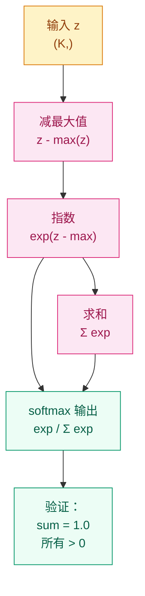

# Softmax 模块实现计划

> **For agentic workers:** REQUIRED SUB-SKILL: Use superpowers:subagent-driven-development (recommended) or superpowers:executing-plans to implement this plan task-by-task. Steps use checkbox (`- [ ]`) syntax for tracking.

**Goal:** 在 `00-Prerequisites/softmax/` 下新建 Softmax 与概率分布完整章节，并更新相邻模块的导航链接。

**Architecture:** 新建目录 `00-Prerequisites/softmax/`，包含 README.md（中文主文件）。遵循现有教学格式：问题从哪来 → 学习目标 → 直觉 → 机制 → 渐进式实现 → 工程陷阱 → 演进笔记 → 导航。

**Tech Stack:** Markdown（含 Mermaid 图）、Python/NumPy/PyTorch 代码示例、LaTeX 数学公式

**Design Spec:** `docs/superpowers/specs/2026-04-03-prerequisites-expansion-design.md` #1

**导航上下文：**
- 上一章：[深度学习基础](../deep-learning-basics/README.md)
- 下一章：[损失函数全景](../loss-functions/README.md)

---

### Task 1: 创建 softmax 目录和 README.md

**Files:**
- Create: `00-Prerequisites/softmax/README.md`

- [ ] **Step 1: 创建目录**

```bash
mkdir -p 00-Prerequisites/softmax
```

- [ ] **Step 2: 写入 README.md 完整内容**

写入 `00-Prerequisites/softmax/README.md`，遵循以下结构和内容要求：

```markdown
# 为什么多分类不能直接比大小？—— Softmax 与概率分布

## 这个问题从哪来

> 在二分类中，Sigmoid 把任意实数压到 (0,1) 区间，表示"属于正类的概率"。但如果有 10 个类别呢？直接输出 10 个数，它们加起来不等于 1，甚至可能出现负数——根本不是概率。softmax 就是解决这个问题的：它把任意一组实数变成一个合法的概率分布，总和恒为 1。
> softmax 后来成为注意力机制的基石——注意力权重本质上就是用 softmax 归一化的相似度分数。

## 学习目标

完成本章后，你应能回答：

1. softmax 的公式是什么，为什么它能保证输出是合法概率？
2. 温度参数 T 如何控制分布的"尖锐"或"平坦"？
3. 手写数值稳定的 softmax 时，为什么要减最大值？

---

## 1. 直觉

想象一场选秀节目。10 个选手各有一个原始分数（可能是任意实数），但评委需要给出一个"投票分配"——每个人得到一个百分比，加起来等于 100%。softmax 就是这套投票规则：原始分数越高的人分到的百分比越大，但每个人都至少分到一点（不会是零）。

与 Sigmoid 的关系：Sigmoid 是 softmax 的二元特例。对两个数 $z_1, z_2$ 做 softmax，$z_1$ 的概率恰好等于 $\sigma(z_1 - z_2)$。

> 你要记住：softmax 不是让最大的数更突出，而是把任意实数变成合法概率。它的力量在于"相对比较"——不是看绝对大小，而是看谁比谁大。

---

## 2. 机制

### 2.1 公式

对向量 $z = [z_1, z_2, \ldots, z_K]$：

$$
\text{softmax}(z_i) = \frac{e^{z_i}}{\sum_{j=1}^{K} e^{z_j}}
$$

性质：
- 所有输出 $> 0$（指数函数的值域）
- 所有输出之和 $= 1$（分母就是分子之和）
- 最大输入对应的输出最大，但不一定接近 1

### 2.2 与 Sigmoid 的关系

当 $K=2$ 时：

$$
\text{softmax}(z_1) = \frac{e^{z_1}}{e^{z_1} + e^{z_2}} = \frac{1}{1 + e^{-(z_1 - z_2)}} = \sigma(z_1 - z_2)
$$

Sigmoid 就是二分类 softmax（省略了平移不变性：给两个数同时加常数，softmax 输出不变）。

### 2.3 温度参数

引入温度 $T > 0$：

$$
\text{softmax}(z_i / T) = \frac{e^{z_i/T}}{\sum_{j} e^{z_j/T}}
$$

- $T \to 0$：分布趋向 one-hot（只有最大值对应的类得到概率 1）
- $T = 1$：标准 softmax
- $T \to \infty$：分布趋向均匀（所有类别概率相等）

应用：知识蒸馏用高温 $T$ 产生"软标签"，采样时用低温让分布更尖锐。

### 2.4 数值稳定性：log-sum-exp trick

直接计算 $e^{z_i}$ 可能溢出（$e^{1000} = \text{inf}$）。解决方案：减最大值。

$$
\text{softmax}(z_i) = \frac{e^{z_i - z_{\max}}}{\sum_{j} e^{z_j - z_{\max}}}
$$

数学上等价（分子分母同除以 $e^{z_{\max}}$），但指数的输入变成了 $z_i - z_{\max} \leq 0$，永远不会溢出。

相关概念 log-sum-exp：

$$
\text{LSE}(z) = \log \sum_j e^{z_j} = z_{\max} + \log \sum_j e^{z_j - z_{\max}}
$$

这是 softmax 分母的稳定计算方式，也常用于损失函数中避免数值溢出。



> 你要记住：实现 softmax 时永远先减最大值。不减的 softmax 在遇到大输入时会输出 NaN。

---

## 3. 渐进式实现

**Step 1 · 最小实现（纯 NumPy，验证核心逻辑）**

```python
import numpy as np

def softmax_naive(z):
    """未考虑数值稳定性的 softmax，仅用于理解"""
    exp_z = np.exp(z)
    return exp_z / exp_z.sum()

z = np.array([2.0, 1.0, 0.1])
print(f"输出: {softmax_naive(z)}")
print(f"总和: {softmax_naive(z).sum():.6f}")  # 应为 1.0
```

**Step 2 · 数值稳定版（减最大值）**

```python
import numpy as np

def softmax_stable(z):
    """数值稳定的 softmax：先减最大值"""
    z_shifted = z - np.max(z)
    exp_z = np.exp(z_shifted)
    return exp_z / exp_z.sum()

# 验证：大输入也不会溢出
z_big = np.array([1000.0, 1001.0, 999.0])
print(f"大输入 softmax: {softmax_stable(z_big)}")
# 对比 naive 版本：softmax_naive(z_big) 会输出 NaN
```

**Step 3 · 带温度参数的采样**

```python
import numpy as np

def softmax_with_temperature(z, T=1.0):
    """带温度参数的 softmax"""
    z_shifted = (z - np.max(z)) / T
    exp_z = np.exp(z_shifted)
    return exp_z / exp_z.sum()

z = np.array([2.0, 1.0, 0.1, -1.0])

for T in [0.1, 1.0, 5.0]:
    probs = softmax_with_temperature(z, T)
    print(f"T={T:.1f}: {probs}  (max={probs.max():.3f})")

# T=0.1: 近乎 one-hot，只选最大
# T=5.0: 趋向均匀分布
```

**Step 4 · PyTorch 版本与梯度验证**

```python
import torch

torch.manual_seed(42)

z = torch.tensor([2.0, 1.0, 0.1, -1.0], requires_grad=True)

# PyTorch 的 softmax
probs = torch.softmax(z, dim=0)
print(f"PyTorch softmax: {probs}")
print(f"总和: {probs.sum().item():.6f}")

# 验证梯度
probs.sum().backward()
print(f"梯度: {z.grad}")
# softmax 的 Jacobian 不是对角矩阵，
# 但 PyTorch autograd 会正确计算
```

---

## 4. 工程陷阱

1. **维度搞错**（最常见）
   现象：对 batch 数据 `(batch, K)` 做 softmax 时忘了指定 `dim=1`，默认沿 dim=0 做（样本间比较而非类别间比较）。
   处置：`torch.softmax(logits, dim=-1)` 或 `dim=1`，永远明确指定维度。

2. **log_softmax 比 log(softmax) 更好**
   现象：`torch.log(torch.softmax(z, dim=-1))` 可能出现 log(0) = -inf。
   处置：用 `torch.log_softmax(z, dim=-1)`，内部使用 log-sum-exp 技巧，数值更稳定。

3. **softmax 后再取 log 做交叉熵**
   现象：手动 `log(softmax(z))` 再算交叉熵，两次数值误差叠加。
   处置：直接用 `nn.CrossEntropyLoss()`，它等价于 `log_softmax + NLLLoss`，一步完成且更稳定。

4. **温度参数 T 的位置**
   现象：把 T 放在 softmax 外面（`softmax(z) / T`）而不是里面（`softmax(z/T)`）。
   处置：温度必须除在 logits 上再进 softmax。除在外面只是缩放了概率，不会改变分布形状。

> 你要记住：用 PyTorch 时，几乎所有需要 softmax 的地方都应该用 `log_softmax` 或 `CrossEntropyLoss`，而不是手动组合。

---

## 演进笔记

> **这一技术的遗产**：softmax 不只是分类器的输出层。在注意力机制中，QK^T 的相似度矩阵经过 softmax 变成注意力权重——本质上是在问"对于当前位置，其他每个位置应该分配多少注意力"。
>
> 温度参数后来成为知识蒸馏（Knowledge Distillation, Hinton 2015）的核心工具：教师模型用高温 T 输出软标签，传递"暗知识"（类间相似性）给学生模型。
>
> **留下的新问题**：softmax 在分类时只关心正确的类得分够不够高，但没有直接优化"错得有多离谱"——这引出了各种损失函数的设计。

→ 下一章：[损失函数全景 — 怎么量化"错得有多离谱"？](../loss-functions/README.md)

---

**上一章**：[深度学习基础](../deep-learning-basics/README.md) | **下一章**：[损失函数全景](../loss-functions/README.md)
```

- [ ] **Step 3: 验证文件结构**

```bash
ls -la 00-Prerequisites/softmax/
head -5 00-Prerequisites/softmax/README.md
```

Expected: 目录存在，README.md 开头为 `# 为什么多分类不能直接比大小？`

- [ ] **Step 4: 提交**

```bash
git add 00-Prerequisites/softmax/README.md
git commit -m "content: add softmax module — probability distributions, temperature, numerical stability"
```

---

### Task 2: 更新 deep-learning-basics 导航链接

**Files:**
- Modify: `00-Prerequisites/deep-learning-basics/README.md`（最后一行导航区）

- [ ] **Step 1: 将 deep-learning-basics 的"下一章"从 activation-functions 改为 softmax**

找到文件末尾的导航行：

```
**上一章**：[前置准备概览](../README.md) | **下一章**：[激活函数家族](../activation-functions/README.md)
```

替换为：

```
**上一章**：[前置准备概览](../README.md) | **下一章**：[Softmax 与概率分布](../softmax/README.md)
```

同时在"演进笔记"中，将 activation-functions 的交叉链接更新。找到：

```
> 激活函数为什么选 ReLU 而不是 Sigmoid？Dying ReLU 是什么？→ 详见 [激活函数家族](../activation-functions/README.md)
```

这行保留不变（它是概念性跳转，不是线性导航）。

找到文末的：

```
→ 下一章：[正则化与 Dropout — 为什么模型会"死记硬背"？](../regularization/README.md)
```

替换为：

```
→ 下一章：[Softmax 与概率分布 — 为什么多分类不能直接比大小？](../softmax/README.md)
```

- [ ] **Step 2: 提交**

```bash
git add 00-Prerequisites/deep-learning-basics/README.md
git commit -m "nav: update deep-learning-basics next link to softmax"
```
