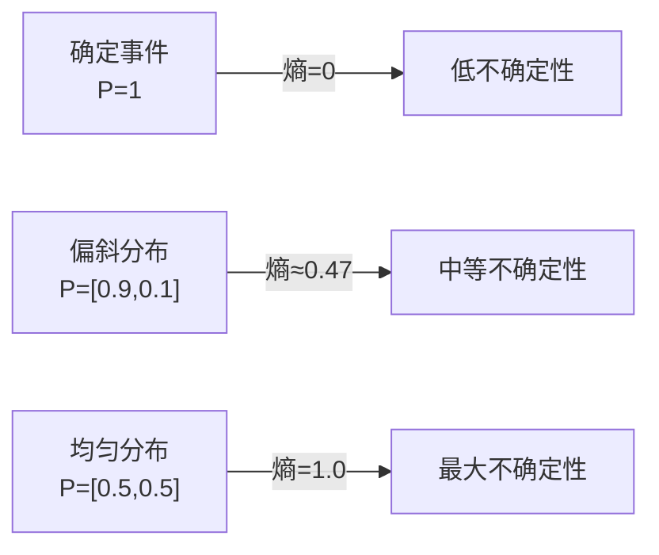

# 00-Prerequisites 缺口模块实施计划

> **For agentic workers:** REQUIRED SUB-SKILL: Use superpowers:subagent-driven-development (recommended) or superpowers:executing-plans to implement this plan task-by-task. Steps use checkbox (`- [ ]`) syntax for tracking.

**Goal:** 为 00-Prerequisites 新增 3 个前置模块（概率与信息论、线性代数、学习率调度），填补下游 Phase 01-05 反复引用但未铺垫的概念缺口。

**Architecture:** 3 个新 Markdown 文件 + 更新 3 个现有文件（README.md、Timeline、已有模块导航链接）。每个新模块遵循现有教学格式：问题从哪来 → 学习目标 → 直觉 → 机制 → 渐进式实现 → 工程陷阱 → 演进笔记 → 导航。

**Tech Stack:** Markdown + LaTeX (KaTeX) + Mermaid 图表 + Python 代码块（NumPy / PyTorch）

---

## 文件结构

| 文件 | 操作 | 职责 |
|------|------|------|
| `00-Prerequisites/probability-information-theory/README.md` | 新建 ~450 行 | 概率与信息论模块 #0 |
| `00-Prerequisites/linear-algebra/README.md` | 新建 ~300 行 | 线性代数模块 #2 |
| `00-Prerequisites/optimization-scheduling/README.md` | 新建 ~300 行 | 学习率调度模块 #6 |
| `00-Prerequisites/README.md` | 修改 | 重编号 #0-#16、更新分组/阅读顺序/时间线 |
| `00-Timeline/README.md` | 修改 | 补充 1948 Shannon 信息论条目 |
| `00-Prerequisites/deep-learning-basics/README.md` | 修改导航 | 下一章从 softmax 改为 linear-algebra |
| `00-Prerequisites/softmax/README.md` | 修改导航 | 上一章从 deep-learning-basics 改为 linear-algebra |
| `00-Prerequisites/loss-functions/README.md` | 修改导航 | 无需变更（前后指向不变） |
| `00-Prerequisites/backpropagation/README.md` | 修改导航 | 下一章从 normalization 改为 optimization-scheduling |
| `00-Prerequisites/normalization/README.md` | 修改导航 | 上一章从 backpropagation 改为 optimization-scheduling |

### 新模块阅读顺序（最终）

```
#0  概率与信息论（新增）
  → #1  深度学习基础（已有）
    → #2  线性代数基础（新增）
    → #3  Softmax（已有）
      → #4  损失函数（已有）
        → #5  反向传播（已有）
          → #6  学习率调度（新增）
          → #7  归一化（已有）
          → #8  残差连接（已有）
          → #9  激活函数（已有）
          → #10 正则化（已有）
            → #11-#16 已有
```

---

### Task 1: 创建概率与信息论模块 (#0)

**Files:**
- Create: `00-Prerequisites/probability-information-theory/README.md`

- [ ] **Step 1: 写模块文件（~450 行）**

内容结构遵循现有模块格式（参考 softmax/README.md 和 loss-functions/README.md 的写法）：

```markdown
# 交叉熵从哪来？—— 概率与信息论基础

## 这个问题从哪来

> 在前面的模块中，你已经见过交叉熵损失、KL 散度、最大似然估计这些术语——它们在损失函数、Softmax、正则化中反复出现，但从未被系统解释过。
> 这些概念不是深度学习的发明，而是来自 18-20 世纪的概率论与信息论。理解它们的来源，才能真正理解"模型在优化什么"。

## 学习目标

完成本章后，你应能回答：

1. 交叉熵为什么能用来做分类损失？
2. KL 散度衡量的是什么，为什么它不对称？
3. 最大似然估计和最小化交叉熵为什么是同一件事？

---

## 1. 直觉

想象你是一个气象预报员。每天你要预测"明天下雨的概率是多少"。

- **信息熵**衡量的是天气本身的不确定性——如果当地一年 365 天都下雨，熵就低（很好预测）；如果晴雨各半，熵就高（很难预测）。
- **交叉熵**衡量的是你的预报和实际天气的差距——你说明天 90% 下雨，结果真下了，交叉熵低；你说 10% 下雨，结果下了，交叉熵高。
- **KL 散度**衡量的是"用你的预报代替真实天气分布，要多付多少代价"。

> 你要记住：信息论不是关于"信息量有多大"，而是关于"不确定性有多少、你的预测有多准"。

---

## 2. 机制

### 2.1 概率基础

**随机变量**：取值由随机试验决定的变量。离散型（骰子点数）和连续型（身高体重）。

**概率分布**：每个取值对应一个概率。
- 离散：P(X=x)，所有概率之和 = 1
- 连续：f(x)，积分 = 1

**期望与方差**：
$$E[X] = \sum_x x \cdot P(X=x) \quad \text{（离散）}$$
$$\text{Var}(X) = E[(X - E[X])^2] = E[X^2] - (E[X])^2$$

**常见分布速览**：

| 分布 | 公式 | 直觉 | 深度学习中的角色 |
|------|------|------|----------------|
| 伯努利 | P(X=1)=p, P(X=0)=1-p | 硬币翻转 | 二分类标签 |
| 均匀 | f(x)=1/(b-a) | 所有值等可能 | 权重初始化的起点 |
| 高斯 | f(x)=(1/√2πσ²)e^{-(x-μ)²/2σ²} | 钟形曲线 | 权重初始化、VAE 潜空间、噪声模型 |

> 高斯分布在深度学习中无处不在：He/Xavier 初始化假设权重服从高斯分布，VAE 的潜空间被约束为标准高斯，加噪扩散模型的核心也是高斯噪声。

### 2.2 贝叶斯定理

**条件概率 → 联合概率 → 贝叶斯公式**：

$$P(A|B) = \frac{P(B|A) \cdot P(A)}{P(B)}$$

四个关键概念（"医学检测"类比）：

| 概念 | 符号 | 类比 |
|------|------|------|
| 先验 | P(A) | 患病率：检测之前的信念 |
| 似然 | P(B\|A) | 检测灵敏度：患病时检出阳性的概率 |
| 后验 | P(A\|B) | 检测阳性后真正患病的概率 |
| 证据 | P(B) | 检测阳性的总概率 |

**深度学习中的体现**：
- L2 正则化 = 假设权重服从高斯先验的 MAP 估计（详见正则化模块）
- 贝叶斯神经网络：对权重的不确定性建模，而非取点估计

### 2.3 信息熵

**直觉**："描述一个随机变量平均需要多少比特"。

$$H(X) = -\sum_{x} P(x) \log P(x)$$

性质：
- 熵越大，不确定性越高
- 均匀分布有最大熵（每个结果等可能，最难预测）
- 确定事件（P=1）的熵为 0



**最大熵原理**：在满足约束的所有分布中，选择熵最大的那个——因为你不想做没有证据的假设。

### 2.4 交叉熵与 KL 散度

**交叉熵**：用分布 q 编码来自分布 p 的数据，平均需要多少比特。

$$H(p, q) = -\sum_{x} P(x) \log Q(x)$$

与熵的关系：
$$H(p, q) = H(p) + D_{KL}(p \| q)$$

**KL 散度**："用 q 近似 p，要多付出多少编码代价"。

$$D_{KL}(p \| q) = \sum_{x} P(x) \log \frac{P(x)}{Q(x)} = H(p, q) - H(p)$$

关键性质：
- 非负性：$D_{KL}(p \| q) \geq 0$，等号成立当且仅当 p = q
- **非对称性**：$D_{KL}(p \| q) \neq D_{KL}(q \| p)$

**Forward vs Reverse KL 直觉**：

| | Forward KL: $D_{KL}(p \| q)$ | Reverse KL: $D_{KL}(q \| p)$ |
|---|------|------|
| 行为 | q 要覆盖 p 的所有模式 | q 找 p 的一个模式集中拟合 |
| 结果 | 倾向于"宁滥勿缺" | 倾向于"宁缺勿滥" |
| 应用 | 变分推断（VAE） | 知识蒸馏、强化学习 |

> 链接损失函数：交叉熵损失 $L = -\sum y_k \log \hat{y}_k$ 正是 $H(y, \hat{y})$，模型在学习让预测分布 $\hat{y}$ 尽量接近真实分布 $y$。

### 2.5 最大似然估计

**核心思想**：找到让观测数据出现概率最大的参数。

$$\hat{\theta}_{MLE} = \arg\max_{\theta} P(D|\theta) = \arg\max_{\theta} \prod_{i=1}^{N} P(x_i|\theta)$$

取对数（乘积变求和，方便优化）：

$$\hat{\theta}_{MLE} = \arg\max_{\theta} \sum_{i=1}^{N} \log P(x_i|\theta)$$

**与交叉熵的等价性**：对分类问题，最大化似然 = 最小化交叉熵。

$$\max \sum \log P(y_i|x_i, \theta) \iff \min -\sum \log P(y_i|x_i, \theta) = \min H(y, \hat{y})$$

这就是为什么交叉熵能做分类损失——它不是凭空设计的，而是最大似然估计的自然结果。

**MAP 估计**：加先验，正则化的概率解释：

$$\hat{\theta}_{MAP} = \arg\max_{\theta} [\log P(D|\theta) + \log P(\theta)]$$

如果先验 $P(\theta)$ 是高斯分布，$\log P(\theta)$ 恰好是 L2 正则化项。**正则化 = 你在用先验知识约束模型**。

### 2.6 互信息

$$I(X; Y) = H(X) - H(X|Y) = D_{KL}(p(x,y) \| p(x)p(y))$$

**直觉**："知道 Y 之后，X 的不确定性减少了多少"。

- 如果 X 和 Y 独立，$I(X;Y) = 0$（知道 Y 对 X 没帮助）
- 如果 X = Y，$I(X;Y) = H(X)$（完全确定）

**应用**：
- 特征选择：选与标签互信息最高的特征
- InfoNCE 对比损失：最大化查询和正样本键之间的互信息（链接损失函数模块）

---

## 3. 渐进式实现

**Step 1 · 纯 NumPy 实现信息熵、交叉熵、KL 散度**

```python
import numpy as np

def entropy(p):
    """信息熵 H(p)"""
    p = np.clip(p, 1e-10, 1.0)  # 避免 log(0)
    return -np.sum(p * np.log2(p))

def cross_entropy(p, q):
    """交叉熵 H(p, q)"""
    q = np.clip(q, 1e-10, 1.0)
    return -np.sum(p * np.log2(q))

def kl_divergence(p, q):
    """KL 散度 D_KL(p || q)"""
    q = np.clip(q, 1e-10, 1.0)
    return np.sum(p * np.log2(p / q))

# 示例：天气分布
p_true = np.array([0.7, 0.3])   # 真实分布：70% 下雨
q_pred = np.array([0.8, 0.2])   # 预测分布：80% 下雨
q_bad  = np.array([0.2, 0.8])   # 差的预测：20% 下雨

print(f"H(p)      = {entropy(p_true):.4f} bits")
print(f"H(p, q)   = {cross_entropy(p_true, q_pred):.4f} bits")
print(f"H(p, q_bad) = {cross_entropy(p_true, q_bad):.4f} bits")
print(f"D_KL(p||q) = {kl_divergence(p_true, q_pred):.4f}")
print(f"D_KL(p||q_bad) = {kl_divergence(p_true, q_bad):.4f}")
# 差的预测 q_bad 有更高的交叉熵和 KL 散度
```

**Step 2 · MLE 拟合高斯分布**

```python
import numpy as np

np.random.seed(42)

# 从真实高斯分布采样
true_mu, true_sigma = 5.0, 2.0
data = np.random.normal(true_mu, true_sigma, size=1000)

# MLE 估计：μ 的 MLE 是样本均值，σ 的 MLE 是样本标准差
mu_mle = np.mean(data)
sigma_mle = np.std(data)  # 注意：MLE 用的是 1/N 而非 1/(N-1)

print(f"真实参数: μ={true_mu}, σ={true_sigma}")
print(f"MLE 估计: μ={mu_mle:.4f}, σ={sigma_mle:.4f}")
# 样本量越大，MLE 越接近真实值
```

**Step 3 · PyTorch 对接 `F.cross_entropy`**

```python
import torch
import torch.nn.functional as F

# 模型输出 logits（未经过 softmax）
logits = torch.tensor([[2.0, 1.0, 0.1]])

# 真实标签
labels = torch.tensor([0])  # 正确类别是第 0 类

# PyTorch 的 CrossEntropyLoss = log_softmax + NLLLoss
loss = F.cross_entropy(logits, labels)
print(f"CrossEntropy loss: {loss.item():.4f}")

# 手动验证：先 softmax 再取负对数
probs = F.softmax(logits, dim=-1)
manual_loss = -torch.log(probs[0, labels[0]])
print(f"手动计算: {manual_loss.item():.4f}")
# 两者应该一致（PyTorch 内部用 log-sum-exp 更稳定）
```

---

## 4. 工程陷阱（按严重度排序）

1. **log(0) 导致 NaN**
   现象：概率为 0 时 log(0) = -inf，后续计算产生 NaN。
   处置：始终加 epsilon clip，`np.clip(p, 1e-10, 1.0)`。PyTorch 的 `F.cross_entropy` 内部已处理。

2. **KL 散度非对称性搞反**
   现象：VAE 训练中用反了 forward/reverse KL，导致生成质量崩塌。
   处置：VAE 用 reverse KL（模型去覆盖数据的模式），知识蒸馏用 forward KL（学生去覆盖教师的分布）。

3. **浮点精度下熵计算失真**
   现象：概率极小时 log 溢出，FP16 尤甚。
   处置：用 log_softmax 代替 log(softmax)，数值更稳定。FP16 下特别注意。
   → 详见 [数值精度](../numerical-precision/README.md)

4. **MLE 过拟合理解偏差**
   现象：认为 MLE 一定最优，忽略它在小样本下严重过拟合。
   处置：MLE 在数据量充足时是渐近无偏的，但小数据下需要 MAP（加先验）来正则化。
   → 详见 [正则化](../regularization/README.md)

---

## 演进笔记

> **概率与信息论的遗产**：Shannon 在 1948 年建立信息论时，想解决的是通信中的编码效率问题。但交叉熵和 KL 散度后来成了深度学习损失函数的数学基础——这完全超出了他的原始设想。
>
> MLE = 最小化交叉熵这一等价性，把"概率建模"和"神经网络训练"统一在了同一个框架下。你不需要同时记两套理论——它们是同一件事的不同表述。
>
> **留下的新问题**：交叉熵衡量了"预测有多准"，但模型输出的是原始分数（logits），不是概率——怎么把 logits 变成概率？这引出了 Softmax。

→ 下一章：[深度学习基础 — 为什么线性模型不够用了？](../deep-learning-basics/README.md)

---

**上一章**：[前置准备概览](../README.md) | **下一章**：[深度学习基础](../deep-learning-basics/README.md)
```

- [ ] **Step 2: 确认文件内容无占位符**

检查文件中无 TBD、TODO、填空等占位内容。所有公式、代码、交叉引用均完整。

---

### Task 2: 创建线性代数模块 (#2)

**Files:**
- Create: `00-Prerequisites/linear-algebra/README.md`

- [ ] **Step 1: 写模块文件（~300 行）**

```markdown
# 为什么深度学习离不开矩阵乘法？—— 线性代数基础

## 这个问题从哪来

> 上一章我们构建了神经网络：输入 x 经过权重矩阵 W 变换，加上偏置 b，再经过激活函数。这个 `y = Wx + b` 看起来简单，但它到底在做什么？为什么用矩阵而不是用标量？
> 答案是：矩阵乘法是"批量线性变换"的数学语言。神经网络的每一层，本质上都在对数据做一次线性变换 + 非线性扭曲。不理解矩阵在做什么，就只能把神经网络当黑盒用。

## 学习目标

完成本章后，你应能回答：

1. 矩阵乘法的几何意义是什么？
2. 为什么注意力机制里需要转置（QK^T）？
3. SVD 分解在深度学习中有什么用？

---

## 1. 直觉

矩阵就是一个"变换规则"。

想象平面上有一组点，矩阵乘法可以把它们**旋转、缩放、拉伸或投影**。2×2 矩阵作用在 2 维向量上，就像一个函数作用在数字上——输入一个向量，输出另一个向量。

深度学习中的每一层 $y = Wx + b$，就是用矩阵 $W$ 对输入 $x$ 做一次空间变换，再加上偏置 $b$ 平移原点。多层叠加后，原本混在一起的数据就被"拧"到了可分的状态。

> 你要记住：矩阵不是一堆数字的排列，它是空间变换的压缩表示。理解了这一点，矩阵乘法的规则就不再是死记硬背。

---

## 2. 机制

### 2.1 向量与矩阵基础

**向量**：有方向和大小的对象。在深度学习中，一个词的 embedding、一个样本的特征，都是向量。

**矩阵乘法**：行看列规则。$(m,n) \times (n,p) \rightarrow (m,p)$——中间维度必须匹配。

```python
import numpy as np

A = np.array([[1, 2], [3, 4]])    # (2, 2)
B = np.array([[5, 6], [7, 8]])    # (2, 2)
C = A @ B                          # (2, 2) 矩阵乘法
D = A * B                          # (2, 2) 逐元素乘法（完全不同！）

print(f"A @ B = \n{C}")
print(f"A * B = \n{D}")
```

> **常见错误**：`*` 是逐元素乘法，`@` 或 `np.matmul` 才是矩阵乘法。两者结果完全不同！

**转置**：$A^T$ 把行列互换。$(AB)^T = B^T A^T$——转置后乘法顺序要反转。

**单位矩阵** $I$：任何矩阵乘以 $I$ 不变（矩阵乘法中的"1"）。

### 2.2 矩阵乘法 = 线性变换

矩阵乘法的几何直觉：

| 2×2 矩阵 | 效果 |
|----------|------|
| $\begin{pmatrix} \cos\theta & -\sin\theta \\ \sin\theta & \cos\theta \end{pmatrix}$ | 旋转 θ 度 |
| $\begin{pmatrix} 2 & 0 \\ 0 & 0.5 \end{pmatrix}$ | x 方向拉伸 2 倍，y 方向压缩一半 |
| $\begin{pmatrix} 1 & 0 \\ 0 & 0 \end{pmatrix}$ | 投影到 x 轴（丢失 y 信息） |

**神经网络中每一层的本质**：
$$y = \sigma(Wx + b)$$

- $Wx$：线性变换（旋转 + 缩放 + 投影）
- $+ b$：平移
- $\sigma$：非线性扭曲

全连接层就是矩阵乘法。卷积的底层也可以用矩阵运算实现（im2col 把局部区域展开成行，卷积变成一次矩阵乘法）。

### 2.3 范数

范数是"向量大小"的度量。

| 范数 | 公式 | 直觉 | 深度学习中的应用 |
|------|------|------|----------------|
| L1 | $\|x\|_1 = \sum \|x_i\|$ | 曼哈顿距离 | LASSO 正则化（稀疏性） |
| L2 | $\|x\|_2 = \sqrt{\sum x_i^2}$ | 欧几里得距离 | 权重衰减、梯度裁剪 |
| L∞ | $\|x\|_\infty = \max \|x_i\|$ | 最大绝对值 | 按值梯度裁剪 |

**余弦相似度**：衡量方向而非大小。

$$\text{cos\_sim}(a, b) = \frac{a \cdot b}{\|a\| \|b\|}$$

值域 [-1, 1]：1 表示同向，0 表示正交，-1 表示反向。

> 在对比学习（CLIP、SimCLR）中，余弦相似度是衡量样本相似性的标准方式。
> → 详见 [损失函数](../loss-functions/README.md)

### 2.4 特征值与 SVD

**特征值/特征向量**的直觉：矩阵 $A$ 作用在向量 $v$ 上，如果结果只是 $v$ 的缩放（$Av = \lambda v$），那么 $v$ 就是特征向量，$\lambda$ 是特征值——"这个方向被放大/缩了多少倍"。

**SVD（奇异值分解）**：$A = U\Sigma V^T$

直觉：把任意矩阵拆成"旋转 → 缩放 → 旋转"三步。

- $V^T$：先旋转到特殊坐标系
- $\Sigma$：在各方向上缩放（奇异值）
- $U$：再旋转到目标坐标系

应用：
- **降维**：只保留前 k 个奇异值，近似原矩阵，丢失的信息最少
- **推荐系统**：协同过滤中用 SVD 做矩阵补全
- **LoRA 预告**：LoRA 的低秩分解思想本质上就是 SVD 的近似——只学最重要的方向
  → 详见 [数值精度](../numerical-precision/README.md)

### 2.5 广播机制

NumPy/PyTorch 的广播规则：从右往左对齐维度，尾部维度必须相同或为 1。

```
(3, 1) + (1, 4) → (3, 4)  ✓ 尾部 1 和 4 中，1 可以广播
(3,)   + (4,)   → 报错     ✗ 尾部 3 ≠ 4
(3, 1) + (4,)   → (3, 4)  ✓ (4,) 从右对齐到 (1, 4)，再广播
```

常见场景：
- batch 数据加偏置：`(B, D) + (D,)` → `(B, D)`
- 注意力 mask：`(B, 1, T) + (1, T, T)` → `(B, T, T)`

```python
import numpy as np

# batch 加偏置
x = np.random.randn(32, 64)    # batch=32, dim=64
b = np.random.randn(64)        # 偏置
result = x + b                  # (32, 64) + (64,) → (32, 64)

# 注意力 mask
mask = np.tril(np.ones((8, 8)))  # (8, 8) 下三角
batch_mask = mask[np.newaxis, :, :]  # (1, 8, 8)
```

---

## 3. 渐进式实现

**Step 1 · 纯 NumPy 手写矩阵乘法**

```python
import numpy as np
import time

def matmul_naive(A, B):
    """三重循环矩阵乘法，仅用于理解算法"""
    m, n = A.shape
    n2, p = B.shape
    assert n == n2
    C = np.zeros((m, p))
    for i in range(m):
        for j in range(p):
            for k in range(n):
                C[i, j] += A[i, k] * B[k, j]
    return C

A = np.random.randn(100, 200)
B = np.random.randn(200, 150)

start = time.time()
C1 = matmul_naive(A, B)
t1 = time.time() - start

start = time.time()
C2 = A @ B
t2 = time.time() - start

print(f"三重循环: {t1:.3f}s")
print(f"NumPy @:  {t2:.6f}s")
print(f"结果一致: {np.allclose(C1, C2)}")
# NumPy 比三重循环快几千到几万倍（向量化 + BLAS 优化）
```

**Step 2 · 线性变换可视化**

```python
import numpy as np
import matplotlib.pyplot as plt

# 生成单位圆上的一组点
theta = np.linspace(0, 2 * np.pi, 100)
points = np.array([np.cos(theta), np.sin(theta)])  # (2, 100)

# 定义变换矩阵
transforms = {
    "旋转 45°": np.array([[0.707, -0.707], [0.707, 0.707]]),
    "缩放":     np.array([[2.0, 0], [0, 0.5]]),
    "剪切":     np.array([[1, 0.5], [0, 1]]),
}

fig, axes = plt.subplots(1, 4, figsize=(16, 4))
axes[0].plot(points[0], points[1], 'b-')
axes[0].set_title("原始单位圆")
axes[0].set_aspect('equal')
axes[0].grid(True)

for ax, (name, T) in zip(axes[1:], transforms.items()):
    transformed = T @ points
    ax.plot(transformed[0], transformed[1], 'r-')
    ax.set_title(name)
    ax.set_aspect('equal')
    ax.grid(True)
    ax.set_xlim(-2.5, 2.5)
    ax.set_ylim(-2.5, 2.5)

plt.tight_layout()
plt.savefig("linear_transforms.png", dpi=150)
plt.show()
```

**Step 3 · SVD 降维示例**

```python
import numpy as np
import matplotlib.pyplot as plt
from PIL import Image

# 加载灰度图（或用随机矩阵代替）
img = np.random.rand(64, 64)  # 替换为真实图片时用 Image.open().convert('L')
U, S, Vt = np.linalg.svd(img, full_matrices=False)

# 用前 k 个奇异值重建
fig, axes = plt.subplots(1, 5, figsize=(20, 4))
for i, k in enumerate([1, 5, 10, 20, 50]):
    reconstructed = U[:, :k] @ np.diag(S[:k]) @ Vt[:k, :]
    axes[i].imshow(reconstructed, cmap='gray')
    axes[i].set_title(f'k={k} (保留 {S[:k].sum()/S.sum():.0%} 能量)')
    axes[i].axis('off')

plt.tight_layout()
plt.savefig("svd_reconstruction.png", dpi=150)
plt.show()
# k 越大，保留信息越多。LoRA 的思路类似：只学最重要的方向。
```

---

## 4. 工程陷阱（按严重度排序）

1. **矩阵乘法 vs 逐元素乘法混淆**（最常见）
   现象：`A * B`（逐元素）和 `A @ B`（矩阵乘法）搞混，维度对不上或结果错误。
   处置：`*` 是逐元素，`@` 或 `torch.matmul` 是矩阵乘法，永远不要混淆。

2. **维度不匹配**
   现象：`(B, D)` 和 `(D, K)` 相乘搞反顺序。
   处置：记住"中间维度必须相同"，`(m,n) @ (n,p)` → `(m,p)`。

3. **转置忘记导致形状错误**
   现象：注意力计算中 QK^T 写成 QK，维度报错。
   处置：注意力里相似度计算一定是 `Q @ K.T`，转置不可省略。
   → 详见 [注意力机制](../attention-primer/README.md)

4. **广播机制理解错误**
   现象：以为 `(3,) + (4,)` 能广播，实际报错。
   处置：广播从右往左对齐，尾部维度必须相同或为 1。

---

## 演进笔记

> **线性代数的遗产**：深度学习的几乎所有操作都可以归结为矩阵乘法——全连接层是矩阵乘法，卷积可以展开成矩阵乘法，注意力也是矩阵乘法（QK^T）。GPU 之所以适合深度学习，正是因为它能极快地做矩阵运算。
>
> SVD 和低秩分解的思想后来直接启发了 LoRA：不用微调全部参数，只在低秩子空间中学习变化量，参数量减少 1000 倍。
>
> **留下的新问题**：我们已经有了"把输入变换成分数"的能力（线性变换），但这些分数还不是概率——怎么把任意实数变成合法的概率分布？这引出了 Softmax。

→ 下一章：[Softmax 与概率分布 — 为什么多分类不能直接比大小？](../softmax/README.md)

---

**上一章**：[深度学习基础](../deep-learning-basics/README.md) | **下一章**：[Softmax 与概率分布](../softmax/README.md)
```

- [ ] **Step 2: 确认文件内容无占位符**

---

### Task 3: 创建学习率调度模块 (#6)

**Files:**
- Create: `00-Prerequisites/optimization-scheduling/README.md`

- [ ] **Step 1: 写模块文件（~300 行）**

```markdown
# 学习率怎么变才能又快又稳？—— 调度与梯度控制

## 这个问题从哪来

> 上一章我们学了反向传播和优化器（SGD、Adam），它们回答了"往哪走"的问题。但还有一个关键变量：**走多大的步**？
> 固定学习率有一个根本矛盾：初期需要大步快速探索，后期需要小步精细调优。如果全程用同一个学习率，要么前期太慢，要么后期震荡。
> 学习率调度就是解决这个矛盾的——让学习率在训练过程中按策略变化。

## 学习目标

完成本章后，你应能回答：

1. 为什么 Transformer 训练必须用 warmup？
2. Cosine Decay 比 Step Decay 好在哪？
3. Gradient Clipping 的按范数和按值裁剪有什么区别？

---

## 1. 直觉

学习率是"步幅"。

- **太大**：在最优解附近来回跳，永远到不了
- **太小**：收敛极慢，训练到天荒地老
- **刚好**：快速收敛到最优解附近

但"刚好"不是一个固定值——它是训练过程中不断变化的。就像登山：山脚可以大步跑（大学习率），接近山顶要小步挪（小学习率），否则会冲过头。

> 你要记住：学习率调度不是"锦上添花"，而是训练稳定性的核心组件。Transformer 的论文证明，没有 warmup 的训练直接崩溃。

---

## 2. 机制

### 2.1 为什么学习率需要变化

```
Loss
 │  ╲
 │    ╲  ← 初期：loss 很高，需要大学习率快速下降
 │      ╲
 │        ╲___
 │            ╲___ ← 后期：接近最优解，需要小学习率精细调整
 │                ───
 └──────────────────── Steps
```

固定学习率的根本问题：
- 初期梯度大、方向明确，大学习率效率高
- 后期梯度小、在最优解附近波动，大学习率导致震荡

### 2.2 学习率调度策略

**Step Decay**：每隔 N 个 epoch 乘以 γ（如 ×0.1）

```python
# 每 30 个 epoch 学习率减半
lr = base_lr * (0.5 ** (epoch // 30))
```

简单粗暴，但有"台阶"导致梯度突变——模型在台阶处突然减速，可能跳过更好的解。

**Cosine Annealing**：学习率沿余弦曲线从初始值降到最低值

$$\eta_t = \eta_{\min} + \frac{1}{2}(\eta_{\max} - \eta_{\min})(1 + \cos(\frac{\pi t}{T}))$$

```python
import numpy as np
import matplotlib.pyplot as plt

T = 100  # 总步数
eta_max, eta_min = 0.1, 0.001
t = np.arange(T)
lr_cosine = eta_min + 0.5 * (eta_max - eta_min) * (1 + np.cos(np.pi * t / T))
lr_step = eta_max * (0.5 ** (t // 25))

plt.figure(figsize=(10, 4))
plt.plot(t, lr_cosine, label="Cosine Annealing")
plt.plot(t, lr_step, label="Step Decay (×0.5 per 25)")
plt.xlabel("Epoch")
plt.ylabel("Learning Rate")
plt.legend()
plt.title("Cosine vs Step Decay")
plt.tight_layout()
plt.savefig("lr_schedules.png", dpi=150)
plt.show()
```

为什么 cosine 比 step decay 更受欢迎：
- 平滑变化，没有梯度突变
- 初期下降快，后期下降慢，符合"粗调→精调"直觉
- 配合 warmup 使用效果最佳

**Warmup**：训练初期从很小的学习率线性升到目标值。

```python
# 线性 warmup
if step < warmup_steps:
    lr = base_lr * (step / warmup_steps)
else:
    lr = base_lr  # 之后由其他 scheduler 接管
```

**为什么 Transformer 需要 warmup？**

Adam 的自适应学习率统计量（一阶矩 m、二阶矩 v）在训练初期估计不准确。如果此时学习率太大，不准确的自适应缩放会导致参数更新方向偏差巨大，训练直接崩溃（loss NaN 或飞升）。

warmup 让模型在统计量稳定之前"小步走"，等估计准确了再加速。

**常见组合**：线性 warmup + cosine decay——先升后降，Transformer 训练的标准配置。

**One-Cycle Policy**：先升后降，单周期完成训练。Smith (2017) 提出，训练效率高于传统调度。

**ReduceOnPlateau**：验证 loss 停滞时自动降低学习率。适合微调场景，不需要手动设衰减策略。

### 2.3 梯度裁剪

**Gradient Clipping by Norm**：梯度向量的 L2 范数超过阈值时等比缩放。

$$\text{if } \|g\| > \text{max\_norm}: \quad g = g \times \frac{\text{max\_norm}}{\|g\|}$$

- 保持梯度方向不变，只缩放大小
- RNN/LSTM 训练的标准操作（BPTT 梯度爆炸对策）
- 常用阈值：`max_norm = 1.0`

```python
import torch.nn as nn

# PyTorch 一行搞定
nn.utils.clip_grad_norm_(model.parameters(), max_norm=1.0)
```

**Gradient Clipping by Value**：每个梯度分量截断到 [-v, v]。

```python
nn.utils.clip_grad_value_(model.parameters(), clip_value=0.5)
```

- 更简单但**改变了梯度方向**（不同分量被裁剪的程度不同）
- 通常不如按范数裁剪

| 方式 | 保持方向 | 适用场景 |
|------|---------|---------|
| 按范数 | 是 | NLP 任务（RNN、Transformer） |
| 按值 | 否 | 简单场景，CV 任务偶尔使用 |

### 2.4 优化器进阶

**AdamW**：权重衰减从梯度更新中解耦。

Adam + L2 正则化 ≠ 真正的权重衰减。因为 Adam 的自适应学习率会改变 L2 项的实际效果——被大幅缩放的参数，其正则化效果也被缩放了。

AdamW 把 weight decay 直接乘在权重上，不经过梯度：

```python
# Adam：L2 正则化通过梯度传递（被自适应学习率干扰）
loss = original_loss + weight_decay * (param ** 2).sum()
loss.backward()
optimizer.step()

# AdamW：权重衰减直接作用于参数（不经过梯度）
# PyTorch 的 AdamW 内部实现：
param.data = param.data * (1 - lr * weight_decay)  # 直接衰减
param.data = param.data - lr * m_hat / (sqrt(v_hat) + eps)  # 再做 Adam 更新
```

> AdamW 是 Transformer 训练的事实标准。几乎所有大语言模型预训练都用 AdamW。

**LAMB（Layer-wise Adaptive Moments）**：解决大 batch 训练的问题。

当 batch size 从 256 增加到 8192 时，Adam 会发散。LAMB 在 Adam 的基础上加了一层"层级别"的自适应缩放，让大 batch 训练也能稳定。

**Lookahead（"Lazy Adam"）**：维护两组权重——快权重（频繁更新）和慢权重（偶尔同步），减少优化器的方差。

### 2.5 训练配置速查

| 场景 | 优化器 | 调度策略 | 典型学习率 |
|------|--------|---------|-----------|
| Transformer 预训练 | AdamW | 线性 warmup (1-5% steps) + cosine decay | 1e-4 ~ 3e-4 |
| CNN 训练 | SGD + Momentum (0.9) | Step Decay | 0.1 → 0.01 → 0.001 |
| Transformer 微调 | AdamW | 短 warmup + 少量 epoch | 1e-5 ~ 5e-5 |
| LLM 微调 (LoRA) | AdamW | 无 warmup 或极短 warmup | 1e-4 ~ 3e-4 |

> 微调学习率通常是预训练的 1/10 到 1/100。太大导致灾难性遗忘。

---

## 3. 渐进式实现

**Step 1 · 手写 Cosine Decay 调度器**

```python
import numpy as np
import matplotlib.pyplot as plt

def cosine_schedule(total_steps, eta_max=0.1, eta_min=1e-4, warmup_steps=0):
    """线性 warmup + cosine decay"""
    lrs = []
    for t in range(total_steps):
        if t < warmup_steps:
            lr = eta_max * t / warmup_steps
        else:
            progress = (t - warmup_steps) / (total_steps - warmup_steps)
            lr = eta_min + 0.5 * (eta_max - eta_min) * (1 + np.cos(np.pi * progress))
        lrs.append(lr)
    return np.array(lrs)

steps = 1000
fig, axes = plt.subplots(1, 3, figsize=(15, 4))

# 纯 cosine
axes[0].plot(cosine_schedule(steps))
axes[0].set_title("纯 Cosine Decay")

# warmup + cosine
axes[1].plot(cosine_schedule(steps, warmup_steps=50))
axes[1].set_title("50 步 Warmup + Cosine")

# 不同 warmup 长度
for wp in [0, 50, 100, 200]:
    axes[2].plot(cosine_schedule(steps, warmup_steps=wp), label=f"warmup={wp}")
axes[2].legend()
axes[2].set_title("不同 Warmup 长度对比")

for ax in axes:
    ax.set_xlabel("Step")
    ax.set_ylabel("Learning Rate")
plt.tight_layout()
plt.savefig("cosine_schedules.png", dpi=150)
plt.show()
```

**Step 2 · PyTorch lr_scheduler 验证**

```python
import torch
import torch.nn as nn
import torch.optim as optim

model = nn.Linear(10, 1)
optimizer = optim.AdamW(model.parameters(), lr=0.1)

# CosineAnnealingLR
scheduler = optim.lr_scheduler.CosineAnnealingLR(optimizer, T_max=100, eta_min=1e-4)

lrs = []
for epoch in range(100):
    lrs.append(optimizer.param_groups[0]["lr"])
    optimizer.step()
    scheduler.step()

print(f"初始 LR: {lrs[0]:.4f}")
print(f"最终 LR: {lrs[-1]:.6f}")
print(f"第 50 epoch LR: {lrs[49]:.6f}")
```

**Step 3 · Gradient Clipping 实验**

```python
import torch
import torch.nn as nn

torch.manual_seed(42)

# 模拟一个容易梯度爆炸的 RNN
rnn = nn.RNN(10, 20, num_layers=3)
x = torch.randn(50, 1, 10)  # 长序列
h0 = torch.zeros(3, 1, 20)

# 不裁剪
output, hn = rnn(x, h0)
loss = output.sum()
loss.backward()
grad_norm_before = nn.utils.clip_grad_norm_(rnn.parameters(), max_norm=1e10)
print(f"裁剪前梯度范数: {grad_norm_before:.1f}")  # 可能很大（1e3~1e6）

# 裁剪后
rnn.zero_grad()
output, hn = rnn(x, h0)
loss = output.sum()
loss.backward()
grad_norm_clipped = nn.utils.clip_grad_norm_(rnn.parameters(), max_norm=1.0)
print(f"裁剪后梯度范数: {grad_norm_clipped:.1f}")  # 最大为 1.0
```

**Step 4 · AdamW vs Adam 对比**

```python
import torch
import torch.nn as nn

torch.manual_seed(42)
model = nn.Sequential(nn.Linear(20, 64), nn.ReLU(), nn.Linear(64, 1))
X = torch.randn(200, 20)
Y = torch.randn(200, 1)

def train_with_optimizer(opt_class, opt_kwargs, epochs=50):
    torch.manual_seed(42)
    m = nn.Sequential(nn.Linear(20, 64), nn.ReLU(), nn.Linear(64, 1))
    opt = opt_class(m.parameters(), **opt_kwargs)
    losses = []
    for _ in range(epochs):
        pred = m(X)
        loss = ((pred - Y) ** 2).mean()
        opt.zero_grad()
        loss.backward()
        opt.step()
        losses.append(loss.item())
    return losses

losses_adam = train_with_optimizer(torch.optim.Adam, {"lr": 1e-3, "weight_decay": 0.01})
losses_adamw = train_with_optimizer(torch.optim.AdamW, {"lr": 1e-3, "weight_decay": 0.01})

print(f"Adam 最终 loss:   {losses_adam[-1]:.4f}")
print(f"AdamW 最终 loss:  {losses_adamw[-1]:.4f}")
# AdamW 的权重衰减更"正确"，在正则化场景下通常效果更好
```

---

## 4. 工程陷阱（按严重度排序）

1. **warmup 步数设错导致训练崩**（最常见）
   现象：Transformer 训练前几个 step loss 直接 NaN 或飞升。
   处置：warmup steps 通常设为总步数的 1-5%，或至少 500-1000 步。

2. **scheduler.step() 调用位置错误**
   现象：在 `optimizer.step()` 之前调用 `scheduler.step()`，学习率更新时机错位。
   处置：PyTorch 标准顺序是 `loss.backward() → optimizer.step() → scheduler.step()`。

3. **gradient accumulation 与 lr schedule 的配合**
   现象：gradient accumulation 模拟大 batch，但 lr schedule 按实际 step 更新，学习率下降太快。
   处置：scheduler step 应该在 accumulation 完成后调用，或按 effective step 计算。
   → 详见 [数值精度](../numerical-precision/README.md)

4. **微调时学习率太大**
   现象：预训练模型微调几个 epoch 就灾难性遗忘。
   处置：微调学习率通常是预训练的 1/10 到 1/100（如 5e-5 vs 3e-4）。

---

## 演进笔记

> **学习率调度的遗产**：从 SGD + 手动衰减，到 Adam 的自适应学习率，再到 AdamW + warmup + cosine decay 的组合——优化策略的演进本质上是在回答"怎么用最少的计算走到最优解"。
>
> AdamW (2017) 解决了"正则化应该怎么做"的问题，成为 Transformer 训练的事实标准。Warmup 解决了"训练初期怎么不崩"的问题。Cosine decay 解决了"后期怎么精调"的问题。三者组合，几乎覆盖了所有场景。
>
> **留下的新问题**：参数更新的方向和步长都有了，但训练过程中激活值的分布会漂移——这引出了归一化机制。

→ 下一章：[归一化机制 — 为什么训练深度网络需要"校准仪"？](../normalization/README.md)

---

**上一章**：[反向传播与优化器](../backpropagation/README.md) | **下一章**：[归一化机制](../normalization/README.md)
```

- [ ] **Step 2: 确认文件内容无占位符**

---

### Task 4: 更新 00-Prerequisites/README.md

**Files:**
- Modify: `00-Prerequisites/README.md`

- [ ] **Step 1: 更新模块表格**

将现有内容替换为新的分组和编号。完整替换 "## 本阶段内容" 到 "## 建议阅读顺序" 之间的内容：

```markdown
## 本阶段内容

### 基础概念

| # | 模块 | 核心内容 |
|---|------|---------|
| 0 | [概率与信息论基础](probability-information-theory/README.md) | 概率分布、贝叶斯定理、信息熵、交叉熵与 KL 散度、最大似然估计、互信息 |
| 1 | [深度学习基础](deep-learning-basics/README.md) | 神经元与前向传播、反向传播与梯度下降、损失函数与训练循环 |
| 2 | [线性代数基础](linear-algebra/README.md) | 向量与矩阵、矩阵乘法 = 线性变换、范数、SVD、广播机制 |
| 3 | [Softmax 与概率分布](softmax/README.md) | Softmax 公式、与 Sigmoid 的关系、温度参数、log-sum-exp trick |
| 4 | [损失函数全景](loss-functions/README.md) | 回归/MSE/Huber、交叉熵/Focal Loss、对比损失/InfoNCE、Label Smoothing |
| 5 | [反向传播与优化器](backpropagation/README.md) | 链式法则与计算图推导、梯度消失/爆炸与对策、SGD/Momentum/Adam |
| 6 | [学习率调度与梯度优化](optimization-scheduling/README.md) | Warmup/Cosine Decay/Step Decay、梯度裁剪、AdamW/LAMB |

### 架构组件

| # | 模块 | 核心内容 |
|---|------|---------|
| 7 | [归一化机制](normalization/README.md) | BatchNorm（训练/推理差异）、LayerNorm、Pre-LN vs Post-LN |
| 8 | [残差连接](residual-connections/README.md) | 梯度直通通道、Projection Shortcut、Pre-LN vs Post-LN、DenseNet |
| 9 | [激活函数家族](activation-functions/README.md) | Sigmoid 的梯度消失与 ReLU 的崛起、Dying ReLU 与变体、GELU |
| 10 | [正则化与 Dropout](regularization/README.md) | 过拟合诊断、Dropout 变体、L2 权重衰减、Early Stopping |

### NLP 桥梁

| # | 模块 | 核心内容 |
|---|------|---------|
| 11 | [Embedding 向量](embeddings/README.md) | One-hot → Embedding lookup、Word2Vec Skip-gram、静态 vs 上下文 embedding |
| 12 | [分词器](tokenization/README.md) | BPE/WordPiece/Unigram 算法、词表大小权衡、Special tokens |
| 13 | [编码器-解码器范式](encoder-decoder/README.md) | Seq2Seq、三种 Transformer 范式（encoder-only/decoder-only/encoder-decoder） |
| 14 | [注意力机制动机](attention-primer/README.md) | Seq2Seq 瓶颈、QKV 框架、Scaled Dot-Product Attention、因果 mask |

### 概念桥梁

| # | 模块 | 核心内容 |
|---|------|---------|
| 15 | [归纳偏置](inductive-bias/README.md) | CNN/RNN/Transformer 的归纳偏置对比、ViT 的数据-偏置权衡 |
| 16 | [数值精度与分布式训练](numerical-precision/README.md) | FP32/FP16/BF16、混合精度训练、数据并行、梯度累积 |

## 建议阅读顺序

```
基础概念: 0 → 1 → 2 → 3 → 4 → 5 → 6
架构组件: 7 → 8 → 9 → 10
NLP 桥梁: 11 → 12 → 13 → 14
概念桥梁: 15 → 16
```

每个模块内部遵循统一格式：**问题从哪来 → 直觉 → 机制 → 渐进式实现 → 工程陷阱 → 演进笔记**。
```

- [ ] **Step 2: 更新时间线节点**

替换现有的 "## 时间线节点" 表格：

```markdown
## 时间线节点

| 年份 | 工作 | 核心意义 |
|------|------|---------|
| 1812 | Bayes 定理（Laplace） | 逆概率推理的数学基础 |
| 1948 | Shannon 信息论 | 信息熵、互信息的数学基础 |
| 1986 | 反向传播 | 多层网络可训练的基础 |
| 2010 | ReLU (Nair & Hinton) | 取代 sigmoid，梯度流动恢复 |
| 2012 | GPU 深度学习生态 | CUDA 加速训练，计算基础设施确立 |
| 2013 | Word2Vec | 词嵌入从稀疏走向稠密 |
| 2014 | Adam 优化器 | 几乎不需要调学习率的默认优化器 |
| 2015 | Batch Normalization | 训练速度提升数量级，允许更高学习率 |
| 2015 | ResNet (残差连接) | 让超深网络（152层）可训练 |
| 2015 | Bahdanau Attention | 解决 Seq2Seq 的固定长度瓶颈 |
| 2016 | BPE 分词 | 子词级分词成为 NLP 标准 |
| 2017 | AdamW | 权重衰减解耦，Transformer 训练事实标准 |
| 2017 | One-Cycle Policy | 单周期学习率调度，训练效率提升 |
| 2017 | Focal Loss | 解决类别不平衡，目标检测标准 |
| 2018 | Mixed Precision | FP16 训练速度翻倍，显存减半 |
| 2019 | LAMB | 大 batch 训练优化器，支持 batch size 8K+ |

→ 完整时间线见 [00-Timeline](../00-Timeline/)
```

- [ ] **Step 3: 确认修改正确**

---

### Task 5: 更新 00-Timeline/README.md

**Files:**
- Modify: `00-Timeline/README.md`

- [ ] **Step 1: 在 2012 之前添加 1948 条目**

在 `## 2012` 之前插入一个新的条目：

```markdown
<a id="1948"></a>
## 1948 · Shannon 信息论：信息的数学基础

### 之前的世界

通信工程一直在用直觉和经验来设计编码方案，但缺乏严格的数学理论来回答一个基本问题：信息到底能压缩到什么程度？

### 发生了什么

Claude Shannon 发表了《通信的数学理论》，提出了**信息熵**的概念——用比特来量化一个随机变量的不确定性。他还证明了**信源编码定理**：任何数据压缩方案的平均码长不可能低于信息熵。

这篇论文同时定义了**互信息**（两个变量之间的关联强度）和**信道容量**（噪声信道的最大传输速率）。

### 解决了什么，又带来了什么新问题

Shannon 建立了信息的度量体系，让通信从工程手艺变成了数学科学。

但他的理论只关注"量"——信息的语义、价值、理解都被抽象掉了。这个问题直到 70 多年后的大语言模型时代才被重新审视。

### 同年关键工作速览

| 工作 | 提出者 / 机构 | 核心意义 |
|------|--------------|----------|
| 信息熵 | Shannon | 量化不确定性的数学工具，深度学习损失函数的理论基础 |
| 信源编码定理 | Shannon | 数据压缩的理论极限 |
| 互信息 | Shannon | 变量间关联强度的度量，特征选择与对比学习的理论基础 |

---
```

- [ ] **Step 2: 更新导航表**

在时间线顶部的导航表中添加 1948 条目（在 2012 之前插入一行）：

```markdown
| [1948](#1948) | Shannon 信息论 — 信息的数学基础 |
```

- [ ] **Step 3: 确认修改正确**

---

### Task 6: 更新已有模块导航链接

**Files:**
- Modify: `00-Prerequisites/deep-learning-basics/README.md`（末尾 5 行）
- Modify: `00-Prerequisites/softmax/README.md`（末尾 5 行）
- Modify: `00-Prerequisites/backpropagation/README.md`（末尾 5 行）
- Modify: `00-Prerequisites/normalization/README.md`（末尾 5 行）

- [ ] **Step 1: 更新 deep-learning-basics 的"下一章"指向**

将：
```markdown
→ 下一章：[Softmax 与概率分布 — 为什么多分类不能直接比大小？](../softmax/README.md)
```
改为：
```markdown
→ 下一章：[线性代数基础 — 为什么深度学习离不开矩阵乘法？](../linear-algebra/README.md)
```

同时更新底部导航行：
```markdown
**上一章**：[概率与信息论基础](../probability-information-theory/README.md) | **下一章**：[线性代数基础](../linear-algebra/README.md)
```

- [ ] **Step 2: 更新 softmax 的"上一章"指向**

将：
```markdown
**上一章**：[深度学习基础](../deep-learning-basics/README.md) | **下一章**：[损失函数全景](../loss-functions/README.md)
```
改为：
```markdown
**上一章**：[线性代数基础](../linear-algebra/README.md) | **下一章**：[损失函数全景](../loss-functions/README.md)
```

softmax 的演进笔记中 "→ 下一章" 链接不需要修改（指向 loss-functions 不变）。

- [ ] **Step 3: 更新 backpropagation 的"下一章"指向**

将：
```markdown
> → 下一章：[归一化机制 — 为什么训练深度网络需要"校准仪"？](../normalization/README.md)
```
改为：
```markdown
> → 下一章：[学习率调度 — 学习率怎么变才能又快又稳？](../optimization-scheduling/README.md)
```

同时更新底部导航行：
```markdown
**上一章**：[损失函数全景](../loss-functions/README.md) | **下一章**：[学习率调度与梯度优化](../optimization-scheduling/README.md)
```

- [ ] **Step 4: 更新 normalization 的"上一章"指向**

将：
```markdown
**上一章**：[反向传播与优化器](../backpropagation/README.md) | **下一章**：[残差连接](../residual-connections/README.md)
```
改为：
```markdown
**上一章**：[学习率调度与梯度优化](../optimization-scheduling/README.md) | **下一章**：[残差连接](../residual-connections/README.md)
```

- [ ] **Step 5: 确认所有导航链接正确**

用 grep 搜索所有 README.md 中的 "上一章" 和 "下一章" 链接，确认没有断链。

---

### Task 7: 最终验证

**Files:**
- 检查所有新文件和修改文件

- [ ] **Step 1: 检查所有新文件存在且内容完整**

```bash
wc -l 00-Prerequisites/probability-information-theory/README.md
wc -l 00-Prerequisites/linear-algebra/README.md
wc -l 00-Prerequisites/optimization-scheduling/README.md
```

预期：
- probability-information-theory: ~450 行
- linear-algebra: ~300 行
- optimization-scheduling: ~300 行

- [ ] **Step 2: 检查导航链完整性**

从概率模块开始，沿"下一章"链接追踪到数值精度模块，确认链路完整不断：

```
概率 → 深度学习基础 → 线性代数 → Softmax → 损失函数 → 反向传播 → 学习率调度 → 归一化 → 残差连接 → 激活函数 → 正则化 → Embedding → 分词器 → 编码器-解码器 → 注意力 → 归纳偏置 → 数值精度
```

- [ ] **Step 3: 检查时间线双向同步**

确认 00-Timeline/README.md 包含 1948 Shannon 条目，且 00-Prerequisites/README.md 时间线节点表包含 1812 Bayes、1948 Shannon、2017 AdamW、2017 One-Cycle、2019 LAMB。

- [ ] **Step 4: 检查无占位符**

```bash
grep -n "TBD\|TODO\|FIXME\|填空\|待完成" 00-Prerequisites/probability-information-theory/README.md 00-Prerequisites/linear-algebra/README.md 00-Prerequisites/optimization-scheduling/README.md
```

预期：无匹配结果。

- [ ] **Step 5: 提交所有变更**

```bash
git add 00-Prerequisites/probability-information-theory/README.md \
        00-Prerequisites/linear-algebra/README.md \
        00-Prerequisites/optimization-scheduling/README.md \
        00-Prerequisites/README.md \
        00-Timeline/README.md \
        00-Prerequisites/deep-learning-basics/README.md \
        00-Prerequisites/softmax/README.md \
        00-Prerequisites/backpropagation/README.md \
        00-Prerequisites/normalization/README.md

git commit -m "feat(prereq): add probability, linear algebra, optimization modules + renumber #0-#16"
```

---

## 自检清单

1. **Spec 覆盖**：
   - 概率与信息论模块 → Task 1 ✓
   - 线性代数模块 → Task 2 ✓
   - 学习率调度模块 → Task 3 ✓
   - README 重编号 → Task 4 ✓
   - Timeline 更新 → Task 5 ✓
   - 导航链接更新 → Task 6 ✓
   - 最终验证 → Task 7 ✓

2. **占位符扫描**：所有代码块和公式均为完整内容，无 TBD/TODO。

3. **类型一致性**：所有模块使用相同的格式结构（# 标题 → ## 这个问题从哪来 → ## 学习目标 → ## 1/2/3/4 → ## 演进笔记 → 导航），目录名、链接路径在各任务间一致。
